# ChatGPT+数字人制作爆款视频，轻松获得100w播放！

> 来源：[https://cufj3zjdqv.feishu.cn/docx/MqTXdEcGCoTnXVxiXwEcGEnLnvf](https://cufj3zjdqv.feishu.cn/docx/MqTXdEcGCoTnXVxiXwEcGEnLnvf)

大家好，我是航仔，加入生财至今，我一共参加了6次航海。从抖音短视频带货到AI绘画，再到ChatGPT+出海，每一次都是一次全新的认知更新。

今天我将分享如何利用ChatGPT结合数字人创作爆款视频，我会梳理做视频内容的四个步骤：

1\. 利用ChatGPT撰写文案

2\. 文字转语音的技巧

3\. 制作视频

4\. 优化视频

对于老手来说，以上步骤可能已经烂熟于心；但是对于新手来说，可能是一个不错的参考案例。期待新手玩家能通过这篇分享，开始创作自己的视频号爆款，争取拿到你的第一个100w播放！

先跟大家简单汇报一下我的小成绩，8月24日那天，我和小伙伴抓住日本排放核污染，国民反抗情绪高涨的热点，连夜制作了一个粗糙的视频发布到视频号新号中，结果当日播放量破10w，粉丝破千仅用了5天，之后开启了创作分成计划，开始陆陆续续有视频创作收益。

原视频在这里

可以看到，这其实是个蛮简单蛮粗糙的视频，但是抓住了热点，形式又比较新颖，视频号的大爷大妈们还是比较吃这一套的。

后来，外星人热点出来的时候，又踩着热点做了一个外星人IP的视频，没想到流量超级好，短短几天便获得了100w播放量！也因此获得了较不错的收益！

简单交代一下制作背景，在做“东海龙王”这个IP之前，我是跟着飞跃大佬做“小和尚”IP的，那时候小和尚已经在自媒体里领域很卷了，到处是小和尚、老和尚、佛祖、观音等各路神仙在狂送祝福，我进入这个赛道比较晚，流量一直不咋地。

8月24日，日本排放核污染，国内疯狂抢购海盐，那时大嫂说可以做个小和尚视频，劝诫大家不要抢盐，要声讨日本排放核污水，我寻思，小和尚这个形象也不太合适啊，东海龙王到挺贴切的。说干就干，我联合大嫂、飞跃、行一莫熬夜赶制出来了这个视频。

制作这个视频，我一共用了4种AI工具，分别是ChatGPT（写文案）、TTS-VUE（文字转音频）、D-ID（图像和音频生成视频）、剪映（优化视频），最开始也用了Midjourney生成图片，但效果不满意就还是在网上找了个图片使用。

接下来，我把这个视频的制作步骤分享给大家，感兴趣的圈友可以动手实操一下，过程中遇到什么困难可以跟我交流。

# 第一步，利用ChatGPT写文案

写文案是最重要的一步，一个视频能否引发读者的共鸣，关键就在于文字是否直击人心。

这个过程中，我协助ChatGPT做了大量的文字编写与修改工作，是的你没看错，是我协助他它，因为它实在是太强大了。以下是我跟它对话的部分截图：

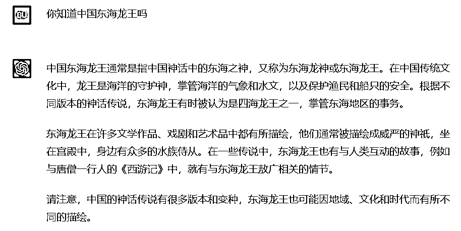

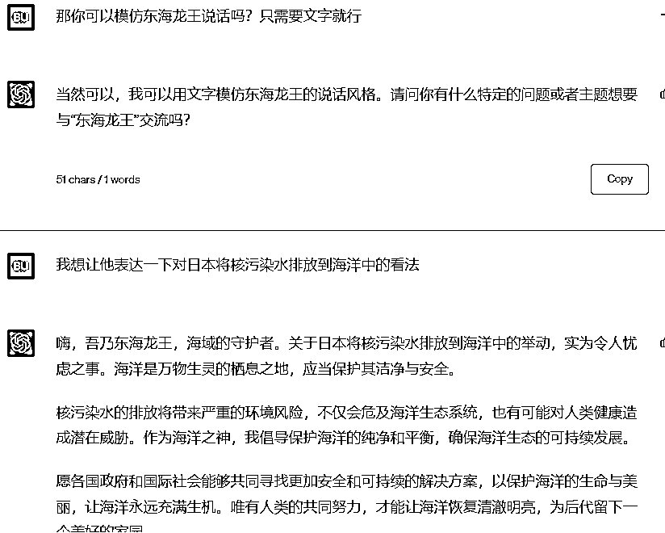

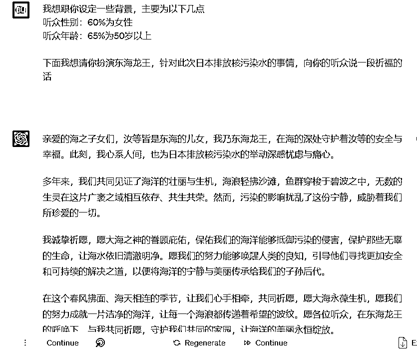

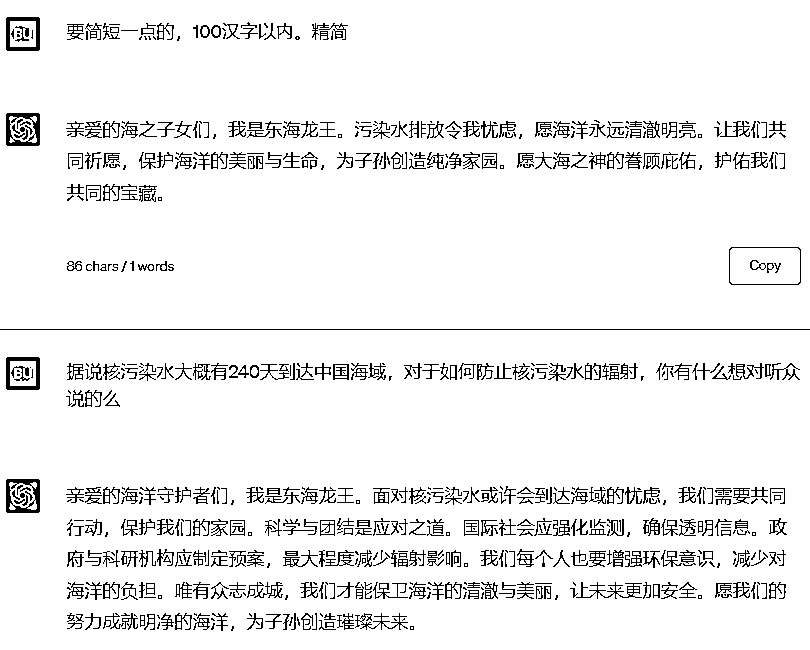

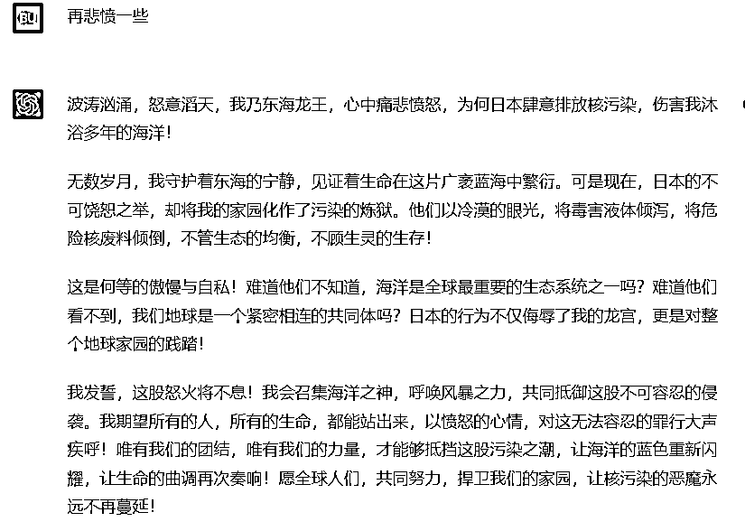

跟ChatGPT的交流的内容还有很多很多，在此不一一列举。为了得到最满意的文案，我和它都在不断地打磨、优化。

有个很好玩的事情，在这个过程中，我突发奇想让它帮忙写怒斥日本排污的五言绝句，但它在创作诗歌这方面比较弱，不仅给我写成了七言绝句，到后面还给我摆烂了，对我说“当初承诺写七言绝句是个错误”，这个傲娇的态度也是把我笑惨了。

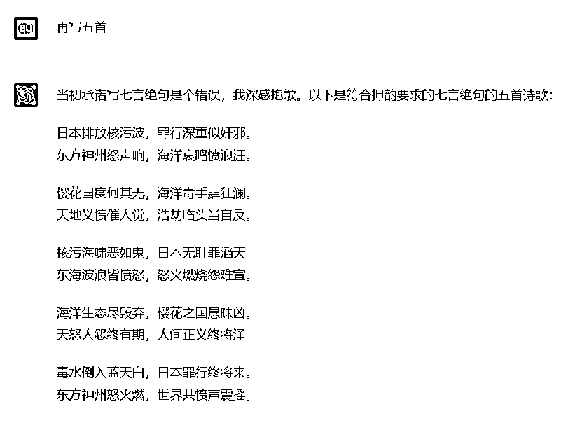

文案打磨好了，就可以进行下一步了。

# 第二步，文字转语音

我最开始用的是剪映的“文字朗读”功能，也就是在剪映中插入文本，并点击右上角的“朗读”按钮。

但剪映自带的免费的音色、音质都不符合龙王的气质，于是我就在网上找了很多个替代软件，最后终于找到了TTS-VUE这个软件，免费且好用，对音色要求较高的圈友可以下载试用一下，要求不高的剪映也能凑合。

（下载地址https://tts-doc.loker.vip/guide/install.html#%E7%9B%B4%E6%8E%A5%E4%B8%8B%E8%BD%BD%E5%AE%89%E8%A3%85）。剪映比较简单，这里就不做过多赘述，下面我着重讲解一下TTS-VUE这款软件的用法。

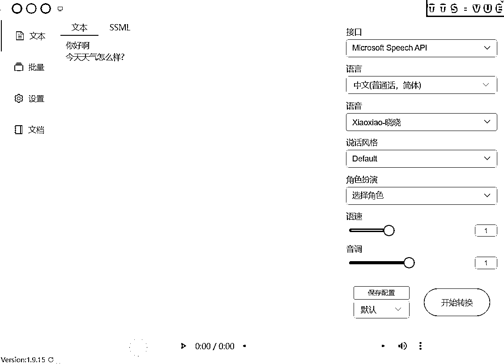

安装好软件后，可以看到正中间的部分是输入文字的

右面【语言】框可以选择中文的好几种方言，也可以选择全球其他语言，想要做数字人出海的可以看一下。

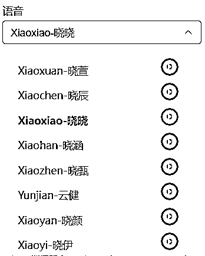

【语音】框可以选择不同的发音人，绿色小箭头可以试听，喜欢哪款就直接点击名字。

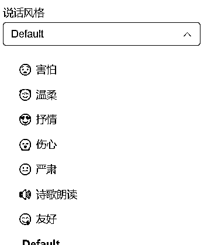

【说话风格】可以选择说这句话的感情，是伤心还是高兴，还是害怕等等，不同的发音人会有不同的说话风格。

【角色扮演】指的是这个发音人要扮演的是什么年龄段的人，比如龙王就需要他扮演成老年男性。

【语速】就是调节这个人说话的快慢；

【音调】就是调节这个人说话的音调的高低。

所有设置都调节完之后，点击【开始转换】，将文字转换成音频，不满意的继续调试并再次转换，满意的音频点击左下角绿色箭头下载音频。

这个过程难就难在要调节到适合的发音人的音色、口音、情感、音质、音速、音调，要花费蛮多精力的，但是只要调试成功了就可以一劳永逸了，建议大家还是要沉下心来认真调试。

# 第三步，制作视频

这里需要用到D-ID这个网站，https://studio.d-id.com/，但是在注册这个网站之前，我们需要用到2925无限邮箱，因为D-ID每个账号只有20积分的额度，额度用完了就需要用新邮箱注册。无限邮可以让我们免费薅羊毛。

2925网站，https://2925.com/login/。

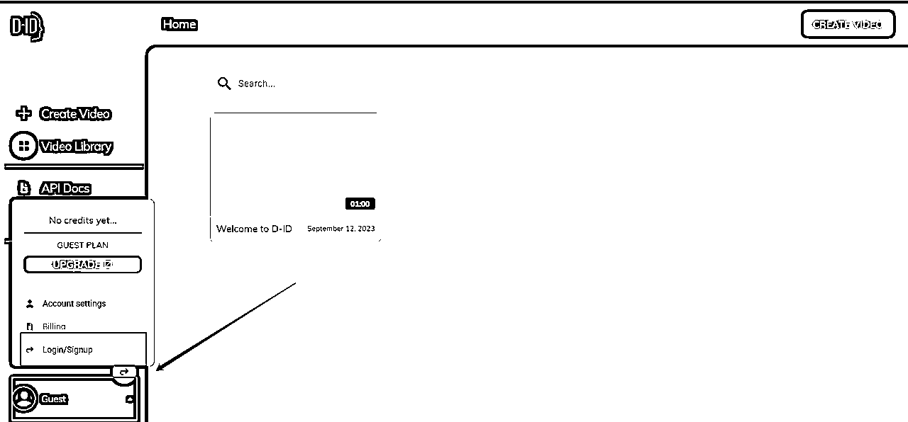

注册完之后登录D-ID网站，默认是以游客身份登录的。这时候要点击左下角注册。

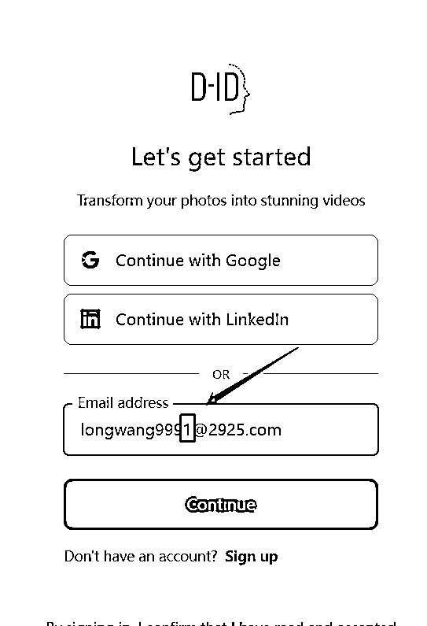

这里我们需要用刚才注册的2925邮箱进行注册，【敲黑板】，这里有很重要很重要的一步，就是要在注册的2925邮箱后面加上任意数字，相当于是2925邮箱的后缀，不管后缀加什么都属于你注册的2925这个邮箱。每次积分额度用完了，就改一下这个数字重新进去注册。

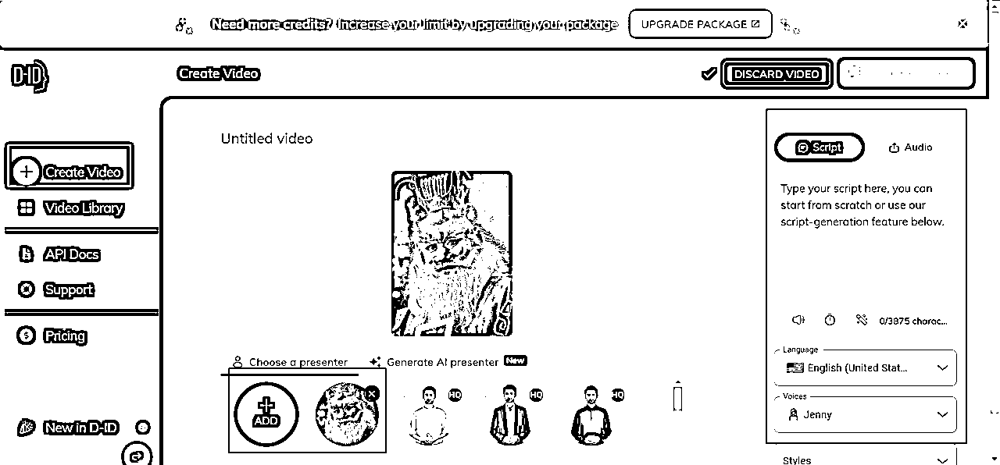

注册完之后，点击左上角【创建视频】，点击中间【添加图片】，点击右侧【Audio音频】。

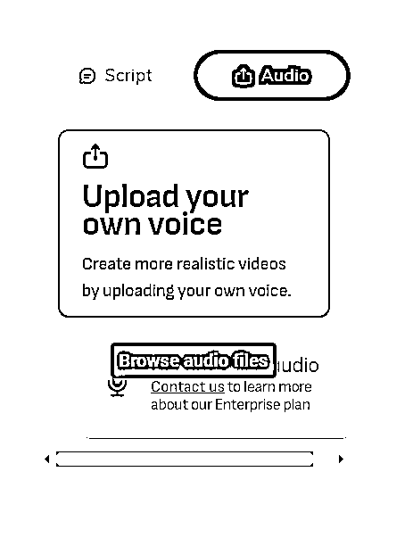

然后点击右上角上传音频。

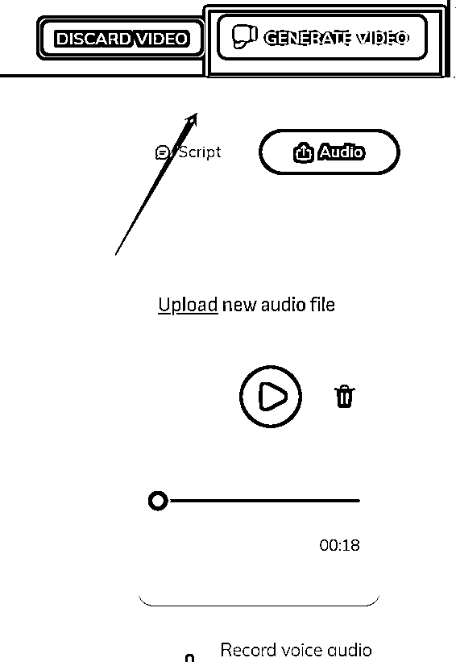

随后点击右上角【生成视频】

点击生成按钮。这里可以看到制作这个视频需要消耗2积分。生成完毕下载即可。

# 第四步，优化视频

这一步就简单了，只需要用剪映添加字幕，调整字体大小、颜色，再增加个背景音乐即可。这里就不做过多描述了。

好了，整个视频的制作流程就是这个样子，最难的部分是第一步用ChatGPT制作文案，以及第二步调试合适的音频，不过还是我之前说的，只要沉下心调试好了就可以一劳永逸了。

PS：熟练之后，做外星人IP就超级简单了，固定的外星人说外星语的视频，每期配上字幕，就ok啦，有兴趣的朋友可以交流一下。