# 汽修小工转职互联网自由职业者，5年靠自己首付180w买房，我不是大佬，但我是过来人，讲讲自己的真实经历，并给刚踏入互联网想找到属于自己事业的朋友一点启发

> 来源：[https://tpsqdzww1o.feishu.cn/docx/NBxRd0I9No8mtyxYUJgcilkgnWd](https://tpsqdzww1o.feishu.cn/docx/NBxRd0I9No8mtyxYUJgcilkgnWd)

大家好，我是王百万，坐标山东青岛，今年四月刚加入生财

说起来也很可笑，加入圈子之前我认为自己真的很优秀，毕竟在我身边的同龄人并没有一个做的比我好的，但是加入圈子之后仿佛刘姥姥进了大观园，面对一个个年入百万，月入几十万的一些大佬，我被他们狠狠的扇了几巴掌，把我从自傲的梦境中扇醒

所以现在我并不认为自己是多么牛逼的大佬，仅仅是在互联网略有小成罢了

写这篇文章也是因为一个契机，一个身边的朋友刚踏入互联网一年多，走了很多的弯路，踩了很多的坑，跟我夜聊了许久，才发现现在很多刚踏入互联网的新人都特别的浮躁，大部分都是因为看到某些人因为某个项目赚了很多的钱，于是也躬身入局参与进来，结果却被啪啪打脸

所以这篇文章讲讲我是如何从一个叛逆辍学修车到踏入互联网行业，并一步一步实现在青岛买房的

## 一：辍学打工之旅

我是于2016年考入职高五年制，汽修专业，只呆了1年多，2017年辍学打工（那所职高教育环境差学不到东西）

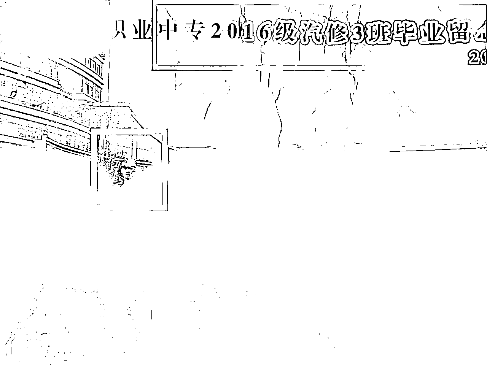

17年中旬就开始找工作了，找了一份专业对口的工作，汽修工，因为并没有工作经历，所以一直在做学徒，没有工资，但是管吃管住，算是能勉勉强强生活的下去，这样的日子持续到年底过年，老板只发了200给我回家

从那一刻起我就知道，打工没有出路，明年我也不会再来了

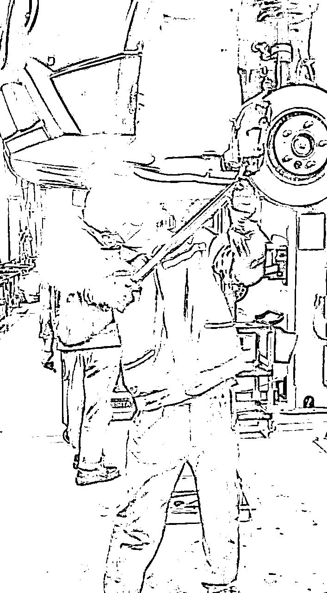

## 二：踏入互联网之路

18年年初，当时机缘巧合下在网上认识到一个朋友，属于微商再卖护肤品，看他朋友圈天天晒拿着一个手机就出去旅游，边玩边赚钱，着实羡慕，后面聊聊发现挺投缘的，还都是一个省，于是直接搭车来到了青岛跟着他学习

当时身上就300块钱，做大巴过来剩下200，用这200全身家当请他吃了顿饭，住在他的工作室，跟着学习了一段时间，当时每个月也勉勉强强，一个月有个五六千的利润，对于当时的我来说也不少了，但是我不满足于此，开始想办法思考

想着纯引流卖货好像信任度很低，于是后面自己一个人跑到北京考取健康管理师证书，学习皮肤知识，找工厂给自己办了个认证过的讲师证书，至此从一个微商变成了皮肤导师，搭配护肤品卖货单价也上来了，销量也高了，赚的也多了，至此这一年到年底，存在小20w

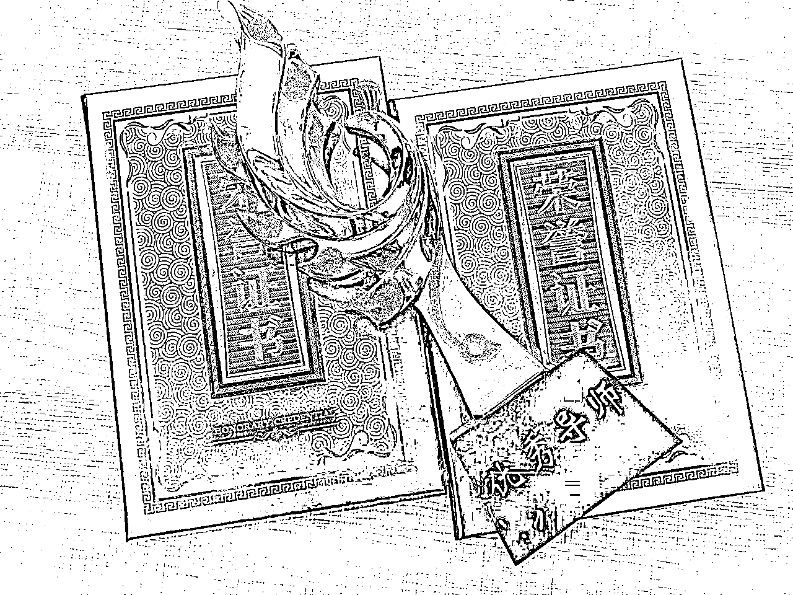

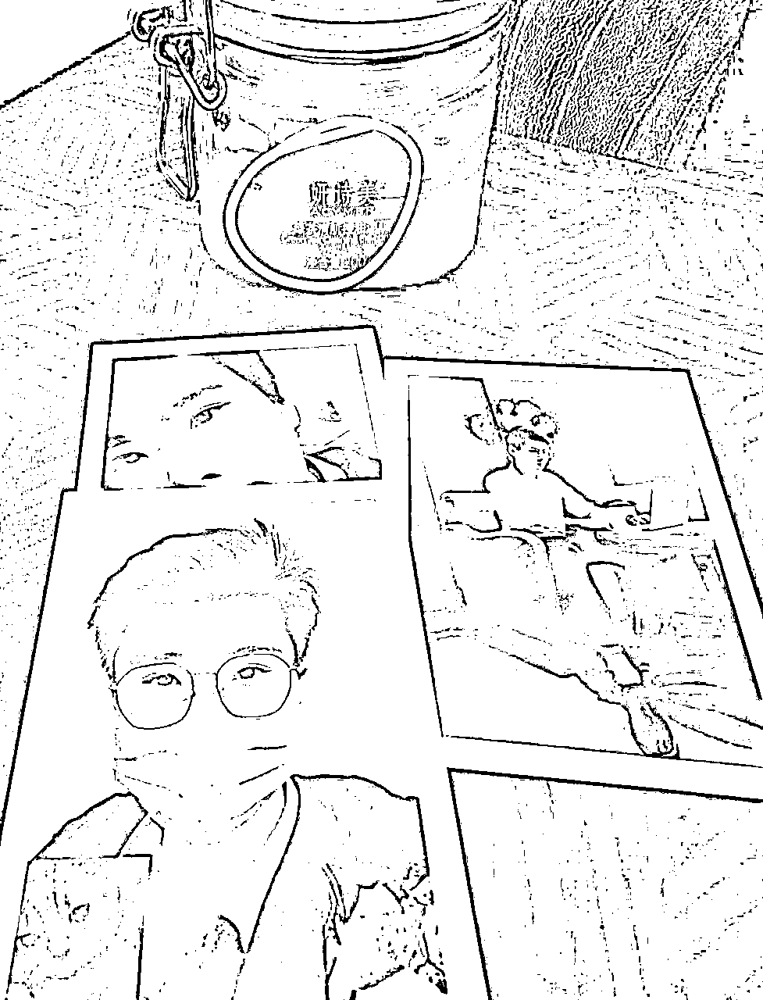

当时是这个品牌，应该有很多人熟悉或者是接触过，附上几张当时作为护肤老师的照片

## 三：转型失败之旅

19年开始进入了低谷，同行竞争也高了，用户被教育的也多了，各种各样的销售套路层出不穷，于是我再考虑要不转型吧，不做微商了，我自己开个网店

我是一个经常有很多点子的人，也是说干就干的人，于是我开始研究布局淘宝，和闲鱼，不会做怎么办，那就报课学呗，但是不知道为什么代运营这个词出现在了我的面前，当时并不知道这里面的套路，经过销售的一顿忽悠，成功花了2w块钱找他们帮我代理运营店铺

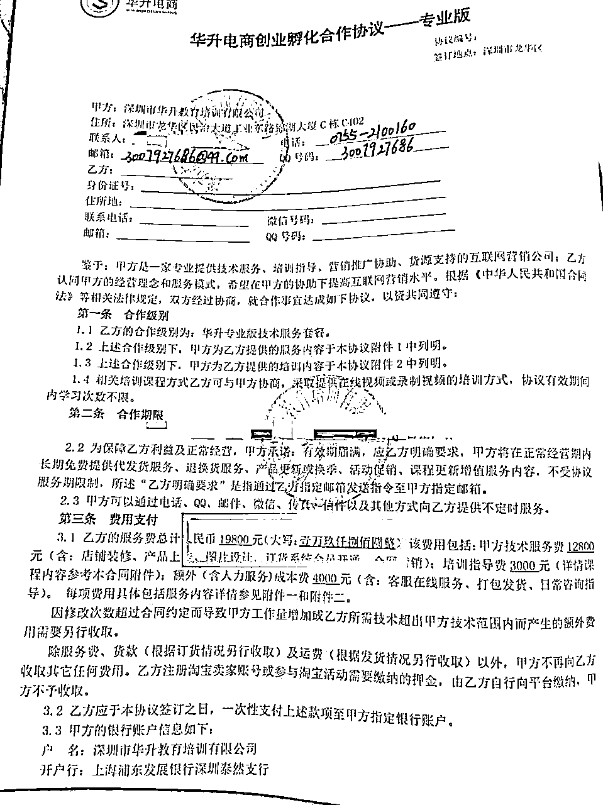

我以为这就可以了，没想到还要各种保证金，以及刷单的费用，加上我屯的产品，前前后后投入了10w左右，加上生活费和公司的开销，基本赚的钱所剩无几，关键是淘宝一点起色没有，我自己做的闲鱼倒还有点收入，一算到年底没亏钱都算好的，我一想这不行啊，一个月没联系他们是不是偷懒了，结果tm，一联系没信，一看特么公司跑路了，我丢，这还了得

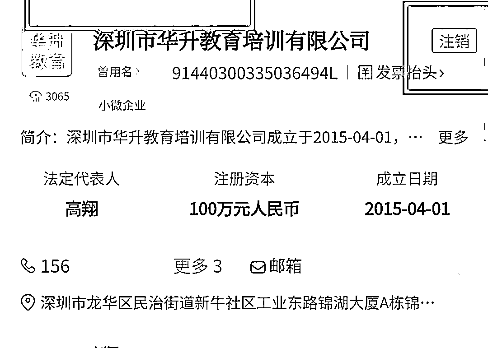

淘宝一点起色没有，也找不起运营，自己又不会，开着店铺还不够闹心的 ，索性就把店铺关了，第二次创业也算是以失败告终

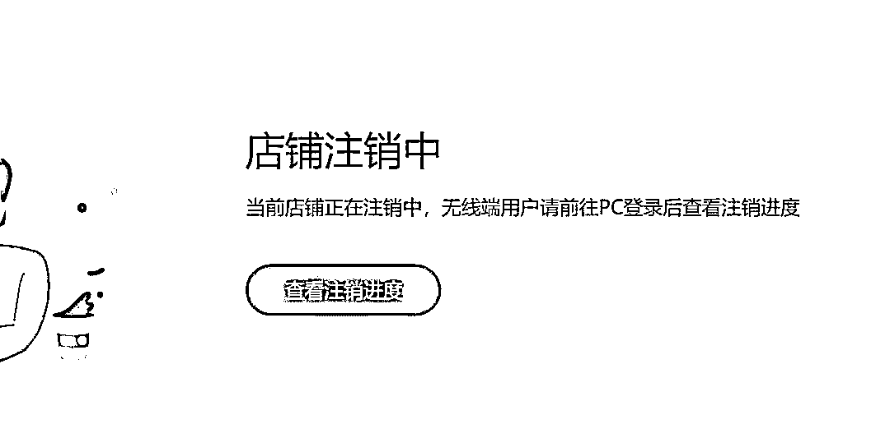

## 四：低谷期寻找机会，蓄势待发

20年因为淘宝店注销了，剩下一大堆货，零零散散的在闲鱼上卖着，当时赚的不多，只能当作副业，想换一个方向发展

那会直播带货很火，我想要不我也去做直播带货吧，我长得也不丑，说话也利索，说干就干，不会怎么办？在学呗，但是这个东西又没人愿意单独去带你，于是我就开始找工作潜伏到公司里面学习

因为没有经验，给我开工资底薪只有5000，但是运营大哥人很好，教会了我很多东西，大概做了半年的时间，基本天天都黏在运营大哥身上，请他吃饭，就是为了学到更多东西，后面基本的东西都摸透了，想着还是自己干更好，于是自己又开启了第三次创业

## 五：直播带货创业之旅

经过前两次的创业经验之后，这次创业更加谨慎，不在去囤货和投资，以最低成本去试错，有了直播带货的经验和优秀的成绩，去找合作的商家更简单上手一些

筛选了几个工厂，最后敲定了青岛的一家面包厂合作，李沧那边的青岛人应该都熟悉，抖音200w粉丝，我的利润来源于销售分佣，于是整个20年和21年这两年的时间全力以赴在直播带货（最高单场在线1w+，2小时销售额20w，全月销售额500w左右）

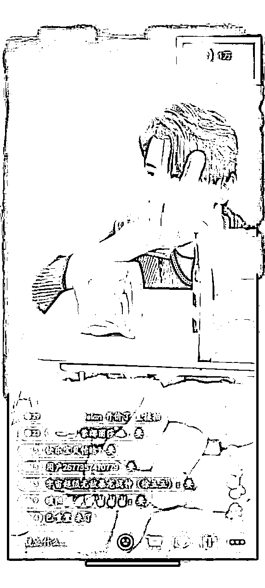

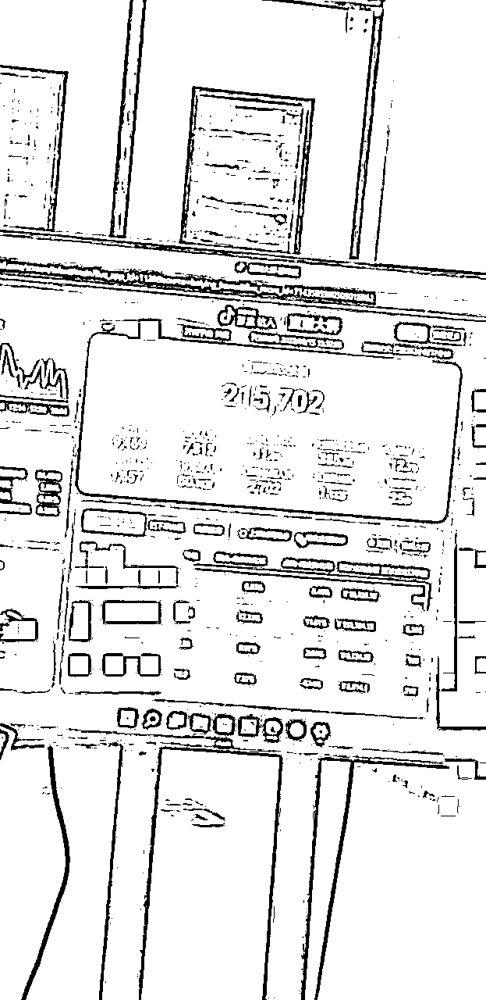

一天直播4-6小时，上下两场直播，有的时候为了测数据整宿不睡觉（跟工厂老板的聊天）

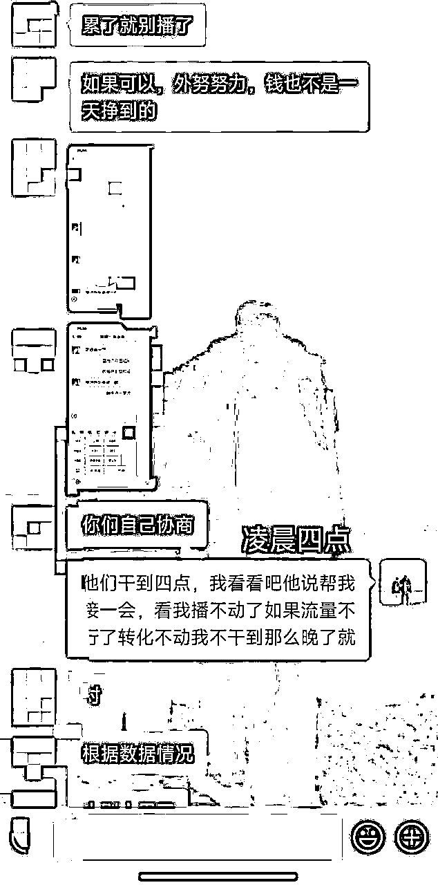

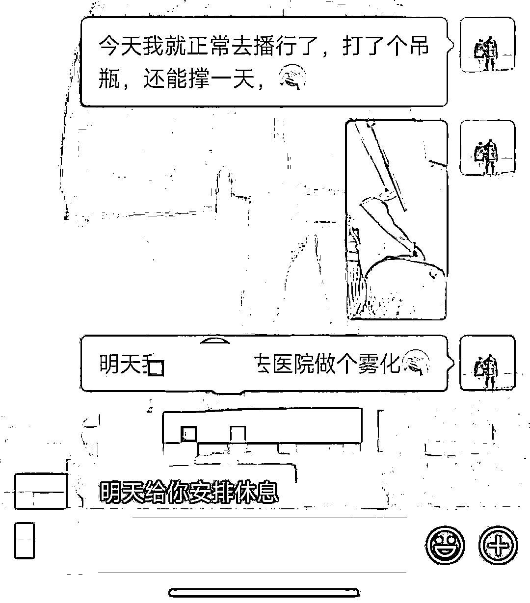

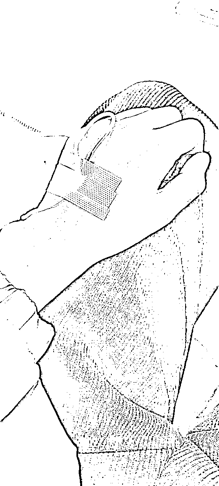

那会虽然赚的多了，但是三天一雾化，五天一吊瓶，嗓子扛不住，身体也扛不住了，医生告诉我扁桃体严重肿大，如果在反反复复的发炎就要做手术了，于是不得已不在做直播了，（但是后面也有合作过厂家，做运营，招募主播去代播，效果一般，就慢慢放下了）

## 六：一切都是最好的安排

虽然没有在继续直播行业了，但是还记得我19年就开始做的闲鱼吗，到了21年年底，虽然没有继续直播行业，但是我在闲鱼团队，我的闲鱼开始有了起色，虽然赚的没有直播那么猛了，但是依旧也很可观，关键是比较轻松自由一些

22年开始全职去做闲鱼无货源，为了扩大，去带团队，线下跑厂家找货源，积累到现在我们团队有1.3w个学员，筛选出了几千个产品，对接了几十个真正的厂家货源，带出一批又一批优秀徒弟，开发了更多高客单高利润的产品

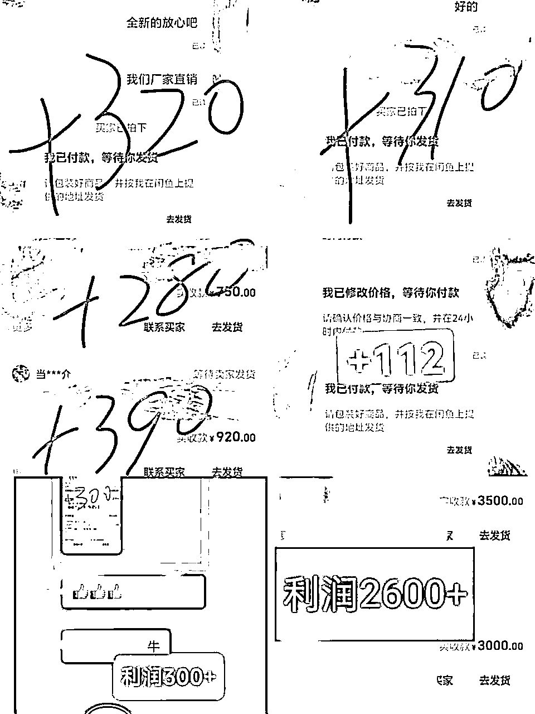

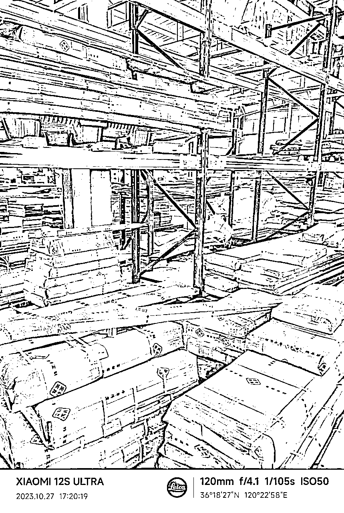

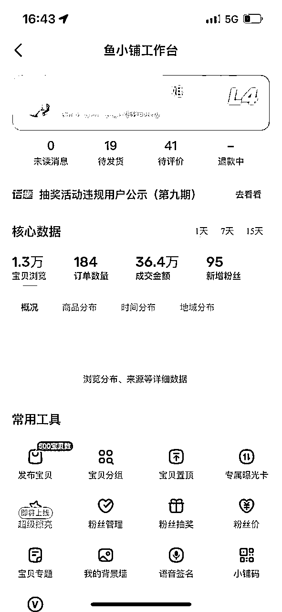

（合作的厂家，我们给卖的销量）

闲鱼无货源虽然是很久的项目了，持续到现在依旧有很多人去搞，也恰恰说明的他的市场，我也是打算把我们团队继续做大，闲鱼深耕了第一个5年，还要继续深耕更多的五年，做就拿出当成一辈子的事情去做

在去年，终于我也奖励了自己一套属于自己的房产（103平，2w一平，首付180w，贷款30左右）

至此完成了人生中第一个台阶，对了，我是00后

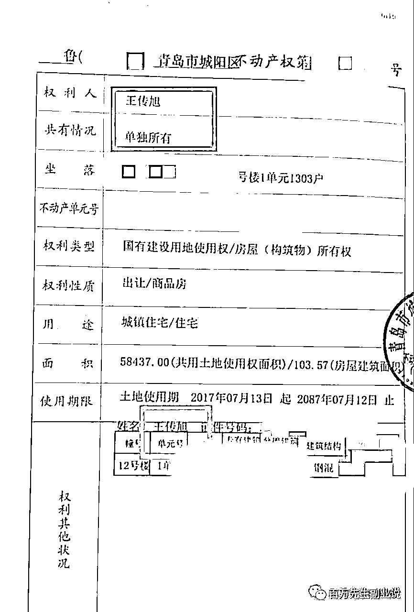

## 结尾：来点鸡汤吧

慢慢的其实我发现一切都是最好的安排，我在创业的过程中经常会遇到很多的问题打乱我原有的计划，虽然我不确定未来的路会发生什么事情，但是做好当下，尽人事听天命就好

做互联网也是一样，找到了一个想去做的行业，就拼尽全力去做，都说成功是需要努力+运气的，我运气一向不好，刮刮乐一毛钱都没中过，但是我能走到现在这一步，全凭借自己一步一步的努力+超强的执行力+不服输的劲

所以刚踏入互联网的新人一定会经历迷茫和焦虑，此时更是静下心来思考的时候，也不要看到别人发光就觉自己暗淡，有人三分钟泡面就有人三小时煲汤，慢慢摸索找到适合自己的行业就去深耕

我是百万，一个五年闲鱼无货源从业者，如果你对闲鱼无货源感兴趣可以一起交流

我也可以送你一份我写的《闲鱼无货源保姆级教程》

如果文章对你起到帮助，可以点赞个支持下