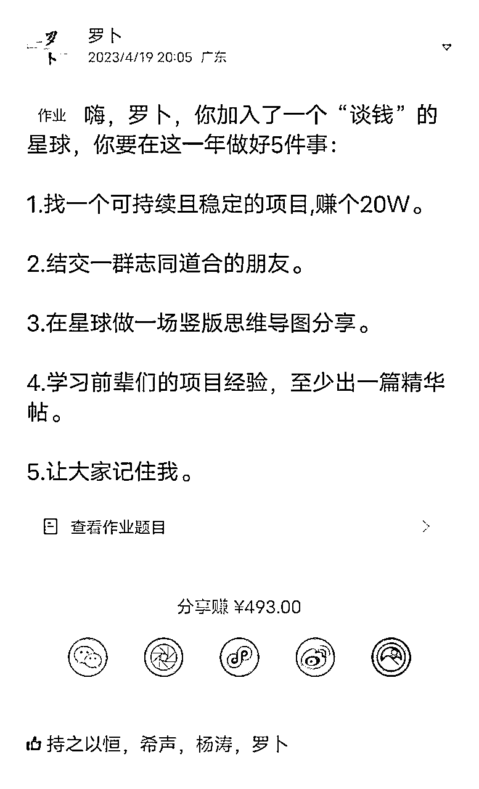
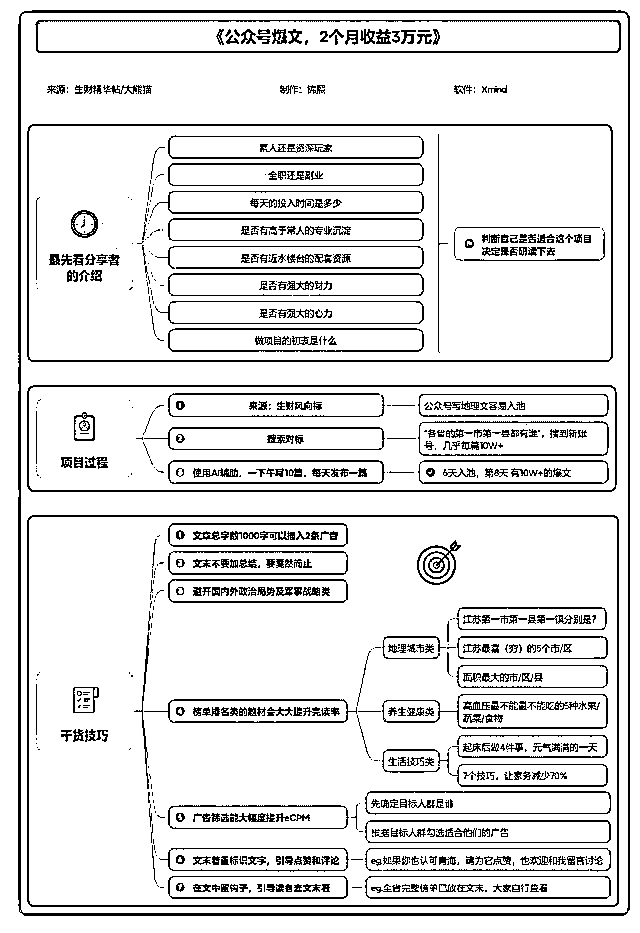
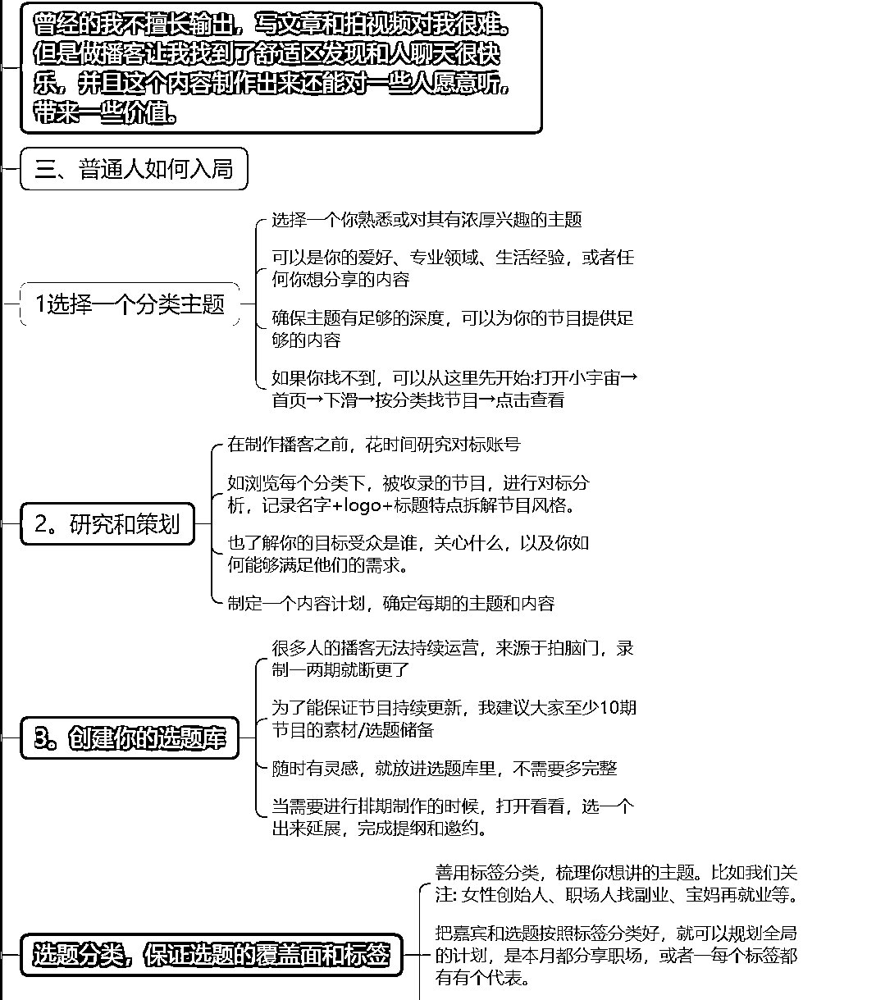

# 公开制作竖屏思维导图3个月后，应邀开办训练营

> 来源：[https://dakhb269es.feishu.cn/docx/NUgXdxjluoux3LxTFK8cxKTWnyb](https://dakhb269es.feishu.cn/docx/NUgXdxjluoux3LxTFK8cxKTWnyb)

【本文8300多字，内容较多，请耐心阅读】

大家好，我是今年418加入的圈友罗卜

生财研学社联合创始人，也被【搞钱女孩】陈雪老师邀请开导图训练营。

从4月还是小透明，5月参加航海和志愿者，依然还是小透明，度过了迷茫的3个月。

8月应胖大魔邀请，参加生财研学社共读《亦人益语》，通过制作竖屏思维导图，每日分享被圈友看见。

在8月航海前，组建导图小组，专做航海手册和高手分享，航海结束后被【搞钱女孩】陈雪老师邀请开导图训练营，帮她的用户学习竖屏思维导图。

非常感谢生财，今天想和大家分享:《公开制作竖屏思维导图3个月后，应邀开办训练营》一点点感悟，也把做竖屏导图的一点点经验分享。

# 一/我与思维导图的故事

学习思维导图应该算是比较早，但一直和大多数人一样，思维导图只是一个工具，工作时也只会做些会议记录，写点工作计划，做些工作总结；在生活中也是做点个人计划清单，阅读时偶遇会用导图做阅读笔记，也只是普通导图而已。

当我在网上看到很多不一样的导图的时候，我就想，是不是也能做出这么漂亮思维导图，尤其是竖屏思维导图。我就在网上搜了很多资料，买了相关的课程去学习，等我学习后，发现我要做的内容并不是很多，也没有那么强的需求，虽然学会了，但不知道如何去使用。

开始做的最多的还是普通版思维导图，就是创建一个文件，往里面填充自己想要的文字，还不知道可以插入表情和图片，甚至导图的其他高级功能也不会。

因上家公司要做一场直播，一个同事请来了她的朋友，在思维导图方面很有研究，做了一场直播分享，作为同事的我，自然也参与其中，把整节课都听完了，就这样思维导图在心中就埋下了一颗小小的种子。

虽然已经种下了一颗种子，我们都知道“种一棵树最好的时间是十年前，其次就是现在”，可我并没有把导图继续传播，去分享，更多的还是自己做完，自己收藏，甚至连朋友圈都不分享。这可能和很多人一样，有某个很有优势的技能上，就是不愿意去分享，也不想让他人知道。

然后就一直到今年加入生财，身边很多人也不知道我竖屏思维导图做的不错，加入生财3个月内，我也没经常分享竖屏导图导图，也没有通过竖屏思维导图去做点什么。

接下来就是我的竖屏思维导图作品的大量输出，从8月开始。

在8月共读《亦仁益语》输出21份，8月航海介绍带着导图小组输出108份，10月续航又在【IP朋友圈运营】输出21份竖屏导图。

通过这些输出，让我和【搞钱女孩】陈雪老师有了链接。在她的支持下，开展了一期【搞钱の思维】导图训练营；通过听直播做了一份导图也成功链接到楠姐，当然还链接了很多优秀的圈友，也帮很多圈友做了竖屏思维导图，把分享的知识整理成导图。

以上就是我的导图故事，接下来和大家分享导图给我带来了哪些？在分享前，先了解下竖屏导图：

## 什么是思维导图？什么是竖屏思维导图？

思维导图它是由东尼博赞创建的一种终极思维工具，其本质是重复和模仿发散性思维。

思维导图是一种图形化的组织思维和表达思想的工具。它利用图形、符号和文字等元素，将思维过程和结果可视化，帮助人们更好地理解和记忆。

竖屏思维导图是一种适应手机屏幕阅读的思维导图，它以纵向的方式来展示内容要点之间的逻辑关系，方便阅读和分享。

制作竖屏思维导图时，需要注意以下几点：

*   适应手机屏幕阅读：竖屏思维导图需要适应手机屏幕阅读，因此需要设置合适的宽度和字号大小。

*   突出中心主题：在制作竖屏思维导图时，需要将中心主题放在最显眼的位置，以便读者可以快速了解主题内容。

*   简洁明了：竖屏思维导图需要简洁明了，避免过于复杂和混乱，以便读者可以快速理解和记忆。

*   结构清晰：竖屏思维导图需要结构清晰，每个分支和子主题都需要有明确的逻辑关系，以便读者可以快速了解整个内容的结构和要点。

## 哪些人群需要制作和阅读竖屏思维导图？

竖屏思维导图适合于需要进行思维整理、学习和记忆的人群，以下是一些需要制作和阅读竖屏思维导图的人群：

*   学生：学生需要记忆和理解大量的知识，竖屏思维导图可以帮助他们将知识点进行整理和归纳，提高学习效率。

*   职场人士：职场人士需要处理复杂的工作任务和项目，竖屏思维导图可以帮助他们进行思维整理、计划和组织，提高工作效率。

*   创业者：创业者需要进行创新和创业，竖屏思维导图可以帮助他们进行思路梳理、战略规划和商业计划制定。

*   学术研究人员：学术研究人员需要进行复杂的研究和分析，竖屏思维导图可以帮助他们进行思路拓展、文献综述和数据分析。

*   个人爱好者：个人爱好者需要学习和掌握新的技能或知识，竖屏思维导图可以帮助他们进行知识点梳理、技能学习和实践指导。

*   自媒体超级个体：无论是你文字输出者还是视频输出者，当你把你的内容通过竖屏思维导图进行可视化呈现，又能增加传播效果，如：社群分享/直播分享/播客内容/精华帖/优质内容等。

*   资料整理需求者：做图文笔记分享在社交平台，让更多人看到导图来链接你。

竖屏思维导图适用于需要进行思维整理、学习和记忆的所有人群，可以帮助他们更好地组织思路、提高工作效率和学习效率。

我觉得刚加入的生财圈友也很合适，通过制作导图，去了解某个精华帖的内容，同时也能整理一份自己的数字资产。

## 竖屏思维导图和图文，视频的区别，为什么会喜欢看竖屏思维导图（换成导图制作对比）

## 竖屏思维导图市场的趋势和特点

*   市场需求增长：随着人们对思维工具和学习工具的需求不断增加，竖屏思维导图作为一种新型的思维工具，其市场需求也在不断增长。特别是在教育、职场、创业等领域，竖屏思维导图被广泛应用。

*   应用场景广泛：竖屏思维导图具有多种应用场景，如会议记录、读书笔记、听课笔记、社群分享资料整理、直播分享、播客内容制作等。随着人们对信息处理和知识学习的需求不断增加，竖屏思维导图在各个领域都有广泛的应用前景。

*   制作和分享便捷：竖屏思维导图的制作相对简单，只需要使用专门的软件或工具即可制作完成。同时，由于其卡片式的形式使得分享和传播变得更加便捷，可以通过社交平台、微信、朋友圈等方式轻松分享给他人。

*   价格适中：竖屏思维导图的制作成本相对较低，价格也较为适中，使得更多的人可以购买和使用它。

*   品牌竞争激烈：随着竖屏思维导图市场的不断扩大，越来越多的品牌和产品涌现出来，竞争日益激烈。各个品牌都在努力提高产品质量和服务水平，以满足用户的需求和期望。

## 目前合作案例

生财研学社，搞钱女孩，部分有竖屏思维导图需要的社群和星球，竖屏思维导图训练营，竖屏思维导图定制，资料整理，1V1咨询，案例展示如下：

生财研学社：

生财航海高手分享：

搞钱女孩，【搞钱の思维】训练营

生财研学社-导图营：

## 做竖屏思维导图需要具备以下品质和特点

*   思维能力：做竖屏思维导图需要具备良好的思维能力，包括逻辑思维能力、分析能力、归纳能力、总结能力等。能够将复杂的信息和思路简明扼要地表达出来，突出重点和层次，让人易于理解和记忆。

*   细心和耐心：做竖屏思维导图需要具备细心和耐心的品质。在制作过程中，需要注重细节和排版，将信息进行分类和整理，确保信息的准确性和完整性。需花费一定的时间和精力进行编辑和美化，让思维导图更加美观和易于理解。

*   学习和创新能力：做竖屏思维导图需要具备学习和创新的能力。能够不断学习和探索新的方法和工具，提高制作技能和水平。需具备创新思维和开放心态，能够尝试新的思路和方法，制作出更加实用和有价值的思维导图。

*   热情和专注：做竖屏思维导图需要具备热情和专注的品质。能够热情地投入制作过程，专注于每一个细节和环节，保证制作质量和效率。对自己的工作成果充满自信和自豪感，不断追求卓越和进步。

这些品质和特点将有助于提高制作水平和效率，为你的工作和学习带来更多的便利和效益。

在你没有开始之前，要想清楚为什么做导图，竖屏思维导图在短期是很难赚到大钱，但可以让你被看见，让你通过竖屏思维导图破圈。

* * *

# 二/我是如何开始做竖屏思维导图的

前面也提到我与导图的故事，这里就不多赘述。

在未接触导图之前，我都不知道竖屏思维导图可以做这么多不同的场景，去展示。

我也不相信导图可以给我带来什么，只是觉得导图只是一个工具，一个整理资料的工具而已。

所以，我开始做导图至少加入生财之前，导图只是我一个做阅读笔记和工作相关的辅助工具。

## 我是怎么开启导图之路

在未加入生财的时候，也在朋友圈尝试卖过课程，发起了几次直播，也确实有些人加入，但最后私聊几位好友，都只是对这个感兴趣，也不会拿这个应用在工作和生活当中，几次后很失落，也很沮丧，也对自己没有信心。

偶然的一次，看到朋友圈有人分享，做一个课程见证群，又在一起开启组建社群，把社群设定9.9元，也吸引了30多位加入；因为是见证课程见证群，我需要在7天内录制7天的课程。

开始录制课程，我也不知道用哪个软件，也没有专业的设备，就只有手中的电脑，那就用OBS去录制。

连续一周录制完成，参与的小伙伴只有几个跟着学习也都配合的完成了作业。课程结束后有几个好友都私发了红包对我表示感谢。

让我看到了一点点希望，想着带着这个录制课在朋友圈继续招募下一期学员，然而现实并不是总是让人如意。

我看着自己的微信通讯录，结合我对人群的分析，发现通讯录上的人好像并没有这方面的强需求，当然我也没有一个个去私聊。（我很怕私聊打扰对方，不过现在就不会这么想）

另外也看到了朋友圈，有好友在朋友圈分享生财新一年的拉新活动，虽然前两年就加了某个鱼丸，但一直没有加入。

这一次加入是基于想去找个新圈子，在一个旧的圈子待久了，很多时候就很难接受新的思想，也不知道外界的一些变化，私聊好友，就加入到生财，后面才知道加入的是【梁靠谱大佬的战队】。

## 当我加入生财时，并没有开始制作导图

今年418加入生财，开始一直在靠谱战队的陪伴群围观，学习；也在星球不停的看帖子，什么帖子吸引我就看什么，也没有啥目标， 开始还会写点读后感，写着写着就不想写了，这些大佬都这么厉害，我啥也没有，看得多了，信心都被磨灭了，觉得大佬就站在山顶，而我只是一个刚刚登山的人，虽然看得到他们，但够不着。

看了一个月的帖子，每天都会花几个小时，看的多了，就开始迷路了，感觉这个自己也可以做，那个自己也可以做，这里做一下，那里做一下，每天就这么在这种状态下煎熬，也没有找到合适的出口，也不好意思去问，害怕开口，害怕大佬不理我。

终于等到第一次参加航海，当时报了【小红书运营】志愿者和【共读风向标】航海，顺利的当上志愿者，也是因为之前有个几年的志愿者发经验，让我又回到当志愿者的身份去帮助更多需要帮助的圈友。

在航海期间我只做了两张嘉宾分享的导图，并没有做其他，也依然只是默默的跟着航海，航海结束后，发现自己的执行力也不怎么样，也没有看到效果，又开始怀疑自己，再一次陷入困惑。

5月份，只做了这两份，毕竟来生财都来搞钱的，谁会认真的看图呢？（后面发现并不是这样，还是有不少圈友会看）

## 开始加入生财同城社群，遇贵人

也是因为在志愿者群，第一次担任生财航海志愿者，认识了很多同城圈友和家乡的圈友，在航海结束后，就只加了一个湖南地区的小群，那会也并不活跃，因为群里的人员都分散在各地，没有线下活动就很难聚集，那么也就很难有交集。

突然的一天，胖大魔出现了，整合了湖南地区好几个小群，我也跟着加入到湖南圈友生财大群，就这样我和胖大魔开始有了交集，在这之前我并不知道胖大魔，后来得知他也是今年418加入生财的。

在湖南群聊天的时候，发现我和他有着共同的经历，在深圳待过，也在汽车行业工作过，还喜欢跑步，基于这几个因素，我俩正式加了好友。

在7月尾，我被胖大魔邀请到一个共读群，也都是生财的圈友，组织共读《亦仁益语》，基于我有几年共读的经验，我就申请加入了。我记得那个群开始只有30多人，坚持了一段时间，就计划让更多圈友也加入共同学习，抱团成长等。

在胖大魔和老侃的组织下，组建了【生财研学社】，发起共读《亦仁益语》，让原本的社群一下子增加到300多人，都是生财圈友，共读主要由生财研学社的成员来分享，分工协助，我选择了分享，那会也没有想着做导图，只是觉得在他们的分享结束后，我用导图做了知识的整理，也分享在几个人的小群。

被胖大魔分享在共读大群，就这样我开始看到了大家对导图的喜欢，对导图的喜欢，让我看到导图是可以让大家收藏和分享传播的。

之后我就在每天分享后，做好导图分享在共读群，这一坚持就差不多一个月，完整的做了21张竖屏思维导图。这段经历让我导图的质量也有了质的提升，也想着帮助更多人去制作竖屏导图。

命运的此轮开始动了.....

## 组建竖屏导图小队，协助8月航海

选择在生财研学社做内部培训，让每一个想做导图的小伙伴都来学习，组建的时候已经开始招募8月航海志愿者了。

开始给大家线上培训，生财研学社的几个小伙伴参与，和大家说了导图的基本介绍和竖屏导图的转换及相关事项，好在大家都有基础，学习效率也很高，就这样先安排大家从航海手册开始练习，实战。

【分工】自己报的哪个航海，先做把往期的航海内容先做，等新的内容更新后再补充，调整，美化。如一艘船出现多名成员都报了，那么选择一名为主要制作，避免重复。

【分享】航海期间所在船只的高手分享，周二和周四都安排对应的小伙伴去观看直播或整理图文分享，并快速在直播结束后分享在对应的船只和志愿者社群。

【实战】在开船的那个晚上，因挖坑的萝卜，做了一张直播导图，在各个航海被分享，很多圈友自发分享，就这样很多圈友知道有个生财研学社，生财研学社里还有一个专门做导图的小队，里面有个叫罗卜的人。

因我和挖坑的萝卜，都叫萝（罗）卜，还多次被圈友认错了，但这不重要，重要的是，竖屏思维导图被大家看见了，认同了，生财研学社也被看见了，当然我也被看见了。

航海前就把粥佐罗《学会写作1.0》做了成竖屏思维导图【《学会写作》竖屏思维导图，助力8月航海】

相信大家都看过我写的航海导图总结，里面有不少是参与小伙伴制作的

部分竖屏导图分享展示：

## 回顾加入生财的5个目标

目标1：我相信应该不远了，因为我找到了方向。

目标2：也通过导图结识了很多优秀的圈友，且有合作。

目标3：在星球做一场竖屏导图分享，结合这篇文章也算是完成了。如果可以进一步给需要的圈友做分享也是可以的。

目标4：目前在星球也写了几篇帖子，虽然还没有到达精华，说明我分享的干货和实操还不够，需要继续努力，也把前面几篇分享给大家。

在这里我要感谢梁靠谱大佬，是她帮我改了这两篇稿，给了我写帖子的动力，也让我写的帖子被更多人看见。

目标5：让大家记住我，让我想起参加深圳活动，“原来你就是那个做导图的罗卜”我想，我应该是被记住了。

看到亦仁大大在帖子下的回复，让我看到导图的更多可能，也让我对导图制作充满信心，同时也在星球持续输出优质导图，让更多人看见，让更多人喜欢。

## 在10月航海结束后，命运的此轮再一次转动

10月IP朋友圈运营航海导图汇总

陈雪老师突然加我微信，也给我的帖子留言了，我是被大佬“盯上了”，我想大概应该是好事，加微信的前两天我和她一直对不上时间，只是给彼此留言，看到都会认真回复。

直到第3天，才腾出时间在晚上时间沟通，我深知这个必须要沟通了，前面也了解了陈雪老师的需求，这正是我可以做的，也能做的更好。

也都是基于我从8月到10月的不断输出，才被看见，就这样那天晚上通话了半小时，很多细节都没有敲定，我的课程陈雪老师也没有及时看，就说在她的【搞钱女孩】做一期【搞钱の思维】导图训练营，而且第2天就开营，这一期招募近50人。

在电话沟通后，陈雪老师就把课程大纲帮我列好了，按照这个进度去执行就可以，这本来是我要做的工作，她全给安排好了。

这速度，这效率，很让我吃惊，也让我看到了机会，这个训练营得马上开展，还得认真去对待参与得每一位学员。

以下就是这期训练营的成果

## 导图训练营作品展示

搞钱女孩【搞钱の思维】学员作品展示

生财研学社-导图营(学员作品）

* * *

# 三/普通人如何开始做竖屏导图呢？

可以从以下几个步骤开始

## 选择一个主题

选择一个你熟悉或对其有浓厚兴趣的主题。也可以是你的爱好、专业领域、生活经验，或者任何你想分享的内容。

确保主题有足够的深度，大家对这些有着阅读兴趣的内容；

如果你找不到，可以从这里先开始: 找一篇精华帖或者你感兴趣的优质文章，阅读后尝试输出导图，总之人群需求较大，且大家不愿意看长文，而你正好可以输出的。

多看，先选定位，归类自己属于哪个板块商业/文化/阅读/职场/科技/成长等......

## 找对标，多模仿

在制作前，花时间去研究那些优秀的导图作品和导图分享的账号，进行对标分析，记录名字+logo+标题特点，拆解导图风格

也了解你的目标受众是谁，关心什么，以及你如何能够满足他们的需求。

制定一个导图内容计划，确定输出的导图能给人带来价值。

前期多模仿，找感觉，导图做到了，需要有创新，有自己的想法；另外要经常做，经常分享导图，长时间没做，也就很难坚持，找不到新鲜内容也会很难持久的。

那么星球精华帖，社群分享，高手直播，优质文章，爆款视频/文章/图文笔记，都是可以去输出导图。

每天去各个分享社群，找不同的内容，同时制作内容重叠度不要太高，做好导图库，每一张导图做好命名和编号，方便后期查找。

我目前主要做的就是：航海手册/精华帖/社群分享/直播分享/热点内容等，人群主要还是愿意花时间看这些内容的人，职场人，创业类，副业类，读书人群等。

## 找到你的选题库

很多人开始制作，都不知道做什么，看到一些好内容就想做。

我们要保证导图有干货，有价值，且排版很舒适，可以行成统一的风格和样式，配色等。

等你看到一个内容，直接套模板，框架还是一样的，只是在不同内容鹅时候做一些调整，优化，同时根据分享内容配上不同色调。

前期不要过于追求完美，先完成比完美更重要，找到正反馈也很重要。

一般可以分几类：

热点类：就是某个老师在开年度分享，可以去制作，社群嘉宾等。

干货类：星球的优质内容已经很干了，那么是不是可以提炼输出导图，毕竟部分人看到太多文字就头疼，但看导图就不会。

兴趣类：你的兴趣，你想吸引的哪些人群，那你就往这方面去做。

其他类：这类可能不是你想做，但为了链接某个嘉宾，你也会尝试去做，获得嘉宾的链接等。

开始做不要太刻意追求某一类，前期先做量，后期考虑质和价值。需要做好长期坚持的准备。

## 如何制作竖屏思维导图

是的，终于到开始制作竖屏导图的讲解，首先我们要下载制作导图的工具，我推荐的有两款：Xmind和亿图。

这两款都可以制作竖屏导图，该社区也有很多优质的导图作品和模板，都可以跟着临摹，去学习等。

竖屏思维导图的制作步骤可以归纳为以下几个方面：

*   确定中心主题：确定需要制作的中心主题，将其写在思维导图的中心位置，选择【逻辑结构向右】

*   列出要点：围绕中心主题，列出与之相关的要点，每个要点都是一个独立的观点或主题，然后延申。

*   添加分支：将每个要点作为子主题，向下或向右添加分支，表示它们之间的逻辑关系。

*   标注连接线：使用连接线将各个分支之间的关联标注出来，以便更好地理解它们之间的关系。

*   添加关键词：在每个分支上添加关键词（提炼文中的关键词），以描述每个思想或概念的含义和内容。

*   调整布局：可调整竖屏思维导图的布局，使其更加清晰易读。

*   修饰样式：可使用各种修饰样式来美化思维导图，例如颜色、字体、大小等。

做完一份导图，再检查一遍，有没有错误的地方，尤其是嘉宾名字记提到的人名公司名等，其他细节上也需要多注意。

### 导图制作及结构调整

新建思维导图

选择【逻辑图】结构

先把大概框架调整好，同时把大标题宽度设定在500-800之间，也就是整个导图的推荐宽度。

### 填充内容及内容提炼

内容提炼需要长期的练习和对文章的理解能力，可以用简短的语言去描述该段/句话的意思，同时也需要考虑阅读者也能看懂。

### 设定全局字体和导图样式（步骤可提前或最后设置）

重点说下：可以提前把全局字体设定好，选择你喜欢的样式；分支线条也是；导图样式【紧凑型布局】；

具体选择，可根据自己做的图去调整即可。

### 把所有内容都填充到导图上

到这里只是把内容都输入完成，剩下就是竖屏导图的美化，内容提炼，虽然这些内容有些提炼过，但为了整体效果还得继续提炼。

前几天和学员就分享这么一句“当你对这句犹豫要不要删的时候，那就删除，继续往下看”，很多时候，我们会觉得这也重要，那也重要，很多只是【自以为而已】。

### 导图基本设置及导图美化

基本设置(先把内容都提炼好,再优化)

全局字体：微软雅黑，注意字体是否商用，避免侵权

分支线粗细：极细

导图样式：紧凑型布局

全局背景：白色

大标题：字号24 宽度:550 标题填充颜色 #025A5A 字体颜色#FFFFFF 无边框

分支主题：字号14 宽度：根据内容选择推荐【80-100】 填充颜色 #007C74 字体颜色#FFFFFF 无边框

子主题：字号 12 宽度：结合分支主题，整体宽度不超过【500】手动操作 填充颜色 #FFFFFF 字体颜色#000000 边框：极细 颜色#000000

基本设置可参考，因个人偏好选择适合即可，仅作参考。

从前面杂乱的思维导图，转变成一张大的导图，根据上面的基本设定，做的更多的事情就是：复制，粘贴，然后重复等。

按板块添加外框,重点语句标记【加粗】或【改其他颜色】

子主题较空的地方适当添加[表情]或[图片]修饰

金句部分用不同形状或颜色或字号单独出来,与大标题宽度一致

需要更多是耐心和对细节的把控。

### 细节优化，及导出导图及分享

当导图生成后不止一张时,可以用序号标记[1/2/3...]

添加制作信息[软件/信息来源和分享人/制作人]

添加每一张导图外框,用于区分和整体设计协调等

如果你觉得文字看着比较累，我还准备了一个制作视频，分享给大家

到此，整个导图介绍分享完。

补充：

保存分享,保证图片质量比较高清；

想要内容更清晰,保存倍数可放大至200%：

若是截图有水印,可借助其他截图工具继续加工。

### 其他细节注意

1.  做完先分享给嘉宾本人,询问是否有不妥之处,有则改.

1.  可以分享在与嘉宾同一个社群,并对嘉宾的分享表示感谢.

1.  不要怕做错,也不要怕做不好,先完成,再完美.

也可以加上自己的信息（微信号/各种二维码等），方便传播，分布到其他社交平台

# 导图的其他思考

1.  通过导图链接大咖，可以是大咖写的书，也可以是大咖写的爆文。

1.  可以通过做的导图去分享在社交平台，让更多人看见你的竖屏导图。

1.  在Xmind社区分享作品，被官方人员看见邀请线下分享或其他合作。

1.  也可以制作优先星球的精华帖，播客内容，社群内容等。

1.  个人定制竖屏思维导图，帮助大佬做用户内部训练营等。

我是罗卜，加入生财半年，前3个月是小透明，后3个月通过竖屏思维导图分享，让更多圈友看到了我，也让我看到竖屏导图的更多可能，期望你我可以因导图走的更远，欢迎您来链接。

最后感谢生财有术，感谢我的朋友邀请，感谢靠谱大佬的指导，感谢胖大魔/挖坑的萝卜和生财研学社团队的支持，感谢陈雪老师的邀请，感谢参加我训练营的小伙伴，是你们让我找到自己，是你们让我把竖屏思维导图分享给更多人，让更多人看见。