# 新手做小红书旅游定制，完成0-1，2个月销售10w+

> 来源：[https://rkb79it24v.feishu.cn/docx/OCBzdGa3nokSXhxf8WZcvMXCnKf](https://rkb79it24v.feishu.cn/docx/OCBzdGa3nokSXhxf8WZcvMXCnKf)

哈喽，大家好，我是小掌柜，今年刚加入生财，是一名生财新人。刚进入生财犹如进入了项目的大海，眼花缭乱，非常的激动。大概花了2个月的时间看了各种项目也下场实操了，但都没有拿到结果。一方面是做的项目太多，另外也是没有专注和坚持下去。直到7月底遇到了恩师阿渡和易老师的旅游项目，跟着下场操作了旅游项目。

通过2个月的实操，从对旅游完全不了解，到目前的项目跑通，完成了0-1的阶段，成交了40多单，销售过10w+，分享复盘一下这2个月的实操情况，展示一下部分的成绩。

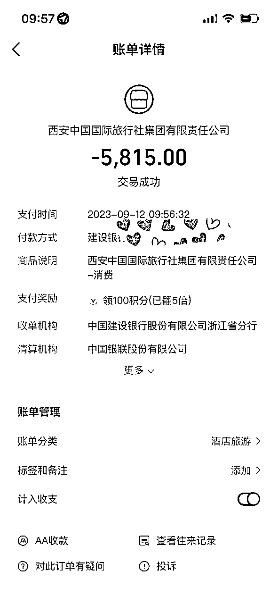

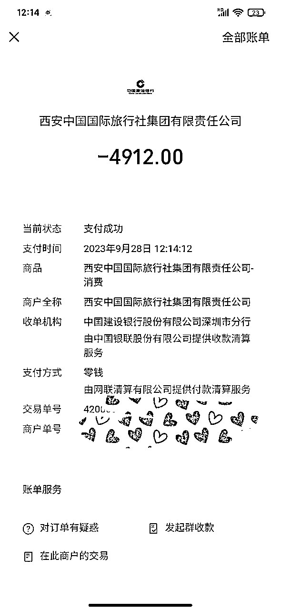

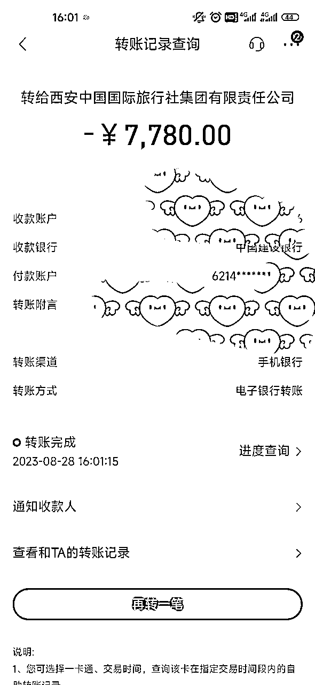

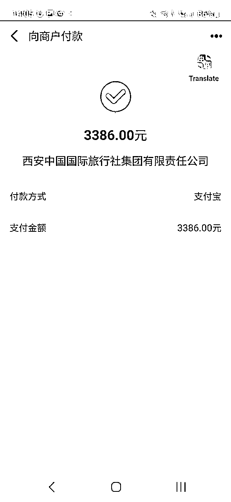

接下来给大家分享整个项目的过程，开始正文。

正文分为5部分：

1、成长的经历

2、心态和想法

3、实操的心得

4、如何成交？

5、总结

# 一：成长的经历

1: 个人介绍：我是小掌柜，之前一直是做传统电商的，今年刚加入生财，7月份中旬看到渡老师打算做旅游项目，我也感兴趣，所以就加入了学习，在这之前从来没有接触过旅游的项目。

2：目前的成绩：2 个月左右时间，从0-1，加了好友500+，将近50单，销售过10w+，最高客单价超过了2万+。已经完成了从0-1，在这期间，学习了小红书的操作，旅游的知识点，了解旅行社的流程。现在是进入下一个阶段，通过2个多月的实操学习，已经走上正轨，现在独立操盘高客单的境外旅游产品。

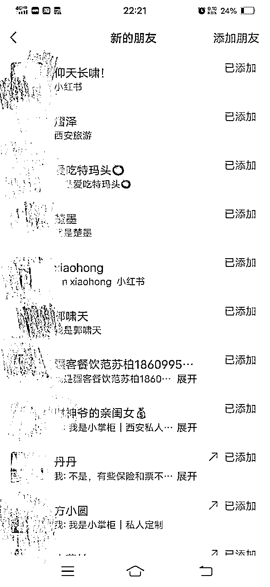

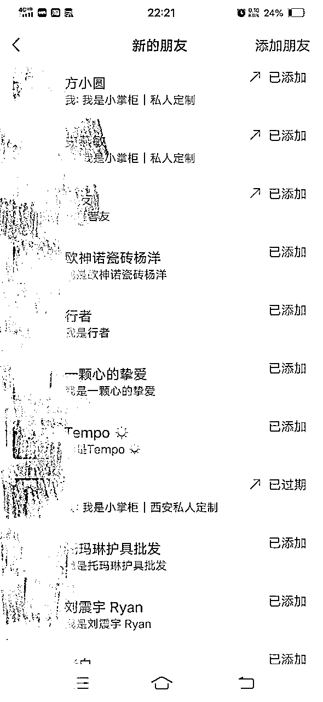

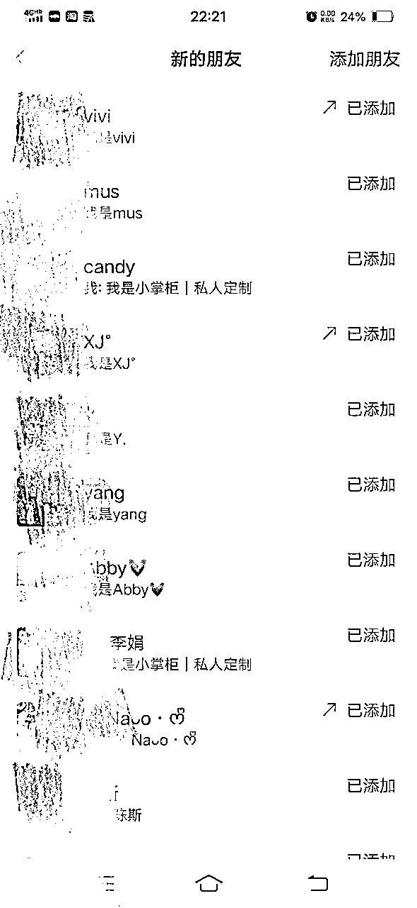

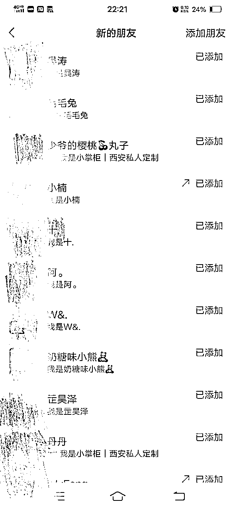

3：学习的过程和经验：

从7月17号首次听分享课开始学习，27号开始了第一篇笔记，29号晚上第一个咨询，一直到目前的咨询没断。在参加第一次的分享课以后，每次的课程我至少听3遍以上，反复听内容，并把重点的知识点记录下来，然后实操讲解的内容，再进行总结。

每次发笔记以后看数据，找出自己的内容和课程有哪些不一样的，同时根据老师的点评再进行修改，不断的打磨。 前面半个月的时间里，基本上眼睛一睁就开始学习，一直到凌晨才休息，几天后就开始有顾客咨询，但一直没有转化，又开始学习旅行社的知识，同时学习如何微信转化，于是开始陆续成交订单，一步一个脚印坚持了下来。

4：跑通项目的原因

自己的努力坚持和不断的学习，和我同期学的都放弃了，但是我一直坚持，听课+实操+不断迭代玩法，实操遇到的问题积极寻找渡老师的帮助，每周复盘自己的操作和问题点，把不足的点优化提升。

2个月时间跑通了旅游项目，并拿到了成绩，赚到了互联网项目的第一桶钱。10月开始拓展路线，目前已经独立操作国外高客单旅游路线，以及从个人的0-1阶段跨进搭建团队的成长进度，接下来将全力以赴的拓展国外高客单市场和团队的搭建。

建议大家如果遇到了看好的项目，一定要坚持，不然再好的项目不坚持下去都不会拿到好的结果，以我为例子，一起做的同学，一直到目前还在徘徊，还在找项目，而我现在已经完成了从0-1阶段，开始尝试从1-10，所以，坚持是非常重要的。

# 二：心态和想法

1：”首先我在做这个项目的时候，就非常看好这个项目，所以全力以赴的去操作去学习，同时也做好了短期之内没有什么效果成绩的打算，做好了长久的计划。同时先认真打磨基础，学习相关的知识点。待完成第一步以后，再进行放大。

2：想好计划，先完成第一步的5篇文章，然后总结，在进行第二批的笔记，反复优化调整。根据优秀的对标总结一套适合自己的笔记。用南非国父曼德拉一句话来概括：我从来没有失败过，要么胜利，要么学到了东西。没有数据是什么原因导致的，别人爆款的数据为什么爆？这样的拆解才能更好的模仿到核心，模仿到重点。

以上就是我在没实操这个项目之前的想法和一些决定，所以开始实操项目之后心态比较淡定，但不是躺平，而是不断的去学习，按照自己的节奏一步步前进，结果没想到，惊喜比我想象中来的快多了。

# 三：实操的心得

1.为什么2个月我能引流500+人？

①态度认真

首先在学习的期间，渡老师当时的分享是图文形式，一共讲了4节课。每一次的分享内容我会看3篇左右，第一次大概过，第二次看重点，第三次一个个过，一个个记录。 然后实操的时候再把课程拿过来，一遍实操一遍对着做，那段时间每天基本提交完作业都1点多了。

②刷对标学习同行

首先刷对标找到爆款笔记，每天刷20个左右，并把账户记录下来，然后学习他们如何聊天，如何介绍产品的，把他们的话术整理下来，结合自己的产品，形成新的优秀话术，方便自己的学习和使用。

③及时回复

小红书上有用户咨询，我基本上都做到了快速回复，哪怕是半夜2－3点都是做到了及时回复，所以那段时间完成了第一个阶段的顾客积累和订单成交，同时得到了正反馈，增加了信心。

④升级迭代引流方式

最开始引流还不严格，我都是直接发微信给客户。后面发现微信被屏蔽了，就开始尝试各种办法，比如图片引流，同义词引流，群引流等各种测试。通过不断的测试，目前一直在使用群引流，没有出现违规过。不好的地方就是顾客流失率比较大，不愿意进群，或者不回复了。现在已经进阶到企业号玩法了，以及投流，解决了这方面的问题。

2.如何拆解爆款笔记

在刷对标笔记的时候，要从封面，标题，内容框架等多方面进行拆解，研究和自己不一样的地方，进行一个个拆解，然后我们在进行模仿。

①首图：看对标的首图是以什么方式展示的。是九宫格，还是单个风景图， 文字排版、花体字、整体构图、色调等又是怎样的？

②标题：可以多刷一些同行的，只要是旅行的爆款笔记都可以记录下来，我们进行套模板修改即可，小红书标题，情绪价值很重要。

③内容框架：看他们布局了哪些内容，什么结构。如何排序的，整体的写作模板， 这里要注意企业号的问题，企业号有些内容个人号照搬容易违规。

④关键词：看整个内容，标题都使用了哪些关键词，如何布局关键词的。

平时遇到优秀的内容和素材要进行保存，逐步完善自己的素材库

3.了解旅行社的产品

通过旅行社提供的路线资料进行学习，同时自己也可以通过携程，途牛，百度等渠道，去深入研究每个景点的玩法以及怎么搭配的，对这一块内容最够了解之后，就能快速回答顾客的问题，这也是成单的重要环节。因为你会，所以你能回答。另外就是经常和旅行社沟通，有些顾客提出的要求可能现有的产品介绍没有展示，我们就得跟旅行社沟通一下情况，看是否能够满足。

①以西安为例：首先先了解西安有哪些游玩路线，每个路线有哪些景点，这样的思路去拆解记录。这样方便根据用户的需求，把不同的景点串起来游玩。

西安路线分为：市区，东线，西线，北线，演出。比较热门的景点都在这几条路线上

东线：兵马俑，华清宫为主比较出名的，另外就是华山也是接近这个路线的，华山需要单独的一天游玩。

市区：城墙，博物馆，不夜城，芙蓉园，十二时辰，钟鼓楼，大雁塔等热门景点。比如汉服的体验，驼铃传奇，千古情这些的演出也是在市区的。

西线：法门寺，乾陵为主打。还有一些别的小景点，相对来说西线的景点比较少。

北线：壶口瀑布，黄帝陵，这2个是热门的景点，缺点在于离市区比较远，来回有800公里左右，但看瀑布半个小时有点不划算，所以一般推荐北线路线建议2日游。把延安的景点加上，轩辕庙，王家坪 枣园等革命旧址

剩下的就是一些表演：热门的长恨歌，驼铃传奇，千古情，梦长安等表演。这里的注意点就是：表演票都要提前预约，有些不一定能约上，所以在介绍的时候，除非顾客需要，平时不要推荐。

通过以上对基础信息了解以后，再通过旅行社发的文件资料，以及对携程等平台的路线图的研究，基本就会对不同的景点路线如何搭配有一个大概的框架，所以前期学习阶段一定要养成把重点内容记下来的习惯。

路线问题解决以后，就可以继续了解关于行程中涉及到的部分，比如用车，司机，导游。车子一般是根据人数安排对应的车子，5座车，7座车，商务车等。西安这边的司机都是5年以上专业的司机，导游分为初中高等级，目前定制游大多数都是卡在导游上面，西安人比较多，导游都需要提前预约才能安排，不然有些门票没办法购买。

这部分内容，基本上就是我了解旅行社产品的整个流程，不同的目的地可能产品不一样，但是整个学习的思路差不了多少，主要就是有哪些热门景点，哪些游玩路线，不同的景点和路线怎么搭配，行程中会涉及到哪些东西等。

# 四：如何判断顾客意向，提升成交？

加上客户微信之后，首先询问顾客基本的信息：什么日期， 几个人，游玩天数，哪些景点。不管顾客上来怎么聊，你都要化被动为主动，把主动提问全掌握在自己手里，不然浪费你的精力。

①小红书端：如果你隐晦给到自己的微信之后，客户不愿意加或者说理解不了，那就放弃，不用再跟他多聊。

②微信端：如果顾客不愿意提供“什么日期， 几个人，游玩天数，哪些景点”这些信息，或者自己说不知道要去哪些景点，那么这个顾客你就不用跟他多聊了，意向不强。你想想，如果你想去一个地方旅行，不可能什么景点都不知道的，那种一个景点都说不上来的，多数就是打听打听，或者套行程。

加完微信了解信息以后，就要询问顾客的需求，是想要全程定制游（酒店/门票/车/导游/）还是小包团。这种就是在顾客聊天主动引导去了解信息。有时候聊天一半不知道聊什么的情况下。 然后介绍定制游的预算800-1200/天/人。 不合适就推荐小包团。

4.1案例拆解

A:9月份一家人想去西安游玩，怎么安排

D：你好呀，几个人尼

A：4个人

D：具体的日期有确定吗？打算游玩几天

A：15号左右，游玩3天

D：好的，之前对西安有了解吗，想要游玩哪些景点尼

情况1：

A：了解的不多。你那边推荐推荐吧

这种情况我一般就会发一些大的景点名字，想要来游玩的肯定会继续咨询你的细节，以及哪些他不想去的景点。如果没有什么回应或者考虑考虑的，那就养着，暂时不用进行跟踪，等后续朋友圈进行转化。

情况2：

A：我想要去XX景点

D：好的，那根据你发的景点以及我这边推荐的，给你排个初步行程以及预算。

这个时候为什么我没有问顾客选择定制游还是小团，而是这样的回复？

首先上面说了，有的顾客意向本来就不强，你询问预算之后对方不回复，你可能会以为是你报价太高，而实际的原因可能是，对方本来也就只是问问，并没有真正的出行意向。

所以这个时候，我们就会出个方案，如果顾客没有特别景点要求，游玩时间3天的情况下，都是给顾客推荐东线一天，2天市区的安排，然后再把这个初步行程发给顾客，并进行询问：

D：你好，你看一下这个初步行程合适不，不合适我们在沟通就行修改。然后根据顾客的情况来说。

情况1：顾客说没有问题，我考虑考虑。

这里就有一个问题：顾客没有问价格。真正想出行的顾客，基本上都会询问价格，如果连价格都没有询问，那就说明出行意向不强， 或者就是来套行程的。那么通过这个方法，我们既筛选了意向不强的顾客，同时花费的精力也不多。

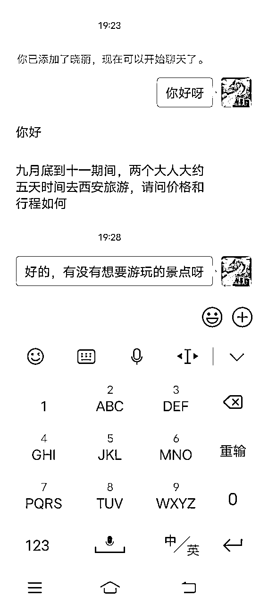

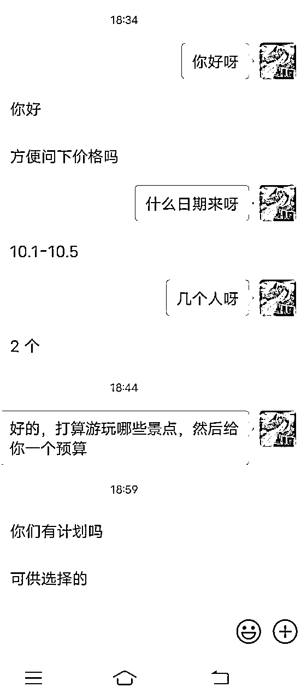

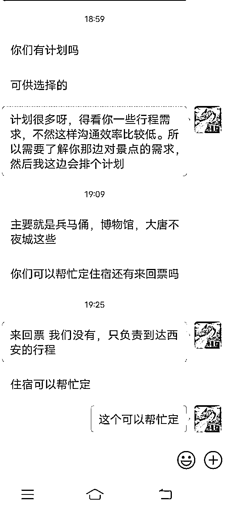

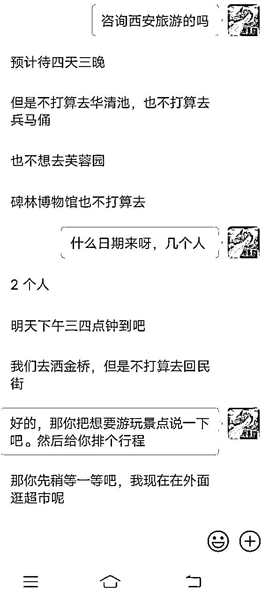

情况2：有意向的，就会问少费用呀。

那你这个时候问顾客选择定制游还是小包团。有些顾客会问两者有什么区别，那你把定制游特点介绍一下（24小时管家式服务，专车接送，纯玩0购物，专属导游等） 另外小包团，就是专车配备司兼导。 相关的费用，可以联系旅行社给个预算。 这里只针对西安的产品情况，别的旅行社可能还有旅拍、跟团游等产品，在询问的时候根据你对接的旅行社产品来进行提问就可以了。

接下来就根据顾客的情况来。说考虑的，那就放在那，根据顾客的出行日期，到时候再问一次，维护一下。提前一周10天这样问，如果离出行的日期很近，就可以过2-3天的样子再询问一次。

这整个流程沟通下来，基本上就可以判断哪些顾客意向不强，哪些顾客是真实的有出行需求，然后把时间和精力重点花在出行意向强的顾客身上，做好跟踪和维护，那些意向不强的客户，就不用花时间去瞎聊了。

4.2优化话术

第一个顾客咨询的时候，我都不知道怎么回答，于是我通过找同行聊天，学习同行的话术，以及研究线路之后对相关信息的了解，形成了自己的一个话术模板。这个话术模板目前已经改过3次，后续也会通过对路线的深入研究，或者发现同行更好的模板，进行不断地迭代升级。

这里给大家展示一下我的话术模板整个迭代的流程：

话术模板1：问顾客游玩那些景点，什么需求。然后你直接介绍价格，这个时候可能会遇到2个问题：

1.就是发了价格顾客不回复了，因为没有任何的信任基础，或者说不满足他的预算。

2.顾客说预算能接受，这个时候你心里挺高兴，以为要成交了，但忘了问出行日期。结果顾客说明天就来，或者已经在目的地了，那基本定制不了，你不仅白高兴一场，还花费了不少精力回答问题。

话术模板2：添加客户之后询问了日期，人数，游玩天数，景点等。沟通之后发现以上条件都满足要求，于是和顾客认真沟通定制游相关的细节，眼看着聊的还行快成了，结果一聊价格，又88了。这里还有一个情况，因为定制游价格偏高，所以在报价的同时，最好是出具一份其他客户的行程单，让顾客有个参考的案例，可以增加成交率。

话术模板3：上面遇到的这些问题都问了，日期，人数，天数，预算也发了，案例价格等各方面都介绍了，你也给了行程的安排，这个时候顾客可能会有以下两个回复：1.不合适；2.不回复。造成这个结果的原因可能有两个：一种就是来套行程方案的，另外一种就是口气比较大，但是心里费用承担不起。

如果遇到以上的这几种情况，就会浪费我们很多的时间。通过上百个的聊天，我目前总结出了以下的模板。

首先快速了解顾客的信息，不管顾客问哪些问题（有定制游吗？什么价格啊。能安排导游吗等各类问题，你只是简单回复，有的，需要了解一些你的信息）有些顾客上来就会说几个人等，如果缺少下面的几个信息。必须得问完。

1：什么日期来？

2：几个人（是否有小孩，65以上的来人，如果70多的，不建议大家接待了 有些保险都没法购买）

3：游玩几天

4：想要有些那些景点？

因为西安定制游都要提前预约，通过这几个问题，我们就能快速判断该顾客是否能定制行程。

如果不能，我们就要介绍周末游，短途游等方式。同时说明现在的人数比较多，一般来西安旅游的人都会了解一些基础的情况，所以也会理解。顾客如果不接受周末游或短途游，我们解释说明情况之后就暂时不用跟踪了。如果他咨询别人之后发现确实定制不了行程，那么他有可能还会来找你。目前我遇到好几个都是，而且成交率很高，直接就转账的。

如果能：那我们就要介绍关于定制游的信息，预算800-1200每天每人。介绍顾客酒店的要求，车子的要求，给顾客发一些参考行程案例，告诉顾客定制游会提供哪些服务（门票，导游，景点，车子司机等）。这个时候顾客如果能接受，就可以根据顾客的要求，排一个初步行程，记住是初步行程（因为上面说了有人套行程），初步行程合适，预算合适。那这个时候就要引导用户转定制费用199元，后续由旅行社专业的人员来进行介绍和定制详细的内容。

以上就是我通过2个月的实操摸索出来的经验，目前整个流程已经跑通，我们团队已经跨过了前期的学习和摸索阶段，整个项目已经开始流程化，接下来的发展方向会更多的偏向研究和开拓国外的高客单旅游赛道。

# 五、总结

1：放平心态，做好计划，不用看别人做的怎么样，根据自己的节奏进去，一步步去完成，终有回报的那天；

2：学习的时候，要静下心来认真研究，多看几遍，说不定每一遍你都有新收获；

3：听话照做，空杯的心态去学习，专注聚焦，也是我目前能取得一些成果的重要原因；

4：通过自己的亲身下场经验告诉大家，做项目的时候要保持专注，在没有成绩之前不要多个项目同时进行，分散精力，深耕一个赛道，才更有可能能拿到结果；

5：细节决定成败，这次的项目跑通，也得益于自己在细节上面的把控和反复学习，一定要注重细节

我的复盘结束啦，目前还没有方向或者焦虑的圈友，欢迎来找我交流呀，互相学习，在互联网的大海中，一起航行一起成长，赚到属于自己的第一桶金。

感谢生财这个平台，让普通人也能接触到更多赚钱的机会，学习了很多项目的操作，链接到更多的资源。

越分享越幸运，我是小掌柜，祝大家都能找到自己的方向，积累第一桶金，一起生财有术~~