# 抖音团购群发售引流1800+，成功转化230+，实操SOP分享

> 来源：[https://n28vbku1px.feishu.cn/docx/POfYdKWVvofzrIx6954cbNt2nDh](https://n28vbku1px.feishu.cn/docx/POfYdKWVvofzrIx6954cbNt2nDh)

大家好，我是清一，见贴欢喜呀~

目前就职于一家电商导购平台，负责商学院的整个运作。今年是主副业协同的第一阶段，目前在深耕私域团购赛道。

最近，我们就“抖音团购”做了一场快闪群发售，累计流量1800+人，成功转化180人+50号人的团队，总共230人，在泛流量的基础下，转化率做到了13%。

目前发售结束，购买了课程的团购陪跑已经正式发车，不到一星期的时间，多数学员顺利开单，陆陆续续的都跑上了正规。

以下为部分学员开单截图：

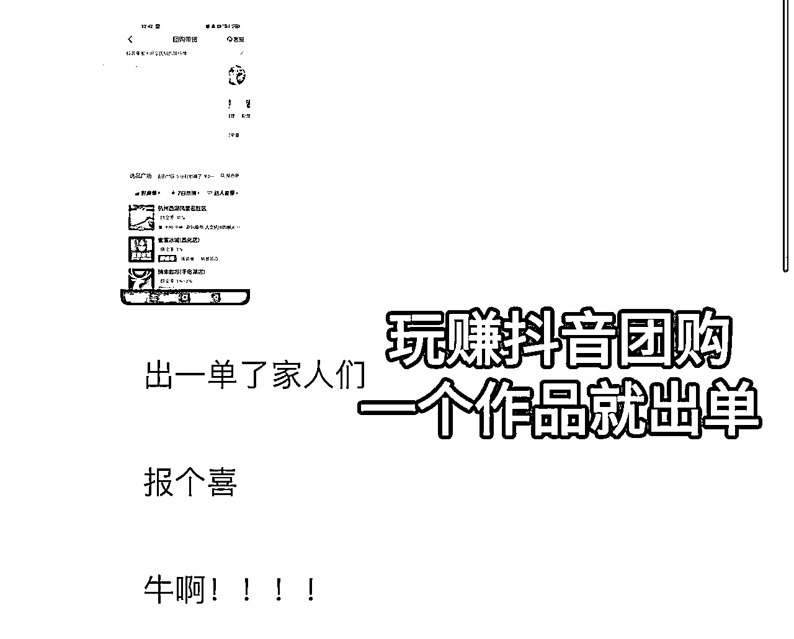

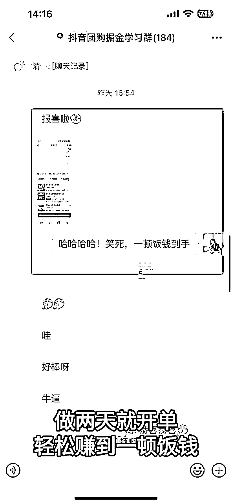

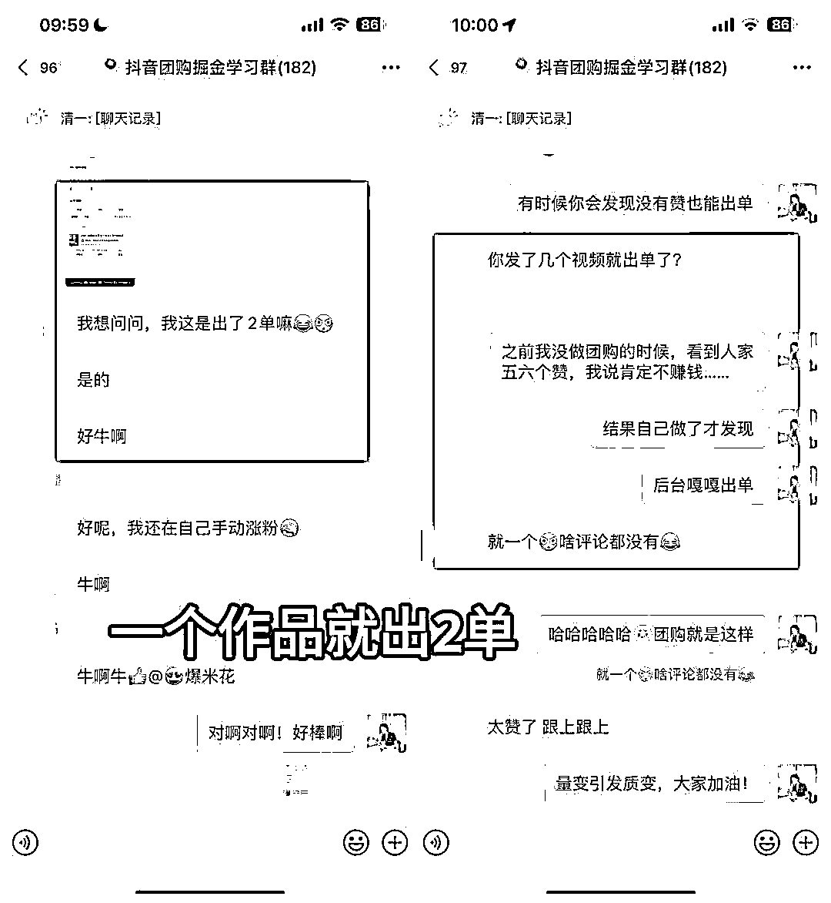

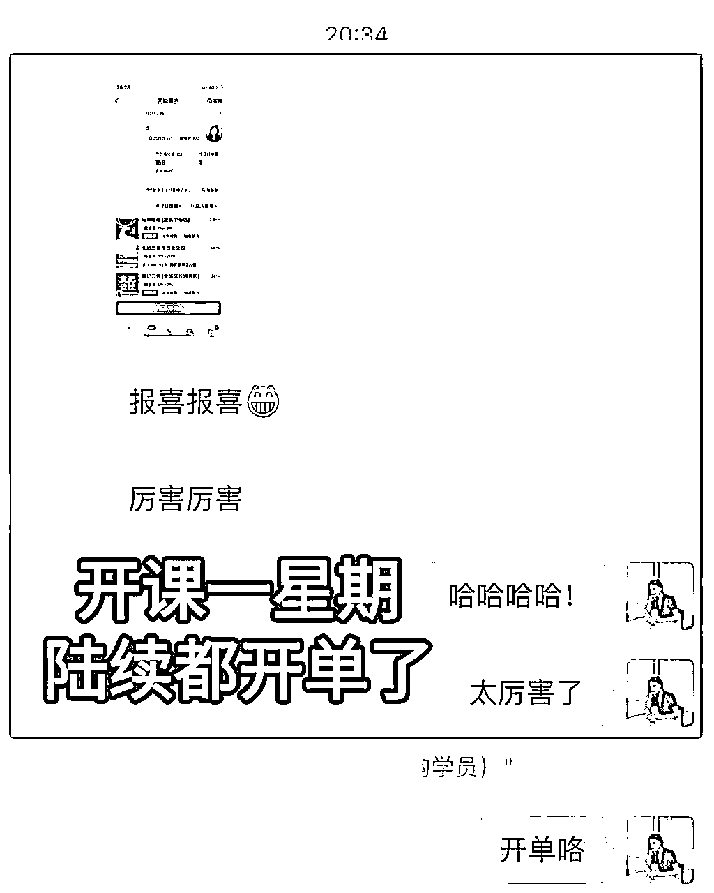

本文将结合我在本次发售期间，从0开始做发售，拉新1800人，转化230人的全过程。

为想要做群发售却不知道从何入手的朋友，提供分销团队搭建、引流裂变、社群发售节奏把控、流量承接等具体发售实操技法的完整版SOP。

适用于想要尝试群发售但却不知道怎么做的小白，或有一定社群发售经验，想要挖掘新玩法的大佬，希望这篇复盘能给大家带来一定的发售启发。

本文正文内容比较长，这是对应的大纲，大家也可以按照感兴趣的章节进行跳转阅读。

一、提前预热

1、行动sop

1）朋友圈预热

2）社群预热铺垫

2、优化小结

二、物料筹备

1、行动sop

1）配图

2）文案

3）发售分享稿

4）抽奖

2、优化小结

三、引流裂变

1、行动sop

1）招募分销人员

2）搭建分销社群

3）培训分销流程

4）带动分销节奏

2、优化小结

四、社群发售

1、行动sop

1）社群欢迎仪式

2）社群气氛激活

3）分享人员安排

2、优化小结

五、后端成交

1、行动sop

1）成交节点设置

2）成交气氛带动

3）成交后端承接

2、优化小结

六、心得体会

1、团队合作，取长补短

2、协作配合，以终为始

3、“大雁型”团队，事半功倍

# 一、提前预热

## 1、手把手保姆级行动SOP

其实早在这次“抖音团购”之前，我就发过一篇帖子：半个月带领学员做了400w+的抖音团购营业额，当时是免费教学的。具体详情可以点击链接查看：https://t.zsxq.com/14AxuDBT9

后来这个项目风口越来越盛，我们就打算把这个项目放大，所以精心准备了具体的课程，提前对接好了B端的商家货盘等。

在万事俱备只欠东风的情况下，我们要做的就是招生，主要招生形式是“社群发售”，即这次的公开课群发售，首先要做的事朋友圈预热。

### 1）朋友圈预热

想做发售，一定要有足够的流量和信任度，所以，朋友圈的铺垫是很重要的，要让用户能参与到整个产品的创造过程以及发售过程中。

当一个产品，在公开渠道进行铺垫时，客户会有一种“我参加了这个产品设计”的成就感，会更加愿意购买这个产品，信任度也能更高。

那朋友圈发售的铺垫，该发哪些内容呢？在我的合作伙伴朋友圈营销教练小鹿的指导下，我是从以下3点入手：

#### （1）开放参与节点

在朋友圈的铺垫中，告知这场发售的参加时间点，在时间点未完全敲定之前，得多次铺垫本次项目的发展过程。

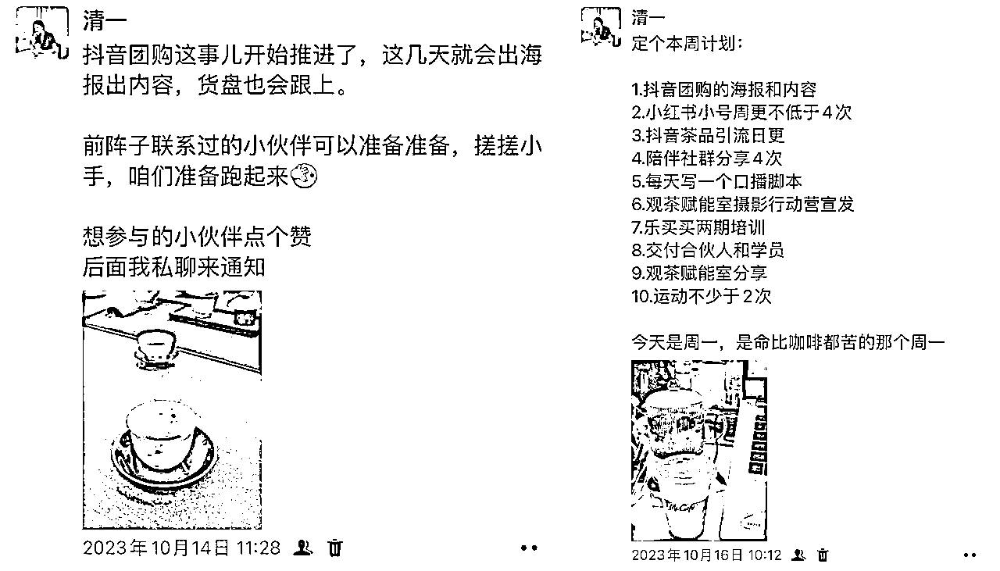

但切记，在这里不要过多暴露你的销售意图，在铺垫期间我朋友圈展示的都是这场免费公开课相关的内容，并没有说自己是要卖课程或者卖服务。

是到接近发售的环节，我才铺垫说这套课程只要两位数，并且是和高价值的礼品放在一条圈里。

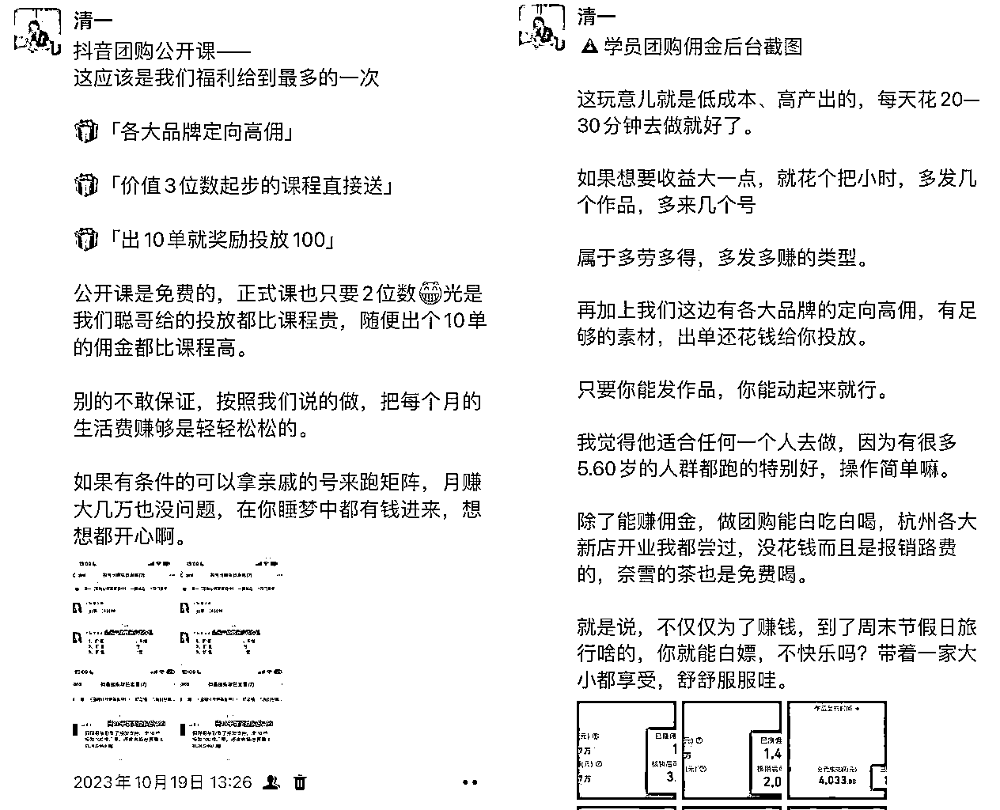

现阶段，大家对营销信息还是比较敏感的，有很多潜在客户如果看到你过早的表明自己的销售意图，在这个阶段就会放弃进群，也就无法建立成交所需要的信任关系。

#### （2）给足惊喜期待

我们这场发售准备了一些吸引用户的诱饵，比如免费赠送的三位数起步的课程。

要让大家伙都进群，肯定是要给到一个价值点的，例如：免费的电子书、一些行业报告、一些课程或者资料包都可以。

他们想要获得这个东西，就必须要进群，或者来添加你的微信。

在公开课的撰写上，我们也是有在朋友圈同步的，比如我们给到的公开课内容很干，经过不停删减却还是干货满满，类似于这样的素材，都要在朋友圈里进行公开同步，给足惊喜期待感。

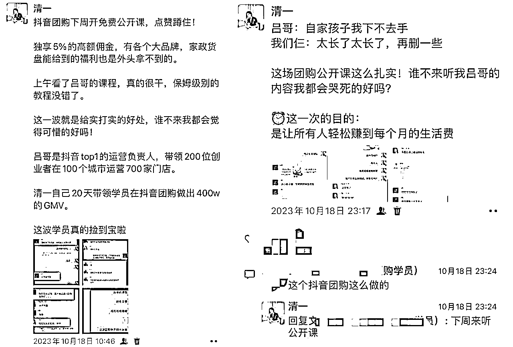

#### （3）打造产品背书

打造产品背书有两个点，一个是老师的背书，一个是过往学员案例的背书。

在这期间我联系了以前免费带的学员 ，拿到了大家的后台收益截图，以及一些聊天对话框，这个时候我们就同步在朋友圈宣导了。

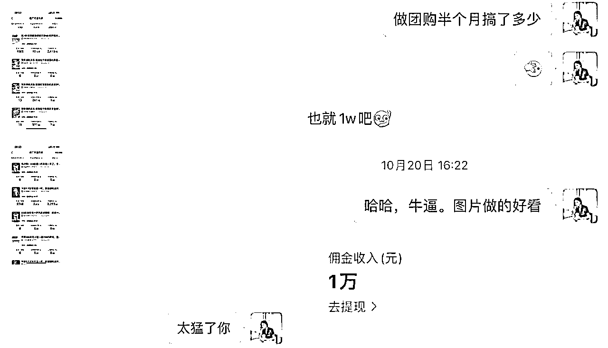

老师的学员半个月赚了1w+，加上后台的佣金记录，大到5.6000，小到几百。吸引力就会很大，满屏都是金光闪闪的人民币，搁谁都会心动。

在铺垫期间，我就通过朋友圈营销，收了10个学员，提前抢先付费。

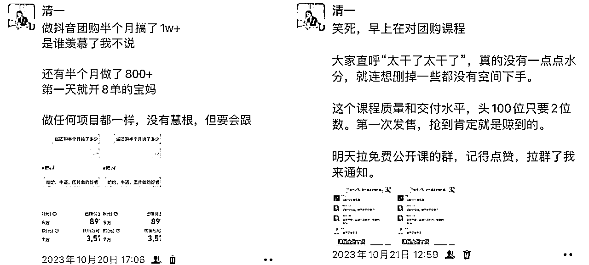

### 2）社群预热铺垫

除了朋友圈的铺垫，社群也是需要做好铺垫的，这里针对于有自己社群的小伙伴，或者团队成员有专属社群的小伙伴。

因为老社群中的成员都会是新项目的第一批种子用户，足够捧场，且对你本人有足够点信任度。

具体该怎么铺垫呢？我这边主要来分享一下，我个人在自己社群当中是如何铺垫的，核心在以下2点：

#### （1）前期从其他角度软植入

在准备这个项目期间去社群中铺垫，想要一次就铺垫到位是不可能的。就像朋友圈铺垫也是要多次发布才能让更多的人注意到我在做这件事，放到社群当中也是一样的。

所以前期我在群里是以软植入的方式告知大家，我即将要做一场抖音团购公开课。

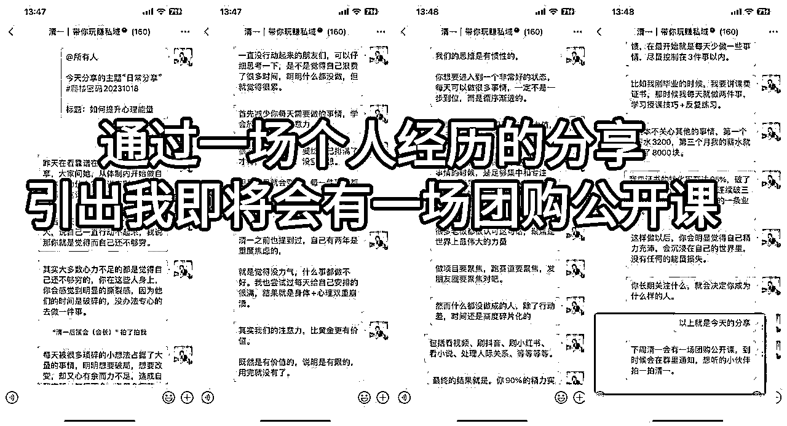

同时我多次在群内让群成员给我建议，后续我的项目会涉及到哪些领域？大家喜欢听什么样的社群分享。

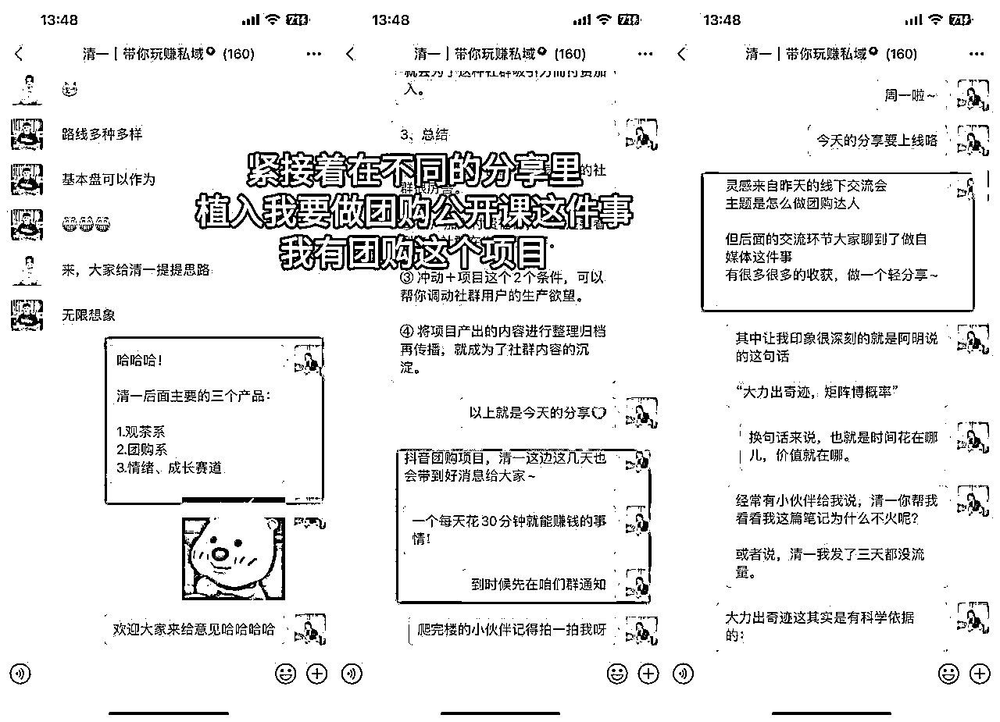

多次强调抖音团购这个项目，增加曝光量，也能让更多学员知道这个项目。

#### （2）后期拆解项目变现流程

在公开课要建群这期间，就要给大家进行一次项目变现流程的拆解了。这个拆解分享我转发的是梁靠谱老师的，确实写的很到位所以直接转了。

讲清楚这个项目为什么值得做？后续有哪些变现姿势？天花板在哪里？

最后引导大家进入公开课社群，这个过程就是让大家了解该项目的详细内容了，给足希望和发展空间。

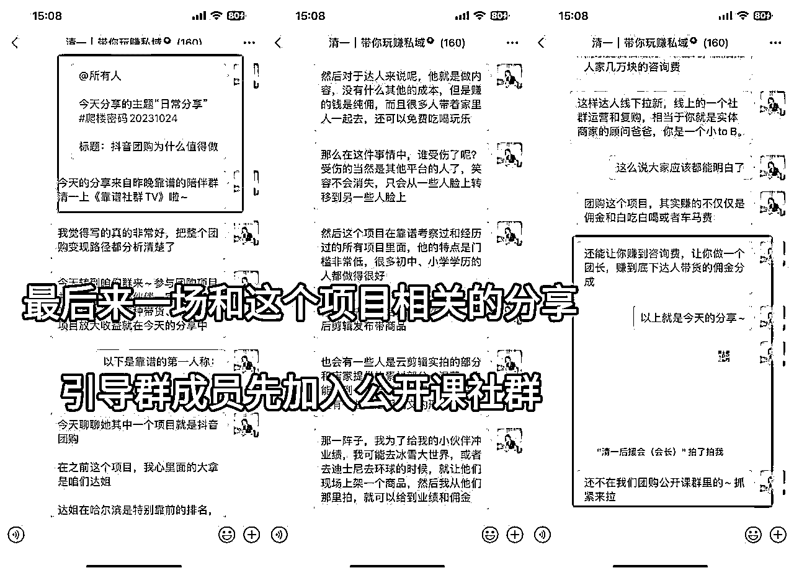

我当时是引导自己社群的用户第一批进群的，她们是我的核心用户，是经过培养的好客户，能够在我的公开课社群中为我带节奏和氛围。

所以，自己的第一批铁粉，一定要转化到位，这是做好社群发售成功的第一步。

## 2、发售经验，优化小结

除以上具体的SOP外，在发售结束后，我又总结了以下不足的小经验，希望能给大家带去启发：

### 1）发售预热，3~5天最佳

朋友圈发售预热的这个时间不能太早，当时我们说提前了一周左右，其实过早了。

很多人胃口起来了，最后迟迟等不到，部分就有点冷掉了。

建议提前3-5天就可以，不用太久，避免大家等不及，觉得你永远在吊胃口，没真动作。

### 2）高频发圈，增加曝光量

在这期间，可以高频一点去发圈，让私域里所有的朋友都知道你在做这件事。

增加对应的曝光量，具体频率可以把控在以下标准：

预售期，每天1~2条产品相关；发售期，每天至少3条，最好能在5条往上。

如果怕刷屏的话，可以滚动发圈，即发过的内容重复发，发的时候将发过的删掉即可。

### 3）增加互动，增强参与感

在朋友圈营销中，可以增加一些互动环节，可以做一些投票。比如问问大家，是比较想视频听课还是图文版本？或者问问大家什么时间方便来听公开课，都是可以的。

增加与用户的互动，增强大家的参与感。

最好能引导点赞互动，比如可以在文案里加上，感兴趣的点赞，方便后期去追评邀请大家来进群，有一个提醒的作用。

加上点赞的操作成本比评论低，尽可能的引导点赞，也能提前做一波目标用户筛选。

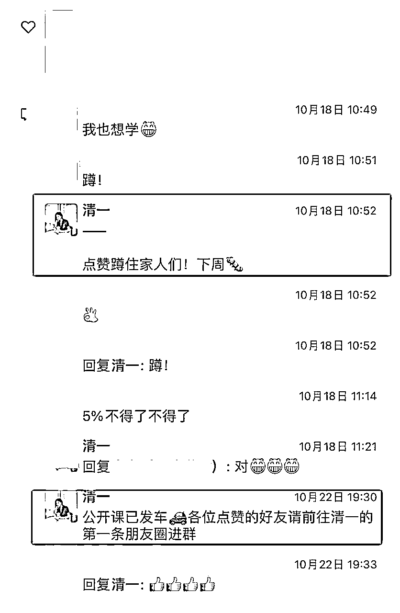

### 4）黄金时间，事半功倍

发售期发圈的时候，最好能挑在黄金时间段去发送，这样才能事半功倍。

这个黄金时间段，是由你的目标用户群体的刷圈时间来定。

我们的主要群体是想做副业的朋友，或者是宝妈群体，所以黄金时间段就在：8:00-9:30,11:30-13:00，17:30-19:00，20:30-23:00。

经测试，这个时间段，看朋友圈的人是最多的，进群速度也是最快的。

### 5）1V1邀请，提升转化率

最后可以1v1邀请大家进群，尤其是针对于那些点赞过的或者评论过的，我都是群发了二维码，提前打了标签。

这波精准目标用户的入群率是100%，其中提前付费的就占50%。

总而言之，可以的话，让用户尽可能的参与到发售环节中来，有助于提高后续的批量成交率，这也是有迹可循的。

整体预热剧本大概可以小结为：

先通过宣导让大家对产品有一个基础的认知，把这件事深深种在用户心里。

随后，在这期间多增加互动，多曝光产品打造的过程，做了哪些准备？可以提高用户的期望值，并且变成用户一个习惯期待。

这就从主观推销产品，变成了用户渴望得到的产品，能很好的调动大家的积极性，避免产生抗拒心理，发挥共创效应，提升成交率。

# 二、物料筹备

## 1、手把手保姆级行动SOP

在预热过程中，我们也要提前筹备发售的物料，我梳理了一下需要准备的基本物料，大家可以做个基本的参考。

### 1）基础配图

首先，最基础的一定是基本配图。毕竟是做群发售，需要通过朋友圈营销+群发售一起，双重发力，调动气氛，配图就显得至关重要。

这里的配图，我们主要准备的是产品相关，及学员相关配图。

产品相关如：课程进度的截图、课程大纲、课程内容概览、货盘肌肉等。

这里只放我们筹备的部分配图，在物料筹备上，建议大家多多益善。

学员相关，如学员收益图、学员反馈图、学员下单截图等。

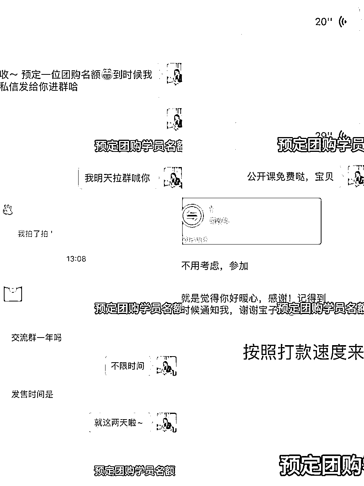

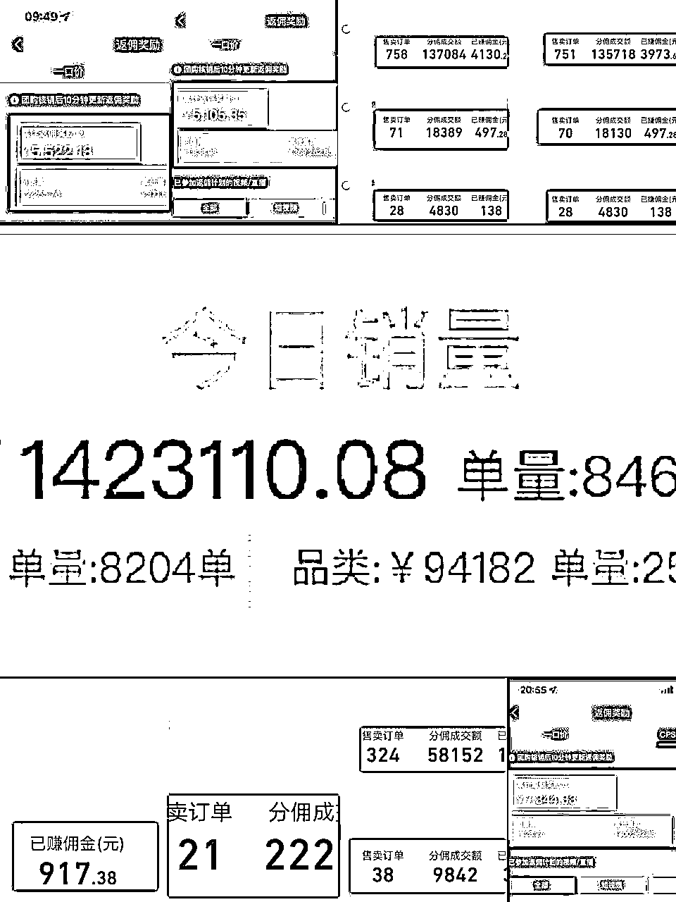

### 2）分销文案

配图搞定，接下来就是文案筹备部分，这部分内容，是由我的合作伙伴朋友圈营销专家小鹿来负责的。

在后文的团队协作中，我会提到，一定要团队协作，才能将效果发挥至最大，在文案部分，小鹿老师确实做的很到位。

发售期间，不同阶段，都有对应的不同类型的文案，甚至还能实时更新。

比如，这是第一天的文案，主要是整体介绍课程、导师等：

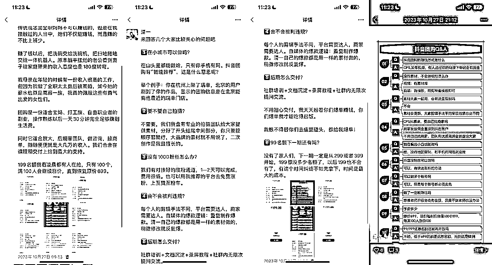

这是第二天的文案，主要核心在于秀肌肉，让大家知道这套课程确实能赚到钱：

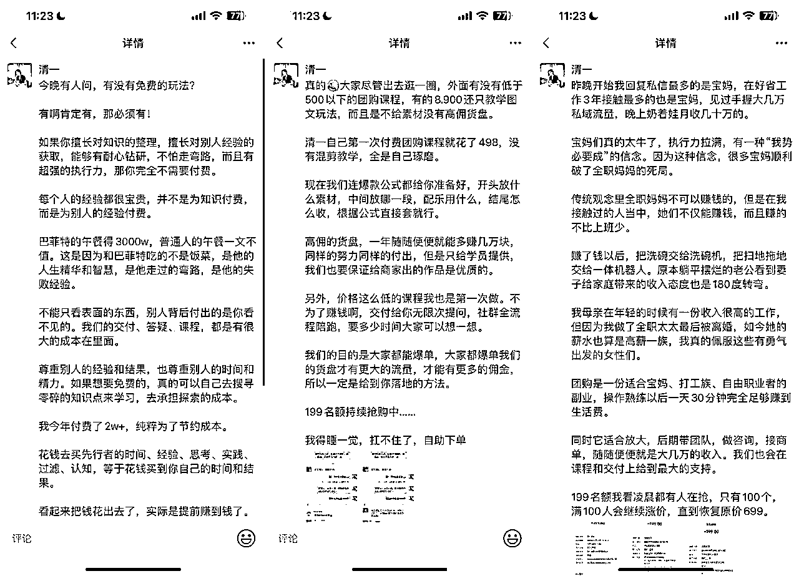

这是第三天的文案，主要目的是追单、逼单，诱导大家抓紧机会：

这是从时间顺序上，她做的具体的文案实时更新情况，在文案类型上，她也做了具体的区分。

比如，不同目标用户群体，就有不同的针对性朋友圈文案，每个痛点、每个产品卖点，也能给到具体的朋友圈文案。

这是针对宝妈群体的文案：

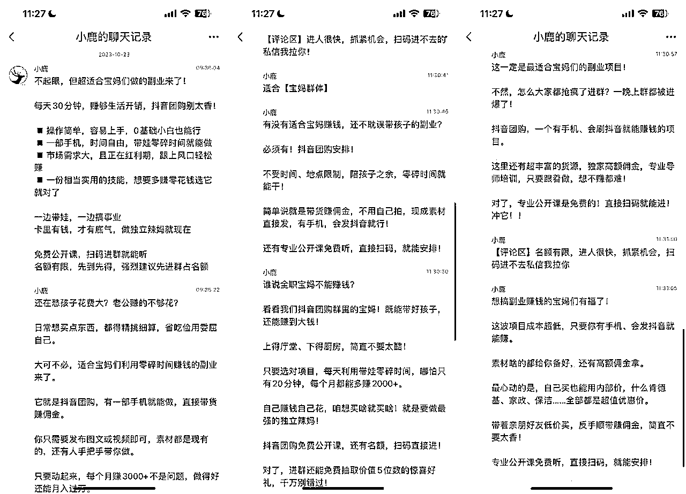

这是针对想靠副业赚钱的朋友的文案：

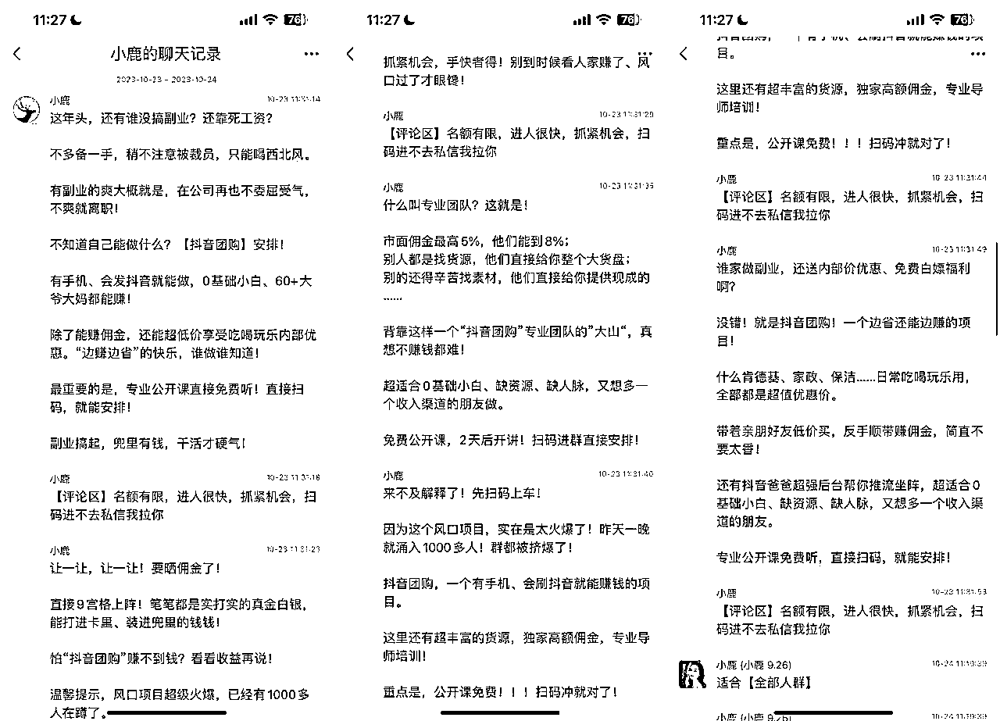

除此之外，她还帮有社群的朋友，准备了社群对应的安利文案：

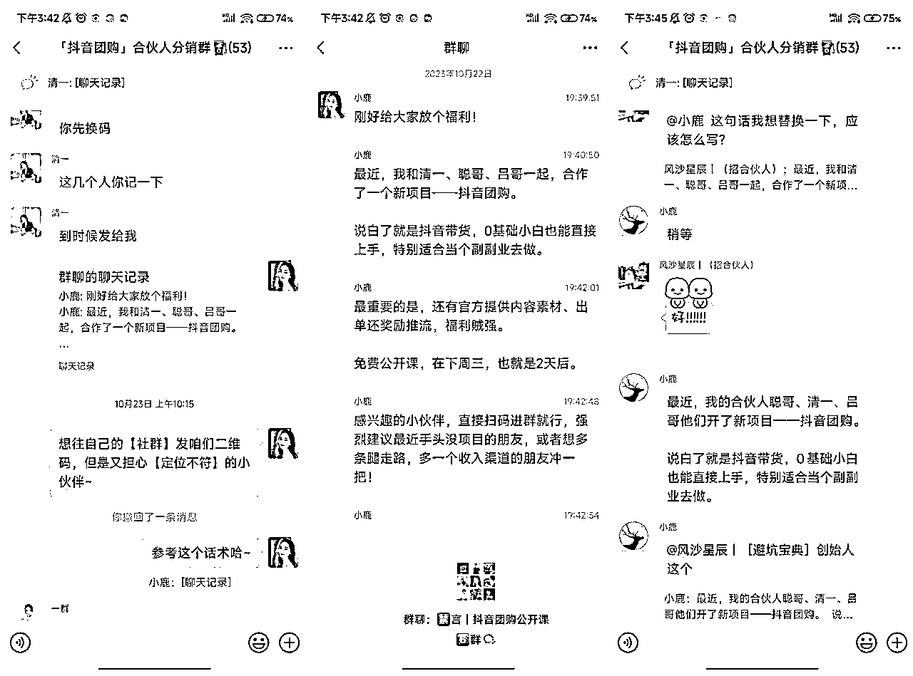

在文案细节把控上，小鹿老师做的相当到位，毫不夸张的说，这次的流量之所以这么猛，远超我们预计，60%的原因可能都是文案到位。

就连我们分销群的小伙伴都忍不住多次感慨，小鹿的文案简直就是意大利炮、印钞机。

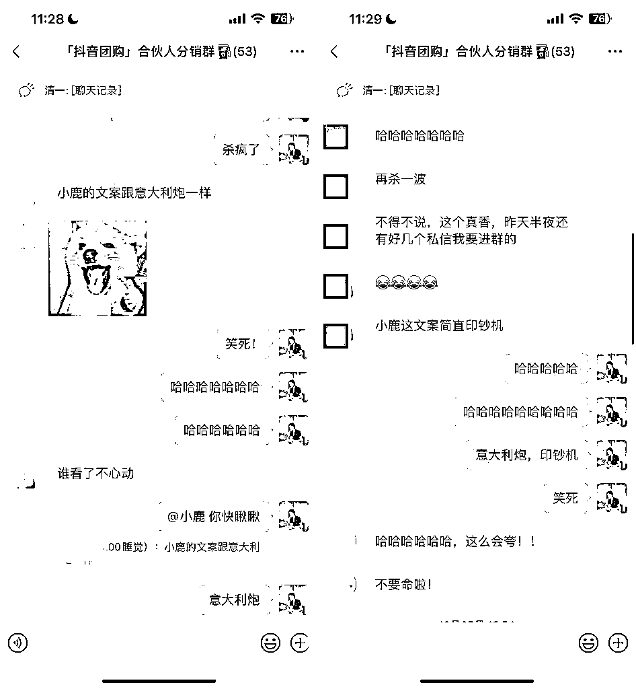

### 3）发售分享稿

除基本物料外，发售分销稿的准备也至关重要，因为它与我们的转化率直接挂钩。

最初我们预计1篇搞定，后来流量越来越猛，所以给大家进行了加料，又增加了2篇分享内容，把价值与获得感拉满。

在分享稿的准备上，主力军也是小鹿老师，她在文案营销的把控上确实做的很牛。

在她的规划下，我们发售分享稿定整体逻辑思路是：上干货、秀肌肉、给案例（学员分享）

第一天，就是上干货，在自我介绍的基础上，直接给大家讲抖音团购这个项目的背景，以及为什么适合普通人去做，给到老学员的案例+基础账号搭建的流程，讲具体怎么做，不玩虚的：

🎬第一课： 0成本入局抖音团购，20天带领学员做出400w+营业额

第二天，秀肌肉，我们给到了抖音团购云剪辑的剪辑玩法，实实在在的给出了技巧干货，同时我们告知了货盘优势。

👉第二课：4招助你出品就爆单，靠带货实现月入过万！

因为我们的货盘是能给到外面给不到的高佣，并且我们有爆款剪辑公式，素材是每周更新的，这算是我们的一个亮点，干货全给了，那也得有其他的价值点让大家来下单。

第三天，给案例，邀请学员做成长分享。前期铺垫某种意义上都属于自卖自夸，所以最后一天，一定要有一个学员，能够现身说法，我们就邀请到了往期学员，来做了一场分享。

遇见抖音团购，通过抖音团购半个月收益1w+。给到还在考虑的小伙伴们信心，真实的人设现身说法效果甚佳。

👉第三课：抖音团购15天变现1w+，怎样用业余零碎时间，创收超主业？

整体干湿结合，干货足够，希望也给到位。这一套组合拳打下来，整场发售无论是节奏，还是具体内容，都把控到位，最终转化率也很不错。

### 4）抽奖筹备

值得一提的是，在前面的分享中，我就提到过，要设计对应的抽奖，吸引大家进群参与活动。

所以我们需要提前准备抽奖的方式、及抽奖的奖品，这里的抽奖方式，一定要提前做好测试，避免出问题。

在奖品设置上，建议以用户需要的产品为主，这样才能吸引大家来参与。我们最终选择的是星球门票和标准课程。

因为这类奖品从用户视觉来看，价值高，获得感足够；从我们团队角度来说，交付成本低，边际成本也低。

课程配套的社群，其实无非就是分享录播课+拉进社群，边际成本低到可以不被计算。

但是这类奖品又是大家喜欢且需要的，光是课程和星球的售价就在大几百，我们再打包打包，单份礼品价值就上2000+元，共计10000+元的奖品，对用户来说，吸引力很大，有一大部分人就是奔着奖品进群的。

## 2、发售经验，优化小结

在物料筹备部分，重点总结的经验是，在提前准备上，一定是多多益善，提前做好测试，做到万无一失。

当然，无论是配图还是文案，很重要的一点，都要做到及时更新。

因为在发售过程中，我们会不断出现新的宣传物料，这些物料要及时做好收集，在发售过程中，及时同步给分销团队。

时刻做好Plan B，避免发售现场手忙脚乱，出现意外突发情况。

在文案设计上，还有一个小细节，也和大家分享一下。

我们的所有物料发放，都是以聊天记录的形式给到，而非传统文档。

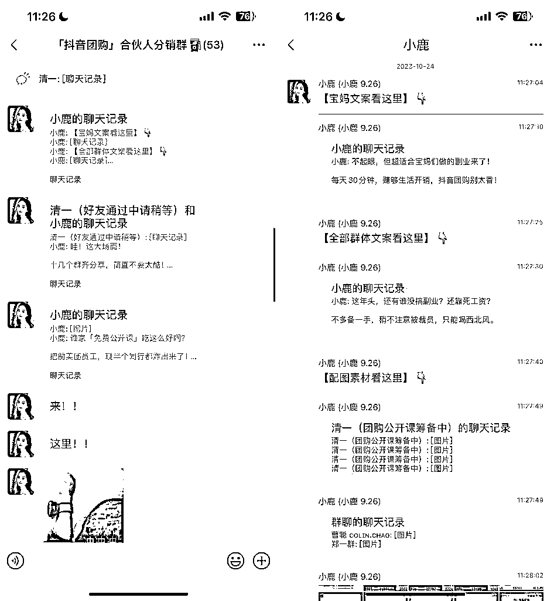

这是因为，聊天记录能够方便分销团队们复制、转发，减少行动路径，降低行动难度，大家的分销意愿也会更强，分销也能更顺畅。

# 三、引流裂变

## 1、手把手保姆级行动SOP

### 1）招募分销人员

在公开课正式发售之前很重要的一步，就是招募分销人员。要知道团队的力量才是最强大的，单打独斗难成大事。在团队的加持下，才能跑的特别快。

就像这一次公开课发售，人数1800，靠我个人或者个人团队，都是没办法达到这个人数的。

所以在发售前，我干的第一件事也是最重要的一件事，就是招募分销人员

我先是在团队大群里吆喝，自己即将要开启一场公开课，分销佣金是50%，让有兴趣的小伙伴来私信我。

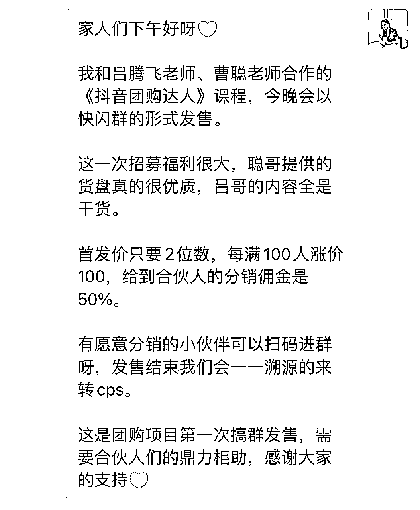

在这里我说明了本次发售给到的佣金是多少，以及我非常需要大家的帮助，在发售结束的cps结算标准。

说到这里，我还想聊一聊关系的重要性，我一直认为，人＞钱，关系在前，钱在后。虽然我们的交付成本非常重，但还是愿意给到一半的佣金，甚至是更多。

因为中国本质上还是人情社会，在这之前我们团队的小伙伴就是秉着真诚交流的心态，去交往各个大佬们，该付费的付费，该支持的支持。

所以在我的项目需要发售卷流量的时候，我也收到了很多朋友的信息，都说愿意来跟我们一起分销，助力这个项目。

### 2）搭建分销社群

人员招募完成后，紧接着就是搭建分销社群，分销的小伙伴我准备了一个单独的群聊，用来提供文案+素材，以及培训分销流程。

除这些基础物料发放外，分销社群最重要的就是氛围，分销社群的氛围到位，大家分销起来就很有动力。

我们建群进人总共留了3天时间，在朋友圈文案和素材到位的情况下，大家只要转发就好，我们根据不同的人群不同的素材都准备了相应的文案。

本次发售总共是10个社群，其中给大佬们是单独开社群的，因为大佬的流量很多，分分钟就灌满一个群。

考虑到后期cps的结算，我们单独开了5个社群给靠谱和火羽白，在这儿我是真的有被震惊到，什么叫做以秒为单位进群，一小时灌满一个群的速度。

所以，大家在搭建社群时，也要关注到关键大佬们的需求，单独建群就能很好承接。

### 3）培训分销流程

分销就涉及到具体cps的结算，我们没有借助任何工具。

人多了必然意味着会杂，在人杂的情况下，妖魔鬼怪也会变多。比如爆粉的、负面舆论、同行举报的，上工具可能会提高我们社群被封的概率，所以我们没有用插件，选择了手动结算，只是用了品牌方的企业微信。

在这里我给大家看一下当时我分销流量的培训内容，我们采用的是溯源扫码进群的方式，具体步骤如下：

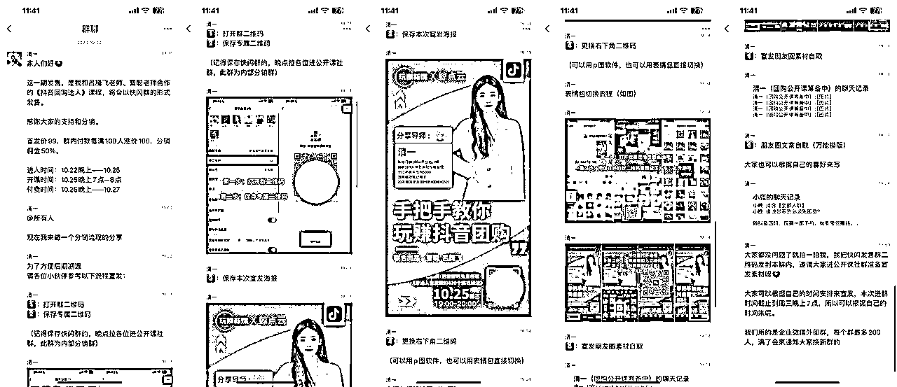

#### a、邀请各位分销小伙伴进分销社群

一对一和各位分销小伙伴说分销流程是大大的浪费时间，所以我选择都放在群里培训。

在大部分小伙伴都进群以后，我就做了一次分销流量的培训，说清楚如何分销、如何结算、以及我们准备了什么物料与支持。

这段培训，为避免刷屏，我也是提前准备好，以聊天记录的形式发送，避免刷屏，也能方便大家爬楼。

#### b、做好分销流程的培训

第一步：进入公开课社群

第二步：保存专属进群二维码

第三步：保存发售海报

第四步：更换发售海报上的二维码

第五步：宣发朋友圈素材分享

第六步：宣发朋友圈文案自取

第七步：说明更换二维码的重要性

在这里我们也得出一个经验，后续海报可以多做一个不带二维码的版本给分销的小伙伴，这样大家就可以省去更换二维码的这个步骤，只要下载自己专属二维码去发朋友圈或者私信即可。

在发售过程中，尽可能减少用户行动路径，简单粗暴最直接。

#### c、社群满了引导大家进新群

因为人多，所以需要时时刻刻盯着，大家都在差不多的时间点发圈，没多久二维码就不能用了，社群满200人了。

大概在180人的时候，我们就会组织大家进新的社群，引导大家导出自己的专属社群二维码开始往后面的社群中承接流量。

时刻关注项目进度，避免因为客观因素导致流量流失或其他问题。

### 4）带动分销节奏

分销的本质就是通过激发用户行为动机，让用户去作为销售和推广人去链接更多同频人群，找到潜在客户。

做私域的朋友肯定都知道，“裂变”和“营销”对于生意的成败是至关重要的。你有卖货的场所，那你的渠道裂变的肯定得越多，分销才能越快，获利性也就越强。

但是光有裂变和渠道也不够，“营销”也是同等的重要。俗话说“酒好也怕巷子深”，没有足够的宣传力度和好的营销策略，是没办法让更多的人知道你的产品。

那怎么鼓舞大家持续的去营销和裂变呢？我总结了以下3点，大家可以参考：

#### a、带动分销社群激情氛围

分销社群的氛围我觉得很关键，太关键了。

只要分销社群的氛围在线，大家的发圈频率和推广频率就会跟上来，所以要不停的给大家打鸡血，实时去通报社群进人的速度。

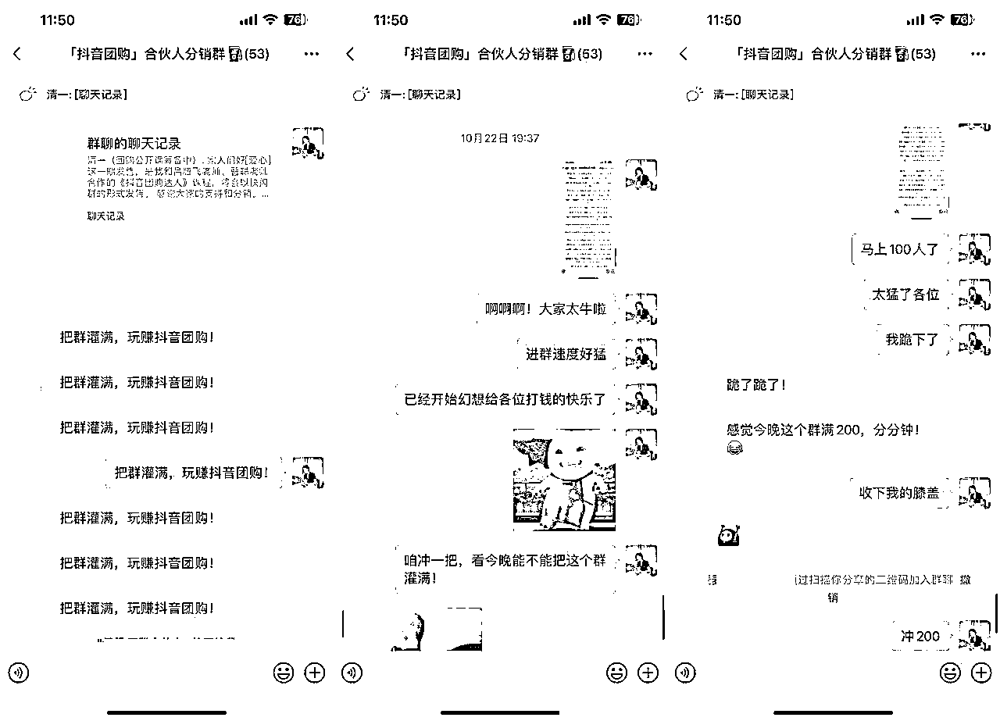

通过社群营销组建起来的渠道，不受时间、空间、地理位置的限制，24小时都可以营业，所以情绪价值一定要给的够够的。

有几个时间段要特别注意，中饭点，晚饭点，和睡觉前。

这个时间段是进群人数最猛的时候，在这之前要去分销群内转播一次分销文案和素材，同时要鼓励大家把朋友圈发起来。

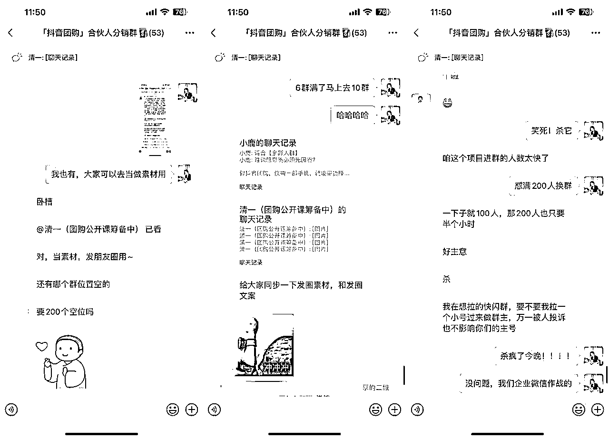

我们大部分的流量都是在这个时间段进来的，所以把握好时间点也是可以大大提升社群人数。

#### b、圈出分销成员特别鼓励

分销群里必然会有一个情况，有的是流量大佬，进群人数很多，有的是互联网小白流量不多。如果这个时候只盯着流量大佬去夸，其他的分销小伙伴的兴致肯定会逐步减少。

所以在这上面，我和小鹿老师是针对性的给到一些支持和鼓励。钱到位还不够，精神上的愉悦体验也是很重要的。

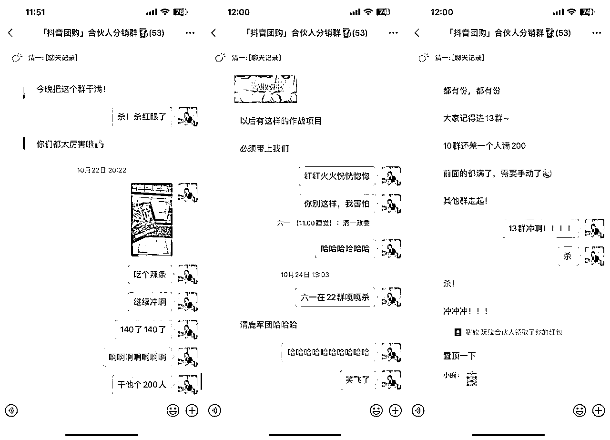

这种循环一旦形成了，就有助于我们持续获得新的用户，产品发售扩散的成本就会大幅度降低。

并且跟这群分销小伙伴有了一个强链接，私域在很大层面来说，还是靠关系。

#### c、给足分销福利和安全感

在分销过程中，我给大家展示了我是如何打用户标签的。流量就是媒体人的命脉，大家愿意把流量给到我，当然我也要让大家放心。

每一个转介绍都是在后面打了备注，或者单独拉了分组，类似于这样的分销，都是大批量的流量进群，让分销的家人们放心是必要的。

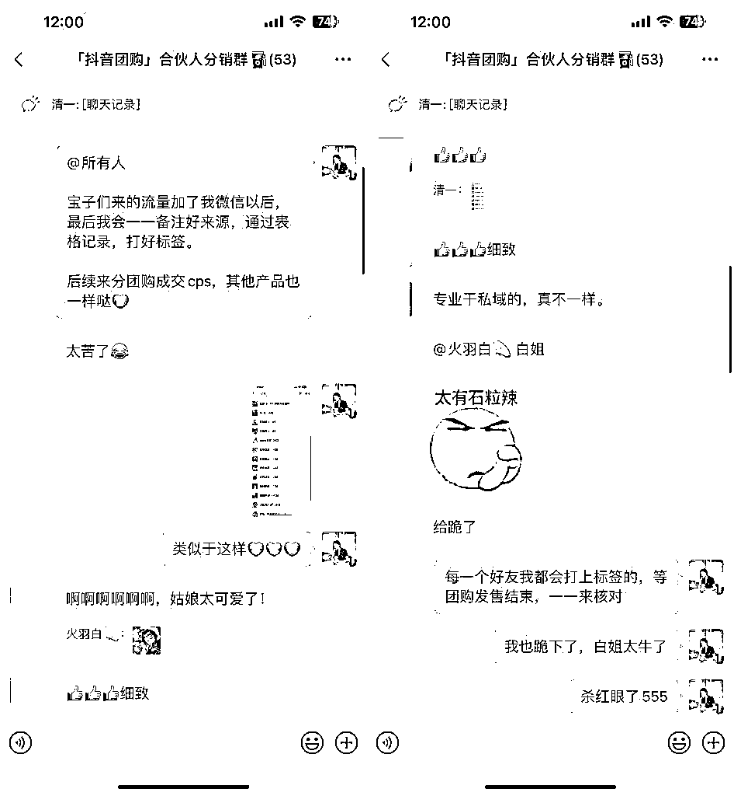

在这里要学会换位思考，如果是我的话，我也会担心把流量给到别人万一被别人转化了怎么办。

同时我们会在分销群里发红包，在关键节点的时候把气氛燃起来，对分销战队的成员，购买课程都是给到最低价，就算当时付了涨价后的费用，在发售结束我也会一一退回。

做生意有时候进四出六，财散人聚，才能做真正的长期主义。

# 四、社群发售

## 1、手把手保姆级行动SOP

### 1）社群欢迎仪式

首先是社群欢迎仪式，咱们做这公开课社群还有一个目的，那就是引流。

所以在欢迎仪式上就特别需要重点来撰写，我们在这里是准备一份引流手册，采用了企业微信这个工具。

企业微信可以安插机器人，开启自动欢迎模式，并且带有@ 功能，我觉得这个很棒，做群发售采用企业微信是个不错的选择，包括针对于爆粉的人员，还可以全群聊通通拉黑。

分享一下我们的社群欢迎文案：

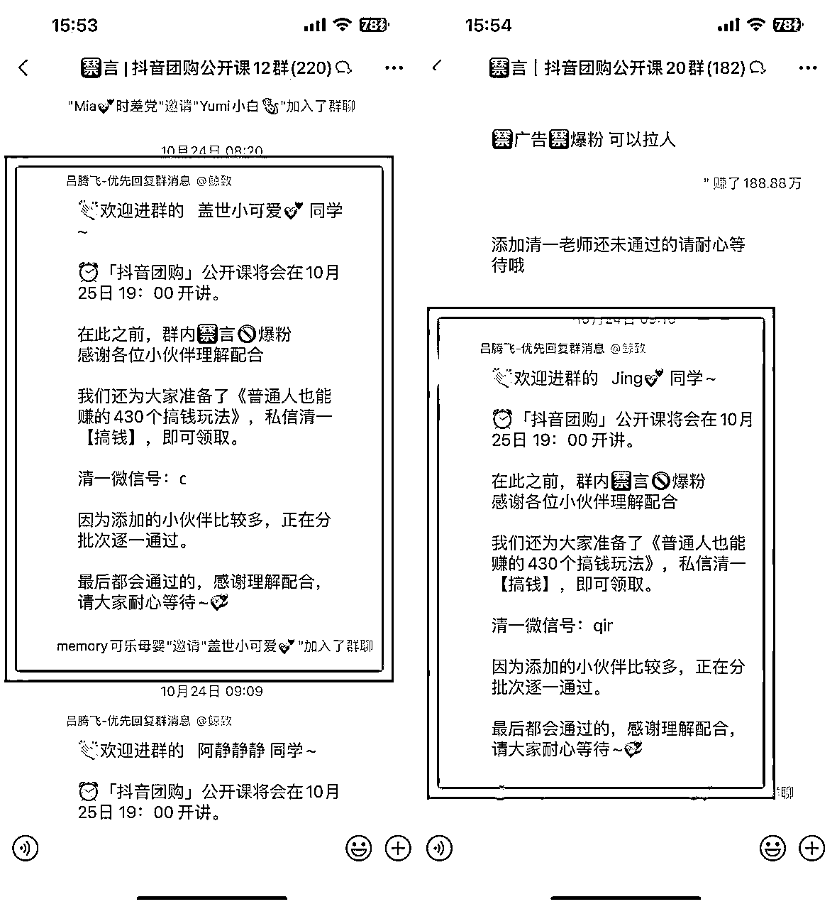

在这里，还有几个小细节，需要注意一下：

#### a、采用企业微信

普通微信群很容易出问题，企业微信就安全很多，能够有效避免被封群，还可以及时发出欢迎文案有效引流。

当然用微信也是可以的，在群公告里设置欢迎文案，进群叮嘱大家看群公告。

但是自动欢迎这样的模式，我觉得触达会更好，整体也能更安全。

#### b、引流手册准备

这里的钩子一定要有足够的吸引力，以及要和用户相匹配。

会对抖音团购这个项目感兴趣的，都是需要赚钱项目的，所以我们的引流手册是《普通人也能赚的430个搞钱玩法》。

事实证明加微信的效果也很好，总计添加好友数500+，流量也都很精准。

#### c、欢迎文案撰写

这个文案是小鹿老师写的，在本次群发售，小鹿承包了所有的文案。

因为在发售期间微信是大量添加的，容易造成封号，所以我是分批次通过的。在这期间很多学员就会说，怎么还不通过我好友之类的，在社群内会出现一些舆论。

所以在欢迎文案的结尾我们加上了一句说明，这也是为了告知大家，我们不是骗人的，说送就会真的送，只是需要一点时间。

时刻做好舆论监督及引导，及时解决问题，也是做好群发售的关键。

### 2）社群气氛激活

社群的整体气氛，我认为这里的重要性不亚于成交阶段的重要性。

这类社群不管是听课前，还是成交时，都要让人感受到氛围的火热程度。不管是提醒大家按时来听课，还是促进成交。

所以在热场的时候，就需要大家提前准备好话术和红包雨。

在这里我总结三个点，分享给大家：

#### a、开课当天中午预热

要开课了，得提前提醒群成员，我们的公开课即将要开始。很多人都是看一眼就过了，甚至会反复询问，什么时间才开课？

所以开课当天为了保证大部分成员都能来参加，得提前做好预热准备，如图：

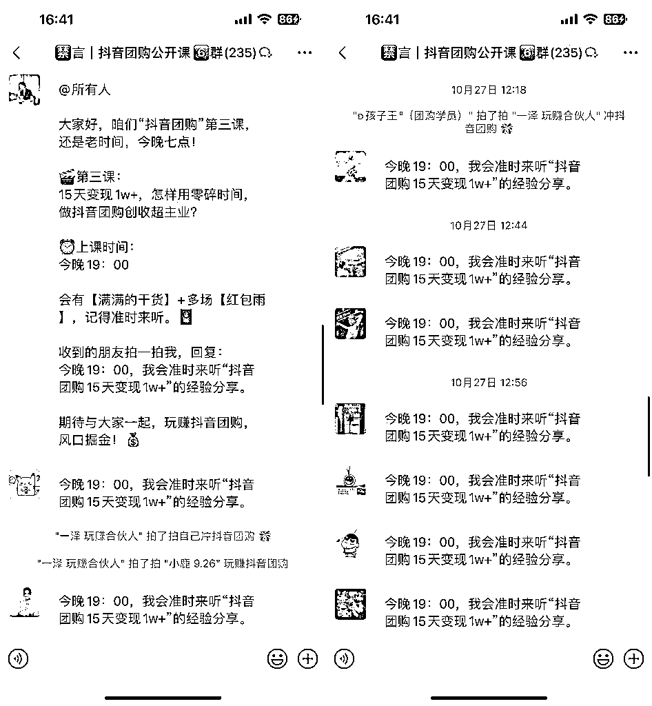

通知开课一定要排队形，基本上可以刷到晚上开课前，每一个人回复都是一次触达，都是一次提醒。

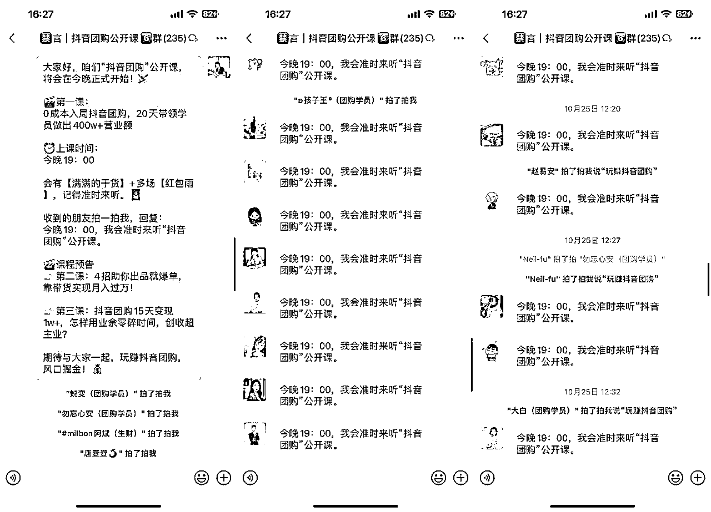

同时朋友圈也要同步开课时间，主打的就是多方位全流程的提醒，保证大部分人都能出现在我们的开课现场。

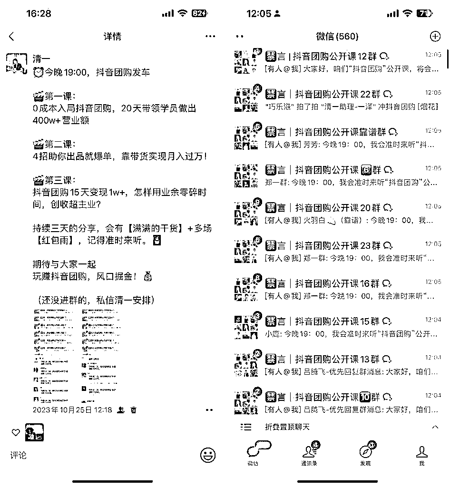

当然在这里要提前去分销群提醒各位跟队形，其实很多人都不会在群里复制粘贴，或者是说不愿意吭声。但是看到跟的人多了，瞬间就会活跃起来。

跟队形的文案，要根据你当天的开课内容来调整，用户复制一次就是种下心锚，无论如何潜意识里都会有个印象，今晚是有内容需要学习的。

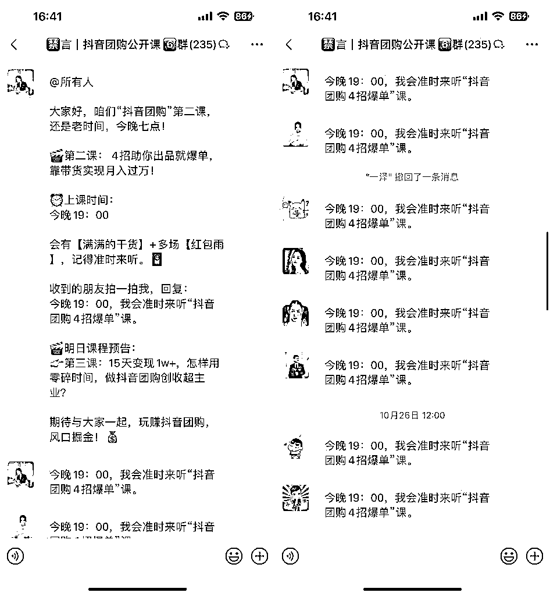

#### b、开课前红包雨准备

我们总共安排了三天的分享，这三天每一节课开课前，我们采用的都是红包激活。

费用不用多，因为我们的社群确实不少，但是一定要保证让更多的人都能领到红包，并且可以持续一阵子。

所以，在红包的设计上，主要是注意两点：

*   红包名称

我们每天的红包名称都是不同的

第一天：

玩赚抖音团购

团购风口掘金

我要学习团购

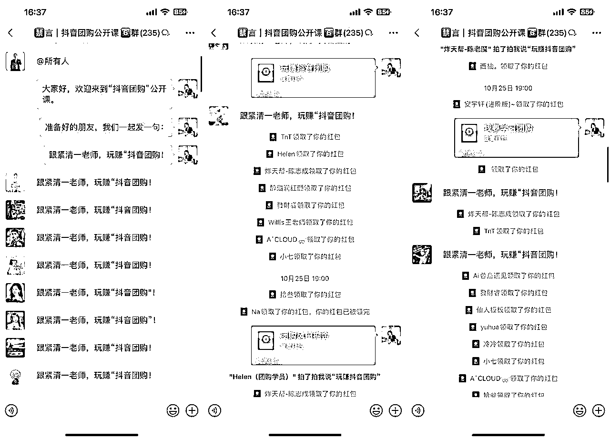

第二天：

玩赚抖音团购

今晚惊喜福利

必须蹲守到位

（第二天是我们开放付款渠道的阶段）

第三天：

玩赚抖音团购

团购风口掘金

居家月入过万

（第三天是我们的学员分享，半个月收益1w+）

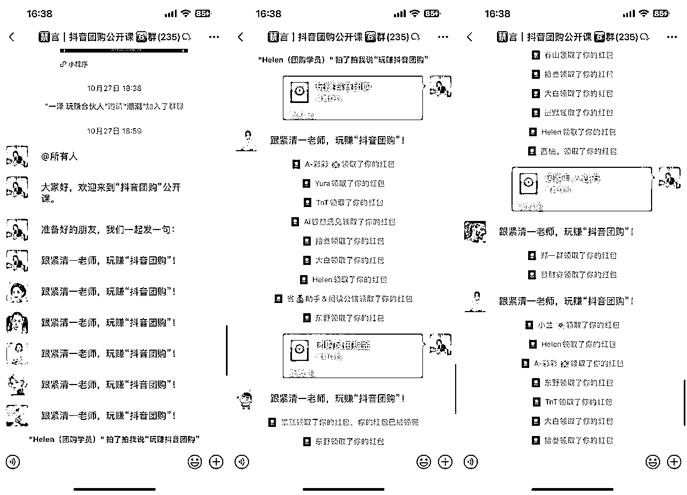

*   金额设置

前面我说金额可以小，但是红包数量要多。

因为这个环节的目的，不是让大家多收红包，而是为了把用户激活，让所有人都参与到这个氛围当中来。

加上领了红包，无论多少都会给你跟个队形，气氛这不就来了嘛。

#### c、每天都要提前预热

前面的截图当中大家肯定有看到，我们每一天都是有预热文案的，并且都是根据当天的课程来调整的。

第一天：

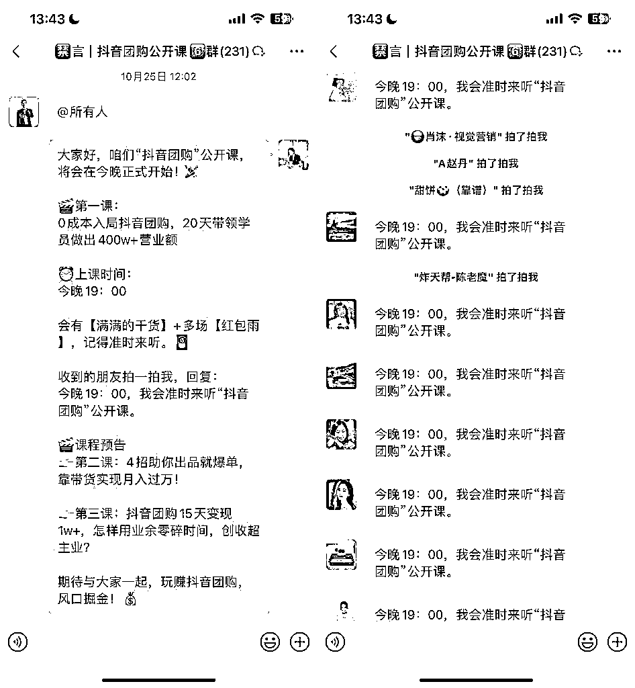

第二天：

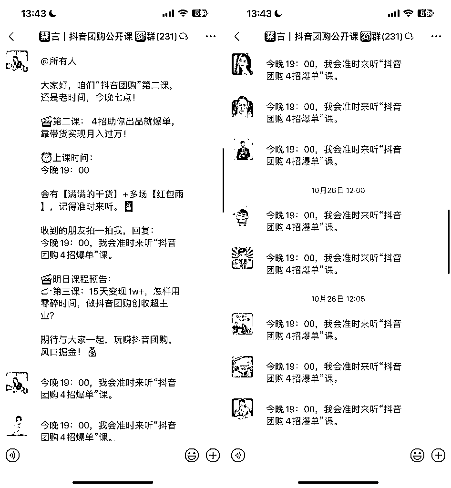

第三天：

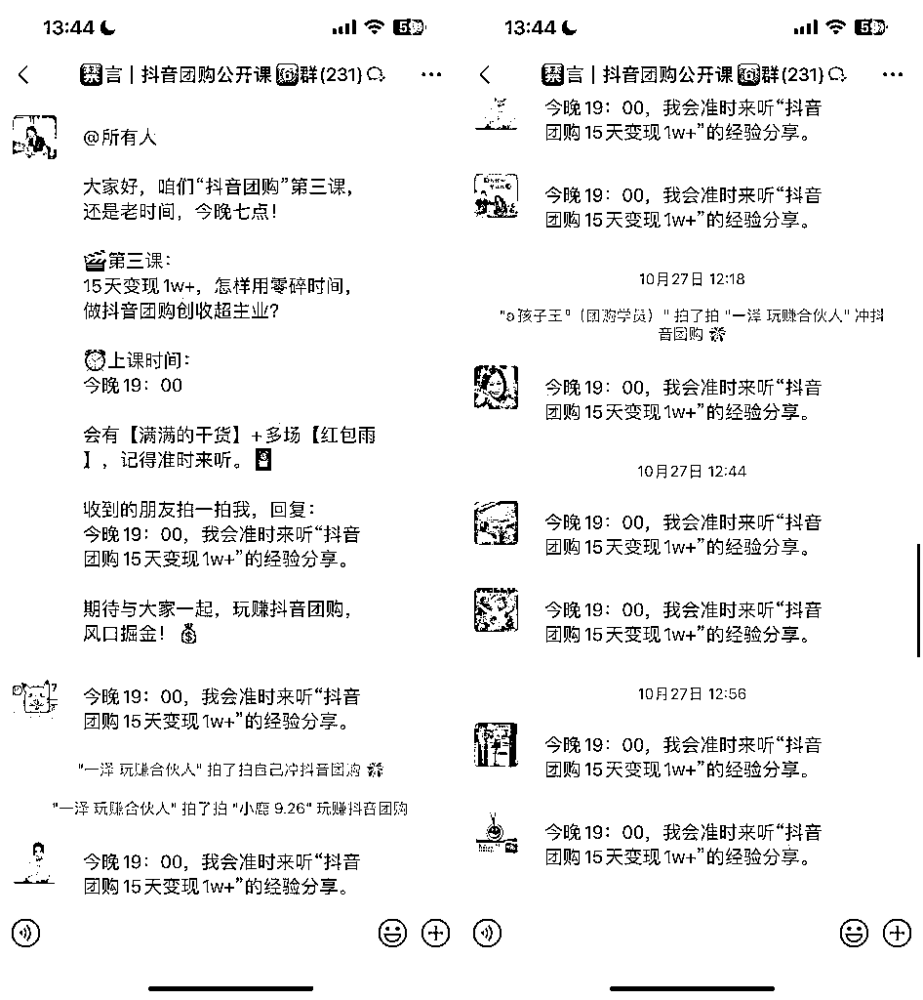

每天中午对应的预热，能够有效吸引大家注意力，让用户在这个时间段，能够准时来听课。

提升曝光率，才能有进一步的转化，所以这个预热的动作，一定要做到位。

#### d、抽奖链接辅助氛围

这里的抽奖从开课的第一天，或者从进群开始就可以发了，保证多数人都参与到这个抽奖环节。

这是能留住用户持续在你群里待到发售结束的关键，我们这一场群发售，三天公开课，退群人数是个位数，留存率还是很高的。

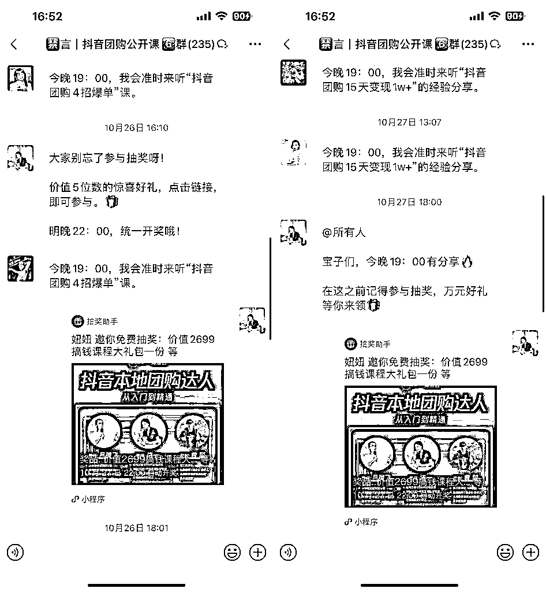

在具体工具上，我采用的是抽奖助手。

因为社群比较多，人数也比较多，用红包形式抽奖费时间、费精力，所以干脆用了抽奖助手来辅助本次抽奖环节，让大家都能有参与。

需要提醒大家的是，这里的抽奖，最好能够每天至少发一次，保证参与率，也能让更多用户期待中奖，提升对课程的关注度。

### 3）分享人员安排

在社群很多的情况下，一个人转播10个群是有风险的。比如容易被封号，消息容易发错了。

所以在这点上面，我们安排的是一个助理两个社群，其实最好呢是一个助理一个社群，但是我们人手有点不太够。

当时我们的目标进群人数是600，最后达到1800是出乎意料的。所以没来得及提前安排好相关的小伙伴来负责。

这点是我们准备不周，在这里也提醒大家，在做群发售之前，按照各个不同的群聊，可以优先安排转播人员，避免手忙脚乱。

## 2、发售经验，优化小结

在社群发售这部分，我们结合自身经验，还总结了以下几点技巧：

### 1）整体布局，环环相扣

整个发售流程，一定要提前做好规划，环环相扣。

比如用老客户作为启动源，通过分销小小伙伴打开更多的渠道，做好营销裂变，采用“社群+朋友圈”双重营销的滚雪球模式来造势。

在整体规划操盘上，最好能提前演练用户行动路径，做到畅通无阻，避免出现断层。

### 2）分享到位，干湿结合

用成功走向成功，分享稿必须要干湿结合，避免太干大家消化不良，或者太湿没干货。

最好能做到有希望、有方法、有适合的人群，让大家能在分享中看到自己。

最后，在分享结束后要鼓动大家主动提问，工作人员做好答疑，这是我们这次下单最快、最多的环节。

### 3）管理舆论，及时响应

在前面我们就分享过，大型群发售就是一个修罗场，什么妖魔鬼怪都会进群。

可以在每个群安排一个小伙伴，给到管理员身份，时刻盯着这群的动向。

有任何一点舆论信息要及时给出反应，用最快的速度处理，避免影响到更多其他的成员。

尽量做到，整个社群发售都能在掌控之中，避免失控。

# 五、后端成交

## 1、手把手保姆级行动SOP

### 1）成交节点设置

在成交节点设置上，建议大家千万不能操之过急，秉承先给予，极度利他的原则去设计更佳。

就像是谈恋爱，先给出自己的诚意，到位后，再提出交往请求，而不是一上来就要在一起。

所以，我们的成交是分为了两天，第一天纯分享，没有放出付款通道，也没有任何营销向的内容，就是纯干货分享，直接掏心窝子。

第二天的分享结束，我们才放出了付款通道，一小时不到99的名额就空了，开始涨价到199。

因为第一天给到的干货很多，其实在第二天付款渠道开放前，就有学员私信，想要提前下单锁定名额，这就是先给予的好处，能够更有说服力，信任度也会更强。

第三天主要做的是催单，通过学员现身说法来给到大家足够的希望，提升信任度。

因为第二天感兴趣的朋友基本都已经下单了，所以第三天主要就是查漏补缺，避免有朋友没见到消息错过。

分为这3个节点，让用户更容易接受，且更有说服力，成交率也能更高。

### 2）成交气氛带动

勾起客户的强烈购买欲望真的很重要，在这里我们采用的是阶梯式涨价+滚动播报名额+现场答疑。

我们这次的定价是前100位99，每满100人涨价100元，付款阶段我们会在社群和朋友圈实时滚动成交信息，相互刺激两个空间的人。

具体可以参考以下做法：

#### a、实时滚动，播报名额

“只剩一半不到的名额”

“99名额只剩9个”

“已经被抢占34个名额了”

原来用户可能想着，我再等等，我再考虑考虑，看到这样的消息都会忍不住下单。因为他们怕损失，怕需要花费更多的金钱才能得到这个产品。

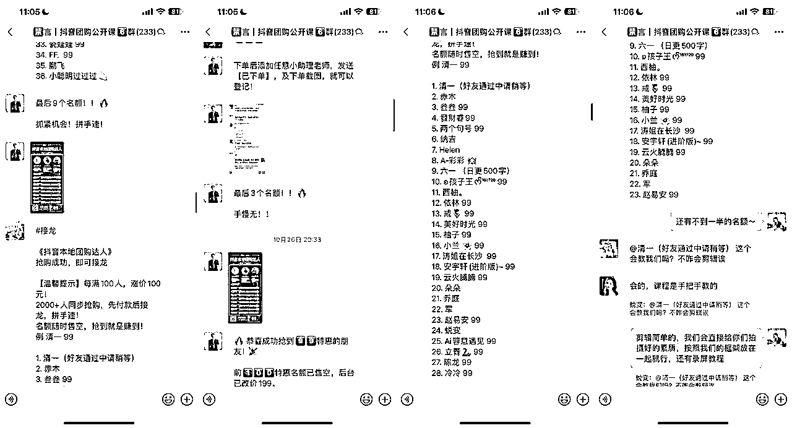

在这个过程中，我们就是要不断的给到用户紧迫感，让她们感受到，我多犹豫一秒，产品都会被卖空，还是先下手为强。

#### b、现场答疑，全社群通报

课程上完了，问题肯定会很多。所以现场答疑很重要，这也是成交环节至关重要的一环。

这个环节要做的，就是打消那些没下单的小伙伴的困惑。这一类人只要解决了她们的问题基本上就会成交大。

但我们社群这么多，同样的问题一定会在不同的社群当中出现，或者说有些小伙伴根本就不会提问，都是在潜水围观的。

所以这个时候，一个社群的答疑，我们就会截图，同步转发到其他各个社群当中，刺激大家下单，效率也大大的提高了。

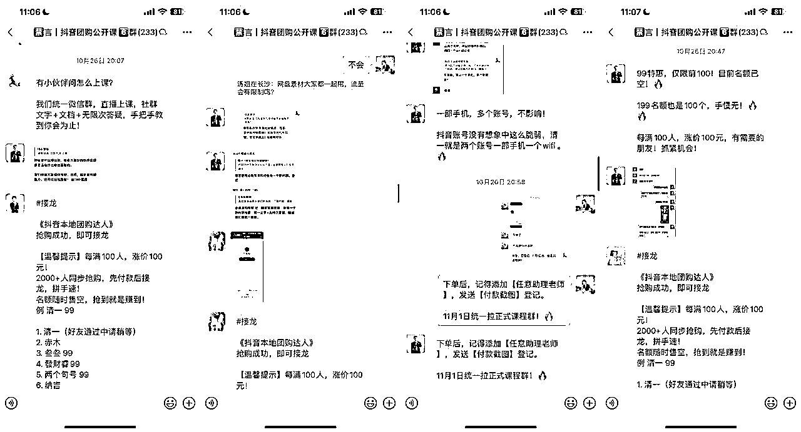

#### c、朋友圈营造成交氛围

社群到位，朋友圈也一定得到位，很多人可能在付费阶段是没空看社群的，这个时候发朋友圈也是起到一个提示作用。

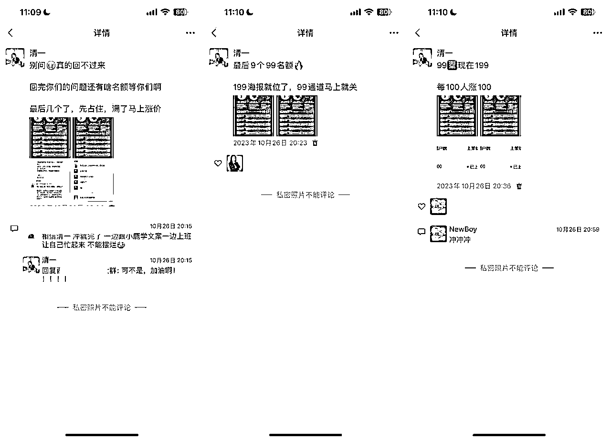

当时我在朋友圈发的时候就有个别小伙伴来评论“清一的产品放心冲就对了”，共友看到这也是一个很好的证言。

我在朋友圈是直接晒海报+播报名额，涨价后就带着199的订单截图一起晒。效果确实不错，很多人是私信成交的。

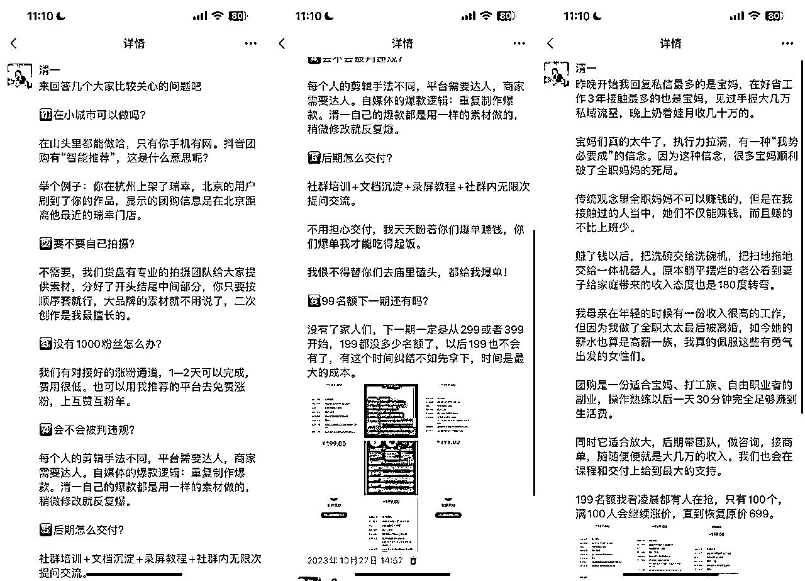

### 3）成交后端承接

大型发售必然会有一个问题，就是付费后的安排。用户不知道找谁，全部联系到我这儿，好友通过不及时，会引起退费。

这个环节一定要安排几个小助理，在群内通报，付费后添加任意助理报备即可。

团队成员做好记录，在开课的时候都拉进群就好。

这里可以准备一短文案，仪式感不能少。要让人觉得自己是抢到了赚到了。

“恭喜宝成功抢占特惠价名额！开启抖音团购掘金之路！

咱们会在11月1日统一拉群哦~”

这是我们当时准备好的文案，每付费一个就转发过去，告知开课时间，恭喜抢到特惠价名额，只要耐心等候开课就好。

这里提醒大家一点，千万别觉得用户付费了，就不用管了，付费后的售后服务也要做好才行。

我们得对信任我们的学员负责，更得对帮助我们分销的朋友负责。

## 2、发售经验，优化小结

在成交上，我们也总结了部分经验，分享给大家：

### 1）延迟成交，切勿急功近利

做群发售不适合第一天就放出付款渠道，一上来就要收费，容易让人觉得在割韭菜，体验感下降。

建议可以选择在第二天或者第三天去放出成交信息或营销信息，做成交千万不能着急。

先给到用户想要的内容，获取基本信任，再告诉对方可以下单，成交率也能更高。

### 2）群发答疑，带动成交气氛

复盘整个发售成交关键节点，我们发现，在2天的成交环节中，起到最大作用的就是答疑。

每次答疑阶段，下单量、成交量就会猛增。

因为答疑是消除顾虑的好办法，所以在群发售课程结束后，一定要安排每个社群的答疑人员进行轮番转播答疑信息。

及时答疑解惑，才能让用户安心下单。

### 3）登记明确，做好承接后续

我们在这场发售当中是有很多突发状况的，比如马上要开课了，却联系不上学员。

所以，建议大家要求每一个小助理都要对学员的付款信息进行登记，当时我们只是从小鹅通后台导出了名单，付款人和微信名时常有对不上的，在找学员上花费了大把时间。

在这里，大家可以优化付费渠道，方便自己做交付的同时，也能给学员良好的学习体验，避免出现退费情况。

这次群发售，我们基本没有退费情况，大家都很满意。

# 六、心得体会

最后来分享一下这次群发售，我的一些心得体会吧。

在过往经历当中，我也参与过很多场群发售，但不同的是，之前，我只是其中的一个环节，而不是操盘手。

但这一次，是我们的小团队自己操盘，从0-1负责全部流程，所以还是有很多收获与感悟的，我总结了以下3点。

## 1、真诚利他，价值到位

利他是一切销售的起点。在这场群发售的课程中，我们把把整个课程的核心实操环节都拿出来讲了，丝毫没有藏着掖着，就连录屏教程都给大家伙上了。

想通过群发售的公开课来获取用户好感让用户自发下单，在内容上就一定不能离开“利他”二字，从分享稿上首先要解决的就是“利他”。

在我们分销群当中也是一样的，该发的大红包得发，该给的佣金和福利得到位，大家辛苦帮我做发售放心的把流量交给我，自然是不能在这上头便宜了自己的战友。

合作的本质其实就是先给予，给到别人赚钱的机会，给到别人支持和帮助，最后反哺成就了自己。

如果你的发心不正，你抱着“利用合作伙伴的”思维，那做任何项目，一行动就会犯错。因为你的底层逻辑就是错的，那么好事也能变坏事。如果你合作是抱着利他的思维，坏事也能变好事。

## 2、善于合作，取长补短

为什么要有团队？为什么要找合作人？

我觉得本质上是为了把每个人的优势放到最大，去弥补另一方的劣势，通过互补互助达到工作效率最大化。如果只有一个人能力强是不行的，团队写作需要每个人各尽其责，与其他成员共同合作。

比如这一次的发售，我的影响力靠前，我出去摇人，我去拉大旗，我主要就是带动整个气氛。

再比如小鹿的优势在于文案写得好，细节把控到位，所以这一场发售所有的分享稿以及宣发文案都是她来撰写的，在这期间她的文案被称为“意大利炮”“印钞机”，用上了的分销小伙伴都说好。

像一群，是节奏稳，能把控大方向，整一场发售看似她冒泡次数不多，但是她在幕后把控整个节奏，突发状况如何解决等等，中间的协调和组织都是靠着她。

还有吕腾飞老师，他主要负责了整个社群的搭建，这个群满了，马上跟上第二个群。在这期间他是全方位的操控社群，有人爆粉第一时间踢出，提前做好机器人的欢迎设置，群公告的设置。

好的团队，好的合作伙伴，才能效率最大化，拿到好的结果。

## 3、“大雁型”团队，事半功倍

如果一个团队像一盘散沙，或者像一滩死水，就算你的产品再好，一场群发售也很难给它打爆。

因为团队没有足够的凝聚力，更没有团体意识。领导有能力，仅限于领导；干将有本事，但仅限于干将，无处发挥。

大雁型团队，是有超强的凝聚力和团体合作意识，在所有人的带领下可以像候鸟大雁一样，无论从南到北，还是从东到西，不管是严寒酷暑还是风霜雨雪，都能够清晰牢记自己的目的地，进行人字飞行。

无论外界的环境如何变动，阵型也能跟着时刻变动，从容应对所有危机。唯一不变的就是这个团队的心中所想，大雁尚且如何，更何况是作为万物灵长的我们呢？

所以这次，我们团队很重要的一点就是，能齐心协力，劲儿往一处使。这种超强凝聚力，也给了我们安心把后背交给对方的底气，最终取得不错的成绩。

以上就是我本次发售的群发售。

在最后，我要感谢平台，在这里我认识到了很多同频的朋友，前行的指路人，以及完美的合作伙伴。

2023年，这是我真正意义上做副业的一年，从做出一套自己的课程，再到跑通现在的团购项目，我常常在感慨，这真是我20几年来最棒的开始。

自媒体对普通人而言，就是机会和红利。

就算我们原本很普通、没有出色的技能和资源，但也能收获到原本不可能实现的成绩，达到原本不敢想象的高度。

感谢观看，真心祝愿大家，万事胜意！