# 3个月0成本带260名学员，在得物薅羊毛搞钱的经验分享

> 来源：[https://jvx6nnxr4va.feishu.cn/docx/OWMKdEzHRofCXsxGcRecacSZnVb](https://jvx6nnxr4va.feishu.cn/docx/OWMKdEzHRofCXsxGcRecacSZnVb)

大家好，我是小又。

我从8月开始做得物好物种草这个项目，8月下旬的时候我和我的搭档一起做了一个得物变现内测打卡营，把我们跑通的经验做成了一个新手课，打卡营成材率70%多。

后来又被陈舟Amber老师邀请去她的星球做得物变现打卡营，目前这个打卡营也结束了，上岸率68%。

目前为止，我们已经带了近260名学员在得物搞钱了。

我自己上个月在得物接了22次合作（9月操作不当违规，被关小黑屋，整个9月没有接到合作），变现200多，产品价值4000+，接到的合作有日用品、化妆品、护肤品、首饰等。

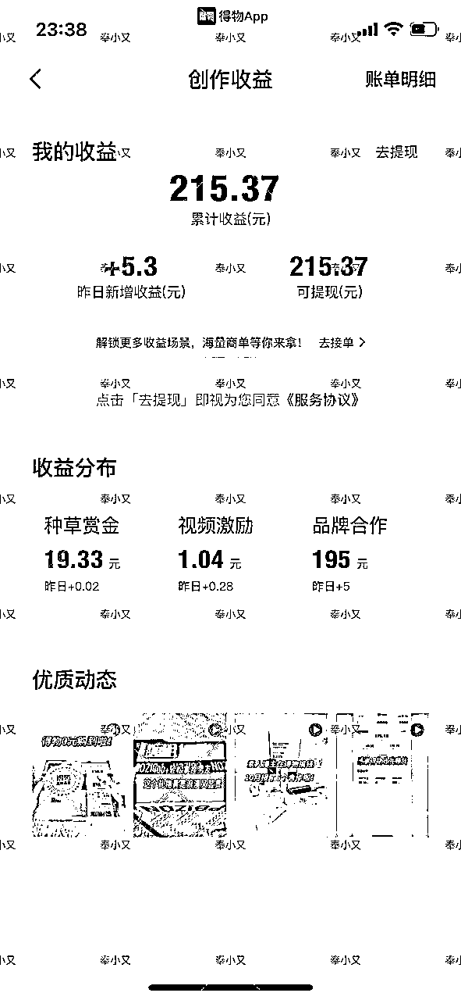

别看佣金不高，但是创作难度很低啊，一般拍照+发布，我基本十几分钟就搞定了，商家送的产品，都是我能用上的，基本上都不用买了，这就省下了很大一笔，省了等于赚。而且，我非常佛系，因为又要带娃又要带学员，并且我才一百多粉，这个变现难度真的很低了！

以下是我接到的一些合作的截图。

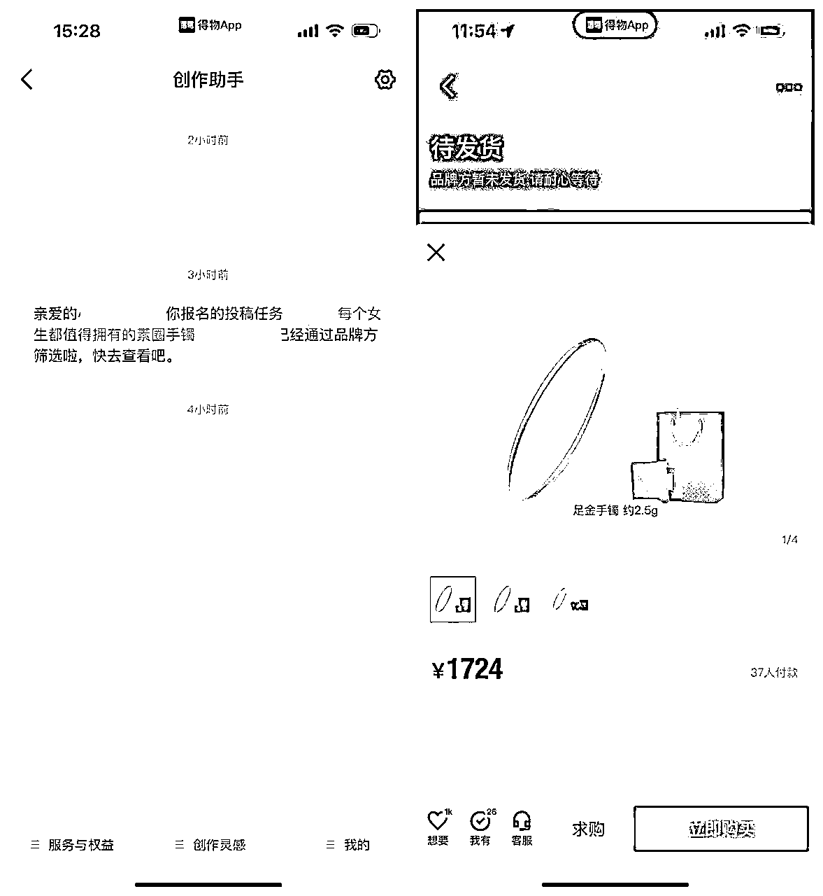

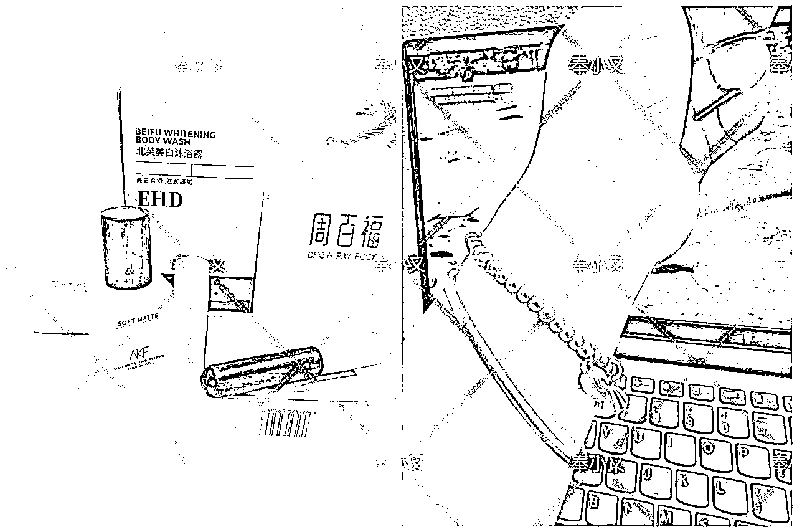

我们打卡营还有同学接到了花花公子、黄金首饰（送拍大多是合金）、玉饰、大牌香水、美瞳、各种化妆品等合作。

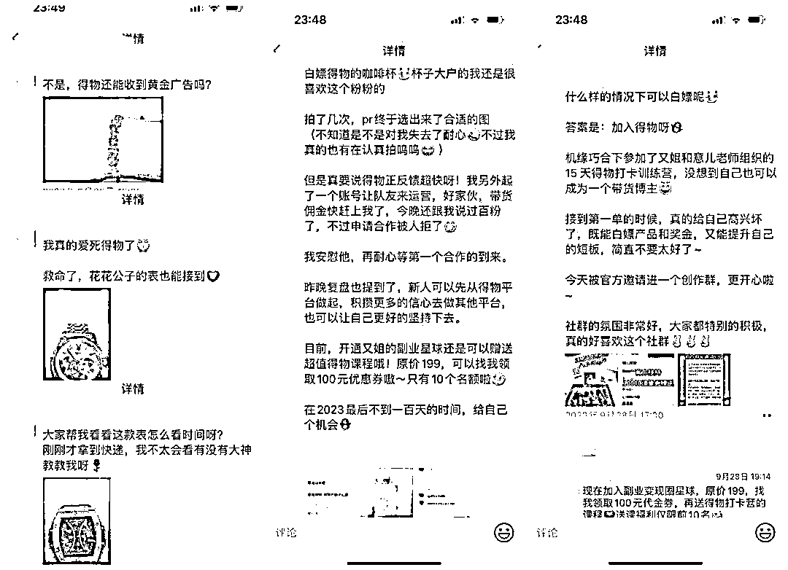

有些同学的合作费用已经到一百多一条了。

# 一、得物好物种草如何变现？

## 1.挂链接种草

有人通过你的链接下单，你就有佣金，这个0粉都可以挂，真的太拉好感了，其他平台大多有粉丝量要求，但是得物没有，只要你挂上链接就有可能赚钱。

给大家看下种草赏金。

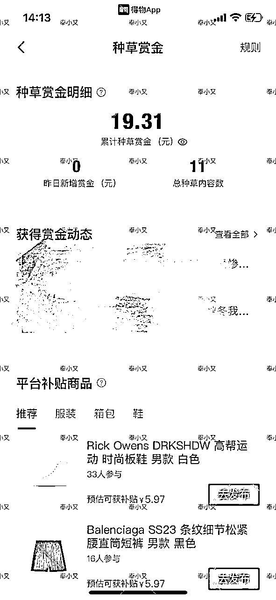

我目前种草的都是一些单价比较低的产品，所以佣金也不高，主要是接合作居多。但苍蝇腿也是肉，积少成多，一边接合作，一边拿种草赏金，一篇动态两份收入，奶茶、早餐就有了，也非常不错了。

大家再看下我们在这期训练营学员的种草赏金。

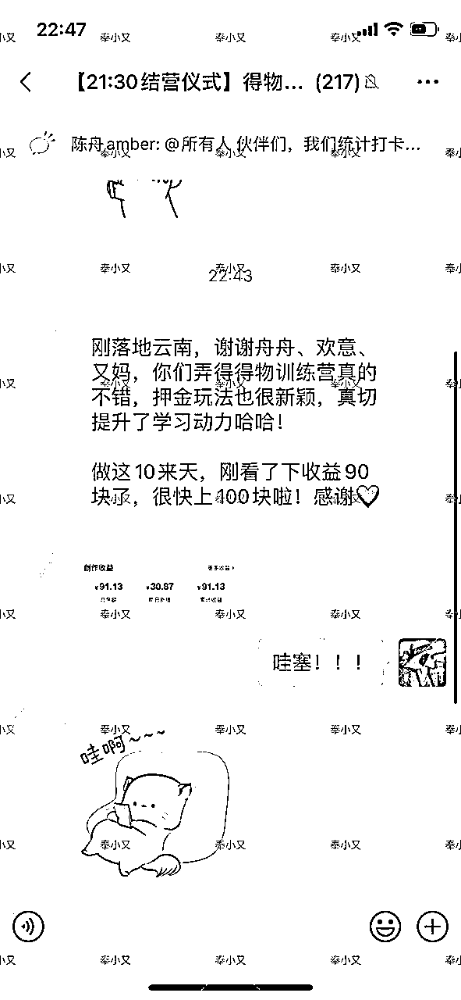

她带货的是一个轻奢小包包，这个数是她做得物十天的收益，光种草赏金就90多了，她发张图的时候还没有开始合作商单，这篇动态爆了，浏览量目前1w+，数据这么好，之后也很有机会接定向合作（商家主动邀请的合作，不用跟其他达人竞争），佣金会更高。

## 2.满百粉入驻引力平台接单

不仅可以拿到产品，还有广告费，如果粉丝量上去了，平台还会直接推荐商单，或者商家跟你定向合作，这样佣金更高。

给大家看下部分合作记录。

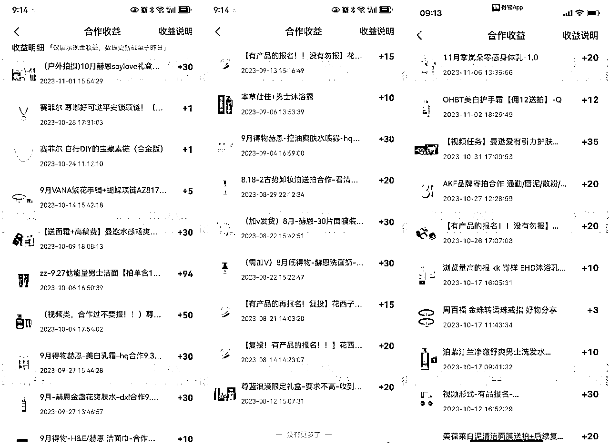

百粉左右的合作佣金确实不太高，但是很容易达到百粉呀~而且这些都是送产品的，这些产品你用得上就自己用，省了一大笔开销，用不上就闲鱼出掉，又可以赚一笔。

我的搭档意儿一周破百，她是兼职去做这件事的，平时工作也很忙。我十天左右破百，因为我要带孩子还要带私教学员，所以也是挤时间做的，我每天在得物上花的时间最多就半小时，如果拍视频的话。

我们的学员里有三四天破百粉的，基本上按新手课去操作的，都能顺利开通品牌合作权限。

过500粉能接到的合作又跟100粉不一样，佣金更高，可选择的合作更多，过1000粉又能再上一个台阶。还能接很多商家主动邀请的合作，也就是定向合作，这样佣金更高，几百几千都有。

## 3.视频号收益

一个月内发布4条20秒以上的视频，总阅读量过1000，就可以开通视频号。开通权限以后，你发的视频有人看，你就有钱赚。

这个模式很多平台都有，得物上也不少。

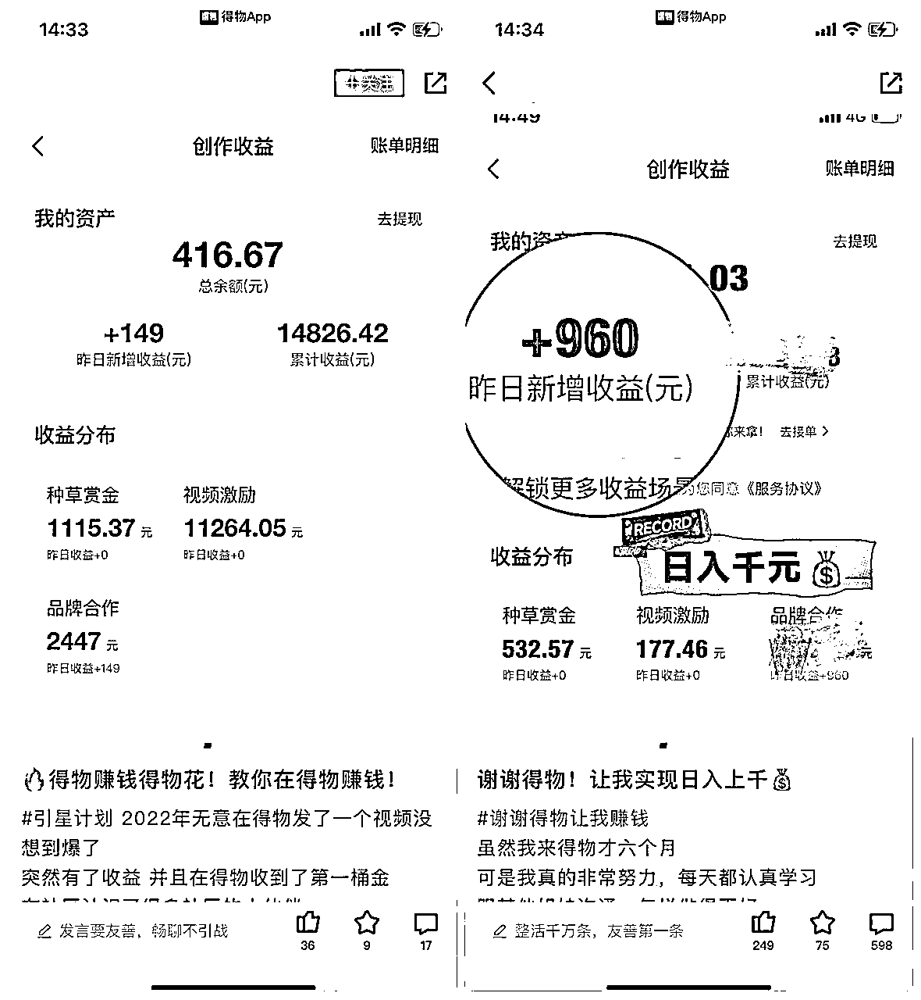

我们的新手课主要是讲怎么通过好物种草变现。

以上是常见的三个方式，还有一些进阶的玩法，可以慢慢解锁。

做得物好物种草，我不敢保证你一加入就月入几千过万，那不现实，也有割韭菜的嫌疑，但是快速涨到100来粉，在得物赚点零花钱，顺便实现日用品自由，还是很容易的。

持续深耕，月入几千过万也不是不可能。

# 二、如何快速达到100粉

好物赛道靠自然涨粉其实还是比较难的，我这边就接到三位学员，做女性成长（图文）、文案号（图文），涨粉到一百多的，但是申请入驻引力平台（类似小红书蒲公英平台）一直不通过。有一位同学成功入驻了，但是一直接不到合作。

得物本身就是个购物平台，我们可以把自己代入商家的角色，如果你想找人投广告，点进对方主页，看不到任何一条种草的内容，那么作为商家，你会考虑给这样的号投广告吗？

大概率不会。

但是做好物种草要自然涨粉，对于新手来说，还是很不容易的，因为种草的人太多了，用户要看到你的动态还是不那么容易的，这时候我们就要用点巧劲。

## 1.互粉。

去搜“得物赚钱”这个话题，看评论区大家是怎么做的，你就跟着怎么做。如图：

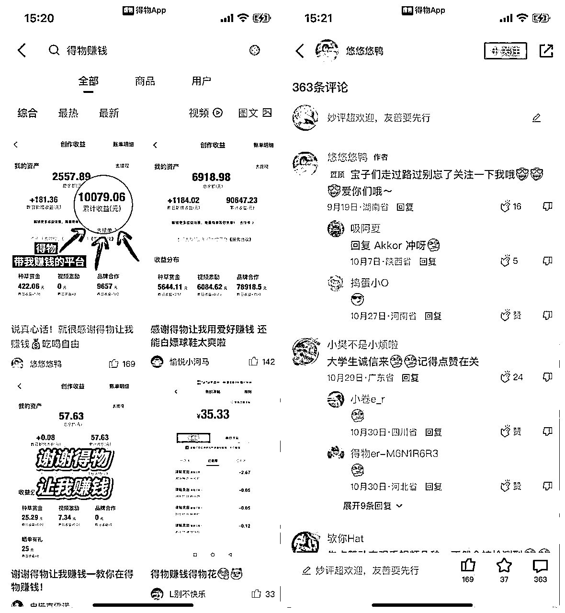

但是要注意，要分时间段去做这个动作，不要一次性关注太多人，也不要秒关注，要模拟正常用户，进对方主页浏览点赞后再关注，不然很容易违规。

另外，新手小伙伴最好不要自己发这样的互粉动态，不知道操作方法也很容易违规。

## 2.内容涨粉。

我们前面说了，新手纯靠种草内容涨粉比较难，但是有小伙伴发女性成长or男生自律、文案号之类的涨粉情况不错，那我们就可以混着发。

前期起号可以发一些这样的动态，然后再发一些好物种草，等过百粉就多发好物种草，这样不管是申请入驻引力平台还是接商单都会比较容易。

但是也要提醒大家，得物是对内容质量要求比较严格的平台，千万不要搬运别人的东西来发布，也尽量不要从别的平台直接搬运到得物，被发现的话会被判低质内容，情节严重的有可能会被封号。

# 三、官方亲自扶持新人

目前为止，没有任何一个平台像得物这样对新人这么友好，不仅变现容易，官方还亲自举办萌新训练营，教你怎么做得物账号，做得好的同学不仅给流量还给大额无门槛券，直接实现得物0元购。

我们带的学员里就有很多小伙伴得到了扶持。

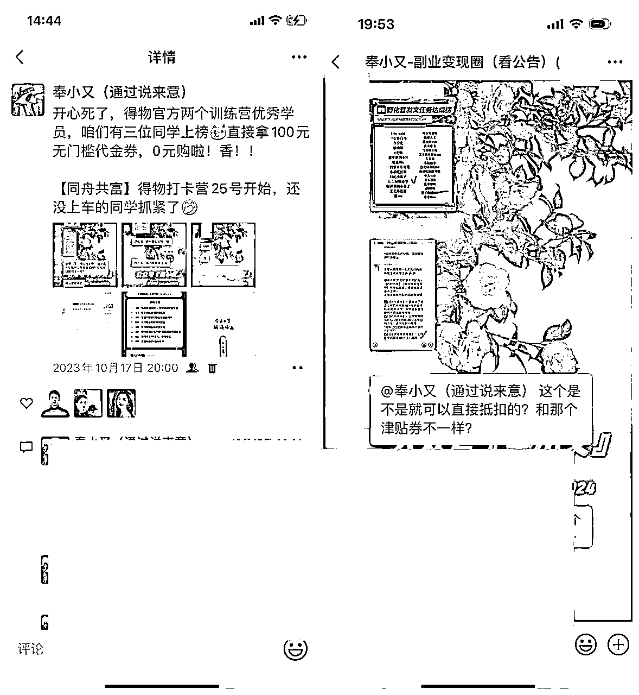

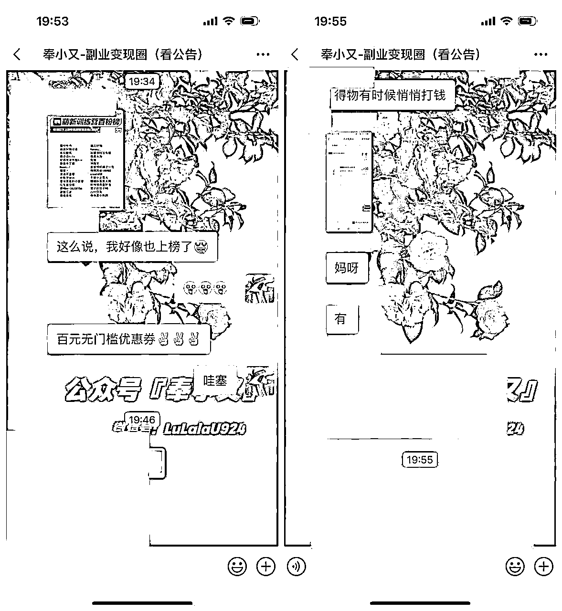

88元、100元无门槛券真的送！还有很多大额流量券，可以用来给你的产品助推曝光。我搭档意儿在得物实现好几次0元购了，我自己佛系操作也有两次

那怎么加入官方训练营呢？

首先你的账号必须是健康的，并且是在正常发布原创动态的，只要内容够优质，官方会主动联系你，邀请你加入社群。

其次，如果没有被官方邀请，还可以去官方账号的训练营招募动态下报名，官方会查看报名信息，挑选一些有潜力的人邀请进群。

所以官方的训练营不是人人的都可以进的，毕竟得物的作者那么多，要被选中也需要一些条件，比如没有违规记录，发布的内容比较优质等。

我们可以先看下百粉可以申请的合作页面。

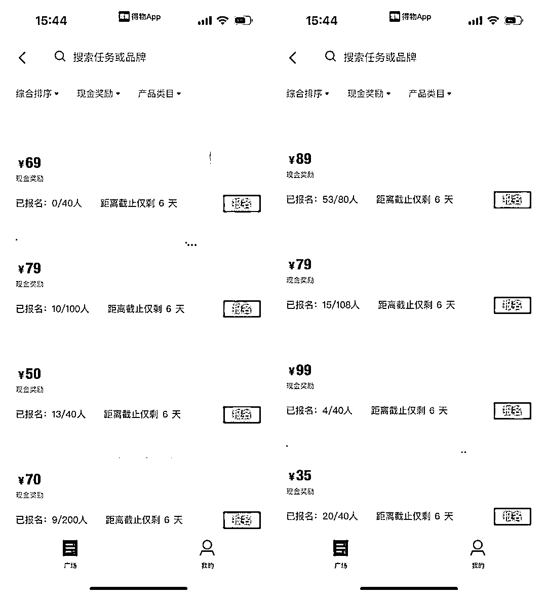

这些合作只要你觉得自己能做到，都可以点击报名去申请合作，品牌方审核达人信息后，合适的话就会通过合作申请，合作方式有置换，也有稿费+置换，你手上有这个产品的话，还以接复投的合作，就是你直接发布，商家不用送产品给你。

如果合作愉快，pr也会跟你约复投。一份产品再拍一组照片再发一次，就能再赚一份钱。

但前期其实顺利接到合作还是比较难的，有些同学申请了二十几个都不通过。

一般这种情况就是你发布的内容跟商家种草的要求相差有点大，比如产品展示丰富度，文案真实度等。这个时候可以选择接一些置换的合作，就是产品送给你，但是没有稿费。

这样的合作是比较容易通过了，可以适当接几个，找找合作的感觉，再按照接合作的要求自己发布一些原创的种草动态，这个时候你再去接有佣金的合作就会比较容易。

# 四、新手如何快速编写优质种草动态？

这些大家自己可以在得物app的推荐页面看到

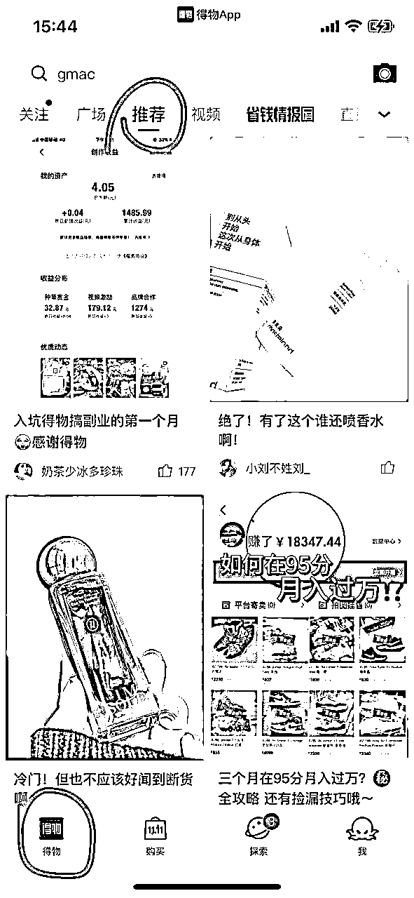

挑一些近期种草动态点赞比较多的动态进去看看就知道了。

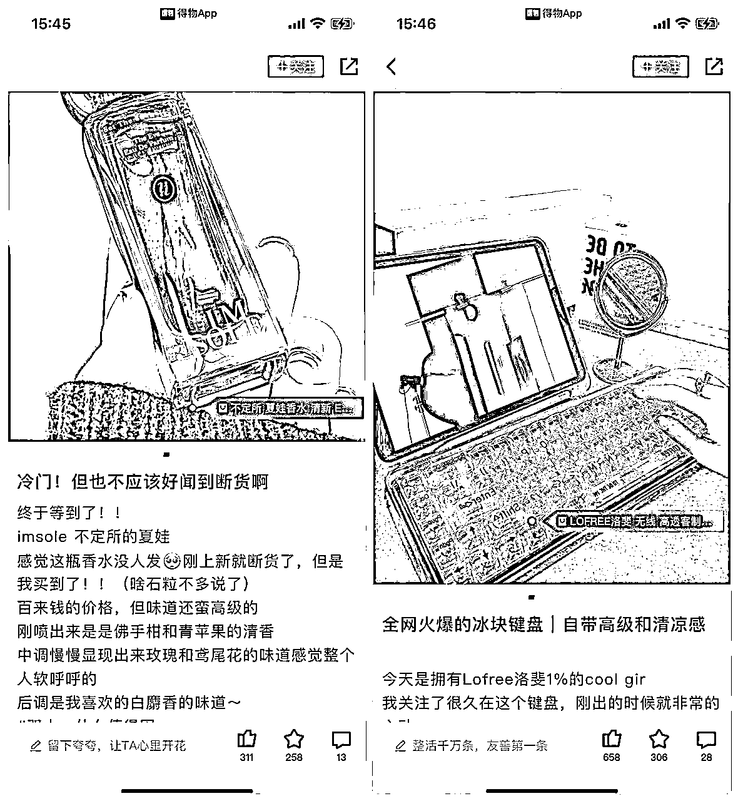

大家应该发现了，得物的种草动态跟小红书很像。

但毕竟是两个不同的平台，所以规则还是不太一样的，有些在小红书被允许，在得物就会违规，得物更关注真实性，特别是文案的描述，一定要第一视角去写。

如果文案多以第三方视角描写就会被判定低质营销，会违规限流。

另外种草图片也不能P得太过，得物要求真实美观，跟产品生硬摆拍也会被判为营销内容。

违规多次会严重影响账号健康等级，轻则不能接单，重则永久封号。

总的来说，涨粉到100不难，难的是长久的运营。

# 五、总结

得物这个项目，如果不做视频号爆款，就做个种草的小项目也是很香的，主要是也花不了多少时间，一些粉丝比较多的博主，一条广告佣金也不少，而这里的“粉丝比较多”比起其他平台真的是很少了，也就几百粉几千粉。

而且得物现在还没有那么卷，趁早入局，难度相对来说会小一些，不管什么平台，一开始都会很宽容，一旦创作者多了，各种规则也就越来越严苛。

感兴趣的朋友可以去尝试一下。