# 小白如何快速在闲鱼单月单账号变现4000

> 来源：[https://pxt8xmjdee.feishu.cn/docx/PPAqd7pwSoGTq6xG8o4c5RBWnnf](https://pxt8xmjdee.feishu.cn/docx/PPAqd7pwSoGTq6xG8o4c5RBWnnf)

大家好，我是陈不胖。

95年，一直都觉得自己天赋不高，所以只会使蛮劲在闲鱼赛道上蛮干。

20年全职闲鱼，目前主要在做户外，宠物以及大百货领域，到现在已经深耕三年。

从17年大学毕业之后就对线上赚钱的项目疯狂上头，但受限于当时的认知缺陷，导致一直被割韭菜。

按理来说一个人被割几次韭菜就应该老实了，但架不住一个人真的喜欢和热爱。

所以在17-19年这两年时间里，基本上一直都是处于：找项目---失败---付费被割韭菜---再失败---再找项目---又失败---再付费又被割韭菜---再失败的循环被割韭菜失败的状态中。

直到19年才逐渐缓过味儿来，失败的原因其实一直都不在项目上，而是自己当时的实力和认知配不上这些项目。

一个毫无背景，资源，能力，认知的普通人非要去干一年赚一百万的项目，还偏偏试图一口气吃成大胖子，这样不失败才怪了呢。

自己的实力就只有30分，非得要去干100分的事情能不吃亏么。

回过味儿之后，我开始认真审视自己，我需要的是什么？追求的是什么？我拥有什么？我还要有什么才能到达我的追求？

经过一番剧烈的自我审视之后，我发现我在这失败的两年时间里好像什么都没有学到，即使我知道各种花里胡哨的搞钱方法。

用现在的话来说就是，我成为了一个 “ 高认知 ” 的穷人。

可是你让我放弃选择线上的这条路，我又不甘心，毕竟我已经付出了这么多的时间，金钱，精力却毫无收获。

现在放弃不就等于一切归零了吗？或许再坚持一下就能看到日出了呢？

我开始盯上了互联网上最简单的项目”闲鱼电商“，我准备做最后的殊死一搏。

如果我在最简单的闲鱼上都赚不到钱，我就在线上赚钱这件事上彻底死心。

幸亏命运选择眷顾于我，在我尝试做闲鱼的第三个月，我单账号单月赚到了八千。

现在回头一看，感觉真是一场豪赌，一路上我见到太多的人坚持不下去而选择放弃。

在惨败的代价当中，金钱反而是最小最微不足道的代价，在这当中失去的时间和精力，那才是最高昂的代价。

人在成长过程中，又能有多少时间让你犯错的呢？

正因为自己经历过这段煎熬的时间，也知道一个人独自做项目的举步维艰，所以才想分享一些内容至少让别人走的轻松一些。

这篇文章蕴藏着我三年的闲鱼经验和全套的运营策略，我不敢保证你看完之后单账号单月可以赚一万，但我可以保证的是你看完之后绝对知道该怎么去做闲鱼，如果非要量化的话，我觉得这一篇看完单月单账号四千真的跟玩一样。

至于如何两个月在闲鱼上赚70万，对不起，我真的做不到。。。。

一篇文章很难把三年的经验和实操全部写完，同时为了保持文章的逻辑性和连贯性，如果你还有一些疑问在这篇文章没有解决欢迎提问，

以下为正文目录：

tips：目录的思维导图可滑动，也可直接点击跳转到指定目录。

任何项目把它拆解到最小单元就只有三步走：第一，怎么搞流量？第二，怎么提高转化？第三，怎么选产品？

目录中的一二章节为如何获取流量，三五章节为提高流量转化，4章节为如何选择产品。

在闲鱼中，商品获取流量曝光的来源从大体上看就只有两个流量来源，一是搜索流量，二是推荐流量。

其中推荐流量又可分为，首页推荐，详情页推荐，同城推荐三部分 。

整体来看，各个场景的商品流量占比从高到低：搜索>首页推荐>详情页推荐>同城推荐。

所以第一部分我们将从流量部分出发，先把流量搞到手，再去讨论流量转化部分，毕竟酒香也怕巷子深。

# 1.搜索流量：如何让商品排名在全国第一？

搜索流量的展现逻辑为：用户输入关键词----通过关键词将商品召回----根据商品权重进行排序

也就是说我们的商品要想拿到搜索流量，首要原则就是我们的标题部分要包含用户搜索量高的关键词。

在标题当中布局关键词，才仅仅只是拿到基础的展现机会而已，要想吃掉搜索流量的大部分就需要通过人工干预将商品排序放在前面。

tips：闲鱼的标题部分为文案的前30个字

## 1.1标题如何布局关键词

闲鱼的标题只有30个字，可谓是处处珍贵，所以找到买家搜索量高的关键词就成了非常关键的一环。

我们可以借用一些关键词插件来完成这部分工作。

“店侦探” 插件下载地址：用户登陆-店侦探

第一步，在布局关键词之前，我们需要先把商品的主词给罗列出来。

在这里我们以月亮椅为例，它也可以叫

户外折叠椅

写生椅

钓鱼椅

每个地方的对一件商品的称呼都不一样，一级词其实就是不同地方的对同一件商品的不同称呼，如果想不出来的话就去淘宝看看十万加的标题中的一级关键词。

第二步，在店侦探插件中搜索找到的主词，记录搜索人气高的二级词。

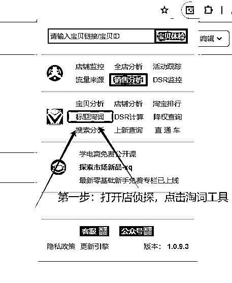

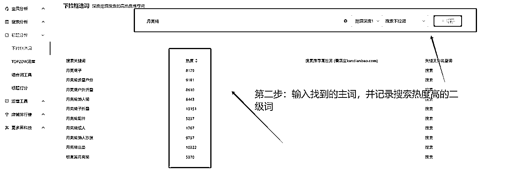

由此我们就得到了以下关键词的热度：

月亮椅------------月亮椅子折叠

户外折叠椅-------户外折叠椅躺椅

写生椅------------写生折叠椅

钓鱼椅------------钓鱼椅便携式

第三步，标题布局关键词

在关键词的最前端，我们需要营销词来承载搜索流量，要刺激买家点击我们的商品链接。

例如：【最后二十把】【店铺倒闭】之类

紧接着后面就是商品的主词：月亮椅子折叠，这样既能让用户知道我们在做活动，又能让他直观感受到我们在卖什么东西。

后面的词则随意组合顺序，我们就得到了一个标题。

【店铺倒闭】月亮椅子折叠户外折叠椅躺椅写生折叠椅钓鱼椅便携式

tips：前置的营销词非常关键，它的作用主要是用来承载流量的。

## 1.2如何将商品人工干预到全国第一的位置？

标题中关键词的布局足以让我们拿到搜索流量的入局门票，但展现位置是全国第一还是全国倒数第一的流量完全不一样。

买家在购买商品时，基本上很少有耐心看完每一个商品的。

所以要想拿到大部分的搜索流量，就一定要通过人工干预的手段把商品的排名放在全国前十的位置。

tips：在开始人工干预之前需要准备两个闲鱼账号，两个支付宝账号，一个人工干预的群聊（群聊可以通过QQ群或者贴吧去找，如果找不到的话可以直接找我要）

第一步，先找到自己商品的位置。

我们先搜索我们标题当中的主词看看能不能找到我们自己的商品。

在这里我们以宠物尿垫举例，我们可以直接在搜索栏直接搜索 ” 宠物尿垫 “

可以通过筛选更快速的找到自己的商品

新上架的商品因为没有基础数据积累，所以直接搜索商品主词找我们上架的商品会比较困难。

我们可以通过筛选区域，价格，加长关键词等办法来更快速的定位自己的商品。

1，通过筛选自己商品的发布地区来缩小范围。

例如我们在搜索 ” 宠物尿垫 “ 前一百的商品当中没有出现我们的商品时，就需要在区域（具体位置见下图）这里从省---市---区的顺序逐步筛选直至找到我们的商品。

在人工干预步骤当中，这个操作步骤叫卡地区。

2，通过筛选价格区间来缩小范围。

当区域筛选到区级，前100个商品中依旧没有出现我们的商品时，就需要卡一下价格区间，以商品规格当中的最低价为准。

在人工干预步骤中，这个操作步骤叫卡价格。

3，正常情况下，通过卡地区卡价格一般都可以在前100的商品中定位到自己的商品，如果两种操作结束之后依旧定不到自己的商品，就需要延长我们的搜索词。

例如我们之前搜索的是 ” 宠物尿垫 “ ，经过卡地区卡价格都没有找到的情况下，就需要把搜索的关键词延长至 “ 宠物尿垫200片 ” ，然后再卡地区卡价格来一遍，直至找到自己的商品为止。

在延长搜索的关键词时，不要加营销词。

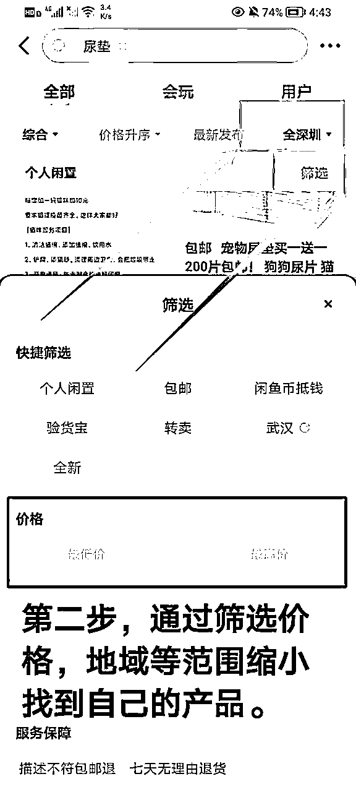

在经过上述的三种方式的筛选之后，我们基本上都可以找到我们的商品。

但是为了避免别人直接通过全标题搜索直接找到，所以除了头像和主图之外，其他所有能透露出关键信息的地方都需要打码。

毕竟我们人工干预的目的就是获取关键词下商品排序的权重，别人如果直接全标题搜索，那这种人工干预对我们来说一点意义都没有。

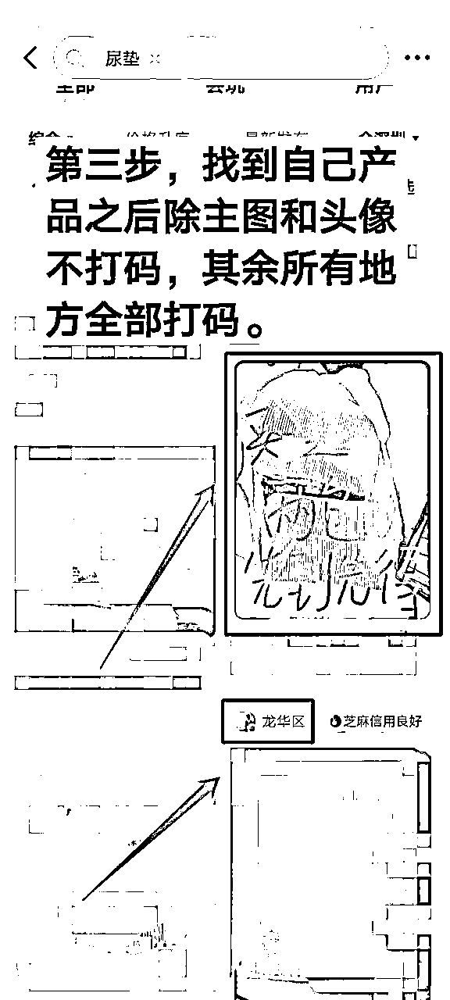

第二步，拿上已经打好码的图片，去找人人工干预了

先在群里找到需要干预的人，一般发图的都是当下有时间进行操作的。

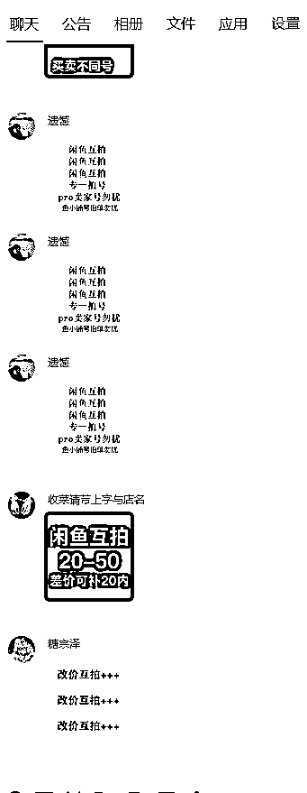

有些人会对sd过程中的金额，类目，账号都有一些要求，一定要看准要求之后再加，要不然挺耽误时间的。

例如下面这张图，要求开通了鱼小铺账号的不给刷，不满足条件就直接换人，或者主动出击，直接发图等人来加。

确认好干预的对象之后，加上之后先确认类目，金额，账号，双方都ok的情况下再进行后续操作。

一般同类目就不会相互干预，账号一般都要求下单账号是未开通鱼小铺的纯素人账号。

如果金额有差异的话，比如说我们的商品是10元，他的需要65，就需要先问他能不能补差价，一般补差价都是在刷完之后支付宝补的差价。

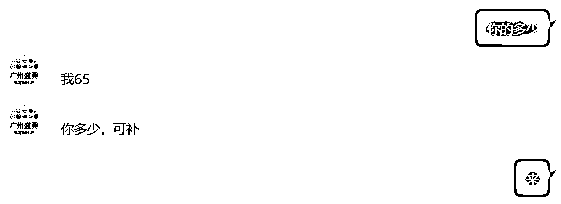

第三步：双方都接受的话，对方会给你发一张图，如下图。而这个时候我们也需要把前面做好的马赛克图发给他。

第四步，拿到图之后，我们按照前面找我们自己商品的方法去定位到他的商品

先通过图片中的关键词，在搜索栏里搜索 ” 汉兰达三爪火花塞 “，如果前100个商品找不到跟图片中相同的主图和头像的话。

就需要找对方要发布地址，一般都会逐步从省，市，区为顺序给，如果到区级前100的商品都没有的话，就需要卡价格。

找到商品之后截图发给对方先确认是不是这个链接，然后告知排名情况，例如国20，省30等等。

与此同时，对方也在执行这部分操作，及时沟通就行。

第五步，开始操作人工干预

双方都确认好链接情况时，就需要沟通剩下需要执行的操作，例如下图。

我们需要对方执行的操作最少有两步:

1,必须要求对方货比三家，只有货比三家才能让下单账号打上标签和轨迹，这样不容易打乱人群标签。

2，必须深度浏览，最后收尾时以两条5s以上语音收尾。（后面发货时，会点无需发货，所以收尾必须要语音收尾）

第六步，拍完之后，相互约好三天后收货好评（群内一般沟通用收菜来代替），在收货当天把店铺名字和需要好评的内容和图片都发给对方。

至于评论的内容和图片都可以在淘宝和拼多多去找，也可以用批量采集软件去采集评价区。

tips：闲鱼的任何数据补充都有很多方式，例如补浏览数，想要数，人工干预等方法。

但我的建议是能不用就尽量不用，任何的方法技巧多多少少都会导致人群画像的偏差。

闲鱼又不同于其他平台，没有付费渠道矫正人群画像，只能花时间让人群画像自己跑正，所以只要出现人群画像偏差就只能等。

在给商品链接补数据的时候，一定要注意甄选，补数据只能加速商品爆款，不能直接让商品成为爆款，爆款的最终因素一定在内容上。

要优先选择本身数据表现好的商品链接上，至于不好的商品链接就放到一边去就好了。

最后给大家一组爆款数据作为参考标准：曝光----浏览----想要----下单----好评=10000：100：10：3：1。

要记住，爆款永远都是下一个商品链接。

# 2.推荐流量，获取商品高流量的深层逻辑

如果你不知道你为什么成功，那这样的成功就不能复制，如果你不知道你为什么失败，那这样的失败就毫无意义。

现在做闲鱼的很多人商品有流量出单了不知道为什么出单，商品没有流量出不了单又不知道为什么没有流量，也不知道该如何下手去优化。

要想获得推荐流量，就一定要搞清楚平台推荐流量的逻辑。

只有在规则之内玩游戏才能事半功倍。

## 2.1闲鱼为什么给我们推送流量？

商品的推荐流量基于平台的算法，看似庞杂且毫无头绪，但其实一直都有一条清晰的路线。

那就是站在平台的角度上，最终希望的还是每一个流量都能发挥出最大的价值，谁能让流量发挥出最大的价值谁就能获得流量。

在闲鱼中，流量的最大的价值就是买家和卖家之间产生的交易，所以说谁的商品转化高，谁就能体现流量的价值，谁就能获得流量。

但任何事情都是有对比才有差距，就像只有知道丑才知道什么是美一样，商品转化高也需要对比，需要量化。

于是平台把用户的反馈动作作为反馈数据，再进行筛选。

例如一件商品，平台推送给用户，用户看到了（曝光），想继续了解就点击商品（产生浏览数据）。

如果看到了但不感兴趣就会直接划走（只有曝光没有浏览数据）

换一句话来说就是，不管用户有什么样的动作反馈就都会产生数据。

这个时候平台把流量分层级，将同类型的内容都丢入到同一个流量层级当中，直接抓取买家的反馈动作数据，将其中数据优秀的前20%推送到下一个流量池。

通过层层筛选，就能确保杀到最后流量池的商品拥有不菲的商品转化能力。

于此同时，其他卖家不断上新的产品也在不断的刷新数据，杀入到下一个流量池，这就完成了一个动态的新旧交替。

所以我们链接的寿命取决于我们的内容到底有多优秀，取决于我们的商品内容能坚持多久被筛选掉。

## 2.3我们该如何迎合平台获取更多的流量？

平台对内容的判定流程主要是由以下三步构成。

平台根据买家的喜好进行推送商品-----内容引发用户动作反馈----平台抓取用户反馈数据----数据进入赛马机制

而这其中最关键的媒介就是数据，也就是说只要数据好，平台就认为你的内容好，并由此给你分布更多流量。

由此就产生两个优化数据的方向。

第一种数据技巧流，面向平台算法，通过人工干预，我想要数，浏览数等关键性数据来提高商品的数据，让平台误以为我们的商品比其他人的要好。

第二种内容心法流，面向用户，通过对关键数据的拆解，洞察同行的做法，来提高自身的内容体系。

这两种没有优劣之分，正确的方法应该是相辅相成，用数据技巧加速商品链接突破流量圈层获取流量展现，以内容心法去承接流量转化流量出单。

# 3.如何承接流量，将流量价值最大化

我们要提高商品的内容优化，就一定要读懂闲鱼的关键数据，只有通过数据我们才能知道买家为什么不下单，流量又是在哪个环节流失的。

闲鱼上的核心数据就只有五个，曝光----浏览----想要（咨询）----下单----评价。

而这五条数据都意味着买家的动作和心理变化，哪里的数据丢失严重，就说明哪一部分的内容需要优化。

例如，当我们在闲鱼上架一件商品时，都能获得一些基本的曝光展现。

如果你的商品好，那买家就会点击进来，反之就滑过去。

买家点击进来，我们的商品浏览数就增加了一个，曝光到浏览的转化比就能提高，反之浏览数没增加，曝光到浏览比就会降低。

当我们曝光高，浏览低时，我们就需要优化主图。

同理可推：

当买家浏览商品之后，如果没有咨询，直接走了就说明我们的商品内容（文案和图片）不够好，导致买家没有下单的欲望。

当买家浏览商品之后，咨询商品的一些基本情况，那就说明对我们的商品文案需要修改。

当买家浏览商品之后，直接下单，就说明我们的文案图片都已经完全打消了用户的顾虑，可以放心下单。

数据会告诉我们，买家是在那里丢失的，看数据就等于看商品内容的表达情况。

tips：数据链路的单一数据高并不能让我们的产品突破流量圈层，只有整体的数据链路高才能突破流量圈层。

## 3.1，曝光----浏览的动作

不管商品的展现渠道是搜索还是推荐，用户在没有点击进来之前都只能看到以下五个元素：

1，主图

2，标题的前22个字

3，价格

4，头像和名字

5，想要数

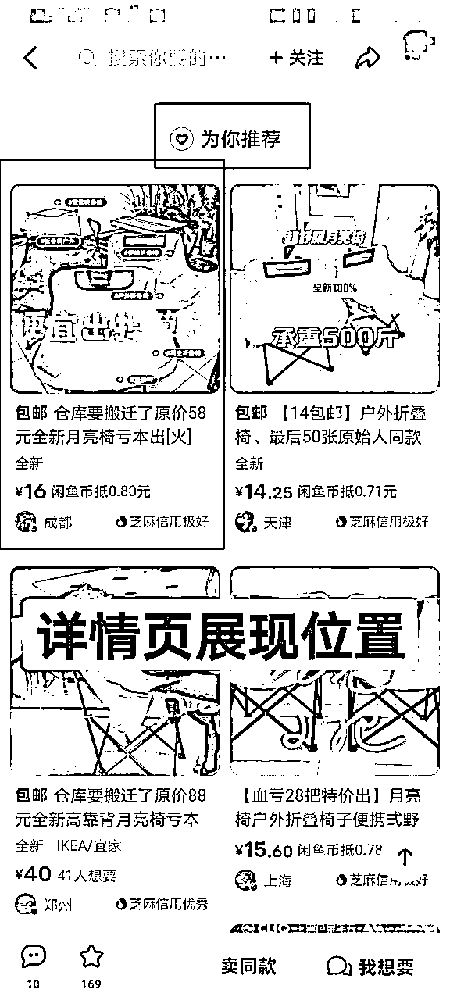

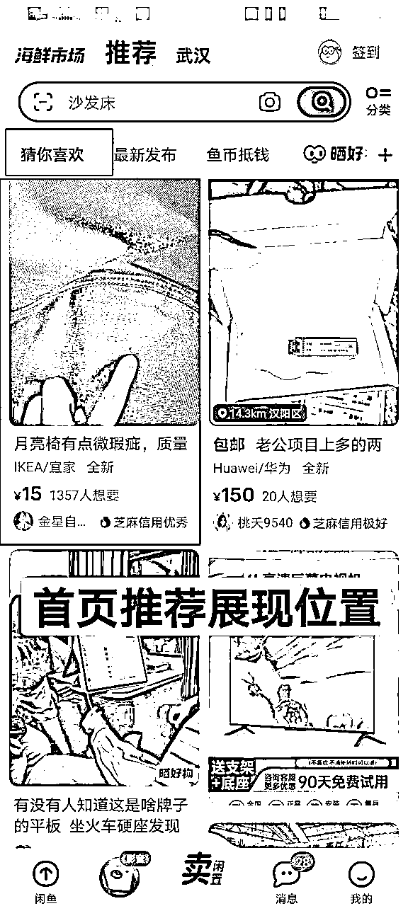

虽然展现的位置不同，但展现的内容都是一致的：主图，标题，价格，头像和名字，想要数

在曝光----浏览这个步骤里，我们要让用户最大限度点进商品详情页。

接下来将以这个页面中排版大小来排序讲解。

### 3.1.1，好主图的两个原则：

①主图传递出的商品信息内容要完整清晰，这是首要原则。

要让用户扫一眼就知道我们卖的是什么东西，否则这个主图就是失败的主图

②要展现出商品的卖点，这是第二原则。

单纯的突出主体只能让买家知道我们在卖什么东西，而商品的卖点才是买家点进来的动力。

在闲鱼中，主流有三种玩法，第一种场景代入性主图，第二种，文字营销性，第三种，人设或以量取胜型。

场景代入性主图：需要能展现出使用场景的舒适性，最好能让买家联想到买到手之后使用场景。

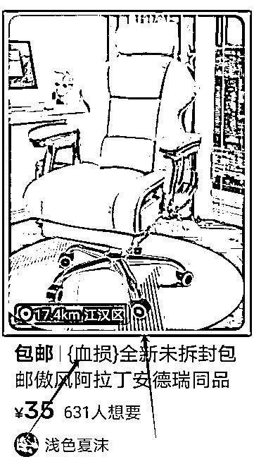

文字营销性主图：简单好用，目前的主流玩法，主打的就是可以让买家占便宜的错觉

人设或以量取胜性：配合人设，让人能感觉到真正是源头好货，没有中间商赚差价具有价格优势。

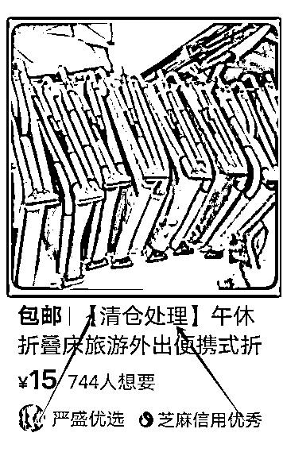

### 3.1.2，价格

设置引流价是必须的，找到500想要数以上的链接，比他的引流价格低五毛一块左右就行。

但要注意合理性，挂个冰箱卖10块就显的太假了，没有哪个买家会点的，且闲鱼官方也不允许低价引流。

小tips：设置引流价，并不仅仅是吸引用户点击，在闲鱼官方的披露的数据当中，且价格也是商品排序中的重要一环。

### 3.1.3，标题的前22个字

在搜索流量部分我们就已经提到过，如何正确书写一个标题，所以这里只简单说一下如何引导用户点击商品。

标题的前面一定一定要加上营销词，必要的话要用上【】符号来加重感官印象。

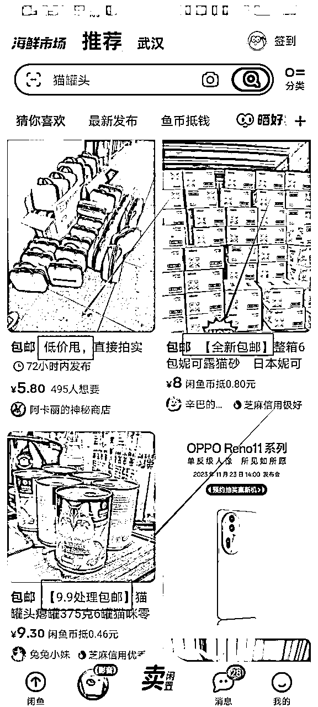

### 3.1.4，头像和名字

如果你的账号是重人设的氛围，那你的名字中就一定要含有领域词，例如户外工厂直供，宠物批发工厂，华强北渠道商等等

### 3.1.5，想要数

500想要数以上不用隐藏，500想要数以下的商品和刚上架的商品可以开闲鱼币折扣隐藏。

高想要数利用从众心理。

## 3.2，浏览----想要的动作

这一环节用户看到的就是我们商品的全貌，文案和图片。

文案以解答买家疑问为主，把规格，售后等一系列买家关心的问题给描述上去。

图片以呈现商品卖点为主，引导用户下单。

这一步是定产品生死的一步，所以要认真考虑好如何布局。

### 3.2.1文案

文案中的标题部分，我们已经在前文讲解过，这里就直接从标题以下开始叙述。

整体文案分三段式走。

第一段：人设出手原因或者商品卖点

如果你立的人设是厂家，是实体店倒闭的，客户抵押等人设，最好是从头像到主图到个人资料全部立好，不要上一个链接还是实体店倒闭，下一个链接又是厂家发货。

立人设一定要充分的能让买家感受到占便宜的氛围。

如果你要介绍你的商品卖点，可以去借鉴同行或者去淘宝拼多多十万加的销量中去看商品的主图和详情页，把卖点归纳总结出来，用文字描述清楚就可以。

当然也可以在这部分营造活动氛围，例如新店开业，亏本冲销量，数量不多，先到先得，库存有限，手慢无等等。

第二段：商品规格

商品规格大概3-5个规格就好，不要太多，太多了客户容易纠结，增加咨询工作量。

其次如果你是鱼小铺的话，可以只在文案中设置一个引流价，商品正价则可以放在商品规格当中，这样买家想知道你的商品正价就只能点击我想要来看。

如果当下还没有开鱼小铺的话，就把正价开低一点，将文案描述清晰一些，开启自动回复就可以让买家自主下单。

第三段：售后详情

售后：非质量问题不退不换，质量问题随时找我，芝麻信用分优秀（至今暂无差评）

快递：包邮，偏远地区不发货，最晚48小时内发出，可加急24小时内发出。

小尾巴：关注收藏优先发货

### 3.2.2图片

闲鱼可以上传9张图，我们分为前五后四，在前五张图中要给足用户下单的理由，购买的动力，针对买家的需求去布局，后四张则是商品不同规格的展示图。

第一张图就是主图，我们在上面提到过，主图一定是要高点击的图，把流量吸引过来之后。

第二，三张图就可以用场景化的图，让用户代入场景中去。

第四，五张图就要展现商品的细节图，在细节图上就可以利用标签加上一些商品卖点。

后面的四张图根据商品规格发布不同规格的展示图就行。

tips：重点在于场景化和卖点的展现上，这两部分内容是占据用户心智的重要呈现方式。

其次卖点的呈现一定要使用标签在图片上标注。

## 3.3，想要----下单的动作

我们在跟客户沟通的过程中不要去做无效的客服工作，关键要明白他背后的顾虑是什么，打消他的顾虑并逼单才是正常的客服工作。

所以客户在问你问题的时候不妨再往深处想想他背后的需求痛点是什么，销售问题最终解决就只有信任问题。

在这里只有一个永恒的动作就是逼单。

话术分享：

客户：还有吗？/在吗？

回复：还有，最晚48小时内发出，现在下单可在24小时内发出。

客户：发货了吗？/怎么还没有发货？/单号怎么还没有出来？

回复：已经发货了，只不过闲鱼没办法显示正在揽收中，晚一点统一上传单号的，你就放心吧。

客户：质量怎么样？/商品相关问题

回复：质量非常好，你可以完全放心，正经做生意的，卖出去这么多单基本上都没售后的。

而且现在正是新店开业降价冲销量的时候，现在可以放心入手，后期会涨价的。

客户：还能便宜一点吗？/砍价

回复：第一次明确拒绝，不行的哈，我们商品质量在这里，成本下不去的，一分钱一份货的。

我们卖出去这么多份，到现在几乎都没什么售后。

而且现在正是新店开业降价冲销量的时候，现在可以放心入手，后期会涨价的。

客户：那别人家的比你便宜不少啊

回复：别人家的我不知道哈，我们家主要是做回头客生意的，所以质量上一直都有保障，这也成本一直降不下来。

而且我们现在正是冲销量的时候，现在出一单基本上亏损xx元，后期销量上来了肯定是要涨价的，现在可以放心入手。

客户：便宜一点，我马上下单。

回复：这样吧，哥。我们这边确实是成本高，现在都是亏损卖的。

我也是真心想成交你这一单，我这边给你便宜xx元，看行不行，不行的话我也没办法了。

要时刻把逼单的话术放在嘴边，把逼单的动作时刻在做。

但如果感觉这个客户很纠结很难搞，就不要成交了，有时候事逼客户会增加很大的工作量。

tips：可以截一张客户咨询或者下单的图，直接发给哪些还没有成交的客户，跟他说，哥，你看你还要不要，我这边量不多，你要是需要的话，就现在拍，我让那边先别拍，先给你预留一下。

## 3.4下单----好评的动作

客户在一般都在第三天左右收到货，我们可以在第四天的时候找聊的好感觉好说话的客户进行私聊，主动邀请对方对商品进行评价并在返现之后给对方发一个3元左右的红包。

主动询问不仅可以增加店铺权重，并且可以加快回款周期。

虽然人工干预也可以做出来好评，但是刷一单基本上最低需要20分钟左右，且非常容易把人群画像给刷偏，所以一定要尽量把时间放在选品和运营商品上去。

话术分享：

回复：哈喽，收到货了嘛？

客户：还没有去拿/拿到了

回复：好的啊，拿到货如果发现有什么不对的及时跟我说哈，我这边大部分时间都在的哈。

要是觉得还不错的话，希望你这边能给个好评，我这边会给您安排个小红包表达一些心意。

回复（已拿到）：感觉怎么样呢，有没有什么质量上的问题勒

要是觉得还不错的话，希望你这边能给个好评，我这边会给您安排个小红包表达一些心意。

# 4.唯一的一种选品策略

我们所有的选品方法说白了就是在找市场需求，找对了市场需求，就等同于找到了流量。

例如：假如我们找到一个商品在市场上求大于供，那必然就能产生流量的高转化，高转化推动系统给你商品分配更多的流量。

高流量又能带来高转化，由此一个飞轮效应的闭环就开始产生。

这就是为什么说电商三分运营七分选品。

选品能力其实考验的就是我们对市场对人群需求的把握情况，需要在行业里不断深耕才能初窥天机。

在以往三年的选品经验当中，我认为培养选品能力的关键点在于，从红海中寻求差异化，从市场中寻求蓝海。

任何的蓝海都会有时间周期，周期结束蓝海也就变成了红海。

我们要做的就是在红海中洞察市场需求，深耕行业，锻炼能力，在蓝海出现时，我们才可以快速下场分一杯羹。

## 4.1，在红海中寻求差异化

没有人会为商品的差异化而买单，买单的理由只有一个，那就是你提供了买家需要的价值。

差异化就是将原有的价值进行升华，是你满足了买家在别人那里满足不了的需求。

就以蛋卷桌为例，以下两款蛋卷桌你会选择哪一种？

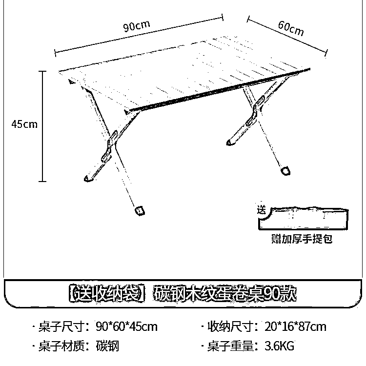

A款：售价45元，正常使用非常稳固，不摇晃。

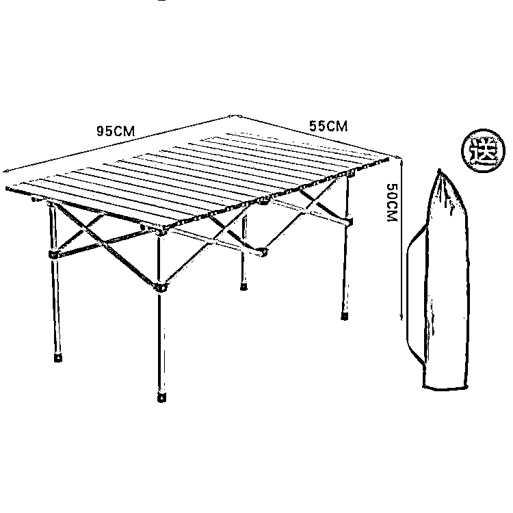

B款：售价40元，使用起来桌子会摇晃，不怎么稳固。

我相信大部分人会选择A款，因为A款只比B款贵五块钱，但是体验感却远远超过B款。

你认可这个观点，其实就是选品选对了，产品的卖点改变了你的决策点，从我需要一个蛋卷桌变成了一个我需要一个稳固不摇晃的蛋卷桌。

这就是产品会说话，而我们要做的就是在红海产品中找到这一部分会说话的产品。

买家对商品需求永远都是，从无到有，从有到好，从好到更好。

所以当我们在红海看到一个品，先去找有没有比当下的商品所提供的价值更好更好且更有性价比的品。

## 4.2，在市场中寻求蓝海

蓝海的竞争小需求大的特质决定了大多数人冒了尖的想往里钻，但很可惜的是至今也没有人能说得清蓝海到底该怎么找。

其实很正常，蓝海的产生本身就是随着在红海沉浮的时间久了，跟随着市场而开发出来，所以蓝海更多的是老人的机会，却不是新人破局的关键。

对于刚进入一个领域的新人来说，先在红海中沉浮，打磨自身和洞察市场远比主动去寻找飘渺的蓝海靠谱的多。

而对于老人来说，如何在闲鱼中分辨真正的蓝海就非常关键。

但在闲鱼中蓝海只需要看两个数据，商品想要数和商家数。

想要数越高，则代表产品需求越大，商家数少则代表竞争低。

换成数据就是想要数不低于1000，且500想要数以上的不高于3家。

小tips：在闲鱼中看同行的时间久了，蓝海品就非常自然的浮出水面。但关键在于你能不能坚持到浮出水面的那一天，所以说在红海里沉浮是非常关键的。

## 4.3，在闲鱼中选品实操

不管是红海还是蓝海，只要涉及到选品，就一定要验证商品在当下APP生态中的可行性。

而最快最短的路径莫过于直接看有结果的同行。

在闲鱼中，主要从以下两个方面入手去看。

第一，在闲鱼榜单看，在榜单的闲鱼店铺都做的非常的垂直且非常优秀，基本上都涵盖了一个领域内的大部分产品。

这个方法适用于你在刚选择一个领域，不知道这个领域应该选择哪些品。

用这类方法会非常迅速的让你建立起一个领域的全品类概念。

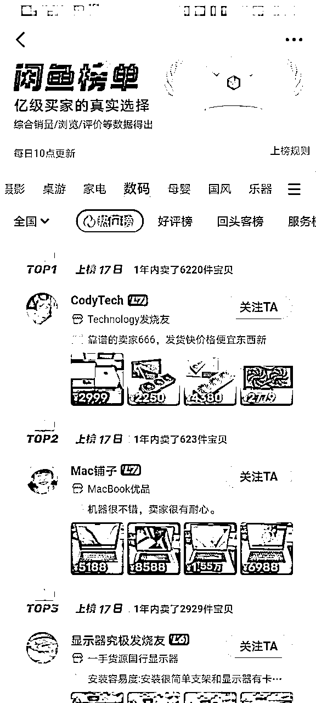

第二，在缺货榜以及新人榜单上。

这个方法适用于找蓝海品，目前闲鱼在商品排序上，已经把缺货榜的商品计算到一定的商品排序中了。

听人劝，吃饱饭，平台没有任何道理去害你。

而新人榜单中有很多弱竞争的产品，也是蓝海产品的聚集地，非常适合用来起店。

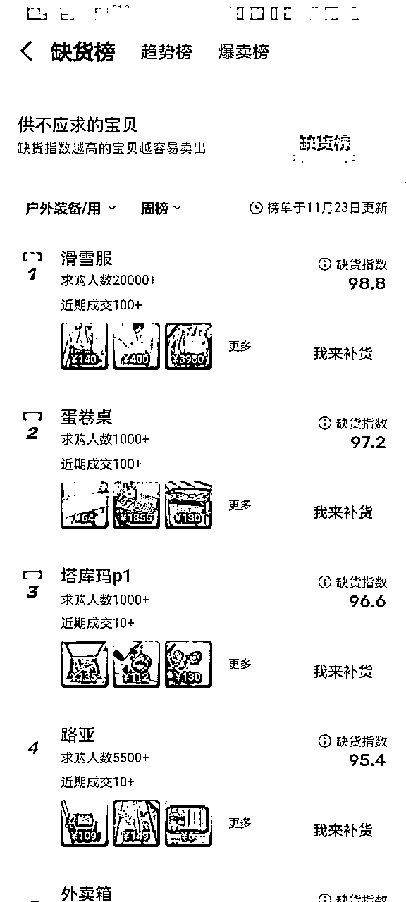

tips：选品从来都不是掌握了一个什么样的方法就能让我们快速的出单。选品更多的是不断地看同行，研究同行，研究市场培养出的一种经验和能力。

正常情况下，我们在每天时间上的安排并非是运营店铺上，而是在看同行和在看同行的路上。

至于店铺的运营真不复杂，链接爆流量之后就正常维护，正常回复客户就行了。

并且一个爆款的持续时间会维持很长时间，保持每天正常出单就好了。

# 5.店铺的商品布局

当我们商品出现有曝光之后，必然会有一部分买家会看你的店铺主页。

如何利用这些到达店铺页的流量进行二次转换才是布局的关键。

## 5.1是否要做垂直店铺？

在这之前我们要先了解为什么要做垂直店铺。

前面我们提到过做电商就是做数据，数据好就能进入下一个流量圈层，而垂直店铺的意义就在于此，它可以将流量二次利用起来。

试想一下我们在闲鱼上卖蛋卷桌，那么客户同样可能也需要椅子。

当我们的蛋卷桌链接流量足够稳定的时候，把月亮椅置顶在店铺的首页，引导用户进行二次下单。

当有一部分用户下单之后，我们月亮椅的链接数据也开始有积累，当积累到一定量的时候，月亮椅的链接也开始突破流量圈层自主获取流量。

所以说，做垂直店铺就是将流量二次利用，用来增长第二条链接数据的。

沿着这个思路，我们再发散一下，假如我们还是在卖户外桌椅，我们店铺置顶的是户外投影仪。

这个时候我们的店铺可以说是垂直店铺吗？不能吧，又是户外桌椅又是投影仪的。

但它确实可以让投影仪的链接二次起量。

归根结底其实店铺商品的是否垂直其实不重要，重要的你店铺的人群画像要垂直。

至于你是选择将一次流量发挥到极致，像快团团一样让一次流量引起不同领域的商品复购，还是选择通过垂直领域的商品不断引导用户复购都是可以的。

店铺的垂直不重要，重要的是店铺的人群画像是否精准，你能否将流量进行二次转化。

## 5.2置顶商品该如何选择？

置顶商品的唯一原则就是和爆款链接的强关联性。

要想办法让置顶商品充分利用好进店流量，进行二次转换。

例如户外的必需品就是：天幕，蛋卷桌，椅子，收纳箱，帐篷。

例如宠物的必需品就是：猫砂，猫粮，猫抓板，猫窝等。

在这其中找到一个数据表现优异的必需品或者跟爆款链接拥有强关联性的产品进行置顶，则事半功倍。

任何的方法技巧都是只是催化剂，最终考验的依旧是商品卖点的展现和选品能力（寻找市场需求的能力）。

# 6.结束语

我们都知道线上的赚钱方式多如牛毛，其中不乏月入几万，十几万的项目。

在开始做闲鱼以前，我也在不断寻找这样的项目，我相信只要我找到了这个风口，我就一定可以实现阶级跨越。

凭什么别人行，我为什么不行？我跟别人比又不差哪儿

但现实真的就是人家行你不一定行，我们现在看到一个月赚几万十几万的大佬们，能看到的是人家仅仅只是花了一个月的时间就赚到了这么多的钱，但我们看不到的是大佬们在这一个月以前的几年时间是怎么度过的。

所以去找一个符合自身能力的项目赚到100块钱是远比一个不符合自身情况但却月入十几万的项目划算的多。

在项目的选择上，往往并不是非此即彼，更多的是一条发展的路径。

就像前面提到的选品一样，从红海里来，到蓝海里去。

当你真正可以完完全全跑完一个项目，并开启下一个项目的时候，你才能发现自己能力有长足的进步，在第二个项目推进时事半功倍。

我认为这是我当了两年韭菜得到的最好的经验，就是赚自己能赚到的钱，不要过分高估自己的能力。

亦仁曾经也在生财写过这么一篇帖子，是写关于如何选择项目的。

当我看到这篇帖子的时候，我就知道生财真的没白来，这些经验看似不起眼，但实操踩坑时，才发现真的会耽误大量的时间和精力。

以下为原文地址：知识星球 | 深度连接铁杆粉丝，运营高品质社群，知识变现的工具

最后非常感谢亦仁，感谢谈钱不伤感情的生财，也感谢圈友们一路上的陪伴和交流。

我是陈不胖，一个拥有两年韭菜经验，三年闲鱼运营经验的人。

我深知一个人做项目之艰难困苦，但如果你在闲鱼运营上有什么问题，欢迎你跟我交流关于闲鱼的一切问题。