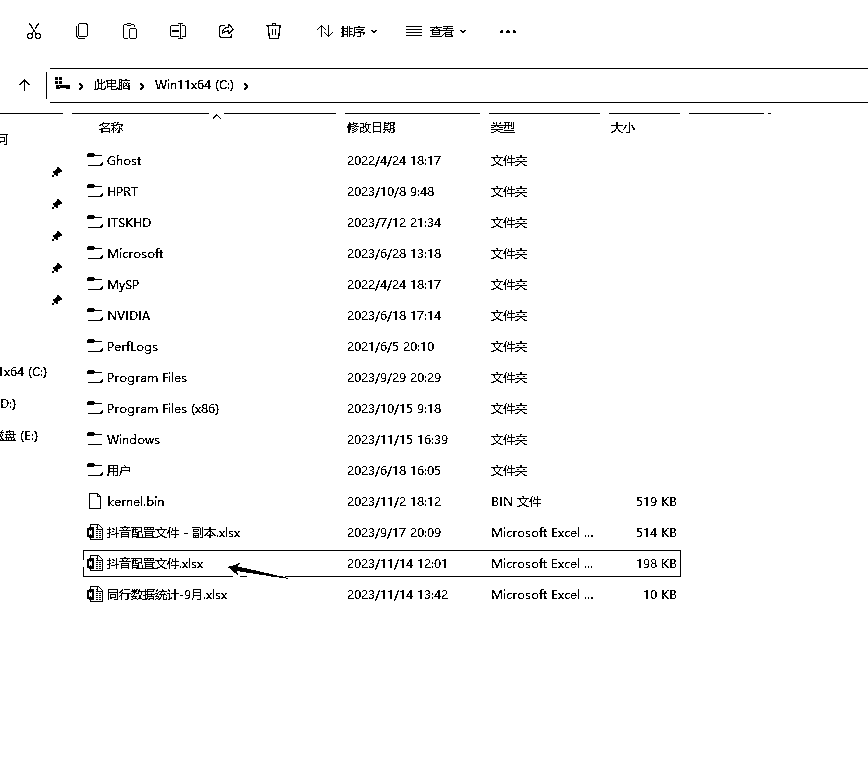
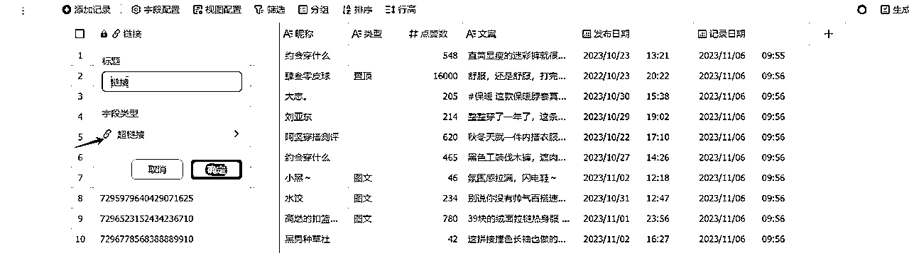
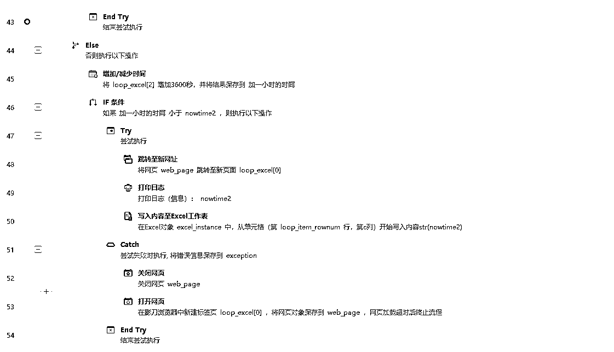

# 自动监控+加图表分析 对标数据

> 来源：[https://w0kp7t5wqc.feishu.cn/docx/PaRldAqNloMqW4xNcLAcWAMhn5c](https://w0kp7t5wqc.feishu.cn/docx/PaRldAqNloMqW4xNcLAcWAMhn5c)

做抖音有一年了 抖音对标的帐号不说一百 至少也有大几十个了

所以呢经常就在找各种方法 想把对标的数据第一时间统计下来 对标的作品几点发的 什么时候爆的 今天100个或者更多的对标中谁的视频爆了 我能不能第一时间跟上

有没有什么办法能够帮我定时去帮我扒对标的点赞 （比如定时1小时帮我去记录一下）

然后记录下来的数据还能做到EXCEL一样的图表

就比如像下面的表格 到了这里相信会用EXCEL 图表的应该就懂了

好了下面是我的一个流程图

工具 ：

影刀RPA +飞书的多维表格 （这两个全是免费的）

# 1 用影刀写一个脚本 让机器人定时固定的时间 或者每隔多少时间去扒一下对标

影刀的脚本地址：（明天 等待分离脚本）影刀的脚本 https://api.winrobot360.com/redirect/robot/share?inviteKey=12838d2e26f47359（密码2023）

1先在C盘下 建个 【抖音配置文件.xlsx】

2在excel下建

3配置对标主页(一行一个对标 不要有空行 因为我没有空行所以不知道中间空了会怎么样)

4【记录] 页是数据的一个本地备份 这里也是自动的不用管 但是要把这个页面建好

5影刀的一个设置页面 其它的就没有

https://ydrpa.yuque.com/org-wiki-ydrpa-xtutvv/ga4dm6/ir3mh6orhy4ib7zf（多维表格ID 示列）

6注意 注意 注意 注意 注意 （因为影刀的原因系统不一样 会有不兼容的情况 这是我的系统版本 结尾贴上影刀的代码

）

如果影运行出现 下图报错问题第一次把这个C列有数据的地方加个时间 （不能是未来的时间不然就不抓取了）

# 2 让影刀把每一条数据通过飞书的API接口

把数据传到多维表格

https://open.feishu.cn/app/

1对接前需要去飞书开发平台去开放权限

2点新建的应用

保管好自己的ID 后面填写到影刀当中

3开通记录的权限

4发布应用版本

5去自己的飞书建个多维表格

6把这个多维表格 添加到刚才的应用里去

并且给到编辑的权限

7 等影刀机器人自动上传数据 有数据了 你就可以去飞书的仪表盘添图表了

不会图表的 要自行去补一下EXCEL了

8去多维表格建表的时候注意

其它的全文本格式

9自由发挥查你想看的数据了 下面是我自己用的着的一个数字仪表盘，每个数字都可以单击 都能点出明细表

就比如上面 这样对标的数据是不是一目了然 非常的安逸

* * *

# 3影刀代码

## 主流程代码

## 2监控流程代码

## 3 检查微信存在流程

## 4配置流程

## 5筛选流程

## 6微信发送流程

到此 所有结束 原来的工作原理是发送的微信的 后来发现飞书比微信好用 所以微信部分的有会写代码的可以自行删减一下

第一次分享 排版不好将就着看吧