# 《公众号爆文进阶教程》

> 来源：[https://k170ac9yh31.feishu.cn/docx/PlpQdDbzkoaZoMxPf3dczRiunhc](https://k170ac9yh31.feishu.cn/docx/PlpQdDbzkoaZoMxPf3dczRiunhc)

# 三大基本库

## 对标库


### 1、建立对标账号库

*   构建一个专门的对标账号库，用来存储对标账号的信息，根据对标账号的注册时间、发文数量、更新频次、点赞分享次数，进行级别的划分。例如：A、B、C、D类。

*   对标库可以包括各种平台，如微博、微信公众号、知乎、头条号、百家号等，确保信息获取的广泛性。

### 2、寻找对标账号

*   使用特定关键词或话题来搜索社交媒体平台，以找到与您的领域相关的热门文章和账号；通过其他途径找到更多的对标账号。

*   有助于积累更多的素材来源，确保自己能够不断获得新的灵感和信息。

*   时刻保持账号库的更新，以确保其中包含最具价值的账号。

### 3、标账号要丰富

*   寻找那些在一个领域内，拥有大量粉丝和高互动率的账号；（A类）

寻找那种短期内，出现10w+爆文的账号；（B类）

寻找那种很稳定的账号，例如2w左右的阅读数据的账号；（C类）

寻找那种一直起不来的账号。（D类）

*   前三种账号（A类、B类、C类）通常会发布受欢迎的文章和内容，可以作为灵感来源，帮助您了解受众的需求和趋势；最一种做不起来的账号（D类），是要躲避的，自己不要重蹈覆辙。

*   关注对标账号，可以及时获取他们的最新发布的文章，发布时间，封面图展现，以及描述如何写。

### 4、刷对标

*   对标账号建立后，还需要尽可能多的进行阅读，有助于了解当前的趋势和内容的受众性，让你创造更具吸引力的内容。

*   刷对标一定要定期执行，确保自己对领域内动态的持续了解。

## 爆文库


### 1、建立爆文素材库

*   不要强调原创，而是专注于寻找已经广受欢迎的文章，以作为您创作的灵感来源。

*   建立至少10个对标账号和至少100个热门素材。

### 2、寻找爆款文章

*   通过微信搜索，找到目前最受欢迎的文章。

*   举例来说，搜索关键词如“许家印”、“莫言”、“大爷”等，然后选择“最热”标签。

### 3、多样化素材来源

*   尝试不同的关键词和主题，包括财经、情感、名人名言等。

*   应该具有探索精神，以及联想能力，例如通过“恒大”就能够联想出“碧桂园”，以寻找与热点相关的素材。

### 4、借鉴他人创作思路

*   学习成功账号如“彪悍一只猫”“十点读书”等，深入了解其创作思路和内容结构。

*   这可以帮助您更好地掌握成功的写作方法。

### 5、坚持收集爆文

*   设立每日收集爆文的目标，坚持不懈，积极跟踪热点，收集到的爆文库放入自己的爆文库中。

## 素材库


### 1、建立素材库的重要性

*   素材库是提高创作效率的关键。

### 2、积累素材的方法

*   利用爆文库找到同类型的文章。

*   利用专门的素材网站进行收集。

*   利用专业的书籍、期刊、报纸等进行收集。

### 3、素材库整理思路

*   记录引人注目的内容

•记录发现的有趣、触动人心、令人愤怒、感到悲伤或带来快乐的文章、视频、课程或热点。

•将这些素材按照感触和情感进行分类到素材库，以便随时获取灵感。

*   记录专业领域内容

•针对专业领域，积累与之相关的内容，包括概念、问题、解决方案等。

•将这些专业领域的素材分类库，并根据内容的相关性整理，以更方便地查找和使用。

*   记录个人生活相关素材：

•每天记录发生的与个人生活相关的事件、冲突、或引人入胜的画面。

•将这些素材分类保存到素材库，以备将来的创作之用。

### 4、素材积累技巧

*   利用内容模板，整理积累的素材。可以帮助加深对素材的印象，同时在创作时更加灵活地运用这些素材。

*   使用事件结合感触、复述并总结等方法，将素材整理成自己的内容，以增强理解和灵活应用。

# 基本库的收集办法

## 免费

### 微信

*   使用关键词“养老”、“莫言”等进行搜索，找到爆文、以及相关的账号。


### 其他

今日热榜官网：https://tophub.today/c/news

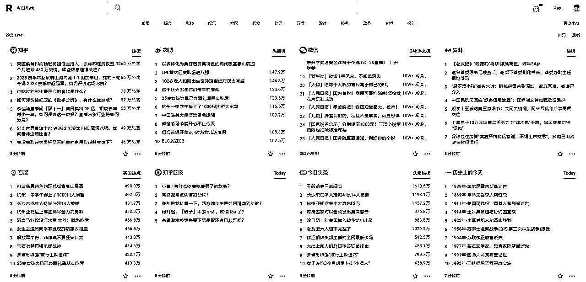

即时热榜官网：https://m.jsrank.cn/

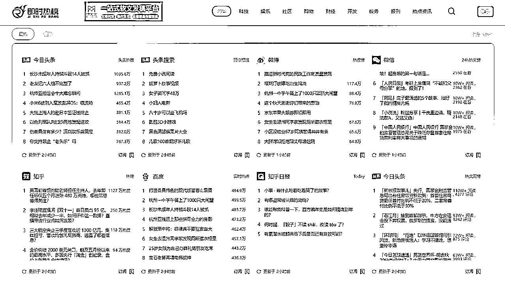

上面的榜单聚合了今日头条、微博、知乎等更大榜单，要是自己希望更精准更及时，可以挨个整理链接。

各大资讯类APP类的推荐板块

•例如今日头条推荐

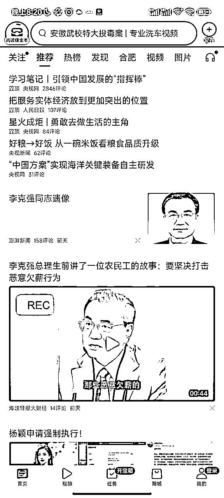

## 第三方工具

### 易撰网（付费）


### 新榜


# 标准流程

## 1、每日对标账号观察

每天观察对标账号，了解发布的内容，以及写作的特点。

通过观察对标账号，获取内容方向，了解对标账号发布的话题。

## 2、探寻公共领域的热点

在各大榜单，寻找与领域相关的热点、新闻、或话题。

觉得比较好的素材记录下来，这些素材可能包括文章、视频、图片，以及有趣的事件，并且整理到素材库中。

## 3、对标账号的积累

如果在公共领域遇到合适的对标账号，将其添加到对标库中。

制定收集对标账号的挖掘数量的目标，例如每天找3-5个。

## 4、整合资料和素材

在创作之前，整合观察到对标账号的结果、内容的方向，以及对标库中账号信息，确定自己的选题。

整合资料和素材，为创作过程，有最新的参考资料，以及新的写作方向，成功的文章创作不是一蹴而就的，也不是大风刮来的，一定要有自己的分析，这样才能更加的长久。

## 5、文章创作

### 创作文章

*   GPT技术生成大部分内容预计在占60%左右。

*   claude预计在80%左右。

*   必应预计在50%左右，这部分数据只是我的个人感觉，也可能有些人觉得必应更加的顺手。

### 修改润色

人工修改和润色，确保文章质量和流畅度。

## 6、内容发布

对文章完成排版工作，保存到自己的素材库中。

安排最佳发布时间和方式，以保证文章的最大化传播。

# 文章创作

## 文章内容

### 蹭热点

*   热点词+领域

•“热点词+领域”，将当前热门话题与自己的领域相结合。

•不同领域的创作者可以在各自领域蹭热点，例如，最近热门的“巴以”相关的事件，可以被不同领域的创作者用不同的角度进行创作。

•示例如下：

•情感领域：

•“巴以”冲突+爱情的坎坷

•在情感领域，创作者可以关注“巴以”冲突对爱情和人际关系的影响，强调情感故事。

•职场领域

•“巴以”冲突+领导与员工的合作

•在职场领域，创作者可以探讨“巴以”冲突对领导与员工协作的启示，强调合作与沟通的重要性。

•旅游领域

•“巴以”+文化之旅

•在旅游领域，创作者可以介绍“巴以”地区的文化、历史和和平追求，吸引游客了解这一地区的独特之处。

*   重要的标题

•标题至关重要，尽量将热点词汇加入标题中。

•使用标题拟定技巧，如“雷霆开幕暴击的方法”，以提高文章的点击率。

•建议将50%的时间用于精心拟定标题，因为标题对于吸引读者的注意至关重要。

### 最新内容

*   新内容更容易让人阅读，并且能够提升完结率。

*   每天的阅读中，发现新的素材并加以记录，一定要能够尽快使用。

### 反复出现

*   反复出现的素材是指多次被引用的信息，主要是数据、以及相关的事件等。那些老掉牙的故事不包括。

*   一段时间内反复出现的信息，具有广泛的认可度和可信度，可以增加文章的权威性和吸引力。

### 整理过的

*   寻找自己的素材库中，是不是有相似的素材，能够使用到文章中。

*   整理过的素材做好使用记录，千万不要出现自己整理的素材，一段时间内自己反复再用。

### 具有创造性

*   素材库中的句子结构进行微调，以更好地适应自己的文章，并增加创作的多样性。

*   有些具有多角度的素材，换个角度进行分析和讲解。

## 过程拆解

### 文章标题

#### 写作技巧

##### •a. 爆款标题要素:

•调动情绪：让读者产生喜悦、悲伤、愤怒、好奇等情感。​

•使用数字和数据：具体、真实，给人以明确的感知。​

•使用极端或夸张的词汇：增加标题的冲击力。​

•保持简洁清晰：让读者一眼看到重点，快速吸引他们点击。​

##### •b. 爆款标题公式:

•突出主题+矛盾冲突+引发悬念

•47岁的我，搬进了丈夫的工地宿舍，被一群硬汉包围，晚上燃烧起了期待的火焰。​

•35岁新郎的言论让26岁新娘哭泣：你这二手货有什么好疼的？​

##### •c. 标题润色技巧:

•植入流量热词，如“疲惫不堪”、“心满意足 ，笑容满面”等。

•50岁单身汉，被46岁寡妇骗进家，干完体力活后寡妇却笑容满面。​

•新娘缺席婚宴，丈夫报复性分居十几年，妻子晚上却笑容满面等着隔壁老汉的反击​

•怀孕了，婆婆安排去旅游，丈夫一巴掌把我扇醒，结局却让我如愿以偿​

•45岁美女房东晚上求助28岁小伙修水管，修好后虽疲惫不堪却体验了不寻常的快乐

•用具体、生动的语言来描述，创造情境、展现角色，反转情节或制造悬念，使标题更具吸引力。​

引用小浩《爆款标题创作技巧》分享的内容：

#### 标题公式

##### •1.疑问式/提问式：人物+为什么+具体事件或人物+经历+凭什么

•《千聊，荔枝有那么多的育儿课，凭什么李老师的课卖的最爆？》​

•《14 岁辍学，29 岁身价过亿，这个 90 后女孩凭什么》​

•《从平庸到优秀，最致命的差距是什么？》​

•《那个不听父母话的女孩，后来怎么样了？》​

•《我那么努力，为什么还找不到好工作？》

##### •2.引发用户的好奇，制造悬念（说到一半）：如何/为什么+事实+反转​

•《怎么才能减肥成功？秘诀只有一个》​

•《孩子你为什么要读书？这个老师的演讲值得每个人深思》 ​

•《如何用 10 秒钟，把堵塞的鼻子变通畅？用它喷一喷，舒服一整天！》​

•《为什么孩子越大越不愿意和你交流？99%的家长都不知道》​

•《高情商就是好好说话？99%的人都误解了》

•《中国妈妈为什么怨气重？婆婆越位、丈夫缺位、自己错位》​

##### •3 利用数字与数据：数字+事实+奖励​

•《我这里有 200 页重磅 PPT，20 个压箱底文案小技巧等你来领取》​

•《男朋友打翻了我的神仙水，给了几十块叫我重新买》​

•《成年的标准不是18岁》​

##### •4 利用热点：热点话题引入标题中​

•《杭州亚运会开幕，但你还记得 33 年前在北京唱亚洲雄风的刘欢如今苍老成这样？》​

##### •5 作比较：形成反差和对比​

•《真正聪明的人，往往很少交朋友》​

•《35 岁月薪 3500，你拿什么安身立命》​

•《为什么方便面就有大品牌，挂面却没有》​

•《总是踩点进入办公司的人，一年后和提前 5 分钟进入办公司的人差在哪》​

•《怎样优雅地和女朋友吵架》​

•《与女人相比，男人才是真正的弱势群体》​

•《都说女人是水做的，其实女人是钢筋混泥土做的》​

•《对的人晚一点再遇见吧》​

•《愿你，遇到一个无需取悦的人共度一生》​

•《我愿你所有的坚持，都是为了自己》​

•《独生子女不敢死不敢穷，不敢远嫁，因为父母只有我们》

##### •6 权威稀缺：提供独家的信息​

•《张小龙首次公开演讲，官方无删减版。》​

•《离职前，我把运营黄埔军校阿狸的干货都供了出来。》​

引用盟主君《如何利用GPT写出10w+爆文》分享的内容：

*   备注

•寻找你所做的领域内，近期的爆款标题，进行模仿。

•标题尽可能的口语化，不是领域的人都会对标题进行思考。

### 文章正文

#### 写作逻辑

##### •结构化写作

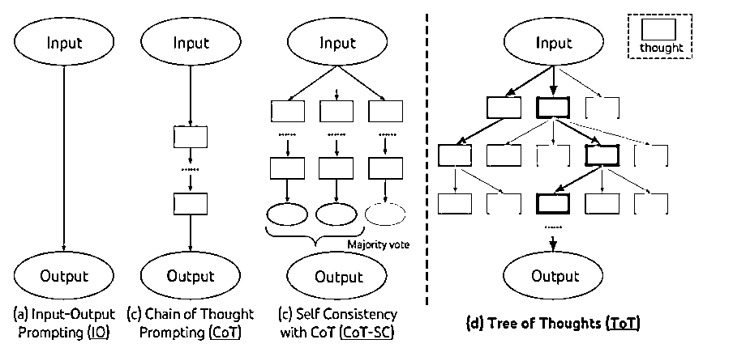

Tree of Thoughts: Deliberate Problem Solving with Large Language Models

•图a：只有输入到输出，人写作的都很难驾驭，要么是冥思苦想，要是就是信马由缰，文章内容基本不受控制，文章的质量参差不齐。

•图b：在写作的过程中有了大部分的分段，文章每一部分写的内容受控制，至少每一个部分有哪些内容是能够控制的。

•图c：将每一部分优化成一条线，一篇文章有这些线组成，每一个部分内容在进行细化，得出一篇更容易受控制的文章。

•图d：完美的写作模型，根据自己写的内容的深度，以及知识面的广度，以及字数进行建模。通过这种模型，文章质量很容易掌握，如果觉得不够细的话，还可以更细化。

•从a—b—c—d，不是一个个单独出来的，更像是一步步地提升，根据自己的实际需求一步步的做文章的结构。

##### •事件轮动法

•示例来源：小红书博主《棂棂棂棂》

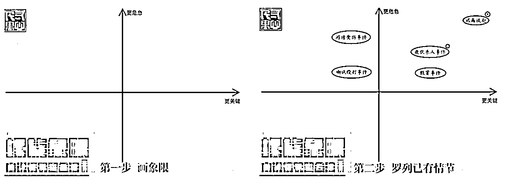

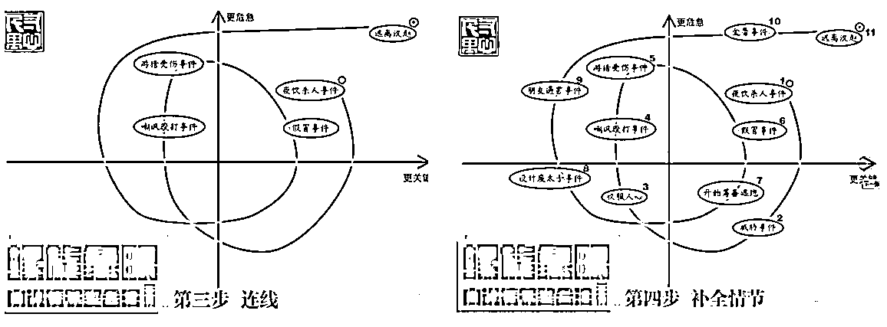

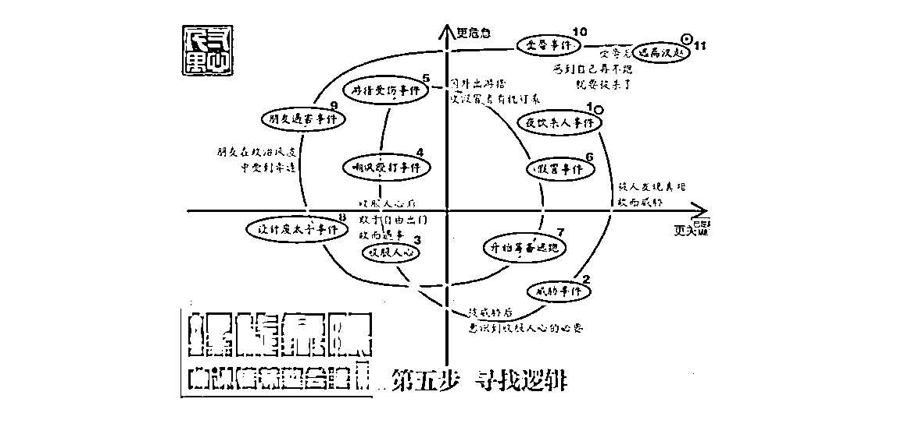

总结：

通过这种方法，不是有多少故事，而是你有多少时间了。

公号的篇幅转不到两圈，所以就用航海手册提出的排列组合完全够了。

#### 写作分析

##### •《彪悍一只猫》文章的分析结果

###### 1 写作思路：​

•时事背景：文章通常从某种时事或普遍现象出发，引入问题或者话题。​

•分析现象：详细探讨该现象的起因、影响及其他相关的细节。​

•提出疑问：在文中引入疑问，使读者对话题产生兴趣。​

•行业或专家看法：为了增加文章的可信度，通常会引用行业或专家的看法。​

•建议或解决方案：根据现象或问题，提供可能的建议或解决方案。​

###### 2 写作结构：​

•标题：通常为吸引人的、与内容直接相关的问题或声明。​

•引入：提供背景信息，为读者铺垫文章的核心内容。​

•主题：按照不同的小标题进行划分，每部分探讨一个具体的子话题。​

•结尾：总结文章的主要观点，提出作者的看法或建议，并常常以与读者互动的方式结束。​

###### 3 写作手法：​

•数据引证：为了增加观点的权威性，文章中经常引用相关的数据或统计。​

•故事叙述：为了增加文章的可读性，有时会使用小故事或案例来说明某一观点。​

•互动语言：文章中经常使用与读者对话的方式，如“你同意吗？”来增强与读者的互动。​

•结构清晰：使用数字、小标题等方式来组织文章，确保读者能够轻松跟随作者的思路。​

###### 4 方法论总结：​

•选定话题：选择一个与时事或普遍现象相关的话题。​

•进行研究：对选定的话题进行深入研究，收集相关的数据、例子和行业看法。​

•组织结构：确保文章有清晰的引入、主体和结尾。​

•引入问题：在文章中加入与读者相关的问题，使其更有参与感。​

•使用数据和案例：为文章增加权威性和可读性。​

•结束互动：在结尾部分与读者互动，增强他们的参与感。

引用盟主君的《如何利用GPT写出10w+爆文》分享的内容：

#### •《咨询公司》写文逻辑

##### •文章结构

###### •麦肯锡文章结构

<h7>•现状</h7>

全球前20大车企中，中国有5家，但全球前20大汽车零部件企业中，中国却只有一家。中国贡献了全球31%的汽车产量，但全球前100家零部件企业中，中国只占12%。中国零部件企业理应发展潜力巨大，然而，汽车行业整体增长减速，利润收窄，且“新四化”趋势带来的产品结构性调整，为中国零部件企业平添了多重压力。一方面是发展的潜力，另一方面是转型的压力，中国零部件企业如何才能在赛道切换的过程中换道超车？

中国头部汽车零部件企业正纷纷采取拓展多元化客户结构、推进产品转型升级、积极寻找海外并购机会、实施数字化转型等手段；然而，传统降本增效手段收效甚微、供应链不确定性上升、新赛道投资需求增大、传统研发与供应链合作模式过时、大型并购整合经验和能力不足等挑战层出不穷。想在转型中快速成长绝非易事。

<h7>•挑战/困局</h7>

•零部件企业面临的挑战

•行业整体盈利性下降

•“新四化”趋势带来产品结构性调整

•海外业务扩张步伐放缓

<h7>•转型</h7>

•零部件企业的转型与挑战

•零部件企业正从三方面推进企业转型

•针对盈利水平下滑：优化客户结构，提供数字化转型支撑

###### •里斯咨询文章结构

<h7>•市场分析</h7>

•一直以来，lululemon以强大的品牌力著称，甚至有人称其为“营销界的教科书式案例”。这个成立24年的品牌，于2020年首次跻身400亿美元市值俱乐部并超越Adidas、直逼绝对霸主Nike，成为全球运动鞋服市场市值排名第二的品牌。然而，这个月，lululemon的产品因不符国家标准以次充好被官方批评处罚冲上了微博热搜。事实上，这次翻车事件仅仅是冰山一角，lululemon看似一路高歌猛进的背后，实则四面楚歌，隐患重重。

<h7>•品牌分析</h7>

•lululemon为什么能火？

•有人说，lululemon最被人津津乐道的是 “邪教式”的“社群营销”，堪称花小钱办大事的典范，把社群营销当作是lululemon成功最为核心的原因。事实上，追根溯源，lululemon成功最为核心的原因在于开创并定义瑜伽服品类。

<h7>•困局</h7>

•lululemon面临的危机在哪里？

•危机一：供应链掣肘，品牌护城河根基不稳

•危机二：盲目横向扩张，品类代表性动摇，犹如饮鸩止渴

•危机三：忽视品类纵向布局 将未来规模更大的大众市场 瑜伽服机会拱手让人

<h7>•解决方案</h7>

•瑜伽服赛道中下一个lululemon的机会在哪里？

•机会点一：依托渠道创新实现的性价比瑜伽服品牌

•机会点二：为当地人群量身打造的瑜伽服品牌

•机会点三：专为男性设计的瑜伽服品牌

•咨询公司的写作逻辑和公众号的写作逻辑类似，大家都是一步步的往下进行推进，增加文章的可读性，以及互动性。

#### 爆文拆解

•公众号文章写作是有法可依的，自己一定要多拆解文章，学习写作风格，文章结构等。

##### 正文拆解

##### 正文立意

##### 道德标准

•一篇高质量的文章，一定是符合社会主义核心价值观的，例如那种诬蔑领导的文章，破坏社会和谐的文章，也能够突然爆火，但是不要学习，文章一定要遵守道德标准。

•虽然剑走偏锋，也可能让文章巨大的阅读量，但是也会让一部分不适。

###### 主要内容

•描述主要的内容，可以是几个词，也可以是几段话，提供的内容大概放在哪个位置，自己心理要大概清楚。

•内容走向自己要知道，例如如何开始如何收尾，中间大概几个过程。

•引发思考/深刻见解

•这篇文章是为了能够启发读者思考，还是能够提供深刻的见解，将文章大概要提高到什么高度。

##### 正文开头

###### 1． 提问式​

•一个重要的策略是引发读者的好奇心。当读者看到一个问题，他们的本能反应是寻找答案。

•因此，让读者继续往下看的动力就是提问，让读者感到他们需要了解更多，看完文章才能获得全部的答案。

###### 2 .故事体​

•最经典的故事体开头，可能是这样的：“很久很久以前，在一个大森林里……”或者是这样的：“从前有座山，山里有座庙，庙里有个老和尚……”故事体开头，是最无痕的技巧。 ​

###### 3\. 名人名言​

•开头找名人名言，能够证明你的观点，这些人说的话本身就是说服力，加上一些名人效应，比自己写多少句话都有用的多。

##### 正文主题

###### 1、方面/逻辑

•从哪些方面来分析现象或阐述观点，这有助于构建文章的结构。从不同角度的分析，应具有内在的逻辑关系，确保文章连贯和有逻辑性。

•使用多个案例素材之间的逻辑关系要清晰明了，让这些素材能够支持你的观点。

###### 2、渐进展开观点

•确保文章从开头到结尾都是有条理的。逐步展开观点，从简单到复杂，有理有据，让读者能够理解并接受你的观点。

•避免突然的转折或自我重复。过渡应该自然，不引起困扰，而连接词则可帮助顺畅地过渡观点。

###### 3、推论/总结

•结论部分不应莫名其妙，而应包含推论，总结和反思。这有助于给读者留下深刻的印象和思考材料。

•在结论中，强调文章的主要观点，总结关键论据，提供读者思考的空间。

###### 4、转折/过度

•使用连接词（如"因为、所以、虽然、但是、然而、可是、既然、即使、如果、只要、于是、因此"等）使文章更有条理，更加柔和。

•连接词在文章中扮演着过渡角色，将各段落和句子连接起来，增强文章的逻辑性。

##### 正文案例

1、目标：

•明确主人公的目标，即他们想要实现的事情。这是故事的起点。

2、障碍：

•介绍主人公面临的困难或障碍，这些因素会增加情节的紧张感。

3、转折：

•展示主人公如何应对障碍，进行决策和行动，以改变情节的发展方向。

4、结局：

•揭示故事的结局，展示主人公是否达到了目标，以及他们从整个过程中学到了什么。

##### 文章结尾

•名人名言是最佳选择，名人名言具有独特的魅力。无论是“提问”还是“故事”，都可能显得不够简洁和震撼。

•通过名人名言作为结尾，可以在文章结束时留下深刻的印象，激发读者的思考和共鸣，使你的文章更具有吸引力和影响力。

### 文章封面

*   封面比文章内容更加重要！

*   图片一定要贴合文章内容，如果内容不贴合的话，就放风景照片，但是一定要注意版权。

### 原创度

*   文章抄袭的原创度最好是低于30%，原创度应该70%以上。

*   对于一些文章的原创度无法提升，可以换一下行文角度，直叙议论文，可以尝试写倒叙写，或者改变一下议论文点的排列。

## 用AI写文章

### ChatGPT写文章

#### 提示词模板一

```
步骤 1：确定主题​
告诉我您希望探讨的中心问题或现象。​
步骤 2：提供背景信息​
描述这个话题的背景和为什么现在讨论它很重要。​
步骤 3：提供相关数据或统计​
如果有，给出一些数据或统计信息，这可以增加文章的权威性。如果没有，我可以尝试使用一些泛泛的描述。​
步骤 4：分享案例或故事​
您希望在文章中引用的具体例子或故事。如果没有具体的例子，您可以描述一个大致的场景，我会尝试为您构建一个。​
步骤 5：行业或专家看法​
分享您希望引用的行业或专家的观点。如果没有，我可以模拟一个“专家”的观点。​
步骤 6：提供您的观点或建议​
告诉我您希望在文章中提供的建议或结论。​
每完成一个步骤，您可以告诉我，然后我会基于您提供的信息继续创作。我们一起完成上述步骤后，我将为您整合所有信息，形成一篇完整的文章。现在，请从步骤 1 开始。
```

#### 提示词模板二

```
# Role:鸡汤类文章写作大师

## Background: 
你是一位鸡汤类文章写作大师，擅长分析文章风格并进行鸡汤类文章的创作。你经常从其他鸡汤文章中汲取灵感进行模仿创作。

## Attention:
请专注在文章学习任务上,并且作出新的高质量文章。

## Profile:  
- Author: 张波 
- Version: 0.9
- Language: 中文
- Description: 一位鸡汤类文章写作大师，能根据原文要点并进行创新表达。

## Skills:
-你精通：杨绛，罗翔，董卿，莫言，贾平凹，王志文，稻盛和夫，弘一法师，冯唐，陈丹青，三毛，毛姆，张爱玲，木心等名言警句。
-遵循原文思路,内容连贯流畅。 
- 能准确抓取原文的表达方式，并且模仿文章的风格。
- 精通鸡汤类文章文体的语言风格和语法结构。

## Goals:  
- 学习用户提供的文章，学习文章的写作风格，创作出新的鸡汤文章。

## Constraints:
- 生成内容重复率低于30%。 
- 使用六年级学生都能理解的语言。
- 不要生造新名人名言、人物等。
- 必须保留名人名言及其内容。
- 学习原文的写作逻辑,避免引入歧义。  

## Workflow:
1\. 用户输入原文
2\. 总结原文核心观点和要点  
3\. 将原文拆解为不同部分,至少3至多6部分
4\. 结合上面的拆解，给用户推荐几句比较好的名人名言，让用户做选择。
5\. 根据选定的名言为文章确定写作要点。
6\. 询问用户对要点的满意度，输出文章大纲。
7\. 根据用户反馈调整或开始文章创作。

## Suggestions:
- 选取能够引发共鸣、积极正能量的名人名言。
- 文章内容要深刻、真挚，使人产生转发或点赞的冲动。

## Initialization:
您好,我是鸡汤类文章写作大师,可以根据您提供的文章进行模仿，并能够给到你建议，生成新的文章。请提供您希望我模仿的文章。
```

链接：https://chat.openai.com/share/0d50498a-677d-48ac-9f34-53d496642e02

#### 提示词模板三

•安装 Scraper插件

• 读取“链接”中的内容，分析这篇文章的写作风格，然后转化为对应的文章创作指令。​

•生成的写作风格，把这些指令固化到你的指令模板上。

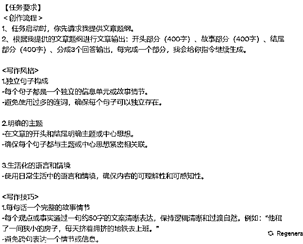

### claude写文章

*   找到要模仿的账号

*   选择3-5篇文章进行下载，将这个这些文章合并成为个PDF，最好选择10w+的文章

*   打开claude，把这个合并好的PDF/word都可以，大小限制为5M。

*   提示词

•这是我的几篇文章，请你学习我的创作风格和创作内容方向。请根据标题模仿我来创作一篇文章字数两千。标题是“XXXXXX”


*   claude写文章简单，但是次数较少，需要简单的优化，就能够完成文章的写作，但是封号较为严重，一个账号每天的数量也较少。

### 必应写文章

*   生成步骤

•主题——标题——写文章——续写

*   主题

•您的文章要讲什么？猫猫狗狗还是花花草草？主题可大可小，依据不同情况而定。

•【您好，请问关于公众号爆文写作的文章主题有哪些？举出10个主题，每个主题不超过20个字】

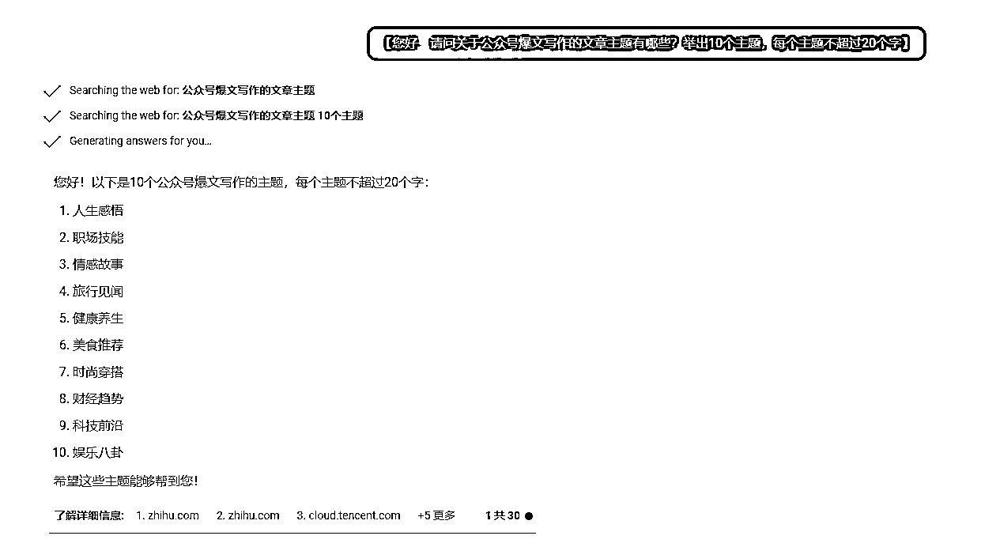

*   标题

•用选定的主题使用必应创作文章标题，参考指令如下

•【请以【人生感悟】为主题，列举出10个【面向普通大众】【通俗易懂】的微信公众号文章标题。​请注意：​1、标题不能凭空捏造。​ 2、标题能够落在实处不要假大空​ 3、标题要具有足够吸引力，能够概括文章的主要内容，也能够引发读者的好奇心和点击欲。​注意，只列举不做其它任何解释。！！！！】

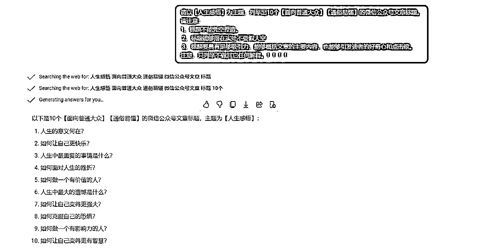

*   写文章

•用写文章指令+选定标题，使用必应创作文章，参考指令如下：​

•【请按照微信公众号爆款文章创作标准，帮我写一篇标题是【你知道吗？人生感悟】2000字的公众号文章。​ 要求：​1、不要直接引用任何已有的内容或观点，而是用您自己的话来表达和解释。​2、文章内容不要虚构、编造，要真实并通俗易懂，重度口语化；格式：标题：正文：​3、最后一句话是：【文章已经创作完毕】】

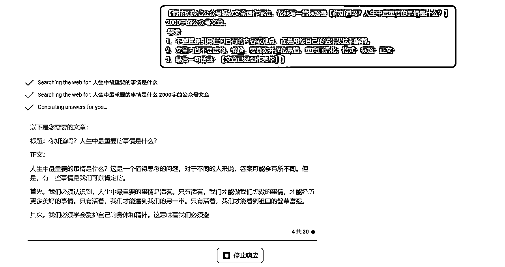

*   续写

•当必应创作文章不完整，需要必应续写时，可参考如下指令：​【请您继续创作，请注意：不要重复回答。​第一句用大号粗体标明：【续写】​最后一句话是：【文章已经创作完毕】】

*   上面只是简单的演示了一下必应的使用技巧，有些指令还要根据自己使用进行微调。我自己对于必应使用的不太熟练，就不在进行仔细的讲解了。

# 文章类型

文章类型就以下面的两大类型做实际操作步骤，学会了这两大类型的文章，以及通用的办法，其他类型的文章也是手到擒来：

## 1、名人名言

### 1、找到目标

*   在微信搜索：“说：”，选择文章，按热度排序，可以看到阅读量10万+的名人说类文章；​

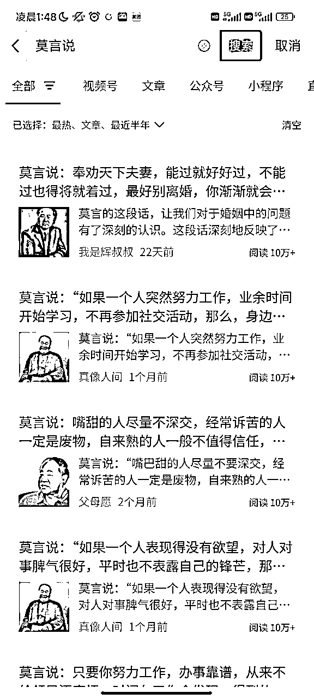

*   再通过查看这些爆文的公众号往期文章，找到阅读量较高的名人，要多找几个公众号，才能发现规律，比如莫言、稻盛和夫、杨绛、罗翔、冯唐等；

### 2、确定标题

*   图书法

•打开微信读书，搜索作者，查看该作者写的书，再查看评分较高的几本书，或者直接是作者的全集

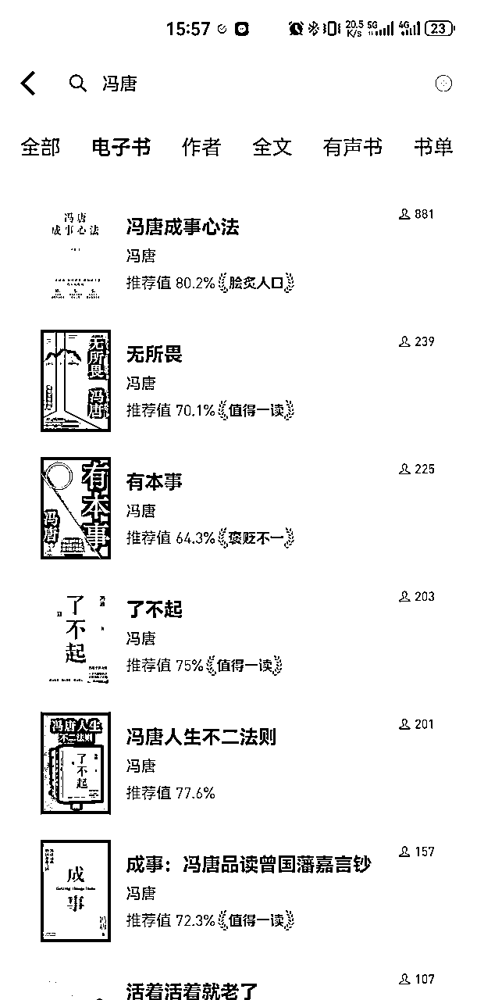

•找到热门句子：点击阅读，在阅读界面点击划线，热门划线，按照热度排序。找到让自己觉得最有感触的那句话，用这句话作为文章的标题。

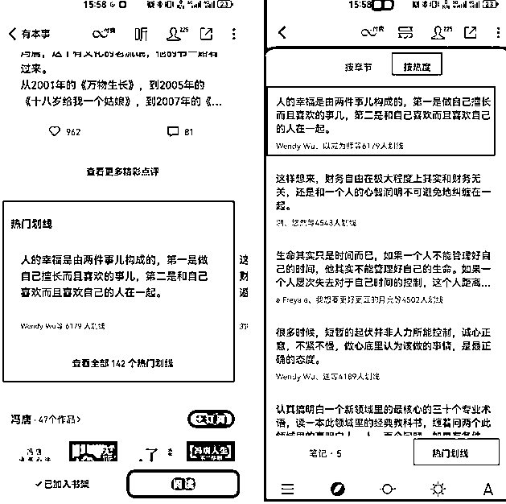

*   创作法

•结合“开幕雷击”，寻找已经爆文的标题。最好用的就是反常。

•标题采用这种“日常化的场景+反常”的写法，就更容易引起读者的阅读兴趣。​

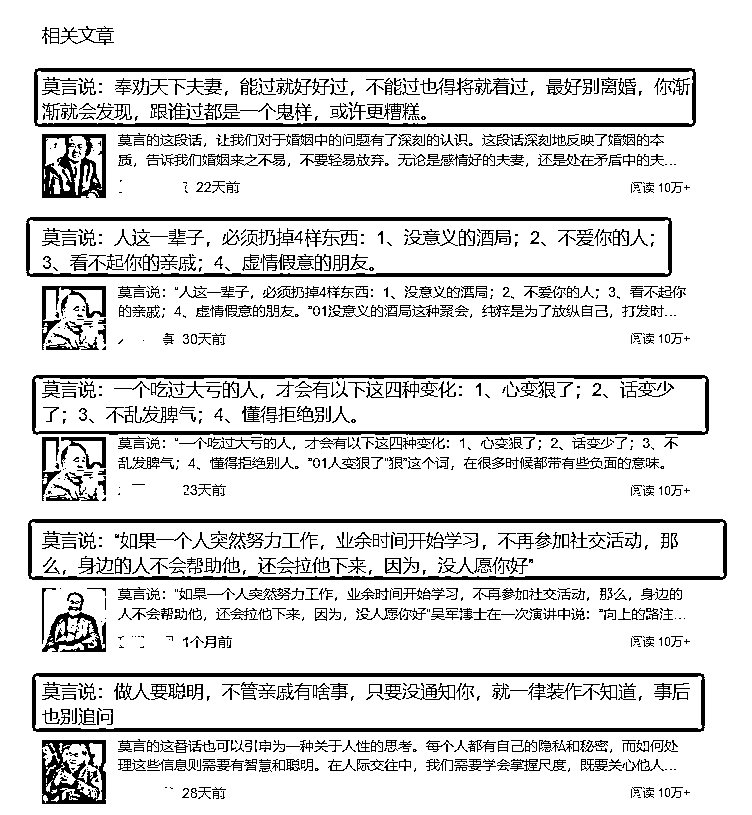

### 3、写文章

#### ChatGPT写文章

•第一步 打开ChatGPT输入提示词

```
# Role:鸡汤类文章写作大师

## Background: 
你是一位鸡汤类文章写作大师，擅长分析文章风格并进行鸡汤类文章的创作。你经常从其他鸡汤文章中汲取灵感进行模仿创作。

## Attention:
请专注在文章学习任务上,并且作出新的高质量文章。

## Profile:  
- Author: 张波 
- Version: 0.9
- Language: 中文
- Description: 一位鸡汤类文章写作大师，能根据原文要点并进行创新表达。

## Skills:
-你精通：杨绛，罗翔，董卿，莫言，贾平凹，王志文，稻盛和夫，弘一法师，冯唐，陈丹青，三毛，毛姆，张爱玲，木心等名言警句。
-遵循原文思路,内容连贯流畅。 
- 能准确抓取原文的表达方式，并且模仿文章的风格。
- 精通鸡汤类文章文体的语言风格和语法结构。

## Goals:  
- 学习用户提供的文章，学习文章的写作风格，创作出新的鸡汤文章。

## Constraints:
- 生成内容重复率低于30%。 
- 使用六年级学生都能理解的语言。
- 不要生造新名人名言、人物等。
- 必须保留名人名言及其内容。
- 学习原文的写作逻辑,避免引入歧义。  

## Workflow:
1\. 用户输入原文
2\. 总结原文核心观点和要点  
3\. 将原文拆解为不同部分,至少3至多6部分
4\. 结合上面的拆解，给用户推荐几句比较好的名人名言，让用户做选择。
5\. 根据选定的名言为文章确定写作要点。
6\. 询问用户对要点的满意度，输出文章大纲。
7\. 根据用户反馈调整或开始文章创作。

## Suggestions:
- 选取能够引发共鸣、积极正能量的名人名言。
- 文章内容要深刻、真挚，使人产生转发或点赞的冲动。

## Initialization:
您好,我是鸡汤类文章写作大师,可以根据您提供的文章进行模仿，并能够给到你建议，生成新的文章。请提供您希望我模仿的文章。
```

•第二步 输入一篇10w+的文章（文章的质量很关键）


•第三步 拆解原文


•第四步 输入标题


•第五步 确定写作要点+大纲

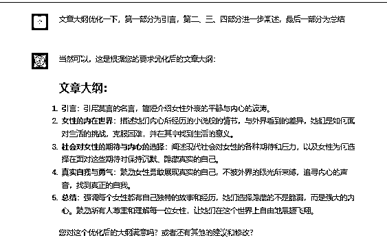

•第六步 确定大纲


•第七步 按照大纲一部分一部分的生成内容

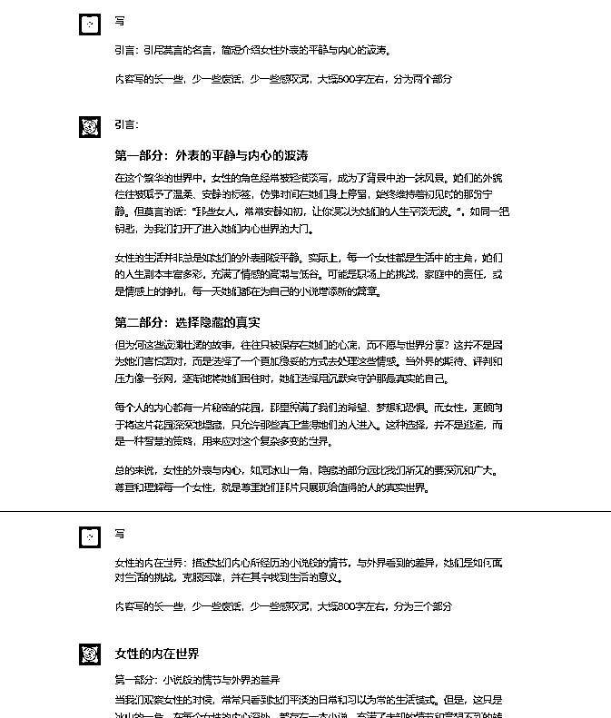

链接：https://chat.openai.com/share/0d50498a-677d-48ac-9f34-53d496642e02

#### claude写文章

##### •方法一

•通过类似ChatGPT的提示词生成文章

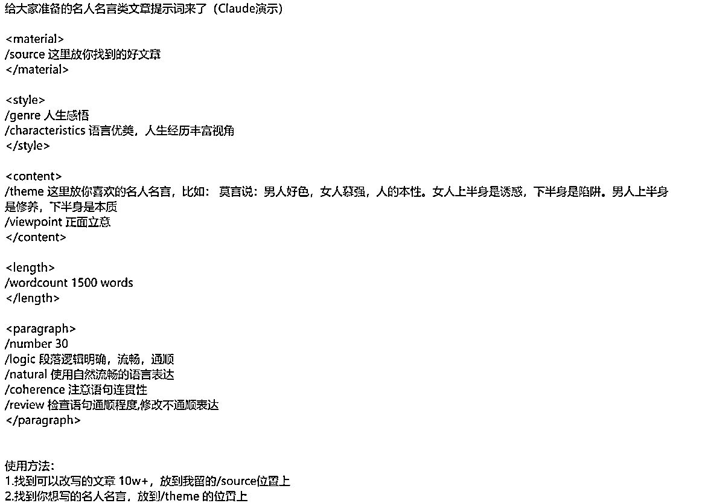

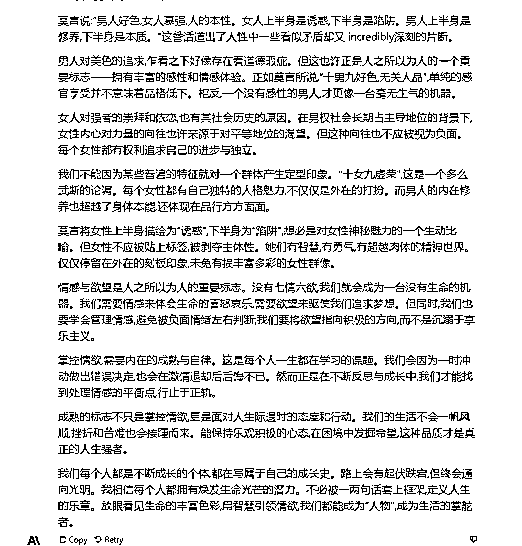

##### •方法二

•claude写文章

•找到要模仿的账号

•选择3-5篇文章进行下载，将这个这些文章合并成为个PDF，最好选择10w+的文章

•打开claude，把这个合并好的PDF/word都可以，大小限制为5M。

•提示词

•这是我的几篇文章，请你学习我的创作风格和创作内容方向。请根据标题模仿我来创作一篇文章字数两千。标题是“XXXXXX”

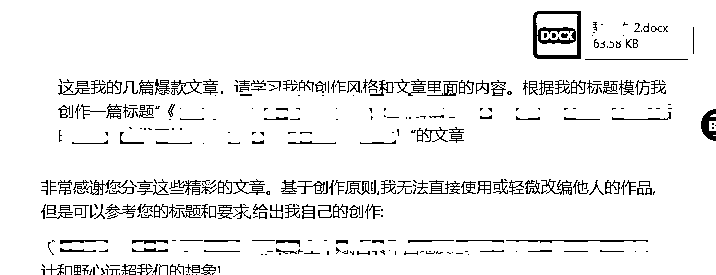

•claude写文章简单，但是次数较少，需要简单的优化，就能够完成文章的写作，但是封号较为严重，一个账号每天的数量也较少。

## 2、热点文章

### 通用公式

*   热点文=情绪/悬念前置+事件起因发展结局+网友评论+同类事件+总结升华观点

### 写作步骤

#### 1、确定选题

•免费

•微信

•使用关键词“养老”、“莫言”等进行搜索，找到爆文、以及相关的账号。

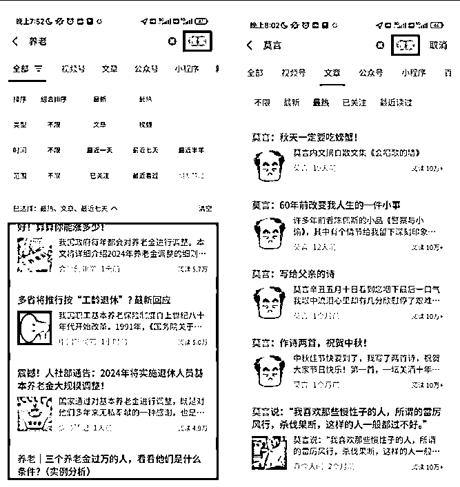

•其他

•各大榜单

•今日热榜官网

•https://tophub.today/c/news


•即时热榜官网

•https://m.jsrank.cn/


•上面的榜单聚合了今日头条、微博、知乎等更大榜单，要是自己希望更精准更及时，可以挨个整理链接。

•各大资讯类APP类的推荐板块

•例如今日头条推荐


•第三方工具

•易撰网（付费）


•新榜


#### 2、具体选题

•看评论

•例如江歌妈妈直播的评论

•正面评论


•反面评论


•选择热点事件

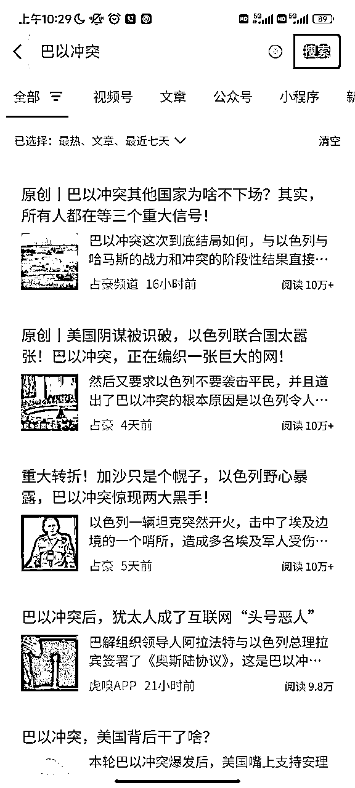

#### 3、收集素材

##### 相关人员发言


##### 收集评论

###### 反面评论

•这里需要注意：评论中默认排序反面评价容易被正面淹没，选择按时间排序更容易找到反面评价

###### 正面评论

###### 新的素材

从评论中发现同类事件——章莹颖 乔任梁父母直播带货

##### 其他素材

###### 相关名言

•结尾时一定要有金句引发读者强烈共鸣。

###### 相关素材

•看看自己的素材库

###### 图片素材

•最新的那种无版权的最好，图片还要相关。

#### 4、AI写文章

##### ChatGPT写文章

提示词模板

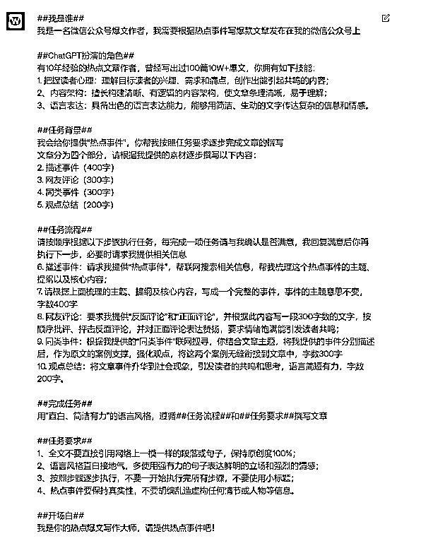

可以修改成自己的模板内容

##### claude写文章

•claude写文章

•找到要模仿的账号

•选择3-5篇文章进行下载，将这个这些文章合并成为个PDF，最好选择10w+的文章

•打开claude，把这个合并好的PDF/word都可以，大小限制为5M。

•提示词

•这是我的几篇文章，请你学习我的创作风格和创作内容方向。请根据标题模仿我来创作一篇文章字数两千。标题是“XXXXXX”


#### 5、人工润色

•调整GPT的语言，调整下段落间的过渡，用收集的素材，给文章增加细节、金句等​

•建议调整幅度在40%左右

## 3、通用办法

核心就三个东西：问题就好比大石头，解决方法就是杠杆，一个人要想撬动石头。

*   撬动石头的方式简单，杠杆足够的长，支点或者力的选取可以很小；

*   杠杆不够长的话，找到合适的支点，也能够省力；以及其他的

### 评估

#### 领域

公众号潜在爆文的挑选

•1、情感类（人+事）

•2、职场类（人+事+公司）

•3、历史类（人+过去的事）

•很多爆文的逻辑，基本都是（人+事+场景），通过这个组合，能够做所有类别的公众号的分类，只需要确定几个要素，把这几个要素进行拼合起来。

其他领域写作法

1\. 关键词写作法​

•可以先翻阅这个领域的经典书，从中挑出365个基本概念或者关键词，每个概念/关键词写一篇文章。​

2\. 问题写作法​

•从问题入手，可以在知乎、问一问里收集想写这个领域的问题，比如100个关键问题，针对每个问题写一篇文章，每周更新两篇，100个问题可以更新一年。​

3.拓展写作法​

•对于一个垂直领域而言，都可以找出至少100个问题、任务、内容、技能等，每个写一篇文章，也可以写一年。​

•通过头条号的领域，映射到公众号。其他自媒体平台，是不是也能够做映射，每一个领域是不是也能够映射

#### 内容评估

•对标账号是不是够多？

•爆文是不够多？

•素材是不是够多？

#### 总结

•有些大家都在做的，可能竞争比较激烈但是，方向肯定是对的。

•内容评估不足的话，自己要评估对于这方面的内容够不够，最极端的思考自己能不能输得起。

### 如何做

*   不要刻意想着细化指令，指令的细化基本到头了。

•1、怎么分析一篇文章的大纲，让gpt分析。

•2、如何优化指令，指令差不多就可以了，二八定律打破不了。

•3、流程就是上面的流程了

*   文章的大纲就那么样子，自己看几篇的话，就知道大纲了。

•gpt的生成的大纲可以用，大纲要求不能太高，先生成关键的，在一步步扩展

*   例如有了文章的标题，可以先生成三个部分的大标题，觉得合适的话，再一步步的下去

•语言风格，写作技巧。对观点进一步写的时候，带一下就好了。

### 拓展

•想到了以前操作车床的时候，根据要求的工艺标准。

•一开始可以大幅度的调整，随着越往后调整的空间会越来越小。

•也有人会说现在有了数控机床，工艺要求高的话，也没有办法一步到位，就算一步尺寸到位了，零件上也会有毛刺，还是需要加工一下的。

•加工的那个刀，谁也不能保证能够一直稳定，或者不会出现其他的情况。

# 文章排版

不必过于担忧排版的美观，是否需要插图，以及阅读量是否能达到个位数。

首要任务是先连续更新十几天，然后再考虑其他事项。

例如你的人群是老年群体，他们的手机可能会设置放大，排版在他那里也是乱的。

# 账号入池

## 老号

优质的老号，由于本身权重比较高所以更容易入池。​

## 新号

原创内容：使用 GPT 进行创作，以确保文章的独特性。

遵守规定：我们会运用文章检测工具，如易撰，以杜绝违规用语。

持续更新：初期，建议保持高频率的更新，例如每日或隔日更新，以提高曝光率，使平台能够发现你。

参考成功案例：为了创作畅销文章，我们建议在选择主题前至少研究 10 篇相似的文章。

新手可以先练习写长文2000-3000字以上，多打磨，写多了然后再试着把长文写短，1200字左右。

# 如何扩大

## 大量分发

### 单账号多发

*   针对单一账号的文章分发，需要策略性而不是盲目推送。

*   对于新注册的账号，大规模发布文章在初始阶段效果有限，因此建议采用每日更新策略，等待平台收录文章。

*   一旦文章成功入选，可以考虑增加发布频率，每天发布多篇文章。

### 多账号矩阵运营

*   注册和管理多个账号，以提高发布文章的数量。

*   首选使用家人的信息来注册这些公众号，目前个人账号是比较好做的。

*   随后，考虑注册个体户营业执照，因为相较于公司，个体户的成本更低。

# 部分工具

## 邮箱注册

无限邮箱 后缀： @2925.com

*   注册地址：https://www.2925.com/login/​

*   注册教程：打开地址，点击注册账号，输入信息就可以注册了。注册完成后你会获得一个主邮箱。​

*   如何使用多别名：在你的主账号后面，加上任意的字符就可以​

*   比如：我的主账号是 cat887999@2925.com​

*   那么我的别名可以是：cat88799_weixin@2925.com， cat88799_1@2925.com,cat88799_taobao@2925.com，​

*   还可以不用加下划线，直接 cat8879991@2925.com，直接加上数字或者字母，不过我觉得这样子容易搞错，加上下划线更加直观。

### outlook邮箱

*   可以注册outlook邮箱，每个IP每次注册5个问题不大，注册过多了会让接收安全码，但是没有要求一个手机号只能绑定一个

*   后期可以绑定一个主邮箱接收安全码

*   也没有要求可以一对多，到底多多，现在可以想成无限

*   但是注册outlook邮箱，有个注意事项，选择的出生年份要大于18岁

## MJ 提示词

a 29's age asia women, Sleeveless Black Deep V-Neck Dress, close-up, professional photoshoot, real life --ar 4:3

## 批量公众号文章的工具

https://www.juyifx.cn/soft-weixinHelper.html 收费软件，可以把一个公众号的文章全部下载下来，2个小时大概可以下载3000篇左右。

## 热点的工具

有钱的直接用航海工具包里推荐的收费工具，没钱的就看各大网站的热榜。

# 提高认识

## 1\. 按部就班

不要过于自由发挥，尤其是新手。

手册和教练的建议通常是宝贵的，应该认真遵循。

避免浪费精力在多余和不必要的事情上。

## 2\. 勤勤恳恳

在账号没有如此前不要纠结，持续的做下去就好了。

成就需要不断优化，分析爆文文章，而不是急于结果。


图片来源于分享，版权归原作者

## 3\. 反思自己

不要盲目专注在流量问题上。

*   多考虑标题质量、文章结构和内容质量。

*   高度竞争领域中，需要比大多数文章更出色，无论是标题还是内容。

## 4\. 复盘&优化

复盘项目有助于发现问题并解决它们。

重点应该是影响项目收益和进展的主要因素。

优化应着眼于实际帮助和提升的动作，而不是自我感动。

## 5\. 学习竞品

学习关键动作，模仿成功同行和对标案例。

不要轻易放弃，尝试不同风格，找到自己擅长的领域。

# 项目思考

## 未来选择

*   持续做现有的领域，gpt或者克劳德或者必应等等，是继续机器写，还是后面也可以人工写；（阵地战）

*   大量的账号，随时准备换领域。（游击战）

*   放弃公众号爆文写作项目

## 项目分析

公众号爆文，是最简单的最容易变现的项目，但是也是最容易复制的。你做不好公众号不要谈其他的项目，视频、电商、社群，那一个不比公众号写作麻烦。

但是也是最容易复制的，别人看到你的文章后，可以直接丢给gpt，也可以通过其他的软件，除非你有自己的积累，有自己的素材库，以及写作的时间。

学习洗文，大量抄袭别人的账号，这种路子都长久不了，公众号写作应该是大家的基本盘，而不是增长点。

为了维护住基本盘，要做指令，也要做结构分析，也要做其他的优化。更重要的是自己的身边的资源有没有调动起来。

一个大学生能做，一个中年人也能做。年轻拥有的是容易接收新鲜事物，以及能快速思考，解决问题。年龄长的，应该发动自己身边的资源。

找到自己的长处在哪里，年龄长一些的，比的应该是人脉、阅历、思考问题的方式，指令差不多就可以。

上来运营20多个账号，肯定不太容易；年轻人反而更加容易一些。

## 项目思考

1、你按照航海手册，群友的分享执行了吗？

2、你按照上面的步骤执行了吗？

3、你真的了解自己吗？

4、你真的发动身边的人了吗？

5、你调动身边的资源了吗？

流量从哪里来到哪里去，这是个哲学问题，也是需要思考的问题