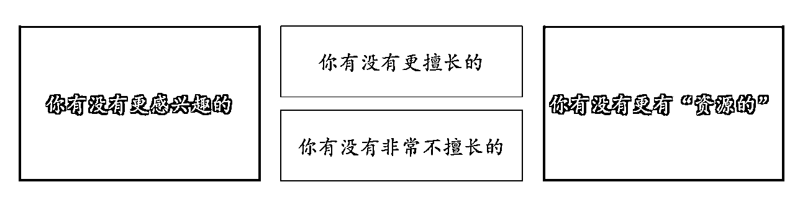
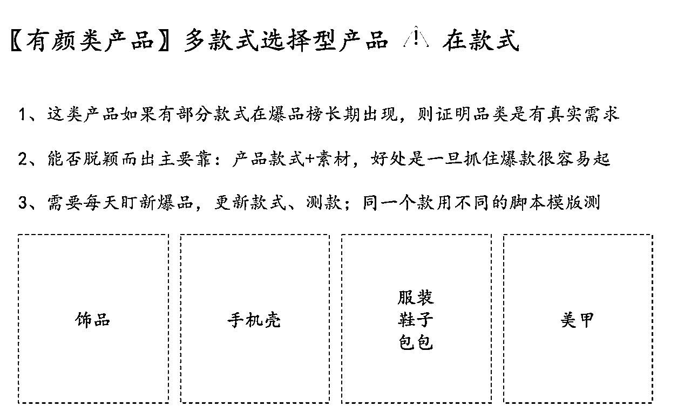

# 小红书内部选品方法全分享

> 来源：[https://hi428l7bh89.feishu.cn/docx/QQQVdbk6SovPCExGD3pc8IDnnEd](https://hi428l7bh89.feishu.cn/docx/QQQVdbk6SovPCExGD3pc8IDnnEd)

哈喽大家好，我是小刀~自我介绍一下

抖音半无人直播项目，截止现在个人+合作主播已经gmv突破3000万

今年5月份开始接触小红书电商，10月份新起的店铺中，有5家目前破了5000单

今天想聊聊【小红书电商选品】这个事情。

关于选品，方法真的太多太多了，不同的团队会有不同的方法，很多前辈分享过很多选品的方法，都已经写的很全面了~

写在前面：小红书无货源电商现在蕞高效的方法还是会【抄】

今天主要是根据我们团队的选品、以及对团队小伙伴培训的思路，分享一下我的选品观点。后面单独会写一个具体怎么【抄】的的分享。

写完发现一不小心写了1.3w字

实操性的步骤主要在最后一个模块。

但是如果你是纯电商小白，建议从头开始看。

第一部分：选品认知

第二部分：选品方法

*   了解小红书的人群特点

*   总结三类在小红书容易卖爆的产品类型

*   学会跟品的方法【重要* 选-看-测】

第三部分：选品技巧

第四部分：实操建议

很多逻辑的东西，刚接触起来可能有一些困难，但是不需要当下立即明白，它的目的就是在你心里种下一个种子，然后在你执行的时候，恍然大悟。

## 1、选品认知篇

99%的人在小红书开店，都没有爆单~一直苦恼的是：为什么我的产品没有销量、为什么我的笔记没人看。

这时候是需要转化视角的，思考一个问题：凭什么你的小红书笔记能爆单？

如果你是刚做，大概率想不出来结果。

那我们从最基础也是最本质的【人货场】理论，开始我们进行的探索。

### 1.1 电商的底层逻辑-人货场

线下开一个实体店和线上开一个小红书店的底层逻辑是一样的。

本质上就三个事儿：货是什么？卖给谁？怎么卖？

这三句话听起来简单，感觉没什么好说的，我们再进一步分析：

货——就是我们要卖的商品 【电商话术—货】

卖给谁——就是我们的消费者 【电商话术—人】

怎么卖——就是我们的成交场景。【电商话术—场】

对于场景，给大家举例子：

1、罗永浩在直播间带货，所有的用户都是在直播间成交的，直播间是它的成交场景

2、某博主发视频挂了商品，你点击小黄车购买，短视频成交场景

3、去逛一个实体店，店员说：美女穿这个太好看了，那店员对你的推销就是【场】

不管什么样的售卖方式，话术/方法可能不同，但是都有适合这个产品售卖的【场】

而这就是电商的【人货场】理论。

那小红书带货为什么没有爆单？这个问题，就要从人货场三个维度开始思考。

小红书的【人货场】是什么样的？

我们来还原一下平时刷小红书的路径。

01：今天挣了180块钱很开心，让我们来逛一会小红书休息一下。

这个时候就像你去线下逛街一样，很多女生去逛街是没有带目的的，我就是要去这条商业街上逛一逛而已。

很多时候你打开小红书就是想打开小红书逛一逛而已，这时候小红书的笔记就像是你逛的那一条街。

02: 你逛街的时候是看到琳琅满目的商店你要进去哪一家。

小红书是双屏瀑布流模式，相当于你看一下子能看到4家店，那你要去哪一家店？

其实你点开笔记的逻辑就像你去一家店一样，你要去哪一家店？

你突然眼前一亮，看到了上图中红框的这个笔记，这个粉色的抓夹今年好像很流行，看起来还挺洋气的。

是不是就像是你线下看到了一家店，那家店装修还不错，你看橱窗里挂的衣服特别漂亮，所以你想进去看看。

这其实就相当于【小红书的封面】，用尽一切办法激发用户点击欲望。

这家店展示的产品很好，我要进去，这就是小红书封面的作用，就相当于你线下超市里门头它装修的好不好，就相当于它放在玻璃柜里的橱窗里的东西。

那【小红书标题】的重要性相当于什么？

相当于你看到你的橱窗里bulingbuling的好的产品，它底下还挂了一个【今天清仓一折】的牌子，你是不是更想进了？

他给了你一个进一步进去的理由。

这就是为什么小红书封面和标题非常重要。

03 : 进店后开始看商品、看看细节、品质和价格

其实你平时也有思考路径，只是你没有这么拆开过。

你点进这个小红书笔记来看了。这是不是就像你到购物中心了，你去看各个衣服一样。

你进来第一时间：先看视频/图片

图片可以左滑右滑，你点开仔细看，觉得这个东西不错，确实挺符合我审美的。

然后开始看评论区：

这个产品是什么材质的啊？ 别人都怎么看？

这个时候你看评论区那么多人都在买，很多人都想要的东西一定是好东西。

你更心动了。

那接下来是不是要点开购物车，看一下价格。

你一看这个东西只要5块8毛钱，那么便宜，买它！！！

小手一动又花了5块9毛钱。

现在我们体验了一下小红书的消费场景流程。

来再来看往深了一下。

你觉得自己是漫无目的的在逛

但是小红书可是知道你喜欢什么的，他已经把你精准的打上了标签。

平台知道你大概率就是对粉色多巴胺抓夹毫无抵抗力，所以才把这个笔记推到你的面前，诱惑你消费。

同样的你的笔记，能不能让系统识别到谁喜欢他？

在刚才我们消费的过程中，人货场是什么

在售卖具体产品的时候，消费者（人）会根据产品有不同的画像。

抓夹的消费者首先大概率是长头发的女生，而且从产品上看，这个女生应该喜欢多巴胺粉色爱心，大多数是可爱风的女生。

这时候那种短头发的、或者特别喜欢冷淡风偏个性风的女孩子就不再是你的【人】。

等你明确你【货】的卖点，【人】是会更具象的。

理解了人货场， 后面就要带着【人货场]的意识开始思考。

我喝一杯咖啡，我从外卖上点的，我的【场】是美团外卖、【货】是瑞幸的美式咖啡。

对应这个可以有的思考：

为什么这个人喜欢喝美式？而不是拿铁？

为什么他选择了瑞幸？为什么他没有选星巴克？

是不是代表了他这个人的标签是“没那么有钱”。

比如说手机壳你看到它的时候，你会怎么思考？

这个【货】是手机壳。但是它不仅是一个手机壳。

它是充满金钱味道的手机壳。背后是想挣钱的人，对钱喜欢的人。

大家带着这种意识思考，短时间可能你不会产生立马质的改变，但是长期来说对于你做电商一定是有帮助的。

你的品感就是这样慢慢建立起来的，你对于电商的认知就是慢慢建立起来的。

同样是抓夹，人也是不一样的，比如有的抓夹就是【加大加宽】的抓夹。

正常大家买抓夹都是为了好看

但是【加大加宽】的抓夹不好看，也能卖爆，因为它加大加宽了

它背后的【人】是发量王者——头发夹不过来的人~头发已经加不过来了，一定程度上可以舍弃一部分审美，你别太丑的情况下，能夹住我的头发ok。

这就是不同的【人】、不同的【货】，你要用不同的【场】成交。

这个时候你知道为什么自己不出单了吗？

### 1.2 正确的选品观-从消费者到掠夺者

做电商的第一步是纠正自己的视角

要从被掠夺者（花钱的人）变成为掠夺者（赚钱的人）。

把我喜欢、我觉得、我认为这种选品思维从自己脑子里面删除掉。

不是说你喜欢的不重要，只是说大多数的时候来讲：

你当消费者的时候，老娘的感受天下第一，我就是上帝

我就是喜欢这个带钱的手机壳不行吗？ 我就是喜欢这种项链不可以嘛？

当然可以没有问题，你可以买，但是你去卖可能就销量惨淡了。

但是你现在要关注的是：

消费者喜欢什么？数据说什么品比较好？同行都在跟什么品？

很多人说：我喜欢就证明有别人喜欢我，我就想找到那些跟我审美一样的人，不行吗？

想在小红书这个平台赚钱，就要尊重他的逻辑。

站在小红书的角度来讲，我优先把流量给能给我创造最大价值的内容。而不是只要有人喜欢我就推它。

你们可以观察：某一段时间某一个品比较火，全网都会推这个品。

在你要卖的这个东西确实有人喜欢，但是更多人喜欢的是另一个。

拿瑞幸的酱香拿铁举例子，假设你是代购，酱香咖啡火的时候，所有人都在跟风要买酱香。

你说：不，不要买这个，这个不好喝，你就跟我喝美式。

这合适吗？这不合适！

要尊重平台，尊重数据，尊重用户的需求。

所以说这一刻跟我把：我喜欢，我觉得、我感觉、我猜测从你的脑子里彻底删掉。

以后在选品中一旦有这样的念头立刻提醒自己，stop。

（有天赋的人除外，如果你的感觉很准哈哈哈哈哈，那是天赋）

## 2、选品方法篇

### 2.1 小白选品能力进阶的三个阶段

我们培训的时候，会把选品能力的提升，分为三个阶段，这里先给大家列出了~

第一步，对品有初步的感觉

第二步，学会用方法跟品。

第三步，根据需求开品

### 2.2 对品有初步的感觉

开始之前，先问大家几个问题，大家暂停30秒（依托人货场思考）

① 什么样的产品是好的产品

② 什么样的产品在小红书上是好的产品。

③ 是什么样的产品是我在小红书上可以卖的好的产品。

#### 01- 什么样的品是好的品？

从商业上讲，只要有人买单的产品就是好产品。

人们会为需求买单，你能卖得出去，证明你击中了用户的某个需求，证明这个品是有：能击中目标用户（人）需求的有卖点的产品（货）。

很多人经常会问：刀姐，你觉得xxx品行不行？

下次你直接去pdd上看，所有在销量榜上能让你看到的品都是好的产品。

但是这些产品在小红书上都是好的品吗？

#### 02- 什么样的品在小红书是好的品？

因为“小红书的人”不一样，消费者变成了【小红书的用户】。

因为“小红书的场”不一样，场景是【小红书的笔记成交场景】了。

相当于，在好的产品里，只有一小部分是分适合小红书的。

所以要想知道：什么样的品在小红书是好的品？

就必须要知道：【小红书的人】是什么人；【小红书的场】是什么场。

接下来带大家进一步分析一下小红书的人和场。

##### 02-1-1小红书的用户画像

小红书目标用户以女性为主，主要使用用户为35岁以下的年轻人，由此可以看出小红书主要使用人群为年轻女性。

所以尽量不做男性、老年用户的产品，除非你的主题是【礼物】。

再给大家讲一个点：就是用户和客户是不一样的。

假设你卖剃须刀：

你直接是卖给一个男生，这个时候用户是男生，客户也是男生。客户是买单的那个人。

你是用“送给你男朋友的礼物”卖给了一个女生，这个时候用户还是男生，但客户变变成了女生。

我们平时统一都称呼用户，这里只是给大家稍微做一下区隔，大家有这个意识就好了。

就是你买单的人和用这个东西的人不一定是一个人。

所以直接做老年点产品不行，但是如果说你说是送给妈妈的礼物，送给男朋友的礼物。货本身还是那个货，你就可以卖了。

但是相对来说还是不建议做这类型的产品。除非你是很明确的做这种季节性的礼品。但一年就一个母亲节、一个情人节。

##### 02-1-2 小红书的用户需求

她们会关注美妆护肤、穿搭减肥、运动、发型、健身、个人护理。

她们有事业心，有好奇心，有流行趋势，喜欢社交，享受人生，有仪式感。

这是一群有消费能力的女孩子，新时代女性。

她们的诉求是什么？

我要变美变好看，我要变得更精致，我要变得更优秀。

这几个词看起来一样，但其实是有区别的。

变美是什么？

我今天贴了个假睫毛，我变得更美了，我今天涂了一个口红我变得更美了，这是为了我单纯的外形。

变精致是什么？

杯子有9块8的，但是我就买一个星巴克的杯子198，我的格调升了这叫变精致，它是生活品质的追求，很多可能是都在你不注意的细节里面。

台灯有19块9的，我今天就是为了装饰更好看一点，我就能买个1999的台灯。

变优秀是什么？

变优秀更多的是来自于成长，想赚钱、想成长，想让自身的技能更加往上，是向上的生活态度。

针对用户的特点，衍生出来了三种在小红书上特别容易卖爆的产品。

#### 03 三种容易在小红书卖爆的品

三种容易在小红书上容易卖爆的产品：有颜值的产品、有用户的产品、有便宜占的产品。

市场产品类型千千万，为什么我把这三个点单独给你拎出来？

##### 03-1【有颜】的产品是什么意思？

有颜值的产品是指：

这类产品最大的卖点就是本身的颜值，比如手链、发夹、手机壳等

用户购买这类产品的时候，更关注他好不好看。

有颜值产品的优/缺点：

优点-只要你能选到用户喜欢的款式，笔记只拍个产品照片就能出单

缺点-款式太多了每天都上新，新手的跟款速度比较慢

那大家想一想，手机壳属于有颜值的产品对吧？那对于手机壳来说，最重要的是什么？

你这时候脑子里的第一反应是——有颜的产品主要看款式

为什么一个女孩子需要各种抓夹，你们可以去小红书搜有发夹控，那种小特别漂亮的小夹子，买好几抽屉。

他们买的就是颜值，他们喜欢这些东西的颜值、喜欢这个东西的颜值带给他们的快乐

这一类型的产品，展示出产品本身的颜值就是很好的笔记写法。

你如果喜欢这个款式，我就把这个东西放到这儿，你也会买

你不喜欢这个款式，我把它夸出天来，你都不认可他的颜值，也不会要

有颜的产品案例展示

下图是今年夏天卖的比较火的一款头饰，最开始上架的时候售卖19.9，成本4块钱，几张图片利润20w+。

很多小伙伴看到这个笔记都表示不能理解：

为什么它随手一拍就爆了？我都做了精美的视频了都没有爆？

这时候大家思考一个问题，抓夹属于——有颜类型的产品：

那同样的抓夹换个颜色 是否还能爆？

同样的拍摄场景，换个款式是否还能爆？

想清楚这个问题，你就知道做颜值类的产品，重点应该放在哪里了。

##### 03-2【有用】的产品是什么意思？

有用的产品是指：

有明确用途的产品，比如提臀裤可以提臀；暖宫贴可以缓解月经痛；跳绳可以瘦身；青汁可以减肥。

在小红书上更好的是对女生【变美】【变精致】有用的产品

用户购买这类产品的时候，更关注产品的效果。

有用产品的优/缺点：

优点-选择对用户真实有用的产品，出单转化率都不低

缺点-笔记制作难度会稍微高一些

同样是美妆类目，产品也不一样：

口红其实属于有颜的产品，用不同的颜色的口红可以带给我不一样的漂亮，所以会选择很多口红色号。

粉底就属于更偏有用的产品，因为我对粉底的最大诉求就是他的遮瑕，在这个基础上还有更多功能性需求，比如保湿的、轻薄的、持妆久的，整体都是区域【用途】的。

这种的真实强需求的产品，我们要围绕着使用体验、使用方法、使用效果去写笔记。

搞粉底液的从来没跟你说我这个粉底液特别好看。他更多的是跟你说：你这个肤色适合什么色号，你是干皮这个不卡粉，你的痘印明显这个遮瑕烈度特别好。

但口红你直接往胳膊上一划：姐妹们这个色号是这样的，真的很好看。就能出单。

这就是不同的产品类型背后代表的产品，你选品的时候偏重点是不一样的，。

后面还会给大家详细讲。有颜值类型的产品偏重的就是款式，有用的产品偏重的就是效果、经验、方法。

围绕一个人女生变美，是有很多有用的东西需要供给他的。

有用的产品案例展示

##### 03-3【有便宜占】的产品是什么意思？

有便宜占和便宜是两回事儿。

有便宜占指可以用低于用户预期的价格买到用户想要的产品。

这个口红平时卖299，今天店就要关了，99给你保证正品。这叫有便宜占。

你家里的口红用了一半了，卖9.9。这不叫有便宜占，叫真的便宜。

如果你的产品有便宜占，能促进你把【有颜】和【有用】的产品卖的更好。

【小红书某口红销量爆棚（假货），官方39它19.8】

### 2.3 会用方法跟品

很多人觉得品是选出来的，我会选就行了。但是今天开始给大家再增加几个我的看法：

#### 2.3.1 选品是指【选-看-测】三步

小红书的选品是分三步的，第一步叫选、第二步叫看、第三步叫测。

选：通过我们的选品方法初步选定一些产品，成为我们的待上架产品

看：把这些待上架的产品，去小红书看实际在小红书的销售情况

测：上架到我们的店铺，写笔记售卖，根据数据情况看这个品值不值得长期卖、应该用什么方式卖

同一个产品需要经历这三个阶段，才能知道是不是一个真正的好产品

开始之前先跟大家讲一下，很多小白在选品阶段遇到的第一个问题就是下不定决心具体做哪个品。

总觉得这个品好、那个品也好，要么就是这个品还不够优秀、那个品也不够优秀，就一直拖，导致落地效果很差。

这里想跟大家说，选了不对就再选，它不需要囤货，你选错了需要投入金钱，这个就是选错了就换就好了。

没有选出来完美的品，只有测出来还不错的品。先开干。

#### 2.3.2【选-看-测】之怎么选品

##### 2.3.2.1选品的6个标准点

之前的内容我们聊过什么是好的产品——满足目标用户需求的品，而不是你喜欢的品。

在这个的基础条件上，给到大家6个选品原则。

###### 【1】小红书选品的2个前提

首先，一定要选择爆过/在爆的产品，爆款会重复爆

我们作为小白，就要有小白的觉悟，没有人卖过的东西不要去干，不做第一个吃螃蟹的人。我们要做跟在人家背后吃螃蟹的人。

只要这个品爆过，证明他符合了用户的需求击中了用户的购买欲望，不会出错。

其次，尽量垂直，最好是同一赛道同一类目下的不同单品。

你不要这个号今天卖水果，明天卖手链。

但是在前期你可以这个号即卖手链又卖项链，因为手链和项链的目标用户是一群人。当然最好的情况下，你卖抓夹就卖只卖抓夹，卖项链就只卖项链。

但前期很多人拿不定主意到底做什么。你就先可以多测一点，但是一定要保证大品类相对比较垂直。

等什么时候发现比如项链数据明显比手链好的话，你就要开始专注做数据好的品。

###### 【2】小红书选品的2个基础项

在爆过的、相对垂直2个前提下，下一步要注意选品必须满足：两个基础项。

首先：保证用户画像是一致的

抖音那么多爆品，我具体做哪个产品呢？

起码，你选的这个品的用户要要跟小红书的人群背后是一样的。

其次，产品必须有利润空间

姐妹们时刻牢记我们是来挣钱的。尽量保证30%以上的利润率（后面会有专门的定价讲解）

###### 【3】小红书选品的2个优先级

在满足2个前提和2个基础项的情况下，我们下一步怎么选呢？ 给大家2个选品的优先级。

第一个优先级是时间优先级

新爆的品你快速去跟，能拿到的热度一定是更高的。

一个月以前爆的品，大概率已经有很多人在做了，竞争压力也会很大。

所以我们在选择爆款的时候：最近1个小时爆品>24小时爆品>7天爆品>30天内爆品。

那30天以前爆的品你再去推，也有可能爆再，但是概率性会小。所以说叫优先级，在有的选择的情况下优先选择最近的。

第二个是粉丝量优先级

我们最适合找低粉丝号的人带爆的品。

如果是罗永浩带带品，销量怎么都不低，但是这不是品本身有优势，而且因为罗永浩在推。

如果是一个100万粉丝的帐号带爆的品，可能也不是品本身有优势，而是粉丝支持力度高。

当一个帐号只有十几个粉丝，但是还能爆单，证明它爆单的原因就是选品和内容都做的很好。这就叫低粉爆款。

所以我们在选择爆款的时候：低粉爆款>高粉无人设>有人设

越有人设越粉丝量级越大的我们能模仿的成功的可能性就会越小。

所以整理来说

我们最优选择：有利润率的、跟我们目标用户画像一致的、24小时之内的低粉爆款。

但是哪有这么多的最优解，很多时候看着差不多的就要上。

###### 【4】小红书选品的2个注意事情

我们鼓励大家通过混剪测品，然后等这个产品开始出单有爆款潜力以后再进行实拍。

所以在选品的时候有2个因素需要注意：

首先是素材的丰富度-如果这个产品在全网就2张图，就很难混剪出足够的素材进行测品。

其次是产品的拍摄难度-如果这个品很难拍，你就要做好准备，后续可能因为没有实拍素材被判定原创度低限流。

##### 2.3.2.2 选品落地方法

在选品的6个原则和2个注意事项下，我们具体怎么做呢？

一般有3个主要的选品思路：参考抖音平台爆品进行选品、参考小红书站内爆品进行选品、参考电商平台（如pdd）进行选品。

我比较喜欢用的是抖音选品法+小红书站内低粉爆款选品法。

（这个在最后一部分跟大家进行详细阐述）

#### 2.3.4【选-看-测】之怎么看品

假设你用抖音选品方法，选出来了4个品。

那既要卖a又要卖b又要卖c我都卖吗？都适合卖吗？都要去测吗？

所以在选完开测之前，我们要先去小红书【看】，也就是很多人说的找对标，看对标的数据情况。

叫什么叫对标？就是也在做你这个产品的同行

通过看小红书是不是有人在做这个产品、做的怎么样，来初步判断这个产品的情况。

很多小伙伴执着于找对标帐号，其实基于小红书的平台属性，我们更多的是建议大家找【对标内容】，然后通过内容挖掘账号。

比如你现在通过考古家选中了【提臀裤】这个品，那怎么来看这个品在小红书是什么情况呢？

##### 第一步：通过搜索看内容

在小红书的搜索框🔍输入【提臀裤】，就可以看到搜索页面。

注意⚠️

1-在看的过程中，不仅仅是看数据也要同步看数据高的笔记封面、标题、内容是什么样子的，思考自己能不能模仿，也可以不断强化自己的网感。

2-在看的过程中，每条内容都点进去作者主页看看，如果发现【低粉爆文】一定要收藏好，后期重点模仿参考

###### 【1】先看搜索内容的综合排序/最热排序

看综合推荐的内容点赞情况、发布时间情况、挂车情况。

提醒大家：不同的产品数据差异非常大，很难有统一的标准，大家多看才能有感知。

如果你搜索的这个产品综合推荐排前面的都是半年以上的笔记，那可能存在这个品最近比较难推。

如果你搜索的这个产品整体点赞都只有几百个，那可能存在这个产品的受欢迎程度比较低

如果你搜索出来很多笔记数据不错，但是他们都没有挂车，那对你来说可能就是一个很好的机会，赶紧上架产品。

###### 【2】再看搜索内容发最新排序

最近几天发这个品的内容多不多？ 质量高不高？数据怎么样？

发布作品的内容量一定程度反应出这个品最近的竞争力度。

发布作品的质量如果都比你能做到的高，那你能拿到结果的概率就会小。

最近发布的作品的数据（最好看2-3天以前的，小红书比较慢热）代表了最近这个品在用户心理的受欢迎程度。

##### 第二步：通过搜索商品看销量

搜索完点击商品--点击按照销量排序，具体看这个产品的销量情况。

需要注意两点：

1、我们主要参考个人店况，旗舰店企业店不重点看

2、内容数据好不代表销量就好

我们在选品篇提过，很多品并没有真实需求，很多比如“解压玩具”等，内容都很爆，但是实际产品售卖情况较差。

##### 第三步：根据搜索都内容/产品销量情况，进行分析判断

###### 情况一：这个品在抖音火了，在小红书也已经火了

什么叫火了呢？ 这个没有统一的标准，大家要综合判断。

对小红书来说，起码有不止一条搜索出来的笔记点赞1000+

因为你的品是从抖音上选的，假设你想做的品在抖音上火了，你发现他在小红书上也火了，大概率品本身是好的产品，就看你能不能把它卖出去了。

并不是所有好的产品你都能卖出去，在一个品已经有很多人做且做的不错的情况下，一个新号想在竞争中脱颖而出并不容易，需要在笔记上多下很多功夫。

这个时候重点是笔记

<h7>🚫判断条件1：这个品的混剪素材比较多，可以测。</h7>

因为这时候测的重点就不是品行不行了，因为品肯定行，别人做出来。这个时候需要多个爆款脚本，测你用什么样的内容能把这个品卖出去。

<h7>🚫判断条件2：这个品的混剪素材很少，但是你能实拍出来，可以测</h7>

如果你对这个品很看好，但是网上素材很少，那你也可以自己购买回来实物进行测试。

<h7>🚫 判断条件3：素材手，也不能实拍，但是3天内的新爆品，一定要测</h7>

克服一切困难，利用现有的素材想办法进行混剪去重，上！

###### 情况二：这个品在抖音火了，但在小红书没有火

小红书和抖音虽然都是兴趣电商，但是毕竟不上同一个平台，用户对于品和内容的喜好程度还是不一样的。

那抖音火了小红书没火，会存在很多原因，这时候要分几种情况进行判断：

<h7>🚫 前置判断： 从数据平台再次确认这个品的目标用户是否跟小红书用户一致。是继续判断，不是放弃。</h7>

确定你选中的产品是符合小红书年轻女性群体的品

<h7>🚫 判断条件1：这个品没火（销量低），但是相关素材火了（内容爆）</h7>

这个情况大概会有2种原因：

一种是：品是好品，但是大多数搞这个品的内容的人没开店— 抓紧测

因为小红书今年是第一年电商，很多人是不知道开店的，就像马上秋天冬天来了，但是之前秋冬天的内容都是没有挂车的，所以很多比如羽绒服，可能相关素材很爆，但是产品没有销量。

这个主要通过搜索内容排序的【最新】看近期内容数据，以及【综合】看挂车情况。

一种是：内容是好内容，但是品不是好品—放弃

如果你搜索的笔记是近期的笔记且挂车了，但是产品依旧销量比较低，大概率是这个品是【看热闹】的品，用户没有真实需求。

<h7>🚫 判断条件1：这个品没火（销量低），相关素材也没火（点赞低）</h7>

这个时候也分2种原因：

一种是：有人在发布相关内容，但是没有火，如果你能做的更好，抓紧测

这个时候你要看内容是不是能比他做的更好，如果可以，就可以测试看看。

一种是：没有人发布相关内容。

如果你确定这个品确实符合小红书用户的画像& 且符合【有颜】【有用】的原则&且在抖音爆了，那你可以测试看看效果。

这个判断逻辑看起来复杂，等你判断几个品后就会形成条件反射，不需要一步步对照才能完成了。

#### 2.3.5 加餐-自己的优势怎么利用。

大家记得之前问大家的那三个问题吗？

什么品是好品，什么品在小红书上是好的品，什么品在是你在小红书上可以卖的好的品？

当把“你”这个因素融入进去，在人、货、场三个部分，会有哪个哪个地方不一样？

【1】思考你有没有热爱的

热爱能帮你更好的坚持。

但是要注意，喜欢和擅长是两回事儿，很喜欢什么不代表擅长什么。有很多像比如说我喜欢化妆、喜欢穿搭，但是这不代表你就化妆技术好什么好。

【2】思考你有没有擅长/有优势的

很多人说“我对穿搭美妆特别擅长”，你就可以考虑按照这个方向去品类。

很多人说“我的手很好看”，那就可以考虑做跟手相关的东西，比如手链/戒指/护手霜。

你的脖子好看、你耳朵很好看、你头发很好看，这就是你擅长和你自身的优势。

【3】你有没有资源的。

你有没有身边的亲朋好友有没有做工厂的？能不能提供货源和素材优势？

热爱的事情更容易坚持，擅长的东西特别容易有正反馈。

如果都没有，那就碰到什么干什么。先把手头的事干好，再去想梦想。

脑子里牢牢记住一句话叫：先完成再完美，先开始再优化，别纠结！！

## 3、选品技巧篇

前面的内容让我们掌握了选品的基础方法，那总有一些技巧，能提升我们的效率和成功率。今天主要带大家了解3个技巧，分别是：学会傍大腿、学会截品、学会识别。

具体的我们一个一个来看：

### 3.1 学会傍大腿

大家都知道，要站在巨人的肩膀上这句话，因为站得高看得远。

我们傍大腿的逻辑就是站在【专业的商家/达人】的肩膀上做选品。

开始前先普及一下：

抖音和小红书是一样是兴趣电商，在抖音售卖产品的方式主要是：短视频带货和直播带货，我们主要对标的是短视频（包括视频和图文）带货。

那抖音上带货的短视频都是谁在生产呢？

有一部分人是商家自己生产。

很多商家不仅找大人帮他们带货，他们自己也要短视频+直播，所以会生产大量的内容素材。而同样的他们为了让达人能更好的帮他们带货，他们一般会选择把自己拍摄的素材给到【带货达人】，这样达人可以不用自己拍摄。

有一部分人是达人自己生产。

这种大多数是带有一点人设的达人，会自己出镜拍摄。

给大家举例子，如下图的抖音企业帐号【企鹅又来了】。

它每个视频点赞量都很低，但是他持续在拍，因为它拍出来的内容很多人会拿去混剪，从而带动销量，这就是商家自己有拍摄素材。

大家可以去看很品类都会有这样的商家，你们要去找。

#### 找到这样的商家后，我们有2个事情要做。

#### 【1】添加商家微信要素材+一件代发

##### ✅ 要添加商家的微信要素材

我们小红书混剪多了，平台会判你原创度低或者判你抄袭。这个时候你是可以申诉的时候，但是要提供证据证明这个东西是你原创的。

这时候你添加商家微信，把原创素材要过来，这个素材就是你的了。你可以把原创素材和剪辑过程截图提交申诉，80%以上的视频都能申诉成功。

##### ✅ 沟通微信导订单发货

添加商家微信后，你可以直接问这个商家是不是可以微信导订单发货。你把订单直接导给他，然后让他给你发货。

（不会沟通的后面供应商篇会给大家进一步讲解）

等你订单多了之后，商家一般会给他们可以对接ERP系统，自动给你发货。

#### 【2】确认他是否在小红书开了账号

如果你找到了能实时产生原素材，且没有入驻小红书的商家，并且跟他建立联系了。

那你接下来盯着他每天几点发内容，第一时间把他素材搬运到小红书，你就是这个内容在小红书的原创了。（小红书通过内容在小红书平台的发布时间来判断是否是原创）

这时候拼的就是搬运的速度，不是说搬运不可以，只是说你搬运的内容被太多人搬运过了，所以不可以。

所以说如果找到这样的商家，他上什么品你跟什么品。多开两个店，有一个店你就专门搞这样的事，这样你的时间成本很低，万一爆了你就很赚。

我就通过这样的逻辑找到了一家长期合作的供应商，并且取得了他们平台所有的独家授权，我们还把他那东西拿到快手视频号了，也赚了一波钱。

赚钱需要主动，很多人都看到过供应商为什么到最后我拿了他们独家？

现在他们小红书官方账号都是我们在代运营，每个月利润分给我70%，所有的素材都是他给的，我就他转发一下。

赚钱需要主动看到机会，主动去问，主动去谈。

我们刚才说的是商家，同样的逻辑，给我们去找很多抖音带货的达人，他们没有做小红书帐号。你也直接盯着做的比较好的进行搬运。

他又没干小红书，你不搬别人也会搬运。

但是有个前提，你要保证你第一时间搬，但凡你不是第一时间搬，很有可能被别人搬过了，你就会违规。

### 3.2 学会截品

不管你用抖音选品还是小红书站内选品，当你确定了一个爆品，就可以沿着这个爆品挖到把这个品带爆的账号。

你进一步去观察这个账号的【爆品率】以及【粉丝画像】。

如果这个账号的粉丝画像跟你的一致且爆品率比较高，那证明选品能力优秀，我们就可以重点观察他的品，进行跟品。

跟什么样的品呢？ 着重同比他同一时间发出的产品哪个数据会更好，我们优先跟进数据表现好的品。

这样相当于你找到了选品能力素材能力比你强的人帮你选品、测品。

如上面的图，很明显的能看出不同款式数据的差异，这时候当然选择数据更好的优先测试。

### 3.3学会识别

识别你的产品类型和卖点。

如果你选的是有颜值类型的产品，你要注重款式的更新。

很多人对手机壳感兴趣，这个就是很经典的吃款的产品了，每天都有手机壳的款式在爆，看的是你能不能第一时间抓住这个爆款。

这一类型的产品，脚本都不会太复杂~

你去抖音爆品榜单看饰品相关的产品，可以发现头饰更容易出内容。项链、手链等素材相对较少，这就是有颜值类型的产品，你再怎么拍，也是要拍产品展示。

但头饰在有颜值的基础上还有用，所以可以拍怎么扎头发、扎完之后什么效果。

所以需要不停的盯新品，不停的测款。

如果你做的是有用的产品，重点在笔记脚本的铺设

站在用户的角度，有用型的产品，他更多会为效果、使用体验等买单。

所以说怎么凸显我们产品的效果很重要。

所以说对于有用型的产品，你要考虑目标人群的需求和痛点。

你卖个抓夹，坦白讲不太需要考虑痛点，买回去好看。

但你买一个减肥药、吹风机、提臀裤，你是要考虑用户需求和产品的~

给大家拿我们卖爆的一个产品【狼牙滚轮】举例子：

爆款的标题就是：

现在不虐腿，夏天怎么逆袭筷子腿 【需求：瘦腿】

爆款的内容脚本：

滚腿的过程展示（大家可以去搜索一下）腿越青的视频越爆，因为对于这个产品来说，这个使用方法//使用体验（腿青），在目标用户脑中的联想是【腿滚青了】=【有用】=【可以瘦腿】

如果你做的是【季节性产品】，要注意时效性

减肥这个事儿，一年四季都可以减，但夏天姐妹们露肉的时候，减肥欲望满分。

所以滚腿神器是在夏天之前开始布局。不同的季节有不同的需求点，而需求点就意味着机会。

所以说有用的产品是要考虑时效性人群及人群背后的痛点。

你选这一类型产品的时候：一方面它能否脱颖而出，主要是靠你笔记的素材和脚本的模板。

坦白来讲，全网都知道光腿神奇一定有需求，但是你能不能再海量的笔记中脱颖而出呢。

你去看提臀裤，你看每个人卖的款式说实话看不出很大的差异。你能感受到的是【对比】，这个人穿了和没穿的对比。你能感受到的是【笔记描述】说这个东西运用了什么样的工艺，所以才能有效果。

所以说这个时候还需要考虑【关键词布局】，这里就不展开讲了，值得专门写一批文章。

另一方面还要占据时间先机：你要在还没有人卖荔枝的时候开始卖荔枝，还没有人卖羽绒服的时候就开始卖羽绒服，提前布局更容易爆。

### 3.4 2个注意事项

然后给大家提两个注意事项：

第一个：不要过度追求垂直

不是说你开始的时候决定要做某一个品类，你一定就能做出来。

前期只要背后的人群是差不多的，可以进行多品测试的，头饰、首饰、戒指、帽子、裙子，产品不同，但是目标用户都是喜欢漂亮的女孩子。

所以说前期拿不准的情况下，一个号可以测多个品的。

然后根据数据反馈，选出数据更好的品进行继续的精力投入。

你同样卖了帽子和那个戒指，帽子出单了，戒指没出单，接下当然更多精力放到继续卖帽子上。

前期测品的时候可以不用特别小心翼翼，你那点量还没到平台能给你打上标签的地步。

第二个：不要过早放弃

一个品，大家也不要发2条笔记不出单就放弃了。

比如说款式类的产品，你测5条左右不出单就可以先放弃，用途类产品测10条左右不出单也可以放弃。

但是前提是：你的笔记内容过关。

笔记内容过关有2个维度：一个是单条笔记质量没问题；其次是测试的笔记已经把爆款的封面、脚本等都进行了测试。

你先保证你的笔记（相当于你的销售水平）是及格的，在这个前提下卖不出去才是品的问题。

## 4、选品实操篇

到了实际操作篇了

一般给完全没有基础的小伙伴，我会建议通过下面的选品步骤进行进阶

### 4.1考古家/灰豚有三轮选品定品类

#### 第一轮 ：30天内、7天内 24小时内平台爆品看一遍

方法：其他条件什么都不限制，时间选择30天/7天/24小时，按销量排序

*   翻20页左右，大多数都是IP属性的百货品

*   真人出镜且高粉丝量的-主要点开看视频有没有卖点

*   直接讲产品的 点开视频看完视频-再看看产品-再看看用户画像

目的：这一步主要是静下心来看看对抖音上什么样的品卖的好

#### 第二轮 选择低粉爆品， 30天内、7天内 24小时内平台爆品看一遍

方法：选择【低粉爆文】，时间选择30天，按销量排序

*   翻10页左右

*   真人出镜的忽略

*   直接讲产品的 点开视频看完视频-再看看产品-再看看用户画像

*   去小红书查感兴趣的品相关的【内容】和【商品】

目的：对抖音上靠内容卖的好的品有感知

不是所有的爆品都是靠内容火的，有的火可能是因为直播，有的火可能是因为商品卡等

#### 第三轮：按照类目 选择低粉爆品， 30天内、7天内 24小时内平台爆品看一遍

方法：选择【电商标签】、选择【低粉爆文】、时间选择30天/7天/24小时

*   翻10页左右

*   真人出镜的忽略，看自己对什么品更感兴趣 更有感觉

*   按销量排序看一遍 销售额排序看一遍

*   去小红书查这个品相关的【内容】和【商品】看在小红书销量情况

下一步就是在自己要做的类目里面，细化选单品，进行【选-看-测】三步

### 4.2 选单品，抖音选品和小红书站内选品相结合

#### 抖音创意中心每天看 实时爆款（每天10分钟）

去看有没有你品类的新爆品、或者之前的爆品有没有新脚本

#### 小红书站内低粉爆款（每天20分钟）

用小号搜索你想做的品类，去给跟你同品类的内容点赞、评论，点击商品加购物车。

尤其是要去看粉丝量小但是有数据的（点赞、销量都算数据），点个关注。

每天都刷30分钟，让系统对你的小号打上用户标签， 这样慢慢能第一时间刷到【低粉爆款】，训练系统帮你选品。

这样比看数据平台能更快发现潜力爆品。

不要等大爆了再去跟，这时候就有一点点难~发现一些数据比较好的都可以跟（同比同一时间段其他内容）。

注意：要用小号搜索，而不要用你的带货号，一方面是怕被同行举报、其次是同行会拉黑你，导致你不能刷到想要的内容。

#### 对标帐号每天上品监测（每天10分钟）

每天花时间去看自己对标帐号看看是不是有好的品，前面跟大家分享的截品+傍大腿，就要用起来。

测就是测试你这个品行不行，叫什么意思？就是试一试的意思。

### 4.3 记录选品，进行【看】

#### 4.3.1选品自查模版

下面这个是我们给小白用的选品自测模版，当把这些内容填进去，就大概知道这个品是不是符合我们需要的品了。

#### 4.3.2产品记录表

对于颜值产品，不需要记录，但是对于【有用】类型的产品，我们一般建议新手填一下档案表，这样可以快速的对产品有进一步的感知

### 4.4 选品最后一步，进行【测】

蕞近这段时间小红书混剪查的力度有点大，不建议：连怼同样的内容、过多重复同样的脚本、频繁使用相同的素材，下面的步骤是之前写的，大家重点看操作逻辑。

测品其实要涉及到发笔记了，这主要是我们下一个模块的内容。

这里重点给大家讲一下测的逻辑。

测品就是：把你选中的品，制作笔记，看笔记发出去后的数据效果（后面会给大家更新数据篇）

这里需要注意几个点：

##### 1、我们目前每天更新6条以内作品

我们目前是更新6条笔记以内，每条笔记之间要间隔两个小时起的。

如果你想测的品很多，想要干的快速出结果，建议你可以多开两个账号。

因为一个人的身份证只能实名认证1个店铺，如果说你身份证比较稀缺。

##### 2、一个品要测多久？

在保证测的品是同一个类目的情况下，可以同时测多个品。

一个品建议一天发3条左右的笔记就好了~

一个如果发了10条笔记还不出单，就可以考虑放弃了。如果有出单，就继续针对出单笔记进行优化，看能不能继续出单。

正常来讲，能出一单就证明这个品有需求，就可以出2单就有希望出200单、2000单。

##### 3、测品安排示意

测试的逻辑就是优胜劣汰，通过发出去笔记的表现找到最优的选品和脚本。

勇敢测品，等跑通一个号后，可以企业号矩阵

帐号是消耗品，用完换下一个，磨练的是自己选品、剪辑的能力

在实操过程中我们发现，小红书能不能爆细节很重要~

下一篇准备给大家分享一下【小红书电商】的细节，比如封面、标题、评论区、定价、优惠券设置、人工干预等。

交流 xiaodao446688