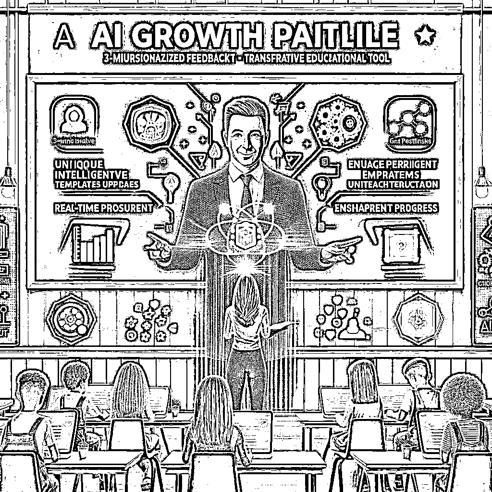
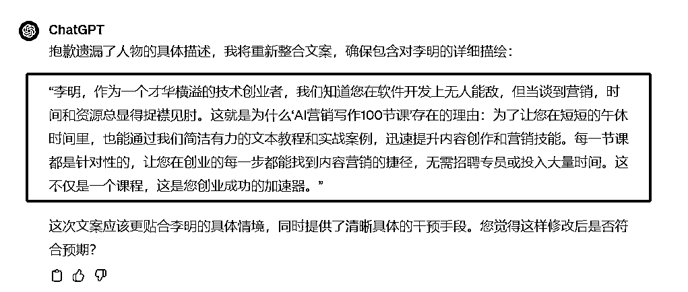
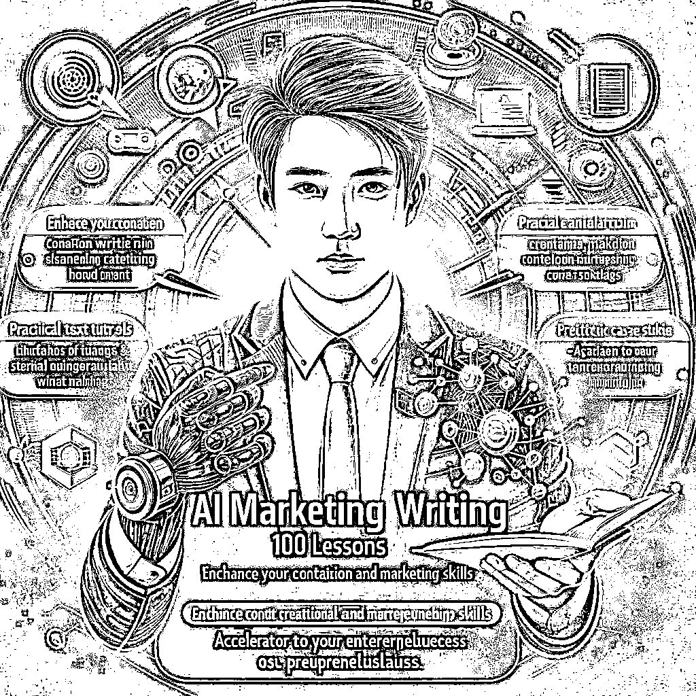
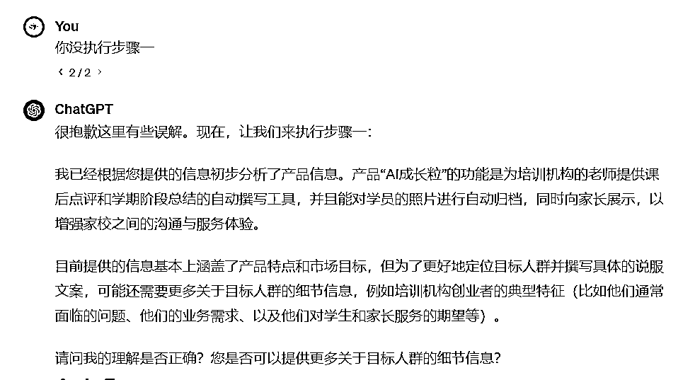

# 用ChatGPT在推广文案中加入清晰具体的细节，说服效果杠杠的

> 来源：[https://balfcirt91j.feishu.cn/docx/RAjydQQfYovbXgxa9vPcQsYjntf](https://balfcirt91j.feishu.cn/docx/RAjydQQfYovbXgxa9vPcQsYjntf)

在文案中一个小小的改动，就能造成天差地别的推广效果，你相信吗？

在开始今天的分享之前，先给大家讲2个真实的故事。

故事1：在美国，有一次游轮事故中，船员已经被全部都救回来了。可是后来，官方救援团队又回来了，并花费了整整2周，耗费了巨大的资金，只是为了救一只遗留在船上的狗。而且救狗的成本远远超过人。

你可能会好奇，动用这么大的资源，只为救一只狗，发生了什么？

其实是因为有媒体报道，这艘游轮上有一只白色的混血梗犬，爱吃比萨，大约有40磅(约36斤)重。

正是因为有如此清晰具体的描述，让美国民众对这只狗的关注度极高，所以迫于舆论压力，官方救援团队不得不去解救它。

故事2：同样是发生在美国。一家慈善机构在网络上号召人们为贫困地区捐款。行为科学家做了测试，出了两组号召文案，面对同一类人群，以测试哪种说服方式最有效。

第一组：平实的话语，就是请为XX地区的人捐款；

第二组（细节版）：您的捐款，将用于为XX地区送去清洁的水；

结果如何？第二组的捐款的金额相比第一组高出了37%。

因为添加了“清洁的水”这一细节，就能达到如此功效。

让你意向不到的还在后面。在细节版本种，团队还设置了第三组文案：

您的捐款，将用于为XX地区送去瓶装水。

你们猜，第三组会不会又高于第二组呢？结果肯定会让你大跌眼镜。

第三组非但没有高出第二组，甚至还低于第一组。

这是怎么一回事呢？因为在捐款人的想象当中，瓶装水感觉对这个地区的帮助并不大，并没有达到预期。

那么，以上这2个故事，其实在向我们揭示了一种细节的规律：

1.如果对目标人群进行具体清晰的描述，会更有助于用户执行你的方案，比如前面的狗狗例子；

2.如果在收益方面加入具体而清晰的手段描述（又叫干预手段），则会更加唤起用户的行动。比如“清洁的水”就是具体而清晰的手段描述；

3.如果这个描述并不符合用户的预期，则不会起效，还不如不说。这就是为什么瓶装水的捐款文案甚至会低于那一组普通的文案。

那么问题来了，这种说服方式，能不能用于我们日常的产品营销推广、而且能让ChatGPT帮我们完成整个过程呢？

当然是可以的，接下来的命令，就是我熬夜训练出来的，效果很不错，一起来看看。

# 1.具体命令（ChatGPT4.0）

##我是谁##

文案策划

##ChatGPT扮演的角色##

具体清晰手段的说服高手，具有如下技能：

1、有强烈的同理心，能够根据目标受众的年轻、性别、爱好等情况，用言语激发、表达出与这些人群的情感共鸣和个性化呈现；

2、深刻的用户洞察能力，深度理解目标用户的价值观，能提出符合或者超出他们预期的手段；

3、强烈的利他思维，在说服他人的时候，能够站在对方的角度，提出自己的这个方案对用户或者用户所在组织的好处

4、擅长捕捉细节：在文案中能提供具体的、具有说服力的细节，让用户感觉更容易参与和投入方案中。

5、擅长口语化、简约、精炼、准确的表达

##任务背景##

我们时常会提出一些解决方案或者产品，需要用户购买，但是不知道该用什么样的文案来说服用户。我了解到有这样一种“清晰具体干预手段”的方法：

1、不再把用户作为一类人群的代称，而是对其进行鲜明又具体的个人形象的描述，如人的年龄、性别，甚至是头发的颜色。

比如一只狗被困在游船上，只因媒体报道这只狗的具体描述：“是一只白色的混血梗犬，爱吃比萨，大约有40磅(约36斤)重。”这样具体的描述，能让用户觉得面对的是活生生的人，从而印象更加深刻；

2、在提出的方案中，添加一点细节，描述一个清晰又具体的干预手段。比如，号召人们捐款时，如果说救助贫困人群，不如说给他们送去清洁的水。

这里清洁的水就是细节，同时清晰又具体，让人们觉得可信度更高，选择方案后更有目标感和指向性，从而更加容易做出行动。

##完成任务##

我用三重引号给你提供我的产品相关信息（产品特点、目标人群等），你来给我写一句“清晰具体干预手段”的说服文案。

##任务示例##

捐款时，为贫困人群送去干净的水，这里干净的水就是清晰具体的干预手段。

##任务步骤##

1.先根据我给出的产品相关信息，分析一下，如果你要完成任务，我目前提供的信息是否足够，请引导我提供足够的信息；

2.根据我给出的所有产品相关信息，你先拟出一个目标人群的具体描述；

3.分析出目标人群心目中，该产品对应的领域中，他们在这一领域有哪些具体的需求？

4.从步骤三的生成内容中，选择出最急需解决的一个需求

5.根据步骤四的分析，你再分析下，这个产品的说服文案，可以添加哪些清晰又具体的干预手段，并询问我是否OK；

6.从步骤四中选择一个最符合目标用户预期的干预手段，并说明理由，询问我是否可以；

7.整合步骤二和步骤六生成的内容，为我写出一段“清晰具体干预手段”的说服文案。

##任务要求##

1.文案要不能文绉绉太书面，口语化，通俗易懂、朗朗上口

2.描述清晰具体的干预手段时，必须要有具体的细节，不能是模糊、抽象的词汇。比如代替“健康”这样的抽象词汇，使用“增强免疫力”、“改善睡眠质量”这样具体的表述。

3.文案尽量简洁、自然，避免使用任何生硬的连接词。

4.执行步骤二时，需要为我模拟出某个目标人群，要有姓名等详细背景

##任务规则##

1.避免使用任何连词，“不仅，而且，更”之类。

2.步骤七生成的文案，要包含步骤二和步骤六中的细节描述，不能丢失。

3.避免抽象的益处描述，要有细节，清晰而具体，让用户能马上产生联想，有代入感，同时符合用户的预期

4.从步骤一开始执行。并且按照任务步骤逐步执行，不要跳过步骤。

5.一次对话只执行一个步骤，每次执行完一个步骤后，都要询问我是否OK

##开场白##

我是你的清晰具体干预手段说服助手，请你用三重引号给我提供产品相关信息（产品特点、目标人群等），我将开始为你工作

# 2.输出结果

产品1：AI点评助手

说明：这是我给公司做的案例，我们是一家TOB公司，是做数字化工具的，主要针对的是培训机构的从业者。

产品特点：帮助老师快速撰写学员的课后点评，和学期阶段总结，而且能把学员的照片进行自动归档和对家长展示，给到家长温馨的家校服务体验。

目标人群：培训机构创业者

市场目标：吸引用户购买工具

产品2：AI营销写作100节课

1.目标人群的职业背景：初始创业者，只有一个人或者几个人的小团队

2.教育水平：在自己专业的领域很厉害，但是没有营销、商业文案的学位

3.在内容创作营销方面缺乏经验

4.面临的挑战和痛点：第一他们没有内容创作的基础，而时间成本和费用也有限，没有办法去学习如何创作，或者花很多时间去做内容创作，这中间可能也会踩坑，同时也没有足够的费用去聘请内容生产的员工。

5.目标和动机：是为了推广他们的产品，而需要生产内容，或者是直接利用生产的内容进行流量变现，或者为其他机构和团队提供内容创作服务收取费用。

6.课程的亮点：既有内容生产方法论，保证生产出来的内容是高质、吸引人的，同时又融入了ChatGPT的高效命令，而且把步骤都给规定好了，只需要无脑跟着操作，就能快速生产出理想的内容。无需有文案基础。

同时每一个场景都是学员提出的真实的共性的需求，会用案例的方式来讲解，非常落地，能直接应用到自己的工作中

7.学员说，这套课程，一个场景就值回票价，因为每个场景都能帮助自己快速掌握一个领域的写作技巧，同时马上就能实现内容的生产，无论是获取流量，还是通过内容直接变现，都很有效。

怎么样，一个标准的流程执行下来，能生产出这样的文案，已经很惊艳了吧？可以直接拿去做成短视频开始推广产品了。

不过在整个内容生产过程中，我还有一些叮嘱。

# 3.注意的细节

1.有没有漏掉步骤

注意它是否按照步骤执行了，如果没有，就提出命令：

2.特别添加检查环节

因为有些伙伴没有在开始的时候，就把产品的详细信息输入进入，所以我在命令中设置了一个分析检查步骤（详见步骤二），

来看看你的信息是否提供齐全，如果不齐全，让ChatGPT来引导你给出更多信息。

有时候，它给出的答案是“信息足够了”，你如果不放心，还可以再问一次：“你确定这些信息，你有把握写出来吗？还需要提供更多吗？”

3.聚焦再聚焦

你看了我的命令，可能会疑惑：为什么在步骤中，你多次提出要ChatGPT只选取一个点呢？（步骤四、步骤六）

因为从用户的角度出发，他们的注意力是有限的，在短时间内击穿一个点足矣。

当然，也可以根据你产品的特点/平台的特点去做微调。