# 个税APP申报指南以及二次退税（3年之内的都可以）

> 来源：[https://dvynhp7ntg.feishu.cn/docx/RPCWdsyfvoTcNOxKZMScLYKqnEb](https://dvynhp7ntg.feishu.cn/docx/RPCWdsyfvoTcNOxKZMScLYKqnEb)

# 个税发展史

1980年，开征个人所得税 800元/月起征

1994年，第一轮改革

1999年，第二轮改革 ： 储蓄存款利息征收20%个税

2006年，第三轮改革 ：免征额度提高到1600元/月

2007年，第四轮改革 ：储蓄利息税停止征收

2008年，第五轮改革：免征额度提高到2000元/月

2011年，第六轮改革：免征额度提高到3500元/月

2014年，第七轮改革：企业年金，职业年金不缴纳个税

2018年，第八轮改革：免征额度提高到5000元/月，增加6项专项附加扣除项目（2019年1月1日执行）

# 什么是汇算清缴？

根据《个人所得税法》第二条和第十一条，居民个人取得工资薪金所得、劳务报酬所得、稿酬所得、特许权使用费所得(以下称综合所得)，按年计算个人所得税;有扣缴义务人的，由扣缴义务人按月或者按次预扣预缴税款;需要办理汇算清缴的，应当在取得所得的次年三月一日至六月三十日内办理汇算清缴。

为什么要做年度 汇算清缴？

我们到底要交多少个人所得税？

所有的收入都需要交税吗？哪些不需要交税？

到底是要退税？还是要补税？

汇算应补（退）税额计算

=[（综合所得收入额- 60000 免征额-专项扣除 -专项附加扣除-依法确定的其他扣除-符合条件的公益慈善事业捐款）×适用税率-速算扣除数]-已缴税额

综合所得: 4部分：工资薪金所得、劳务报酬所得、稿酬所得、特许权使用费所得

哪些不需要交税？

综合所得扣除项目：（这些不需要交税）

1、免征额 5000×12=60000

2、专项扣除：三险一金个人缴费部分

3、专项附加扣除 ：7个项目：0-3岁婴幼儿照护，子女教育，继续教育，大病医疗，住房贷款，住房租金，赡养老人

4、依法确定的其他扣除：个人养老金，企业奖金，职业年金，商业健康保险，税收递延型商业养老保险，其他

5、慈善事业捐款

# 怎么查询个人所得税税率

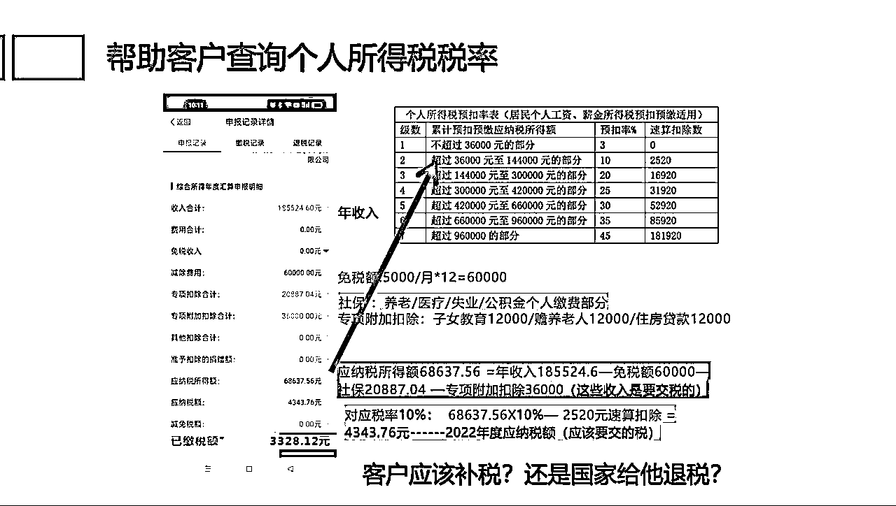

# 查询专项扣除是否有遗漏申报

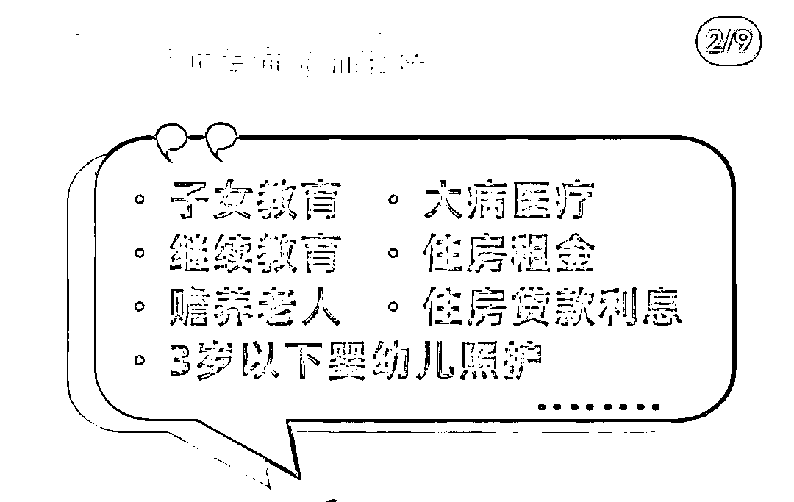

## 1、子女教育 （3岁以上）

12000/年/个孩子（2023年开始 24000/年/个孩子）

境外学历教育也可以申报

父母（法定监护）各50% 扣除 或者 选择单独一方100%扣除

## 2、3岁以下婴幼儿照护

12000/年/个孩子（2023年开始 24000/年/个孩子）

2022年度开始可以申报（2019，2020，2021年度还没有这项目）

父母（法定监护）各50% 扣除 或者 选择单独一方100%扣除

## 3、赡养父母 （父或母60岁（含）以上）

独生子女 ，24000/年（2023年开始 36000/年）

非独生子女：合计24000/年，平均分摊，约定分摊或者指定分摊，每人不能超过12000/年（兄弟姐妹们商量好即可）

（2023年开始 每人不超过18000/年）

## 4、继续教育

境内学历教育：400/月（4800/年）最长不超过4年

本人接受本科(含）以下学历继续教育，可以选择 其父母扣除

职业资格教育：取得证书的年度，3600/年

一年中，职业资格教育和学历教育最多申报各1个

## 5、住房贷款利息

首套住房贷款利息期内 12000/年

未婚购买首套贷款：本人100%扣除,或者婚后选择其配偶100%扣除

婚前各自购买首套贷款：婚后各自分别50%扣除，或者 选择一套房由购买方100%扣除

婚后购买首套贷款：选择一方100%扣除，不能各自50%扣除

贷款期间内，最长240个月，只能申报一套（2019年申报的房子，卖掉了，重新贷款，哪怕符合首套贷款条件也不可以了）

## 6、大病医疗

扣除医保报销后个人负担累计超过15000元的部分

最高上限不超过80000元

个人负担：医保目录范围内的自付部分（自费不算）

（有抚养关系的，配偶，子女，父母不算 ）

本人的医药费用 本人或者配偶扣除，未成年子女医药费用父母其中一方扣除，夫妻同时有医疗支出，

可以选择在一方扣除，每人最高扣除限额 8万元。

## 7、住房租金

直辖市，省会城市等 1500/月（18000/年）

其他城市，户籍人数100万以上 1100/月（13200/年）

其他城市，户籍人数100万以下 800/月 （9600/年）

在主要工作城市，没有自有住房的纳税人发生的住房租金的支出

纳税人未婚，本人扣除

纳税人已婚，夫妻双方主要工作城市相同，由承租方100%扣除

纳税人已婚，夫妻双方主要工作城市不同，分别扣除

纳税人及配偶在一个纳税年度内不能同时分别享受住房贷款利息和住房租金专项附加扣除

# 个税专项扣除容易出错的地方

专项附加扣除合计 的数值和实际申报的项目理论值相加是否一致？

1、子女教育：

1.1 学前教育和义务教育的衔接

举例1 ：检查发现客户2020年度 个人专项附加扣除合计是 40000 ，分别是：赡养父母24000 ，房子贷款 12000 ，子女教育只有 4000 ，

什么原因？

客户只填报了 孩子小学教育 开始时间2020-09月，所以只有9、10、11、12 4个月的4000元

如何改进：补上 2020-01--2020-08 月的 学前教育

1.2 孩子2018-8月出生，2021-8 满3周岁，父母没有申报2021年度的 子女教育

如何改进： 补上2021-08---2021-12 的学前教育，可以多抵扣 5000元

2\. 房贷申报：

这不是我第一套贷款的房子了，所以不可以申报（这个主要看当地对首套房的定义）

3\. 房屋租金：

已婚夫妇双方主要工作城市不同，没有自有住房的，可以分别申请房租扣除（不能和房贷同时扣除）

满足1.8万/年 租房申报的，但是申报了房贷（1.2万/年），没有申报房租

房租没有申报1整年12个月的

4\. 赡养老人：

多子女情况（3个及3个以上），一个子女可以最多申报12000/年（可以不平均）

哥哥申报了父母赡养，弟弟或者妹妹就没有申报了（弟弟，妹妹也可以申报的！！）

父母中任何一个人年满60周岁，就可以申报，不需要一整年

5\. 继续教育：

忘记申报（学历教育4年，技能教育获得证书的当年）

6\. 每一年的专项附加扣除项目 都需要填写，房贷，房租每年都需要重新填写的

7\. 一整年的漏申报（比如检查发现2020年没有申报记录）如果是要补税的，还会产生滞纳金，有一天算一天

8\. 夫妻双方，收入高的（税率高的）没有申报子女教育，婴儿照护，房贷或者房租，反而是收入低的申报了，或者各自50%申报了

9\. 年终奖 单独计税 还是 全部并入综合所得计税 ？

# 2023年度专项附加扣除标准调整：

0-3岁婴幼儿 2000/月 子女教育 2000/月 赡养父母 3000/月

假设 纳税人，独生子女，2023年度，个人所得税税率30%，父母超过60周岁，有一个2岁的孩子和一个8岁的孩子，请问当年的专项附加扣除合计多少？

36000+24000+24000=84000

可以退税多少？

84000*30%=25200

相比2022年度，可以多退税多少？

（12000+12000+12000）*30%=10800

# 个税申报Tips：

## 1、夫妻双方收入高的（个税比例高）的可以100%申报 ：

婴幼儿照护/子女教育/房贷/房租

举个例子：

丈夫 ：个税税率 45%，妻子：个税税率 10%

共同抚育一个孩子，5岁，婚前各自有房贷

如果夫妻双方各自50%申报

丈夫退税：（6000+6000）*45%=5400

妻子退税：（6000+6000）*10%=1200合计：6600

如果丈夫单独100%申报

丈夫退税 （12000+12000）*45%=10800

两种方式相差： 10800-6600=4200元！！！

## 2、大城市：可以申报房租的尽量申报房租

房租的申报：18000/年

房贷的申报：12000/年

举个例子：

个税是45%

两者相差 （18000-12000）*45%=2700

注意：纳税人及配偶在一个纳税年度内不能同时分别享受住房贷款利息和住房租金专项附加扣除

租房个人专项申报需要提供的资料：

租房的详细地址（精确到门牌号）--必填

其他信息选填

如果在主要工作城市有自有住房，不可以申报房租

举个例子：如果我在上海有房子，我被外派到北京工作并租房，可以申报北京租房

如果我在上海有房子，我在上海还有租房，不可以申报上海的租房

# 如果发现有遗漏申报如何补救？

## 假设发现2020年度漏申报了父母赡养

第一步：个税APP--我要办税--专项附加扣除填报---赡养老人--选择扣除年度2020年---选择独生/非独生子女---选择分摊方式--选择综合所得年度自行申报--提交

第二步：我要查询--申报查询---已完成--2020年度汇算---更正（拉倒最后）--更正年度自行申报---下一步--专项附加扣除再检查一下赡养父母是否已经添加---下一步--继续---下一步--完成

第三步：如何检查：2020年度汇算---退税记录---看是否有最新日期的退税信息

最简单的办法：请我喝一杯咖啡，我来帮你搞定，专业的事情交给专业人来办！！

## 假设发现2019年度漏申报了父母赡养，还可以申报吗？

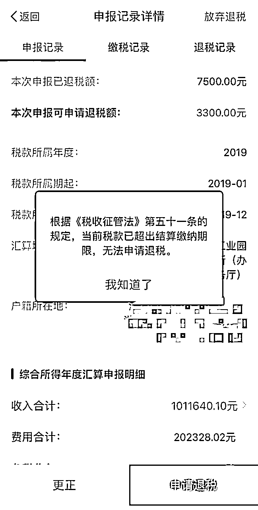

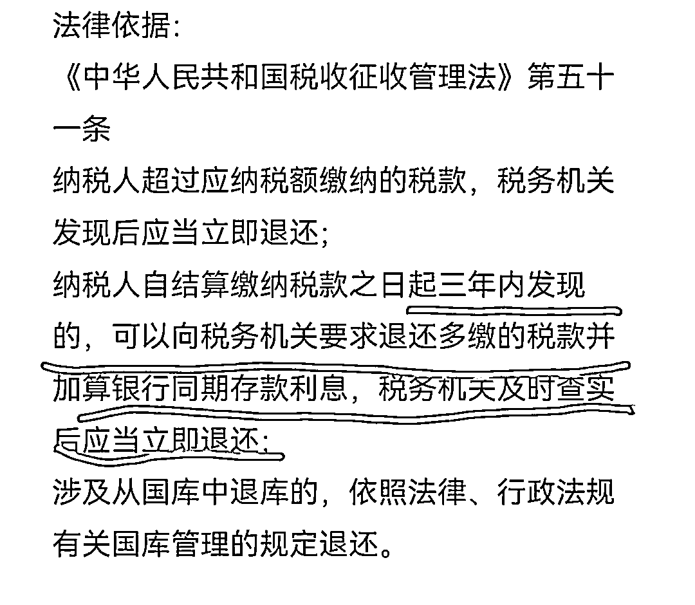

# 如果发现申报有错误如何补救？

## 假设发现2020年度子女教育只申报了4个月

第一步：个税APP--我要办税--专项附加扣除修改和作废---子女教育--选择扣除年度2020年---修改---修改教育信息--当前教育开始时间--改成2020-01月---确认修改---提交（把2020-1月到8月的添加上去）

第二步：我要查询--申报查询---已完成--2020年度汇算---更正（拉倒最后）--更正年度自行申报---下一步--专项附加扣除再检查一下子女教育是不是变成12000元---下一步--继续---下一步--完成

第三步：如何检查：2020年度汇算---退税记录---看是否有最新日期的退税信息

## 夫妻双方更正申报比例

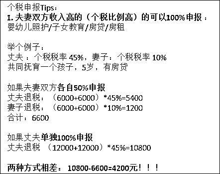

这个案例的补救：夫妻双方重新申报

妻子更正取消房贷，子女教育申报，补税：1200元

丈夫100% 比例申报房贷，子女教育，退税：5400元

把4200元补救回来

操作步骤：

妻子：

第一步：我要办税--专项扣除填报--填报记录--选择对应年份如2021年---子女教育---作废

第二步：我要查询--申报查询--已完成--2021年度综合所得年度汇算---更正--检查是否已经没有了子女教育扣除项（6000元）-- 下一步--继续---下一步--完成

（需要补税600，同理房贷也同样操作，合计需要补税 1200元，可能会有滞纳金（利息）

丈夫：

第一步：我要办税--专项扣除填报--填报记录--选择对应年份如2021年---子女教育--修改--修改设置扣除比例--提交

第二步：我要查询--申报查询--已完成--2021年度综合所得年度汇算---更正--检查是否子女教育变成了12000元-- 下一步--继续---下一步--完成

（可以退税2700元，同理房贷也同样操作，合计需要退税 5400元）

合计节约：5400-1200=4200元！

## 如果发现一整年没有申报如何补救？

假设发现客户2020年度一整年没有申报！

第一步：我要办税--专项附加扣除填报--选择2020年度--选择填报相应的扣除项目（如赡养父母）

第二步： 我要办税---综合所得年度汇算---选择2020年—按照提示操作（注意专项附加扣除的数值是否正确）

# 年终奖计税方式选择

## 全年一次性奖金计税方式选择

1、有两种选择方式，通常情况下选择单独计税比全部并入综合所得计税 要划算

2、 建议两种方式都选择，试算一下，不要提交，哪一个划算，就选哪一个提交

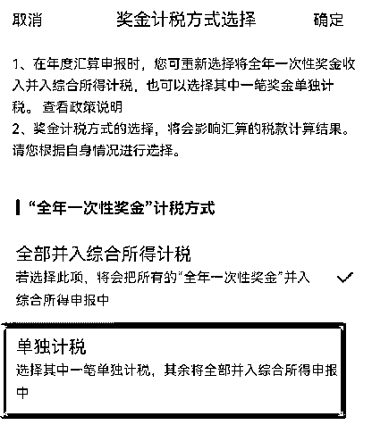

2023年8月28号 财政部，国家税务总局公布《关于延续实施全年一次性奖金个人所得税政策的公告》

一次性奖金（年终奖）单独计税延长到2027年12月31日

## 如何查看已经完成申报的年份是否按照单独计税申报的？

我要查询--申报查询---已完成--2019年度综合所得汇算---更正（拉倒最后）--更正年度自行申报---下一步--工资薪金---奖金计税方式选择---查看是不是单独计税

## 单独计税 还是 全部并入综合所得计税 ？

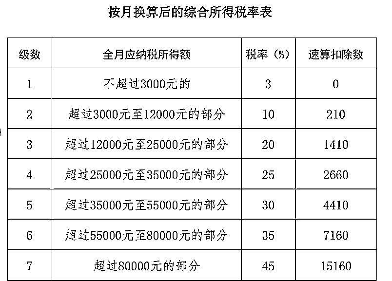

### 全年工资高于年终奖（大多数情况）

举个例子： 应纳税所得额 15万，年终奖 3万

如果全部并入综合所得计税

应纳税所得额 :

15万+3万=18万 税率 20%

应纳税

18万20%-16920=19080

如果 单独计税

年终奖税率 3%

年终奖应纳税

3万*3%=900

全年工资 应纳税所得额 15万

全年工资 应纳税额 15万*20%-16920=13080

合计应纳税 900+13080=13980

两者相差 19080-13980=5100元！ 这种情况 单独计税划算

### 年终奖高于全年工资（少数情况）

举个例子：应纳税所得额 3万，年终奖 27万

如果全部并入综合所得计税

应纳税所得额 : 3万+27万=30万 税率 20%

应纳税

30万*20%-16920=43020

如果 单独计税

税率 20%

年终奖应纳税

27万*20%-1410=52590

全年工资 应纳税所得额 3万

全年工资 应纳税额 3万*3%-0=900

合计应纳税 52590+900=53490

两者相差 43020-53490=-10470 元！这种情况 综合所得计税划算

# 慈善捐款如何申报？

我要办税--综合所得税年度汇算--2022年度--标准申报--准予扣除捐款额---新增---按照步骤进行填写详细的捐款支出信息---提交

以年终奖金36001为例，在没有任何筹划的情况下，选择单独计税方式申报，应该交多少税？

个人所得税税率为10%（按照上面的图表，按月换算后的综合所得税税率表）

应纳税额3390.1元（36001*10%-210) 全年一次性奖金收入*使用税率-速算扣除数

如果捐赠1元，会变成什么样？

则抵扣后实际应缴税部分的年终奖为36000元，此时税率则为3%

个人所得税为1080元。(36000*3%)

可以看出，捐赠1元后，到手收入反而增加了2309.1元(3390.1-1080-1)

如果想使用上述方法进行全年一次性奖金的税收筹划，那么捐赠要发生在年终奖发放当月

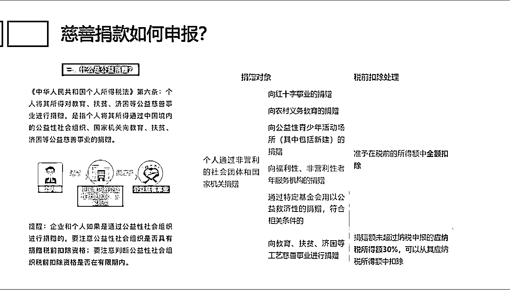

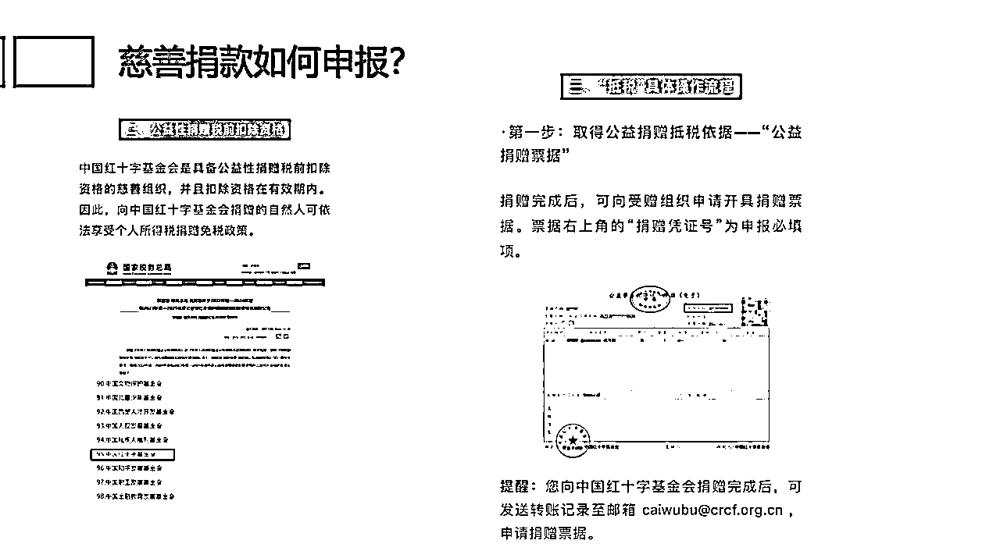

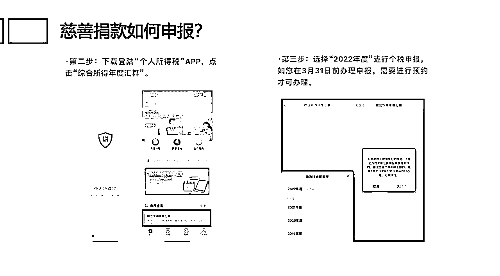

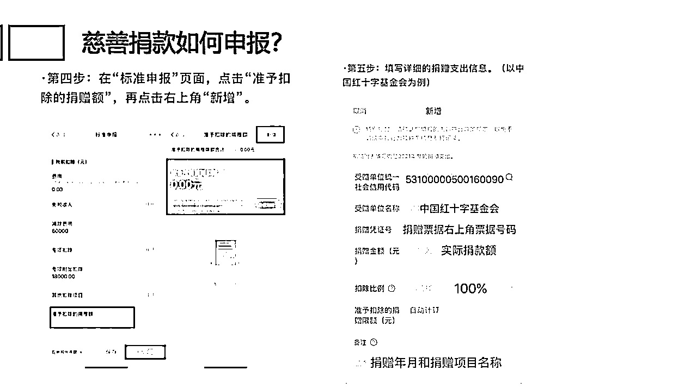

# 个人养老金税优

2019年税延养老保险

2022年个人养老金

共用12000 免税额

税延养老保险，个人养老金 查询通道：其他扣除合计

税延养老保险领取时的个税：25%免税，75%按照10%税率征税，记入工资薪金所得（相当于7.5%）

个人养老金领取时的个税：统一按照 3%征收

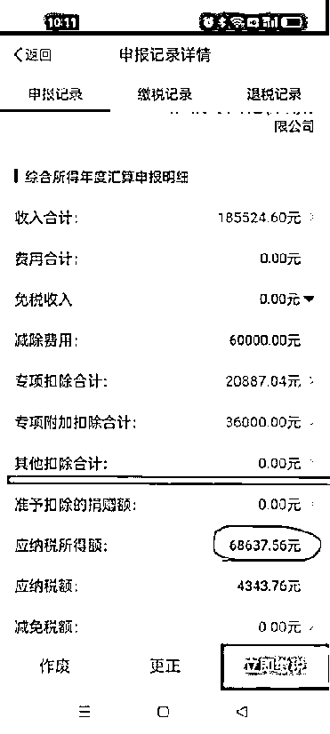

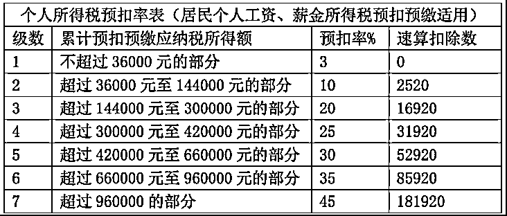

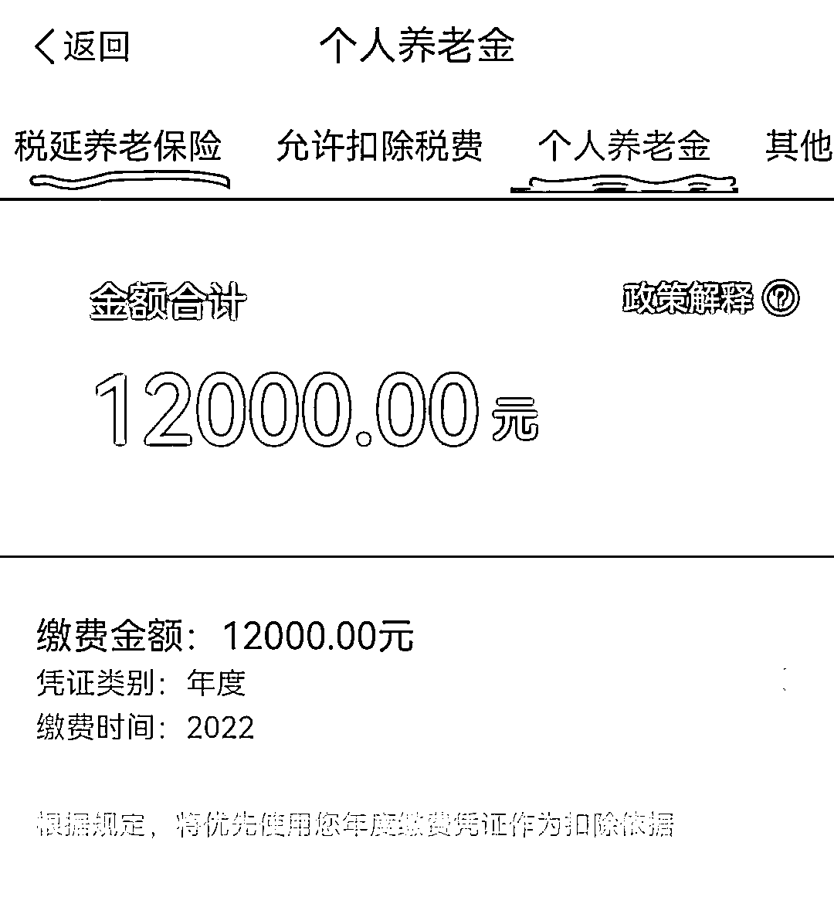

# 总结：我可以帮助你合理节税

交税是我们的义务，合理的税务筹划也是我们的权力

每一年都需要综合所得年度汇算

满足专项附加扣除项目的 都需要检查，填写，逐一填报，不要遗漏，申报错误

特别是变化的时候（如新生儿），夫妻双方申报比例的合理筹划

年终奖的申报方式，个人养老金的申报。。。。。。

这么多需要注意的，记不住怎么办？

最简单的办法：请我喝一杯咖啡，我来帮你搞定，专业的事情交给专业人来办！！！

