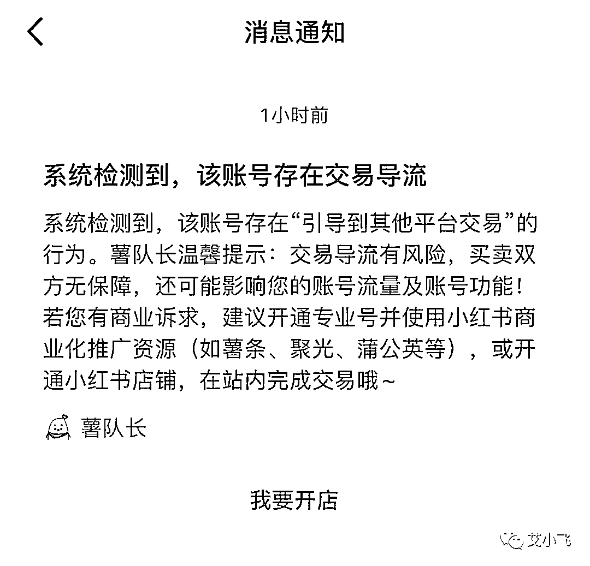
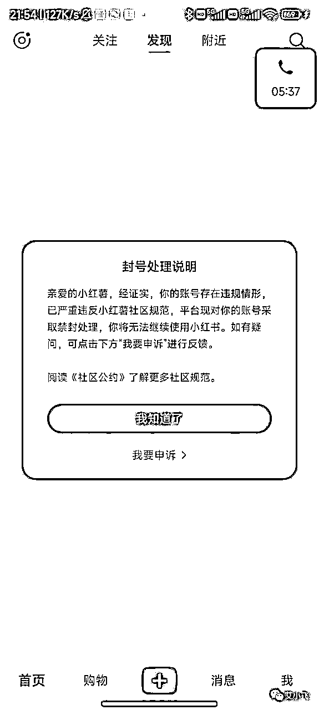
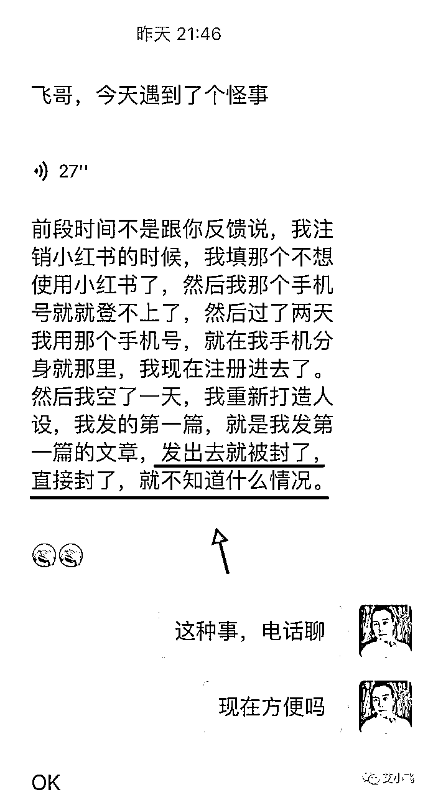
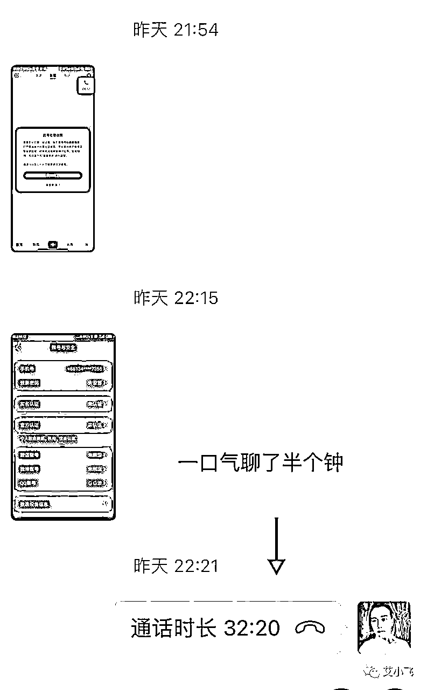
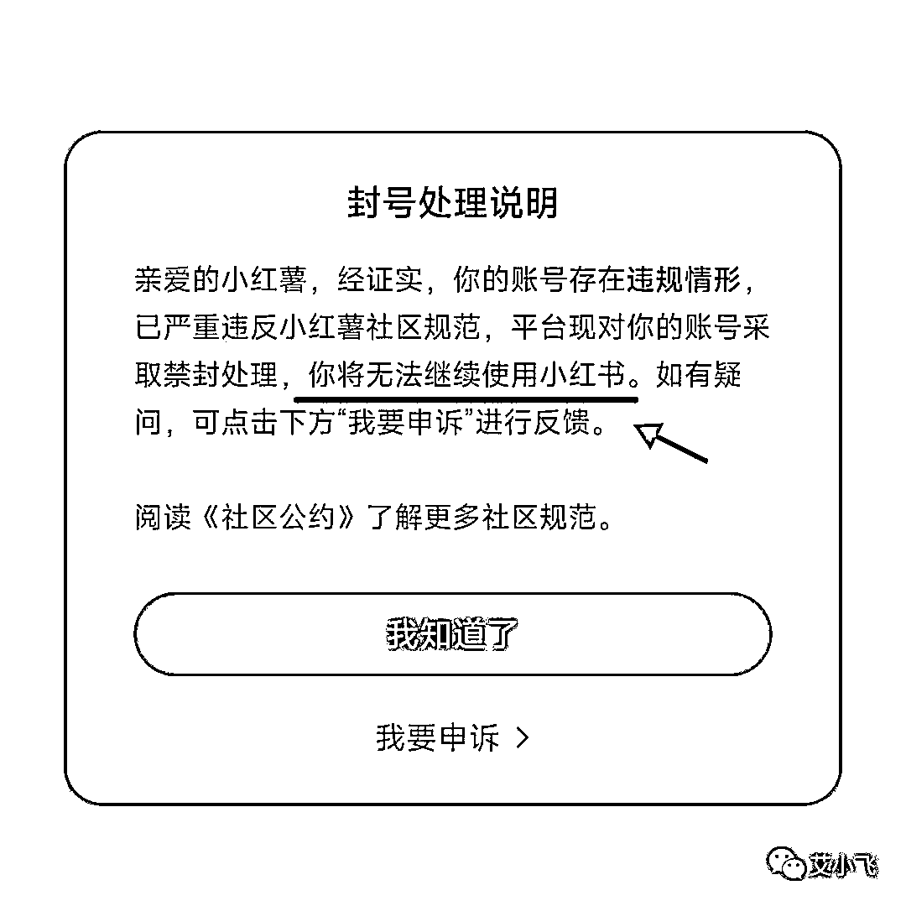
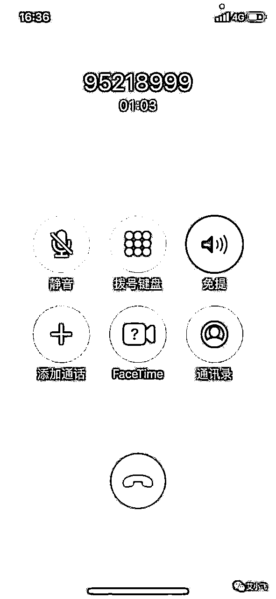

# 小红书封号的原因，90%人都不懂

> 来源：[https://nivut760ftk.feishu.cn/docx/Rezod4bIcoHJQnxRbYsc3JFZnIh](https://nivut760ftk.feishu.cn/docx/Rezod4bIcoHJQnxRbYsc3JFZnIh)

大家好，我叫艾小飞，擅长小红书引流

最近我在操盘小红书项目的时候，很明显的感觉到小红书对于引流这方面的打击越来越严了

哪怕你只做了一点点的引流动作，都有可能会收到来自系统的违规提醒

可以说是小红书下了决心要打击引流私域这方面的账号，稍有不注意，就会被限流

但今天我想聊的不是小红书引流的违规案例，而是说另外一个，也会导致你小红书账号被封的原因和案例，而且是90%概率被封，命中率很高

因为这个小细节可能很多人都没有意识到严重性，哪怕意识到了，也会带有一些侥幸心理，认为试一试应该没什么大问题

特别是刚刚接触小红书的新手来说，最为致命，还没开始发布就直接被封号了

那么这个被封的原因就是：一机登陆多号

说个真实案例，昨晚我徒弟来找我聊天，语音跟我说他遇到了一件怪事，无缘无故的账号就被封了

我当时正好有空，看到消息后马上跟他通了电话，看看是什么情况

当时他这个账号是没有任何引流行为的，刚想发布笔记出去，就被提示违规了，而且是永久封号

当时我也不确定是因为什么原因所导致，所以不好判断原因

然后在了解情况的过程中，发现他在这个手机上，同时登陆了两个小红书账号

而被封的这个账号，正好登陆在手机系统的“分身”软件上

说到这，我已经大概知道他被封的具体原因了

因为小红书平台是不允许开“外挂”的，而“分身”软件就类似于“外挂”

你用那个账号正常浏览笔记是没问题的，但只要是发布笔记了，系统就很敏感的识别到你账号有异常

第一时间马上把你的账号给强制退出登录了，不能再给你继续使用了，同时还给你发送违规的处罚提示，永久封号！

千万别小看这点，这个处罚结果是很严重的

所以通过这个真实案例，给你们意识到，最好要保持一机一号，不要去开分身来登录多个小红书账号

特别是安卓手机，哪怕是系统自带的也不行

要是遇到这种情况，该怎么解封小红书账号？

首先最好的办法就是先去打电话跟平台客服申诉

说明你并不是故意这么去犯的，你没有去使用什么开挂软件，也没有恶意的违反平台的规则，希望能给一次改过的机会....

因为这种有点属于系统“误判”了，是可以申诉的，只需要多去跟官方客服嘴皮子磨合一下就好了

要是你不会去申诉，也可以试用我徒弟的这个办法

就是用QQ号把手机号码给顶出来，这样你的手机号码就能释放了，相当于把风险转移到了QQ号上

但还能不能再用被封过的号码去注册小红书号，要看当时官方有没有把你的这个号码给标记为“异常号码”

要是标记有了，那你注册账号去发布笔记时，怎么发都是没流量的

要是没有，说明你的运气还不错，没有被平台进一步的加重处罚

所以通过这一个小小的案例，来提醒你们不要去犯这种很低级的错误

一机一号我是常说的口头禅了，可能很多人还是不以为然，觉得并没什么

当小红书账号被永久封号后，那时候想补救已经快来不及了

我是希望你们要保持一台手机，登陆一个账号，不要带着侥幸心理去试探小红书平台的底线，没用的，只会搬起石头砸自己的脚

其实小红书并没有你们想象中的那么难做，现在做小红书是很好做的，也很容易出单赚到钱，只需要学些基础的技巧或者找个老师来带你就好了

好了，今天的分享就到这里了，要是你们有遇到小红书账号被封的问题，可以在后台来找我聊聊

这个我叫艾小飞，我们明晚再见

原创：艾小飞

转载可私信

禁止搬运和抄袭