# 婚恋流量矩阵变现，学员四个月变现8w＋经验分享

> 来源：[https://p9z0j9usen.feishu.cn/docx/SakVdAbZGowVKVxHfspcrH9Jn3e](https://p9z0j9usen.feishu.cn/docx/SakVdAbZGowVKVxHfspcrH9Jn3e)

圈友们大家好，我是挽心。

这是我从事婚恋流量变现的第四年，也是我做自媒体创业的第一年，希望能真诚分享写一些有价值的文章结识更多圈友，实现破圈。

最近几个月，我带着学员进行了实操，沉淀了一些新的内容，在这里继续分享给大家，目前圈子里关于这一块的内容较少，但是婚恋板块又是一个流量很大需求很高的行业。所以，希望这篇文章能给想入局婚恋行业或者从事流量变现但又无从下手的圈友提供一些思路。

# 首先我们先来看一下近三个月取得的一些成绩

🎆抖音部分账号

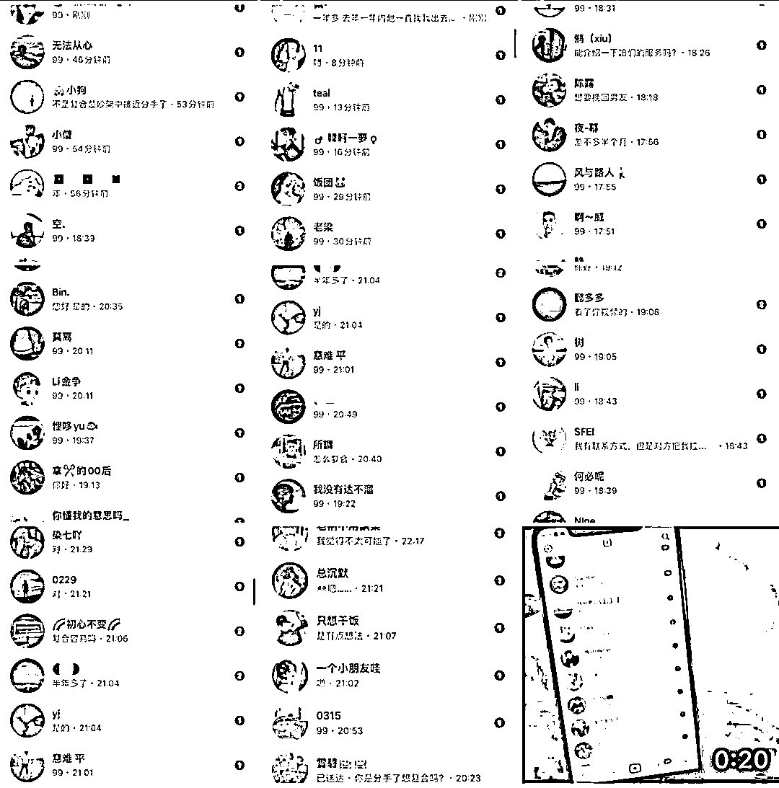

✨部分流量数据

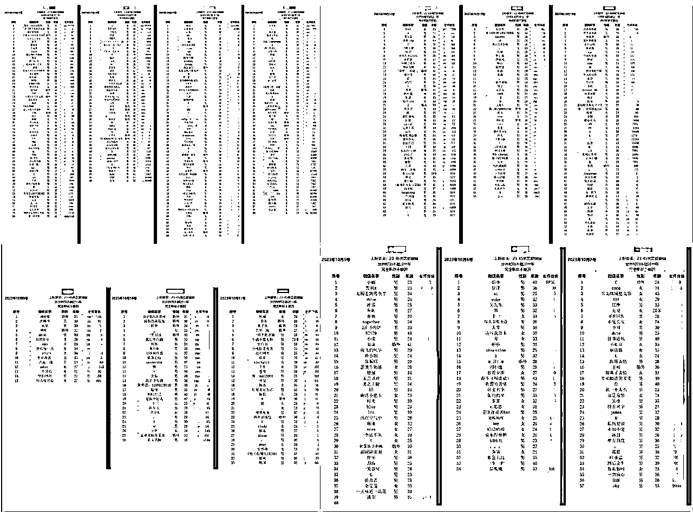

🧵部分佣金数据

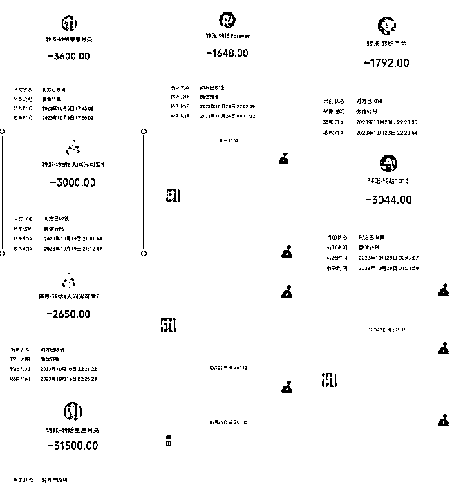

我们的几期的学员都是非本行业的从业人员，而情感流量重在流量变现，而非情感，所以不需要特别高的资质，上手起来也没有那么难，也有能够在短短的几个月中从应届毕业生转到自由工作者就能拿到这样的成果，所以说明这个项目还是可以拿到正反馈的。

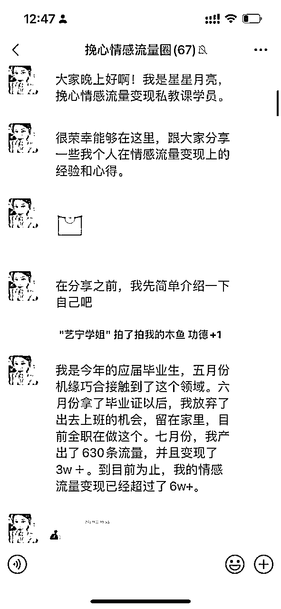

接下来我会从情感流量玩法选择，时间精力管理、账号运营，抖音作品制作、引流成交以及新人入局的门槛和建议这七个部分进行分享，全文内容较长，请大家移步飞书：

# 一、情感流量玩法选择

## 1、婚恋流量

情感流量是一个特别大的赛道，一说到情感流量大家可能会想到：文案馆、心理疗愈、女性成长、脱单教学，婚恋流量......大家在抖音上都情感相关的笔记会发现，情感流量的变现方式是特别多的，比如做文案馆吸粉做微信公众号流量主，心理疗愈做高客单价转化，女性成长卖课程做陪伴社群.....

每个细分领域都有不同的玩法，我们主要做情感流量的更下一级——婚恋流量。

婚恋市场的流量有多大，我可以给大家举个例子

单身时，有心仪的目标想要追求；

恋爱时，分手了不甘心想要挽回；

结婚后，面对另一半的两个人出现的一系列问题（出轨、离婚、分居）。

现在大环境的影响下，出现问题的人会越多，这个全年龄段都有需求的项目确实很少。

确定了有流量，我们就只需要考虑如何获客和变现了。

## 2、玩法选择

在之前的那篇文章中简单分享了婚恋流量的几种变现方式，今天在这里再做一个补充。目前挽心的玩法主要是通过将产出的流量对接给情感公司的形式变现，因为这种形式更加稳定，一单一结。

### 1） 个人IP：独立完成引流和转化

优势

*   定价自由：服务型付费咨询没有固定价格，允许自行定价，拥有较高的收入上限。

劣势

*   能力要求高：需要具备相应的能力和资质。

*   售后关键：必须提供优质的售后服务，否则容易遭遇投诉和举报。

### 2）流量变现

#### 2.1）流量出售：将产出的流量卖给情感公司

优势

*   售后无忧：无需处理售后问题，主要负责引流。

*   稳定收益：能够获得稳定的利润。

劣势

*   利润上限：无法获得流量后续转化的利润，整体盈利有上限。

*   稳定性要求：情感公司通常不与数量少或不稳定的个体合作。

*   合作风险：寻找稳定的情感公司伴随一定风险。

#### 2.2 深度合作：为情感公司免费增粉，按开单比例分成

优势

*   高利润潜力：有机会获得更高的利润，但不稳定，取决于引流粉丝的质量。

劣势

*   收入不稳定：与直接售卖流量相比，收入波动性更大。

# 二、个人时间管理

接下来想跟大家聊聊时间管理的问题，在加入圈子以后发现，很多圈友在家自己做项目，一人就是一家公司。

你是否想象过在没有老板监督的情况下工作？当我刚开始全职在家工作时，我也有同样的幻想——可以睡到自然醒，不用穿正式的衣服，没有固定的工作时间。初期，我沉浸在这种自由中，感觉自己终于摆脱了朝九晚六的枷锁。

但慢慢地，我开始注意到，当我把办公室搬回家时，工作和私生活的界限变得模糊。我在工作时间里洗衣服，吃饭时回复工作邮件，甚至在晚上和家人聊天时，脑海中仍想着白天未完成的任务。我的效率不知不觉中开始下降。问问自己：你有没有经历过相似的情况？工作和生活是否混为一谈？

当我意识到这些习惯开始影响我的工作质量和个人生活时，我知道我需要做出改变。我开始尝试各种时间管理技巧，并最终找到了适合我的方法。我制定了严格的工作时间表和日进程管理表，这不仅帮助我回到了正轨，而且还让我在工作日结束后真正享受到自由时间。

我在下面分享了月入2w＋的日进程管理表，你可以下载并尝试使用它来管理你的日常工作。同时，也想听听大家在这个过程中，是如何在家中平衡工作和生活的？你遇到了哪些挑战，又是如何克服它们的？

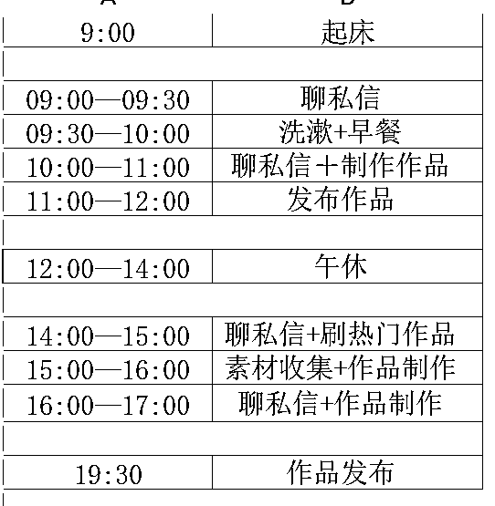

# 四、账号运营

## 1、养号

首先，在养号之前我们一定要明白，我们为什么要养号呢。养号的目的是啥呢？大家也可以想一想。

其实养号有好几个目标。

第一，我们要提高账号的权重，毕竟新号刚刚注册，需要积攒一些活跃度，让平台对我们的账号印象更深刻。

第二，平台要了解我们，只有通过我们的行为，它才会给我们的账号打上标签，知道我们喜欢什么内容，从而更好地推荐我们的内容。

第三，要模仿正常用户行为，这点很重要哦，让平台知道我们不是机器号，是真正的用户，避免被误判。

最后，要打标签，这就是把我们的账号分类，方便平台更精准地推荐我们的作品给合适的粉丝。

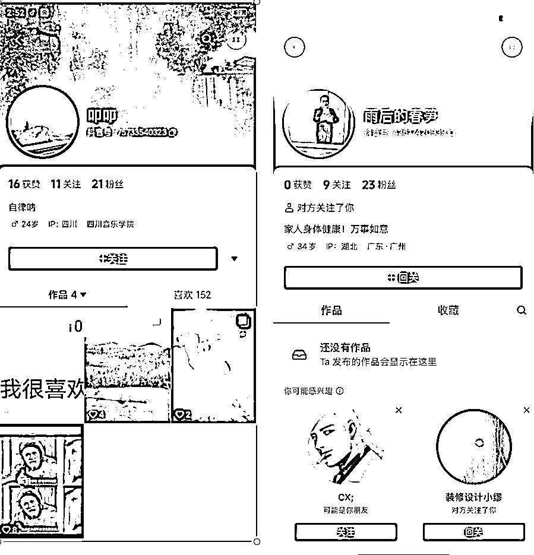

那我是怎么做的呢？首先，注册账号后，我会把自己的资料改成正常人的信息，伪装成一个普通用户。

接下来，我会去刷分手挽回话题下的视频，选择和我们的内容类型一致的视频进行互动。

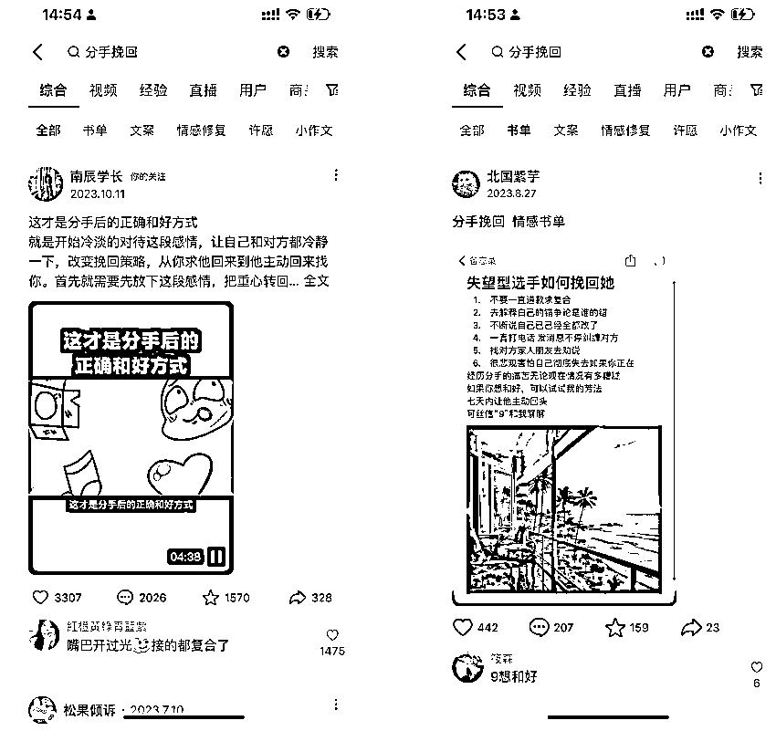

比如，我做图文，就会看图文，做口播，就会关注口播。

我也会把自己当成一个真正的用户去给这些内容的视频点赞、关注，评论，留言。这种钓鱼的行为可以让很多同行关注我们，从而提高我们账号的基础粉丝量，在粉丝达到150左右，我就会开始考虑发布作品了

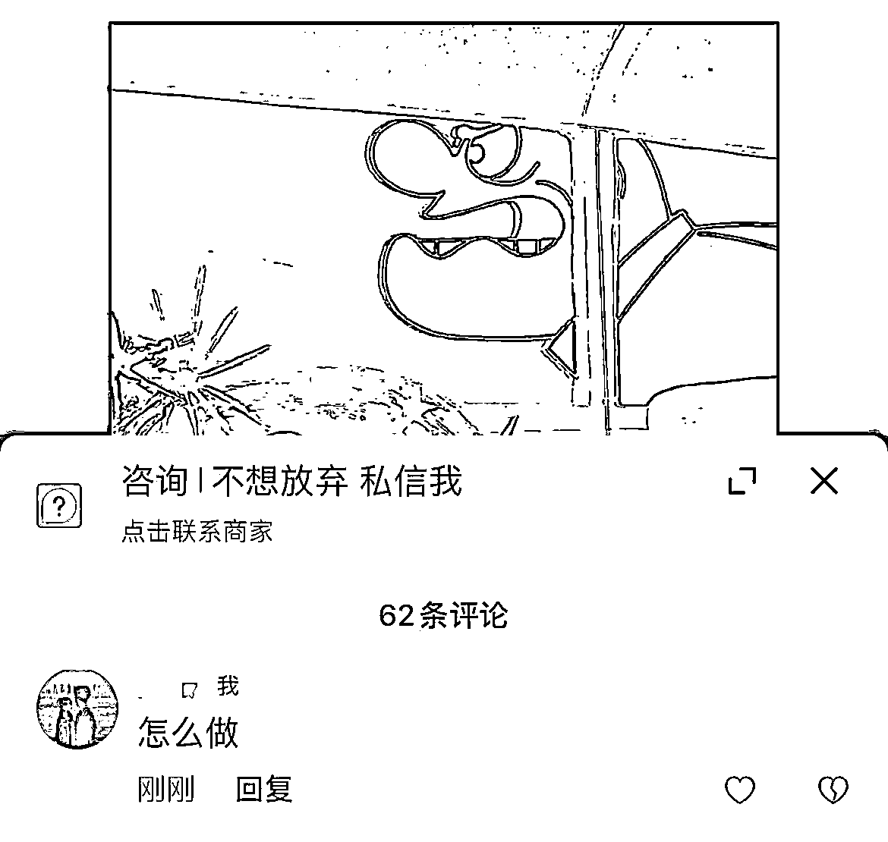

另外，我还有一个小技巧，就是养号的过程中，我会建立自己的素材库，收集最近热门的账号和素材，可以需要发作品是时给自己一些参考。

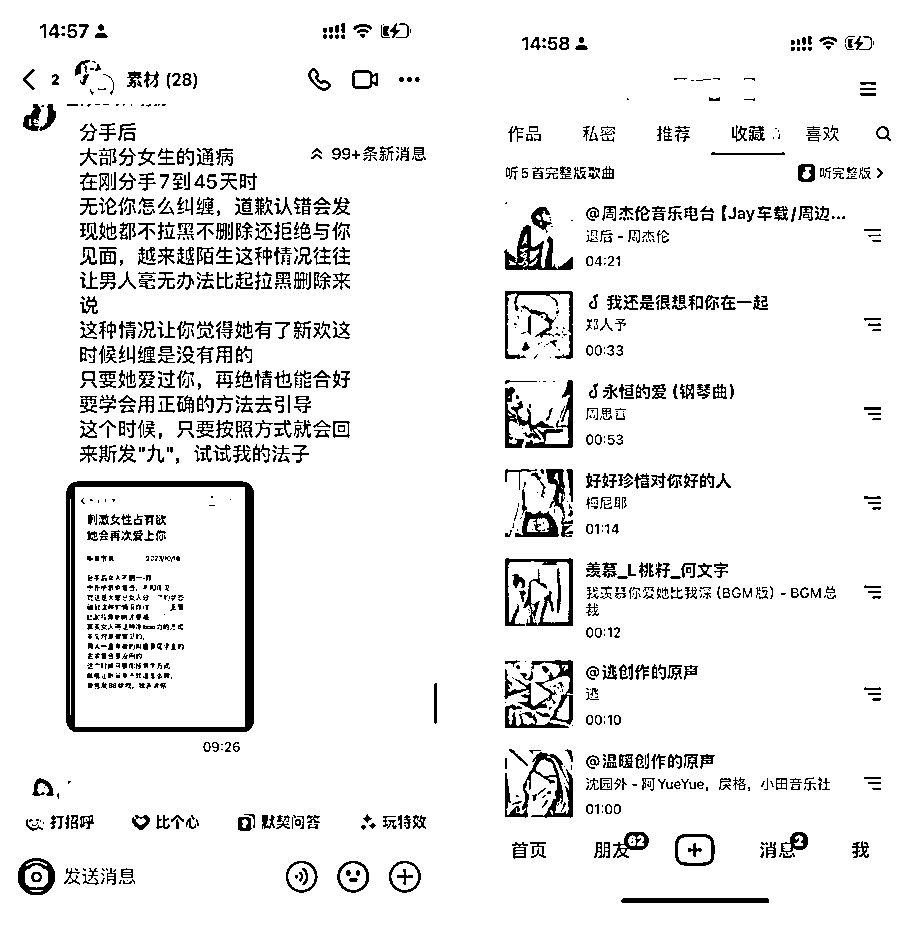

## 2.账号运营

因为我主要是通过图文产出，所以这次分享主要是以图文号为主。其实账号运营板块我们只需要注意着以下几点就可以了。

第一是，在开始账号运营之前，我们必须明确自己的定位，要知道自己想做什么类型的账号，是男女恋爱还是男女婚姻，这对后面的内容创作很重要。男恋爱好做，女恋爱难聊。

第二是我们应该选择什么样子的作品发布。我将账号内容大体分为三个类型，分别是鸡汤、半精准和精准。鸡汤是用来涨粉的，半精准是为了涨热度，而精准则是为了引流。我一开始会发鸡汤作品，增加粉丝数量，让账号活跃起来。然后，我会发布半精准作品，增加账号的热度，吸引更多的关注和互动。最后，我会发布精准作品，通过这些作品引流，实现变现。

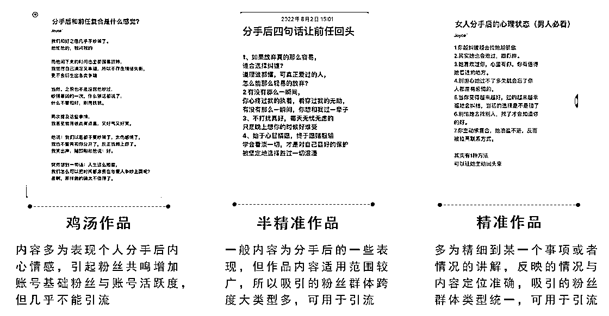

第三就是当我们流量出现异常值了怎么优化，我们每天的作品就是A文案+B音乐+C模板+D话题，如果不知道问题出在哪里，就不断地优化ABCD几个元素就可以了。

作品频率也很重要，我会每天早、中、晚各发一个作品，每个作品发两遍，两遍使用不同的音乐，一天六个作品。

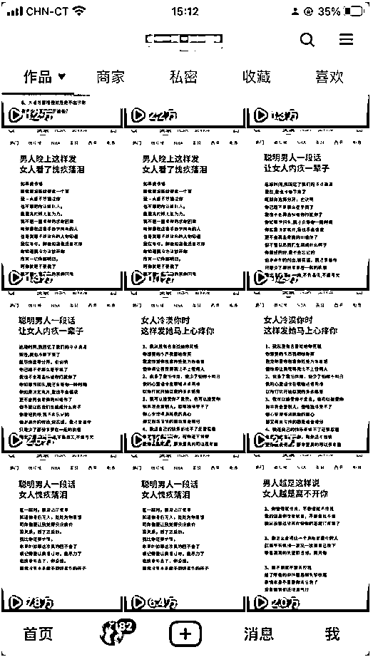

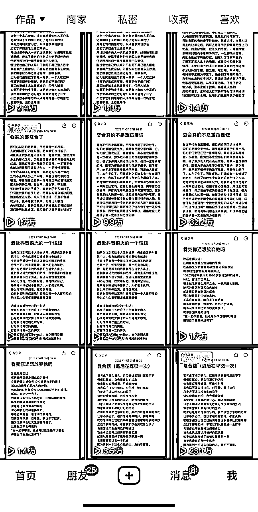

这些都是我在账号运营过程中的一些经验，希望对大家有所帮助。

# 五、抖音作品制作

#### 4.1.1）图文号

图文号定义：通过文字+图片的形式制作出来的短视频或图集的作品，实现蚓流效果。做这种类型账号对小白来说有明显的优势，整个制作过程非常简单，并且还可以批量复制，引流效果相较于很多账号来说也很可观，一般情况下基本都是粉丝主动来加你。

制作方法：将文案保存在备忘录，然后截图，在剪映生成视频（酌情添加背景图）

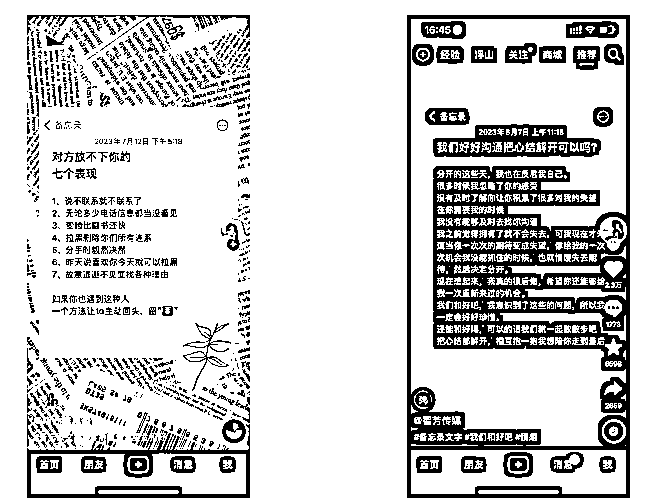

#### 4.1.2）书单号

书单号定义：就是一张背景图，背景图还是不动的，再加一段文字，以及一段背景音乐，就组成了一个视频。还有一种玩法就是视频书单，会动的背景图加上文案。

制作方法：以剪映为例。打开剪映插入一张背景（如果没有喜欢的模板，也可以直接⽹上找图，然后点击导⼊图片）-点击⽴即使⽤。点击⽂本框-填写相对应的⽂字，最后点击保存即可。视频时长7-10秒。

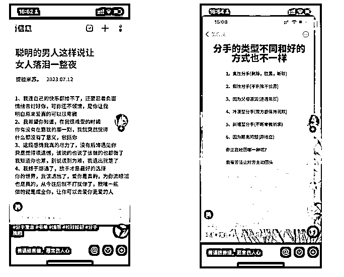

# 六、引流成交

在婚恋流量变现过程中，转化成交是非常重要的一部分。转化也可以分为两点，评论区转化和私信转化

评论区转化，我们可以在评论区或者精准作品上打广告，引导粉丝私信我们，或者直接关注评论区粉丝，直接私信他。

在养号和运营的过程中，转化成交是非常重要的一部分。转化也可以分为两点，评论区转化和私信转化

评论区转化，我们可以在评论区或者精准作品上打广告，引导粉丝私信我们，或者直接关注评论区粉丝，直接私信他。

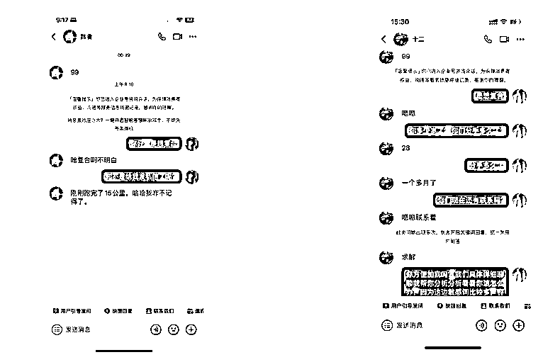

问清粉丝的年龄、需求和分手时间就可以了，然后备注下信息去上粉群里要个号。在和粉丝沟通的过程中，一定要有温度，不要显得太过于机械化，只要正常满足要求基本愿意加微信的。也不用太纠结个别粉丝，网络这么大，总会遇到奇奇怪怪的人。

这些是我在私信转化方面的一些实际操作经验，希望对大家有所启发。

# 七、新人入局门槛及建议

## 1.门槛

1.稳定的后端渠道

婚恋引流是一个蛮适合当小白做的项目，最大的卡点就是流量有了不知道对接给谁。挽心这边在搭建了稳定的渠道之前也是踩了很多的坑，比如后端觉得流量不稳定，佣金变动，结算延迟，扣量，售后服务不好等等。问题还是很多的。而且这还是在我有多年情感流量工作相关经验和资源的情况下，如果新人自己去谈，最好是找朋友链接或者是找成熟的已经搭建好的渠道。

2.平台选择

目前主流的公域平台，抖音和视频号适合新人下场，也是日活比较高的平台。小红书对婚恋和站外导流的打击比较严重，暂时不做考虑。相比于做ip，做小红书图文，抖音批量剪辑简单的图文号和书单号上手简单很多。

## 2.建议

### 1、尽早入局

现在市场环境不好的情况下，工作越来越难找，大部分人选择出来创业。

婚恋流量对小白友好，只要有执行力就能够拿到结果。

不管是以后做什么项目，学会了流量玩法，是可以复制到其他项目当中的。

### 2.多做账号

经常有人会问到我，自己应该做几个账号，在我看来，婚恋流量项目：账号=流量=钱，我们现在结算的价格是50 一条有效流量。10条=500，50条=2500，100条=5000，200条=1w。这是一个可以轻松月入四位数的项目。

我们再来算一下其他的成本，前面说了账号越多，流量越多，但是个人精力充足下五个号差不多了，我们咸鱼买一台手机500*5=2500，当然设备也可以循序渐进的购买。再者，毕竟是引流项目，无论怎么规避，都有封号风险的，但是产出是远远大于这里的成本的。封号也是一天，七天左右。

# 八、结语

我的分享现在就要结束了。我希望这些关于婚恋流量赛道的见解和时间管理的经验能够为正在此路上努力的朋友们提供至少一丝启发。如果这些内容能为您带来实质性的帮助，那将是我的荣幸。

这是我往期的文章，附上链接感兴趣的圈友可以阅读了解一下我~

1.《情感粉引流介绍》

2.《情感赛道，单月变现5万+全流程复盘》

我非常欢迎那些对婚恋流量赛道感兴趣或已经在这条路上的朋友们与我联系。分享不仅是学习的过程，也是连接彼此的桥梁。让我们一起交流经验，互相学习，共同成长。

越分享越幸运。我是挽心，祝愿大家在追求财富的路上，技艺精进，做大做强。