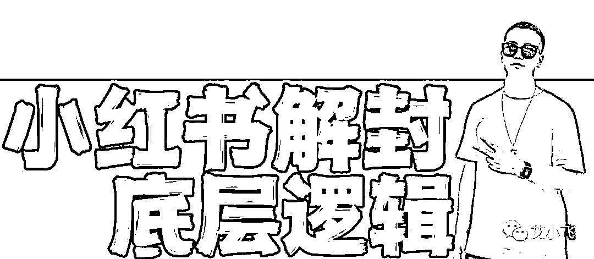
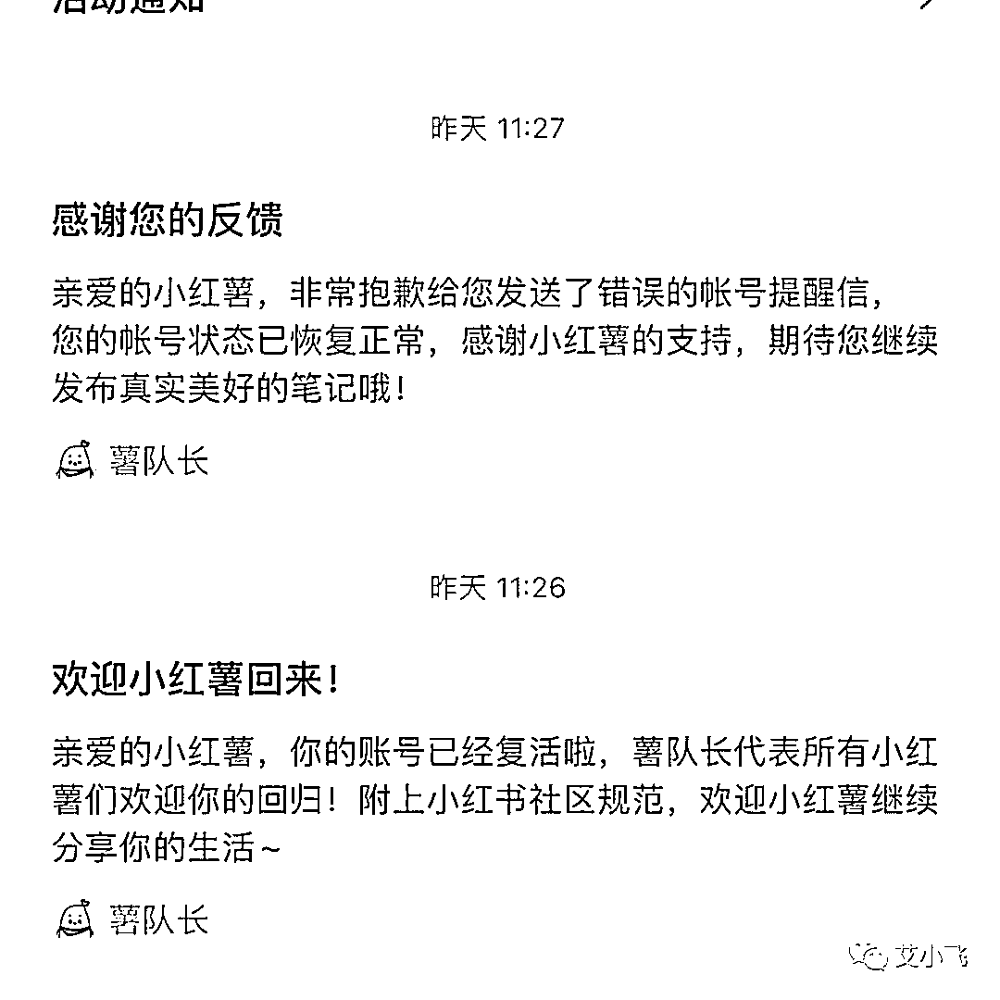
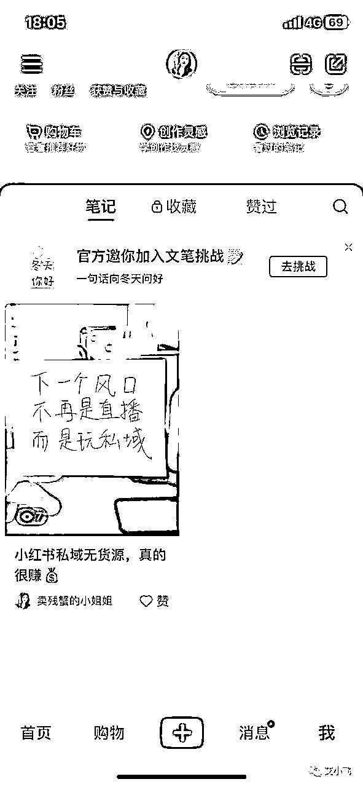
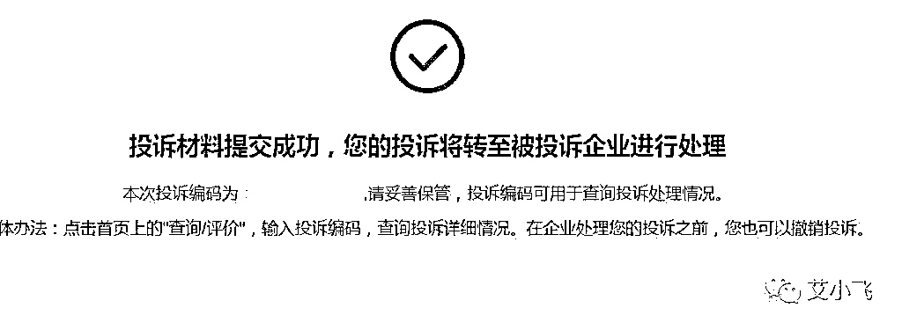
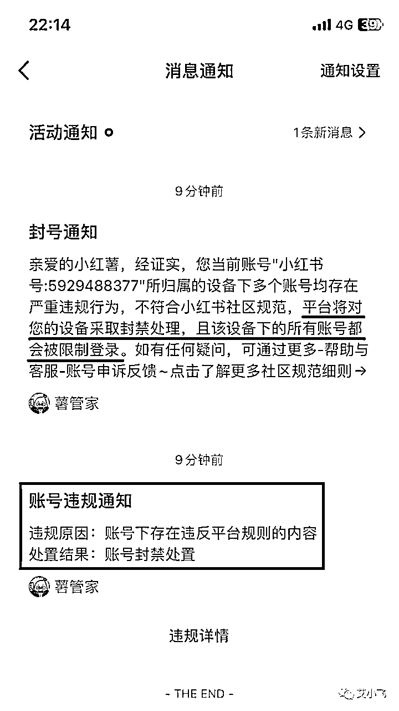

# 小红书解封背后的底层逻辑

> 来源：[https://nivut760ftk.feishu.cn/docx/SqDJdoxekoeJL9xEqXPcWSnQnXg](https://nivut760ftk.feishu.cn/docx/SqDJdoxekoeJL9xEqXPcWSnQnXg)

哈喽大家好，我叫艾小飞，擅长小红书引流

最近很多人的小红书账号都被封了

有人好不容易连续熬夜了几个月，涨了上万粉，终于要赚钱了，平台就给你来个永久封号

一觉回到解放前，一瞬间啥也没有了

有人分享了很多有纪念意义的照片，平台就给你来个封号提示，以前的照片，再也找不回了

还有人账号被封了，实名捞不出来的，号码捞不出来的，客户捞不出来的，单子捞不出来的...

遇到这种情况真是又急又气愤，想快点马上解决，但又不知道该怎么办才好

急病乱投医，查资料看了很多网友说的方法，一个个去试了都行不通，完了，这下真的完了！

怎么办！！！

别急，我这有办法！

以下我说的这些办法，你拿去实操后，成功率肯定会比瞎操作的更高

因为我是成功解封过小红书账号的，解封过程没花一分钱，全是人工自己操作的

我看到很多人都在为自己的账号封禁而发愁，还有很多人因此被骗了很多money，很急需这方面的详细解封教程来救急

OK，既然大家都有需求，我也抽了个时间，好好的跟你们说下，我当时是怎么成功解封小红书账号的，解封都有哪些底层逻辑和细节点

为什么你们去申诉老是被拒？而我十天就能搞定？

好了，废话不多说，我们先来讲讲第一个问题，也是很多人都搞不明白的问题

为什么人家申诉能成，你们1:1去复刻都不成功？玄学？还是他们有黑科技？

其实都不是

而是因为，你没有对症下药，去解决根本的问题

啊？什么意思？

举个例子，比如人家感冒了，他去尝试吃颗感冒药，一天后就好了，然后把方法发布在网上告诉你，嗯，这流程确实没毛病

但你明明是发烧的，你也去吃人家推荐的感冒药，你觉得，能好得快吗

就像人家的账号，明明是因为私信被封号的，人家申诉成功了，然后把流程和话术发到网上告诉你，嗯，这确实没毛病

但你明明因为恶意导流被封的，你也按照他那套流程和话术去走，你觉得，能通过吗

如果你是平台，每个用户都是瞎申诉的，申诉的问题都不在点子上，你看到后，你会怎么处理

你会不会直接秒拒？

我相信肯定会

所以在这里，我要跟你科普第一个点就是，不要盲目跟风的急病乱投医，效果可能会适得其反

每个人被封号的原因都是不一样的，只有根据你的实际情况，对症下药的解决才是关键点

怎么解决？

说到这里，可能很多人到不知道该怎么办了

因为在小红书上，违规封号的类型太多了，我给你随便列举下

刚发了条赚钱信息，就说我涉嫌招募，封了

刚接个蒲公英广告，就说我涉嫌营销，封了

刚发了条自拍照片，就说我涉嫌色情，封了

刚发了私信给客户，就说我涉嫌导流，封了

既然是封了，那肯定是有原因和理由的，平台不可能吃饱没事做，把商家和客户往外赶，对吧

平台为什么会把你的账号给封掉？

它是真的想扼杀你业务，把你往死里搞吗？

不是的，并没有网上说得那么夸张啊，平台没那么多的时间去针对你

其实背后他们想表达的是，希望通过封号这件事，给你一个提醒，能让你明白小红书平台的底线在哪，什么事能做，什么事不能做

当你不小心犯了错，平台给你来个重锤打击，让你深刻的知道，触碰底线这件事的严重性，给你付出点沉重的代价，下次要涨点记性不能再犯

这就是平台封你账号的本质原因

既然知道了平台封号的本质是什么，那我们就知道要如何更有效的去申诉了

怎么申诉？

不是你想象的那种，一哭二闹三上吊的啊，那套已经过时了，没用！

首先第一步，要表明你不是有意的去触碰平台底线的态度

这个态度很关键！

我先来说说，当时我的账号被封后，我是如何处理的

首先封号的第二天，我打电话给人工客服，表明了我的态度，并不是有意去触碰平台底线的

然后工作人员让我在小红书APP上，按流程操作去写申诉话术，等反馈

当时我大概是这么写的：

“我目前是一个内容创作博主，喜欢在小红书上分享一些干货知识，可能我之前分享创业副业的内容，触及到了近期敏感的诈骗问题”

“当时并没有意识到，这种话题是不能发在小红书平台上的，是我的问题，没有去了解平台的规则都有哪些”

“发出去之后，笔记被限流，也没人来咨询我，当我再发布下一篇时，账号就被封禁了”

“深思熟虑一晚后，我想到了，是我自身对社区的规则了解得不够透彻”

“于是我一大早上看了很多的社区规则条例，也清楚的理解和知道，小红书平台为什么要坚决打击这类的话题了”

“我知道我的问题在哪了，我也深刻的意识到，自己所付出的代价有多大”

“我下次也不会再犯这种低级的错误了，希望官方平台，能给过一次改正的机会”

“我也会利用这次机会，好好的去维护平台的底线，不要再去碰第二次！谢谢官方，谢谢小红书！谢谢正在帮我处理的工作人员”

写完了后，我就配上这张图，发送出去，等待反馈

可能你觉得我的话术有点软弱和多余了，都是在强调自己的问题

其实不是的，如果一开始你不表明这种认错态度，一上来就想直接跟平台硬刚，人家凭什么给你解封？

凭你账号粉丝多？凭你内容优质？还是凭你有钱？

不，人家平台根本不在乎你这种东西，平台缺了你，还不是一样能活得好好的

你硬刚，肯定没用，只能去说明原因，放低你的态度，好好的去跟平台说好话

因为处理你账号的背后，他们也是人，他们也是一个有呼吸有情感的人

要是你把他们说服了，他在后台动动鼠标，点点两下，就能帮你解除账号封禁的标记，你的账号就可以恢复正常了

这就是我当时申诉的心态，和话术流程

但第一次申诉，大多数都是被拒的

为什么？

刚我说了，平台封禁你账号的目的，不是为了把你赶走，而是让你付出点代价，让你深刻意识到，触碰了底线的成本是多高

要是你还想在小红书平台发展自己的业务，一定要遵守规则，避免下次再遇到这种问题

封禁的目的，是教育，是提醒，而不是把你赶走

如果你第一次申诉，平台就给你秒通过了，你把这好消息一传十，十传百

给大家都潜意识的认为，在小红书上犯这种错，也就那样吧，随便申诉两下就通过了

导致越来越多的人，不在意这种问题，什么人都进来瞎搞，当泛滥成灾后，平台再想解决这种问题，为时已晚了

这往往也是平台最不想看到的，一颗老鼠屎，搞坏一锅汤，不如杀鸡儆猴，先让首批玩小红书的人明白，触犯到平台的底线，成本是有多高

然后一传十，十传百，让后面来的新人不会什么都瞎搞，这也是一种震慑和隐型门槛

这样就可以形成一种良性循环，平台的生态和质量也会往更高质量的去发展

同时也能筛选淘汰掉，不是小红书的用户人群，一举两得

这是我对小红书平台，封禁账号底层逻辑的理解

前10次，被拒是很正常的，但大多数人被拒绝5次后，基本上都放弃了，认为申诉那么多都不通过，也没什么希望了

NO，NO，NO

刚刚我说了，平台封你的账号不是最终的目的

封你，是让你深刻的意识到，你碰到平台的红线了，是要付出哪些代价的

而第一步你要做的，就是要让平台的工作人员看到你认错的态度

因为你的申诉记录次数，他们都是看得到的

人家申诉1~2次，而你态度好的申诉了10次，如果你是平台，你更愿意给谁解封？

就是这么真真实实的道理，他们不是机器人，他们也是有温度有情感的人

这是解封账号的第一个大点，要摆明自己的认错态度

可能你会问，我总不能老是低着头申诉下去吧，申诉到什么时候去啊

对，问得好

接下来我就简单的概括讲解下，另一种申诉的技巧

“互联网投诉平台”+“当地市政”施压

什么意思？

我一个个来说

首先到可以投诉互联网APP的网站上，愤怒的去诉说小红书平台是如何恶意封禁我账号的

夸张而又显得你很无辜的语气去说

投诉成功后，一般在1~3个工作日内，会有人打电话给你的

然后你抓住机会，马上说出你的诉求，对方会根据你当时的态度，决定是否给你解封的

这是给平台施压的一种方法

还有另一种，是给小红书公司当地的市民热线投诉，小红书公司总部设在上海，你就打电话给021-12345，表明你的原因，说出你的诉求

当有人在48小时内打电话给你反馈时，你可以抓住机会，赶紧要求他们解封

这是给平台施压的两种方法，虽然起不到很关键性的作用，但至少能让平台的工作人员，关注到你的情况

这是我之前解封成功会用的技巧方法

要是这两种方法都还行不通，你就像我之前那样，连续每天都打电话给官方人工客服，让他们帮你点击解除封禁账号的标记

软的不行，那就来硬的

硬的不行，那就来软的

我就是通过这几套组合的技巧，在第10天就把我的账号给安全的捞出来了

那一刻，压在心里的石头，终于能放下了，感觉是真的爽啊

不过这过程还是很辛苦的，特别的磨人，细节点也是非常的多，虽然我说得很简单，但实际操作起来，可能又是另外一回事了

而且每个人被封禁的原因都是不一样的，我的是因为被封禁手机设备

你可以照抄我的话术和流程去申诉

但如果是别的原因，还按照我的这套话术去复制，就不一定能成了

总之，你小红书账号被封了，一定要去申诉，只有申诉，才有一丝希望

放弃申诉，那真的就一点希望都没有了

好了，今天的分享小红书解封过程和细节就到这了，文笔能力有限，如果你有什么不懂的，可以后台找我沟通

我叫艾小飞，擅长小红书引流，下期再见！

原创：艾小飞

转载可私信

禁止搬运和抄袭