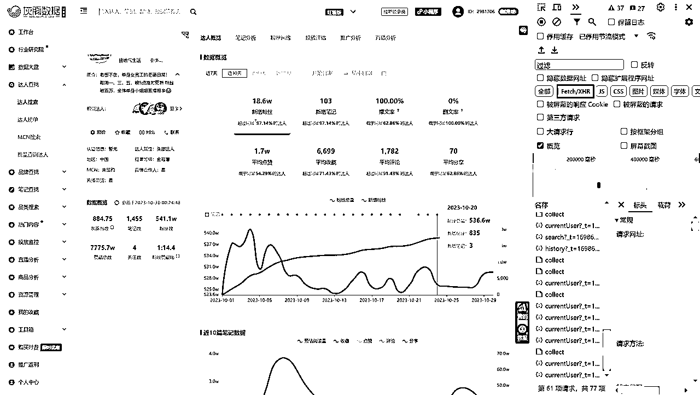
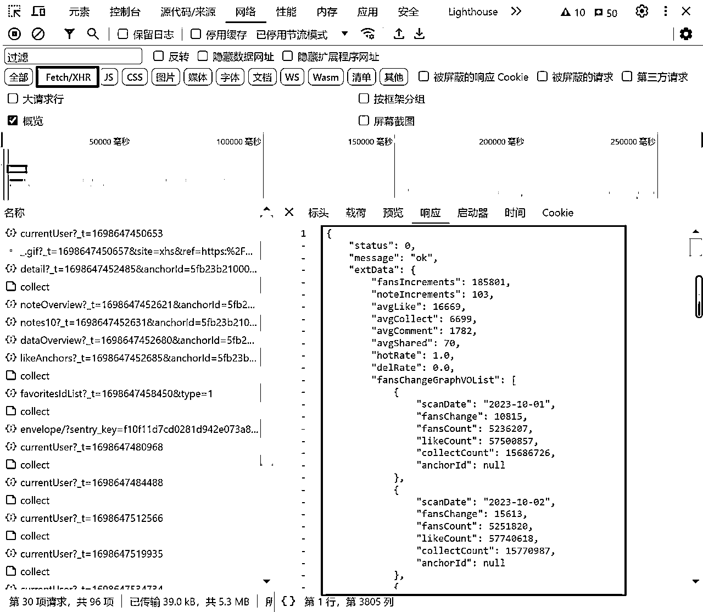
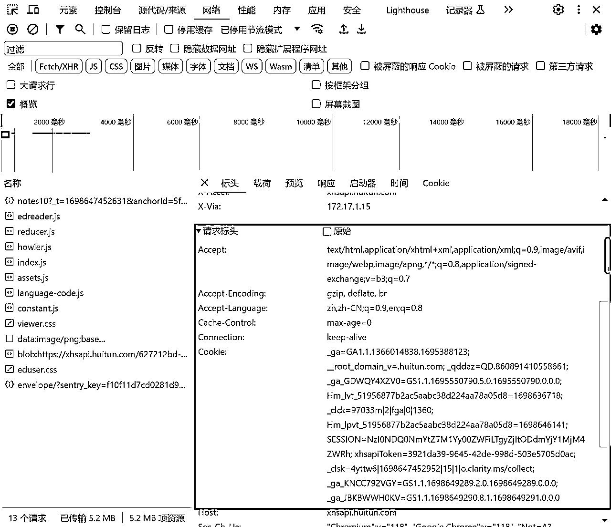
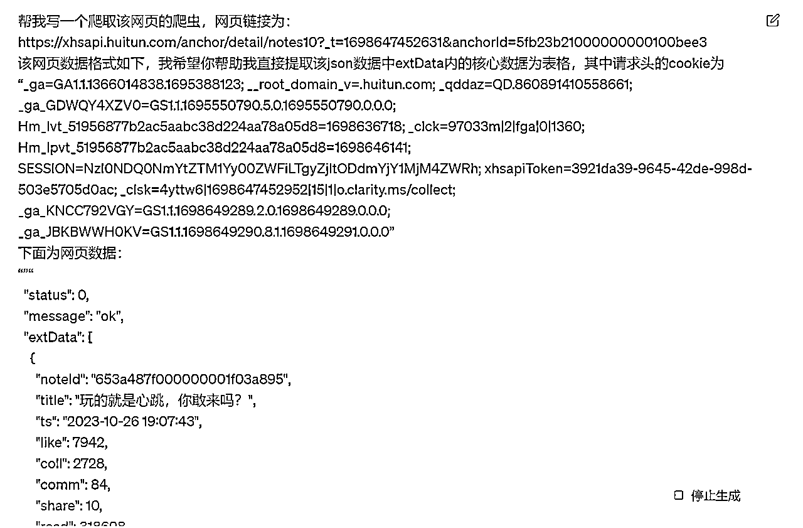
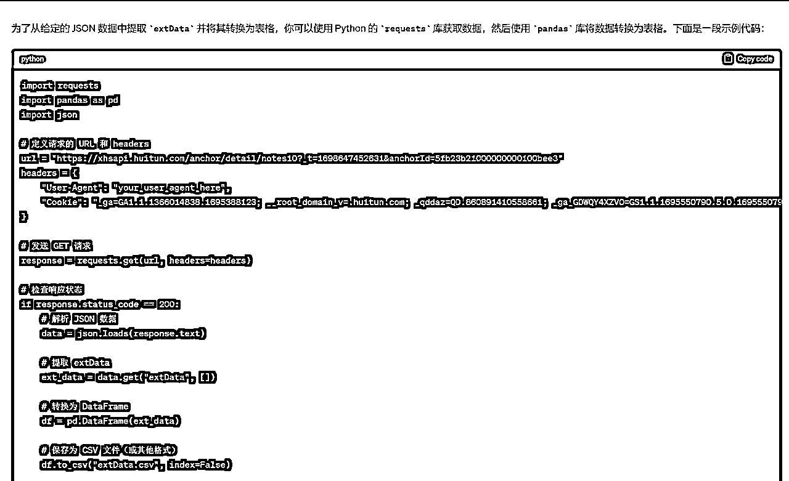

# 灰臀/考古加数据爬不了？这篇文章教会你

> 来源：[https://bc8fd5oefm.feishu.cn/docx/SrOXdYezPogfRnx4wnAcb3w8nVR](https://bc8fd5oefm.feishu.cn/docx/SrOXdYezPogfRnx4wnAcb3w8nVR)

### 介绍

本篇文章主要分为三个部分，

第一个部分，为什么要爬灰臀这样的数据网站

第二个部分，灰臀这样的网站为什么无法直接爬/通用爬虫方法为何无效

第三个部分，如何爬取灰臀这样的网站

### 1，为什么爬

我们有时候自己爬取网站，会发现反爬手段千奇百怪，如果你爬取的是淘宝这种top级的网站，你就能够知道绝望的含义

但是如果有人把这个问题攻克了，你只需要爬取其对应的网站，岂不美哉

数据网站就是这样，它爬取了淘宝这样的网站的数据，但是他本身反爬做的并不是很严格（我也不懂，可能是会开锁的人，不一定会造锁）

这样，我们就不用千辛万苦地自己去爬源网站了，花点儿钱买个会员，有人把各种问题给解决了，咋们直接就可以拿数据了

当然还有些综合性的数据和分析数据，数据网站也不想给你，那咱们就可以自己爬嘛

### 2，为什么不好爬

上次朋友告知我chatgpt写爬虫好用是好用，但是遇到灰臀数据这一类的就头疼了

其实核心是这种数据类型的网站，并非使用传统的加载方式，试想一下，一个大数据网站，数据直接放在代码中，加载页面数据都半天了，用户可不会等这么久。这时候就诞生了异步加载（ajax），即我先把网站框架加载出来，给用户及时的反馈，然后数据后台加载，最后把数据放到框架里面

所以这个数据，直接拿是不好拿了，需要通过分析其数据链接和内部的json结构来获取数据

当然现在有了gpt，可以大大的减轻工作量，毕竟分析，chatgpt很擅长；结构，chatgpt也很擅长

### 3，怎么爬

两个问题：

#### 1，数据在哪儿

这里就涉及到实操的环节

##### 打开目标网址

第一步，肯定是打开目标网站，你的目的是啥，是爬取那些数据

想好这些，打开网站，按一下f12，很多人对这个比较抵触，也能理解，第一反应这东西专业人士干的，其实不是，尝试了解了解，咋们不就成专家了吗

我这次准备爬取灰臀小红书近30天的笔记情况，用一个路人账号举例

###### 第一步，选中 Fetch/XHR



###### 第二步，选择链接

这个一般是ajax加载使用的，琳琅满目一堆，是哪个呢？

两个方案，

方案一：

作为一个开发，他们写的名字，是尽可能协同办公也要方便的，所以看图就能知道

以图中为例，直接可以看到两个分别是currentUser（当前用户），detail（详情），noteOverview（笔记概述），notes10（近10条笔记）

看不懂？直接点开，你对照着网页看看数据，就理解了，也可以看响应，发现都在里面了【根据自己的需要，查看需要那个就爬那个，都要，那就都爬】

方案二：直接搜索(点进任意链接，快捷键ctrl+f)



###### 第三步，分析结构

相信简单的分析过后，大家都知道数据在哪儿可以直接找到了

不过数据都长这样：{x:x}，这其实就是json格式，而如果你双击，会发现打开的网页是json格式，链接页直接选择标头，有个请求网址，这就是该数据的获取地址，下面有请求标头等，后面要用¹

[图中为jsonview插件显示结果，默认为直接平铺了]


也就是说，你知道它的地址，你就可以拿到他了，同时有一个发现即每个用户有个id，也对应着我们请求网址所需要的id：所以批量爬取的思路也有了，直接把对标的用户放到一个excel表里面，可以每天统一获取一次以查询对标用户的情况

当然如果像有些人直接定时爬虫也是可以的，但是容易被反爬，毕竟频率越低，伤害越小


#### 2，数据怎么拿

好了，路径我们已经摸清楚了，怎么到它家，并且拿走他家的东西，就需要考虑

如果你是一个小白，gpt可以帮助你/如果不是，gpt还是可以帮你，毕竟写代码是个苦差事

直接给到gpt需要爬取的地址，以及目标地址的内容【如果内容并不多，可以直接给到gpt该链接对应的内容】，如果数据比较多，给到一两条数据案例，比如10条核心数据删除掉其中8条，核心是让他根据局部匹配全部

这里还有个问题，即当我们访问的时候，是登录状态的。本质其实是，我们本地在登录之后，那边给了我们一个身份令牌，可能是你的手机号加密码的组合后加密的一段英文数字

这个专业术语叫cookie，为啥要提，因为需要

当我们进入目标页或者直接网页也行，之前提过，找到请求标头，让gpt帮助我们提取核心的几个作为请求头即可，主要核心的就是cookie其他的可以先不用



如果后面发现获取不到数据，就在那儿重新获取即可，然后告知gpt重写代码；我这会儿的主要主要考虑是toen限制

提示词如下：



代码结果如下：



一次性就成功了，说实话还挺惊喜，得益于ajax获取到的数据可以直接被pandas识别并转换并且灰臀并没有很多的反爬策略，所以其实我们的工作量还挺小


#### 3，总结

案例是相通的，可以看出来，灰臀数据几乎所有的数据都是通过ajax获取

对于普通人来讲可能是个门槛，但是只要跨过这个门槛，市面上的数据，无非就是这两种，网页数据和ajax数据

再搭配我之前的两弹（https://t.zsxq.com/13k6dgddP），基本所有数据，都可以在gpt的协助下，手到擒来

gpt的生成的代码如下：

"""

为了从给定的 JSON 数据中提取 extData 并将其转换为表格，你可以使用 Python 的 requests 库获取数据，然后使用 pandas 库将数据转换为表格。下面是一段示例代码：

```
pythonCopy code
import requests
import pandas as pd
import json

# 定义请求的 URL 和 headers
url = "https://xhsapi.huitun.com/anchor/detail/notes10?_t=1698647452631&anchorId=5fb23b21000000000100bee3"
headers = {
    "User-Agent": "Mozilla/5.0 (Windows NT 10.0; Win64; x64) AppleWebKit/537.36 (KHTML, like Gecko) Chrome/118.0.0.0 Safari/537.36",
    "Cookie": "填写你的cookie即可"
}

# 发送 GET 请求
response = requests.get(url, headers=headers)

# 检查响应状态if response.status_code == 200:
    # 解析 JSON 数据
    data = json.loads(response.text)

    # 提取 extData
    ext_data = data.get("extData", [])

    # 转换为 DataFrame
    df = pd.DataFrame(ext_data)

    # 保存为 CSV 文件（或其他格式）
    df.to_csv("extData.csv", index=False)
```

请注意：

*   你需要将 your_user_agent_here 替换为实际的 User-Agent 字符串。

*   由于我无法访问外部网络，因此无法运行该代码进行测试。

这样，你就能得到一个名为 extData.csv 的 CSV 文件，其中包含 extData 中的所有数据。

如果你还没有安装 requests 和 pandas，你可以使用以下命令进行安装：

```
bashCopy code
pip install requests pandas
```

这只是一个基础示例，你可以根据自己的需求进行相应的调整。希望这能帮助你！

"""