# 内容效果提升30%，AI评论分析新的内容利器

> 来源：[https://d033dn5rsad.feishu.cn/docx/SxK6dpCt2o9hwexoHuLcmlacnLf](https://d033dn5rsad.feishu.cn/docx/SxK6dpCt2o9hwexoHuLcmlacnLf)

大家好， 我是亚汶，16年开始做过电商，虽然有点小成绩，但是还是更喜欢科技一点，便回归本行做科技类的创业，目前通过AI产品为内容营销的朋友服务，有点小心得和效果（转化和互动平均可以提高30%）。

之前很多朋友分享的AI技巧，对我也启发良多。所以我打算把自己的一点小心得也陆续分享出来，大家共同进步。

今天的主题是，如何通过评论分析提高内容效果？

评论分析，可以在以下几方面起到，明显效果：

1.  提高运营效率：内容营销从来不看盲目的努力，正确的时间做正确的事情，才是撬动流量的杠杆。通过分析评论，我们可以清晰的发现，评论、分享和点赞都是什么时候，如何发生的。剩下就是照着反复执行即可。

1.  优化选题：成功的选题是成功的一半。我分析了不同平台大号流量的起爆过程，还有后续流量稳定期的选题。基本规律是：起爆期，要尽量蹭热点和有社会热度的话题。流量稳定期，则是之前会爆的换角度表达。

我的理解：选题，就是用场景，吸引你的用户或者表达产品优势。会爆的内容，重复多少次还是会爆。通过评论的分析，在同行爆文和评论的场景中，找到新的角度表达，就是你的爆文。

1.  提高内容阅读量：互动量，永远是内容平台分配流量的核心指标。什么内容引起了评论，什么样的评论可以引起追评和点赞。答案就在同行的爆文和评论里。随后通过：”内容埋点“、”引导评论“ 这两种方法，可以有效提高互动量，从而提高阅读量。

1.  提升转化：提升转化最有效的手段，就是找到客户有痛点的场景。通过评论我们可以获得用户的看重的点和槽点。用户会告诉你他们要什么，只要针对性的调整内容，就能提升转化率。

其实还有很多有益的点，今天我们就拉个主线。

# 提高运营效率：

先抛结论：

1.  一级评论的数量不等于评论的活跃度

1.  评论的发布时间有甜蜜点。

1.  基础权重高低不同，评论的策略应该有所不同

## 分析方法：

1.  我的品类什么时间段评论的互动比较好？

1.  我现在的账号，适合在哪些时间段产生”神评“？

1.  什么样的评论能引起高互动？

## 评论互动的重要性：

爆文评论本身的互动量，可以做到帖子本身评论量的80%左右。

直接看图说话，这是6篇去黑头的爆文的评论分析。

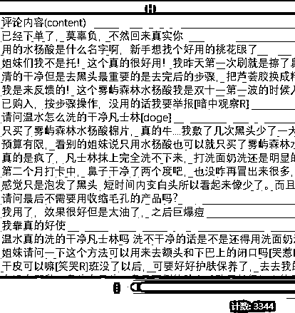

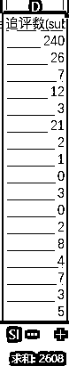

帖子评论量：3344 追评量：2608

这6篇帖子，一共评论3344条，但是追评有2608条。

追评的数量是帖子本身的78%，明显评论本身的互动是不可忽略的要点。

这些互动怎么来的，我会在后面的部分说明。

## 时段分析：

评论发布的时间分布：

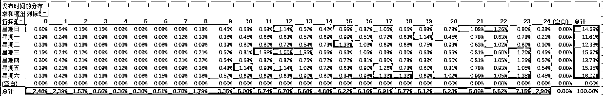

图中：

横轴是时段（比如3：30~4：30算4点的时段）；纵轴是星期；

单元格内百分比，是这个时段发布的评论数量在所有评论中的占比

绿色->红色，表示从低到高。

```
Remark:这个数据看起来很正常,没什么特别价值，但是这个是我们后续分析的基准线。
```

再看一张图：

评论的SZ指标：（是我自己根据评论的点赞和追评数据做的一个指数）

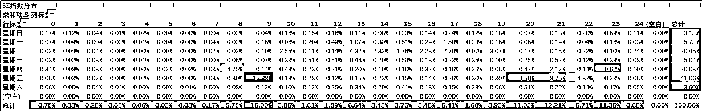

我们可以看到，评论互动量（追评+评论点赞）和评论的分布有了很大区别。

和评论相比，评论自身的互动，更加集中。

就这品来说，你帖子的评论在周五的3个时间段的表现，已经占了一周总表现得41%。

如果你得账号权重不错，这些时间段，就是你必争之时。

那如果，我们的账号权重一般？

我们把阅读量这个和账号权重有关的变量去掉，看看会怎么样。

评论去阅读权重活力图：

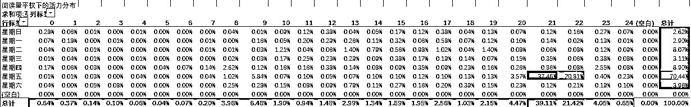

时间端更加集中了！

对低权重账号来说，这个消息是双刃剑。

把握的好，一篇帖子，就能逆天改命。

做不出效果，一周的大部分时间，对低粉账号来说，成功概率大降。

另外分析运营时间点还有其他的维度，篇幅有限，另外我自己也留点差异化：）

作者按：

平时多联系积累，稳步增长；核心时段，精品爆发。

内容营销，靠运气，也靠坚持。

## 内容分析

什么评论互动高？

直接上图

*   top3（不考虑阅读量）：

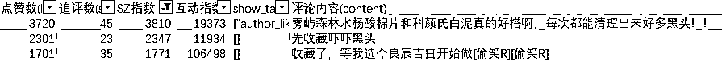

*   top3（考虑阅读情况下）：

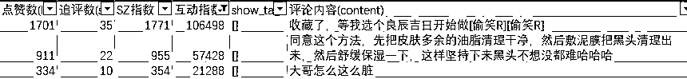

是不是完全想不到？

这就是为什么我们需要分析评论。用户因为什么互动，经常出乎意料。

所以说：敬畏尊重数据，是长期运营者必备的素质。

# 优化选题

今天主题是评论的，所以就从评论中看看，我们能得到哪些信息。

为了方便大家理解，我用6篇文章中的一篇来分析。

小红书文章ID:tps://www.xiaohongshu.com/explore/6369f1750000000009001664?xhsshare=CopyLink

标题：希望所有毛孔粗大的姐妹都能刷到这篇！

发布时间：2022/11/8 14:17:50

评论总量：684条，我随机挑了286个评论来分析

（刚才发现，博主把帖子下了。用来分析的286条评论我放到：下面链接）

经过我们自己微调的开源模型分类后得到以下数据：

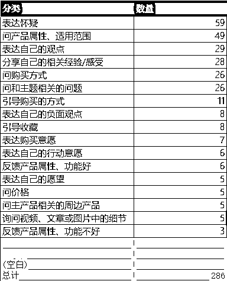

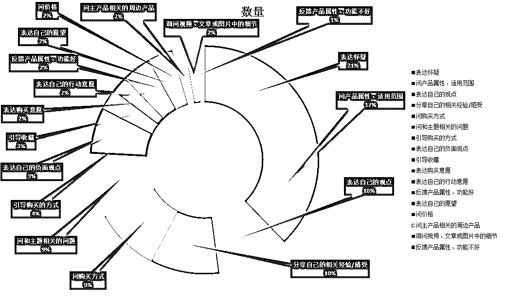

我们从”问产品属性、适用范围“的评论中看看有没有惊喜。

问产品属性、适用范围：共有评论49条

经过我们大模型聚类后的结果如下：

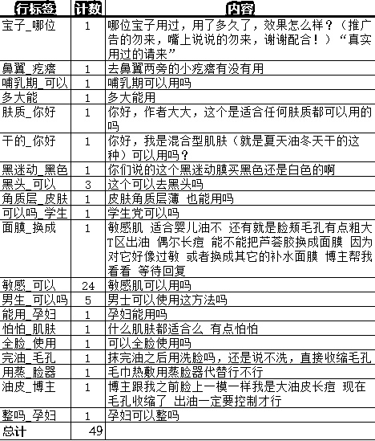

新选题出来了：

1.  敏感肌。高达24条评论

1.  男士。 有5条

1.  去黑头。 有3条

其他的其实也可以选。选题是不是一下变的容易了？

# 提高阅读量

抛开内容不谈，提升阅读量 = 提升互动。

还是6369f1750000000009001664（希望所有毛孔粗大的姐妹都能刷到这篇！）这个帖子。

## 内容埋点

在我整体看评论中的关键词时，我发现”婴儿油“这个词提及率很高。

于是我在整体684个评论中，筛选有”婴儿油“的评论。居然高达”106“条，占整体评论的15.5%。

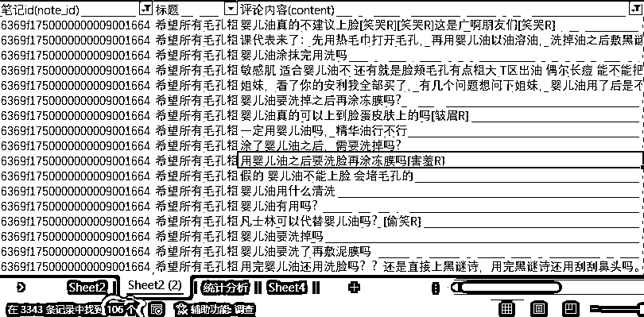

（图中3344条记录，是6篇总评论量）

然后我回头去看帖子内容。发现帖子中教授的操作步骤中有婴儿油。婴儿油不好清洗，这个知识点，有经验的人很容易知道。但是她还是坚持这个说法。

我有理由相信，她是故意的。一个不会影响主产品的次要瑕疵，却可以带来15%的评论量。很是合算。

这种方式，就是我说的”内容埋点“。

## 引导评论

### 人造神评

这个比较简单，直接上图：

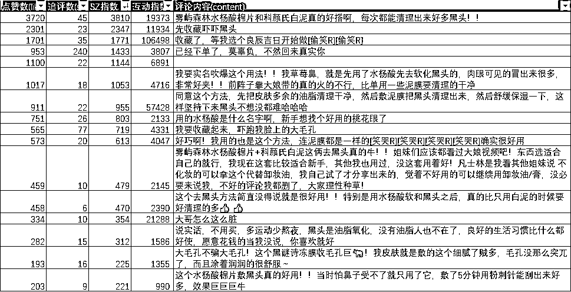

看，评论是不是有点规律。

我自己的分类：

1.  营运引导的评论：第一条，第六条都很明显，其实大部分都是。

1.  搞怪类：”收藏吓吓黑头”和“我要收藏起来，吓跑我脸上的大毛孔”

1.  基于内容的提问：“大哥怎么这么脏”

根据这些类型的例句，自己再改一下，在合适的时间用小号发出来。剩下的就是天意了，至少你的胜率很高了。

### 制造回复模式

另外一种比较极端，就是用多个小号，形成一个回复的模式，引导用户模仿。

给出一个例子：

https://www.xiaohongshu.com/explore/652c15c2000000001f0042c6?xhsshare=CopyLink

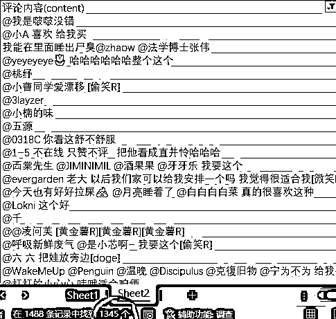

我们可以看到，一共1488条评论，其中1345条是@别人。

我无法判断是人为还是自然形成，但是这个模式的引导，肯定在运营的能力范围之内。

这个情况，如果大家经常关注评论的话，其实很多。

# 提高转化

比较基础的方式，就是看爆文的评论，然后看哪些是引导成交，引导私聊，引导到店铺的，记录下来模仿。

现在是AI时代，所以我们可以上点科技。通过大模型可以对评论分类，可以直接找到这些内容。

老规矩，直接上图，

还是6369f1750000000009001664（希望所有毛孔粗大的姐妹都能刷到这篇！）

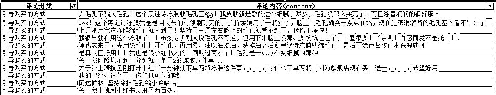

这些引导购买的评论，我们都可以借鉴过来，用在自己的帖子里引导购买。

除了引导购买之外，引导私聊，关注，收藏，进店，进首页，都是一个逻辑。

保持80%借鉴20%创新。转化慢慢就提升了。

另外

利用之前在选题阶段，提到的寻找客户痛点的方式。将客户在意的点，加入文章内容，也可以有效提高转化。由于之前有贴图，这里就不再重复贴图。

好了，以上就是我今天的分享了，希望可以帮助到大家。

也希望可以和大家多链接，一起享受新技术时代的红利。