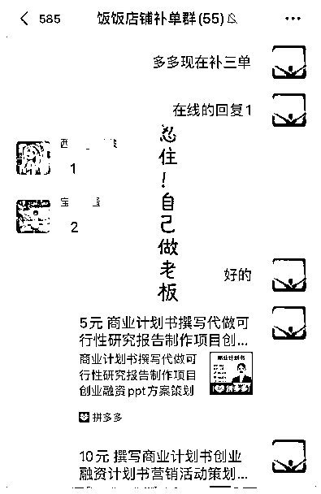
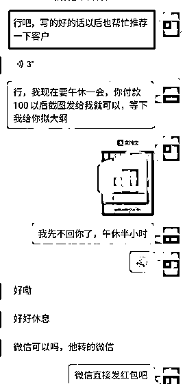

# AI+拼多多写作店铺，单店月均10000+姆级教程，内附详细运营方法~

> 来源：[https://cxqeimz77vr.feishu.cn/docx/T1F5dn3tqo1TIcxSEQNckV46nUe](https://cxqeimz77vr.feishu.cn/docx/T1F5dn3tqo1TIcxSEQNckV46nUe)

大家好，我是饭饭，生财的龙珠圈友。作为一名电商赛道的探索者，我也在积极的拥抱AI，经过生财首席医官梁靠谱的专业指导，我自己的写作店铺也是越来越稳当，很快找到了自己的发展方向，也在生财分享了3篇精华帖文章。

在上一期作为《AI市场有多大？适合下场做的细分赛道拆解》的实战嘉宾，和黄小刀（刀姐）的对话中我们谈到了不少普通人能操作的AI实战，其中有不少圈友提问和链接到我，对高单价的写作比较感兴趣，和和我交流了不少关于写作店铺问题，更多人对高单价的类目感兴趣。

这一期带来我自己的主营实操业务，《AI+拼多多写作店铺的拆解》，此贴万字长文，轻理论、重实操，见贴欢喜，希望圈友见贴受益~

## 1、AI+写作店铺项目介绍

谈到AI+写作星球里也做了非常多的帖子、有公众号爆文写作、头条号和百家号等等，都是非常厉害的细分板块，相对于这些赛道来说，写作店铺具有短频快、先收钱再写文，具有比较大的确定性。

在我做写作变现赛道发生的一个最大改变就是当chatGPT出现。这个文字类的万能助理【chatGPT】将产品利润提升到了100% ，不用写手老师，也能完成文章写作。目前使用GPT能够极大的提高效率和利润，在GPT的辅助之下我们也是扩大了团队规模，招聘了一些员工来使用AI进行文章撰写，效果算是挺好的，收益进一步放大。

目前AI+写作店铺的变现思路就是通过平台开写作店铺，精准的接到客户的写作单子，然后用GPT来写或者辅助，达到客户的要求就可以（达到客户要求就能完美收钱）

如果熟练的掌握GPT的指令，那写出来的文章是非常的优质的。

单店收益：

目前我们是属于积累了一定的经验，做起来可能是相对容易的，接单数据也比较不错，就在过去的一个月里我们的拼多多店铺也是创作了单店月均1w以上的一个收益，用AI来辅助写作，单价也是相对高一点，如果是在使用AI工具的，那这个玩法就比较适合大家，如果是在做写作变现的，那这篇帖子详细的运营方法就辅助大家增收。

## 1.1认识chatGPT

ChatGPT是一种基于OpenAI的GPT（生成对抗网络）-3.5架构的大型语言模型。是今年的一大技术革命，这个应用是经过大规模训练的AI模型，可以用于生成自然语言文本回复。

ChatGPT的目标是通过对话方式与用户进行交互，提供有意义、准确和有用的回答。也就是说它可以用于各种任务，例如回答问题、解释概念、提供建议、进行创意性的写作等。ChatGPT的训练数据源自互联网上的广大文本数据，包括书籍、文章、网页、论坛帖子等。强大的数据支持也就帮助他能够理解并模仿人类语言的方式，可以根据用户提供的输入进行回应。ChatGPT通过学习上下文和语义关系来生成连贯的回答，并且可以从多个角度思考问题。

也就是说这个应用可以用于生成各种类型、各种难度和各种风格的文本。输入正确的指令可以得到例如演讲稿、商业计划书、读后感、公文、新闻稿等等一些列的丰富内容。

在目前的实操结果显示，GPT在各种自然语言生成任务上都取得了令人匪夷所思的结果。它完全可以模仿人类的语言模式和思考方式，生成较为自然、流畅的文本。作为一个文字类的助手，可以将它设定为任何角色，例如博士、编辑老师、各领域专家、资深专家等等，拥有他就相当于你可以0成本写文章，然后将文章获得100%利润。

## 1.2.写作开店介绍

任何一个行业单单一个“代”字，里面就藏着亿级资产！像图中的付款人数并不能代表付款金额，但是会有庞大的市场需求，根据客户的下单需求来帮他写文章，而写作属于定制类产品，具体价格不定，目前我们的基本玩法通过电商平台获取到精准客户咨询，然后双方交流、根据需求报价，虽然大多数都是私域对接付款，微信、支付宝或者银行卡付款的，但是不难看出整个行业依旧是一块超级大的蛋糕。而目前我们的主流的电商平台有淘宝、拼多多、闲鱼和小红书等等都是可以开写作店铺，而且流量还特别不错的选择。

没接触过这个行业的不知道到底要写哪些东西可以赚钱，这里我详细举例。目前市场上会经常遇见的下单写作的类型有包括但不限于如下：

演讲稿、新闻稿、读后感、征文发言稿、 报告总结等...

情书、道歉信、感谢信、节日祝福等...

软文广告类 、宣传软文 、短视频文案、 广告文案等.....

产品介绍、品牌故事、品牌软文、营销软文等......

网店文室类 、详情页文案 、剧本、脚本等.......

回忆录、公文、会议纪要、思想报告、商业计划书、创业计划书等等.......

## 1.3chatGPT +写作店铺

熟练的掌握chatGPT以后我们就有了超级强的核心竞争力，相当于有了一个万能助手，而怎么用这个万能助手去把充分的进行变现呢？

这里就完全可以结合写作店铺了实现一个小小的财富变现，选择一个平台，开一个写作店铺，实现接单自由，写作变现。结合ChatGPT的功能，为客户提供写作服务和支持。

而我们的写作店铺就可以简单的理解为：通过开店接单，为客户提供写作或指导，例如上面我们提到的文章、故事、推广文案等。

接到单子以后通过与ChatGPT进行对话，输入指令，按照客户的要求就得到一篇完整的客户所需稿件，用户可以与模型讨论和共同探讨他们的写作需求。

写作是一个定制类服务，在开店的过程中我们面临的客户分为三种：

1.有质量需求的， 这类客户最注重的是质量，找到你是希望你写出高质量的稿件，放高姿态，做好质量才是王道。

2.找你救急的：这类也能收不错的单价，质量要求不高，能过就行，一般遇见的都是哪些领导安排下来他没有去做、或者学校老师安排的需要上交的作业等等。

3.想低价应付作业的。这种会到处比价，事情最多的一部分客户，这部分客户我建议过滤，赚不到钱还能折磨人。

基本逻辑就是：获取用户，对客户进行解答，

# 2.拼多多写作店铺介绍：

## 2.1拼多多介绍

拼多多，是国内移动互联网的主流电子商务应用产品。2021年全年，拼多多年成交额（GMV）为24410亿元，目前成为了用户群体最多的电商平台。拼多多旨在凝聚更多人的力量，用更低的价格买到更好的东西截至2020年底，拼多多年活跃买家数达7.884亿，成为中国用户规模最大的电商平台。

短短几年，拼多多已超越阿里成为国内用户规模最大的电商，在开店平台的选择中无疑现在拼多多是热门的平台选择。对于在拼多多平台前景，我个人还是很看好的。

## 2.2拼多多开写作店铺的优势：

1.用户基数庞大：拼多多平台是中国最大的社交电商平台之一，拥有数亿的用户基数。这意味着如果你能够在拼多多平台上写作，你有很大的机会接触到大量的潜在用户。

2.低门槛：相比于其他平台，拼多多平台的门槛相对较低，1000保证金。不需要像在其他平台一样具备特定的制作笔记的技能或经验，就可以开始在拼多多平台上开店写作。

3.社交属性强：拼多多平台注重社交属性，用户可以通过分享、点赞等方式来增加曝光度和粉丝数，这种优势能够很好的去完成一个店铺的破零阶段。

4.起店速度快：正确的掌握我们文章中提到的写作店铺的方法以后，能够很快的去起一个新店铺，而且达到正反馈。

5.竞争小：在严厉的规则之下就成就了不断精进的卖家，大部分商家在上面很难长久存活，较小的竞争力就有助于我们放大项目优势。

## 2.3拼多多开写作店铺的劣势

1.稿费水平偏低：拼多多的用户整体合作质量偏低，付费能力相对弱一点，在开写作店铺接单的时候接到的写作单子稿费也偏低。

2.拼多多的规则严格

在拼多多开写作店铺需要谨言慎行，熟悉拼多多的店铺规则，由于我们做写作单子需要和客户沟通字数、要求和交稿日期等众多内容，而在这些内容中极大可能性含有敏感词语，所以在这个过程中一定合理的去尊重和规避平台规则。

# 3、详细的拼多多开店步骤

## 1.拼多多开店准备

拼多多店铺有企业店和个人店选择，新手建议做个人店：准备一台手机、一张电话卡、个人身份证、1000元保证金【平台保证金，不做以后会退】所以这个也等于是无需投入的，你的1000元就是换一个地方存着，不比担心平台给你扣了。

## 2.拼多多开店注册

很多圈友没做过电商平台，我在这里做了详细的注册步骤：参见 填写相应的信息就可以。

## 3.拼多多商品标题

标题非常重要，流量的大小直接和标题有关，错误的标题也会直接导致封店或者4w的保证金，这里我提供几个我们操作没问题和正在使用的标题给到各位圈友。

1.撰写商业计划书代做路演ppt项目创业融资策划方案可行性研究报告

2.撰写文章原创演讲稿作诗主持写诗答辩稿作文读后感

3.商业计划书撰写代做创业融资项目路演可行性研究报告立项策划方案

这里一定要注意，所有的使用标题都一定要保证在拼多多有大店铺存活的情况下去进行，不要跟随自己的意愿去进行盲目的创新，这种行为很大可能性会导致自己店铺被封禁。

## 4.拼多多详情页制作

做文章类目的详情页不要做的太复杂，做一张主图+副图上传就可以了，毕竟文章写作属于虚拟产品，各平台对虚拟都不是支持态度，不要用做电商实物的心态去做虚拟。在商品主图上也不要直接放“代写、代做、论文、公文、党政..”等等的敏感词，在制作拼多多的商品主图的时候直接在作图软件上套用商品主图就可以。

这里推荐两个作图软件：【搞定设计】【创客贴】

上面有很多模板直接套用就可以：我们从6月开始适应了新的平台规则，这里放一组我们常用的模板给大家参考

商品主图比例： 800*800px

图1 图2

## 5.拼多多商品发布如何避开4W保证金

这个方法目前知道的人并不多，不少人专门卖这个教程都收费上百元,请看点击蓝色部分查看教程

## 6.如何进行线下引导

最近拼多多的系统识别又比较严格了，引流这个步骤是最难的，也是很多人做不起来的关键，稍微违规容易店铺被限制。这里推荐的3个方法和专业话术：【平台规则一直在变，不能保证一直吃香，请自己把握】

方法1.这边怎么跟您发文件呢？

然后客户会回复你联系方式，然后你主动添加即可。客户主动发给我们不会触发违规，但是我们主动发给客户极大可能性违规。

方法2.发送图片引流

提前准备好几张不错的引流图片，隐晦一点，图片大小不一样，在图片上留下微信号，微信号越简单越好，越简单的微信越不容易被识别到，发送的时候需要几张大小不一样的图片来回发送，不然容易被识别到违规。

方法3.让客户先拍下

给客户报完价格以后，让客户拍下商品链接，拍下可以看见客户真实电话，然后通过卡卷查看客户的真实联系方式，打电话添加微信。

方法4：百度网盘提取

提前如图2一样把微信号留在百度网盘的文档里面，然后把文件上传到百度网盘里面，分享成如图3的一个百度网盘链接，然后在拼多多上和客户对接的时候发送百度网盘的链接，客户提取就可以直接对接到你的微信，这样就引流成功。

## 7.多多开写作店铺可能会遇见的项目风险

卖任何产品都分淡旺季，同样、做任何产品都会有一些坑和风险，这里我把所遇见的整理如下：

1.错误引流导致封店

这个问题是遇见的，在初期的时候我们由于平台规则不熟悉，错误的引流方式直接导致店铺被封禁，在操作的时候最好能够结合我已经提供的方式去优化和总结出适合自己的一套方法，如果不能总结出的话最好就直接用已有的方法。

2.接到违禁单子，被封店

这个问题也会遇见，所以在操作写作店铺的过程中，要清楚的知道哪些是违禁词，违禁词类别的单都拒接

# 4、运营起店

目前多多的文章店铺起店也是非常的简单的，

对于拼多多写作店铺这个赛道来说只要合理的去规避规则就能长久赚钱，多多的客户群体非常庞大，只要店铺经营时间久，客户误打误撞都会进入你的店铺，完全不用担心没流量问题。这是目前我们操作总结下来起店速度比较快的方法，保存使用。

## 1.人工干预

做虚拟的文章类目不需要太大的操作技巧，猥琐健康发育就是最好的玩法，直接补单刷钱进去

第一天

早上八点100元 下午三点100元 晚上八点150元

通过链接进店的方式去补单，补现金流水进店里面，如图步骤就是用自己干净的鱼塘，然后通过链接的方式，让他们进店下单补充金额就可以。

第二天

早上八点100元 下午三点150元 晚上八点200元

第三天

早上八点150元 下午三点200元 晚上八点200元

第四天

早上八点200元 下午三点250元 晚上八点300元

四天一周期，成营业额递增的方式上涨，在第四天过后保持按照第四天的

早上八点200元 下午三点250元 晚上八点300元的方式持续刷，稳定数据撬动自然流量就是可以稳定出单的，见效也特别快

注意：

刷单后三天一定要回去让刷单的人签收评价，带图评价，带图评价必须达到20条，20条带图评价上满后，前期所有的小文章能满足顾客的尽量满足，尽量早点把店铺的DSR做出来（目前看来一般60条左右会出现DSR评分，虽然官方要求50条，但是我们写作出评价会遇见小部分带图评价打不上的情况）。

客服回复

1.  前期尽量成单，根据多多的市场价小文章正常千字55元，但目前淡季而且前期店铺成长是最关键的，危急时刻只要能成交30-40千字也可以的，在拼多多整体看来我们的价格并不高，这种小文章大多数在千字50元左右。

1.  给顾客报价时可以按照这个模板/XX元亲，包通过包修改/然后发出消息后看看消息是否迅速被已读，如果已读迅速回复消息/您看怎么样？/给顾客进行逼问，让他回复你才能有商量的余地，不然消息发出去了也不赶紧追问会很大程度上的造成顾客流失。

1.  原创文章的话可以给顾客说免费出查重报告，让顾客感觉占到便宜，但这种一般对文章来说，大多数是需要查重报告的，文章写完后尽量都去降重，免费的查重网站给出一个报告就好了，这样也能够拉高店铺的评分。

1.  发货及时/尽量四小时内发货不影响后期的DSR/顾客下单后就赶紧复制地址去联系礼品包。

1.  三分钟回复率是很重要的了，大家尽量好好控制自己的睡眠，不要占用8：00-23：00，虚拟店铺数据掉下去还是比较难刷出来的，尽量重视，成系统的去做。

## 2.出现dsr分以后开直通车

当我们的店铺出现dsr分以后就直接开直通车来获取更大的利润，付费流量是拼多多的大趋势，开通直通车以后流量会增加不少，能够带来不少的利润，我们尝试 了很多种拼多多的推广方式，最适合的就是全站推广。开通全站的具体步骤如下面：

后台打开直通车

1.先试用200元的新手红包

2.选择全站推广、记住不要选其他的

3.选择出价5元

4.推广成功

# 5.微信实操路径

### 5.1私域打造

1.微信头像、昵称

【头像】推荐动漫网图

【昵称】xx老师 /xx学姐 / xx学社 等等相关的都不错

2.微信朋友圈封面

封面（与写作相关的就可以。简单清晰）

3.微信朋友圈内容

垂直写作领域

.（1）朋友圈围绕【业务】+【生活】+【感悟】去分享

.【业务】晒客户反馈图、成交图，如果新手期没有这些图的话可以从同行手里搬运。

.【生活】增加一些日常生活好看的图片，例如去哪玩的风景图、好吃的美食图等等

.【感悟】看过的好书、书中的经典句子、新闻的解读等等

目的：让朋友圈看起来更垂直更有温度一点，不要把自己打造成一个营销号，彰显自己的专业性的同时要让新来的客户感觉到你是一个活生生的写作老师，不是一个冷冷的中介，这样可以极大的提高成交率。

### 5.2私域维护

1.如何谈单

首先与客户沟通，了解他们的需求和要求。

报价之前必问三个问题及话术

1确定写作类型、主题、字数、交稿日期。

【1】你好，咱这边需要写什么呢？

【2】需要写多少字呢？

【3】什么时候需要呢？

问清楚然后报价：报价我这我准备了详细的报价表，供各位参考

文章写作详细报价参考

2.常用话术

通过电商平台到微信的都是精准客户，成单很容易的，这里我针对棘手问题给出几个牛逼的话术给圈友参考：

举例子：客户A，我方B

【如果客户觉得贵】：

A:你这个太贵了吧！

B:回复：啊，有点超预算了吗，虽然我这个算不上市场上最贵的，但是我的写作价格绝不是市场上最便宜的，我只能给你保证不错的质量。 （先认可客户：相当于谈话的时候告诉了客户自己的门槛和标准，多数人心理都是，越贵的质量越好）

A:但是你这个也太贵了啊，算了，我考虑一下

B:嗯嗯，好的 【然后紧接着追问】

B：方便说一下咱这边预算多少吗？

【如果客户担心被骗】

【1】 平台保障：

举例子：客户A，我方B

A:你们这个到时候收钱跑路怎么办？

B：哦哦，我能理解，有这个顾虑很正常，我也经常遇见很多客户反映这个问题，咱这边不用担心这个问题，我们这边支持店铺下单的，走平台保障，平台担保保护亲这边的权益。

【2】先付定金

A:你们这个到时候收钱跑路怎么办？

B：亲这边有这个顾虑太正常了，我们也经常遇见客户反映他们在其他地方下单以后遇到写手跑路的，所以我们支持了先付60%定金，写作完成以后录屏视频源文件内容和查重报告给您验收没问题以后再付尾款。

### 5.3私域裂变

1.文案吸引：在日常的朋友圈更新中适度的增加朋友圈文案：感谢友友们的信任，推荐有红包哦

2.谈价借势裂变

很多客户会喜欢砍价的，借着他砍价然后优惠，装作很为难的样子让他帮忙推荐一下客户，效果巨好，如图：

## 6.gpt的写作使用：

### 1.准备chatGPT账号

这里在淘金已经有非常多的项目都是关于chatGPT的解答和陪跑，我们已经有很多圈友上岸，关于chatgpt的账号如何注册、如何使用的教程可以参见星球里面的文章，然后我们这里就是介绍充分的利用好gpt来提供稿件的质量和产量，大幅度降低写作成本和精准的解决客户所需。

### 2.chatGPT写作指令玩法【常用模板】

【设定角色+文章标题+关键词+大纲+客户要求+改稿】

1、【设定角色】现在设定你是xxx角色（注意，chatgpt是一个万能的文字助手，你可以设定其为任何角色，然后通过发送角色的指令来帮助你更好的去呈现一篇相关文章）

2.【标题】 :在客户下单的时候都会告诉你他需要写一篇什么主体什么类型的文章，这里在给ChatGPT描述你想写什么的时候就可以直接告诉chatgpt你需要写作的标题或者类型，如果你没有明确的标题就可以把零零碎碎的大白话丢给ChatGPT，让它理解和总结一下我们具体要写的是什么。

3、【关键词】: 如果客户提到文章中需要的关键词的话先把自己的关键词列出来，再让ChatGPT结合一下这些词，然后更全面的去写作。

4、【大纲】:每一篇文章都可以提前拟定大纲，根据大纲写出来的稿子会更加的严谨、高效，满足客户所需。

形成一个比较简单自洽的逻辑。然后请ChatGPT带入编辑，读者等的角色，不断优化大纲的逻辑和表达

5.【客户要求】客户在下单的时候都会提前说明一下自己的文章要求，按点整理好，在指令投喂的时候把指令输进去，先把内容丰富起来，待改稿时再或删或改，将行文达到一个更精准的写作。

6、【改稿】:改稿时可以分几遍，每一遍改的重点不同，比如:一遍调章节结构、一遍补充材料、然后再继续修改文章风格、往里面加几个金句、检查错别字和标点符号等等，直到最后文章成为了客户所需要的稿子。

目前的AI始终是一个大型的语言模型，文字是模板化缺乏温度的，把他当做一个工具来使用效果更好，chatGPT写出来的文章不能照搬使用，适当修改，将内容变得口语化一点。

【5】根据客户需求将指令详细化

例如：我有一个客户是一名抖音机房搭建的自媒体博主，他找我连载他的自媒体招商账号的文章，他提出了他的需求是希望文章阅读量高一点，这就是比较泛的一个要求，因为他也不知道怎么样能够让文章阅读量更高。这种需要拿到长期合作的单子就肯定不能问他怎么能够让文章阅读量更高，这种情况客户没有给出详细指令的就只能自己做准备。这里将指令详细化有一个技巧：

网上搜索：自媒体招商账号爆文的一些相关内容，看看是不是他这种类型的博主需要有哪些技巧，具有吸引力的标题、有趣的场景、真实反馈的招商案例、具体的实操方法、等等一系列的指令就可以用得上。

【6】借助工具，输入指令

这是目前我们也有用到的一个指令参考的工具：BestPrompts

有时候遇见不熟悉的领域可以复制里面的指令增加准确性，这是注册网址：https://bestprompts.cn/#/index

### 3.GPT写稿实战演练

指令模板：【设定角色+文章标题+关键词+大纲+客户要求+改稿】

#### 案例1：写演讲稿

很大部分文章都是完全按照这个步骤来完成写作，整个过程花费的时间也会较少，只需要熟悉指令即可。

#### 案例2.写商业计划书

如图这是客户要求：

使用ChatGPT高效写作具体实操：

按照客户所需多次投入指令就可以得到客户所需要的商业计划书，很详细很完整，满足客户要求就可以。

## 4、实战工具

1.拼多多

2.拼多多商家版

2.chatGPT（或者其他AI工具）

3.业务微信

4.作图软件【搞定设计或者可画】

## 5.如何避坑？

1.正确识别平台违禁产品：只承接拼多多平台允许的文章，勿接学术性的文章以及党政相关的文章。

2.不要错误的引流，引流的图片实定期更换，引流方法要轮换使用。

# 写在最后：

用AI来进行接单写作属于细分赛道，感谢生财提供的高能平台，看了很多精华帖，学了不少的内容，也链接了不少的生财圈友，今年的目标是在生财破圈，如果帖子对你有用，欢迎大家在星球贴下点赞留言，共同交流~