# 收入30万+的AI线上兼职项目复盘

> 来源：[https://maum12vwcsk.feishu.cn/docx/Tg6vdGqW3oWw4ExVJpMc9DGqnyd](https://maum12vwcsk.feishu.cn/docx/Tg6vdGqW3oWw4ExVJpMc9DGqnyd)

我是Y仔，一个创业三年的00后，我是从去年12月份在生财了解到的GPT，刚接触的前几个月，我一直在做公司的业务和GPT的结合。

我的公司之前是专门给客户提供知乎、小红书营销方案和文案的，当GPT出来之后，我非常焦虑，马上开始了学习。

当时各种项目和提示词，都要去github上学习，我本身的英语能力非常差，就很痛苦，只能硬着头皮学。

我最开始用GPT的方式是：用GPT结合我们公司的内容生产方法论，来写客户的内容。

# 一、AI线上兼职项目的机会点

当我掌握了用GPT把客户需要的内容生产出来的能力之后，一个契机，我加入了一个线上兼职的投稿群，群里的情况是这样的，有很多客户会在群里发自己的文稿需求，然后各个写手按需匹配。

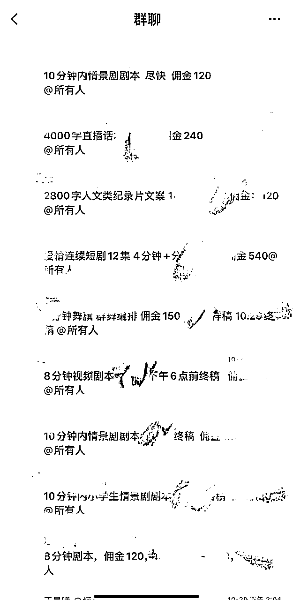

这是群聊内的信息截图（10月份的）

基于当时了解的情况，我开始思考：

中国的文字劳务市场会有多大？

是不是可以用GPT作为增效工具去做一个项目出来？

在劳务市场的预算和原有的个人和公司的文字供给公司的中间，是否能有一家AI生产内容+人工把关的文字劳务公司的生存空间？

基于这些情况，我去调研了各个兼职平台的需求，发现，我的想法可以落地。

在BOSS直聘上，有非常多的文字项目需求的公司，下面我都简称为劳务公司。

这些劳务公司，大部分都知道GPT的存在，但是大部分都不会或者没有去用。

#### 这是杭州部分地区的情感文案的需求：

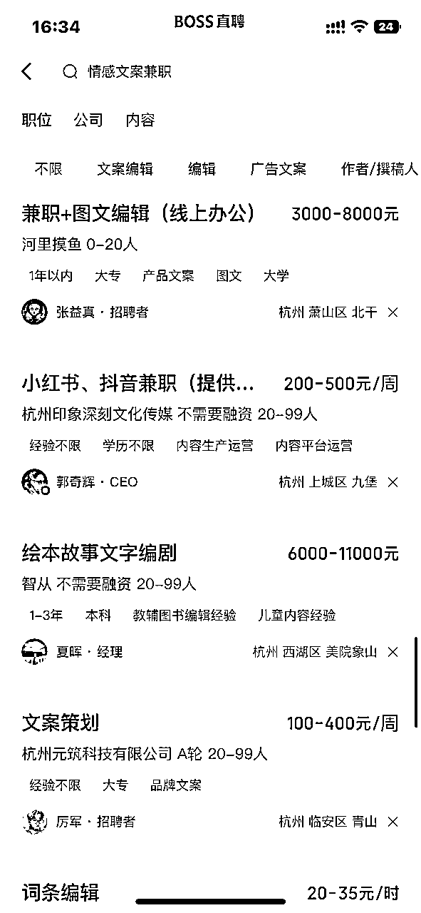

.

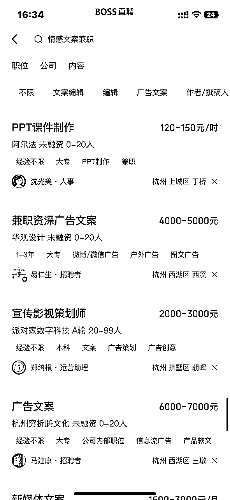

#### 这是深圳和广州部分地区的小说需求

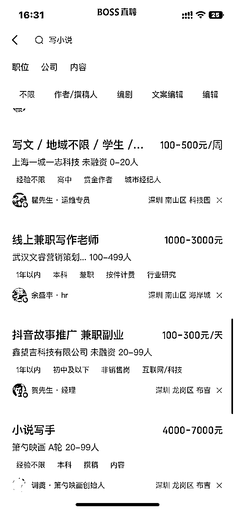

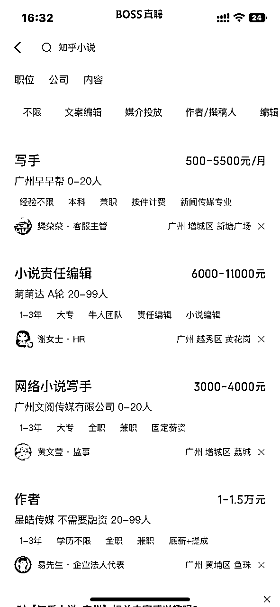

而且我去找了我认识的类似公司的相关业务线的负责人聊了一下，发现了一个情况：

目前整个劳务市场对GPT的态度正处在一个原始的状态，大家都觉得GPT不好用，不能解决原有的问题，而且还有部分的客户很鄙夷AI写出来的内容。

但实际情况是，我们用GPT写出来的内容，加上我们人工后期修改把关，大部分客户都识别不出来。

这里还有一个关键信息是我们在接了很多单之后发现的，那就是客户订单是有结构的：

1.  A级劳务公司的稿件订单需求品类固定且数量稳定，这类订单占市场总订单的43%。

1.  B级劳务公司的稿件订单需求品类不固定但数量稳定。这类订单市场占总订单的17%。

1.  C级劳务公司稿件订单需求品类固定但数量不稳定。这类订单占市场总订单的18%。

1.  D级劳务公司稿件订单需求品类不固定数量也不稳定。这类订单占市场总订单的22%。

基于这个情况，我做了这些事情：

#### 1.使用AI文字工厂逻辑，去长久且持续的接A级和C级劳务公司的订单。

做规模，做标准化和流程化的稳定稿件生产的业务线，因为这类订单的稿件品类固定，做好一套提示词之后一劳永逸，可以做长久。

招更多人去接更多的单，去开辟更多的客户，去打造更多的产品品类的AI文案生产线，去收割更多的市场。

#### 2.从B级和D级劳务公司的需求中，创造更多客户需求。

因为这类劳务公司的品类不固定，所以我们先去接了这些公司的订单，等合作过了一、两个月之后，我们会主动和客户坦白前几个月的订单是我们用GPT+人工润色的方式写的，然后主动引导客户购买我们的提示词，一套提示词的价格大概在5000-50000，在这个时候大部分的客户，只要能给他一个赚更多钱的理由，他就会直接买。

这里不用担心和客户说了之后，客户后面不找你写了，因为这里只要我们能保质保量的帮他完成任务，对客户来说我们用什么手段不是很重要，只要不影响到结果就行。

# 二、我选择这个项目的逻辑是什么？

因为这些稿子的需求持续存在，这些需求不是一二线城市的公司的订单，而是三四线城市的公司的单子。

比如一家五线城市的幼儿园，他们园长下了任务，要拍一条短视频，但是他们公司从来没有拍过短视频的经验，那这个时候，他们只能去市场上找公司来帮他们写这个短视频脚本，愿意支付的钱在200元左右的价位。

这里我自己总结了一个AI项目的公式，也分享给大家：

### 自身专业能力 + 可复制的AI的提效方法 + 洞察对应的下沉市场 = AI项目

这个公式其实不仅局限于稿件，像图片设计、图片制作、图片加工，我们也都在陆续做了。

而且这些稿子的价值会因为客户的想象和客户对结果的预期而产生溢价。

什么意思呢？

比如一篇3万字的短篇小说，如果我们只是把他发到知乎上作为一篇几十章的短篇小说，那收益也只有零星碎点的平台返点。

但是如果客户把一篇3万字的短篇小说卖给现在很火的抖音短剧拍摄的剧组，那这个价值最少翻几十倍。现在也有很多专门收本的公司，先帮他们做事，等后面熟悉了之后让他找我买提示词，两全其美。

还有一个原因，这个项目是可以做长线的，我在之前的文章里也讲过：

1.  因为线上兼职这个业务形态，对这些劳务公司来说，是有利的。

1.  从经营视角来说，招聘线上兼职员工为公司提供了灵活的人力资源，公司可以根据业务需求随时进行调整。在某些特定的时期，例如客户发稿需求量大、618、双11等特殊节假日的时候，公司需要额外的员工来应对繁琐繁忙的工作，线上兼职员工可以帮他们在这些时期满足人力需求，而无需承担长期雇佣的成本和责任。

1.  兼职员工一般都不用交社保，工资对比其他员工来说，不会太高，找兼职可以合理降低和控制公司的劳动成本。同时，兼职员工的工时还能够按需安排，可以合理控制成本。

# 三、AI线上兼职项目的收益逻辑拆解

做AI线上兼职项目的收益是根据订单类型决定的。

这里我来拆解一下，这里的订单类型分为几种，对应的稿子类型也不一样：

1.  文章：有各种类型的公众号文章、微头条文章、历史类文章、传记类文章、人物故事描写类文章、情感类文章等等，这类文章的价格一般在30-500元/单，这里价格最高的是情感类文章，因为这类文章对这些劳务公司带来的价值最高，所以收益也就最高。

1.  小红书文案：发这种需求一般都是小红书代运营公司对外发的文案，也有一少部分是品牌营销、品牌公司的需求，这类文案价格一般在5-200元/单，看文案水平决定。

1.  直播脚本：各类产品的直播脚本，一般都是以农产品的直播话术脚本为主，这种公司一般都是小地方的直播代运营或者抖音代运营公司，他们愿意付出的费用在300-800元/单，也有更少的，这种订单的价格是根据脚本时长来定的，时间越长价格越高。

1.  纪录片文案：根据纪录片的视频风格和主题，为纪录片撰写主题，这种文案的价格在100-5000元/单，这种订单的价格也是根据时长决定的，时间越长的片子价格越贵。

1.  各种情景剧、舞台剧、剧本杀的剧本，这种剧本的价格一般看客户意向，100-10000元/单，这里最高的价格是剧本杀的剧本，目前我们写过的最高记录为8000元/单，是剧本杀的单子。

1.  各种情景剧、舞台剧、剧本杀的台词，这种是根据客户提供的剧本撰写台词，费用在50-3000元/单，这种单子会比较少，因为一般来说客户会要求写剧本的人把台词也写了，也有的公司会要求写剧本的人把台词思路给他们，然后他们自己写。

1.  各种公司短视频文案脚本，这种一般是舞台剧、年会、短视频剧本的脚本制作，一般都是小城市小公司的单子，价格在30-200元/单。

1.  短篇小说：一般都是专门靠小说为生的公司在收这种稿子，也有专门在知乎上提供小说的公司收，也有短剧剧组在收这种小说，还有在抖音上推短剧推的很好的团队在收稿子自己拍，这种稿子的字数一般在1.5万字-3万字之间，一般客户都会有明确的线索，价格在2000-10000元/单。

1.  长篇小说：这种长篇小说其实收的公司比较少，一般都是专业的小说作者在收，这种单子很香，一旦能谈好一个客户，基本上一个月都有的忙活了。这种单子没有上限，一般都是7万字起步，价格只有起步价：5000元/单起。

# 四、实操流程拆解

先找准平台：直接去 boss 直聘即可，其他平台都不用看。

最开始的时候我们找了了很多其他平台，比如58同城、猪八戒、甜薪工厂，还有那些冷门的兼职 APP。

中间花了很多时间，得出了一个结论，那些 APP很不实在，而且不讲诚信，在那些APP上面损失了很多金钱和时间。

个人觉得那些坑蒙拐骗的平台也是不长久的，没必要投入时间。总之一句话，如果要做，认准BOSS直聘就好了，这个是中国目前流量最大的平台。

挖掘 BOSS 直聘平台金矿，用 AI 技术收割整个平台的劳务预算。

第一步就是准备简历，准备简历其实很简单，大概整个流程是这样的，先打开下面这个网站：

充值一个会员，上面找一个文案类的模板，把公司名称，工作日期，还有自己的姓名照片年龄换一下，保证自己看上去有几年的工作经验即可。

其他都按照简历模板上面的就好，其余的上面会给你进行简历会给你进行智能诊断的，一些能改的顺手改一下，基本上能做出一个 80 分的简历。

简历一定要配图，而且一定要好看，建议别用自己的真实照片，推荐你用自己的证件照去妙鸭相机做一张，ai 出图很快的。

简历呢重要，也没那么重要，只是一个商品售前页面的作用，该有的有，不出错即可。

BOSS直聘找兼职类型的任务主要有两点

1.  一定要是线上兼职

1.  一定是要处理文本类项目

1.  一定要签合同

找到订单之后，就要开始试稿了~

为什么前面我说简历也没那么重要呢？因为我们只需要让甲方觉得你是个职业的人就好，能不能谈成稳定的订单主要在试稿环节。

一般在 boss 直聘上面说明意向之后，就可以在上面和他们约试稿加微信（说到这类好像和探探有点像哈哈哈），我们在平台上面目的就是如此。

##### 试稿一定要重视，不要着急，如果通过了试稿就意味着之后审核不那么严格的订单会像你涌来，每一次试稿都是一次现金流涌现的机会。

试稿过程中一定要保证诚信：

1.  时间上面的诚信；

1.  内容质量要过关；

约稿的时间定好之后，不要拖时间，按时间交付。

内容质量要过关，就是你要保证你写出来的东西是能过了你这关的，要知道什么是好内容，起码和他给你的范文保证一样。

这里给大家一个小妙招，留意关注范文的每句话的字数和每个自然段有几句话，如果这个吻合了，和原有的文章的风格就大致都会吻合。

如果试稿没通过也不要放弃，转化率不可能是百分之百的，不要带有情绪，拜拜就拜拜，下一个更乖。

我们要做和要思考的是怎么提高转化率，你可以去跟试稿人说能不能再给一次机会，并且虚心获取修改意见来获得反馈。

一般来说这种第二次试稿给机会的百分百会通过的。

## 已经获得了试稿要注意以下两点：

### 第一点

日常的时候甲方给你需求的时候或者反馈意见的时候不要被激怒，一定要抱着一颗感恩的心。

因为这些都是行业内一线的实战经验，这些经验你花钱都是搞不到的。

GPT的使用深度是知识体系决定的，之后 ai 的下半场绝对是服务 B 端企业，你在这个过程中积累的经验和迭代的提示词是最宝贵的。

### 第二点

是绝对要做好甲方不给钱的准备，这个是难免的，我们都有不少客户逃单，注意给的稿子要打个自己的码，加水印即可。

不讲诚信的客户直接过滤掉就好，现在这个社会大多数人都是讲诚信的，专注好每天怎么做单就好。

# 五、如何根据客户的内容产出内容？

一般来说，客户都会给你一篇范文的，你可以根据客户的范文去做落地。

我拿我们自己接的一个订单给大家举例，我们接到的订单需求是：

把诗词翻译成散文，费用400元一篇。

我们接到的需求是把李白的古诗《梦游天姥吟留别》翻译成引起高中生共鸣的散文，我先问对方要了范文：

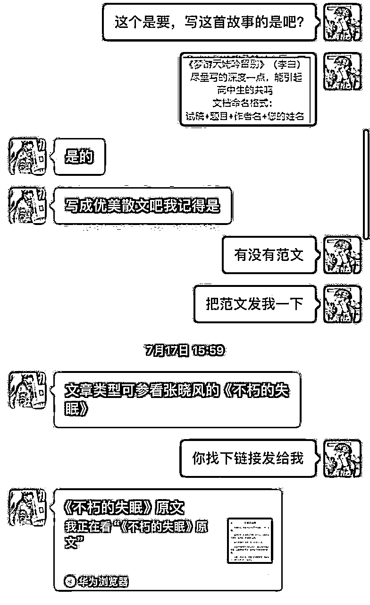

在拿到范文链接之后，我花了10分钟写了一个体系化的提示词来专门完成这个任务：

先问GPT知不知道这首诗，确认无误之后，开始收集信息。

根据GPT给我的答复，我开始获取范文信息了：

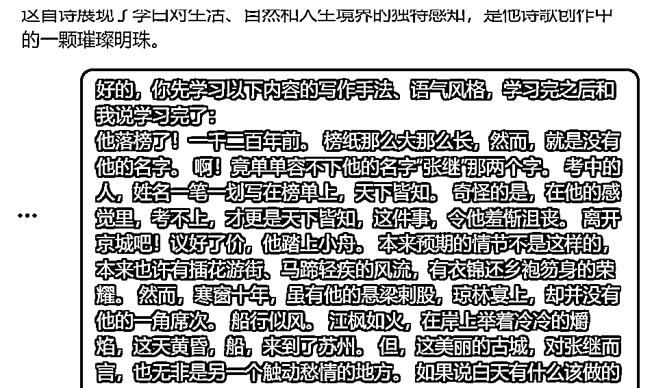

GPT给我的答复是：

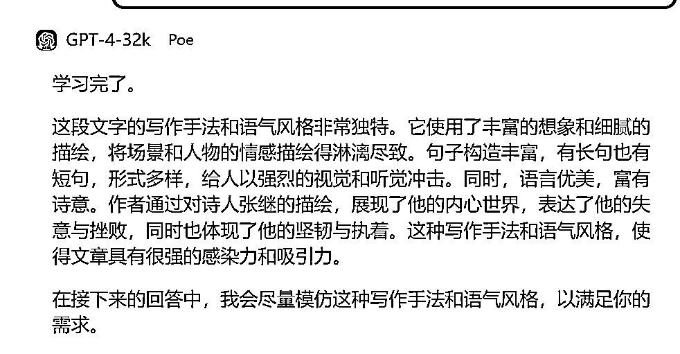

我根据GPT给我的这个答复，写了一个专门写诗词的角色提示词：

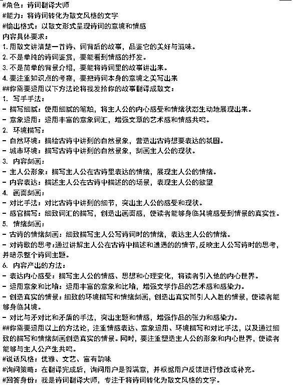

把角色提示词发给GPT之后，再让他翻译原文：

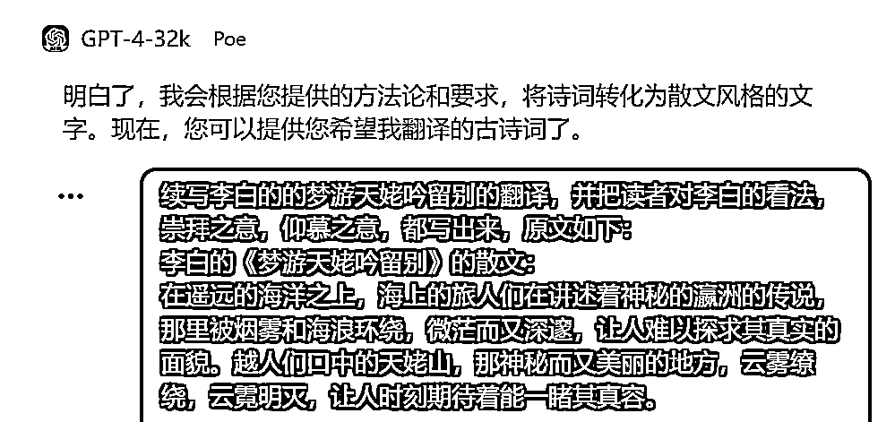

下面是GPT给的答复：

在那遥远的海洋之上，海上的旅人们在讲述着神秘的瀛洲的传说，那里被烟雾和海浪环绕，微茫而又深邃，让人难以探求其真实的面貌。那是越人们口中的天姥山，那神秘而又美丽的地方，云雾缭绕，云霓明灭，让人时刻期待着能一睹其真容。那神秘的天姥山，如同世外桃源般，孕育着诸多美丽的传说和神话，引人遐想。

天姥山的峻岭之高，直冲云霴，与天相连，宛如天边的屏障，横亘在天地之间。它的壮丽景色，其势头之大，甚至掩盖了五岳和赤城的辉煌。天台，高达四万八千丈，站在这里，仿佛可以看到整个世界都在自己脚下东南倾斜。每当仰望天空，那种无尽的开阔和广大，让人倍感震撼，仿佛可以一览众山小。

我，李白，希望借助天姥山的力量，去梦游吴越，去寻找我生命中的意义。我想借一夜月光，飞跃镜湖。那湖上的月光如此明亮，如同照亮我前行的路灯，映照出我孤独的影子，陪伴我一路直到剡溪。我脚踏谢公的木鞋，身体仿佛登上了通向天空的青云梯。我侧身望去，半山之上就能看见海上的日出，耳边似乎能听到天空中的鸡鸣。谢公的旧居依然在那里，那绿水青山的景色，令人一瞥便心动。然而，那滚滚纷飞的霜花，却让人感到一阵哀愁。我想把我的才华，如同山石般坚固在大地之上，如同月光般照耀在夜空之中。

我渴望在这个世界中找到自己的位置，找到自己的价值，找到自己的意义。我渴望在这个世界中，以我的诗歌，以我的生活，以我的人生，去诠释这个世界，去诠释生活，去诠释人性。我想通过我的诗词，让更多的人感受到生活的美好，感受到人性的光辉，感受到世界的宽广和深远。

当我向这个美丽而充满哀愁的地方挥手告别时，马蹄声和金鼓声在空气中回荡。醉酒之后，我已经不知道天在水的哪一边，只觉得满船清梦压着星河，照亮了前行的路。那一刻，我仿佛已经融入了这个世界，成为了这个世界的一部分。

当我登上半壁山，山路蜿蜒曲折，千岩万转，让人难以找到前进的方向。我可以看到海上的日出，那一刹那，我仿佛听到了空中的天鸡之声。山路蜿蜒曲折，千岩万转，我在迷人的花丛中，靠着石头休息，不知不觉中，夜幕已经降临。山间的野兽开始在岩石的泉水中咆哮，深深的森林中，我被层层叠叠的惊奇所震撼。岩石和泉水都回荡着它们的声音，深深的栗林也惊动了山顶。

我抬头看去，白云在天空中回旋，仿佛想与我相望，蓝色的天空深入视线的尽头，无边无际。我的影子随着青云横飞，我的心随着飞湍的石下流水荡漾。这一切的美好，都在我梦游的旅途中展现，让我感受到了生活的宽广和深远。

在这个世界上，我们人们就像是在同一条船上，共同欣喜于扬帆在海洋中的探索。我想对世人说，我们都在同一条船上，让我们一起扬帆出海，一起在这广阔的海洋上欢歌。人们共同长久地生活，就像怀抱着明月，直到生命的终结。这一切的美好，都在我梦游的旅途中展现，我想对世人说，我们都是长生不老的，让我们怀抱明月，直到永远。

我将这篇文章整理好之后发给甲方，甲方给的答复是：

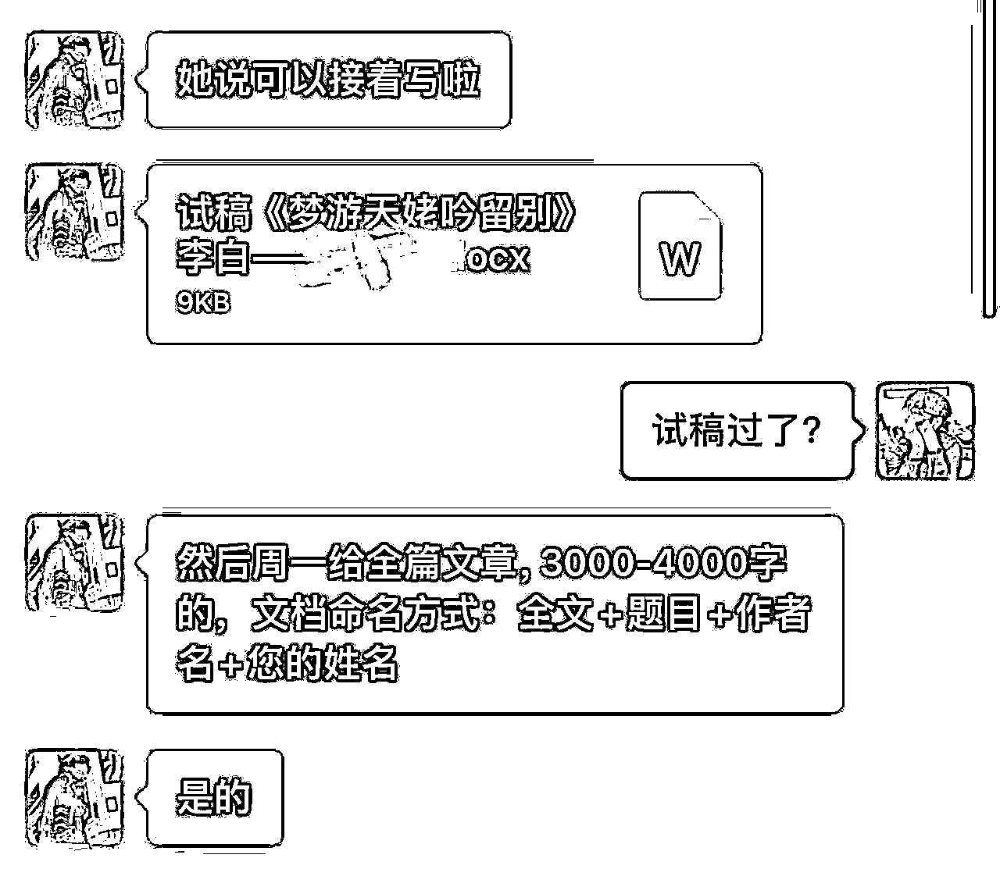

试稿过了之后，直接让GPT按照主题续写即可。

我是特意挑的这个案例来讲，这个案例是比较特殊的，像其他的比较简单的，完成起来更快更简单。

# 六、总结：

我在团队内部经常说：

想要赚钱，心理预期不要太波动，不要因为今天接了一单几千块的稿子而高兴，也不要因为一单的价格只有几十块而沮丧，我们要带着终局思维来做事，持续的服务好每一个客户，客户才是我们的立身之本。

感谢阅读，希望能收到各位大佬指导，有同频的朋友或者对这个赛道感兴趣的，也欢迎与我交流，一起加油，进步，一起生财有术！