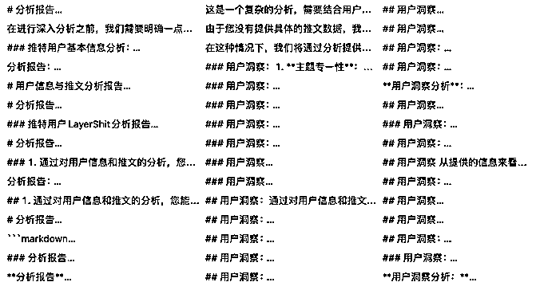

# 如何使用GPT-4做推特用户分析

> 来源：[https://ia0969wpr2.feishu.cn/docx/UAJod7O8oo8Fj4xIVlec5huFnhg](https://ia0969wpr2.feishu.cn/docx/UAJod7O8oo8Fj4xIVlec5huFnhg)

开始之前先说一下背景吧。过去一段时间里，我监控了推特上的一些特定的关键词和大V用户，一方面是获取有价值的实时动态；另一方面是收集匹配的素材，尝试学习做自媒体。到现在为止，积累了大概100多万条相关的推文和2万多篇文章。在这个过程中，也沉淀了22万个推特用户信息。这些数据奠定了本次分析的基础。

9月底的时候，我开始有针对性地对这些数据进行清洗。目标是从存量数据中筛选出高质量用户和推文。

以下分享是我使用GPT-4分析推特用户部分整个过程的梳理。

## 初始数据准备

最初，我是想关注近一年新注册且关注者超过1000，而且在AI和独立开发领域较活跃的用户。通过关键词判断和GPT分析语义，我最终筛选出了约1万个符合条件的用户。但是，这么多的用户手动关注并且逐个查看他们推文是一件很耗时的事，而且水分也比较多，然后我调整了思路，想通过自动化的方式拉取每个用户的所有历史推文，通过不同的角度分析账号，找到真正有价值的用户和高赞的推文，然后持续监控，获取高质量的一手消息。

所以，下面的数据分析都是围绕筛选出来的这些用户进行的。

这是清洗后的用户数据。：

## 用户粉丝数分布统计

把上面得到的用户数据导出后直接上传给 GPT的 Advanced Data Analysis ，然后按照自己关注的维度进行分析。这里其实没有什么prompt技巧，直接使用大白话讲清楚自己的诉求就OK了，现在的GPT-4完全可以理解，不需要一些很复杂看起来眼花缭乱的技巧。

下面是GPT的初步分析结果：

经过GPT-4初步分析和实际验证，以下是所有符合要求的用户信息统计：

超过1000粉丝的有10043个，其中一年内的新号是387个

超过5000粉丝的有4578个，其中一年内的新号是136个

超过1万粉丝的有2985个，其中一年内新号是81个

超过10万粉丝的有501个，其中一年内新号是12个

我先选择一年内注册且涨粉超过5000 AI领域的账号，作为例子进行后面的分享。

## 用户分析

为了更加准确和全面地分析这些用户起号过程，推文风格等，我需要拉取每一个用户的所有历史推文，然后把推文信息加工后发给GPT进行分析，关于用户的信息越全面，分析才能越准确。

这一步是花费时间最久的，因为推特严格的反扒措施，抓取用户的所有历史推文很困难，不过好在通过不停地折腾，终于还是成功抓下了这部分的数据。

接下来，我们需要围绕这些推文做一个简单的数据分析。由于 Advanced Data Analysis 没有联网，我们需要先将一部分用户推文数据导出到 Excel，然后上传到 GPT 进行离线分析。目标是使 GPT 根据需求生成可在本地可执行的代码以实现自动化。这样就可以在本地批量分析所有用户，不需要再在网页端对话了，直接通过代码批量生成即可。

以下是和GPT联调的部分记录截图，通过反复的验证这部分的数据分析是没有问题的，我想要的一些关键指标的计算也都是正确的。

目前我只统计了以月和周为单位用户的历史发推数量和点赞、评论趋势，还有用户最喜欢的发推时段，获赞量最高的时段（不过统计完成之后通过对比发现没有什么共性，这不算是个相关指标，就删掉了），根据这些基础数据我们还可以进行更多不同维度的数据的可视化，如果大家有好的想法欢迎讨论。

得到想要的分析结果后，再由GPT生成本地可以执行的代码，把数据源从Excel切换到数据库，这样就可以自动化分析所有数据了，不得不说，GPT的数据分析还是很给力的，从完成我的指标统计要求并且导出源码在本地调试成功，中间还使用cf搭建了免费的图床存储生成的图表，整个过程只用了不到三个小时，所有用户分析完成后，会生成一个包含所有数据分析结果的 Markdown 文件。

完成上面的用户基础信息的可视化显示后，接下来就是使用GPT-4/Claude 进行推文的分析了

## 内容评估

有了可视化的数据图之后接下来就是把用户的所有推文交给 GPT-4 或者 Claude 做分析报告了，现实中存在一个问题，就是每个推特用户都有至少几千条推文，推文数量最多的一个用户不到一年的时间发了两万多条推文，这么长的上下文即使是Claude也没有办法直接分析。上下文限制下我只能找出比较有代表性的推文了。

那就继续通过和GPT对话寻求建议吧，通过和GPT的多轮对话最终决定筛选推文的逻辑是：

*   用户所有点赞/评论/转推数量任何一个大于100 的推文，如果用户点赞超过100的推文超过了100条，则取前100条数据（实际结果显示2023年的新号中很少有超过100条的高赞推文）；

*   筛选出账号中评赞比比账号总体评赞比高30%的推文，比如用户总体评赞比为15%，则筛选出用户推文中所有评赞比大于22.5%的推文。

整理这些推文之后我把用户的所有推文信息扔给了Claude，但是实测下来，还是会有一些胡说八道，这不符合我的预期，我的要求是尽可能地准确，不能出现胡编的数字，所以我先又让GPT写代码提取出来了用户的基本信息，组成了一个基本信息模板，然后再次结合推文信息进行分析。

首先根据账号创建日期结合拉取推文日期与总发推数计算每天的推文数量、推文总评赞比等基础信息。通过添加基础信息+推文信息，由GPT-4生成脚本组装prompt。模板如下图所示：

有了用户的基本信息后，这次无论GPT-4还是Claude，输出结果和以前相比都靠谱了很多，然后我先后调试了三个版本的prompt，分别使用GPT-4和Claude生成了多份分析报告，最终比对下来发现相同prompt下还是GPT-4的分析和意见更准确和有建设性一些，但是语言表达上确实不如Claude 生动。

以下是由GPT-4生成的最终版的分析报告：

## 总结

做完上面的工作之后，我又筛选出来 500条 AI领域点赞数大于1000的推文信息扔给GPT分析，这部分数据可能更能体现出哪些内容更受欢迎。以下是GPT分析后的建议（说的比较泛，但是对推文的总结还是很准确的，现在推特上面这部分内容是最受欢迎的）：

1.  及时关注并发布AI领域的最新动态，满足用户的信息需求

1.  发布与用户需求相关的实用信息，如免费的教育资源、行业内的就业机会，满足用户的学习和心理需求。

1.  提供具体、实用的学习资源，尤其是免费的资源。

1.  在推文中包含明确的行动指南，告诉用户如何获取这些资源。

1.  维持高频的推文频率，保持与粉丝的互动。

另外分析报告中还是不全的，没有提到这些用户的变现，因为限于上下文没有提供给GPT这部分信息，同时我也没有想到很好的办法组织这部分数据。通过抓取到的数据显示，部分营销号是通过免费为噱头引流，然后gumroa成交，我提取了所有推文中的gumroad和其他的站外成交链接，理论上可以通过Python定期去拉取gumroad的成交数，结合用户的评论和互动分析一个转化区间，但是感觉意义不大。另外还有一些是订阅newsletter的形式，后续可能会有精准成交。

## 后续计划

上面分析的这些账号都是今年刚刚注册的，为了吸引流量，有一些夸张噱头和名不副实的内容。所以接下来我会针对所有的AI领域的专家、或者粉丝量大于2万的用户，把他们所有推文拉取下来同时进行分类，对互动高和点赞数多的推文进行自动化整理分类。

同时后续要对增长最快或者典型用户使用GPT-4和Claude进行最佳实践分析，在整个过程中，希望能得到一份推特运营的最佳手册，指导自己运营推特账号的同时积累经验。

另外在抓取的过程中，除了AI领域的，还积累了一些独立开发的工具分享、产品经验分享、产品收入分享、SEO领域的一些高质量推文和账号，目前也在持续追踪，现在已经自动化抓取并提取了产品链接和产品分类，并与社媒账号对应，但是目前清洗质量参差不齐，后续还需要人工核对

补充

所有的数据都是9月初，所以部分账户的关注数和推文数量都有了变化，但是因为整个过程都已经自动化，所以重新拉取用户信息后基础数据和统计分析都会自动更新，如果大家感兴趣，我会在后续更新，标注这些用户近一个月内的涨粉和发推情况。