# 跨越2000公里，从曹县到微信之父张小龙故乡的经历。体验到日入过万

> 来源：[https://we0l7l1w73.feishu.cn/docx/UjkVdyuyHoaVxtxARI4cPQlTn4b](https://we0l7l1w73.feishu.cn/docx/UjkVdyuyHoaVxtxARI4cPQlTn4b)

## 开始做抖音项目

来到洞口县的起因，是自己22年正在做视频号短视频带货的时候，混剪视频，绿幕无人直播，官方平台打压的厉害，出单很低还老是被封号，心想年前还有两个月，没搞到什么钱，不是滋味，也是一直再找出路，11月3号看到了枫哥写的一些文章，当时做抖音短视频投流项目，做的风生水起，自己当时看文章就去操作，开店，混剪视频，开始发作品，投放随心推，一套流程走完，没有看到什么结果，立即决定报名付费过去学习，22号厚着脸皮去问，问之前主动转账几千，下面截图没显示出来，当时枫哥没收，后来相处久了后聊这个事情，说是看着刚毕业没多久，想着能帮就帮下。当时预期准备的是过去十天半个月的就可以了，没想到这一去，直接呆了将近一年。22年十一月过去的，23年十月正式回来的。

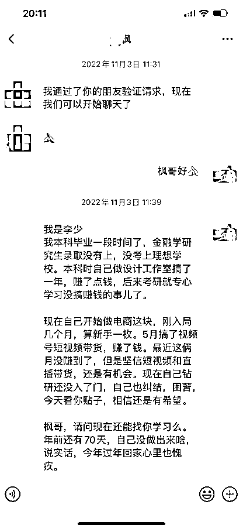

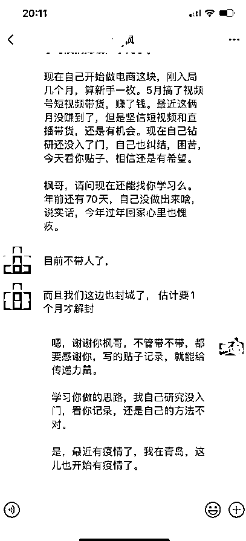

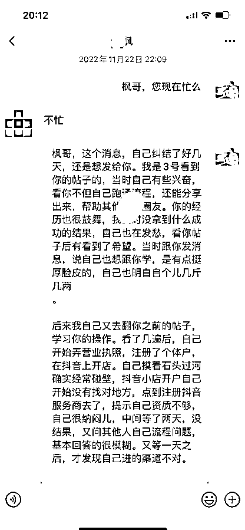

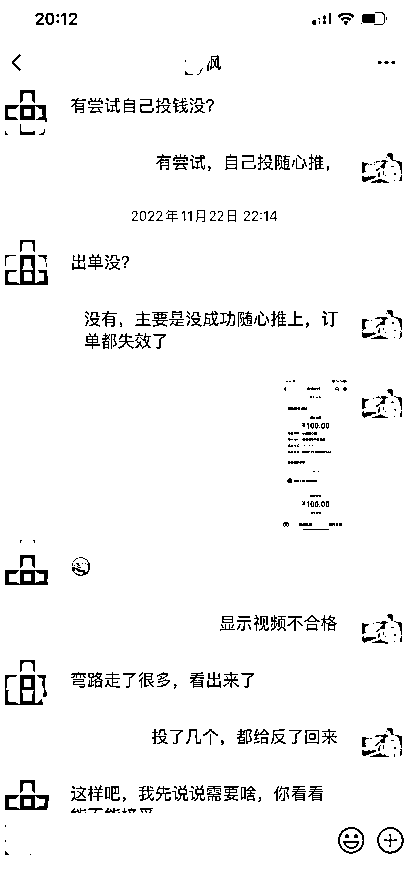

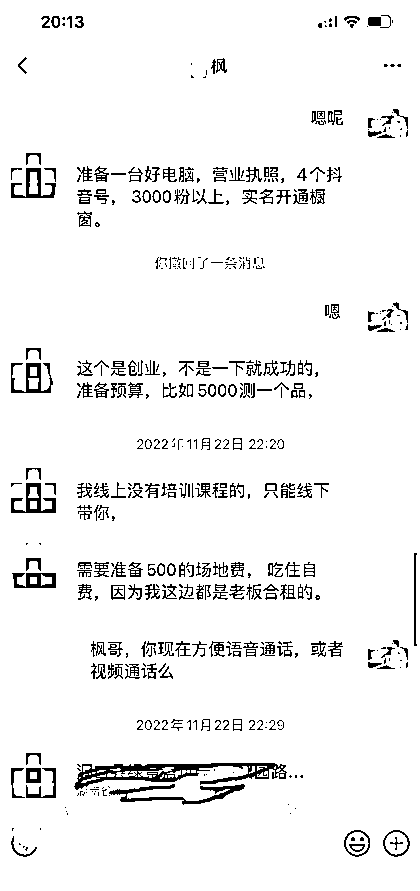

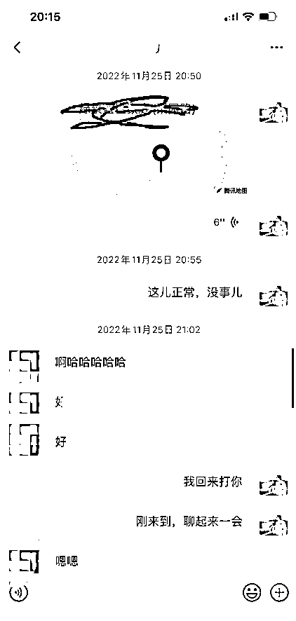

当时走到洞口，看到已经有人和我一样线下过去学习的，已经呆了一个多月，都称呼他黑仔，人很牛的，当时他起了一个品，一月卖了好像四十万，盈利了七八万吧，整个流程他都跑通了，和他相处两三天他就离开洞口回湖北老家了。看到他在洞口拿到成绩，很有信心继续做下去了。我去到洞口后，后面也陆陆续续的过去了七八个圈友，来自五湖四海，具体有河南 安徽 贵州 福建 广州等，都是通过枫哥星球文章结识的。去了没有几天，当时正在测年货品，12月1号就有某重要人物去世，全网黑白颜色，当时准备产品，视频素材内容很喜庆，发布后基本都直接限流。后面等到了12月中旬，发现了一个保暖帽子品，流量很好 ，我们当天上架商品，剪辑素材，发布视频，追这波热度，直接卖出来了一波，当时还有疫情，12月19号开始合作的快递封禁部分省份，那段时间，千川广告还在投流，每天看到消息就是快递封了某省某市区，哪个客户又过来催发货，退货，售后问题很多，每天忙碌又刺激。等到了22号左右，决定彻底停止投流，只处理售后情况。（下图是自己当时做的店铺）

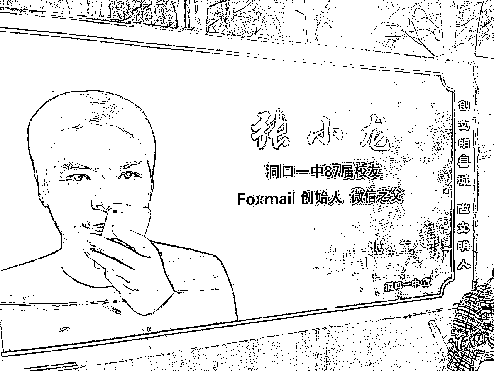

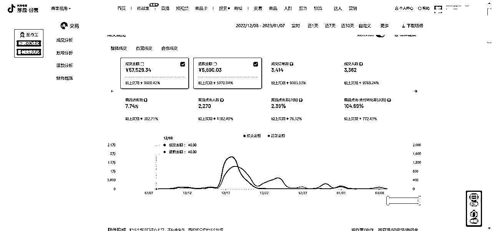

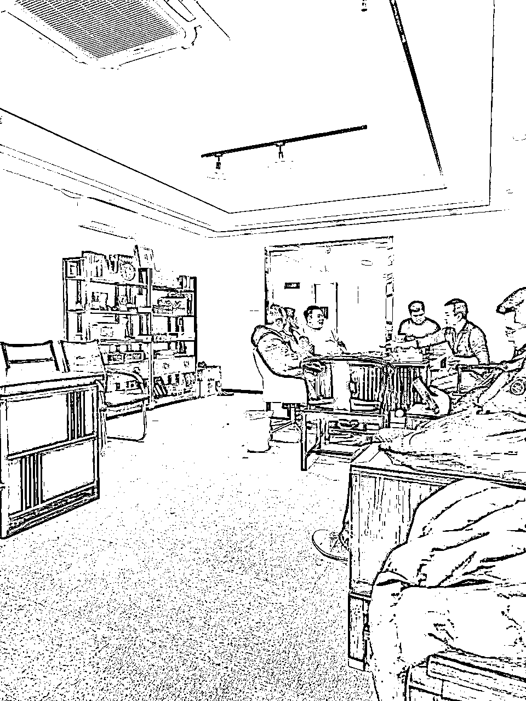

在1月初，当时的办公室里，做抖音的几个圈友基本都停下了，有个河南的圈友，说广州认识玩抖音的比较厉害的团队，过去学习下。随机五六个人出发，广州那边的团队直接是一周投了8000万，不是偶然的一周，基本每周都是这样，线下也看到后台的数据。做的化妆护肤品类，公司500多号人，玩的贴牌，后面转私欲再引导转化成交，做的很猛，拿出来的零头也是工作室难吃下的。随后临近过年，回到山东后，写了第一篇文章，分享了这个项目，抖音短视频投流，当时写的很详细了，也是枫哥愿意分享出来，帮助更多的圈友，当时这个项目，在外面收5000 8000的都有。

过了年后 2月份，几个圈友说，今年开始在短视频带货的基础上，搞起来直播，又一次出发去洞口了。年前的几位圈友一起过来了，这次人员增加了，在三月初租的新的办公室。

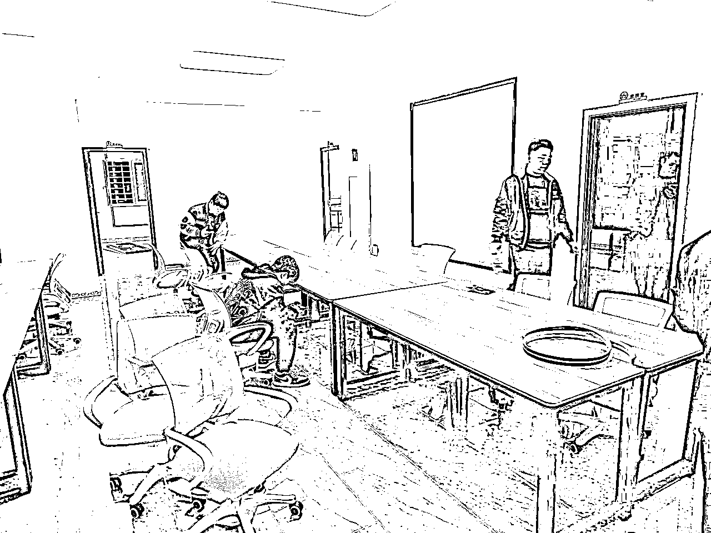

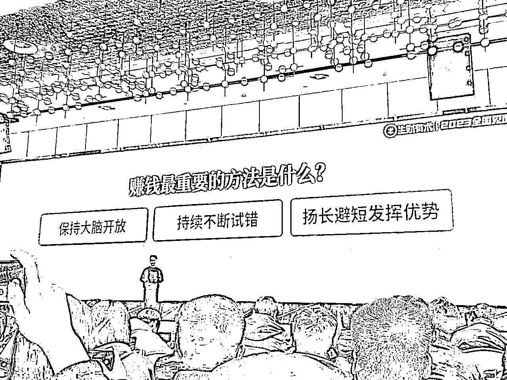

其中三月份，自己一直在跑劳动合同品，这个品的毛利85，投流的净利是40左右，投产的ROI很香。是平台限制这个品的素材，跑到后面跑不大，流量限制了。

三月底去了参加生财线下活动，遇见了亦仁哥，第一次参加活动，有些感到社恐，也看到了搞互联网项目的人很热情，搞钱思维都很活跃。 见面会那天感触最大的就是，一起吃饭的时候，圆桌互相介绍自己，有些月入几万，几十万，甚至上百万的人很平静的和你说话，还和你年龄差不多，受到很大的刺激，赚钱真的要趁早。线下见面会也看到了钱南兄弟，聊了几句，人挺帅，个子长得很高些，搞钱也很猛。

回去后4月加紧搞抖音项目了，玩的是短视频投流，能不能爆起来很吃品和素材，品完全就是看命了。哪怕同样的两个店铺同时做，发的素材基本一样，结果就是一个店起不来，玄学很多。做短视频带货，品决定能不能卖起来，素材决定爆的程度，投流决定的利润。四月自己测了俩个三个品，每个品成本3000左右，都是亏着的，ROI跑不正。看到黑仔当时跟爆款跟上了，4月卖了近百万的GMV ，当时也找他聊方法思路，每次都是半夜通一两个小时电话。在5月上旬，又跑了四个品，ROI还是不正，想办法追爆款，跑新品，混剪去重换模板十几个，最后的结果都没有跑正，当时很难受，很沮丧，那几天吃饭都没有动力，吃饭都觉不出什么味道，有次直接在床上躺平了一天，那段时间自己身上的资金到负的状态，心里压力很大，一直看不到正反馈，也是迷茫。我们这边也试过，同时五个店跑同一个品，最后只有一家是跑起来正的，只能用玄学解释。5月底，当时是旁边的“村长”选了一个防晒新品披肩，我说那也跟着再试最后一次吧，结果我跑起来了，他没有跑起来。6月七月一直跑这个披肩产品，夏季防晒品，赶上了好时候，那时候也能持续每天卖几万，有两三千的利润。

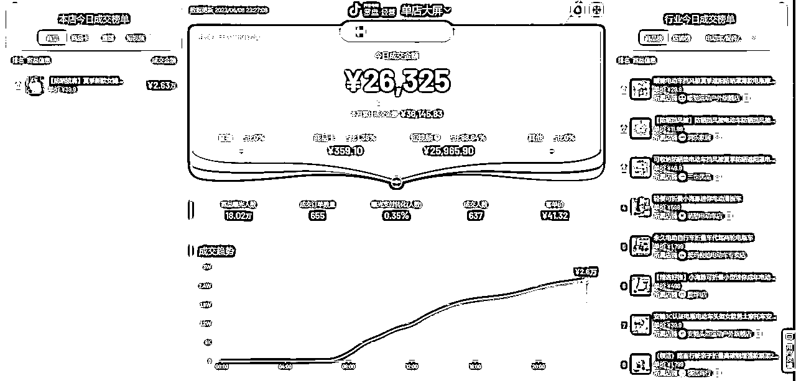

接下来抖音在7月开始，抖音平台的视频检测规则变为严格，原来是检测5秒左右的片段，现在改成抽查随机1-3秒内的画面重复，只要发现重复就判定视频搬运，自己原来有些播放量几百万的几条素材，开始被判搬运，在八月账号发布的爆款素材开始被限流，自己的ROI又开始下降，直接到了1.4左右，没有利润了。到了8月中旬开始放弃抖音项目。后面再有圈友问我抖音问题的时候，就直接回复不建议了。因为现在的开店自己短视频带货投流利润太薄了，自从商品卡开始变得普及，每个用户下单后，平台会自动弹出同款商品，有的同款卖价更低，本来就是玩的无货源情况，你卖19.9 同行直接卖9.9做达人自然流佣金模式，对抖音投流卖百货品的店很不友好。就算卖出100万GMV 最后一算净利才刚7-8万，甚至有的品会更少，利润更薄，做起来也是累些。

## 再次做视频号项目

上面说了这么多，没有提到直播的事情。直播是在视频号项目做起来的， 8月中旬视频号掀起来一波热度，有个卡特效短视频带货，很多人下场，当时自己也开始参与其中。买来几个手机拿自己账号开始做，第一次拿自己账号直播，纯自然流一小时卖出了129，佣金64，直接比抖音开店卖货利润高太多，看到了机会，就开始专攻这个项目了。视频号里面的运气，玄学成分更多，自从卖出129之后，后面的七八个号都没有出单，直播半小时一小时就没人了，第二张图是那段时间经常碰到的情况，当时新入局，没及时找到解决这个问题办法，后面才知道视频号做直播可以拉时长，视频流量起来，直播依旧会出单，那几天是很玩心态的阶段，租号不出单，也是没收入状态。看到圈友还有很多视频号同行发的数据，别人能跑，自己一样能跑出来，当时很相信这个项目可以干，接着继续上号发素材，打品。下面这个是在9.5号卖出来的，当时有四个视频破十万播放量，直播8个小时，卖了一万多，当天的佣金是6500，一天赚几千块的快感，又再次开始了。

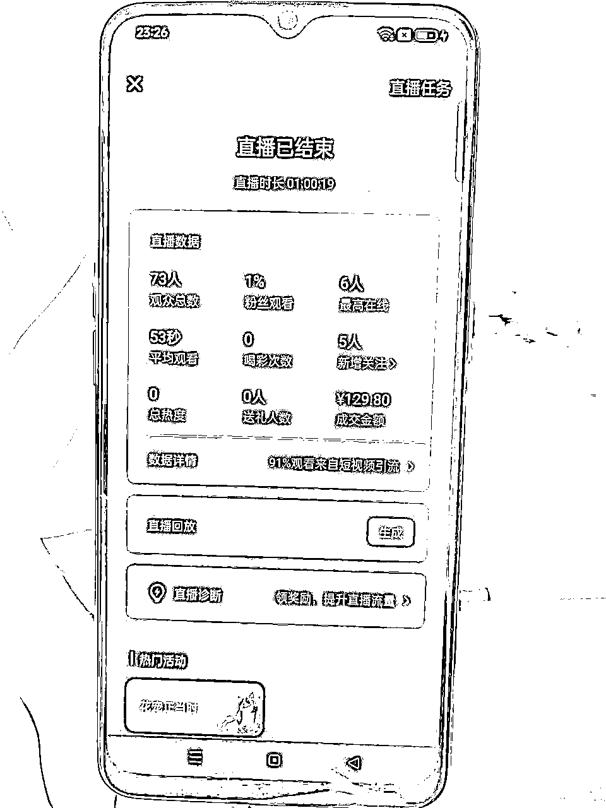

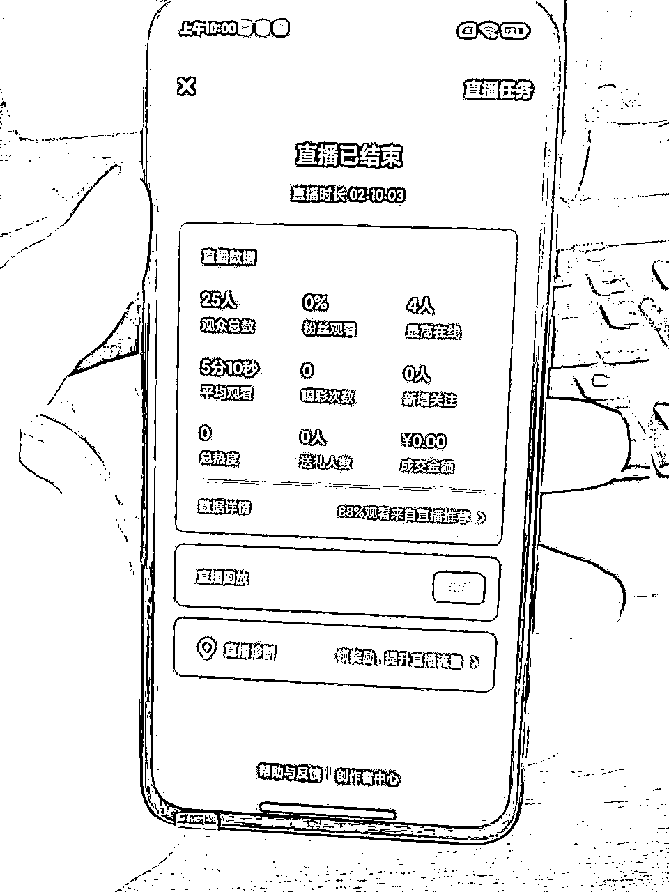

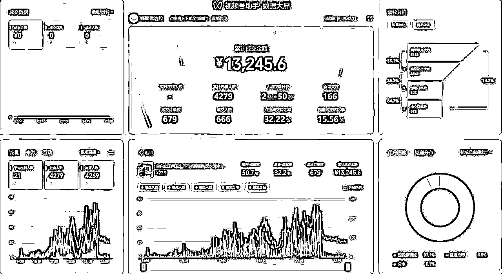

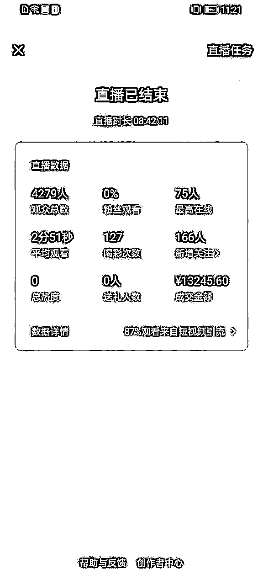

视频号里面一天赚几千块，在很多同行眼里，并不罕见，困难的是一直跑号废号的过程，很让人心累，拿来的号用技术方法卡，如果跑不起来，第二天基本就是废了，不是每个账号都可赚到钱，还是有很多视频又流量，直播间不出单的情况发生，没有正反馈的过程，很考验人的心态。

视频号是依托微信，再视频号上面做混剪视频带货，本就是对着微信平台干，平台平常睁一只眼闭一只眼，不是很严重的情况都容许存在，平台时不时的检查下，一些所谓的“技术” 卡封面 卡特效 双卡封面 半卡封面 安卓换特效等等，平台上清理一波又一波，打击的情况一时松，一时严格，这就是平台的属性，视频号规则也经常换，导致很多小白刚进来看到别人挣钱，不知道的一些坑，就直接踩到了，账号限流，账号封禁等情况出现。

到九月中旬，当时的卡特效技术就被和谐了，再发视频基本就是没流量，或者爆不起来了，从9.6号到9月底基本上没怎么出单，没有大爆过了，算了下租了30多个号，直播间卖的才几百，几千的。也是不怎么赚钱，后面枫哥和这边的其他圈友开始准备做新的项目。在哪儿就剩下自己一个人搞这个项目了，看到当时认识的一些同行，看着一直在爆单，每天卖几万的发生，坚定项目可以继续做，我是一直死磕，依旧相信还会再做起来。后面不断测品，不断测素材，没有卖起来的时候是各种焦虑，压力大，失眠，甚至半夜去跑步放松。最后是剪辑了几十个脚本跑出来一个新作品，三天卖了十万多GMV，佣金是隔日50左右。也就是那三天，自己一人直播，每天睡五六小时，吃了一波流量，体验到了日入过万。

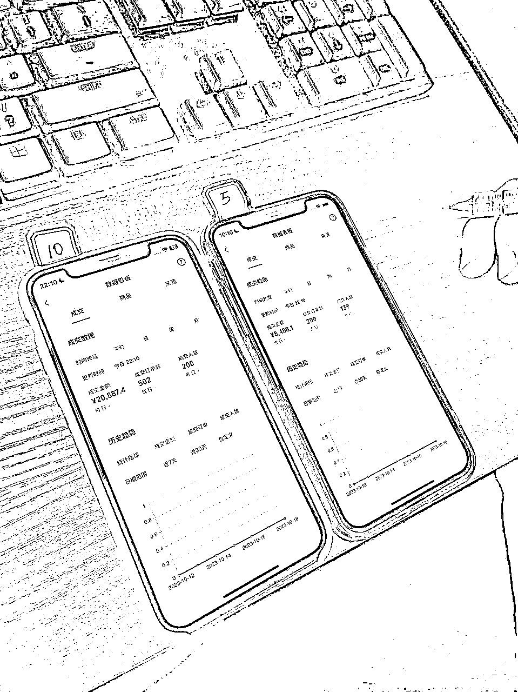

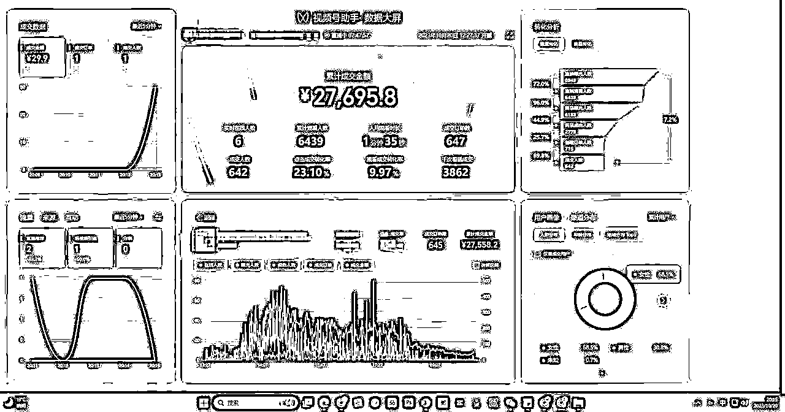

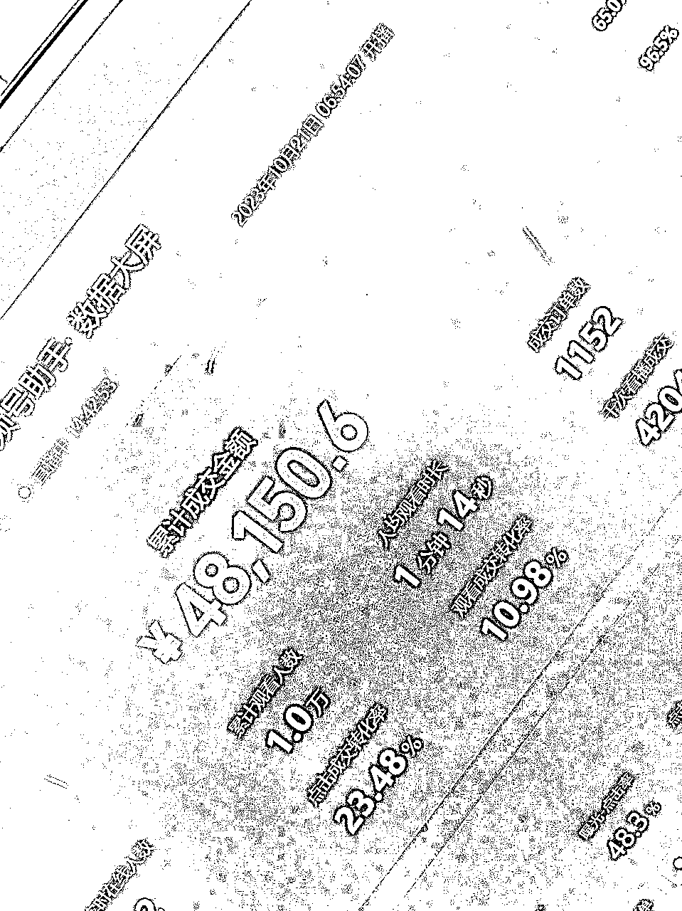

直播那三天真是连轴转，视频号直播这个项目，找品，剪视频，直播，一个人独立做，每天十几个小时坐着，又累又刺激。例如直播的时候，直播间不能断人，中间离开超过三分钟就会被平台检测到，弹窗提醒。如果想深入扩大这个项目，需要招人解决。

也知道星球里面，目前有很多圈友在做这个项目，可以一起交流。做短视频投流带货，混剪视频直播带货，原创视频投流直播带货，都是不同的玩法。现在市面上有很多的所谓“技术”，只想说，万变不离其宗，电商带货的本质还是品，短视频的本质是素材内容，品和素材是王，其他的技术是辅助，素材能起来的还是一样能起来。河南的一个圈友，只卖一个牛羊肉料包，纯混剪，后面达到了2000万播放，账号一周卖了近50万GMV，账号也是没有被判违规，一直再活着目前还在直播。

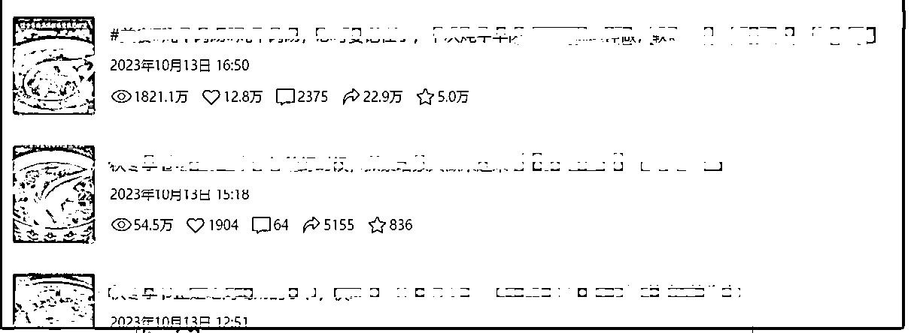

有人说自己没有直播过，不好意思上镜，说话紧张什么的，只想说，谁都是从迈开第一步开始的，百万的大佬也是从赚到一块起步，靠自己的行动去赚钱，没什么大不了的，想的很多问题，在实践的过程中很多都大概率遇不到，就算遇到，只要想解决，一定能找到办法。视频号里面有50岁的老人都在直播卖东西，还有啥理由说自己做不了的呢。这个老哥碰到好几次他的直播间 经常看到他直播到半夜，有时候白天眼睛睁不开还在直播，观众都劝说让去睡觉。

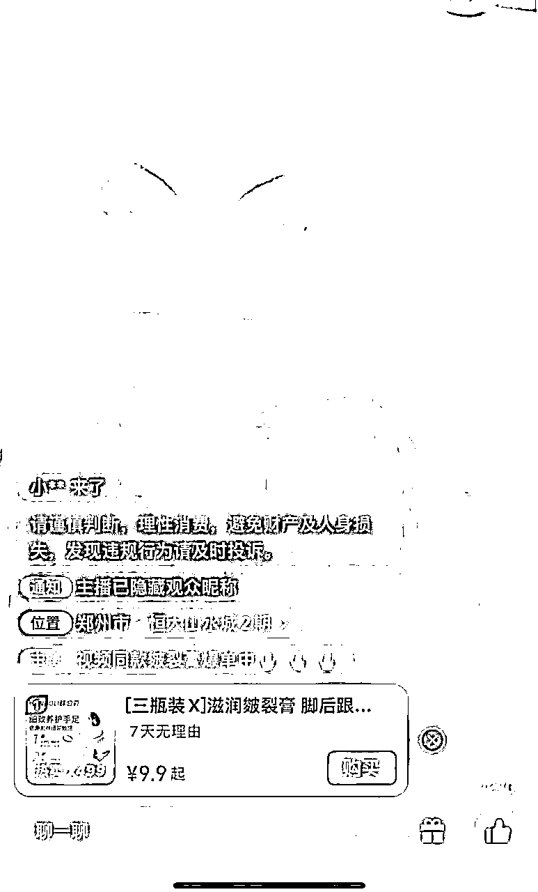

这个文章写出来，一边分享自己的经历，一边也是记录自己的电商过程。抖音入局晚些，阴差阳错的赚钱，亏钱，赚钱，主打了一个陪伴，走一个付费投流流程。视频号里面，一直不断测品，起起伏伏的，也在和几个同行不断交流往前摸索。视频号平台不止可以卖货，还有很多可以延伸的项目发展。相信只要还在牌桌上，就一定有机会的，共勉。决定回到山东青岛，继续做视频号项目，找人，找场地去发展起来，又是一个新的开始。