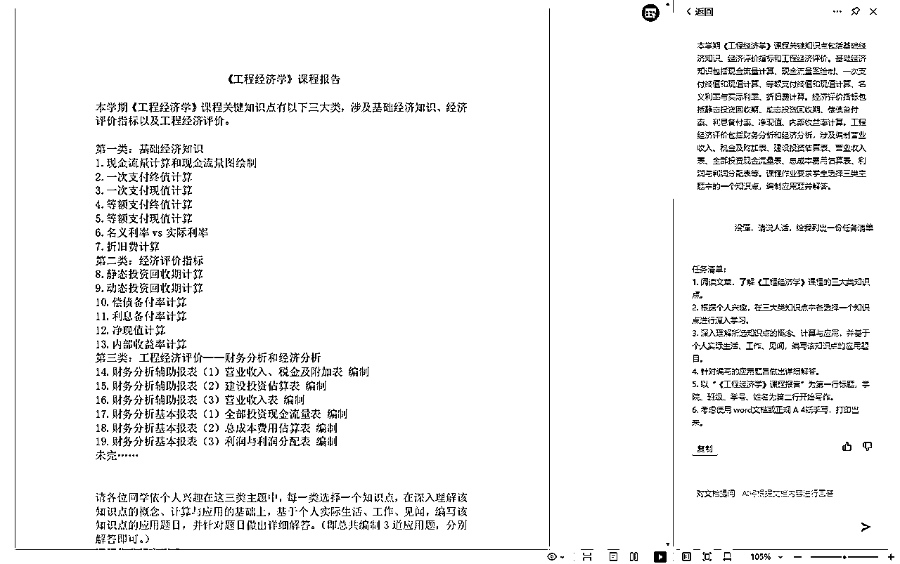
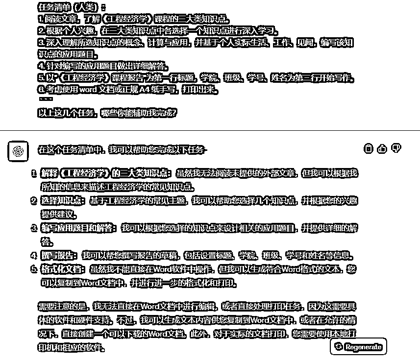
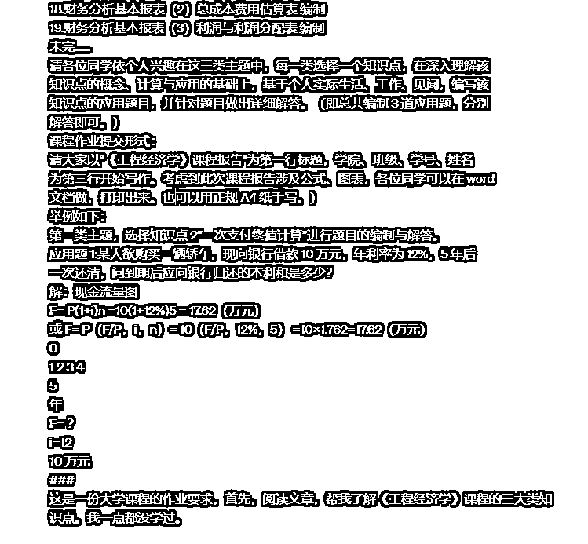
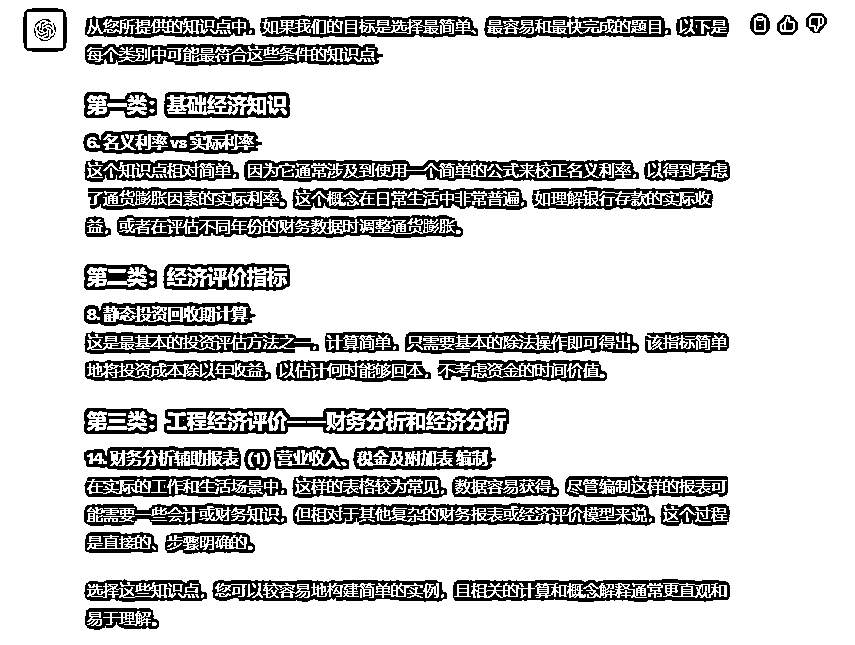
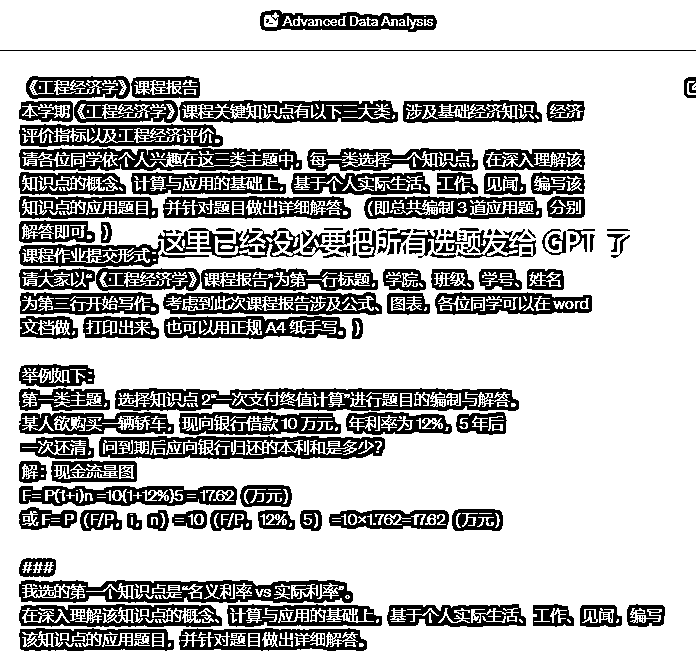
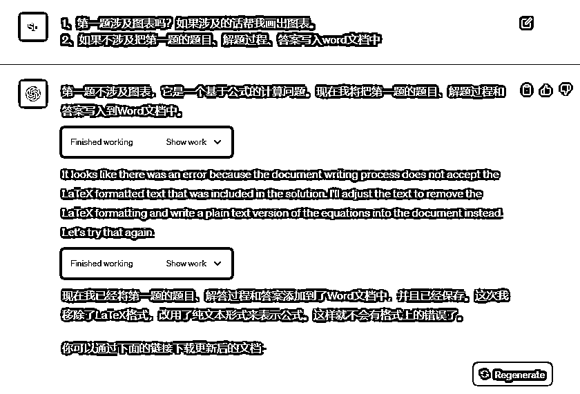
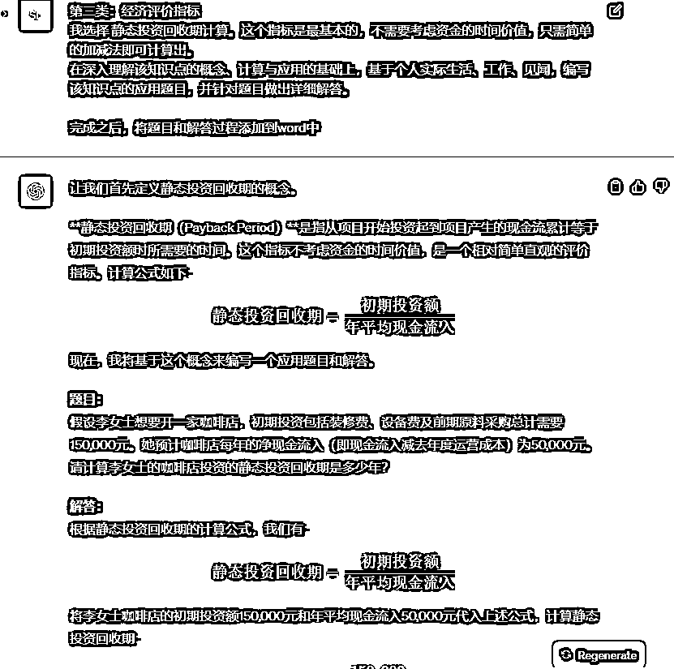
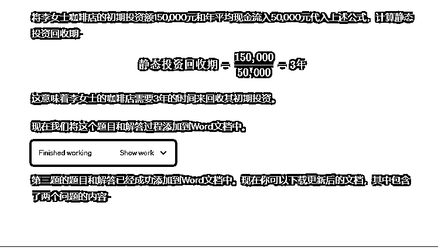
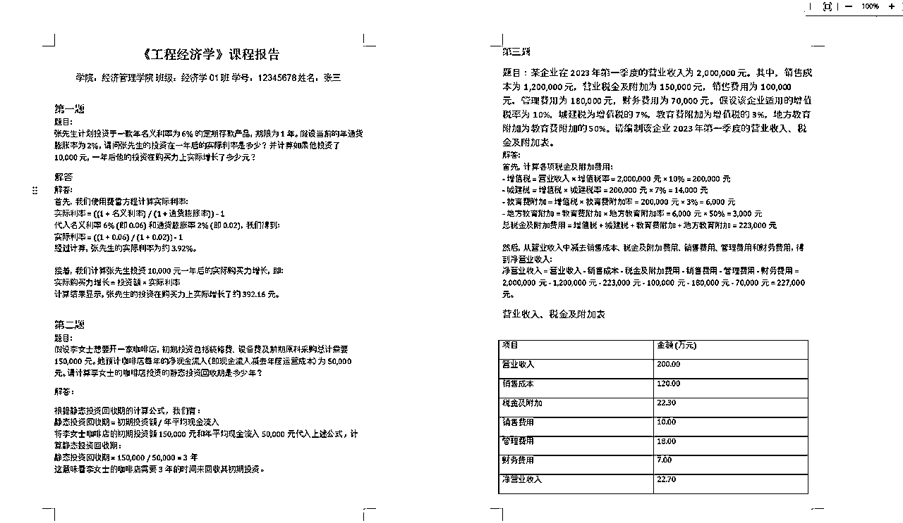
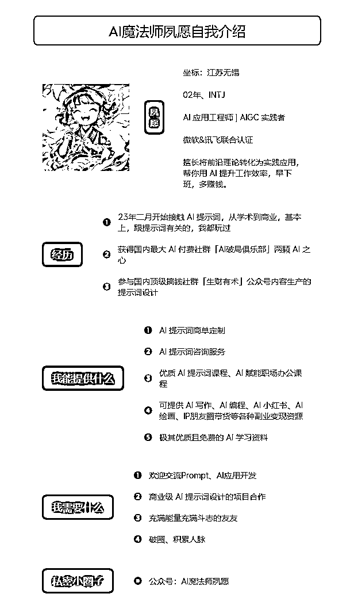

# 用 AI 化繁为简，解决复杂问题的指南

> 来源：[https://zi6nfl20s5u.feishu.cn/docx/V7XqdsHZqoVf6DxgBTWcskCWnjg](https://zi6nfl20s5u.feishu.cn/docx/V7XqdsHZqoVf6DxgBTWcskCWnjg)

事情是这样的，本来我只是想简单地记录一下一个 AI 提示词工程师拿到一份作业后是怎么优雅地解决的。

但是，写完之后发现能分享给大家的东西就太少了，突然联想到了 Prompt Chian（提示词链），于是有了这篇文章。

在阅读这篇文章之后，您将能够：

1.  掌握分治法的核心概念： 理解如何将大型复杂任务分解成小型、可管理的部分，从而简化问题解决过程。

1.  学习Prompt Chain的实际应用： 通过实际案例，学习如何设计有效的 Prompt Chain 来协同多个 AI 工具解决复杂任务。

1.  提高问题解决效率： 获取一套可直接应用于日常工作中的方法和技巧，以更高效率解决问题。

1.  认识到人工智能的局限： 明白 AI 的工作原理以及如何在现实中根据其局限性调整您的任务策略。

1.  加深对 AI 和人类合作的理解： 了解如何在人工智能和人类智慧之间找到平衡点，实现最佳的协作效果。

1.  提升逻辑思维能力： 培养将复杂问题系统化、逻辑化处理的思维方式。

1.  激发创造性思考： 通过对 Prompt Chain 的理解和应用，启发您在遇到问题时能够创造性地思考解决方案。

无论您是 AI 领域的初学者还是希望提高现有技能的专业人士，这篇文章都将为您提供宝贵的洞察和启示。

让我们开始吧~

# 一、什么是Prompt Chain

首先，我用 WPS 打开这份文档，密密麻麻的一团文字，一个一个字去阅读的话效率太低了，所以我调出 WPS AI ，让 AI 帮我总结文档、列出任务清单。

任务清单（人类）：

1.  阅读文章，了解《工程经济学》课程的三大类知识点。

1.  根据个人兴趣，在三大类知识点中各选择一个知识点进行深入学习。

1.  深入理解所选知识点的概念、计算与应用，并基于个人实际生活、工作、见闻，编写该知识点的应用题目。

1.  针对编写的应用题目做出详细解答。

1.  以“《工程经济学》课程报告”为第一行标题，学院、班级、学号、姓名为第二行开始写作。

1.  考虑使用 word 文档或正规 A4 纸手写，打印出来。

列出任务清单，是工程思维的工程分解结构：把一个整体拆成很多个局部，然后聚焦每一个局部，每次解决个问题，而每一个局部又能当成一个整体进一步拆分。

到这里，我们就能引入 Prompt Chain 了。

Prompt Chain（提示链）是一种用于解决复杂任务的方法，它通过将一个大任务分解成多个较小的、更易管理的子任务来工作。

每个小任务由一个单独的 Prompt 来指导，这些 Prompts 相互连接，形成一个序列或者链条，每一个环节都是对前一个环节输出的继续处理或者是一个全新的任务，最终协同解决整个复杂任务。

在单一的 Prompt 可能因为 token 长度限制、任务流复杂度或其他因素导致鲁棒性下降的情况下，使用 Prompt Chain 可以有效地提高效率和输出质量。

它允许每个子任务集中处理特定的问题，这样可以减少单个 prompt 中信息的混乱和重量级处理的需求，同时也便于在调试过程中定位问题。

说人话就是，现在的 AI 模型太拉了，无法靠一条 Prompt 解决所有问题，需要写多条 Prompt 逐个解决。

此外，Prompt Chain 还可以在产品化和成本控制方面提供灵活性。大任务分解为小任务后，不同的小任务可以根据成本、任务特性等因素选择不同版本的模型进行处理。

例如，在某些不那么关键的任务上使用 GPT-3.5 模型，而在关键的核心任务上使用更高级的 GPT-4 模型。

在本次实践中，显然总结文档、列出任务清单就不是那么关键的任务，完全不需要用到 GPT4，所以我用的是 WPS AI。

需要注意的是，Prompt Chain 并不是万能的。有些任务的某些部分可能超出了大型语言模型的能力范围，这时可能需要其他非模型的工具来辅助。

不管是提示词的思维链技巧还是我们讨论的 Prompt Chain，本质都是把任务拆分。

# 二、阅读文章

首先，在正式开始行动之前，先规划一下，哪部分可以让 AI 辅助，哪部分只能靠人类独立完成。

谋定而后动，事半功倍。

1.  阅读文章，了解《工程经济学》课程的三大类知识点。

由于 WPS AI 的推理能力、逻辑能力较差，我把文字复制发送给 ChatGPT，让其带我了解这些知识点。

（协同多个 AI 工具解决复杂任务）

Prompt1:

这是一份大学课程的作业要求，首先，阅读文章，帮我了解《工程经济学》课程的三大类知识点。我一点都没学过。

嗯，是我看不懂的东西，但是我只是为了完成任务，并不是真的要去学，所以这部分直接略过。

# 三、选择知识点

1.  根据个人兴趣，在三大类知识点中各选择一个知识点进行深入学习。

既然只是完成任务，应付了事，那肯定是要选择最简单、最好做的知识点。

Prompt2:

考虑所选知识点的概念、计算与应用，并基于个人实际生活、工作、见闻，从这三大类知识点中各选择一个最简单、最容易完成、最快完成的知识点。只选择出知识点即可

### 第一类：基础经济知识

名义利率 vs 实际利率：

### 第二类：经济评价指标

静态投资回收期计算：

### 第三类：工程经济评价——财务分析和经济分析

财务分析辅助报表（1）营业收入、税金及附加表 编制：

# 四、编写与解答

1.  深入理解所选知识点的概念、计算与应用，并基于个人实际生活、工作、见闻，编写该知识点的应用题目。

1.  针对编写的应用题目做出详细解答。

由于选择的知识点比较简单，AI 可以把编写题目和解题放到同一个步骤中解决。

注意，我们刚刚已经提问了两个问题，token 可能会超出限制导致 GPT 忘记上下文，于是我们应该新开一个聊天窗口，重新发送提示词。

我新开了一个 Advanced Data Analysis 窗口，因为这便于 GPT 计算数字、创建 word 文件。

补充信息：GPT 的数学能力较差，如果不使用插件计算，容易出错。

我们需要解决三个知识点，很明显，这里又能把任务进行拆分。

按照刚才的任务清单，接下来的步骤应该是解决第一个知识点，但这是从人类的角度去出发的。

对于 GPT 来说，它应该先创建一个 word 文档。

因为，GPT 写 word 文档只能从前后往写，不能从后往前写，也就是说，如果先把题目和答案写到 word 中，GPT 是无法把封面页（包括姓名、学号等信息）写到第一页的。

## 一）第一个知识点

Prompt3:

我选的第一个知识点是“名义利率 vs 实际利率”。

在深入理解该知识点的概念、计算与应用的基础上，基于个人实际生活、工作、见闻，编写该知识点的应用题目，并针对题目做出详细解答。

接下来，让 GPT 把第一个知识点的题目和答案添加到 word 文档中。

## 二）第二个知识点

Prompt4:

第二类：经济评价指标

我选择 “静态投资回收期计算”。这个指标是最基本的，不需要考虑资金的时间价值，只需简单的加减法即可计算出。

在深入理解该知识点的概念、计算与应用的基础上，基于个人实际生活、工作、见闻，编写该知识点的应用题目，并针对题目做出详细解答。

完成之后，将题目和解答过程添加到 word 中

前面我把 GPT 写答案和写入 word，分两次对话完成，是因为我怕 GPT 在写答案时会输出很多的内容导致一次对话无法完成任务。

但是，看了第一次的回答之后，我明白这并不存在我担心的问题，于是我把 GPT 写答案和写入 word 放到了同一个对话中。（要懂得灵活变通啊）

## 三）第三个知识点

Prompt6:

下一个：第三类：工程经济评价——财务分析和经济分析

14。 财务分析辅助报表（1）营业收入、税金及附加表 编制：

由于 GPT 已经执行了两次同样的任务，它已经学会了怎么做，所以现在我们就不需要把提示词写得这么详细了。

输出结果跟上一个差不多，我就不贴图片了。

# 五、输出报告

将更新了第三个知识点之后的 word 文件下载到本地，打开，检查一下。

没啥问题，人工调整一下格式，就完成任务了。

# 六、总结

通过这个案例，我们不仅学习了 Prompt Chain 在解决具体任务的应用，而且揭示了分治法思维在任务管理中的普遍价值。

这种方法论不仅适用于处理文档整理、报告编写等文本任务，其精髓在于将复杂问题分解为简单部分，可以广泛应用于多种工作和生活场景。

在项目管理中，分治法可以帮助我们把一个庞大的项目分解为多个阶段和任务，每个阶段都有明确的目标和里程碑。

在软件开发中，这种思维可以帮助我们将一个复杂的功能需求分解成一系列的迭代和更新。

在学术研究中，我们可以通过分解将一个广泛的研究主题划分为几个可行的研究问题，再逐个攻克。

即使在日常生活中，无论是规划一场旅行、安排一次大型活动，还是进行个人时间管理，分治法都能让我们更加有序和高效地处理任务，减少压力和不必要的混乱。

这种方法论强调了策略性分解和逐步解决问题的重要性。在复杂性面前我们不再是束手无策，而是可以通过智慧和工具的结合来克服困难。

对人类来说

任务清单（人类）：

1.  阅读文章，了解《工程经济学》课程的三大类知识点。

1.  根据个人兴趣，在三大类知识点中各选择一个知识点进行深入学习。

1.  深入理解所选知识点的概念、计算与应用，并基于个人实际生活、工作、见闻，编写该知识点的应用题目。

1.  针对编写的应用题目做出详细解答。

1.  以“《工程经济学》课程报告”为第一行标题，学院、班级、学号、姓名为第二行开始写作。

1.  考虑使用 word 文档或正规 A4 纸手写，打印出来。

但对 AI 来说

任务清单（AI）：

1.  阅读文章，辅助人类了解《工程经济学》课程的三大类知识点。

1.  辅助人类在三大类知识点中各选择一个知识点。

1.  创建 word 文件。

1.  编写该知识点的应用题目，并详细解答。

1.  将题目和解题过程写到 word 中。

AI 的每一次决策都依赖人类的反馈、选择，我们应该意识到纯人工解决问题和人机协同解决问题的方式是不同的。

那些意识不到这点的人，可能会误以为 AI 完全能按照纯人工的方式去解决问题。

尽管 AI 可以执行复杂的任务并处理大量数据，但它依旧是人类智慧的延伸，而非替代。

它的能力和效率极大地受到输入的提示词的影响，可能需要精心设计的指令和明确的任务分解才能成功完成工作。

正如我们看到的，即使是简单的报告编写，也需通过一系列精细化的步骤来完成。

AI 的局限不仅体现在它必须依赖人类提供的指令，更在于其理解和处理能力的边界。

例如，AI 在理解复杂的人类情感、把握文化背景、甚至处理一些需要深层次创造力的任务时，仍然显示出明显的不足。

因此，我们必须正视这样一个事实：AI 是一个强大的工具，但它需要在人类智慧的指导下工作。

我们需要明确自己的角色，既是它的使用者，也是它的指导者。在人机协作的过程中，我们学习如何更有效地与 AI 互动，同时也在不断学习和适应这一不断进步的技术。

我希望能够向更多的人传达这样的信息：AI 是一项了不起的技术，但它并非无所不能。我们不能盲目地对其抱有不切实际的期望，而应该理解其局限，学会在现有的技术范围内最大化其潜力。

我希望我的经验能够启发更多人以开放的心态来探索 AI 的可能性，并鼓励大家成为这场技术革命的积极参与者。

通过理解 AI 的局限，我们可以更好地塑造它的未来，确保它在帮助我们解决问题和提高效率的同时，也能够遵循我们的价值观和伦理标准。

在未来的道路上，人机合作将会是常态，而理解 AI 的局限性和潜力，正是我们作为社会成员共同的责任。让我们一起迎接这个挑战，共同创造一个人机和谐共存的未来。

最后，介绍一下我自己~

