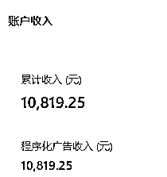
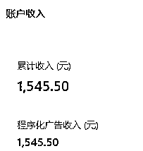
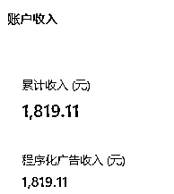

# 《微信公众号流量主的长期主义思考》

> 来源：[https://vz6cwy4ffd.feishu.cn/docx/VFxnd8yKnoAV0oxAgjrct0ben4d](https://vz6cwy4ffd.feishu.cn/docx/VFxnd8yKnoAV0oxAgjrct0ben4d)

### 1、自我介绍

我是周威，现在杭州城西区域靠近三墩。我曾经是高考做题家、35 岁的大厂打工人，但是我不甘于此，所以，3 年前裸辞在家，开始探索创业项目。但是一直处于探索阶段。直到加入生财，才有了比较明确的方向。

我是从 5 月初开始进入流量主项目的，截至现在，已经获得 1W+的收益。

这个收益跟很多走在前面的圈友有很大差距，我知道的就有超过 10 个圈友 月入 5 万了。但是，每个人的视角和阶段是不同的，我的分享也许可以帮助很多圈友减少一些内耗和焦虑，一点点也是好的。

很多人认为流量主这个项目是短期项目，随着入局者的越来越多，流量主项目迟早要结束的。

但是我是将流量主项目作为长期项目来做的，这跟很多人的思考是不同的，我今天的分享主题就是：《微信公众号流量主的长期主义思考》。

希望对大家做项目有所启发。

### 2、这个成绩是怎么做的（项目的实操路径）

在进入流量主项目之前，我还看过很多项目，包括小红书、抖音、闲鱼二手书等。5 月航海开始的时候，我甚至没有报名流量主，反而报名了小红书。但是当开船的时候，我才真正明白，我想要做的是流量主。

主要原因是，流量主最轻，轻到仅仅需要敲字就可以做。流量主也够纯粹，纯粹到你只需要关注文字。

项目开始时，我对赚钱是有心理准备的。一开始我就预期，如果我一年能赚 10 万块，那么前面 9 个月可能只能赚 1 万，而前面 8 个月也许一分都赚不到。这也符合指数增长的趋势。

从 5 月初到 7 月底，这三个月我都没有超过 300 的阅读。原因在于我自以为是地认为自己写的个人成长和个人思考的领域和选题是有价值的，一定会成功。说实话，虽然有预期，但是我现在确实还是佩服当时的自己。

随后，8 月初一个偶然的爆量，“打”醒我了。

那段时间，我已经坚持日更了 3 个月，每天只写 1 篇文章，而且几乎要占用我 3 个多小时的时间进行构思、写作和发布。几乎把我想写的都写完了。

于是有一天实在想不出什么可写的，心情烦躁。当时，刀郎新出了一首歌，连带着那英、汪峰等引发了比较大的争议，所以我判断这个主题比较火，而且我也确实想骂人，就写了一篇观点文。标题也起的比较招人恨。

不曾想，第三天的时候，这篇文章突然爆量了，我就有了第一篇 10 万加。正反馈来的如此突然，不禁让我陷入了深思：自己以为的并不是市场认可的。

所以，我就改变了自己的思路。又重新读了一遍航海手册，然后看其他优秀船员的航海日志，还看了风向标。

后来看风向标的时候，发现了养老金这个赛道。于是，开始入局写养老金。

事实证明，一旦抛开了无谓的顾虑和自以为是，正反馈来的是源源不断。

养老金第一篇文章就超过了 4000 的阅读。于是我开了两个号写养老金。

只是好景不长，养老金这个赛道没有持续多久，到了 9 月初，就开始熄火了。

这个时候，我再次陷入迷茫中。多个领域尝试，包括体制、历史、地理、鸡汤、法律等等。

就在我漫无目的地更新的时候，我的第三个号开始爆量了，于是我针对这个领域加大了写文的数量，每天花在写文上面的时间超过了 7 个小时。虽然依然产出很低，不过事实证明，这个策略暂时还算是正确的。我的这个号目前还在池中，中间只是短暂地掉池。最近我还发现我被人盯上了，有至少 2 个人在模仿我的标题和选题。

所以，目前我的主要工作内容是如何提高写作的自动化率和写作效率。

十一期间，我学习了影刀这个工具，实现了 30%的自动化，比较大地释放了自己的时间和精力。现阶段的主要任务是针对选题自动化和发布自动化进行优化实现，争取在整个项目中的自动化率超过 70%。

最终的目的是想达到每天 5 个小时内，写文 30 篇+，发文 20 篇+，涉及 6 个领域。

### 3、小结一下

我做这个项目的 4 个多月，有 3 个阶段：

第一阶段，自以为是的阶段。这个阶段在第一篇 10 万+出现的时候，就结束了。这里的坑就是自以为是，不愿意听话照做，不愿意了解市场想要什么。这个阶段的教训就是一定要按照航海手册和市场的要求去做。事实证明，自以为是最浪费时间的！

第二阶段，摸索选题和领域的阶段，这个阶段主要在养老金领域摸索，选题完全不成体系，效率奇低，每天能更新 2 篇就已经不错了。这里的坑就是，如果一直是模仿别人，跟随别人，死的也快。我模仿对标的那个号现在已经停更 1 个多月了。另外就是能用 GPT4 就用 GPT4，也许能打开新的天地！我可能就是因为没有用 GPT4，自动化的效率也无法解锁。

第三阶段，深耕一个领域，加大力度在领域内多测试选题、提高写作效率。朝着矩阵化、产品化和外包化方向发展。不能原地踏步，要不断地迭代自己。多领域探索，不仅仅要调整写作内容，写作的方法和工具也多尝试。

以上都是技巧，今天的主题是：微信公众号流量主的长期主义思考。所以以下才是今天分享的重头戏。

我主要分享三点：一切都是过程、迅速学习和调整、深入行业研究。

1、一切都是过程

我在最开始做这个项目的时候，我就明确了，我一定要经历这个项目的全过程，即使文章的单价下降到今日头条的程度，我也可能会坚持。为什么？因为我自己实在是太弱了，没有经历过一个行业或者一个项目的全周期。

我一定要经历过一个项目的全周期，我才能够对以后要做的项目有体感。

不是为了这个项目能赚多少钱，而是为了我以后在做其他项目的时候，更能够知道每个阶段怎么去做。

在流量主的现阶段，亦仁曾经提到过，不要想着长期主义，不要想着精细化运营，在风口起来的时候，精细化的努力意义不是特别大，规模、矩阵、大力出奇迹、花钱买时间才是你该考虑的。

这段话我看过十几遍，每一次都会坚定我现阶段努力实现自动化、矩阵化、产品化的信念。

2、迅速学习和调整

流量主项目已经有大半年了，实际上这个项目的开始已经有 1 年多了。现在这个阶段入局者开始增多，领域、选题不断地被抄袭和模仿，各个洼地被迅速填平。

很多人可能会沮丧，也可能坚持不住。

但是我想说，这更是考验我们的学习能力。可能我们以前或者以后做的每个项目都可能会有这个阶段。

所以，我告诉自己不要怕，保持学习，不要固步自封，今天要有今天的改变和迭代。

亦仁也说，从第一阶段如何向第二阶段过渡？

1.  第一阶段先加油赚到钱，把钱赚到手，这是你下一次尝试的本钱；

1.  通过第一阶段的实践，提升认知，总结经验，多付费出去学习和交流；

1.  一个人积累了多个第一阶段之后，才有可能直接跨入第二阶段，否则第二阶段所需要的各种能力、资源、认知也不足，还是会跌下来。

文章质量提升不了，就提高写作效率提高数量，数量到了一定的程度，再提升选题角度……

学习和调整永无止境，这是做任何项目的核心能力。

3、深入行业研究，不撞南墙不回头，撞了南墙继续撞，直到把南墙撞破

底层原理是，局部的正反馈循环会逐渐扩展到其他部分，最后形成整体的正反馈循环。

这里有个小提示：一定要报航海，航海有同行，会减少很多内耗、顾虑。还有就是，航海手册常读常新，因为航海手册是超越多数人的认识水平的，你每提高一点，之前对航海手册不理解的地方也许就理解了。

不欺骗自己，对自己要诚实，自己错了就是错了，就要改变。很多人看了很多好书，做了很多有意义的事情，但是进步依然不明显，就是因为太过自我，很难抛开自己的错误认知。

最后，分享亦仁的话，大家共勉：还处在第一阶段的人，做好第一阶段的事，赚好第一阶段的钱，当认知提升时，你会自动觉得看不上第一阶段的钱，转而等待第二阶段的到来。

如果我们没有期待第二阶段的到来，也许就说明我们第一阶段没有做好。

补充三点：

1，我们追求的是持续，而不是完美。如果用于写作的时间太长，影响了身体健康和家庭关系就不合适了。所以，我非常注意生活各方面的协调。在做项目期间，我并没有改变我每周运动的习惯，依然每周保持四次以上的锻炼次数，每次至少一个小时。

2，不原地踏步。原因很简单，这个项目在不断变化，如果固步自封，不求进取，不做改变，就会被落下。所以，我还会强迫自己每天都要尝试不同的写作选题、方法、领域、工具等等。其实也不需要专门花大量的时间在这上面，每天写作时间和迭代学习时间8：2或者9：1就好。因为持续写作就是迭代本身。

3，质量重要还是数量重要？这个问题可能问错了，not even wrong! 原因是质量和数量不是对立的。质量是用无数次刻意训练迭代出来的，而质量比较稳定的情况下，写文效率越高数量越多赚钱入池的概率也越高。我想起@花猫在日志里面分享的：有质量怼质量，没质量怼数量，没数量怼时间。现在想想说的真对啊！我前面3个月颗粒无收的时候就是时间怼起来了。

最近流量主项目有一点降温，有一句话跟大家共勉：

失败只是测试的一个结果而已，真正重要的不是测试结果，是要去测试，去能得到有统计意义的结果。所以，好消息和坏消息都是同等价值的消息。长期主义的道路不拥挤，暴富反而要走独木桥。