# 小红书这样引流，一发就封

> 来源：[https://nivut760ftk.feishu.cn/docx/WLTpdBz2soUc6TxOeiFcu7OOnQg](https://nivut760ftk.feishu.cn/docx/WLTpdBz2soUc6TxOeiFcu7OOnQg)

大家好，我叫艾小飞

关于小红书引流的问题，一直都是大家所关心的话题

现在小红书平台对引流打击的力度，可以算得上是全网最严的平台了，没有之一

像很多人刚接触小红书，他都不懂是怎么玩的

当有客户来询单时，就随手发了个微信号过去，以为没什么事，结果就马上就被违规提示

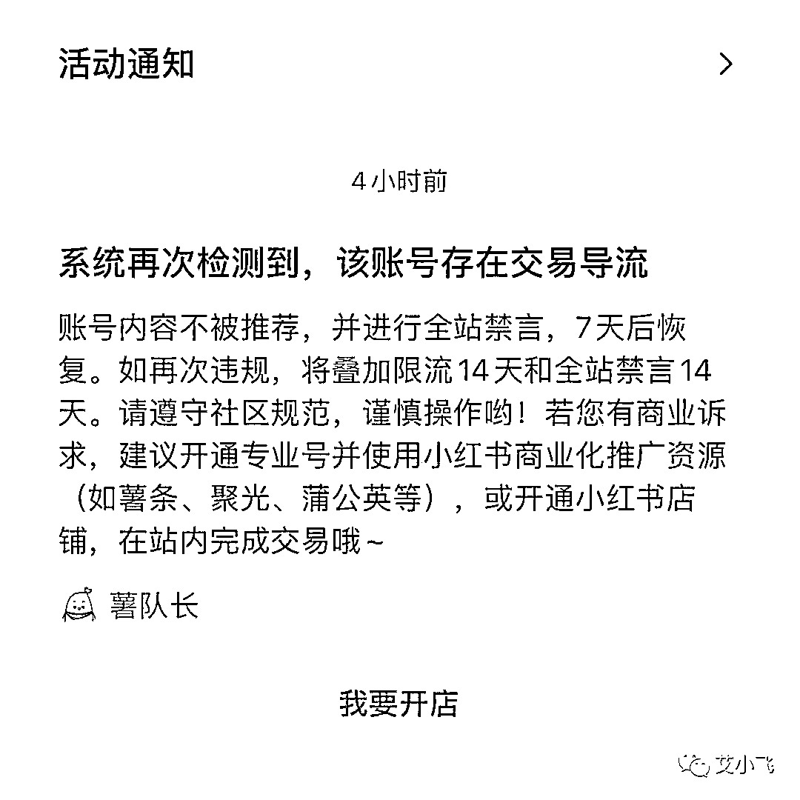

然后就来找我诉苦：飞哥，我这个帐号被禁言了，有什么办法可以补救吗？

我说：还能怎么办，只能马上注销掉，重新的去注册一个新号呗

我相信这也是大多数新人刚开始玩小红书，都很容易犯的细节问题

知道小红书对引流的打击很严，但却不懂该如何低风险的引流

既然这样，那我就把最近用得比较多的引流技巧分享出来，让更多新手少走弯路避坑吧

先说明一点，这个引流技巧不是100%安全的，要是想追求完美无风险的，先说明我这没有的啊

OK那么先说说这套引流的路径是什么

流程是先去注册一个小号，然后发布带有微信号的笔记，用大号点赞这篇笔记后，私信再发送给用户

这样就完成了基本的引流私域的动作

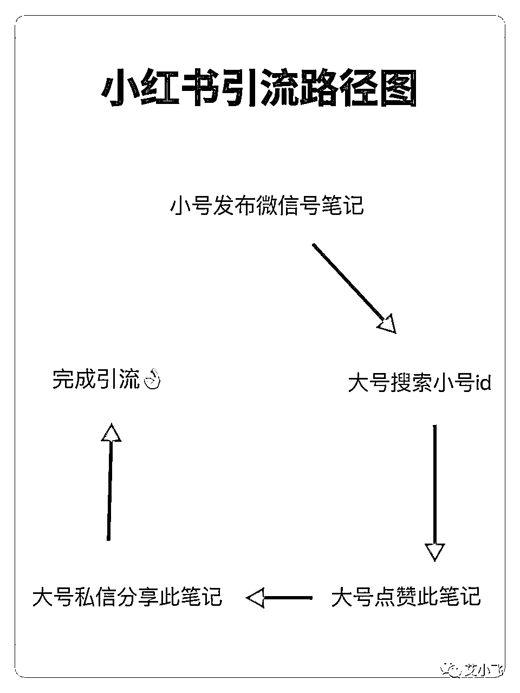

还是不太懂对吧，没关系

我用最近在实操的小红书残蟹项目来给你们做个案例

我在引流之前的第一个步骤，就是先去注册一个小红书小号

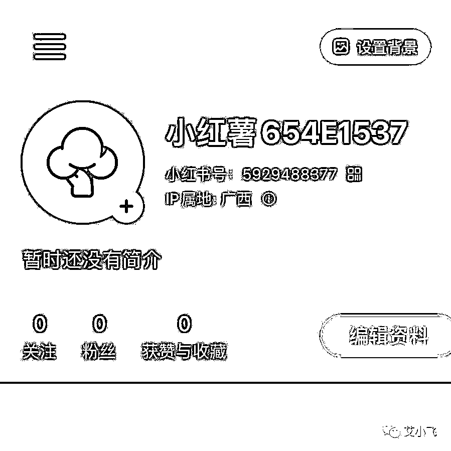

第二步是在美图秀秀上简单的制作带有一张微信号的图片

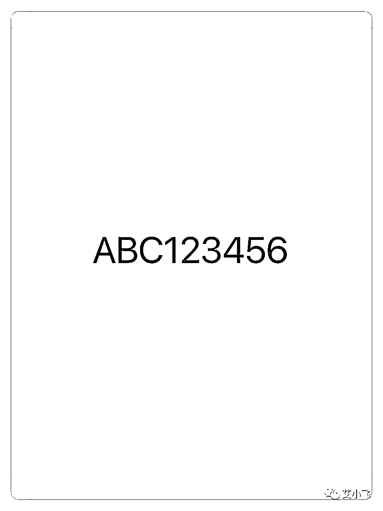

第三步是用小号发布这张图，标题就用Emoji表情来代替

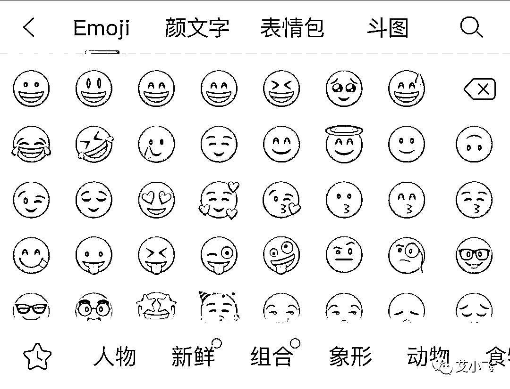

第四步是用大号搜索小号的id，点赞这篇笔记

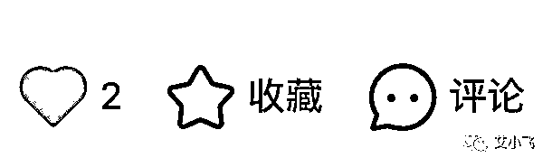

第五步，当用户来询单时，我就在分享笔记这栏，找到刚刚点赞过的笔记，发送过去给他，完成引流动作

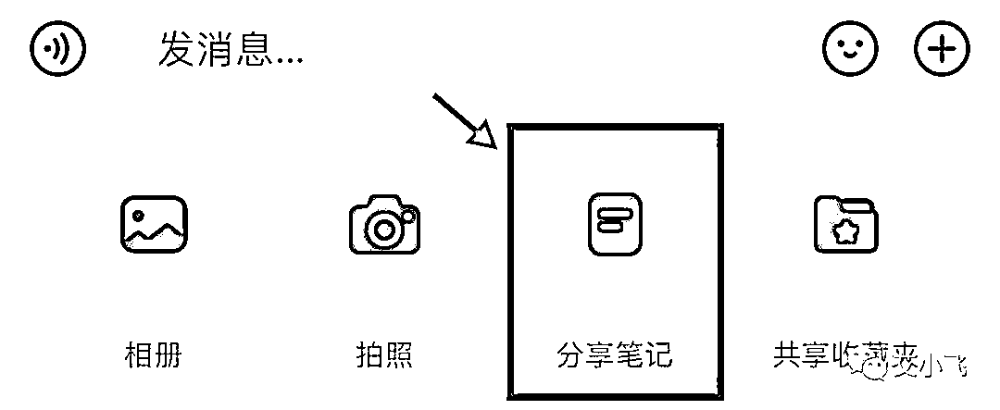

整个引流的路径就完成了，没什么技术难度的

但这里有个细节点要注意的是，因为小红书平台对引流打击实在太严了

要是你分享的笔记带有微信号的，它随时都能检测得出来

你发送给对方，虽然你这边是可以看得到的，但可能客户那边是看不到的，引流信息被系统给自动屏蔽了

那这时候该怎么办呢

当你分享完引流笔记给他后，可以补上一句：姐妹，请问这样能看得到吗

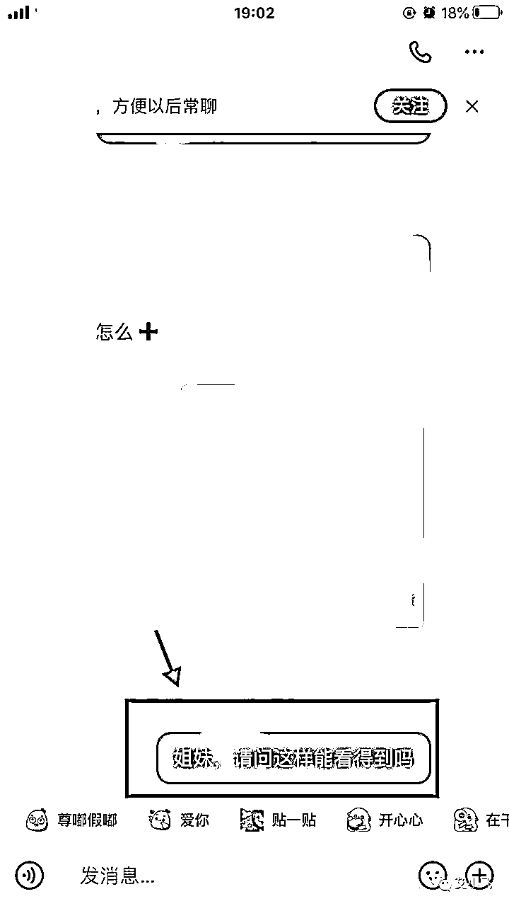

要是对方回复：看不到

你就再多做一个动作，截图当前跟他的聊天记录，然后再发一句：姐妹，那这样呢

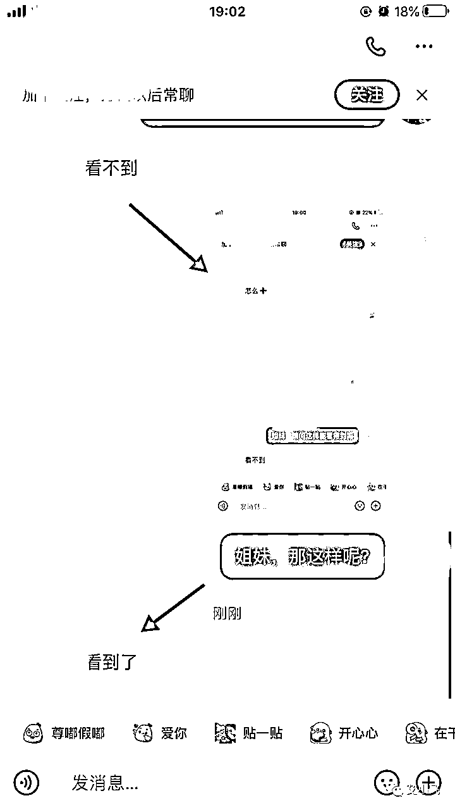

这样就能轻松的逃避系统自动屏蔽引流信息了

那可能你会问，那要是被提示了，该怎么办？

这个是要看当时被提示的情况是什么样的，分轻微和严重的

如果你接收到像这样的提示，你可以不用去管它，因为你的账号还能再坚持几天去引流

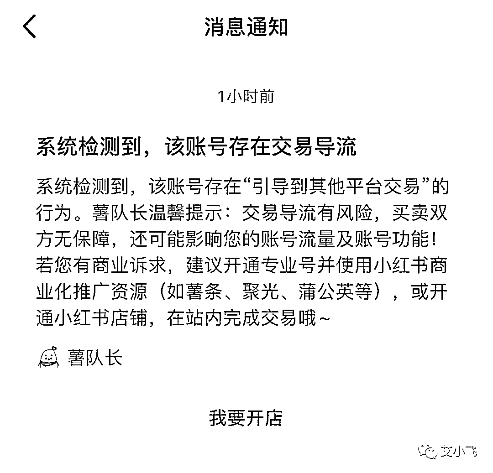

这个算是轻微的处罚，对你的账号流量没什么太大的影响

要是你接收到的像这样的提示，那就说明你的这个帐号已经快不行了，不能再继续引流了，要马上赶紧的去注销掉，重新换号

如果你舍不得这账号，还想继续再引流，要么三天后大概率会被加重处罚，更严重的可能会永久封禁账号

像这种账号被封是比较麻烦的

第一是因为你的这个手机号码不能再继续使用了，不能注册小红书，也不能登陆小红书

第二是你的违规行为，平台已经收录备案了，当你下次再用同款手机或同个号码注册新号时，会大幅度的被限流，怎么发都是没流量的

所以不要等到平台永久封禁你的账号了再去注销，那已经晚了，来不及了

要是你累计违规的次数多了，特别是玩创业粉引流的，就会接收到我这样的违规提示

被永久的封禁“手机设备”！！

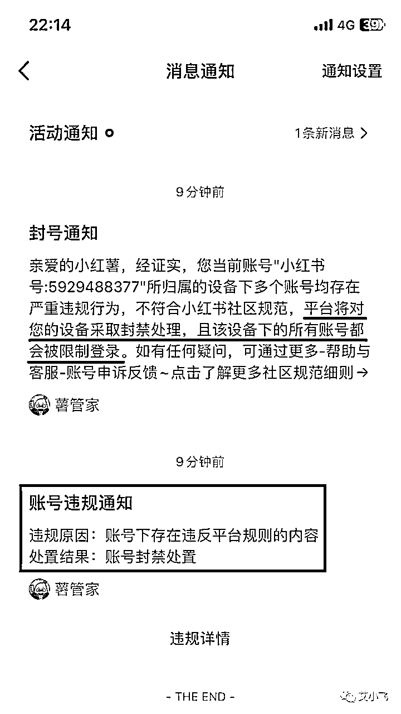

这是我被封了几十个帐号后，目前为止收到最严重的小红书顶格处罚了

可能你觉得“手机设备”被封没什么的

但我想跟你说的是，大多数被封的帐号，只是你的这个“手机号”不能再继续注册而已，一个月后还是可以通过特殊渠道把它给捞出来的

但“手机设备”被封就不一样了，这意味着什么？

意味着这台手机从此之后，再也不能注册和登录任何的小红书帐号了

平台已经把这台手机给拉黑了，从此再也玩不了小红书了

就是这么的严重

要是你遇到了“手机设备”被封禁了，也别慌，目前我正在测试一种申诉技巧，看看能不能安全无成本的把它给捞出来

要是能成，我就公开路径和模板给你们拿去抄

要是不成，我也分享失败的申诉路径有哪些，你们就没必要再去踩这个坑

但不管怎么样，希望你们不要等到快要永久封禁账号了再去注销，那时候已经快来不及了

一定要在平台提示你账号封禁7天后，马上快速的把号给注销掉，别犹豫！

以上的这些都是我通过实战得出来的宝贵经验，你们可以拿去做个参考

其实我们玩小红书引流的，相当于是跟平台在做对抗的

我今天所分享的引流技巧，可能当下的阶段还比较安全的，被封的概率会小一点，你拿去照抄复制，短时间内是没什么问题的

但过了一段时间后，平台发现了这个漏洞，就会瞬间的补上，并且严厉打击还在使用这套方法的账号

到那时候可能这套方法就不怎么管用了，引流技巧也是讲究时间效应的，过时的玩法，肯定玩不通了

所以在小红书引流是真的没有100%安全的，平台随时在补漏洞，我们也随时在换引流技巧

为什么小红书打击引流那么严了，我们还是要玩小红书呢

因为小红书上的用户质量确实是高

就比如我现在做残蟹的项目，基本上一个新号，发第一篇笔记，就马上有人来询单了，连发三篇就能成交一单，违规了当天注销，当天又能马上用

而在抖音上，你注册账号要实名验证，还要至少一个礼拜的养号，养号成功后再发视频，你连发3条视频，可能都没人去理你，更何况说什么开单了

这样对比起来，小红书的低成本，高效率，高质量确实是挺有优势的

但也比其他平台打击引流会更加的严格，这也是我对小红书又爱又恨的地方吧

好啦，今天我对小红书引流的一些感悟分享就到这里了，要是你对引流有哪些不太懂的，可以来后台找我聊聊

我叫艾小飞，专做小红书精准引流，谢谢大家

原创：艾小飞

转载可私信

禁止搬运和抄袭