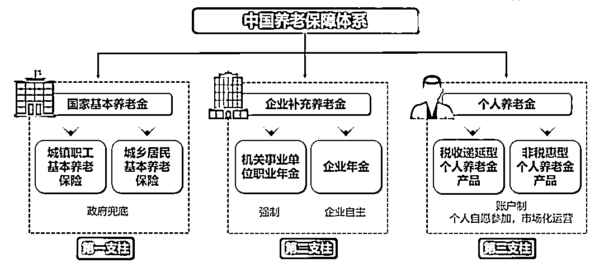
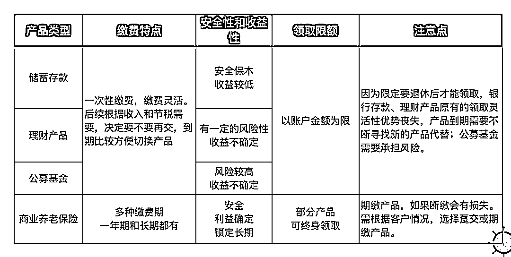
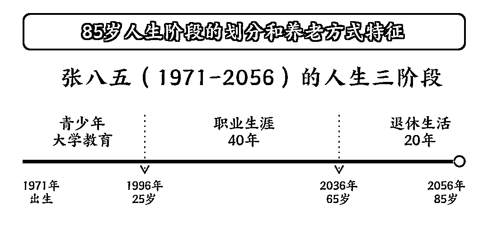
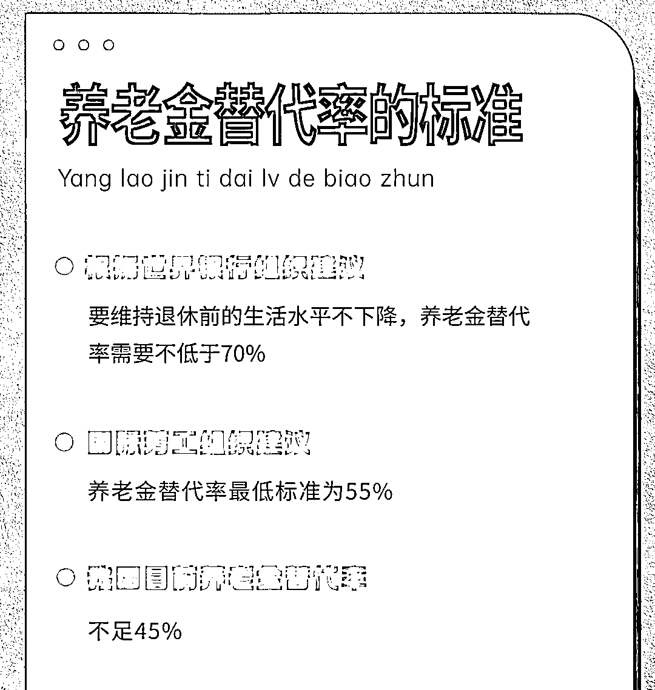

# 关于【养老金】看这一篇就够了（❤️分享版）

> 来源：[https://aqt9b0ifu6.feishu.cn/docx/XLXQdgXSnoOHbPxqDkQciJn7nVd](https://aqt9b0ifu6.feishu.cn/docx/XLXQdgXSnoOHbPxqDkQciJn7nVd)

最近个人养老金风那么大，很多小伙伴还被要求强制开户，那到底是什么东东，今天就用一篇文章讲清楚，帮助大家节约去看碎片化信息的时间。文章比较长，我提前把提纲列出来，你可以收获以下内容：

# 1.什么是个人养老金

在劳动者年老或丧失劳动能力后，根据他们对社会所作的贡献和所具备的享受养老保险资格或退休条件，按月或一次性以货币形式支付的保险待遇，是造福社会的需要，主要用于保障职工退休后的基本生活需要。每个人都会老，养老金是必需品。个人养老金：政府政策支持、个人自愿参加市场化运营的补充养老保险制度。

# 2.为什么要买养老金

老龄化严重、出生率下降等等现实国情，2022年11月25日，人力资源社会保障部宣布，个人养老金制度启动实施。这里流入大于流出的时候会有结余，目前社会口老龄化、新生儿数量的逐年降低，会带来劳动力不足、社保缺口增大等负面影响，我国的基本养老金在 2007 年的时候就首次出现了入不敷出。国家已经才是采取现在延迟退休，政府补贴，地方间转移支付，所有的央企国企需要把它国有股权的 10% 放到了这个养老金的这个池子里等措施弥补。

我国目前是以社保制度为主的养老体系，国家推行个人养老金制度，就是要引导个人开始考虑养老的钱了，不能只靠社保养老！

## 2-1: 政策背景

2022年11月，人社部、财政部、税务总局、银保监会、证监会联合发布《个人养老金实施办法》，规定参加人每年缴纳个人养老金额度上限为12000元，可购买符合规定的储蓄存款、理财产品、商业养老保险、公募基金等金融产品，并且达到领取基本养老金年龄（除非丧失劳动能力或出国/境定居等国家规定的情形）才可以领取。

划重点：

1.  额度上限12000元/年；

1.  可购买存款、理财、保险、基金；

1.  达到领取年龄才可领取

2022年11月，财政部、税务总局联合发布《关于个人养老金有关个人所得税政策的公告》，自2022年1月1日起，对个人养老金实施递延纳税优惠政策。在缴费环节，个人向个人养老金资金账户的缴费，按照12000元/年的限额标准，在综合所得或经营所得中据实扣除；在投资环节，计入个人养老金资金账户的投资收益暂不征收个人所得税；在领取环节，个人领取的个人养老金，不并入综合所得，单独按照3%的税率计算缴纳个人所得税，其缴纳的税款计入“工资、薪金所得”划重点：

1.  12000限额标准税收优惠，每年12月31日前将金额存进账户即可

1.  暂不征收投资收益的个人所得税

1.  领取时按3%计算个人所得税

20222年11月，人社部、财政部、税务总局联合发布《关于公布个人养老金先行城市（地区）的通知》，公布个人养老金36个先行城市（地区）名单

划重点：36城市（地区）试点

2022年11月，中国银保监会发布《关于印发商业银行和理财公司个人养老金业务管理暂行办法的通知》，公布了首批开办个人养老金业务的机构名单，即可在23家商业银行进行个人养老金账户开户

划重点：可在23家银行开户

# 2-2：长寿是一个不用期待也将到来的事实

### 中国人口平均寿命变化趋势

2000年71.4岁，2010年74.8岁，2019年77.4岁，整整提高了6岁，经济条件越好的人平均寿命越长，百岁人生已经越来越成为现实！

### 被动长寿的常态化

1.  医疗检测手段的提升：很多中晚期重疾可以被提前发现医疗保障体系的持续

1.  医疗保障体系的持续完善：沪惠保、京惠保等，让很多大众客户寿命延长几年甚至上十年

1.  “昂贵药物+特殊治疗手段”配备各家公司的专项保险延长甚至完全治愈以往的重症

在平均寿命逐渐提高，百岁人生成为常态的现在，长寿时代的即将开启多阶段的人生。文章后面将讲解长寿人生的相关内容

# 3.养老金的三大支柱

第一支柱国家管：包含城镇职工基本养老保险和城乡局面基本养老保险，包含社会统筹和个人账户两部分，也就是我们平时社保缴纳的时候公司缴纳和个人缴纳部分（缴费比例是公司16% 加个人8%），个人缴纳部分进入个人账户；公司缴纳部分进入社会统筹账户，这部分是现收现付制，什么意思呢，就是如果我们这个月交了基本养老金，可能下个月已经发给了这个退休的人员了。

第二支柱企业管：由用人单位及其职工建立，主要发挥补充作用；一般是国有单位以及事业单位有，也可以去确认下自己的公司有没有帮自己缴纳。第三支柱是个人管：个人节税养老金以及商业养老保险，国家在逐步完善第三支柱的安排，第三支柱是未来个人养老金的重要组成部分。作为第三支柱的【个人养老金制度】，是政府政策支持的、个人自愿参加的、市场化运营的、补充养老的保险制度。

实行个人账户制，缴费由个人承担，自主选择购买符合规定的储蓄存款、理财产品、商业养老保险、公募基金等金融产品（以下统称个人养老金产品），实行完全积累，按照国家有关规定享受税收优惠政策。

个人商业养老金：从最广泛的意义来讲，年金即为一系列的定期支付，年金合同是指在被保险人的生存期 间或某一约定期间内，保险人定期给付保险金的保险协议。

年金是为了保障被保险人因寿命过长、耗 尽财富而无法养老；相反，人寿保险是保障被 保险人因过早死亡而造成的收入损失。

# 4.什么是个人养老金抵税

# 4-1:个人养老金抵税的特点

1.  核准地域

1.  核准收入

1.  节税

1.  强制储蓄

1.  安全储蓄

1.  补充养老

### 4-2:养老金制度

缴费上限：上限为每人12000元/年， 未来根据发展情况适时调整；

税优政策：12000元/年的限额标准税前扣除，领取不计入综合所得， 单独按照3%计税（国家现行要求）。

管理要求：实行封闭运行，除另有规定不得提前支取；

领取条件：达到领取社保年龄、完全丧失劳动力、出国或身故（可继承）

个人养老金的功能：按照这个税优政策，我们可以看到，不仅仅是专款专用的养老款，更可以延迟缴税！

注意：个人养老金，在领取时，需要缴纳3%的税费，所以，个人养老金制度并不是税减政策，而是税延政策，即延迟缴税的时间至退休后。

### 4-3:哪些地区可以买

36个试点城市：（以社保缴纳归属地为准）

1个省：福建省

4个计划单列城市：广东省深圳市、浙江省宁波市、辽宁省大连市、山东省青岛市

4个直辖市：北京市、天津市、上海市、重庆市

6个非省会城市：河北省雄安新区、山西省晋城市、江苏省苏州市、山东省东营市、云南省玉溪市、甘肃省庆阳市

21个省会城市：河北省石家庄市、内蒙古自治区呼和浩特市、辽宁省沈阳市、吉林省长春市、黑龙江省哈尔滨市、浙江省杭州市、安徽省合肥市、江西省南昌市、河南省郑州市、湖北省武汉市、湖南省长沙市、广东省广州市、广西壮族自治区南宁市、海南省海口市、四川省成都市、贵州省贵阳市、西藏自治区拉萨市、陕西省西安市、青海省西宁市、宁夏回族自治区银川市、新疆维吾尔自治区乌鲁木齐市

### 4-4: 哪些人适合买，可以节税多少

1.计税公式：应纳税额=应纳税所得额×适用税率-速算扣除数。七项：住房贷款利息、子女教育、 继续教育、大病医疗、住房租金、 赡养老人、婴幼儿照护。

1.  应纳税所得额查询路径：个人所得税APP-常用业务—综合所得年度汇算—选择年度—即可查看应纳税所得额

3.根据自己的税点去评估自己到底要不要买，以下是列表，都给你整清楚了，对号入座就可以！

举个🌰

1.  A先生年收入25万，收入类型为工资薪金，应纳税所得额12万，存入个人养老金账户1.2万元可节税1200元

1.  A保险经纪人年收入30万，收入类型为劳务报酬，应纳税所得额10万，存入个人养老金账户1.2万元可节税1200元

可以看到，个人养老年金带来的变化：

①1.2万的个人养老金，每年可以延迟至退休再缴税，且缴税金额仅为3%。

②由于1.2万投入了个人养老金账户，使得税率由10%降到3%这档，带来的很大的税率优惠。

### 4-5: 怎么买

23家可开户银行：（个人养老金账户一人最多开一户，二类账户留意转账日限额）

23家商业银行：工商银行、农业银行、中国银行、建设银行、交通银行、邮储银行、中信银行、光大银行、华夏银行、民生银行、招商银行、兴业银行、平安银行、广发银行、浦发银行、浙商银行、渤海银行、恒丰银行、北京银行、上海银行、江苏银行、宁波银行、南京银行

### 4-6: 买什么

1.既然是用于养老补充（未来一定会到的钱），安全性是我们考虑的很重要的一个因素。

这4种选项里，除了存款和保险，基金和银行理财都有一定的风险性。所以其实大多数人都会选择保险---兼顾了安全性和收益。

2.特别是养老年金保险，可以提供伴随终身的现金流，就是一份领不完的退休工资，是你专属的，别人拿不走。你觉得是不是更可靠？

3.保险产品可以选短期交，也可选长期缴。选缴费时间长的，就更省心，不需要每年都花心思去找产品。

举个例子🌰

### 5.养老金缴纳以及购买产品的流程

## 1.开户

2.缴存

3.资金账号获取

4.打印缴费凭证

5.报销抵税

# 6.养老三阶段

那么很多人对于养老并没有太多的概念，那么我们可以从养老三阶段认识下养老生活

## 随着百岁人生的到来，退休以后的晚年生活时 长与职业生涯的时长接近，长达40年以上

# 6-1:长寿时段的多阶段人生

### 70岁人生

1.  退休后晚年生活阶段不到职业生涯的五分之一

1.  养老方式单一，几乎没有选择和变化，养老生活不需要规划和设计

1.  多子女家庭，养儿防老成立，养老筹资方式基本 上是传统的退休金+社保为主

### 85岁人生

1.  退休后晚年生活长达20年，相当于职业生涯的二分之一

1.  养老方式拥有更多的选择和变化

1.  传统的养老的筹资方式面临挑战

### 百岁人生

退休后晚年生活超过35年，与职业生涯阶段等长甚至更长多阶段人生出现，这个阶段的人生出现更多的选择和可能。

养儿防老不成立，传统的养老筹资方式已经无法支撑漫长的晚年生活。

### 总结和思考

1.  长寿时代晚年生活与职业生涯等长，甚至更长

1.  退休阶段的生活方式呈现出多样化和更多的选择，需要提前规划和设计

## 6-2：养老三阶段

### 第一阶段

第一个阶段是刚刚退休后，叫做活力阶段：大概60-70岁。这个时候身体还好，可以 去工作时去不 了的地方旅行，做工作时做不了的事情。

影响选择和规划的主要因素：

1.  个人的兴趣和情怀

1.  更多的身份探索

1.  财务自由:随心所欲做自己喜欢的事情，这里随心所欲不是奢侈和挥霍，而是当你做喜欢的事情时，不用考虑钱的问题

挑战：

1.  很多人(特别是企业家和职业经理人)对长寿人生缺乏深度思考，除了工作之外没有任何兴趣爱好，不愿退休

1.  无法适应退休生活的新身份

1.  对过渡期缺乏准备与规划

1.  财富管理目标的转型(从激进到保守)更具挑战

### 第二阶段

第 二 个 阶 段 是 居 家 阶 段：大 概 是 7 0 - 8 0 岁 ；这 个 时 候 比 较 少 再 满 世 界 跑了，活动能力逐渐下降， 在 家里或者养老社区度过，需要亲人朋友陪伴，会有一些健康问题，还可能需要照护。

影响选择和规划的主要因素：

1.  个人兴趣和经历

1.  创造性的娱乐:运动、艺术、音乐、社交、家庭聚 会、阅读、写作、研究......

1.  财务自由:做让自己感到身心愉悦的事情，财务自 由仍然是前提条件

挑战

1.  独处的能力

1.  对新身份的探索

1.  个人情感的归属和价值创造

1.  财富管理目标:足额、确定的现金流

### 第三阶段

第三个阶段是护理阶段：大概是80岁到最终，大部分人都需要别人的照护，或许在家里，或许在医院，或许在养老社区。

在长寿时代，进入这一阶段的老年人口数日益增加，高品质、有尊严的长期照料护理成为必不可少的规划

影响选择和规划的主要因素

1.  身体健康状况不同

1.  其他与第二阶段相似

挑战

1.  健康状况不好的老人，容易产生悲观情绪

1.  如何把长期看护与兴趣爱好、情感需求相结合，即虽然生理老化，但心理仍然年轻(物理学家霍金)

1.  财富管理目标:与生命等长的固定、足额的现金流， 用于确保高品质的长期看护照料及其他支出，有尊严地安享晚年

## 6-3: 养老三条件

1）是健康的身体：合适的运动，舒畅的心情，充足的营养，健康的人幸福感更强。

2）是充足的退休金和医疗保障：很多时候钱决定了生活的品质，也决定了别人对待我们的态度，退休后每月3000，和每月3万养老金，差别很大。生病了有保险报销，跟花孩子的钱，感觉也是不一样的

3）是舒适的生活环境：老人在在温暖和睦的家庭人际环境中，在有花园的小区或者养 老社区生活，需要 的时候能得到及时 的照顾护理，是不是很幸福?

## 6-4: 养老三层次

1）基础养老：有基本的退休金和医疗保障，基础的生活水平，如果出现大的健康问 题，可能需要孩子的帮助。

2）舒适养老：有比较充足的退休金和医疗保障，住在比较好的环境中，甚至可以给 孩子一些经济支持，过年过节给孙辈包个大红包。

3）富足养老：养老金很丰盛，有全球的医疗保障， 可以住在自己的家里，也可以去 住高端养老社区，有更好的照护条件。这个阶段也要做好财富传承规划，把资产传给孩子们

## 6-5: 养老需要年轻的自己规划

长寿时代晚年生活与职业生涯等长，退休阶段的生活方式呈现出多样化和更多的选择，需要提前规划和设计。

基业长青的企业就是在企业创立的第一天起， 每一个阶段都能顺利过渡到下一阶段

百岁人生要经过多少次过渡：从出生到死亡，要经历过很多个人生的不同阶 段，能否做到每一个阶段顺利过渡到下一个阶段， 是判断一个人人生是否幸福的重要标准。

查理芒格说：把握两个时间节点，一 个是何时实现财务自由，没有负债;另一个是何时退出劳动力市场。

人的一生当中可以用钱，来捍卫尊严的时刻实在太多了，拥有一份与自己匹配的养老年金去规避人性的挑战，是平衡时空中，现在的自己给几十年后的自己盔甲！

养老保险年金是满足养老财务规 划的最佳选择，与其他金融产品 不具有可比性而且是不可替代的，养老金的特点需要是什么：

1.  捍卫尊严：不看任何人的脸色

1.  安全的：法律保护的刚性兑付

1.  确定性：与企业风险隔离

1.  足额的：与生命等长的现金流

1.  保值增值：专业资产管理

与生命等长的现金流，年金领取人不必为寿命过长、 没有生活来源而操心，有了足额的年金保障，才能真正实现养老规划所设 计的养老方式，随心所欲地做自己喜欢的事情，实现幸福人生。

# 7.如何计算自己领取的养老金

那么讲了那么久，你知道你现在的自己可以领多少养老金吗？

个人领取的养老金受到以下几个因素的影响：基础养老金+个人账户养老金，影响因素：社平工资、个人缴费基数、缴费年限等

按照平均待遇，退休后大部分人的生活水平会下降，因为领到的钱太少了！

在经过前面的计算以后，发现大多数人退休后并不能维持现在的生活水平，但是辛苦工作一辈子，都希望有个幸福的晚年，个人商业养老产品是以后的主流趋势。

计发月数是指退休人员可以领取养老金的月份数。具体来说，对于男性，60岁及以上的退休人员计发月数为139个月；

55岁及以上的女性退休人员计发月数为170个月；50岁及以上的女性退休人员计发月数为195个月。

### 关于替代率

养老金替代率是衡量劳动者退休前后生活保障水平差异的基本指标之一。

2002年某一城市新退休人员领取的平均养老金为650元/月，而同年该城市在职职工的平均工资收入为1100元/月，则：2002年该市退休人员的养老金替代率为（650÷1100）×100% = 59.09% 。

决定替代率的基本条件：一是社会经济的发展水平，基金的承受能力；二是养老金的计发办法；三是养老金的增长机制。

替代率是什么意思呢，在退休之前每月工资2w，退休后工资8000，替代率40%，生活水平会下降，以及每月现金流减少的落差

从全国水平来看，城镇职工2022年养老金替代率下降到40%，低于世界银行55%的警戒标准。

想一下月薪2万的你，假如每月领5000，是不是生活落差特别大！月薪十万的话，你有钱有时间给自己做养老规划了！

### 广东省个人养老金账户查询

广东地区粤省事-社保-参保缴费状态查询-个人账户缴费总额

# 8.你的养老需要多少钱

在老龄化、少子化的趋势下，社保养老是一个政策，政策是会变动的，特別是老龄化社会，确实很难预计。

养老只能靠自己，靠自己年轻时的储蓄。

养老金追求的是一笔与生命等长的恒定保值的现金流，对于养老而言，现金流就是尊严！

假如我们的目标是1万，减去基本社保养老可以领到的比较少的3000，我们每个月要准备7000 元。

如果60岁退休， 身体健康活到90岁，我们拥有30年的退休时光，每年8.4万，50年要准备252万。就是我们要在60岁前准备好250万的退休金。

如果到接近退休再考虑这个问题，一下子准备这么多钱真的还是有压力，种一棵树最好的时间，要么是十年前，要么是现在！

在年轻的阶段，如果失业导致的gap对现金流的焦虑就很大，那么等我们退休后，随着劳动力的减弱，对现金流的恐惧会进一步增加，在年轻的时候做好养老规划，才能避免丧失尊严的人生遗憾，保险的安全确定的资产属性是规划养老年金的最佳选择。

在年轻的时候，就开始考虑养老储备的问题， 其实我们只要把钱做对规划，放对地方，就不需要准备250万这么多，可能只需要一百多万就够了。

到时就可以每月领取7000，而且不止领到90岁，领到100多岁都没问题，活多久领多久。

# 9.一些留下思考的QA

1.  你打算几岁完全脱离职场生涯?

1.  你有想象过自己40年的养老方式吗?

1.  养老生活方式可以划分为三个阶段，你会怎么设计自己的三个阶段问题

1.  如果按照以上设计的三个阶段养老的生活方 式，每年(每月)需要多少的现金流?

1.  有多少方法可以解决养老的现金流问题，哪 一种是最安全而且是最有尊严的方法?

1.  养老年金规划在什么时间点做是最合理的?

让百岁人生成为“礼物” 而不是“负担”!