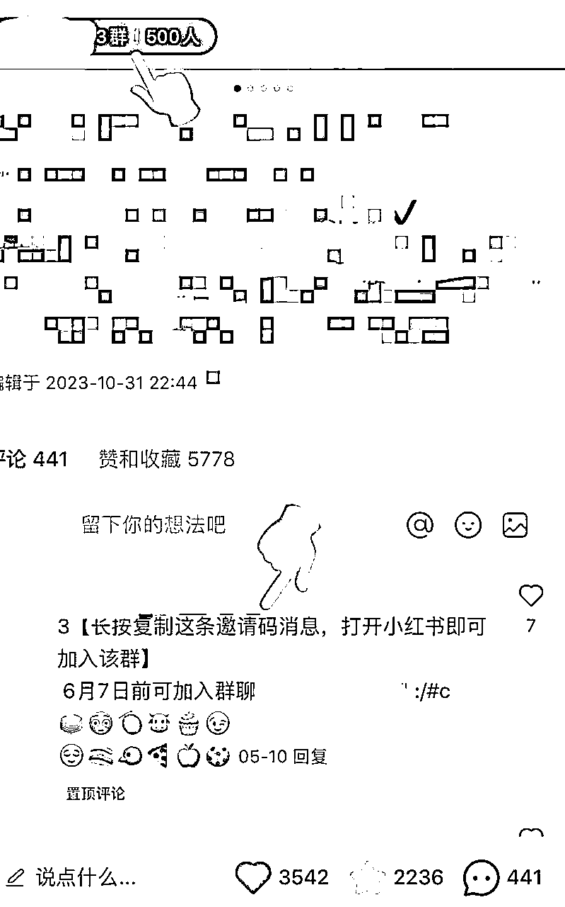

# 小红书引流变现｜1个千粉小红书账号年入200w➕

> 来源：[https://zxnpytr8vbe.feishu.cn/docx/YJTMdCOejoK5BQx5GNecTXOInDf](https://zxnpytr8vbe.feishu.cn/docx/YJTMdCOejoK5BQx5GNecTXOInDf)

开篇之前，我一定要说：小红书一定要做！高效去做！做矩阵账号！！做矩阵流量！！！

一直很犹豫要不要和大家分享我的小红书历程，因为这些经历和一些小红书大佬比完全不值一提，但是想想还是写一下，当给自己做个复盘了，给还没做小红书的小伙伴们一个思路借鉴经历参考～

我摸索运营过三个小红书账号：

1⃣️服装穿搭图文账号：不到7个月时间3.1w粉（认证原因注销）

2⃣️轻奢珠宝图文账号：1.1w粉

3⃣️中古店账号：1.3w粉引流1w➕好友 取2022整年gmv 200w➕（2022年是千粉，gmv 包含通过小红书引流来店线下的变现以及小红书引流微信好友的裂变消费）

三个账号都是顺带运营，还需要负责店面营销等其他工作，所以小红书上没有花太多精力，没有矩阵式布局（不要像我这样，一定高效去做矩阵）

这里以中古店账号为例，来具体讲账号从0-1以及引流变现的路径：

“知己知彼 才能百战不殆！”

# 「知己——分析自己的产品」

我们的产品主要是中古包（官网停产、年份较久的二手奢侈品）

简单分析完产品，然后确定平台：

消费能力较强➕25-45岁女性为主➕线上线下转化变现效果好——确定小红书✅

（抖音引流线下实体店效果很好但是由于精力有限，且抖音视频形式为主，娱乐氛围较浓，所以确定做小红书！建议先专注做好一个平台）

# 「知彼——分析平台」

小红书：一个社区分享➕电商平台（电商属性弱，在大力推电商板块，想实现在小红书种草就在小红书消费的闭环）。所以变现逻辑是在小红书分享种草，然后引流微信、第三方电商平台或者直接在小红开通店铺。

了解小红书基础结构以及一些重点流量入口👇也就是用户最有可能在哪些位置刷到我们的种草图文/视频～（不同版本的小红书界面略有不同）



1⃣️发现首页信息流：有推荐、购物、直播、穿搭等等tab栏分类

由此推出：要做垂直，做好细分领域，这样才能被分到某一类才能被潜在用户看到！挖掘潜在客户！

2⃣️ 搜索：明确需求搜索🔍

由此推出：标题、内容要带好关键词 ，这样才能被精准搜索到！

3⃣️ 视频：视频单独占了一个板块

由此推出：矩阵里至少做一个视频账号，这样能多一个被曝光被推荐的机会！

4⃣️当地定位：线下探店

由此推出：有线下店的发文一定带好定位，方便引流当地客户到线下实体店转化～也可找当地博主探店，增加线下店曝光！

# 「养号➕找对标账号创建爆文素材库➕确定矩阵结构➕发文运营」

确定平台大概了解平台基础结构流量入口之后，就可以养号➕找对标账号分析爆文➕确定矩阵结构一起进行啦。

## 养号

养号这个问题见仁见智，也有说不需要养号的。但是我个人建议养三五天！！！决定要做，就要高效完善去做，在自己可以努力的地方一定努力。也可以趁着养号的时间去了解同行、分析爆文～

养号简单来说就是浏览➕搜索➕点赞➕收藏➕评论➕转发➕关注同行的小红书图文或者视频！（连续三五天早中晚打开小红书各刷30-60分钟）

以中古包为例，我的养号动作如下：

「每天不定时打开小红书app」

1⃣️搜索🔍：中古包/lv、Loewe 、Prada 、Gucci（细分品牌）中古包/北京中古店/中古店/中古/vintage等等一系列相关或者细分关键词，浏览相关内容；

2⃣️浏览完➕点赞➕收藏➕评论➕转发➕关注：给搜索到且你可操作的热门文章、视频点赞、收藏、评论、转发，时间长了，首页信息流就会较多推荐相关内容，记得关注优秀同行。

## 找对标账号创建爆文素材库

在养号过程中，关注了优秀同行账号，找到对标账号，收藏了可行爆文，创建爆款素材库！「也可结合灰豚数据📊分析 」

1⃣️找对标账号（起步建议选择低粉潜力股）

▪️千粉/小小万粉（十几或者几十万粉前期不建议对标）；

▪️数据较为稳定（偶尔产出一条千赞爆文，其余均个位数赞账号不选！偶尔产出一条千赞藏爆文，其余均为百赞数据较好的账号可以）；

▪️可复制（根据自己情况评估制作难度，不要选择难度超出太多的账号）

2⃣️爆款素材库

不是只有万赞藏/大千赞藏才算爆款，要综合考虑粉丝量级、发布时间、过时热点等因素！以下没办法给出精确的数据数字 ，运营也掺杂感觉！

▪️低粉爆文：如果几百的粉丝量级产出几百/小千赞藏的图文/视频，完全可以加入素材库；

▪️短时爆文：如果百粉、千粉博主刚发布一篇图文/视频在一个小时之内就几十点赞👍，这种也可以对标来做；

▪️过时热点：某些爆款是一些过时几个月或者去年的热点，这类型请放弃；

▪️头部博主爆文：百万/大几十万粉丝量级的博主爆文刚开始起步不太建议参考，除非是该某一篇数据高出这个博主其他平均值太多，可以先加入素材库，在小红书运营的后期可以参考选题、内容。

找到对标账号，收藏了可行性较强的豹纹，就可以分析其选题、标题、封面、文案、话题、评论区引导等等，可以建个excel表格记录，类似下图，可以加个“评论区延展选题”（选题角度也可以看看爆款图文视频下面的热门评论）可以根据具体情况调整：

## 确定矩阵结构：

分析过一定数量的爆文，可以根据 热门细分类目以及热门选题 来确定矩阵账号！准备多做几个账号，就多准备几个手机📱 细分账号也按照之前步骤养号、分析细分类目的爆文、整理细分账号可以做的选题、内容。

中古为例，分析了很多爆文之后发现我们🉑️做的中古包热门选题主要是：

* * *

「尺寸对比干货/各品牌中古男包/Loewe蛇骨系列、麂皮系列/Prada邮差系列/lv老花、单宁/Chanel自带流量（可惜我们没有）/超好成色/少见款式优势」

* * *

👉如果要做矩阵结构可以如下：

主号官方账号 ：中古包官方账号——图文；

细分账号1:男士中古包账号——图文（小红书里男生也是一个很值得做的板块哦）；

细分账号2:专门分享超好成色的包品——图文；

细分账号3:个人ip账号——视频（ip类比较推荐真人出镜视频形式，增加信任感）；

客服💁账号：后续回复小红书群消息！

## 发文运营

养号结束，也分析了一些爆文，就开始正式发文运营引流啦～

###### 完善基础资料

「头像➕名字➕小红书号➕简介➕地区➕背景图」

1⃣️头像：尽量和你所做的产品相关，可以是品牌logo或者线下店门面图片，如果是个人ip账号头像可以放真人照片（比如做天然珍珠的商家，个人IP头像可以是戴珍珠项链耳钉的真人照片）

2⃣️名字：尽量带关键词，比如：

某某某中古vintage

中古打工人儿——小红（个人IP账号视频形式）

3⃣️简介：简明清晰介绍清楚重点信息（你可以提供什么➕你有什么优势）；

4⃣️背景图：可以是和你做的相关照片，门店照片等等。

❗️如下图 倾删❗️

5⃣️开通小红书群聊

###### 发文

「前面说过一个词“高效”，高效做小红书建议每一篇小红书都用爆文思维去做，朝爆文方向去努力，不做无用功！在可以掌控🫴的地方高效努力，其他交给时间！」

发文内容：封面➕标题➕正文➕话题➕地点➕高级选项

养号过程中分析过很多爆文结构，整理了excel，应该知道怎么写了！这里单独强调以下几点：

1⃣️标题正文：尽量带关键词（行业/品类/细分类目/人群/价格/热点等），方便被精准搜到🔍

2⃣️话题：不选无关话题，高热度相关话题（超高浏览）➕超精准话题（浏览稍少，但细分精准）➕小红书近期活动话题（创作中心—笔记灵感）结合

3⃣️地点：线下实体店一定带定位，精准定位

4⃣️高级选项：商家账号一定关联小红书群聊

5⃣️发布时间：

想象你是一个小红书用户，你主要在什么时间刷小红书，你就在什么时间发！发布内容多了，你的内容在什么时间段比较火或者评论咨询比较多，就稳定在那个时间段发布！

工作日吃午饭➕下班地铁上➕晚饭后睡前！周末起床➕睡前！

6⃣️发文频率：

前期数据不稳定的时候建议多发，一天发1-3篇都可以，后续数据稳定可以根据具体情况（操作难易 账号多少）稳定一周发几篇。

7⃣️补充动作：

⁃ 发完等小眼睛曝光到一百多两百多的时候可以转发到朋友圈、小红书群聊，尽可能全方面增加曝光，引导潜在客户去浏览点赞收藏评论等；

⁃ 矩阵下所有账号互相关注，一个账号发文后其他账号可以去关注页面浏览内容并点赞收藏评论（不要在同一Wi-Fi 下）；

⁃ 爆品重复发，爆过的内容还会再爆，可以换种呈现方式再发，让一个品最大化引流转化；

⁃ 发文关联群聊，同时也可以在评论区放上小红书群聊链接🔗 并置顶；

⁃ 评论区尽量及时回复尤其是刚发的时候，一问一答或者一问多答让流量跑起来。

8⃣️封面

在模仿对标账号对标爆文封面的时候，注意尺寸➕布局➕文字➕颜色，越细越好，像素级模仿。

###### 引流以及日常维护：

“如果小红打开小红书刷到一个很喜欢的罗意威中古包，并且有购买意愿，想要知道售价以及购买方式，那聪明的小红就会在评论区或者私信或者点开账号主页进入小红书群聊询问🙋，请注意这时候潜在客户出现了！ 如果商家没有开设线上店铺需要引流微信或者其他第三方平台的商家需要设置好自己的引流路径”

「路径：评论/私信/小红书群询问——都需要以各种不违规方式回复微信号/第三方平台信息」

小红书直接发微信是违规的，所以我采用的解决方法是 小红书群里「小客服账号➕其他账号配合为主 小客服私信客户联系方式为辅 」具体操作如下：

⁃ 首先发文的时候在高级选项里关联了群聊，其次发文之后在评论区置顶群聊链接，在各个路径点增加小红书群的露出；

⁃ 用户「评论区」或者「私信」问价，我都是私信回复价格，筛选出能接受中古价格的潜在客户，接受价格继续问成色、细节图片或者如何购买等其他问题的，这就是我的目标客户，我会直接发小红书群链接🔗，引导进群 ；

⁃ 有私信咨询过的客户进群， 小客服账号第一时间在小红书群里发客户刚咨询那只包的部分细节图或者是大概视频，然后紧接着发有微信号水印的表情包和一个“🌍”符号（表示这是微信的意思），或者发微商相册（相册置顶了微信号和微信二维码），另一个账号可以直接把微信号发群里（方便客户复制粘贴，及时回复➕复制粘贴这2个动作能大大提高引流微信好友比例！方便客户，高效转化！！！）这样也能分散风险；

⁃ 偶尔我也会用小客服账号（头像最好和企业官方账号一致，提高客户信任）给询问联系方式的客户回复带"微信水印"的表情包，即告知客户微信号；

⁃ 日常会在小红书群聊里不定时发微商相册以及微信号，增加活跃度的同时也能最大化转化群里客户到微信

高效引流小红书潜在客户到微信除了规避小红书警告之外～在我看来最重要是就是四个字：“及时回复” “及时回复” “及时回复”！！！

⚠️ 小红书对于引流越来越严格 所以以上方式也可能被识别且被提示违规⚠️

# End

以上！我所想到的毫无保留！我暂时没想起来的再等我想想～