# 36个让私域成交率翻倍的实战指南！

> 来源：[https://oee5lr7gsk.feishu.cn/docx/YKaQdquEPoSPzuxRiGecXMOSnxh](https://oee5lr7gsk.feishu.cn/docx/YKaQdquEPoSPzuxRiGecXMOSnxh)

全文24,578字

大约阅读时间需要20分钟

在私域成交过程中，经常会收到学员反馈

聊天太难了

这个朋友该如何跟他切入产品？

对方的需求是真是假？

如何更好地跟客户建立信任？

……

私域经营和成交的过程，对于新手来说本来就不是一件容易的事情

这需要透过大量的次数积累，一个新的习惯才能养成。

但如果能在练习之前，提前知晓一些可能会踩到的坑以及有完备的解决方案

那这个练习和成长就能变得更有效率

学员反馈的问题，很多都是挺有共性的一些问题

刚好我最近有重新梳理过去在课程上

以及学员私下给到的一些提问

想着如果能把这些问题做一个完整的梳理，

那说不定能帮到那些正在私域经营中摸索的朋友。

这些内容我个人觉得挺好的，

如果你刚好也在做私域经营或者知识付费的一些事情

挺推荐你看一看

* * *

## 跟客户聊天时，如何判断到了成交阶段？

学员：

根源老师是怎么判断有没有到达成交阶段的？

这问题问的挺好

过去的成交跟现在的成交，有个很大的区别

以前，成交在乎的是有没有需求。

但现在

### 成交在乎的是信任感够不够。

但是信任感，又得区分很多细节，

举个例子，有次吃饭遇到老乡。

结果他马上给了我们88折的优惠，这代表一顿饭，打声招呼，我就省了一百多块。

但那次吃完饭后，大概有两个月没聊天。

我昨天就突然发讯息给她，这样的状况，之前他又给过我帮助。

我就不会在久久没联系，突然找他聊天，就卖他某种产品。

虽然99元不多，但时间点就不太合适。

这判断可以谈很细，

但是一谈多，我怕会听了混乱，刚刚先简单回复你。

* * *

## 销售过程中，如何做到不让客户反感？

学员：

根源老师，会对销售过程中的提问，产生反感吗？

就是最后没付费，中间问题还多的那种？

我在想时间价值高的大佬，应该会拒绝一些，付费前有很多提问的人吧？我看您和最后这位聊了很多

我猜测，因为对方是高阶付费的学员，彼此有更多的了解，以及问的问题让您感兴趣

不知我的思考对不？

我最近一直接受的是——“付费也要看人”理念，有些成交，会给自己带来麻烦。

不会耶

有个逻辑是这样，嫌货人才是买货人。

就因为提问，才代表这人可能重视。

所以提问不是坏事，提问也才是正常。

這問題真好，我觉得要看阶段。

因为，敢不敢收费，这个是一种必须练过的技能，很多人东西很棒，可是不敢跟别人收钱。

是因为没价值吗？

也不是，就单纯『不敢』而已。这个关卡，卡死了多少想做副业的人。

所以我不认为这个理念，『付费也要看人』是对的。

第一阶段

如果这个能力还不娴熟

谁都能收费

收不到

就是自己能力不足

但如果到了第二阶段

学生稳定了

收入也稳定了

那我就同意

有些人可以选择不卖

大概是这样，不知道这样的回复，有没有解答到。

* * *

## 怎样跟客户收钱，才不会招人烦？

学员：

刚开始时，谁都要想办法成交的话，不会容易招人烦吗？

要看状况。我一直都有个习惯：

假设，这是一个收钱的邀约，

我一开始一定会礼貌性的问清楚，让对方知道我接下来要做什么。

假设他拒绝我就不说。

这是我每段对话，一定会使用到的开场。

假设我要进行销售行为，遭人烦倒是还好

因为重点都不是在付费的当下，而是，付费后我给出的价值，到底值不值得。

这才是关键。

* * *

## 加好友后，对方不回复，怎么处理？

学员：

@根源（晚9点讲课）

根源老师，我想问：

您对于【主动打招呼之后，无回复】的人会怎么处理？删掉？放着？还是过几天再问一下？谢谢🙏

真不错的问题。

这得看状况，我说两种状况好了截个图片给你看。

第一种：

我就得看状况，对方没特别回复，我如果剛好也沒空，就会慢慢的遗忘。

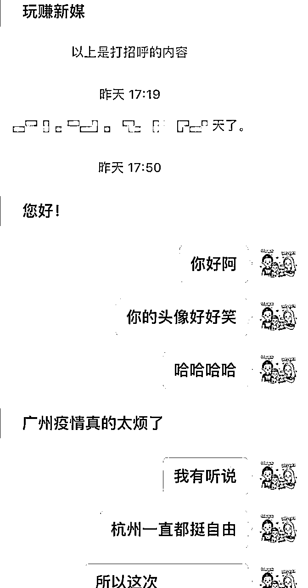

加好友后，什么主题也没说，也没有出现「某某群进来的某某好友」，然后开场就一句你好

这样的状况，我如果真忽略了，就真是忽略了。也不会特别追踪

当然，不追踪是因为我会忘记。

可以想像一个情境，这个人为什么加好友

场景肯定是：

某个人发个名片

某个朋友圈看到的二维马

心想：要不我也加一个吧！反正看到码不扫总怪怪的。

第二种：

就是像这类，我一般都会特别备注（通常都是先置顶）。

等空了，看能不能聊个几句，启动下新关系，这儿先不谈后续回复状况。

如下图：

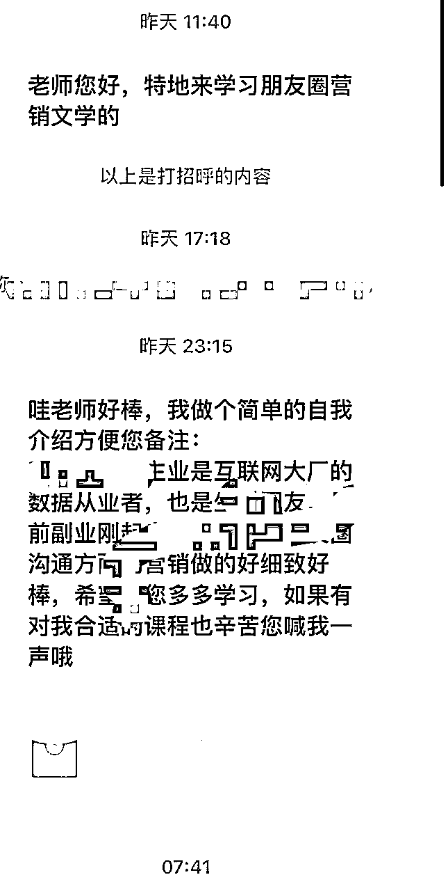

像是这两类，加好友之前，其实就有『明确需求』了。

最少，都很清晰的表达礼貌也有。

学员：

1.备注简单无明确诉求

2.我主动联系以后，无回复

请问这种您会怎么处理？谢谢

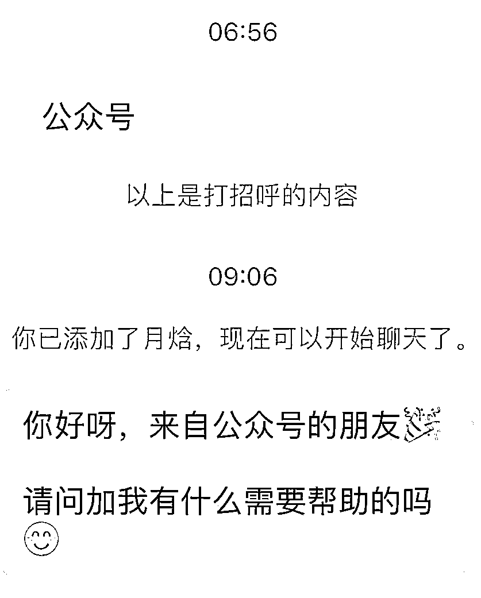

初步的分享，就是这两个判断方式。

决定我会不会特别关注后，然后会有下次的经营。这得看功力。

一般来说，很少有我起动不了的聊天。

当然，就你刚刚的图片，也有那种加好友后，人就消失了，我也会遇到这种情况。

消失了就消失了吧！哈哈！哪天我如果有空，就去聊个两三句。如果兩次後對方都沒回应，我就会放下。

但因为，我有太多人能经营，有太多人能聊天。

与其关注，这少数的几个不回应的。

我更觉得，把心思放在愿意聊的

这思维应该能对你有帮助。

其实，我也有过这样的经历

2018年，我项目重新启动的时候。

两年的时间，我的线下跟人见面聊天超过三千人。

所以我经历过线下都能『见到』3,000人，就更別談我线上聊过多少人了。

基本上一比三的换算，是线上聊天的打底。

所以我是靠量怼出来的，我曾经也没钱过，前几年也因为项目的状况，基本上，就是穷到见鬼，哈哈哈哈！

这里分两种：

第一种：主动触达

第二种：引流进来

第二种又分两种：

第二種之一：转介绍引流

第二种之二：一篇文章的泛引流

我刚临时做的，看的清楚比较重要，做的丑别介意。

从你刚的文字看，目前，会遇到这类状况，几乎都是最后一种被动引流的「泛引流」。

我加上编号，也就是，你的状况可能多数都是『6』。

那这时候要思考的，除了自己能力之外。

我认为，更关键的是

### 你从『哪个池塘找鱼』，刻意的练习『主动引流』

『被动引流』的效果，才能有升级。

但多数人，都不想做主动引流。因为难、也因为没人教，更多地因为没有正确的人教。

这思维肯定没错，但是一定要有第二层思考。

就是，如何让自己能提升频率，不然自己一直都是五，天天只能吸引五。

那怎么变到六？

这会是一个延伸思考，这思路提供给你。@悦佳

* * *

## 跟客户聊天到尴尬的话题，该如何化解？

学员：

我感觉我回复错了，求拯救

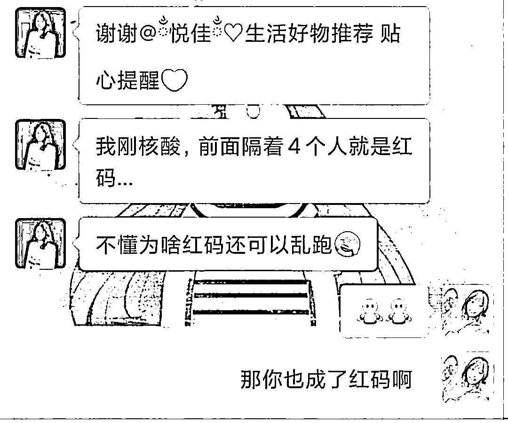

这疫情的时代，红马代表著网红

能遇见都代表好运，这不值得开心吗

像我都不能出去跟别人吹

跟你说今天我碰到一个红马

就在我面前！

* * *

## 跟客户好久没联系，如何开启话题，不会显得唐突？

学员：

举手🙋

想请教老师，一段时间没联系的朋友，如何开启一个新的话题

感谢您的回答[呲牙]

根源老师举例：

好久不见

突然这么找你肯定很唐突

是这样的

我那天看到你的朋友圈

很有感触

我还特别把图片存了下来

想来跟你说声谢谢.......

像这样

有很多种开场，但这种开场最轻，也最容易被接受，或者是能更单纯一点。（举例）

好久不见

才发现我们好久没聊天了

学员：

我发现我一段之间没联系的朋友，很多时候都是偷偷想起，但不知道怎么突然开始，从朋友圈出发这个很自然

根源老师举例：

距离上一次跟你聊天

是半年前

最近也不知道为什么

一直浮现出你的名字

我就来找你了

哈哈

别介意

这样的开场也行

* * *

## 如何开口要钱，不会让客户觉得很「势利」？

学员：

@根源（晚9点讲课）

老师，他说要来支持，但是还没给我转钱，我要怎么提醒他给我转钱呀

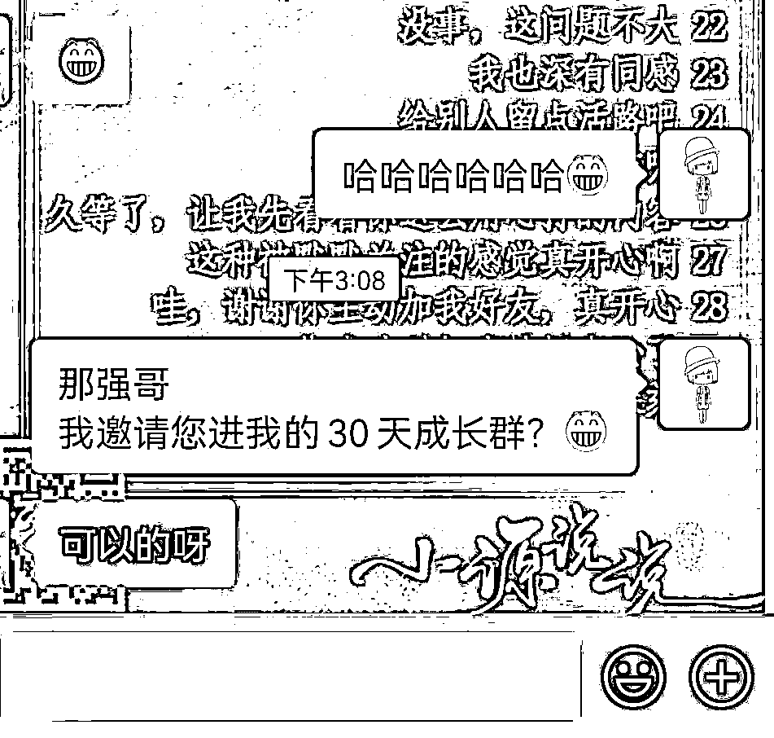

直接开口，举个例子给你看

强哥你好

挺开心，感觉到被认同

因为刚有聊到

您觉得我的群可以加入

既然我都开这个口

请别介意

因为准备要拉您进群

但是进群钱

得支付99元，哈哈哈

不知道您是要微信转给我

还是说用支付宝

明说就好，别担心

我这话，你直接复制贴上就好。不用再改了。

学员：

@根源（晚9点讲课）

老师 我要先邀请他进群吗？等他后面转钱给我？

肯定不行，没转不拉群，因为他有可能拒绝。

顺序不对。最后假设他真没付钱，你踢了不尴尬？

学员：

感觉他现在在忙

我不好意思去催

那我先不管他

等他转钱后

我在拉

对的，他有回，转了在拉群。

原则得顾好

学员：

好的，我刚刚拉了一个，给我一半钱的，说现在微信没那么多

就先给我50元

这可以先拉，但如果是新朋友，还是等齐了再拉。

* * *

## 引流产品的如何定价，能提高成交率？

学员：

@根源（晚9点讲课）

受到您的启发，我有两个引流产品，分别定价39和39.9，是不是就可以考虑让客户选择了？

哈哈，你果然学习力超强，但我有个建议你听听看。

引流的产品，假设确定要设定两位数，最好都从99元开始，一次就是两位数的封顶。

哈哈哈，没关系，我边说完。

支付39元，跟支付99元的人，本质上是不一样的。

我一直认为，初步的筛选，会更好的让你找到更有质感的人。

尤其，你的产品类型都是跟投资相关的。

* * *

## 如何精准地了解客户需求？

学员：

举手🙌🏻，我有个疑问[偷笑]

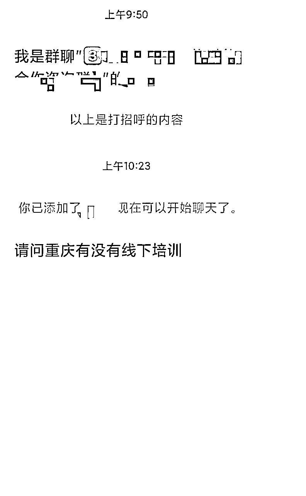

我今天在群里发了课程，及一些相关内容分享，

加上我，上来就单刀直入的问

我该怎么回答，

这是对产品都不了解的人

我会这么回复他

很谢谢你的关注

肯定是因为

喜欢我的某一段内容

我能先好奇的问一下

你主要

问的是哪一种线下培训吗

因为我不只有一种课程

想著先确定你的需求

这样就能

更精准的给上你协助

对了

应该怎么称呼你

我叫根源

* * *

## 如何『温暖关系』，增加客户对你的信任感？

学员：

Emm…温暖关系的话，有套路吗

这个提问上

可能有个用词

我自己会做一点修改

其实，每一段对话我给的解说，可以理解成，是一种沟通『技巧』，但这是不得已代称。

因为，我的很多沟通行为，都来源于：

我知道别人这么对我

我也会感到『开心』、『愉悦』

既然我能感到开心，那为什么不把这样的开心，也同样的传递给他人呢？

这是一个价值观，如果对于我的价值观不熟悉

那这个群看完后，一定会有一种这人也太多套路的感觉。

当然，这也没错，就是不同人对于『套路』的定义，会不太一样。

就像，曾经有人说过：

真诚就是最大的套路

技术，如果没有正确的价值观引导，那技术，就只能沦为技术。

也因为这样，有多数人『完全模仿』我的话术

但人际关系依旧没提升，业绩也没显著的提升。

因为他只是模仿，但并不知道，我会提炼出技术的『初心』是什么。

我之前说过

### 初心只要对，那结果就一定不会错

回到正题

一般来说，我会使用的『温暖关系』

大概是这几大类：

第一：近况

最近一切顺利吧

许久不见

突然发现你私信我挺开心的

第二：最新朋友圈

许久不见

这几天才点到你的朋友圈

最近你更新的几条

都让我印象深刻

第三：疫情

我记得你是在xx地方工作

才想到

那边的疫情都还好吗？

第四：说出上一次聊天时间点

才發現

距离上一次我们聊天

以经过了（多久多久）

今天你突然想到我

感觉真窝心，哈哈

第五：上一次的聊天结尾话题（可能很久之前也没关系）

哈哈

怎么突然找起我了

我们上一次还聊到了（什么什么）

突然被你关注真开心

第六：头像

（没换过）

还是这熟悉的头像阿

才发现

这么久没跟你聊上天了

（换了头像）

我记得

之前头像应该不是这个吧

是换了对吗

才想到

我们有多久没聊天了

（说出上个时间点）

大概是这样的方式，我先快速的凭印象打出一些，哈哈！

等等朋友快到，我想著先把这话题打完

应该有很多种方式可以切入

但不管哪种，其实，就是给出好奇以及给出关心

多先聊几句，就跟

冬天开车，发动前，总得先暖暖车

运动前，总得先拉拉伸

学员：

[破涕为笑]“换了头像” 有点耳熟

所以我得提前解释，不然，都会被认为是技术，这就有点麻烦。

因为这就是我的人生，我的所有内容。

其实，都是我的生活

我所有说的事情，其实都是我所做。

只是，有时候为了教学，不得不把这事情『拆解』。所以就变成技术啦。

学员：

就是让别人感受到你对ta的关注的切入对话

对的，就是这个道理。

* * *

## 遇到「莫名其妙」的人该怎么办？

其实就是反省自己，怎么我就会吸引到这样的人

所以上面提到的点，都是『人设』出了状况

调整一下，这类妖魔鬼怪就会消失了

但初期，会有一阵子空窗期，因为，朋友圈的人会不习惯。

但只要持续，就有机会可以转变人设，其实，对于很多的推荐。

我不太会让东西的推荐，有种『占便宜』的方式，表达出来。

因为『占便宜』，也是种价值观。

既然东西真的好，那就认真的介绍价值

这张对话，我看了其实很有感觉，這不是我的聊天，而是某个群，一位朋友的聊天记录。

當時在群裡，我是这么给出回应的：

我说点我的小想法

希望你别介意

对方有说：

就是我成为合伙人

能给你多少

你的回答是：

具体内容介绍的很清楚

我一般都不会这么回应

因为对方只要问，就代表这东西他肯定没看懂

我可能会说类似这样的话：

对不起

我档案发的太急了

没讲清楚就发

我重新跟你介绍一次......（省略）

当然，这一段牵涉到我的某个价值观：

只要对方有疑惑

只要对方有情绪

肯定是我的问题，跟他没关系

这是一个大前提，除非正式的进入到，我感觉『能成交』，不然：

我连海报都不发

连介绍都不介绍

对于没意向的人，对于这些信任感还不足的人，你给再美丽的海报，写的再详细的海报：

对方都不会认真看，就算看了，上课也不会太认真。

就因为信任感不足，所以引到微信里面后，假设对方问，比起介绍产品，我会花更多的时间，做这两件事情：

1、温暖关系

2、慢慢的聊出『真需求』

回到另一个，人设如何设定的问题：

这问题，很难几句话说完，因为得先清楚自己，想要走哪一类的『人设』。就类似：

找我提问就得发红包

我有很多课能让你买

我是个温暖的人

我这人什么没有就是靠谱

...........

每种人设的搭建，都会有一些些细微的差别。

假设，我设定的是，我這人不能隨便白嫖，那最好的培养方式，就是每次有人提问，开头都可以说：

谢谢你的提问

但有个事情得先跟你确认

这是个很好的提问

你希望我当谘询看待

还是说

就只是想跟我闲聊？

如果是諮詢

我就会收费

但可以让你感觉到超值

那如果只是闲聊

那我就简单说个几句

* * *

## 用什么方式转介绍会更合适？

学员：

我从来没想过转介绍可以通过拉群来完成，今天又是学到的一天

转介绍一定要拉群阿，这是基本礼貌。

你可以想像一个场景：

今天我要介绍你给我朋友认识，我肯定不会说：

你哪一天到哪个咖啡厅，我幫你約好了，你直接跟我朋友见面。

我一定是把你们两个一起约上，然后找一个时间，三个一起见面，我当媒人。（对应到线上，是拉群介绍的方式）

学员：

把线上当做线下一样来，这就对了

谢谢根源老师，

我之前都是两边告知一下

还是先拉个群认识一下吗比较好

肯定，一定要用拉群的方式，这样更好。

* * *

## 善待每一个来的客人，经营好自己的朋友圈。

学员1：

@根源（晚9点讲课） 根源老师，想请教个问题。[憨笑]遇到以下情况，想看老师是怎么回复的～

突然被曾经加入的一个圈子的人加好友，通过他的朋友圈判断出来，对方就是为了加好友而加好友（只有两天的朋友圈。第一天是一句鸡汤，第二天全都是在刷299的负责项目报喜。）

加我好友之后，我说：你好，请问加我有什么事吗？

对方回答：没事！就是想多链接一个好友，资源共享。

遇到这种情况，老师会怎么回复呢[害羞]

学员2：

正好也遇到加人以后的问题。如果有人加了，然后加完以后也不说话，你问他也不回。

遇到这种情况，老师会怎么处理呢？

对方回答：

没事！就是想多链接一个好友，资源共享。

我会礼貌性的跟他说：

谢谢你

真有眼光

我有好多朋友就为了看我朋友圈

才加上我好友的

反正就摆著

因为对方有回答，就代表他有一个比较明确的需求。

这需求不一定是链接，可能就只是想看。

我确实有些新朋友，就这样看著看著，有一天突然问我，什么课程比较推荐他。

### 我们要做的，就是善待好每个进来的客人。

### 然后，把自己的圈子经营好

会留的就是会留，不留就是会走

只要让自己的花，开的好开的美，自然流动就会发生～

* * *

## 这两件事尽量少做，不然很可能留下不好的印象

学员：

根源老师会屏蔽朋友圈吗？

你说的是，我会不会屏蔽别人吗

会阿，目前我应该屏蔽过三个人。

主要是，这些人影响我看朋友圈的心情，就是一直发一样的。

但我不会特别做这件事情，就是哪天某个人，影响了我看朋友圈的兴致，我就会屏蔽对方，目前也就三五个人。

看这数字，就知道我一般不太做这事儿，

就是看我那天心情好不好，如果心情不太好，

这人就同一个讯息发超过五次，我就会屏蔽他。

但目前也就不到五个人，所以，这真的是特例中的特例。看那人多倒楣

我没有什么定义，可以直接理解成，一般我不太做这件事情。

我会给任何加我好友的人，说上一份感谢。

不管这个人，因为什么原因加我好友。

这价值观只要有累积的量一到，就会突然出现一大群，源源不绝的客户。

放著阿！反正这个人暂时不碍事。

一般来说，我不是一个主张『主动删人』的。

因为，主动把谁删掉，总有一天，会出现一个很严重的后遗症。

也因为不主动删人，我就不太需要处理，这人在我朋友圈里面，有没有用处的问题。

我是不太好意思说，哪有这么多好友。

人真的满，那就再弄一个微信号就行。

### 这有个缘由，我知道被别人删除的感觉不好。

### 既然不好，那这感觉就尽量，也别创造在别人身上。

这是我的一个大原则

想像一个画面，你想找一个人，结果发讯息给他后，才知道自己被删了。

这感觉多么糟糕～

* * *

## 不熟悉的朋友经常请我帮忙点赞，该如何妥善处理？

学员：

那我有一个困惑，老师，如果她让你帮这个忙，其实嗯，你没那么方便呢，比如说他让你给他的视频号点赞，视频号点赞的话，就会推荐给你的好友们，然后你给这个人点赞，就代表着你的一定的这个品味和你的欣赏，或者是他让你帮他转发到你自己的朋友圈儿，这种怎么办呢

这个思维，有一个大前提，也是我的主价值观中的某一项。

我的人生败过，真的彻彻底底的败过

四万多人团队，说崩盘就崩盘，一个月二十万变成一个月不到一万

这对我来说是个大事件。

善待人，不一定会得到回报。

但我能肯定，能做到这习惯的人，肯定不会太差。

但是有时候一个没注意，忘记善待人，那某天一定会付出代价。

### 「关系财」是所有的财富中，最难、也最需要好好拿捏的。

这个大前提，才会让我有这样的回答，以及，我自己的人生多数都这么做。

糟糕，我根本就不知道微信会这样推送，哈哈哈哈哈！

但就算会这么推送，对我来说，也不会是坏事。

我举个场景：

可能会因为这样的推送，我某个朋友就发讯息跟我说

你怎么会看一个

这么另我意外的影片？

这不刚好，我又跟某个朋友，因为这事件产生了话题聊天。

这问题，基本不在我的考虑范围内

因为善待人的价值观，远远大于，你说的这种状况出现。

所以两者相比之下，能帮我就会帮一下

当然，有个大重点是，现在我的微信里面，这类的人真的很少很少。

过去曾经很多的状况下，我反而不帮忙，就当没看见。

很有趣，

以前这种人很多，我都不帮忙，结果这种人就越来越多。

现在呢，遇到谁我都帮一下忙，结果，这种人反而更少了。

我觉得这个思维，各位可以品品，很有趣！

回答完毕～欢迎追问

学员：

哈哈哈哈哈哈哈，好可爱

谢谢你的回复，我的行动是，以后别人给我发广告，我不会立刻删掉她了

哈哈哈哈，这都看自己的人设

我的人设不太主动删人，就是，我不会刻意的做这件事情。

### 但我的思考点，都是未来可能发生的代价

不删肯定不会有啥破事

但只要主动删了，人一多，当哪天运程不好了，这些人就会变成一大群小人，然后反击。

所以，如果知道这事情，可能会得罪某某人，

不管这某某人是大是小，这事情，我一般不太做。

但还是回到一个重点，这是人设的问题

删人也有删人的人设，但要怎么做的艺术，也是一门学问。

* * *

## 如何温柔同时又有力量地拒绝对方的要求？

学员：

我也有个问题想要跟老师请教，就是有人给我私下聊天然后推课程或者产品之类的

会说一起来玩呀、或者福利史无前例啊啥啥啥的

就是会一直劝

但是呢 我内心并不是很想 但是又不好意思直接说不要

尤其是当对方关系并不是非常陌生甚至还可以的时候

我一般的回复会是

谢谢啊 有需要我一定第一时间找你的

谢谢啊 我暂时不需要

想请问一下

碰到需要拒绝的场合

有没有更加直接温柔又有力量的回应方式呀

这样的状况，其实就说实话就好，就说

暂时没需求

又或者是

对不起

因为每年我的知识付费

都会有一个比较清晰的管理

主要是现在钱也没这么多

谢谢你的推荐

我会放进考虑范围中

但现在

应该不会这么快的下决定

真的抱歉

就类似这样的回答

有时候说理由，要一说就把理由说死，合理又好拒绝。

不要说那种，我考虑考虑

这种回答就是让对方，过几天再来问你的回答。

比如说：

没钱，我的课程都是老婆管理

这种别人无法拒绝的理由，才好更果断的拒绝

又或者是

对不起

很谢谢你给出这么大的优惠

但对于付费课程

我一直都有清晰的规划

这个主题

我暂时真的用不到

但如果哪天

我想要破圈学新东西

我肯定第一个问你........

类似这样的说法

很多时候，说实话也是个很不错的回应方式。

* * *

## 如何做一个合适的自我介绍，让客户印象深刻？

学员：

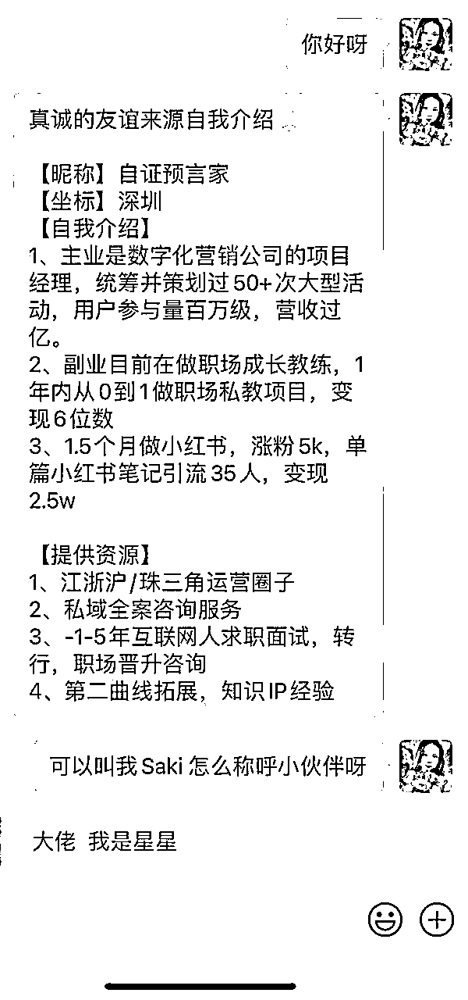

比如像这种情况 我就不太想回了 或者说 我也不知道咋回

学员2：

每次加其他人看到人家发的自我介绍，我也不知道咋回，感觉人家好厉害，自己没什么好介绍的，暂时也不需要别人提供资源，也没有资源提供给其他人[破涕为笑]

学员：

此刻，我想到的是，我会这样回：

星星你好哇

我很普通

不过遇上你之后我就成为了【大佬】

因为这是你赐予的耶

很开心有你的鼓励

我们一起努力吖，加油冲冲冲

演讲有一个框架：

文字 7%

声调 38%

肢体 55%

我简单解释一下

一个好的演讲者，内容再好，最多就是获得七分满分。

真正的高手，声调跟肢体，肯定都是超级厉害的。

我会想以这个为开场，谈自我介绍这事情

想说是，文字上的卓越，最多也就得个七分，不会太高的。

那这七分，应该要怎么做能拿高分呢？

这其实不是我的强项，只能说一点对于这事情我的看法：

⭕️第一：内容肯定不要太长

不要超过手机版面的2/3，因为太长，对方一定不会想看。

⭕️第二：文字不要全部糊在一起，最好要有编号排序。

就类似

1、

2、

3、

4、

因为自我介绍要谈的，就是重点

在自我介绍里面，放太多细节，意义并不是太大。

除非，你是个超级大v，那别人就会想看

⭕️第三：不要出现太多，自己现阶段承接不了的数字

我会把这个，解释成『 虚假数字』

这是我自己的观点，不代表所有人

我看过很多自我介绍

曾经操盘过千万项目

曾经跟周杰伦合作过

曾经做过万人会场

.......

看著很光鲜亮丽

结果我跟这人聊天聊不到五句，就知道这数字

百分之九十以上，就只是『轻度参与』过

又或是朋友圈发的文案拍的照片，一看就知道是个水货。

可以理解成，数据跟真实不符合。

⭕️第四：真实度要高

现阶段是什么样子，文字上就呈现什么样子

人有一种特别的感受：

文字给出80分，表现只有60分。

文字给出80分，表现只有75分。

这两种都会出现『失望』

但如果变成：

文字给出50分，表现却有55分；

文字给出50分，表现却有70分；

这就是一种正向落差，会让别人感觉，你真是谦虚了。

⭕️第五：something different

怎么让自我介绍，跟别人不一样

这里我不太建议，

自我介绍发的是『链接』

又或者是一个公众号

又或者是某个网址。

这都不是一个，我觉得好的呈现方式

一张图片或是一段文字自我介绍，这是在微信生态中，最好得呈现方式。

我见过一个朋友的自我介绍，就让我看著很深刻：

这张，这就会让我觉得，非常不一样。

也不用转到什么网址，图片点开，马上就清晰明了

文字的话，原则就是说重点，内容不要太多

（三分之二版面以上就过多了）

我其实挺少发自我介绍的

主要是，聊著聊著對方就知道，我到底是干嘛的。

另一个点是，除非对方主动问，不然我也不太发。

因为主动问就表示，这人有兴趣

如果他不问我发，那对方有很大概率是不看的

大概是这几个点，因为我是随性打，所以比较不这么严谨。

但暂时应该堪用～

欢迎追问，我说完啦~

喔对了，还有一个重点：

自我介绍里面，尽量呈现一个重点，呈现一个过去『殊荣』。

不要打太多，不然对方会看的很撩乱，你到底是干嘛的，怎么感觉做这么多事情。

一个重点深入，再延伸，这是更好的方式

举个场景：

你想买大米，结果去了山姆一看，一次一百种品牌，每个价格还差不多

这时候，多数人只会混乱

但如果一进到店里，发现大米就俩种，南方米跟东北米。

这时候挑选就会加快，因为也没啥好挑，就两个

自我介绍也是，不要说太多，尽量把焦点放在，『目前』的重要项目上。

或者是，目前比较著重的事情上面，这是更好的表现方式

以上～

* * *

## 不同信任程度的客户，如何成交？（有场景示范）

学员：

我需要提问哈，因为关于成交的卡点

我认为是大家都需要所以就在群内问了

是这样的，我这几天推出关于年度复盘的咨询，其实问的人还蛮多的，

只有两种情况，要么直接转钱，要么无疾而终

我也不知道怎么再继续

这样就没了

@根源（晚9点讲课） 宁应该是一眼就能看出沟通上的问题

而我现在看不破

另外就是：我还有其他方式，再去交流一下吗

一般来说，只要对方『主动』问我。

这时候会分四种状况

第一：转介绍朋友提问

第二：老朋友（过去买过我的产品）

第三：老朋友（过去没买过我的产品）

第四：新朋友提问（某渠道引流）

这四个，由上到下，同时也是信任感排序。

第一最高、第四最低

信任感，同时也决定成交率的高与低

信任感越高，成交当然越容易。

会这么问是因为，假设成交数很少，那这四个人就属于『现况』。

但如果这个产品，已经有很多人买，那这四个人就只属于『个案』。

我按照排序（不同场景），一个一个给出答覆。

⭕️第一：转介绍朋友提问

只要是转介绍的朋友，一加好友就问产品，我肯定不马上解决产品问题，会问几个问题：

1、能先知道一下，你是哪个朋友推荐的吗？

2、朋友有跟你说，这产品的价格吗？

这两个问题确认后，我才会回到正题，解决产品的细节。

能知道是谁推荐的，我就能清楚，推荐的人大概是什么段位。

越熟悉的学生转介绍，基本上，我都能做到百分之九十以上的成交。

但假设，转介绍的只是一般学员，就是上过一堂课，或者只上过两堂课的学员。

那我就会花更多时间，确认对方的需求，以及，是否『真的有需求』。

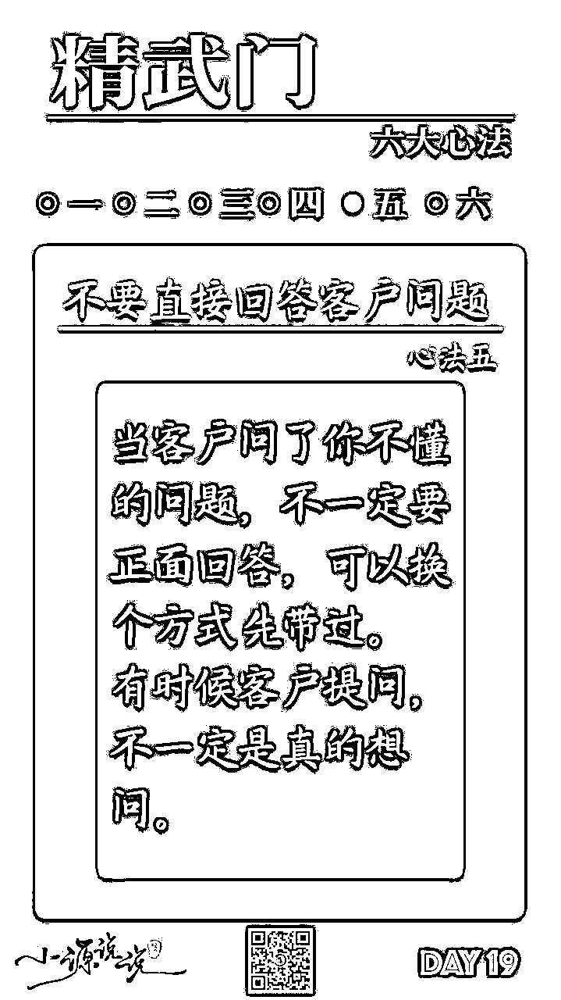

⭕️第二：老朋友（过去买过我的产品）

这个好解决，因为有交情有关系

基本上只要问，就表示需求非常高，就是有没有钱，有没有时间的问题。

这个我会闲聊，然后该成交就直接谈成交。（寒暄闲聊估计三到五分钟）

⭕️第三：老朋友（过去没买过我的产品）

老朋友代表有信任感，如果一直在我朋友圈，突然问我，这肯定是他有需求。

我大概会用这样的方式开场：

许久不见阿

我们挺久没聊天的

上一次的结尾聊到了（拉最近的历史纪录）

（这里一样先闲聊个几分钟）

然后，闲聊后我会这么说，『这个叫做转折词』。

聊了这么久，都忘了解答你找我的问题。

你怎么突然问起这课程

是因为有需求吗

还是说有其他原因

因为课程是需要付费的

虽然不高

⭕️第四：新朋友提问（某渠道引流）

这个是信任感最低的，因为没信任感。

但大原则就是，客人来了就得好好招待。

我一定会聊十分钟以上，才切入他的正题。

聊天内容很多，可以看看我过去的纪录，

反正认同夸奖，找出朋友圈的共鸣点跟他聊。

类似这样的方式

用这样的方式聊下去，因为我提问，对方肯定回答。

只要对方没有主动说，怎么转钱给你

我就会说，

如果有什么课程上的问题

你都可以问我。

假设

真觉得可以信任我一次

当然也能直接转帐～

这样我会很开心

这时候来个『转折语』

都忘了你加我好友

要问的是跟课程相关的事情

我现在来给你解答

能先问一下

是什么样的原因

让你想问这个课程

因为复盘的课程

肯定是

对新的一年更有期许的人

会关注的课程

我就会接著说

因为这课程不是免费

假设这个复盘课

需要支付一点费用

這也是你能接受的吗？

方式差不多，主要就是寒暄的方式不同。

但这有个重点，对方问产品，我很少直接就回复产品。

销售里面，有一个大主题叫做『精武门』（图片是我的课件内容）

### 精武门第五大心法：

### 不要直接回答客户问题

举一个简单的例子，

没经验的卖车业务员，听到客户要买车，肯定马上说：

我跟你说

最近我們的什麼車賣的多好

啥啥啥之类的

我不回答问题，而是夸奖以及闲聊。

几句后再回到主题，效果会更好。

就类似这样的转折问他，他肯定回答。

假设对方回答的很详细，

但如果是我，客户跟我说要买车（微信上问）。

我肯定不会回答买车的事情，我就会说

这一年生意肯定不错，都考虑要买车了。

假设这张对话，我会用这样的方式问：

谢谢你的询问

肯定有特别看我朋友圈

我感觉挺开心的

回答课程细节之前

我能先问问

你怎么会对复盘有兴趣呢？

又或者是

怎么会对这堂课有需求

（先等对方回复）

第二个想问的是

假设课程你购买了

最少要留1~2个小时给我

这时间你是否能空出来

如果你确实有需求

这时间

你也能特别空出来

假设客户说没问题（等他回复），没回复我就不会继续打。

我就会接著说：

谢谢你

我感觉到你的意愿度很高

这产品是这样的

........（开始介绍）

但介绍不要多，简单个三五句说重点就好

这时候对方真的有需求，肯定就能进入成交环节

总结：

我很少把『发球权』放到对方手上，主动提问，就是一种『发球权』。

这就跟下棋的先子一样

不管主动被动，我都会想办法，把『发球权』拿回自己的手上。

也就是，让自己变成主动性。

用提问的方式，对方就会一直说

只要说，那我就能确定需求。

这个主动性的转换，最好用的方式就是：提问。

这是主要的方向，我的销售课有教过一个主题，叫做：SPIN销售

这就是一个，专谈『提问』的大主题，但这里无法深聊。

沒確認需求前，我都很少直接说产品是啥，产品细节是什么

* * *

## 销售过程中，如何更好地确认「需求」？

学员：

今天的分享很有收获

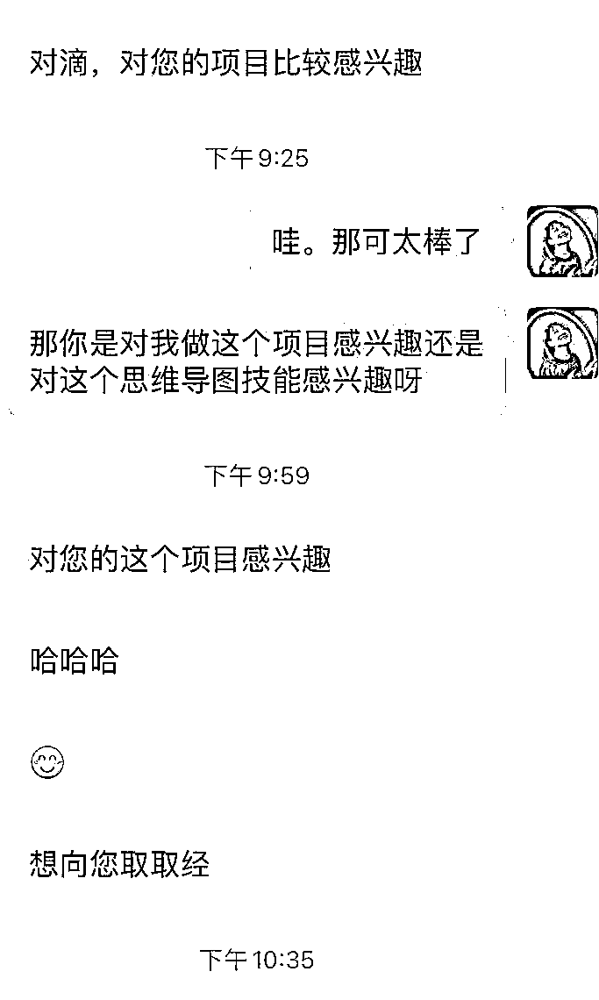

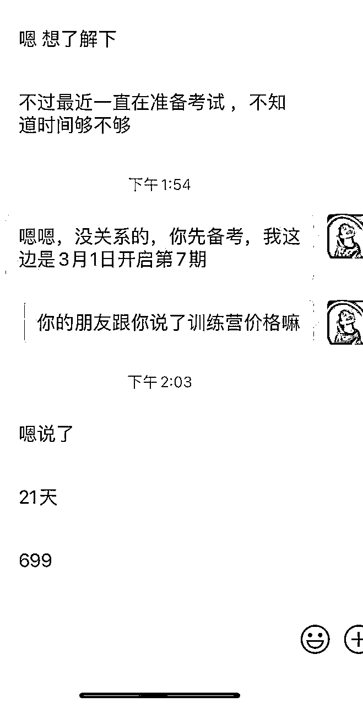

今天两个新好友来加我，我也用上了一点点根源哥分享的技巧

前面就把对方来意和需求了解清楚，沟通太高效了

早安阿

完美，对方提问后，不能直接回答，而是马上丢一个『选项式提问』。

这都是一种「确认需求」的好方式。

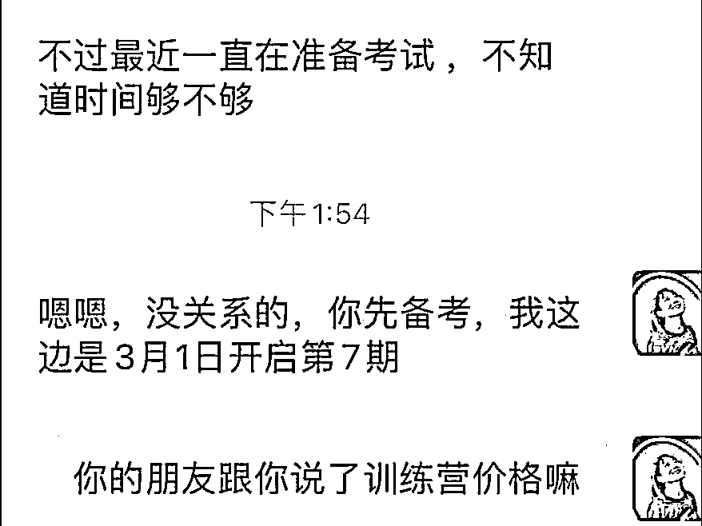

这段其实很重要

当对方说出了『困难点』，我們优先要做的，不是继续销售、继续说服。

而是先认同：

对，你真的忙

这是一种站在对方的立场思考

最后一段话，说价格之前先问对方，是从哪边介绍的。

如果早就知道价格，那就表示——对方在预算上肯定不是问题，连预算都不用重新测试。

完美

这时候我就会再多一句：

对了

如果这课程对你来说

是有确定需求的

你希望考试完再報名

还是想边考试

边上课？

考试肯定是第一优先

但因为这课程

每天需要花半小时左右

如果这时间

你觉得对考试影响不大

我其实挺建议

边学边准备考试

因为思维导图

重点在于疏理逻辑

说不定每天的一点时间

还能增加你准备考试的效率

这是我的一点过来人想法

想著一起跟你说

如果确定有需求

我先把你备注

然后

等确定开课的前一周

我特别私信提醒你

你看如何？

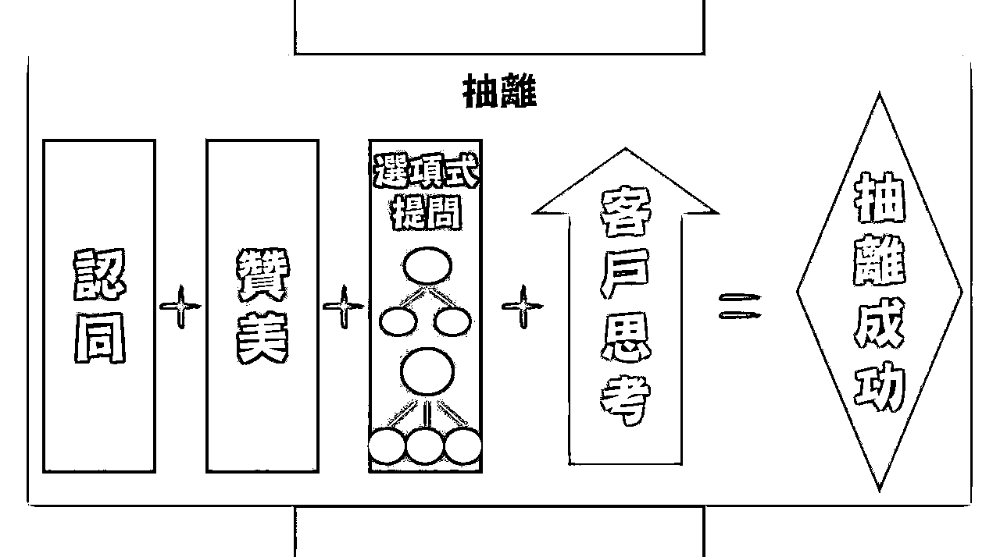

这是一个，我过去课件里面，谈到抽离客户思维的模型。

拿掉「抽离成功」，只要能透过沟通，让客户开始思考，成交率最少提升一倍以上。

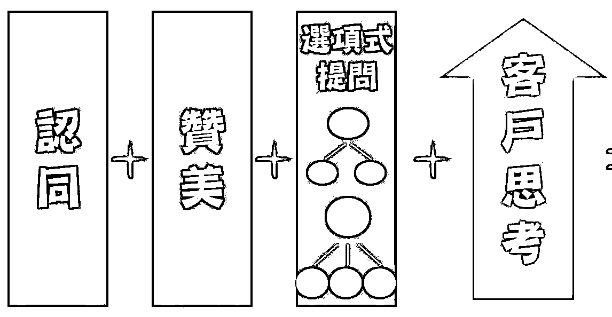

就是这一小段就行

* * *

## 如何做到「不被白嫖，还顺带提升自己价值的」？

学员：

求助根源老师，我觉得碰到这样的人，很难再礼貌下去了

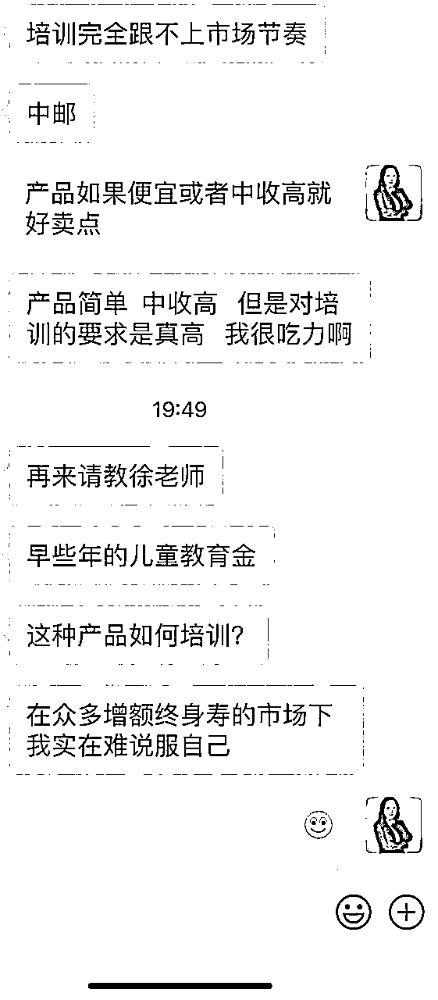

这是我曾经的同事，永远只在想要求得帮助的时候找我

我暗示过，但是她装不懂

是不是就该直接请她买我产品了[破涕为笑]

这样说吧

### 我觉得有个大前提，

### 得先把『白嫖』这个词，从思维中拿掉。

我直接说看完图的想法

单纯就这张图来说

以我的角度看，客户问的问题其实很正常，我也不觉得失礼。

这里有个大价值观：

如果看到某个文字，或者是某段话，『我』心情有波动，

那一定不是对方的问题，

是我过去的某个『伤口』，被对方引动，才导致心情会有起伏。

回到刚刚的观点

这张图我看了就觉得，客户的提问很正常。

但你看了会觉得，这人不太对，

有人看了会觉得，这人在白嫖，

每个人看都有每个人的『感觉』

所以重點不是，对方『说什么』，而是我的心到底健不健康。

学员：

是这样的，她不是我的客户，是我以前的同事

认识10年，几乎都是只在求助的时候出现

这就是筛选阿

学员：

所以我承认根源老师说的，是她触碰到我了点了

有种老娘就不想和你玩儿了的心情

同频率才会相吸，其实，你主动拒绝他几次，不回复几次，這人下次就就不再问你了。

因为『客户』、『朋友』，所有的举动，都是『我』惯出来的。

⭕️一种思维是：

这是我认识十年的朋友

每次只有求助的时候出现

⭕️另一种思维可以是：

这是我认识十年的朋友

这次我觉得，要让他知道问我问题，必须要付钱！

其实都是思维，就看最终我们选哪一个。

交情很长的朋友，你也知道，这人过去总喜欢一直提问，只有需要才问你。

这种状况，就用最好的拒绝就行。

抱歉我要忙孩子

抱歉我接个电话

抱歉我正在开车

..........

这些对方也无法拒绝的理由，然后忙完你也不理他，

久而久之，这人就不会再问了。

因為他會知道

嗯，这十年的朋友，好像不太理我。

### 沟通都是一种修炼

也只有进入到实战沟通

才会发现，原来过去的我，有这么多累积已久的伤口。

最怕的事情是，我从来不跟这些人说，问我问题要收费。

结果他每次问完消失，我心里都不愉快，怎么每次都白嫖我

这也是一种，『规则』没有说清楚

慢慢筛掉就行，人设的建立，本就需要时间。

另一个关键是，『朋友』是需要分群体的：

家人、学生、学员、普通朋友

准备经营的人、陌生人

关系好的朋友、.......

只要把朋友分类分清楚，其实，很多心理问题，都能迎刃而解。

@小女巫忻忻 | 销售教练

筛选老朋友的最好方式，給你一個小绝招

每次这类人提问，你就过个一小时再回复

回的内容就是：

抱歉

刚刚有一个付费谘询

回慢了

但这问题

没办法这么快给你回复

因为

我马上还有一个案子要接

得晚点回你

三次过后，这人要么消失，

要么就会对你好奇：你哪来这么多付费咨询能接？

当然，你有没有接咨询是一回事

可是，回复技巧是一回事。

这方法提供给你

拒绝的得体，

同时，又能顺便提升自己价值。

### 别管对方怎么做，也别思考对方想什么，把自己做好就行。

* * *

## 付费咨询中，如何做好「结束咨询」的收尾？

学员：

还有个点我也想和大家讨论下哈 就是一次性咨询的用户 问了这次问题后 还是会找你抱怨或者去聊些有的没得的事 这时候应该如何委婉的拒绝呢

1、我不太喜欢听别人抱怨

2、我觉得一次性咨询完过后 偶尔一两个不复杂的问题我能接受 但是总这样 我不知道如何给他介绍其余服务 or 拒绝掉

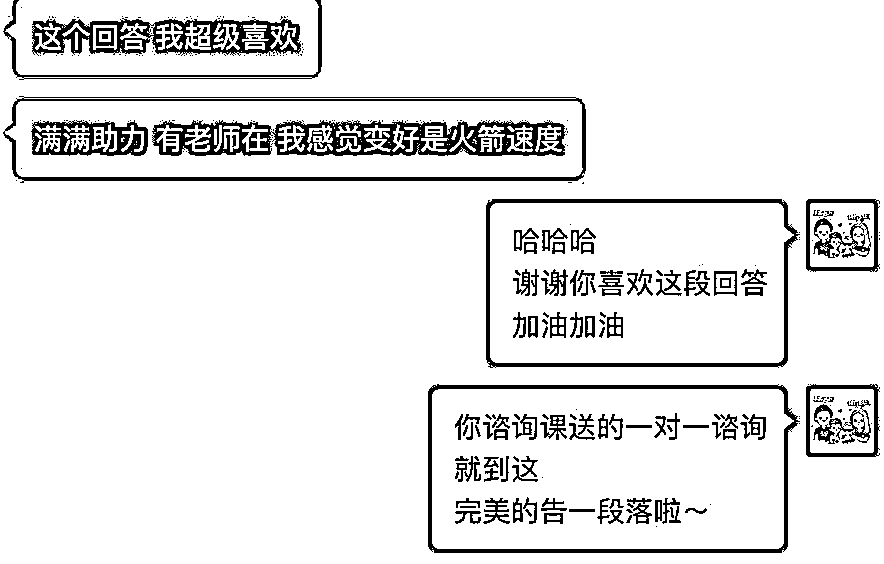

每次諮詢結束的最后，用一个文字性尾声就好。

就像上面这个对话。

让他知道服务已经交付完毕，下次就得再付费。

如果怕对方没明白，就多一句：

下次的提问

就得是第二次的独立谘询啦

说一声就好

很多时候的问题，都跟客户无关，而是销售员自己没讲清楚。

交付者，都没把规定说清楚

所以呢，不是被白嫖，是我没说清楚，导致客户也不太明白。

他可能不是真的想嫖，就是不清楚规定。

学员：

我觉得有时候挺那啥的 你把别人当朋友 别人就是把你当工具人

@自证预言家Saki

哈哈，这都是你自己多心了

当你把对方当朋友，那他对你做的一切，都不会是工具人。

因为重点是『你的作为』，而不是『他的表现』。

* * *

## 了解客户需求过程中，对方反复问价格，该如何妥善处理？

学员：

如果执着于想知道价格呢？

我在挖需求的时候，客户反复问价格，这种情况怎么处理呀？

其实报价这个事情，有一个前置动作，就是『抓预算』

### 「抓预算」是每一个销售员，很需要具备的能力。

透过聊天的过程，去猜测客户大概有多少预算

报价之前，我一定会找到一个契机，对客户提类似的问句

能知道一下

假设你对于这件事情有兴趣

你有预算上的考量吗？

因为我的课程

有不同的价格

如果你有一个预算区间

我给的建议

能更贴近你的需求

学员：

很多人一听到预算，就没有回复了

好点的回复，我考虑下

差点的，直接没下文了

这是不是说明不是精准客户啊[破涕为笑][破涕为笑]

有两种情况：

⭕️一种就是你谈到的，对方并不是精准客户；

⭕️但也有一种可能，就是聊天的逻辑没使用好，导致问到了预算，对方就消失。

与其说沟通是一种技能，更不如说，沟通是一种行为模式。

只要习惯了，那就容易知道下一句，应该要接什么。

行为模式，都得需要『大量』来培养，最后变成习惯。

同时，『不打折』也是一种人设。

这事情，第一次要是坚持不下来，那未来就很难坚持。

但这有一个大前提

当案子的量还没这么大的时候，该打折还是得打折，

就是设定好一个底线就行

因为自己不够强壮，然后还不打折，那最终就是案子很难接。

初期，我基本都會給出折扣，甚至折扣我还会说在前面，就类似：

你是某谋朋友介绍的

这个项目就是八折

当折扣说在前头，对方就不会再杀价。

因为给该给的面子，我已经提前给足。

* * *

## 面对客户对于价格的质疑，该如何回复？

学员：

有一种情况，就是实体，同质化的产品，因为运营成本不同，渠道不同，所以可能就是比别人卖的要贵点，区间一两块吧，面对这种的质疑如何回复。

比如客户说，一样的东西就你们卖的贵些[破涕为笑]

认真解释阿

*   同样的产品，有人敢卖更高的价格，那溢价空间就一定是服务。

怎么去更好的，解释自己的服务会花更多心思

很多时候，客户要的只是一个有诚意的『说法』。

就算真不打折，『说法』也得讲清楚。

因为当你说清楚后，后续的服务真的到位。

这时候，这客户就稳了，肯定会继续转介绍。

甚至，还会帮你跟其他客户解释，说明为什么不打折。

但这种人设崩一次，那就很难守住了。

*   另一种方式就是『分级别』，也可以理解成会员制。

最基本的方式就是

第一次买：原价

第二次买：九折

第十次买：八折

...........

类似这样的方式

*   第三种就是，假设是实体产品，與其打折，还不如多送。

就类似

对不起，折扣真的没办法

但我能多送你什么

像我去年的沟通课131.4元，以及其他的课程。

只要是第一次买课的学员，基本上，我一定不打折。

我几乎只把优惠，给二次甚至二次以上的复购学员。

这都是一种人设上的『规则』

规则只要清楚，每次解释一下，时间一长，人设就能定下来。

* * *

## 客户领完资料后，删我好友，什么样子的做法更合适？

学员：

今天早上刚好碰到一个状况，想听听根源老师的看法

这位朋友是之前从小红书过来找我领取资源的，领过资源以后也没有给我任何回应，今天早上突然给我打招呼，但是我回了以后发现她把我拉黑了[捂脸]

我的第一反应是要把她删了，但又想到是否能通过朋友圈寻下这个人，因为心里挺想知道她到底找我想干嘛[破涕为笑]

但我不确定这样的做法是否合适，所以想听听根源老师的想法@根源（晚9点讲课）

世界这么大，怎么会把时间，放在这样的人身上呢

请跳过，下一个会更好。

学员：

哈哈哈哈，一句惊醒梦中人！谢谢根源老师~

* * *

## 如何二次追踪客户，或者如何跟客户要钱？

学员：

请问遇到这种状况，我该如何二次追踪

更直白的说，我该如何要钱？

一般遇到这样的状况，有两种可能：

*   第一种：变相的不想付钱，这是一个，挺好用的推托之词

*   第二种：真的需要时间考虑，有需求，但要等等

这在销售中也是个很大的主题，就是「如何跟进要钱」。

要的好，对方就会欣然付款

要不好，就会让客户反感

这是个需要拿捏的重要环节

我一般都会这么回答：

没问题

谢谢你的考虑

我明天中午前跟你确认可行吗？

或者是说

我能知道一下

你目前主要考虑点是什么吗？

是要准备一下学费

还是说

怕上课时间会有冲突？

会这么问是因为

我挺希望你能成为学生

怕过程中

有些我没有解释清楚

所以多问一嘴

大概这样

* * *

## 看似推销的新「好友确认」，该用什么样心态应对？

学员：

@根源（晚9点讲课） 老师，这类人您平常会直接同意吗？

挺有意思的，哈哈哈，我在想加了她，会不会给我一直发广告

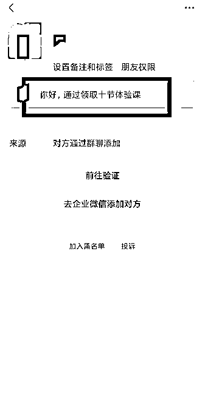

加阿，反正你也不知道，这人到底要干啥。

加了聊聊，发现最终一直发广告，那就砍了！

学员：

哈哈哈，好

这里的【砍了】，是指拉黑还是删除呀？

挺好奇老师的答案

删除阿，但如果你的好友没这么多

那摆著就摆著吧！反正不影响

学员：

好的，老师

所有的事件，都不要『内心太多戏』

你用了『我在想加了她会不会.....』

这就是一种『想像』，因为没发生，但你就开始猜，

这种想像没意义的

以前做销售的时候

初期没经验，得打电话给客户

当时多有趣，没打之前心里就开始脑补充

接起来

客户一定没空

客户一定会说不要

..........

但最终发现，客户不只没说这些，还刚好说有空，愿意听。

这就是一种脑补

这种脑补，只会产生心情内耗，对于没发生事情之前的幻想

只会消耗能量，这种状态下用处不大

所以放下这些『幻想』，不用管对方怎么样，只要认真的跟自己说：

### 不管谁

### 我都要给出好的服务

做一下刚刚话题的总结：

重点不是对方怎么样

而是，我能不能给出更好的服务，该用心用心。

用心这事情，跟对方是谁无关，而是对自己的期许@阿满

* * *

## 如何礼貌又不得罪人地拒绝「借钱请求」？

学员：

问大家一个问题，如何拒绝别人借钱，说成这样，不借好像见死不救，借了我怕没得还

如何做到礼貌又不得罪人的拒绝[破涕为笑]

对于借钱这话题

我想，在很多平台只要有类似讨论，都可以得到非常多的关注

我想说说这事情，我个人的看法

⭕️第一个观点比较特别

如果有个朋友，跟我借一千块，我先不论熟与不熟

这金额如果我犹豫，更大的状况下，肯定不是因为交情的浅与深

可能是因为，这笔钱对我来说并不小

我用一个不同的观点开场

这是一个很值得深思的考虑点

⭕️第二个观点是

我们常常忘记

其实，开口跟别人借钱，也是一种勇气

我也曾经有一两年的时间

状况真的很差，也没什么钱

当时也到处跟朋友借钱

看似用文字，发个借钱内容很容易

但其实不是的

发之前，都要考虑好久

也觉得没面子，更觉得对朋友过意不去

这已经不是能不能还的问题

而是，光开口跟别人借钱，就发现面子挂不住

也就是，开口借钱真的需要勇气

不是想像中的那么容易

说直白一点，生活都顺利平安

赚钱都顺顺利利，信用状况又好到银行能随时贷款

讲真的，这样的状况谁愿意借钱

开口借钱，谁没几个说不出口的理由

如果手头宽裕，这人交情也还凑合

对方借的数字，又不是一个会影响到目前生活的金额

假设真愿意借，那就爽快一点转给他

说一句

最近大局势下都辛苦

等宽裕了记得还

但目前我还不急著用

你先用著吧

如果觉得不想借

那就说一个对方无法拒绝的理由，就类似

抱歉

因为钱都是老婆管

我手边还真没这么多钱

这忙我估计帮不上

又或者是：

对不起

因为过去有些不好的经验

所以我自己有个原则

不太跟朋友有金钱往来

再熟悉的

我都是同样原则

真的抱歉

这种真就属于

个人原则上的理由

对方都可以理解，不理解也没办法，哈哈

因为最终，就是愿意跟不愿意的两种方式

既然就两种选择

那就别花太多时间『议论』对方

因为总有一天，『我』也可能会遇到一些突然状况

假设，我鼓起勇气开口跟朋友借钱

结果，就落的对方一阵批评，最终还没借到

这事情是多么的难堪跟尴尬

总结呢：

交情这事情，真的要更深入的谈

肯定某些状况下，跟金钱会有些瓜葛

谈到这些事情，爽快一点

毕竟，很多交情的考验，透过钱是最快的

一对比能接受的亏损金额

就能看出

哪個人能長期交往

哪个人不能长期交往

这不很划算吗

最后呢，既然不想借，那就别再这过程中，無意的損了對方

刚好一点自己的小分享

各位晚安～

* * *

## 如何对社群里的客户群体，做二次筛选？

学员：

@根源（晚9点讲课）

老师想请教一个问题：就是我社群现在人多了，我想筛选一下，很多人进来了，但很久很久没买过一次东西，也不互动，估计是不看群的，这种人我打算请出去。我怎么更好地去处理又不影响大家的感情呢

我昨天是这样的，你帮我看看合适吗

好阿！有对话记录吗？

1.对「群性质」做清晰的定义

学员：

来了！我非常认可你上面说的，即使成交没有，但是不希望把关系弄的糟糕，所以我也不想去伤害到别人，就尽量委婉一些。但又希望社群能留下同频且认可社群价值的人，所以我不得不做下筛选

这么说吧

我觉得，得先做一个『群性质』的分类，不同群有不同的性质：

引流群

学习群

轻运营、重运营群

产品群

高价格群

.................

这些都属于不同的『群性质』

⭕️假设是个商品群，那「活不活跃」就不是重点了，重点是：

更新产品的速度，是否快；产品的选品，是否精准……

这都得看业绩单量来测试

⭕️那如果是引流群，这就更属于快闪

反正说完重点就可以撤，运不运营不重要

⭕️如果是学习群，那就得看高价格还是低价格

这我就会定义成产品群

因为最终，就是要把产品卖出去

这时候，什么人进群就很重要了

进群的人，是随意就能进的呢？还是说，进群前你就筛选过？

这会取决于，产品能不能卖的动，以及能不能放更高单价的产品

这样的群(产品群)，后期做筛选就比较难

因为，一开始没筛选过，当你第二期要做筛选，就容易得罪人。

学员：

筛选过 我一般是通过干货引流 就是在朋友圈发我社群的分享，感兴趣就进了

所以，产品群的筛选方式，最好的法子：

别管那些不回应的，直接拉出表格，找出只要花过钱的人，拉到二群

你刚发的图片，应该是私下找他聊天对吧

这样的方式就不太好

因为，沒有誰規定過，我进你群就得看你消息

进群他看不看消息，都取决于，这内容到底有没有价值

没价值我能不看，就算我付了钱，都可以进群不活跃，不看消息

所以，为了不让自己失望，千万别用这样的提问结构——私下找他。

肯定不会得到好答案

2.二次筛选，最好的方式，是重新拉群

学员：

对的 我最近就是想筛选一下群里人 即没有消费 平时也不出现的 打算聊聊就抱出来

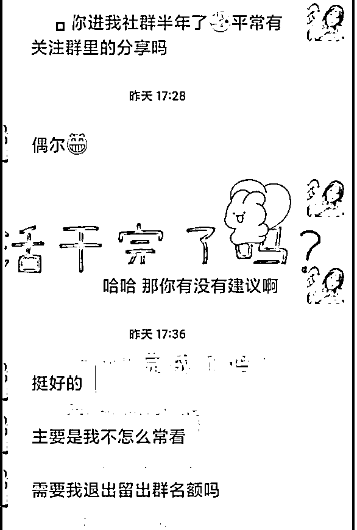

你看(上图)，对方肯定尴尬

所以群留著，再次的筛选一次

把买过的拉群，只能这样的方式

学员：

那这样子后期怎么运营呢？

这时候能转变的方式有三种：

⭕️第一种

进群的人要从哪弄进来，如何引流？

⭕️第二种

把买过东西的人，重新邀请到二群

这时候有两个步骤：

*   先群发，让有兴趣的私下跟你联系

*   群发后你还得私下一个一个邀请

因为最终，买过东西的人进到二群，能有一半就了不起了

⭕️第三种

你要有新产品

「产品为主」的产品，一定是链接最轻的

因为产品没啥信任度，喜欢就买，不喜欢就不买

你要怎么让自己，可以卖思维而不只是卖产品

所以，治本的方式，就是你得开始卖点知识类的，然后再引流

产品出发点，信任感的关键是——产品好与坏

知识出发点，信任感的关键就是——你自己

这也是个人ip的概念

3.真正的解法是，从「卖产品」，升级为「卖自己」(个人IP)

学员：

嗯嗯 我有在坚持分享一些知识

当然还有一种方式，就是群里的某个超级漂亮大佬@美德布耀布耀德

假设你希望产品卖的动，还有一种，就是美德的方式

美德有个高架产品群

接著，跟他们说有个福利，我会推荐很多我自己私下用的东西

不管是吃的还是用的，你们可以加进来

高单价产品卖的动，低单价产品，变成会员福利额外拉群，这状况也能卖的动

因为已经不是『卖产品』出发了，而是，给客户的『额外福利』『售后服务』。

这意义不同

学员：

我现在做的是社群团购，低价 高价都有

但我之前做群买买的，主要还是低价

这肯定有用，但效益不大。

你就想一个场景

今天你去买coco奶茶

他们在会员群分享

喝奶茶能有什么健康效益

你看吗？我肯定不看的

因为群的性质，就不是分享知识

只要是『团购』，价格肯定就高不了

先定义「高价」，产品价格最少要五千以上，这才叫高价

用团购买高单价，是我，也不敢买单

这是性质问题

你想改变目前的状态

那就只能用技巧，筛选再筛选。

但意义不大，我也不建议，也会累死你。

做自己的知识产品，纯卖知识，再转商品

会让你真正的解决现况

学员：

那意思是我现在最好是重新建群了，把买过东西的重新拉进去，不要这样子去私聊对方啦

应该说

你要重新再開一個，但不要私聊那些没买过的，这方式不太好

原本的也留著

迭代群的过程，不對的人讓他自然脫落，

不要手动杀人，这只会有反效果

越筛选人数肯定越来越少，但这是铁则。

4.具体建议：运营好当前产品群的同时，拓展自己的「学习群」

学员：

那运营上 我需要花更多时间了，比如产品上新 ，两个群都要上，但其实他们都在，会不会很烦啊

不会阿

产品群不就是要一直发产品吗 哈哈

不然产品群还要干啥

因为你要解决的，不是产品的问题，也不是群运营的问题

你的提问逻辑，会让你陷入一个罗生门

我在一个工资只有五千的工作上，想著如何能买到别墅

但我提的思维是

让你留住这份工作的同时，再走出去

这池塘的鱼，本来就是一堆便宜货，你得换个池塘钓鱼阿

学员：

嗯嗯嗯嗯 我的群其实可以知识变现 我卖生财项目库卖了60多份

不然，量越大只会把你搞死

我相信，你一定不希望越干越辛苦

然后，还搞不了多少钱

学员：

是呢

如果我說的，刚好也是你的需求

那你要做的，就是同样赛道保持不变

给自己开辟一条天花板更高的赛道

这是你要做的

人生是往希望活，不是往胡同里钻

如果，你真想要尝试，往希望活

那应该做什么样的转变？

这时候，两个单体技能就很重要了

*   一个是沟通

*   一个是销售

因为沟通跟销售只要强

你就知道，怎么透过一对一筛选，找到更对的人

互联网时代，会让很多人造成一种『误解』

我同意，流量固然重要

但是对一个现阶段没有流量的人，他搞再多流量都没用

只会把自己累死

学员：

转化同样重要，其实我这号已经有3000多人了

单体能力是必须要具备的，我去年也就新增四百多人

我用四百人，就够我一年变现快两百万纯利。

学员：

太厉害了

所以流量固然重要

但是，如果没有个人能力的提升

一堆流量，最终就是被自己搞坏

然后，大流量池里面喝点汤

能玩动流量的人，个人能力肯定不会太差

就谈，我们心目中的国民女神——靠谱

你知道靠谱混圈混了多久吗？

哪有什么楼是一天建成的

学员：

19年开始的，21年进了生财爆发应该是

所以引动流量的过程中，自己的能力，必须要有个提升的渠道

姑娘阿！这位国民女神的积累超乎你想像阿

你们都把赚钱跟成功这事情，看的太简单了

赚钱很难！

谁跟你说赚钱容易，这都是鬼扯

都是骗子！

早上七点半早会，晚上睡觉是半夜三点，这样的日子我就经历了八年

你们有谁能在两年中，线下见面三千多人吗？线下，还不是线上

赚钱哪这么容易！

但如果，单纯就你目前的赛道，想要有延伸@悦佳

可以问美德，刚刚我有推名片

美德这部份是我目前看起来，做的最好最好的

思路很清晰，就是记得私下找美德，要发红包阿，哈哈！

5.新一期销售行动营说明会

学员：

我想提升这两块（沟通和销售），老师有更好建议吗

你还真说到重点了

前天我跟美德聊天

我才想重启，今年开一个超厉害的销售课

去年我也开销售，但更多的是『给知识』

我想开一个，带著大家行动的销售课

我的销售可强了

学员：

梦想没那么大，年入几百万，我可以赚点小钱，先年入几十万吧[让我看看]

梦想放大，年入五十万当基础

你给自己设定年入十万，最终就完成八万

你给自己设定年入二十万，最终可以完成十六万

你给自己设定年入五十万，那就能有机会完成四十万

……

因为目标决定努力的强度

### 認知，会真正的决定收入高度

就单纯谈年入五十万好了，等于是月薪四万多

你认为的努力方式，跟我认为的努力方式

光作法上，就完全不同

* * *

## 对于创意类的服务，如何报价？

学员：

#举手

老师我有关于报价的问题想请教

以海报为例，我目前主要依据复杂度和量

但这个在客户提供内容前很难评估，所以我通常给的是基础值和一个大概的范围

另外，很多时候客户的需求在过程中也会变，这会导致前期不太好对复杂度和量有评估

这种情况下怎么提供报价比较合适呢

感谢老师的时间[玫瑰]

真是个好问题

这样说吧，『设计』其实是一个非常主观的行业

因为卖的不是知识，而是创意

创意这事情，很难用金额定论

对于客户来说，『也能说对于甲方来说』

不管这个设计的难易度，甚至是过程，客户不太在乎的

客户只在乎成品，做出一个让我满意的成品

是我付了钱之后，应该享有的服务

所以定价的初期

就必须得有一个，大概难易度跟花多少时间，直接加在价格里面

⭕️这样的定价，我一般不会加上大概范围

我会给出一个，横定的价格

可能是

课程设计海报699元，备注可修改几次

训练营设计海报999元，备注几张，以及可修改次数

这样的方式报价

因为，报价的时候用浮动价格，这很麻烦的

最终只要正式谈到收钱，价格就很尴尬

一开始报价199~399之间，最后你收他399

那客戶就會想

你一开始报价399就好

干嘛还弄一个什么浮动价格

这是感觉问题，所以价格不要浮动，一定要『固定价格』

给价格后，一定要放上案例

像这个设计，就是699的服务

像这个设计，就是999的服务

⭕️这里还有一个细节

同类型产品，要有两种报价，一般的以及高级版

这两种价格最好要落差1.5倍左右

类似这样

课程海报的价格有两种

基本版本：399元

客制版本：699元

因为这样的报价方式，

对方考虑的，不会是『要不要』，而是会考虑『选哪个』。

这是报价的小技巧

对于交付者来说，价格怎么设定是自己的事情，有多复杂，也是自己的事情

交付者要做的，就是把这个价格能给出什么，大概区间让他知道

像这个问题，你只要备注能修改次数就好

因为主观性不同，

我不能保证我的设计风格

是不是刚好符合你

所以

这个价格会包含三次修改

类似这样的注解

重点就是，一开始只要讲清楚就好

总结就是：

*   复杂程度这是交付者该思考的，但不应该让客户知道，因为客户也不想知道

以上的思路，欢迎追问～

还有一个重点，我特别强调一下

*   报价的时候，不要给出『单一价格』，要给出两种选项

因为单一价格，客户考虑的是要不要

但给出选项，客户考虑的就是，我要挑哪一个

這是一個人性的思维，很有趣

任何产品都是，这思路是通用的

学员：

想追问一波，如果涉及调价，怎么预告比较妥当，因为也有很多是先问了但暂时没需求的

谢谢老师

有两种

⭕️第一种就是

如果调整价格，可以在朋友圈特别说一声

又或者是

平时你都有一个服务客户的群，群里说就好

下个月，什么什麼的產品，会往上调整至多少钱

你一定要有一个官宣的地方说

对方没看到是他的事

但你有说，就代表进到了告知的义务

⭕️第二种就是

报价表下面直接写

季度涨价5%

类似这样的方式

⭕️我自己是用第三种

涨价就涨价

什么时间点问，是什么价格我就会说

但这如果是过去的客户，他找我的时候，我就会跟他说

抱歉

价格已经有提升

如果你觉得依旧没问题

那我们可以继续聊

类似这样的方式

关键还是看如何沟通

沟通的好，涨价都不是什么大问题

这还是一种增加自己价值感，以及筛选新一波客户的好方式

以上～

* * *

## 面对客户的询价，如何回应可以提高成交率？

学员：

老师，这种能直接报价格吗@根源（晚9点讲课）

我的答案是：

可以直接报价格，但又总觉着少了点什么

一般来说我要看跟这个人交情，

如果说这个是完全的新好友，我会报价，

但是我会在报价的同时，加上一个话题跟他延伸聊下去，

可能是目前我的报价是什么什么，

我能知道一下

就是这个文章你们目前推广起来的效果怎么样吗？

或者课程怎么样吗？

就是不要单纯只有报价，而是你报价的过程要再加上一点小话题闲聊

我觉得这样子会更好一点

因为单纯报价会显得过于利益

如果说对方发现价格太高

你会发现他会说，

那可能我考虑一下就没需求了

你们就没有话题延伸了。

所以，在报价的过程

我会同时把一个话题放进去

一个闲聊的内容放进去

* * *

## 粉丝不懂礼貌，我该如何回应？

学员：

我想来分享一个案例

说实话我挺生气的

这是去年就加了好友

来领资料并且没有说过谢谢的小红书粉丝

昨天在小红书又问了一个很着急的问题

我让她加我微信提问

才发现原来不是新粉丝

于是便有了这么一段对话

想听听根源老师的意见

以及其他小伙伴的看法

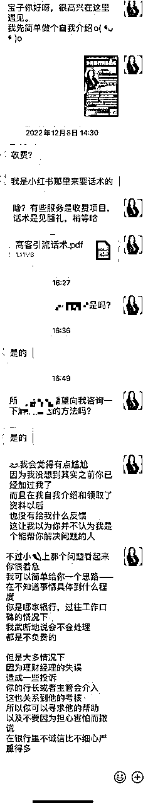

从小红书来的、从任何『引流』平台来的

本就得经过筛选不是吗

这就跟，明明跟男朋友分手

结果，每次找前男友帮忙，都还是用，『他女朋友』的立场要求他

这本就有问题

「对方喜欢的」，其实，给出尊重就好

人与人的世界里，不就因为，大家喜欢的都不同，世界才精采吗

对方领资料不说谢谢，这在引流给资料的赛道中，不很正常吗？

一个本就是常态的事情，其实，不用放太多的情绪

另一个观点是：

他不说谢谢是他没礼貌

但他没礼貌，是他的事情，这不会影响我也跟著无礼

这完全是两回事

他没礼貌，那就资料给完，把这人筛选掉就好

不是每个人都上过我的课，以及不是每个人身边，都有一个提醒他，平时要有礼貌的人

所以这是常态

但不能因为常态，结果影响了自己的品德

不能混为一谈

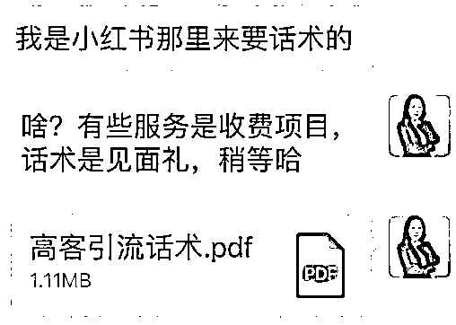

但如果是我，我肯定不会把这当开头字

啥？

这就个挑衅字眼，哈哈

明明就是我发到小红书，对方主动加我跟我要资料

结果我还跟他：啥？

哈哈哈哈

我看了都觉得有趣，这回应的文字结构，本就容易引起对方也不礼貌

还不如大气一点说：

谢谢你特别加我

我马上发给你

资料是pdf格式的

等等麻烦你接收

对了

如果你对这主题有兴趣

我还有另一个

需要付费的群

但很便宜，如果刚好有需求

估计这个群

你会产生一点兴趣

介不介意

发完档案后

我一起跟你介绍？

刚好能让你考虑一下

学员：

嗯，我反省了一下

自己当时是有情绪的

所以随手就回了

所以今天我其实是生气的

但是没有任性

每个人的脑袋中，都有一台，非常精密的计算器

知道心情不好，发泄在谁身上，不会付出太严重的代价

重点不是「这人不礼貌」

重点是，其他事情导致自己，心中有一股气无从宣泄

因为宣泄无门，最终，就选择了这个无辜的受害者

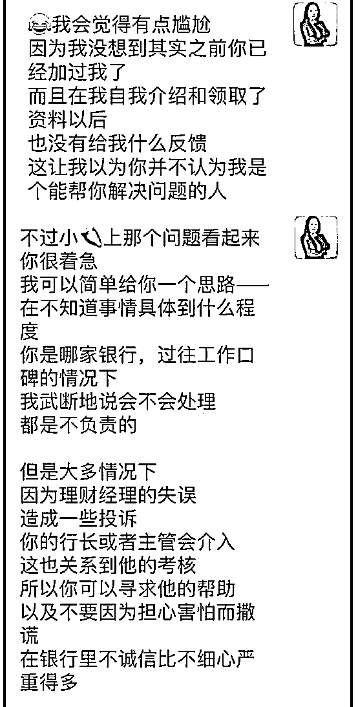

总结就是

这一大段都是多打的

有一段话我很喜欢：

### 所有客户，都是自己挑选而来的

### 所有失败的订单，都是自己造成的

学员：

谢谢根源老师的建议

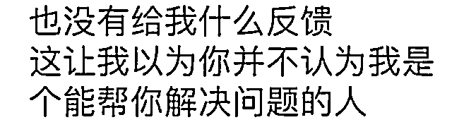

哈哈哈，看到这个话

我要是他就把你拉黑了

学员：

我爬楼看完了，总结就是

别人不礼貌是他的事儿，但不影响我正常服务，说不定后续还有转化~

感谢根源老师温暖的分享

这样的修炼我还有段距离[捂脸][捂脸]

我也不是每次都能做到

有时候也会心情不好

但是呢

反正能练就多练

这里有一个特别点要注意

有时候，客户的不礼貌，是销售员刻意造成的

这是一个很有趣的关注点

之前有人问过我个问题：

老师

为什么你很少遇到不礼貌的人

并不是因为，我遇到的人都刚好有礼貌

只是我的回应方式，也不容易让对方排斥，不容易让对方有抵触的心理

同时，我也挺有礼貌的

自己先做好，对方就会默默的跟我一样

所以，还是修炼自己实在～

这是我自己的经验

* * *

## 对方聊到失意的事情，如何回复可以增进信任感？

学员：

如果，朋友家有人失业了，跟我说起这个事，我该怎么回复比较好[破涕为笑]

不知道咋回

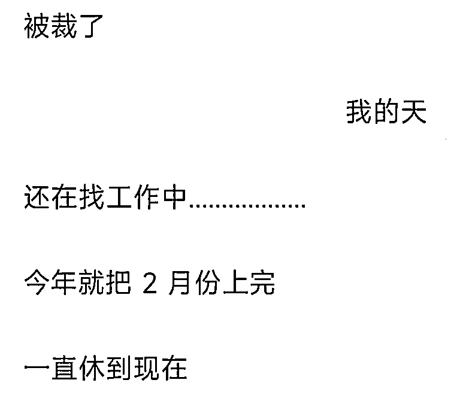

类似这样：

哈哈，换个角度想想

也不是坏事

所有新的开始

都是从看似挫折的事情发生的

学员：

那我就这么类似地回了[破涕为笑]

谢谢支招[呲牙]

复制贴上就好，也不太需要改。

坦白说

这没什么好安慰的

总得向前看不是吗

你只要开始安慰她

他就会发现，我溺水终于找到绳索

然后，天天找你抱怨

说点实在的

可以不让你有太多，未来发生的困扰

哈哈

学员：

嗯嗯，就这么做的，哈哈

* * *

## 爽约后，对方上门质问，该如何更好地回复？

学员：

请问，这种人找上门来，

我这样回复是得体的吗？

我有感觉被冒犯到

恩，不得体

哈哈哈哈哈哈哈哈

因为承诺是你给的

结果你不守承诺

我肯定会先道歉

这其实是主次问题，也是要求（对象）的问题

「要求自己」，还是「要求他人」

学员：

嗯嗯 是的 是我当时没有给自己设好闹钟

但我觉得隐藏的原因，

其实是我预期到他需要我给他说图书的营销，

这一块业务我们现在不做了，

所以与其硬着头皮谈，不如给对方说清楚，

还是一个心态的问题

以后有明确时间的，定好闹钟，

这样可以很得体，学到了！

大原则就是：

### 把承诺的事情履约，这人设非常的稀缺

## 如何回应学员看起来“奇怪”的问题？

学员：

老师，有个问题想请教。

之前交付过一个学员，客单价比较低的，当时并没有和她沟通清楚日常询问我的问题单位。

结果她那段交付期天天问我一些让我无法回复的问题

（对方应该是年级比较大，连邮箱怎么注册都会问我）

发群里的问题，也让其他学员觉得这人怎么这么奇怪

像这样的话，我要如何提醒她或者回应她呢？

例如她会问这样……我不知道怎么回答的问题，私下也回应她了，说不清楚她具体想问什么，她就不回，然后过几天又继续问

有点苦恼

这么说吧

因为你在问题的最初说了：

当时并没有和她

沟通清楚

日常询问我的问题单位。

如果这是大前提，那「私下明说」就好

同时，还得顺便把交付内容，用一个更详细的表格解释清楚

因为，一个学员会有这样的问题

就代表，会有其他学员，也同样存在相同的问题

*   第一个问题在于

自身没把交付标准说清楚，导致，后续学员认为，我本就可以这样提问

*   接著另一个思维是

我常在想

一个『难搞』的客户、一个『难搞』的学员……

对于老师、对于群来说，是个好事，还是坏事？

就我的观点来看，是个好事

因为所有人都好说话，所有人都听从老师的指示

那这个老师，就没有机会成长；这个群，就没有机会调整。

人生的成长过程，会遇到很多『善意提醒』自己的人

但有些善意，可能会用『看似恶意』的方式包装。

对方其实是好意，只是这人不懂得怎么用更好的方式表达

回到问题的本身

学员这么打，我第一眼看完后，其实，并没有『这人很难搞』的感觉：

哪位知道

编辑做稿子

大概几天能做出来

我可能就会回复

能知道一下

你说的是哪一种编辑稿子吗

因为编辑稿子包含很多范畴

可能是写书

可能是文章

也可能是你日常的小日记

这都属于编辑稿子

得麻烦你把问题

说的更详细一些

我才能

给到你一个能帮到你的回答

你说到了：

发群里的问题，

也让其他学员觉得

这人怎么这么奇怪

有没有一种可能「群里的人不觉得提问者奇怪」

而是觉得「怎么群主都没办法，更好的解决他的问题？」

当然，这是另一种不同角度的猜测

可是群主的目的

不就是要透过回答问题，在大众都能看见的状况下，拔高自己的价值吗？

回答的好，群里的人可能就会想：

这群主格局真大

这钱我付的值得了！

这是两个思维，提供给你参考～

过去我有篇公众号，谈到类似的思维

但遇到的状况不太一样，可是跟你这个，会有点类似

你可以看看这个文章，估计能对你有启发

《79、好好沟通很重要：你这是什么课，说的也太烂了吧！》

学员：

嗯嗯，

我后来想想，能明白为什么她提了这样的问题

可能就是自己还没搞清楚应该如何维系这样的关系

所以有被影响到

谢谢老师给的思路

我明白了[强]

这段话提醒很大

* * *

## 加好友就是为了成交和不成交吗？

学员：

@根源（晚8点讲课） 加人就是为了成交和不成交吗？

其实不一定

成交只是一种，更快速增加彼此了解的途径

若是能多了这层关系

那交情的升级，就有机会加速

单纯的关系提升也算

我也不会每个人，都一定得成交

很多朋友，也只会是单纯的朋友

但是，真正能有更好关系的朋友，

机会都彼此有个，类似的交易关系

可能是我到他的店里消费

不一定是他对我，也可能是我对他

这个行为，对我而言

更是一种关系提升的表现

学员：

可以理解关系存在的一种方式，要看单纯看上面这些话，感觉很功利

哈哈，应该是因为

这个案例刚好是跟成交相关的

所以会用这方面的解释延伸

学员：

之前老师也有分享过

提供一下作为参考[爱心]

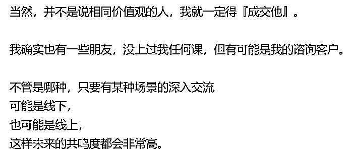

* * *

## 客户说产品价格很贵，该如何更好地回复？

学员：

请教一个问题，对方说产品价格很贵，怎么回复会更好呀

我今天遇到第二个这么说了[憨笑]

一般来说，

如果今天我卖的产品价格很高，我一定会在讲产品价格之前，有一个很完整的铺垫，

你也可以说这个叫铺垫，也可以说这个叫打预防针。

我举个例子，

像我有一个教练的产品，价格是终身的15万，

我一定会在讲这个价格之前，我一定会特别地跟对方说，

你确定你要问这个产品

这个产品的费用

确实挺高的

真的非常地高

你如果觉得想听听看

我可以给你介绍

只要我在讲产品前，做一个这样子的预防针，

一般他就不会再特别的说产品贵。

他肯定会说

确实真的挺高的

但是这个「确实真的挺高的」

就已经不是嫌弃产品便宜与贵的问题了。

因为我一开始就跟他说清楚了

然后再来一个点是，他可能会说

确实就是我也可以感觉到

根源老师的这个产品的费用确实高

那今天也总算是见识到了

就类似这样子的回复

但是，如果说在一开始你没有把这个东西，事先告诉他，

他一问产品就马上就把产品的价格跟他说，

这个举动其实就会让他心里面会有一个很大的落差

就是，他以为你可能只需要5000，结果你开的价格是2万。

那这个地方就会出现两个问题，

*   第一个问题，就是他没有觉得你那么贵，所以预期差太多。

*   第二个问题，就会是你创造出的价值，跟他内心中的预期的价值是不一样的。

所以这时候就得反思

为什么我开出这样子的价格，会让对方有一个这么大的内心反差，

而让对方给出了一个，「为什么你的产品那么贵」这样子的回复。

所以，这个部分我想要谈的考虑点就是，

什么原因造成了我当跟他说真实价格的时候，

他内心中没有觉得「确实我觉得老师值这个钱」，而是谈「很贵」。

再来个点就是

一般客户谈贵当然要看什么谈法。

但多数客户只要会讲到

哦，这价格确实挺高的。

有可能是他在嫌弃，

但是嫌弃不代表他不要这个产品嫌弃。

嫌弃可能是因为「他有需要」，但是他发现手上预算可能没有这么高，

所以会有这样子的嫌弃。

所以，当他讲价格高的时候，并不代表说他真的不要这个产品，

而是他可能开始在衡量，我可能想跟你杀价，

或者是衡量你们可能价格在更低一点，

或者是衡量有没有可能有其他的配套方案，这也是一种可能。

所以如果说这个问题要提的更完整的话，

我可能就需要你的截图，就是我想知道客户是怎么给你回复的，

他是用什么样子的方法说产品贵的，

这个会决定我的不同的回复，看哪一种才会更精准一点。

然后，最后一个点就是

一般来说高价格的产品，这个高价格我暂且定义5000块以上，

任何5000块以上的产品，我在说的时候，

我一定会挑人说，以及挑群体说。

我绝对不会再把这种产品做一个公开式的发售，

因为这时候产品做公开式的发售，

对你不熟的人肯定觉得价格高呀

所以，还有最后一个点，

就是怎么去让自己有一个能够谈高价产品的圈子。

你就不会遇到这样子的问题了，

所以，以上的几个简单的回复，先用语音念给你，

但如果说要更精准的话，如果方便的话，

你可以把就是这个人跟你的对话讯息大概的截图截上来，

这样子看完之后我才可以给一个比较完整的回复。

我一直认为，

不是知识付费变得很难做，也不是因为产品变得很难卖。

而是因为疫情过后，

其实疫情在的那三年，反而不是赚钱最困难的三年，

我认为真正赚钱困难的年份，反而是疫情过后，像是今年，像是明年，

因为这个会是一个很大的那种赚钱的一个洗牌的时间点。

学员：

我目前这两个都是来自小红书的用户，信任及需求都了解不够

所以高价产品变得很难卖，

其实是因为多数的人在花大钱的考虑成本提高了，

那既然花大钱的考虑成本提高，我们就得有一个很清晰的认知，

知道哪一些人是能够出得起这个钱的，以及哪一些人是有真正需求的。

然后，我一直有一个习惯是，

所有的高价产品一定要有一个阶梯式的销售，

可能从100多块先进来，

然后再进到900多块

再进到2000多块

再进到几万块

甚至再进到几十万

如果没有这样子的阶梯式筛选，

⭕️客户层面

第一个如果就客户层面来说，客户不懂你，

客户既然不懂你，他凭什么愿意为你花这么多钱，这本来就不合理。

今天就像我们想买别人的产品一样，会有一个阶梯式的，

就是你有一个10万的，我有兴趣，

但是我得先知道你是什么样的人，我得先用100多块去测试，

或者我得先用试听课、免费课程去测试

线下门店也会一样的情况的，

这个课程一次你就得买96堂课，一买可能一上就得半年，

那这不得去免费上上体验课，或者是用美团或者是这个大众的体验券去试试看。

所以很正常的，连我们都是，更别谈别人想为我们付费了。

⭕️讲师层面

接着另外一个层面就是，

谈交付者的层面，像讲师，对于讲师来说，收越高价格的产品，代表我的交付得越重，

代表今天我必须要，选到对我更有信任感的消费者，我交付起来才会轻松。

所以，前期的筛选，

当然对客户来说，他是筛选讲师的过程，

但是对于讲师来说，这不得也是筛选学生的过程，

所以用一个阶梯式的产品购买的逻辑，

我觉得在推高产品的时候，你才不会有这么大的失落感，这是我的看法，

因为我自己也是阶梯式销售的，产品流程我也是这么来的。

以上的几个观点，我讲得比较零散，但是提供给你参考。

如果有一个比较细节的问题，可以追问，

那我再看，透过你的问题再给你更详细的解答也可以。

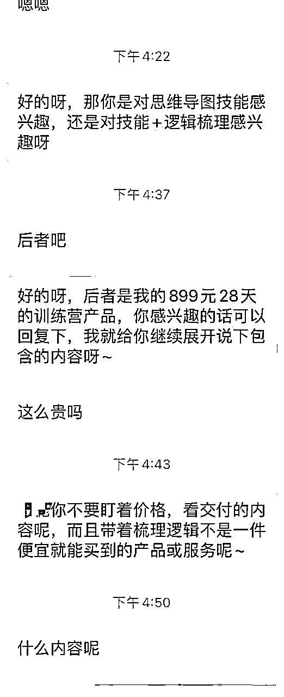

延伸一下刚刚的回复

就是如果以这个案例为主的话，

因为不管是小红书、视频号，或者是抖音或者是其他，

反正不管什么平台引流进来的人，一定要做筛选。

如果没有做筛选，就这么盲目的跟对方讲价格，

价格又是如此的高，这个高就是超过200块，

我就觉得已经是如此高了，我肯定不会这么轻易的就跟他讲价格。

这个对话的第一步做的其实挺好的，就是给了对方选项，

因为之前我说过，线上引流来的人

筛选最好的方法就是「给选项」

所以，已经给了选项了，你是对哪一个有兴趣，

但是给了选项之后，就不能够这么快的就把产品推出去。

还要再继续给他选项，一般来讲我都会给出两个以上的选项，

我才会开始跟他介绍我的主要产品，

所以如果是我的话，我可能就会说

就是如果你喜欢后者的话

我目前只有要付费的产品，

然后你会有兴趣想听听看吗？

那我有海报的介绍

或者是我会跟他说

如果你问的是后者的话

因为这个部分会牵涉到课程的费用

请问一下你对于

学习这个东西是有预算的考量吗？

我会这么说，或者是你有准备就是在这一块上有花多少钱的预算吗？

我一定先问清楚之后

如果对方说有

那我可能就是说

我这个产品价格大概是多少钱

那如果对方说没有

那我就没必要跟他介绍需要钱的东西，因为他就没有预算的问题。

很大的前提是因为

这一个人本来就是透过别的平台引流进来的新朋友，信任感肯定不够的。

信任感竟然那么的不够，我们没给他一个免费的资料，就已经很对不起他了，

更何况一开始开口就跟他推一个800多块的产品。

所以，如果说延伸刚刚的提问

加上这个对话案例，我就会这么处理

总结

通过引流进来的人，千万不要这么着急的跟他讲产品价格，

这很容易在一开始就把这个人吓跑的，

因为对于他们来说，

他们就认为今天你就是打广告的，

你一个打广告的，我找你，你就给我卖个几千块的东西，这不合理，

今天说了，我也会觉得对方是骗子。

所以，花多一点时间筛选，花多一点时间给选项，

我觉得这会是透过平台引来的人，更好处理方法以及筛选的方法。

* * *

# 尾声的过去历史介绍

我是根源，同时也是第四期的生财圈友

一个有 2w+ 实战案例的心理咨询师

12年线下销售、团队管理经验。

2022 年开始转型线上，做一些知识付费的项目。

过去曾发表过几篇文章

都能看到这，代表你对文章的喜爱

肯定有一定的程度！

也欢迎阅读过去我写过的历史文章。

2021年的文章（精华x1）

1.  精华《直觉式萨克斯 透过社群成功变现146万》 https://t.zsxq.com/116B1bcYc

1.  《73项被动收入打造》 https://t.zsxq.com/11EHjTH0P

1.  《杭州夜话02场，夜话官复盘》 https://t.zsxq.com/19IkX4UMl

1.  《年入百万，团队从20人到4万人》 https://t.zsxq.com/19JYt77hL

1.  《主题：如何更有效的链接见面会认识的圈友》 https://t.zsxq.com/19VY2LWg4

2022年的文章

1.  《互联网小白，第 1 次做线上产品，7 天赚回 10 倍门票》 https://t.zsxq.com/11ooZZbM7

1.  《把捣乱分子『逆势』转成爱用者的好方式》 https://t.zsxq.com/19lipLhJ5

1.  《 好的内容，是目前依旧没退旧流行的变现方式 》 https://t.zsxq.com/19BLMAYw1

1.  《明白老师的一个启发，让我从100天日耕的过程赚了30W+》 https://t.zsxq.com/19BgNoxfi

2023年的文章（精华x6）

1.  《私域的意义不是管理，而是经营》 https://t.zsxq.com/19WEsfSq1

1.  精华《9年传统行业 1 年时间，从一无所有，到年入 200 万》 https://t.zsxq.com/10nmEr1cA

1.  精华《25个提高微信成交率的小技巧》 https://t.zsxq.com/11AgRW24F

1.  精华《35 个让私域收入翻 3 倍的技巧》 https://t.zsxq.com/11FmV2aqZ

1.  精华《续篇 - 25个提高微信成交率的小技巧（26 - 50）》 https://t.zsxq.com/13yRbmUwo

1.  《 私域话题：涨价之后，如何回复以及留住客户？》 https://t.zsxq.com/11UJk9HxQ

1.  精华《成为自由职业者的20个必备特质 》 https://t.zsxq.com/14XTxhh15

多亏加入了生财有术

让我少走了很多弯路。

也积累了一些经验、心得

如果圈友有什么需要探讨的

欢迎加我微信「 AF54094 」交流~

▲

也能扫码撩我~