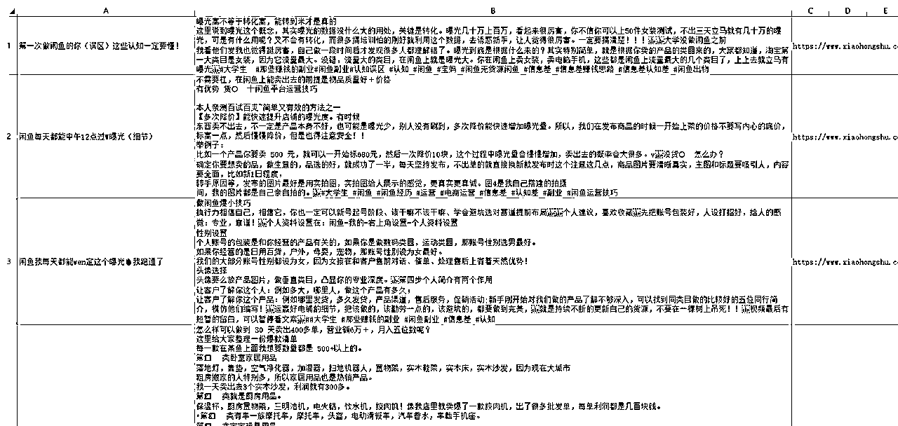
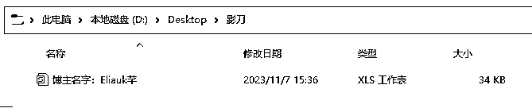

# 影刀RPA，一键下载小红书博主所有笔记标题和文案

> 来源：[https://riodtlbegu.feishu.cn/docx/YsotdRZPdoMxqtxWr9Jc6ohUnSc](https://riodtlbegu.feishu.cn/docx/YsotdRZPdoMxqtxWr9Jc6ohUnSc)

最近在学习小红书电商，考虑到文案和标题如果一个一个找的话会比较麻烦

所以学习了影刀看了一些教程，写了这个，可能还有一些bug，但是总体可以使用！

影刀RPA，一键下载小红书博主主页下的所有笔记的标题和文案

支持单个链接或者多个链接一起采集！

适合做小红书电商或者小红书引流的

抓取对标账号的 标题和文案进行组合伪原创等等

抓取过程：【录制的时候不知道为啥把音乐也录制进去了】

注意：如果你影刀刚注册的30天内是可以使用的

超过30天就不能了，建议重新注册一个影刀账号！

抓完之后文件大概这样：

已经发版了，更改一下保存路径，浏览器安装影刀插件，直接点开链接就可以保存使用了！

https://api.winrobot360.com/redirect/robot/share?inviteKey=2c482e7f248e0dd0 密码：4321 单个链接【输入博主的主页链接就可以了】

抓取的文件是在D盘底下的一个文件夹，如果电脑里面没有D盘的话 可以联系我 修改一下~

有小伙伴说不能使用，我这边测试了一个新的电脑，是可以直接使用的，但是查看不了源码！直接获取到的应用，直接点击运行就可以了。

最近在学习小红书电商，有在做的希望可以深入交流一下~

如果有交流群可以拉我一下~