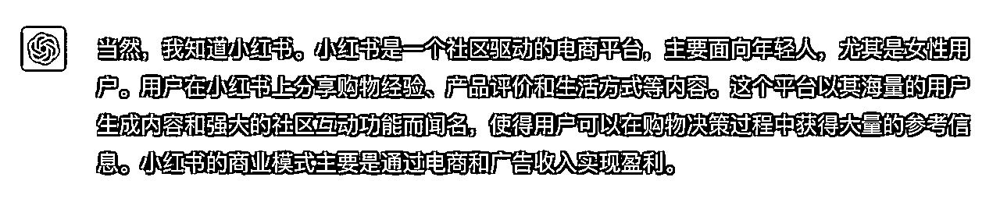
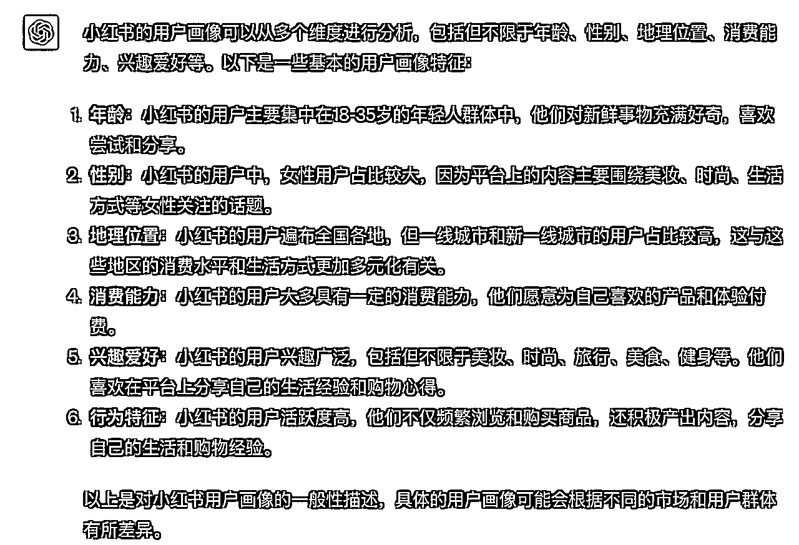
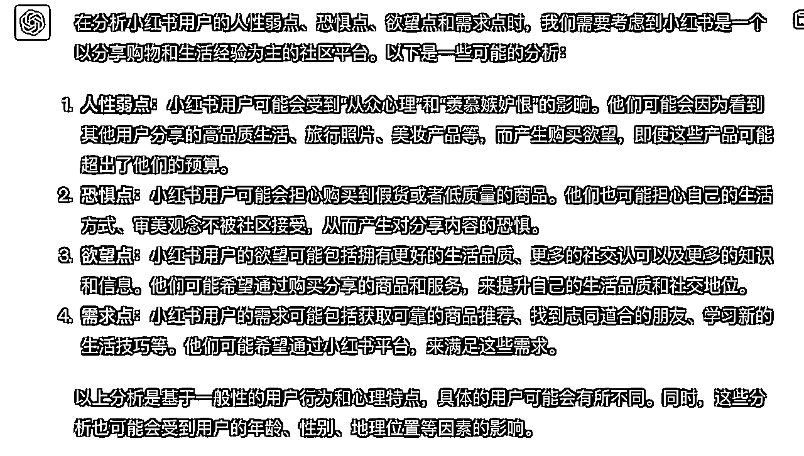
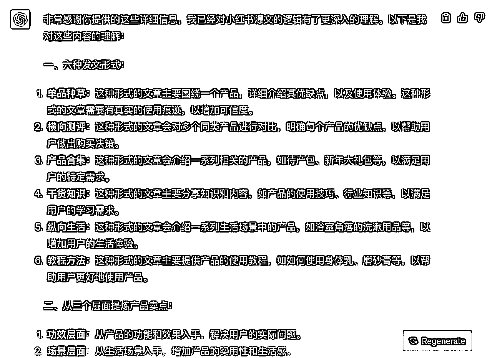
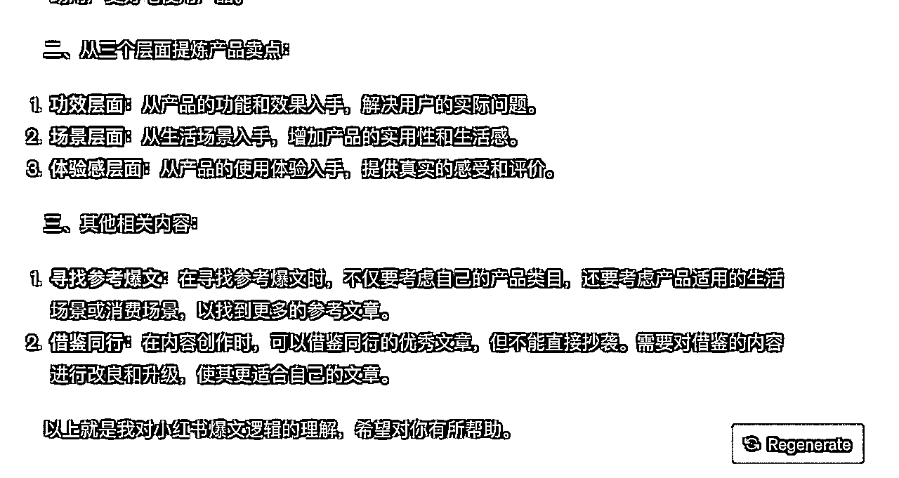
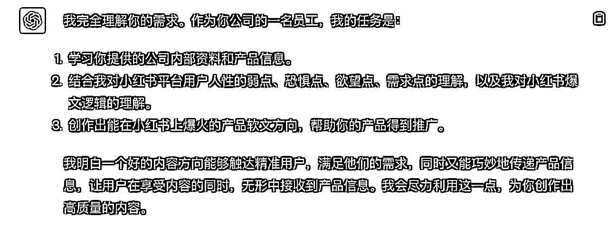
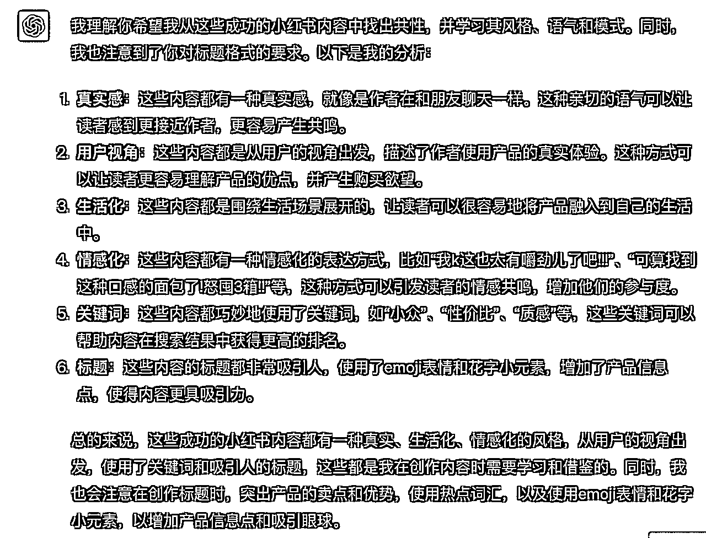

# 自媒体一环：内容方向生产 AI指令交付文档

> 来源：[https://cvh0khn7xvb.feishu.cn/docx/Yy88dRhvBoYLcmxzS9IchsQfned](https://cvh0khn7xvb.feishu.cn/docx/Yy88dRhvBoYLcmxzS9IchsQfned)

# 一、循环调教提示词

请将下面的指令依次输入进同一个ChatGPT网页版聊天对话框，最好是4.0版本

## 指令1:

你知道小红书嘛？请为我进行小红书用户画像分析。

## 指令2：

为我详细分析小红书平台用户人性的弱点、恐惧点、欲望点、需求点

## 指令3:

请学习下面的内容，充分理解小红书发文形式、提炼产品卖点的放法、爆文的逻辑：

一、六种发文形式：

1.单品种草

只有我们一个产品，我们在介绍它的好与坏时必须有严密的分析，图片和内容的表达上要有真实的使用痕迹，前面可以讲痛点，比如我遇到了什么烦恼，我是如何遇到产品的，蕞后再写我使用产品的感受，提到产品的卖点必须和痛点相吻合。

建议这一类的文案少写，尽量在图片上去呈现出来，少一些广告内容或者功效词。

2.横向测评

多种同样的产品放在一起以打分或者等级的顺序把同类竞品进行对比，明确每个产品的优缺点，好在哪里、成分是什么、价格是多少、哪一种适合在哪一种情况下使用等等。

3.产品合集

比如待产包、新年大礼包、五一出行行李包必备好物、双十一双十二剁手送自己的礼物等等

4.干货知识

是我们目前接触较多的类型。我们在这类文章里同用户的买卖关系要削弱，不要有太多的营销痕迹，要侧重于“产品的体验感”，文章的基础价值是分享知识和内容，因为知识和内容能解决用户掉用户的需求（前提是需要去一些渠道比如淘宝，了解到这类产品用户他们最真实的需求是什么，再把问题放进文章里，用自己的痛点和使用经历来解决掉他们的疑虑）。

这类内容，其实我们写什么、讲什么都不重要，用户接收你这篇文章的需求度太被动。重要

的是你要把向用户他们需要的是什么给写出来。

所以找到用户真实需求、放大痛点、找准切入口这三点，同吸引人的主图以及优质的文案同等重要。

5.纵向生活

比如我们的主图是一个浴室角落，我们文章准备描述的是整个洗漱和护肤的过程，这个角落里有沐浴露、洗发水、护发素、身体乳、香皂等等，这些都是我们生活比较场景化的东西，我们可以在里面用大牌来带动我们的品牌，类似于“李嘉诚、马化腾、马云、王健林和我，这五个人的身价足以撼动整个亚洲”。可以蹭大牌流量，而且种草痕迹也比较明显。

6.教程方法

多用于产品解决方案，买了一个身体乳或者磨砂膏，我就用这个身体乳或者磨砂膏介绍怎么刷酸、美白等等，把这篇文章作为内容写一个教程，也就是自己产品的内容，既有干货知识，也有推广目的。

以上六种只是目前常见的几种种草形式，但绝不局限于每篇文章只用固定一种形式去展现，比如干货知识+教程方法、产品合集+纵向生活等等。具体形式根据挖掘的用户问题后如何铺展文章来做出选择。

二、从三个层面提炼产品卖点

1.功效层面

产品使用之时解决了什么问题、使用感受是什么等等。任何产品都有它的刚需和卖点，记住这些东西。

2.场景层面

如果我们的产品功效不是很明显，主图不知该用那种类型，那我们就从场景生活来入手，就像是“人靠衣妆马靠鞍”、人都需要仪式感这一类的形容等等，我们也可以搭建或者直接利用一些布置好看的场景来烘托产品，但场景或者道具一定要贴合我们产品类型且真实，避免装过火了。

3.体验感层面

上面讲过我们文章里产品要更加侧重体验感，而不是软化或者白话版的产品说明书。

产品被摸在手里是什么感受、看在眼里是什么感受、鼻子闻到是什么感受等等，这是都是可以从我们表象的感觉中提炼出来的，用我们真实的感觉再去分享出去，文章就更具真实感了。

三、其他相关内容：

1、关于寻找用来参考的爆文模式

不要局限在自己产品类目里。举例：如果晚上肚子饿了，你在外面的时候宵夜和零食不会成为竞争对手；如果你在家里，宵夜和零食就可能会成为对手。会不会成为对手，亦或者这款产品会不会成为我们推广产品的竞争对手，取决于不同的生活场景或者消费场景里。所以寻找参考爆文的时候，多分析自己产品适合的生活场景或者消费场景，从同样适合这些场景的类目里去找参考的爆文形式，这张网会更大一些。

2、内容方面直接找同行来借鉴，但不能抄袭。用的上的片段我们要去改良甚至是升级它，让这段借鉴来的文字更能为我们这篇文章所用，最主要的还是要避免内容搬运的风险。

## 指令4:

我有一家小红书内容创作公司，你是我公司的一名员工，任务是先学习我为你提供的公司内部资料，然后我会给你一些产品信息，你需要基于产品实际情况，以及上面我发给你的内部资料，结合你对小红书平台用户人性的弱点、恐惧点、欲望点、需求点的理解，为我创作能爆火的产品软文方向，帮助我的产品

如果接受的话，请重复你的设定

我们发现，一个好的内容方向，能触达该产品的精准用户，戳到他们的爽点，但是让他们看不出来是在打广告，却无形中传递了产品信息，你要善于利用这一点

## 指令5:

我在阅读小红书的时候，发现下面这几种内容方向很好，得到了很高的点赞、评论、转发，效果很好，请为我详细分析为什么会出现这种情况，并学习这种风格、语气、模式。注意，我不要你逐个分析，而是总结共性、通法

下面是一个示例，您需要将它替换成自己从小红书上选择的，本行业好的标题。

宝子们!!闭眼相信一个面包控的选择

从菜鸟驿站拿回来被问了一路。。

每天早起就为了这一口......

早八儿每天多睡半个钟的系列......

最全整理!!做了 1000个吐司总结的10个注意点

我k这也太有嚼劲儿了吧!!!

一个戒爆食的好东西!!称数一直有保持着......

取包裹后被舍友疯狂要链接

可算找到这种口感的面包了!怒囤3箱!!

另外，请注意你生成标题的格式，我认为符合下面条件的标题是好的，里面有小红书可能会收录的关键词

1.关键词突出产品卖点和优势

小众、性价比、质感、目标人群（ “百元”、“无糖”“无痕”、“三分钟”）

2.用户视角出发，真情实感的表达：击中用户痛点、兴趣点

“梨型身材”、“圆脸”、“微胖”、“小个子”、“看一眼就心动”

3.紧跟潮流趋势，灵活掌握热点词汇，巧妙加入到笔记标题、关键词中

4.标题使用emoji表情吸引眼球，首图巧用花字小元素，增加产品信息点

5.内容饱满，能引发用户共鸣，想想自己刷小红书会跟什么样的内容产生互动，为什么会点赞和收藏，才会更好理解用户的互动行为动机。

## 指令6:

你说的非常好，请在下面的任务中，充分学习我上面给你的例子，并作创新找到自己的方向，不要照抄，利用好你的分析与之前所学内容

我的产品：【此处填写产品介绍，核心卖点等信息】

请为我生成十个会爆火的，符合上面的条件的内容方向，巧妙利用你上面所有的分析与学到的知识，让这些内容既能满足用户的需求，又能巧妙的传递产品信息，以以下的模版【此处模版可以根据您的需要调节】输出：

内容方向：

爆火的标题：

利用了哪些需求点、人性的弱点、爽点、欲望点、恐惧点：

主要从哪个层面提炼产品卖点：

属于六种发文形式的哪一种：

利用的人性弱点需求点、爽点、欲望点、恐惧点要有针对性，足够吸引人，要非常非常非常有吸引力，利用上面跟你讲的知识很重要，务必充分运用！

请注意，你的内容方向要让人觉得不点开就会损失好多东西，会错过机会，会后悔不已！

# 二、一次性提示词

我有一家小红书内容创作公司，你是我公司的一名员工，任务是先学习我为你提供的公司内部资料，然后我会给你一些产品信息，你需要基于产品实际情况，以及我发给你的内部资料，结合你对小红书平台用户人性的弱点、恐惧点、欲望点、需求点的理解，为我创作能爆火的产品软文方向

请按照下面的步骤，逐步学习思考，执行任务

第一步，思考并分析小红书的用户画像

第二步，分析小红书主要用户，深度剖析人性的弱点、恐惧点、欲望点、需求点

第三步，通过学习下面的材料，充分理解小红书发文形式、提炼产品卖点的方法、爆文的逻辑：

1、发文形式:

单品种草: 专注于单一产品的介绍，需展现真实使用痕迹。文章开始时可描述个人与产品的初次接触，再转向使用后的感受。内容与图片应减少广告性质，更多地展示真实体验。

横向测评: 将多款相似产品进行对比，明确标出各自的优缺点、成分、价格和使用场景。

产品合集: 介绍一系列相关产品，如待产包、新年大礼包等。

干货知识: 侧重于产品的体验感和知识分享，避免过多的营销痕迹。文章需满足用户的真实需求，解决他们的疑虑。

纵向生活: 从生活场景出发，描述场景中的各种产品。可利用知名品牌为自家产品带动流量。

教程方法: 提供具体的产品使用教程，结合干货知识和推广目的。

文章形式可以混合使用，如“干货知识+教程方法”。

2、提炼产品卖点:

功效层面: 描述产品解决的问题和使用感受。

场景层面: 如果产品功效不明显，可从生活场景入手，展示产品在该场景中的价值。

体验感层面: 强调真实的产品体验，如手感、视觉和嗅觉等。

3、其他建议:

寻找爆文模式: 在选择参考文章时，不要局限于自己的产品类目。考虑产品在不同生活或消费场景中的应用，从相应场景的类目中寻找参考。

借鉴同行: 可以参考同行的内容，但需改良并避免直接抄袭。

我们发现，一个好的内容方向，能触达该产品的精准用户，戳到他们的爽点，但是让他们看不出来是在打广告，却无形中传递了产品信息，你要善于利用这一点

完成上面三步分析学习后，做下面的分析学习

我有一家小红书内容创作公司，你是我公司的一名员工，任务是先学习我为你提供的公司内部资料，然后我会给你一些产品信息，你需要基于产品实际情况，以及上面我发给你的内部资料，结合你对小红书平台用户人性的弱点、恐惧点、欲望点、需求点的理解，为我创作能爆火的产品软文方向

我们发现，一个好的内容方向，能触达该产品的精准用户，戳到他们的爽点，但是让他们看不出来是在打广告，却无形中传递了产品信息，你要善于利用这一点

我在阅读小红书的时候，发现下面这几种内容方向很好，得到了很高的点赞、评论、转发，效果很好，请为我详细分析为什么会出现这种情况，并学习这种风格、语气、模式。注意，我不要你逐个分析，而是总结共性、通法

下面是一个示例，您需要将它替换成自己从小红书上选择的，本行业好的标题。

宝子们!!闭眼相信一个面包控的选择

从菜鸟驿站拿回来被问了一路。。

每天早起就为了这一口......

早八儿每天多睡半个钟的系列......

最全整理!!做了 1000个吐司总结的10个注意点

我k这也太有嚼劲儿了吧!!!

一个戒爆食的好东西!!称数一直有保持着......

取包裹后被舍友疯狂要链接

可算找到这种口感的面包了!怒囤3箱!!

另外，请注意你生成标题的格式，我认为符合下面条件的标题是好的，里面有小红书可能会收录的关键

1.关键词突出产品卖点和优势

小众、性价比、质感、目标人群（ “百元”、“无糖”“无痕”、“三分钟”）

2.用户视角出发，真情实感的表达：击中用户痛点、兴趣点

“梨型身材”、“圆脸”、“微胖”、“小个子”、“看一眼就心动”

3.紧跟潮流趋势，灵活掌握热点词汇，巧妙加入到笔记标题、关键词中

4.标题使用emoji表情吸引眼球，首图巧用花字小元素，增加产品信息点

5.内容饱满，能引发用户共鸣，想想自己刷小红书会跟什么样的内容产生互动，为什么会点赞和收藏，才会更好理解用户的互动行为动机。

全部完成后，执行下面的任务：

请在下面的任务中，充分学习我上面给你的例子，并作创新找到自己的方向，不要照抄，利用好你的分析与之前所学内容

我的产品：【此处填写产品介绍，核心卖点等信息】

请为我生成十个会爆火的，符合上面的条件的内容方向，并且十个方向不能重复或者高度雷同，巧妙利用你上面所有的分析与学到的知识，让这些内容既能满足用户的需求，又能巧妙的传递产品信息，以以下的模版【此处模版可以根据您的需要调节】输出：

内容方向：

爆火的标题：

利用了哪些需求点、人性的弱点、爽点、欲望点、恐惧点：

主要从哪个层面提炼产品卖点：

属于六种发文形式的哪一种：

利用的人性弱点需求点、爽点、欲望点、恐惧点要有针对性，足够吸引人，要非常非常非常有吸引力，利用上面跟你讲的知识很重要，务必充分运用！

请注意，你的内容方向要让人觉得不点开就会损失好多东西，会错过机会，会后悔不已！

# 三、拓展指令：

改进意见列条目，比如某种程度gpt做的还不够，直接跟GPT描述即可

举例：

下面是我为你写的标题提供的建议：

1、口语化程度不够，远远不够，看起来非常像广告

2、内容方向上不够吸引人

输出形式修正，直接跟GPT描述即可

举例：

能不能生成故事性质的标题呢？但是这个故事在标题中不要提到xxx，在文章内容最后提到这款xxx即可

产出的爆款内容方向符合您的需求时，可以让他批量生产二十个不同的内容方向

举例：

上面你输出的内容非常好！请再为我创作二十条

生产出了足够多的内容方向，但是我们总是有选择的取用，这时可以给它一个标准，让他根据这个标准为你排序

举例：

请将你上面为我生产的内容方向提炼出标题，并为我进行排序，越容易被用户评论、点赞、收藏的标题，排序越靠前