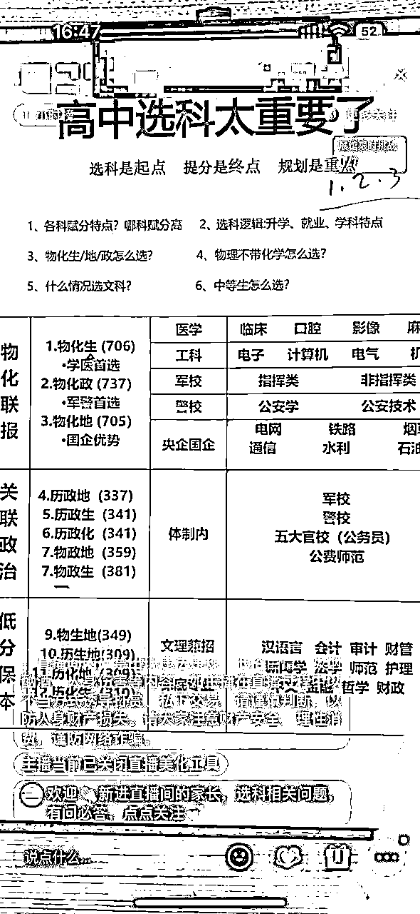
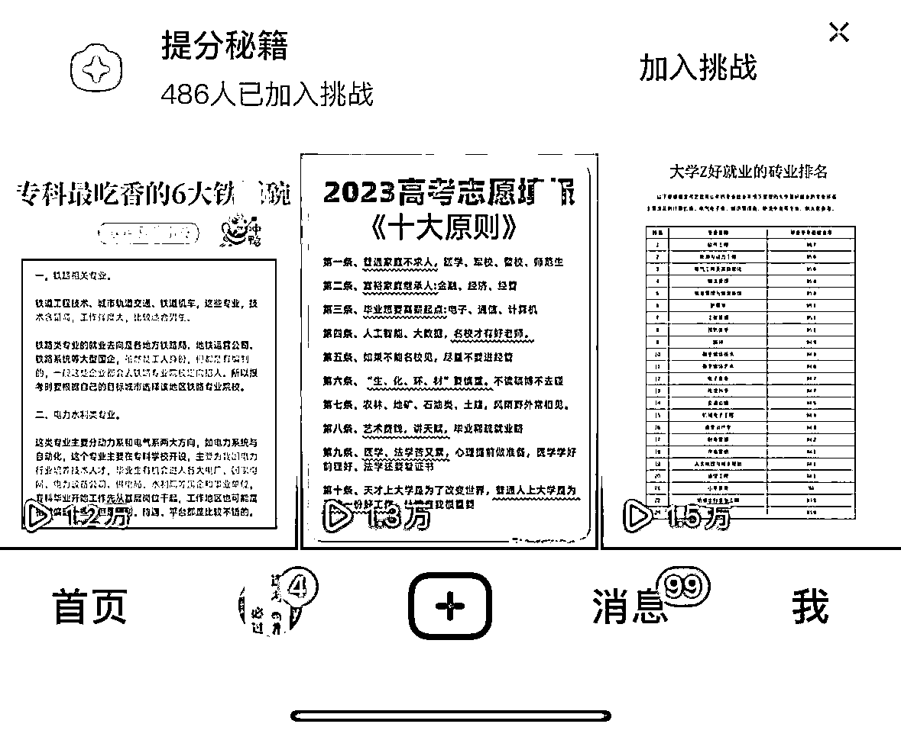
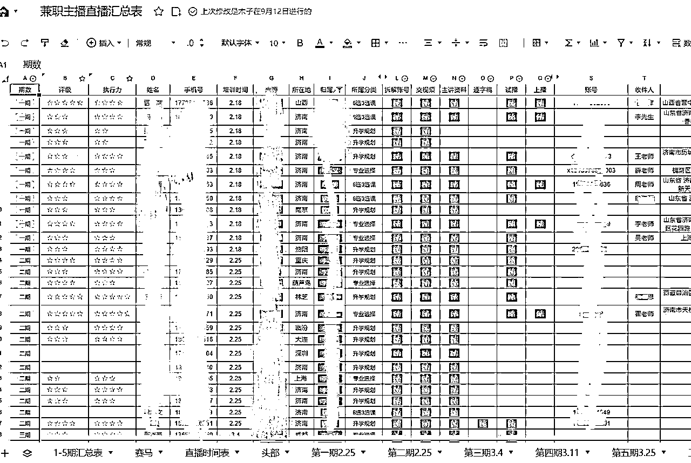
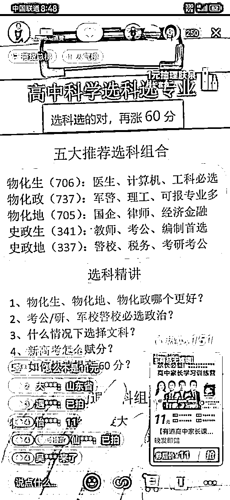
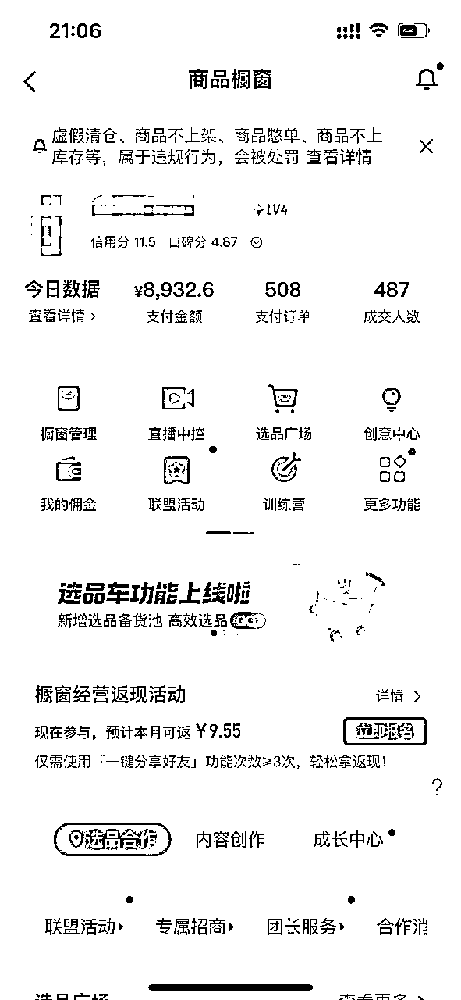
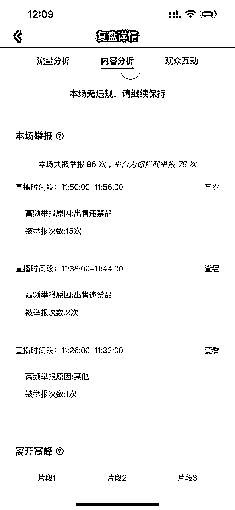
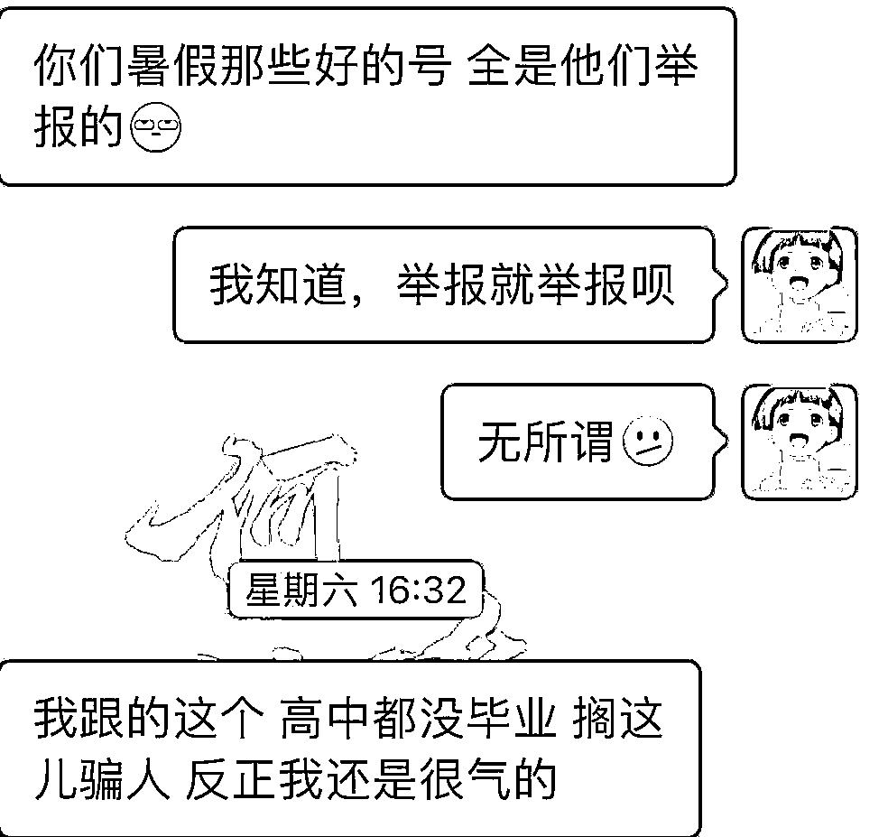

# 从直播卖课到深耕高中升学规划，一年变现300万+的经历分享

> 来源：[https://vfl52b71kz.feishu.cn/docx/Z9fUdBLAao5oIdxD65ocb0KonVh](https://vfl52b71kz.feishu.cn/docx/Z9fUdBLAao5oIdxD65ocb0KonVh)

hi，我是lemon。一个不务正业的老师；2019年开始疯狂探索副业，22年实现副业年入百万，23副业成功转主业、截止十月变现300万+。今年一直在搬砖，好像还是第一次正式的分享。

我是2020年了解到生财，“偷窥”鱼丸朋友圈1年后，在2021年加入生财。从第一份副业的私域卖货到闲鱼无货源到抖音短视频，最后在教培cpa小课包手播赛道深耕，今年打压教培闹得沸沸扬扬，前阵子鱼丸发我一份教培转型合集我才意识到其实我们早就已经进入下一个“新纪元”了。

今天给大家分享一下我是如何在教培cpa小课包手播赛道逐步深耕，最后扎根高中规划方向的。（这里放张图简单跟大家普及一下什么叫手播）

这里结合去年分享过的帖子读会更清晰过程（第二篇更偏向于教培cpa赛道）

https://t.zsxq.com/11b7Ocfb4

https://t.zsxq.com/0cns8tXdL

先说结果：

从22年高中项目开端，到目前为止今年在高考升学规划赛道线上线下成功变现300万+，到目前为止算是取得了一点小成绩，整个业务链全线跑通。

# 项目起因—考研/公考小课包直播瓶颈到高中赛道的转型

选择深耕高中规划赛道，还是起源于cpa直播，考研业务在22年5月初平台开始针对考研低价课限流后，我发现当月的转化明显下降了很多。随后我意识到自己也没有考研的产品能力，没必要在这个版块继续纠缠，综合分析了平台其他小课包和知识赛道，第一时间增加了志愿填报板块，在这个时期，整个业务流程几乎没有改变，只是做了方向调整。

因为去年高中赛道并没有小课包，所以22年赶上高考季做了一批志愿卡变现，之后陆续接了一些B端教育公司的咨询服务，整体来说，22年算是保住了营收，但除了在知识赛道继续深耕外，并没有完全定好扎根方向，这样的状态一直持续到今年年初。

2023年初，各大头部教培公司陆续推出线上11元和19元小课包，佣金高达100元，基于在这个领域的过往经验，我们自然而然成了第一批高中小课包的乙方签约机构。因为之前考研阶段的经验，从开始带课之初我们便开始最大规模的复制，2-3月两个月之内我们零成本迅速复制了近50个直播间，过程如下：

### 第1步：深耕内容，招聘兼职

我一直认为要想放大一个项目只有两个方式:扩大规模或前后产业链拓展。当时的状态说前后产业链太早，那就只有两个动作：疯狂的制作内容+招聘主播；直接开搞！想都是问题，做就是结果。

志愿填报方向在内容方面有天然的优势，内容多且广，可以细分出三个板块十几种细分内容。从内容上就决定了这个赛道可以去疯狂复制。内容层面完美避开了一部分的同质化内卷。

原考研兼职主播团队基本都是大学生兼职，但是在这个方向，大学生的劣势就比较明显。在招聘上根据直播间用户群体，去倒推定位主播；

1）高考规划赛道的用户画像

2）对这批用户进行输出，用户喜闻乐见的什么样的人？抵触的是什么人？

3）怎么找到合适的人？在哪个找？

基于上述的思路，从年龄、声音条件、阅历及学历方面去重新优化了招聘思路，最终采取boss直聘放开多个城市的思路采取社招，筛选方式也很简单，大专以上学历、声音清脆、声音听起来成熟最好。大概因为2、3月找工作的比较多，当时一周内筛选了几百份简历并一一电话沟通后直接就进入培训阶段了。

### 第2步：多账号矩阵复制

当时团队除我以外，只有2个全职主播，2个运营，1个行政，主播负责跑基础直播流程，运营负责配合我做内容生产、招聘初筛和主播初期带教，行政则是负责最基础的作图和对接工作。

教培cpa赛道矩阵搭建的要点：

a、内容标准化

所谓的内容标准化一定是建立在自己跑通了直播间流量的基础上，只有自己跑通了才可能有最优的标准化内容。

b、业务最小单元划分

所有账号短视频统一由一个运营生产发布，可不硬性考核短视频数据，但一定要所有账号日更。我的短视频内容也很简单，都是图文作品，偏资料方向，上个图吧。

志愿填报方向在内容方面有天然的优势，在标准化内容的基础上，全程由运营结合标准sop去做跟踪带教，截止到3月，我们已经组织了4期共120多人的兼职主播带教，每个技术卡点设置好交付标准及考核量。两个月快速孵化出了50多名主播。（我们不需要主播参与直播内容，只需要对稿子读就行，这应该是我们当时能迅速起的最关键因素）

放一个招聘图可以感受一下：

# 初见成绩

50多名主播根据数据情况，我们再去划分重点跟踪主播，只有重点跟踪主播才会流转到我这里来一对一辅导和复盘。短视频、账号管理等一概由专人负责，这样单个账号最高单场收益可达15000+，单账号单日最高收益5万+

这个阶段最大的收获不是收益，而是事业的成就感。每个环节都顺利推进，每位小伙伴也都拿到了收益。极致利他才能利己。

业务的飞速扩张，这个赛道也出现了大量同行；我一直的理念就是钱不是一个人赚的，永远不要去考虑垄断。利他+合作才是行业发展的良好趋势。也有很多同行业朋友加我，我走过的一些弯路、踩过的一些坑，只要是找过我聊天的，也都分享了。利他思维也帮我开辟了一个新的方向。

# 开辟新方向，由点及面（孵化工作室）

随着业务的飞速发展，各种问题也开始暴露无遗。因为我们运营人员有限，这个过程中出现了人员跟踪不到位、外地主播沟通困难的情况，对接牵扯了大部分精力，但还是出现了对接不及时、节奏拖沓。甚至出现了因为主播不主动，运营人员再想到这个主播的时候已经过去了一周······

团队的人员有限，再想去扩张，团队的精力已经没办法承受。恰好此时有同行朋友找我沟通，这个沟通给了我启发，孵化个体主播跑通的情况下，孵化工作室恰好能解决团队压力和外地主播沟通问题。

如果没有接触生财的话，这个项目大概率会止步于此；用全部都精力去投入到个体孵化上。孵化工作室这个事其实是被动来做的，三个工作室都是生财圈友推荐主动找过来寻求合作。最后综合考量下来，选定三个城市孵化工作室。

过程就不多赘述了，孵化工作室最终的结果不是很美好

孵化工作室让我对业务和人有了新的思考。直接说结果吧，三个工作室其中一个失败了，成功培养出两个竞对···

如果有同行的朋友在看的话；建议在后续孵化工作室的方向上，一方面做好人员的筛选，毕竟并不是每个人都适合当老板，其次我孵化工作室的失败点就在于最初没想明白长期双方的责权利，如何做到双方1+1大于2，做这件事的初心就是想解决业务卡点、扩大业务。

雨漏偏逢连夜雨，工作室方向出现了问题。个人主播方面也遭遇了寒冬。一年的阶段发展，内容的高度同质化不止是我们自己的主播陷入了内卷，整个赛道的同行也开始往内卷方向发展。

同时7月份出现的“张雪峰事件”，大家应该知道，平台开始对志愿规划方向严控。这个过程中出现了一小部分恶意同行，开始针对我们所有直播间恶意举报。最高单场被举报了100多次··· 我们自己的头部账号基本都被举报风控。甚至之前帮助过的同行，也对我们进行了恶意举报。只能说何必呢···

# 重新梳理全盘业务

## 向内梳理找出痛点

这个事情发生，我开始重新盘点整个业务链条。如果想要长期主义，一定要选择一个自己及团队能100%驾驭的产品方向， 通俗一点说，就是即便脱离后端机构，自己咬咬牙也是可以做出产品的。因为我自己本就是老师出身，所以在以往的工作中确实也积累了一些对于院校专业甚至志愿填报的基础。

直播的这条线，最大的问题就是可复制性太大， 内容没有深度，在挂靠在单一产品收益的情况下。只会导致无尽的内卷，这个过程中出现恶意举报这种操作，只能是说全看人性了。

线上线下脱离，很多同城用户曾经涌入我们直播间寻求志愿填报支持，但因为我们没有这项业务只能选择放弃。

## 基于痛点找出解决方案

幸运的是选择的赛道并没有问题，但是如果不解决产品端问题，只会陷入无下限内卷的怪圈里。这件事也发现团队的能力有很大的缺陷，大多数主播只是能直播，但并不是一个合格的规划师。基于以上种种，最终我们敲定了两个发展方向：

1、从简单粗暴的直播带货到精细化运营，团队自己开发产品，先从产品上形成差异化对抗内卷

2、收费孵化独立规划师共同承接线上到线下的流量

## 深度市场调研

想归想，是否可行还需要市场调研和数据验证，想做好先去做市场调研，我以独立规划师的身份找到了几个线下填报机构进行沟通；目前整个行业的问题就是规划师严重不足，尤其是在暑期填报高峰期。另一方面来看这也是行业的优势，一个规划师能服务的学员是固定的，天然弱内卷行业。

简单一句话总结就是：落后的生产力跟不上行业发展的步伐。而这个行业目前的现状是：只有头部IP张雪峰，没有头部机构。这就是一个巨大的空白市场，而且是一个非常好做个人IP的市场。可以看看下面这个数据（来源于网络）：

教育部数据显示，2023年高考报名人数达到1291万人，比去年增加98万人，创历史新高。这是竞争空前激烈的一届，同时，也是求学过程格外曲折的一届：他们经历了中考延期，高中三年大部分时间都在疫情中度过，与他们同期毕业的高校学生就业困难。

伴随着这些背景，“高考志愿规划师”（以下简称“规划师”）成为热门职业，根据我们的采访，今年的高考志愿报考的市场人均单价基本已达到5000元或以上。根据艾媒咨询今年6月8日发布的相关报告，2022年，中国高考志愿填报市场付费规模达8.8亿元，预计2023年高考志愿填报市场付费规模达9.5亿元。

只是听说还是让我不太放心，正好当时时间节点卡在了暑期志愿填报，我快马加鞭先对团队伙伴和几个兼职主播进行了一个专业能力上的培训，2个周的高强度学习加反复的模拟填报出方案实操，5个同事学习完后，直接把他们放去招聘市场应聘兼职规划师，最后成果验证了我的猜想，市场有需求！1个月的填报期，每位同事挂靠在线下机构兼职填报服务人数均超过20人，人手提成超5万。

## 个人看法

目前高中规划行业都是集中在线下业务，线上业务基本为0，尤其是独立规划师，线上职业的独立规划师凤毛麟角。90%的规划师都是线下，独立规划师都是在暑期高峰期前，挂靠在机构，机构负责招生、服务，规划师负责专业报考。

上面我也说了，这是一个非常好做个人IP的赛道。哪怕有一个张雪峰了，但因为他本人能服务的人数有限，所以还是能出很多小张雪峰。因为个性化+内容深度，两个因素造就了肥沃的土壤，非常容易“造神”。足够深度的内容，就代表有门槛、可持续，个性化那不同风格的规划师总有自己对应的受众群体，并且用户的个性化也给了规划师IP塑造和变现的抓手。

# 整装再出发深耕志愿填报及规划师孵化

志愿填报方向我们放弃掉之前用于覆盖全国流量的基础内容，分省深耕当地院校专业并按省份录制对应家长规划课程，直播间也从单一的售卖小课包变成了多元化产品，最重要的是这样每个直播间几乎都是本地流量，导私域直接转化志愿填报和高价多元化升学产品。

开设独立账号放开招付费规划师进行线下专业＋流量培训共同售卖我们自己的课程的同时共享流量。这里和之前的孵化工作室的差异化在于一方面地域不同直播内容不同，对抗同质化和内卷，另一方面产品也从单一的甲方小课包变成了我们自主研发的课程，在这个维度上相当于我们变成了甲方，同时因为增加了多元升学渠道和填报服务，所以规划师和我们彼此也变成了不可替代的合作关系。

目前以上两个业务还需要更多时间来实践出综合数据，就不过多赘述了。

# 总结

今年只剩最后两个月，对于我来说今年还挺有意思，同时也是对创业和项目有了更深刻的理解。无论做什么，如果考虑长期主义，一定要有自己的产品，当然，短期内中间商肯定是最快能积攒第一桶金的。还是那句话，先跑通0-1，之后的1-100自然就有方向，即便过程中会踩坑会微调节奏，但也是自我成长的一部分。大家一起加油！