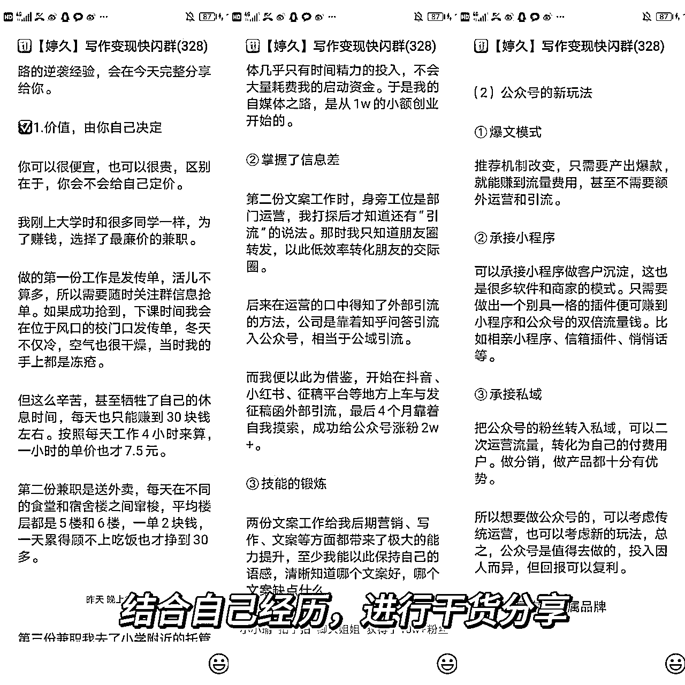

# 《深耕自媒体3年，营销经验为0，受朋友圈大航海启发，联名发起快闪群＋朋友圈营销，2周斩获17W＋利润，全流程复盘》

> 来源：[https://mxx9qev7l7q.feishu.cn/docx/Zk4idCWWQoy5W1xV2UFcbg8gnwg](https://mxx9qev7l7q.feishu.cn/docx/Zk4idCWWQoy5W1xV2UFcbg8gnwg)

生财圈友们大家好，我是卿久，是一枚公众号博主，运营两个账号慕卿久、未来可期的小赵

我全职做公众号3年，有18万粉丝，但以前不懂营销、也不懂规划朋友圈，不懂该怎么样借势表达自己，不懂该怎么样扩大影响力。所以空空守着十几万的粉丝，但是变现效果，远不如那些只有几千粉丝但个人IP强的博主好。

后来遇见「生财有术」这个平台，在这里学到了非常多的运营技巧，并且用在销发售自己产品当中，让自己的朋友圈得以多赚几倍。

我把在「IP朋友圈」航海和续航中，在生财有术学习到的发售技巧，运用到定价两千多的【双导师3年私教合伙人】这一产品，参考了前阵子十分火爆的瑞幸和茅台两个品牌之间的联动，1周内，结合朋友圈和快闪群宣传，拿到了17w营销额！

作为一个不懂营销生财新人，5月份加入进来，10月份可以拿到这样的成绩很激动！今天跟大家分享我的一些心得，以下是我用到的几个发售技巧，目录如下：

技巧1：朋友圈造势。

技巧2：团队合作。

技巧3：裂变招新。

技巧4：微信名片引导。

技巧5：干货分享。

技巧6：学员分享。

技巧7：报名成交截图。

技巧8：接龙报名。

✅技巧1：朋友圈造势。

（1）做法： “朋友圈造势”，就是在搭建快闪群前通过发圈来传播强化自己的人设。搭建快闪群前以及拉人过程中，卿久已经规划好发圈节奏。在连续几天内集中时间发圈，信息密度大，刺激用户。

（2）举例：在13日发了1条关于如何提升赚钱能力的圈以及自我介绍。

回顾卿久今年的收入变现能力，讲述自已一路成长变化以及一些赚钱方法，同时引起新添加的好友，激发对我如何赚钱的好奇心。

15日正式搭建快闪群后，发了一条宣告圈。同时配上“火爆”等字眼的文案，吸引更多小伙伴进群。

16日发了1条关于自己的优秀清单。

这条圈是把自己跟5年前毕业的小女孩进行对比，5年后的现在已经可以在自媒体领域有一席之地，有自己的产品和团队。

（3）好处：这几条圈主要展示了卿久的成长，并且能让更多人知道“我是谁？”，“我干了什么？”，“我能带给你什么？”，让用户牢牢记住自己，增强认同感和信任感。

对于发圈，卿久再说说，想要让别人关注到你，那当然要经常性发圈，但是要有节奏，不能1小时发2-3条哦，最好是一天4-5条，上午下午晚上各1条 ，剩下的1-2条可以看时间发。

··

发圈的时间一般要选上午11点-13点，下午5点-7点，晚上9点-11点，这三个时间刷朋友圈的人会比较多哈!大家可以试试～

✅技巧2：团队合作。

（1）做法：社群非常讲究团队配合。社群的流程繁多，一环扣一环，哪一环出现了失误，都有可能影响发售效果。

所以，一定要招聘群管理员，负责群管的各项工作，比如活跃气氛，叠楼，踢广告党等多方面。

（2）举例：卿久在这次快闪群中，一共选择了3位助理担任群管理员，1人负责3个群。

在全分享过程中，她们的工作量是比较大的，基本全天待命，但每一个人表现都没有让卿久失望，而且助理们之间互相配合，主观能动性非常强，及时回应，积极表现。

在这里，卿久举2个小细节，有需要的宝子可以学习哈：

①这次搭建11个群，为了避免一号多发导致被封号，卿久让团队每一个人都负责1个群的转发，人手不够可以喊场外援助帮忙转发，并且在分享开始前把一系列的注意事项都安排好，包括对应负责人，开头语，提前几分钟艾特全体提醒。

（同步转发容易封号，所以每个群我们只安排了一个小伙伴转发，账号安全第一）

分享环节是快闪群的重头戏，所以这一步要安排到位。如果遇到负责人空缺，我们也会及时补位，确保11个群都在进行分享。

②每一次工作对接都需要小助理确认收到，并且完成后也要回复工作进程和完成度，这是确保团队步伐一致，推进快闪群工作。

（3）好处：优秀的群管理员可以让我们省心，我们也能更能专注干货分享和招募学员。

✅技巧3：裂变招新。∴

（1）做法：这个环节是指让熟悉的好友发圈邀请更多人进群听分享。

（2）举例：为了吸引好友参加招新活动，卿久设置了1个新玩法：参与的号主进任意1个快闪群，生成自己的二维码，把文案+二维码分享到自己的朋友圈和社群。

为了方便各位号主，卿久已经提前把分佣文案准备好，至少2-3条，减少大家想文案发圈时间，降低发圈阻力。

同时卿久在拉新活动中设置福利，在快闪群发售过程中，有小伙伴报名课程或者私教，会一一统计，返佣到邀请人中。返佣金额力度可以较大点。

邀请朋友参加拉新活动前，也可以发一些小红包意思意思，毕竟ta们在帮我们忙哈！

（3）好处：通过裂变招新方法，可以提高进群人数，在一定程度上提高成交率，毕竟基数大。

✅技巧4：微信名片引导。

（1）做法：微信名片引导这个步骤很重要。它是新人进群后主动链接我们的方法。如果想要更好引导群友添加微信，可以设置一些福利，用大礼包刺激链接。

（2）举例：每一次群管理员欢迎新伙伴入群、叠楼分享还是早安语发送，卿久都会叫她们在尾部推送我和我朋友的名片。

（3）好处：通过添加微信可以增加我们的好友数量，扩大流量池。同时也是为了防止群被广告党恶意举报后，群友链接不上我们，甚至错过分享。

卿久对于这点还要再唠叨一句哈，推送名片是为了方便小伙伴添加咨询，降低ta们报名阻力。如果ta们不知道如何咨询，有可能会产生劝退想法哈！

所以要在正式发售产品后推送名片，有人主动咨询如何报名参加也要推送名片，不能仅是纯文字回复。

✅技巧5：干货分享。

（1）做法：快闪群的主要功能是从现有的私域流量池里最大限度地做转化，非常快地组织一个有趣活动，吸引大家关注，1个晚上，或者几个晚上做完转化立即就解散群结束。

吸引大家关注最快地方式就是通过分享干货。但要注意哈，分享会不是纯讲理论，要通过分享让小伙伴得知你的理念，心路历程。

（2）举例：在5天分享中，卿久和朋友都融合各自的经历，包括但不限于遇到的困难阻碍以及转折点，从而打动人心。

卿久在介绍自己的自媒体心路历程，让读者对我有一个全面的认识。

在这里，卿久为了让宝子更加清楚卿久的文章排布，这里具体地再说说，共4部分：自己做自媒体前兼职哪些工作？尝试自媒体带来的好处？对自媒体玩法的思考？深耕私域的重要性？小伙伴写个人IP文也可以根据这个来对标借鉴！

这种文章不仅要突出自己前后变化，更要突出自己在自媒体取得成绩，还得表达出你对该领域的认识和理解，让大家信服你的专业性。

（3）好处：分享自己的经历能让观众自觉换位思考，感同身受，对我们留下深刻印象。在后面正式发售产品也能更加顺利。

✅技巧6：学员分享。

（1）做法：学员分享可以作为一个加餐环节。只有讲师分享，没有第三者角度，产品的效果的宣传力度就不能非常到位。

（2）举例：在快闪群的第3天-第5天，卿久一共邀请了4位学员进行分享。

分享内容主要是以卿久和朋友的付费产品为主，以自己第一视角分享自己付费后的效果，学习中的困难，课程结束后的效果以及变现程度等多方面。

（3）好处：通过学员分享能让群里的小伙伴看到我们的课程效果，让大家知道做自媒体，跟对人，用对办法，人人皆可变现，减少甚至打消课程疑虑。

对于学员分享这部分，卿久有2个主要事项要提醒各位宝子：

•提前确认学员。

人选是很重要。我们在邀请学员作为嘉宾分享，一定是要有以下3个条件：

①时间充足：学员分享是要写稿和修稿的，而且中午时间能进行加餐，所以需要分享嘉宾要有充足时间。

②信任我们的产品：相信我们产品的学员会更加自发性站在ta们自己角度去宣传我们的产品。

③有变现：分享时一定得有涨粉or变现成绩作为支撑，背书很重要，这可以作为吸引群友的素材，让大家减少对自媒体变现难度的恐惧，知道讲师教的方法是可复制可实现变现。

所以卿久和朋友圈在这次快闪群挑的学员都是有各自的成绩，比如有通过人物写作日入4位数，有通过人物稿成功上岗成为写手，月入3000，使群友对我们产品增加信心。

•分享内容。

快闪群是为了发售3年私教合伙人，每个环节都是围绕它展开。

所以，学员分享的内容也是以卿久或者婷子的付费产品为主，以第一视角去分享自己遇到的困难，课程收获和变现程度等多方面，从而令群里的宝子们对我们以及我们课程有一个初步认识。

同时通过学员分享自己变化来让大家知道跟跟对人，用对办法，人人皆可变现，打消效果方面疑虑！

✅技巧7：报名成交截图。

（1）做法：当有人报名付款时，我们可以进行截图发圈以及发送到快闪群中，进行晒单。

（2）举例一：搭建快闪群前，卿久已经有过在朋友圈进行小范围的朋友圈发售。13日，发了1条关于私教价格2599/3年的优惠名额剩余。

举例二：在运营快闪群一周中，卿久每天都会发1-3条关于用户咨询、报名的圈，同时告知2599/3年是社群的内部优惠，周日截至。

（3）好处：报名截图以及优惠名额剩余不多侧面反映产品价值。咨询截图能让其他潜在用户感受到我们真诚和用心，激发用户报名欲望。

利用发圈不仅传递了产品价值，还体现消费者的认可。

优惠价格倒计时，大家可以进行最后逼单，最后的尝试也是非常有用，会有学员趁着末班车赶上来的。

✅技巧8：接龙报名。

（1）做法：接龙报名是发售产品很重要一个流程，可以起到活跃群气氛。

（2）举例：当发售产品后，卿久叫各位小助理在群里接龙，让已报名的宝子进行接龙，方便我们拉到学员群，解锁课程权益等等。

（3）好处：接龙报名，这个环节在一定程度上对其他人会有引导作用，有从众效应，提升其他人了解咨询的倾向，也起到通过抱团成长的噱头，刺激报名的作用。

这里注意，可能存在某一些群还没有人报名，存在没人接龙，可以适当找熟人当托儿来凑凑气氛，以免冷群，甚至影响宣传效果。

而不断有成员接龙，则会引起其他意向用户的好奇和跟风，实践下来，效果很不错！

以上就是我在生财有术学到的技巧，整理成4000字脱水干货！对于搭建快闪群，对于做朋友圈运营有需要的小伙伴，可以收藏起来这篇帖子，等你实践的时候可以对照着来，把每个细节拉满，对大家产品的宣发一定会有很大的帮助。

目前我的能力远没有在场很多大佬厉害，但加入生财这半年，从一个平平无奇的自媒体小白，到现在月入成功突破10w，收获真的非常大！希望给和我一样营销基础薄弱的小伙伴一些动力！

我想对号主伙伴们，如果你的知乎、小红书、今日头条、公众号等平台，明明已经有了起色，积累了几千几万粉丝，但现在涨粉停滞，变现受阻，只能靠接广告或者自己付费产品卖不出去

都可以尽可能地把粉丝，一点一点引流到私域，慢慢转化，赚取复利！不要否定你曾经的成绩，而是肯定自己，勇敢地再往前迈出几步，没有什么是不可能的！人生这条路很长，未来星辰大海般璀璨，不必踌躇于过去的半亩方塘。

波斯诗人萨迪曾说：“事业常成于坚忍，毁于急躁。我在沙漠中曾亲眼看见，匆忙的旅人落在从容者的后边；疾驰的骏马落在后头，缓步的骆驼却不断前进。”

最慢的步伐不是硅步，而是徘徊；最快的脚步不是冲刺，而是坚持。

距离农历新年还有100来天，我们都加油做最后的冲刺吧，一起生财有术！