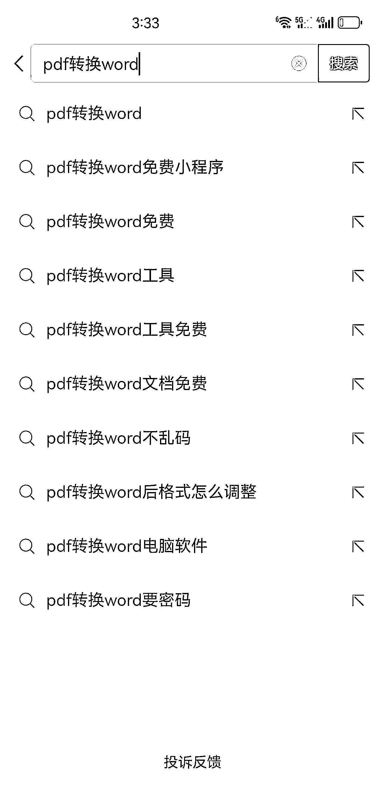
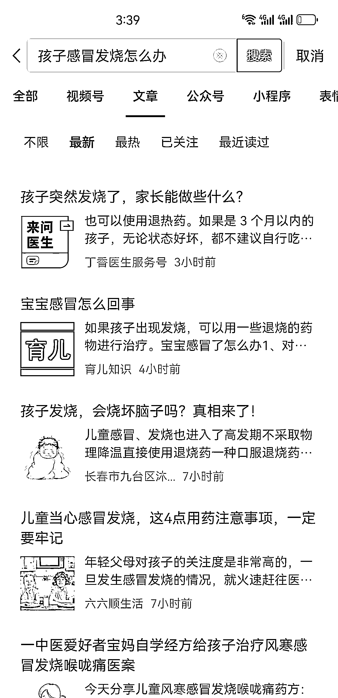
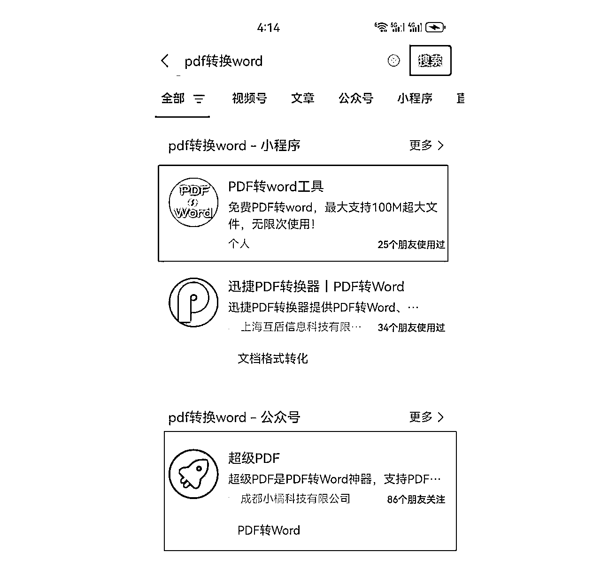
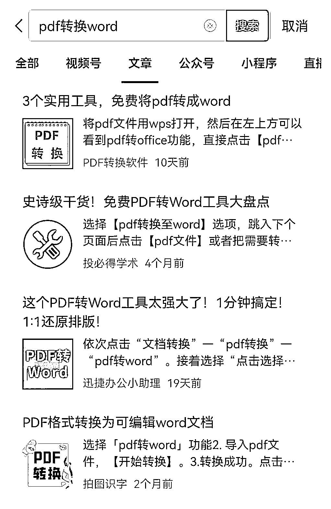
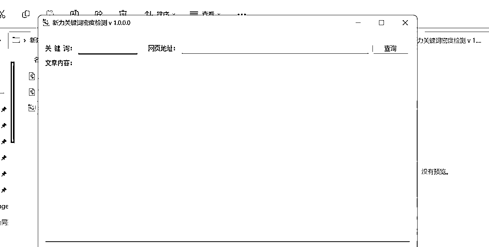

# 借助 SEO 思维，通过霸屏持续赚取收益

> 原文：[`www.yuque.com/for_lazy/thfiu8/my3h9pk6ddf8kmt9`](https://www.yuque.com/for_lazy/thfiu8/my3h9pk6ddf8kmt9)

## (36 赞)借助 SEO 思维，通过霸屏持续赚取收益

作者： 郭耀天

日期：2023-10-30

大家好，我是郭耀天，人称郭少

五年生财圈友，开发过千万级项目两个，百万级几个，生财有术写了 15 篇精华帖，一直专注虚拟项目开发与运营，对公众号霸屏拦截有一套自己的玩法，很荣幸担任公众号爆文写作教练，结合公众号爆文写作目前现状，综合公众号玩法与目前发展趋势，分享关于增加长期赚取收益，增加更多变现思路的玩法。

分享之前，先给泼点冷水，大部分操作公众号赚取收益伙伴，很难赚到钱，这是二八定律，也是操作玩法决定的，公众号对 AI 批量赚取收益玩法迟早会打击，目前也有部分领域账号被封，部分文章被删除，提示被滥用原创， 随着平台的不断完善，目前很多玩法是无法操作的，不过也不要灰心，掌握一些 SEO 的玩法，前期可能没有那么多收益，随着时间拉长，收益会持续不断。

人人都希望打开后台看到十万+，但是大部分人看到都是个位数，就算今天爆了，也担心明天就不推荐了。不知道你有没有这种想法，至少目前我认识的，一个月做几十万的，日赚几千上万的，都有这样的想法。总的来说，目前公众号写作赚取收益有爆文不稳定，收入不稳定，收益周期短等风险存在。有粉丝积累的另当别论。

其实搞懂公众号内容搜索推荐逻辑，创作一些用户需求的，能解决大家问题，帮助到人的内容，不仅能持续涨粉，还可以延伸出很多变现模式，前期可能拿不到那么多的收益，但是随着时间推移，随着内容的积累，你的收益会不断的增加，持续获得收益。

在很多人的眼里，收益是平台给的，这样说没有错，但是也不完全对，其实赚取的钱不是平台给的，而是商家的钱。

创作文章发布后在文中或末尾挂广告，商家在公众号投广告，我们拿的是广告费的一部分，平台再把部分广告费通过系统分发部分给创作者，看到这里，大家应该清楚了钱是怎么来的。

知道资金的来源，就可以理解为什么某些行业的广告费更高，如游戏、财经、美容、酒类和科技创业等，都是高消费领域，广告主众多，出钱也到位，如果你是这些领域账号，广告费吊打很多领域。

我自己的公众号是属于创业类，曾经有个一个点击价值十多元。如果你选择是情感，泛娱乐这样的粉丝，有人投广告，但是单价低，自然你拿到的钱就低了，所以不同的领域单价都不一样。

实际收益还与读者的点击行为、广告匹配度以及用户是否真正点击了广告等因素有关。现在，很多人选择使用智能广告投放，有时可能会匹配到单价较低的广告。

而且目前公众号现正往开放方向发展，优质内容被推荐，低质内容则被忽略。目前公众号可以展示的地方很多：

① 在公众号主页
② 微信搜一搜
③ 看一看中的在看
④ 热点中出现
⑤ 公众号底部相关推荐

可以看到有一些是纯推荐流量，就是还是有不稳定的风险存在的，而为了获得更好的收益，建议大家差异化运营，找一些细分方向，然后布局关键词，让自己的内容被搜索，不断积累流量，前期可能没有那么多的收益，后面就慢慢的增加了。

这个持续的收益有两种方式：

粉丝流量先按下不表，我们这次分享主要讲讲搜索流量如何更好的获取。

不知道你有没有这样习惯，遇到某个问题的时候，不再去搜索百度，而是打开微信搜一搜，看看有没有相关的内容。那么反过来想，如果我们创作的内容刚好是大家搜索的，是不是就会源源不断的带来精准的流量？甚至这样搜索过来的流量还可以直接转换其他的产品或者是服务。

一个简单的例子，需要把 PDF 文档转换成 word，对于不懂的是不是就去搜索下，看看有没有相关的方法，这个时候你把与 PDF 转 word 相关的关键词植入到你的文章，下面是大家搜索相关的关键词。

如果你在某个领域布局了关键词，不管用户搜索哪个关键词，都可以搜索到你的内容，特别是现在公众号发布功能升级后，可以无限制的发布文章，用一个账号批量创作一个领域的文章，如果你的内容收录比较好，排名比较好，是不是搜索出来都是你的文章。

这种需求是持续的，只要内容还在，你的收益还在，对于一些解决问题的，如果你有好的解决方案，他们直接联系你，购买你的服务或者是产品。

生活每天遇到的都是问题，选择一个细分的领域去操作，就可以干不少事情了。有的需求是一直存在的。

搞清楚展示以后，再看看公众号的推荐机制。

【前提】
想要获得推荐，有一个前提是你的文章要被收录。只有账号被收录，才有机会被推荐，如果连收录都没有，就别指望有任何的推荐。

判断文章有没有被收录最简单的方法是：
直接用自己文章的标题去搜索，如果能搜索到你的标题说明账号是正常的，可以持续的更新。

如果你发布的内容，连标题都搜索不到，这样的账号是不会拿到推荐的，要么换个账号，要么注销再注册。

我的账号因为违规就被关进小黑屋一年时间，持续原创了一年，才解开。想要被推荐，被搜索，前提都需要被收录，如果没有收录，剩下都不要去做，除非你有基础粉丝。

目前还不是完全清楚公众号的推荐机制，可以肯定的是，看到已关注的账号内容的机会更大。所以平台优先会推荐：你关注的、平时查看的内容、收藏的、点赞的等等相关内容。

目前推荐流量的来源有关注、推荐各种混合在一起，现在看起来还是比较乱的。

我们无法完全确定后面会迭代优化成什么样，不过可以肯定的是

如果选定一个领域，我们如何去找到长尾关键词，或者是是大家喜欢搜索的词，可以通过下拉词看到一些。

每个平台都有，微信，百度，抖音，快手，小红书，直接搜索某个关键词，就会弹出来，这种是比较笨的操作方式，还有可以直接去搜索一些问答平台，比如知乎，百度问答。

还可以借助软件操作，比如 5118，直接就可以找到下拉词，长尾关键词

找到关键词后，对关键词进行整理，找出关键词中指数比较大的，这里再说一点，如果你操作某个细分领域，如果能把这个领域的关键词的账号直接注册成公众号，搭建小程序，那么操作起来就更厉害了，昵称作为拦截名字，文章作为霸屏，持续不断的进粉丝，持续不断的获得搜索。

获得关键词后，根据关键词借助 ChatGPT 写内容，再配相关的截图。

实在不知道怎么写，打开知乎，打开百度问答，搜索相关的教程，跟着相关的教程制作，用自己的话写出来，或者用 ChatGPT 翻写相关的内容即可，再配上相关的截图，一篇文章就制作出来了。

对于账号来说关键词主要是：昵称，简介，菜单，提现，这个就想对内容多一点，

对于文章本身来说，关键词主要是：
注意不得超过三个，太多关键词不利于收录，也不宜过长，只要关键词到位，几年前的内容都可能被搜索到。

植入关键词的时候一定要记住一句话，关键词不能出现堆叠的情况，有的为了获得搜索，把一些关键词胡乱堆叠，而是需要找一个合理的方式植入关键词。

文章内容植入关键词：内容同样，关键词不能明显是植入堆叠的，而是合理的植入关键词，一篇文章关键词最好不超过 10 个，这里推荐一个文章关键词密度，对于我们做霸屏的文章，关键词密度不要超过 4，对于植入关键词多的，可以优化下。

当然，这个方法更适合有用户需求，能解决大家问题的文章，这类文章的特点是传播快，收藏多，转发多，不一定有鸡汤文、情感文这样爆，但是长久。

通过搜索过来的粉丝基本都是有某个需求的，这个时候就可以根据需求设置相关的服务产品。这时候我们不仅仅是拿广告费，还可以研究出很多的变现的模式：课程，服务，软件，会员，资料……不同的粉丝可以设置不同的项目。

如果说公众号赚取收益是雪中送炭，用 SEO 思维操作就是锦上添花，操作互不影响，只需要在操作时候，植入关键词，布局流量词，收益就是长期的，如果能拿到短期的流量，还能吃长期的搜索流量，就完美了。

我的分享就到这里，感谢大家支持

* * *

评论区：

博鱼 : 感谢分享[玫瑰]

* * *