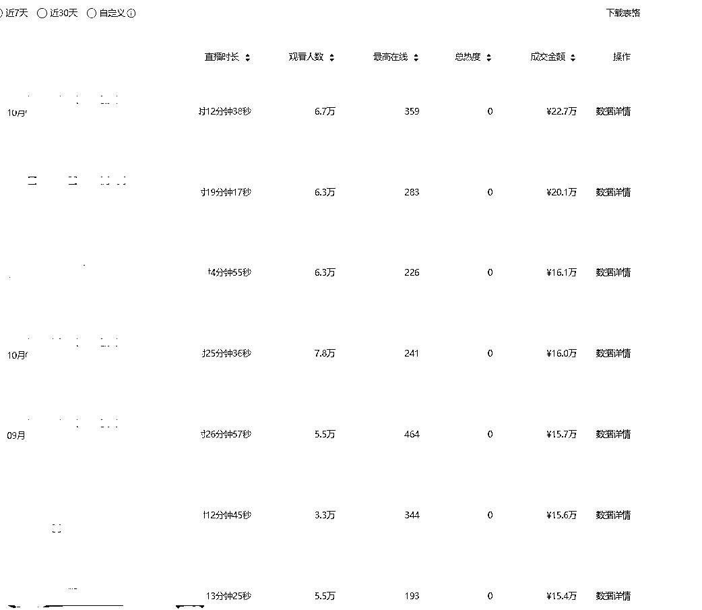
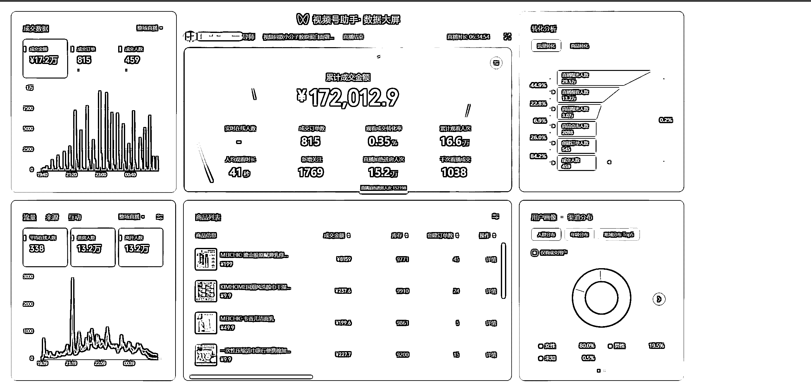

# 视频号百万利润最新业务模型分享

> 原文：[`www.yuque.com/for_lazy/thfiu8/pmg5zrt1mce68gzn`](https://www.yuque.com/for_lazy/thfiu8/pmg5zrt1mce68gzn)

## (21 赞)视频号百万利润最新业务模型分享

作者： 悠途

日期：2023-11-02

上次分享链接：[`note.youdao.com/s/BJRxeIYo`](https://note.youdao.com/s/BJRxeIYo) 聊一聊普通团队视频号直播起盘的方法论

距离上次分享正好 1 年了，今天来分享一个我们最新的视频号业务模型——公域+内容 IP+私域，只要你在做视频号，相信会让你有收获。

直接进入正题，上数据，都是我们最近的实操。

# 1.上数据

都是我们实际做到的数据，护肤、滋补等可以做私域的类目，月销售额 500-1000 万，日 20-40 万，私域销售额可以按公域销售额 10%计算，私域单粉产值可以参考上图，上图是私域团队刚开始的数据，才 2000 粉丝的数据。如果一年沉淀 10 万粉丝，那私域的数字就很客观了，私域净利润保守按 40%计算。

# 2.上模型

模型：公域+内容 IP+私域，做同一个品，业务模型不一样，结果千差万别。要做最契合平台的业务模型，才能充分释放平台的威力。视频号没有抖音爆发性那么大，也没有抖音消费人群那么广，也没有抖音私域引流那么难，视频号有她的优势，量级小，竞争小，roi 好，前端就能盈利，私域都是免费的，人群不广但集中在 40+，针对人群选品如干柴遇到烈火，导私域没有那么大阻碍，积少成多都是自己怀里的财富，焦虑的解药。

这套模型适用范围：产品要符合高客单、高利润、高复购，非标产品

# 3.上团队

入门低配：运营+主播+私域，运营兼投放兼供应链，私域兼客服，1 天工作 12 小时+，夫妻档最好。我的众创团队中就有这个成功案例，在我们办公室一天干 12 小时以上，身兼数职，3 个人也能跑起来，就是累点，不过他们第 2 个月就利润 15w+了，私域还在持续积累。

标准配置：运营+主播+运营助理（中控副播一体）+投放+私域+内容+客服，岗位要细化，运营的部分工作要分配出去了

豪华配置：需要有主管级别了，直播间运营组长、投放组长、私域组长、客服组长

# 4.上资金

准备至少 20 万启动资金，测品准备 1-10 万的亏损，1 个月左右打磨，基本会有一个结论

跑起来了后，至少要准备月 GMV 的 50%以上资金，这个模型对资金有一定要求，月销 500 万，平台账期在 25 天左右，投放是预充值，货款有一定账期，刚开始难超过 1 个月，所以月销 500 万，准备 250 万是需要的。

当然，量跑起来了，资金是有很多途径的。

# 5.上投放

1.如果能通过内容拿到免费流量，那是很棒的，利润一定不会差。不行，就通过投放，目前投放都是可以盈利的，能做到 10%以上的净利。卡赔付是肯定要做的，不知道这个的就没有入门了。

现在 2 个投放入口，微信豆和 adq，微信豆 roi 更高，adq 放量更大，各有优势，注意，两者会重复计算 GMV。

2.微信豆直投，对主播要求高一点，需要根据直播间测匹配的出价，也要根据直播间来调整出价时长、年龄、城市、兴趣，这个没法给出具体的方法论，要结合直播间产品、定价、利润率、直播流程、人群、阶段来做具体分析，如果有人告诉你一套投放绝技，投了就起飞，伸脚踹飞他。

3.ADQ 投放，现在主流投短视频进入，普遍 roi 低于 2，有些类目对 roi 要求比较低，比如护肤，是可以跑出日几十万，甚至更高。国庆期间有朋友 2 个直播间各跑出了日 300 多万和 100 多万，roi 在 3-4，几十个户在跑，标杆直播间，很羡慕，也很仰慕。投 ADQ，对内容团队就有要求了，需要持续产出素材和过审。

# 6.上内容

分人设内容和投放内容。如果能做爆量人设内容，就很棒，请联系我，我能给你放大变现。我现在也在孵化 IP，能给你一些实战数据和经验。

投放内容，就是类似抖音千川内容逻辑了，找到爆量的模板，不断重复。初级农产品，尽量出原生内容，哥哥姐姐们更喜欢。上 2 个案例。

# 7.上供应链

这个模型，需要自己搞定供应链了，一是需要有足够的利润率，二是需要把控供应链的品质，甚至做一些定制包装，跟供应链的配合是密不可分了。

刚开始没有量怎么搞定供应链？先上比市面上好一丢丢的货，先卖起来，怎么判断市面上是什么货，看淘宝抖音主流在卖什么，多聊几个供应商，哪个规格的电商出货量最大，就是电商主流产品，稍微提升了一点，然后定价比抖音高 20%以上，视频号的姐姐能接受高溢价，要敢卖好货，卖高价，不要怕，以前做惯了低价，做惯了垃圾货的朋友，这次把腰杆挺直了重新做人。

量起来了，后面的问题迎刃而解，有量就是王道，所有的谈判技巧在量面前不值得一提。要知道，我们赚的不是供应链的钱，贵一点点不影响你的业务模型，我们赚的是渠道的钱，没有卖到 100 万以前，不要在供应链上花费太多时间。

# 8.上投放私域怎么搞定？或者我是私域团队，直播怎么搞定

会直播，不了解私域怎么办呢？比较容易的就是找一个靠谱的私域团队合作，私域电商是一个很成熟的业务，近十年孕育了足够多的私域团队，现在他们原有的广点通投放渠道已经失效，急需新的线索，直播线索已经逐步成为一条重要渠道。但是，注意，但是，一定要找靠谱的守法的团队，不然是有踩缝纫机风险的，私域出事了，你跑不掉的。合作团队一定要靠谱。

私域团队想做直播的很多，但跨越过来的很少，跨越过来的，都活的很滋润。最好的方式，背水一战，内部当做二次创业，老板一定要亲自下场。其次，找直播团队深度合作，循序渐进的合作，我现在部分私域自营，部分对外合作，主要精力还是在直播和内容。

# 9.我是小团队，应该怎么上？

先抄后超。新人没有资格选品，必须抄袭跟品。

团队再小，基础启动资金要有，主播+运营是最小单元，也可以作战。

不要是小白，如果是没有做过电商的纯小白，不建议，劝退。

我们众创模式不合作小白，因为这个模式不算入门玩法，相当于滑雪的中级赛道了

# 10.有团队有资金，怎么快速启动？

抽调有战功的老人带新人开辟新业务，最好是合伙人级别领头。

落地方法还是选对标，像素级复制，不要有自己的思考，不要自我创新，因为你不知道，哪个细节是关键细节被你自作聪明改掉了，好的直播是由无数个细节反复反复反复迭代完成的，做一个空杯心态的小学生，会比较快。

最后，介绍下现在对外交互的 2 个事情。

1.打算扩大我的 1 个视频号投流直播社群，不收费，但需要你单场日销售额破过 2 万，视频验证，进群了后群里发个红包即可，现在里面都是日 GMV 卖过 20 万以上，且视频号耕耘了 1 年以上的朋友。不定期会组织小范围线下沟通，已经组织过 4 次。

2.开放 3 个众创名额，要求有电商经验，不考虑小白哈，有直播带货经验最好，需要来我们办公室一起，确保成功概率足够高。做这个的初衷很简单，当下视频号的红利足够大，我们跑出了业务模型，自建团队来不及承接红利，输出我们的一点经验，扩大组织规模，抓住有限的红利期，最大化迎接风口。

* * *

评论区：

大可爱😎 👻 : 联系方式给我一个
子非妮 : 怎么联系呢

* * *