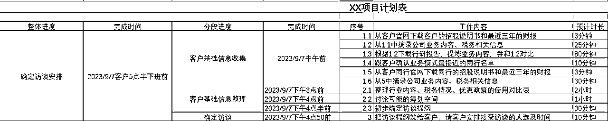

# 时间管理的底层思维和操作方法

> 原文：[`www.yuque.com/for_lazy/thfiu8/rwgkyecu49nckosx`](https://www.yuque.com/for_lazy/thfiu8/rwgkyecu49nckosx)

## (37 赞)时间管理的底层思维和操作方法

作者： 康妮姐

日期：2023-11-01

大家好，我是康妮姐，本次航海的时间管理教练之一，20 年经验的税务专家，合规筹划节税额 30 亿。

我的工作一直和时间有关。用时长依据收费，用时点保证交付，用耗时控制成本，所以尝试过很多时间管理方法，也在实践中积累了一些经验。
今天我就把我 20 年总结迭代的时间管理的 “功夫” 分享给大家，我认为它从根本上解决了困惑，创造了更多的时间，完成了更好的产出，在我的团队推广实践应用也很有效，希望对大家有帮助。

因为一共有 5 点，所以我给它起了个名字叫“五星功夫”。五颗星星分别是衡量时间，要事第一，周密计划，保持状态，有效复盘。

20 世纪最伟大的管理学家彼得德鲁克曾经说过一句话，一样东西，如果你不能够衡量他，你就不能增长他。
同样的，如果我们想增长时间，那我们首先要做到的是衡量时间。

那什么是衡量时间呢？

肯定不是说让你拿着表去或者手机去数秒了。衡量时间是你体内随时自带一个计时器。

这个听起来很容易，但其实比较难。比如同样的 1 个小时，刷短视频的时候怎么这么快，开会的时候怎么这么慢，这就是不一样的体感。

当你掌握了衡量时间的能力后，会出现这样的效果：
1、你会对将要做、正在做的事情，花费的时间，有更准确的预估；
2、不会因为重要的事感觉要多花时间，就下结论“没空”不去做，比如锻炼，整理笔记；
3、不会因为不重要的事“就一会儿”，就随意开始，比如刷视频，闲聊。

衡量时间的训练的方式很简单：

第一，摒弃情绪，用无区别的心对待每一件事，时间是公平的。
第二，有意尝试，在开始前预测时间，开始后感觉时间，结束后测量时间，复盘时进行分析。

尝试的方式也很简单，不用开始研究任何计时软件，千万不要
放个本子在旁边，开始的时候记一笔，结束的时候记一笔，看到误差后，有时间就想想到底是哪块儿技能自己高估了，没时间就想 30 秒大概知道就行了。

每天工作结束后，花 2 两分钟看看今天记录，把需要改进的部分简单写几个字到旁边。特别重要的列入计划。完结。
记的东西你能看懂就行。所以千万不要纠结买什么本子笔，配什么文具写多少字，这些动作没一个对目标有用的。

建议先从你觉得“就一会儿”的事，和“没空做”的事，开始。
相信我，你会发现一个未知的自己，也会对每件事重新定义。
两天下来你就不一样了，两周后改变明显。

在时间可以衡量的前提下，我们就可以开始对时间进行真正的管理了。

我们面临的最常见的问题是：同时有很多事情要做。
这个问题是让我们渐入纠结内耗的最重要的问题。处理不当的话会让我们每天疲于应付，最后迷失自己，简称瞎忙。

那么如何解决这个问题？要事第一，就是永远把重要的事优先。

什么是重要的事，需要拉长周期，把现在的事情，嵌到你的周计划、月计划、年计划，甚至人生计划去思考，真正做到日拱一卒。

从生财这个点出发，那就是所有的事情，在赚钱这件事上的贡献度，再明确点就是收益、成本、风险，重新排序。

更具体的说，你要做的所有事情都可以用 这个公式来衡量。

这里注意 2 点：
1、动作一定是对目标有贡献的；
2、反馈最好是当下的，也可以是长期的（比如思考，研发，休息）。

凡事欲则立不预则废。如果有手头不止一件事的话，计划就成了必须。

计划是由和两部分组成，列计划需要注意以下几点：

1、时间的起点，是现在。终点是 deadline 的前两天（或前两个小时，前 20 分钟）。一定要像赶飞机一样提前，才能应对意外出现的特殊情况。
2、预估每一个动作，包括如果遇到意外的应对策略，也就是 plan B。

3、预估每个动作所需时长，填到你的计划表中。这里需要用到衡量时间的技巧。
4、做一个 MVP。先校验、跑通，不要铺开太大。比如改革开放是从特区开始的，积累了经验才全面开展的
比如在我的工作中，我是先看一个月的数据，先开一个小范围的启动会，先试点一个区域的方案。

5、根据 MVP 调整第一步和第二步。
6、确定、并搞定每个动作牵涉到的所有的人、财、物、场地、顺序等。
出于保密的职业道德，我给大家看一个我行业最基础动作的计划表作为例子

补充 MVP 的应用

制造业的新产品上市有其自身规律，不是在实验室研究出来后，就直接批量生产推向市场。
通常有四个阶段，小试，中试，试生产，量产。

小试，就是在实验室里把产品做出来；中试，就是模拟一个生产环境对小试进行放大和检验；试生产，就是放到正式的生产线上跑，直到符合既定目标；最后才真的量产。前三个阶段都需要不断调整。

部分焦虑，就来源于直接把自己推进了市场，良品率不高，或者良品率虽高但成本过高，又开始怀疑自己

有时候，即便我们已经确定什么事要做了，也知道其实花的时间并不可怕，可就是拖延，或者提不起兴趣，反正“不在状态”。怎么解决呢？

状态是你当下所有精力、体力、情绪的集合，是你这个生物体要作用于外界的起点。

每个人的状态形成原因不同，需要大家自己去觉察和记录，按年、季、月、周、天、半天甚至小时，大概会是什么时候最佳，什么时候最差，尤其是找到自己的那个临界点，可以在适宜的时候去拓宽，不要在慌乱的时候去刺激。

比如我自己，同事们都尽量避免给我安排下午 3 点的重要会议，因为那个时候我的状态最差

我们可以根据上述内容，做一个自己的生物实验手册，包含饮食、睡眠、运动、情绪等，以及历史上对付不良状态时曾经有效的心法和方法

根据自己的生物特性，可以把重要或着急的事安排在状态好的时候，把不重要或者不着急的事情安排在状态不太佳的时候。
至于轻重缓急怎么区分，请回到“第二个，要事第一”去衡量

如果有情绪问题，也不用沮丧，识别情绪的周期和解决方案，就像饿了吃饭一样自然。比如我在某些时候会容易伤感，我会接受自己的周期，不会强行寻找快乐，而是干脆看一部悲剧，眼泪流完人就清爽了。

首先，接受每个人都有不喜欢做的事情，把潜意识里的不愿意，放到明意识里，然后寻找不喜欢背后的情绪，是畏难，还是嫌烦，然后针对性地做情绪训练，寻找正反馈。
也可以直接让行为改变状态。

有两种情况：

可以先去干点与工作相关的，其他重要但不紧急的事，放慢节奏，让自己进入状态。

拿我自己举例。我是靠脑子吃饭的，状态不好的时候动不了脑子，那我就去干点其他的来恢复，重看项目资料查缺补漏，整理工作文档方便以后，阅读行业税法寻找灵感。

这些事务，既不需要耗费太多的精力，又必需集中一定的精力，还能够给我一个很明显的正反馈，甚至会直接产生灵感，脑子就转起来了。

我们可以做状态练习。也有三个版本

最简单的做法是：
先放松深呼吸，想像自己正在做一件自己最喜欢的事，体会给你带来的美妙感受，然后带着这个非常棒的状态，去投入工作。

进阶版的做法是：
先放松深呼吸，放松后去想象，想像这项工作已经完成后的情形，比如说升职加薪，或者视频爆了，存款增加了等等，体会你的感受。然后带着这个非常棒的状态，去投入工作。

高阶版的做法，是在第二种做法上再加点料的 WOOP 模型，做法是：

先放松深呼吸……
W：想象。
想象这个事情虽然有些棘手，但你觉得能够达成。这个度要把握好，别选你一定做不成的，这方法并不能点石成金。
O：结果。
想像这项工作已经完成后你的样子，你对此有什么感受？比如升职加薪，获得肯定
O：障碍。

思考你自身的阻力是什么？它是真实的吗？找到那个妨碍你完成目标的最严重的、内心的障碍。
可能是很普遍的“累”、“紧张”，也可能是某种行为、情绪、观念、冲动、恶习等。

这里有个坑，有的人会在此时联想起 O 的其他坏事，或者干脆进入到了反思状态，然后就无法继续了。
此刻，先接受自己的情绪，不要推开他：不要我不该 XXX，而是此刻我就是 XXX 了。这个非常重要。
情绪的奇妙之处在于一旦觉察就被打断。回忆一下，在你忘情的时候，是什么让你停下来的，是你突然意识到自己的忘情。

P：计划。
要克服或规避这个障碍的话，你能怎么做？
想出最有效的想法和行动，将其牢记于心
然后想一想这个障碍，下次将在何时何地出现。

接着制订一个“如果……那么……”计划：“如果障碍 X 出现了，那么我就采取行动 Y。”
然后将这个计划重复一遍给自己听。

比如说，你不想写稿子，想刷手机，那就告诉自己：
如果我在沙发上躺着刷手机 10 分钟了，我就放下手机，从沙发上起来，移步坐到电脑前，打开 WORD 写稿子。

这里有一个比较容易犯的错误，举个例子：
一个律师想在法庭上表现得更加自信，他的 “如果……那么……” 计划是 “如果我能提高嗓门反驳对方律师，那么我就能打赢官司” 。这是个错误示范。

正确的计划应该是 “如果在对方律师反驳我时我觉得不安，那么我就提醒自己——我的本事一点都不比她差” 。

记住，你要制定的计划取决于你的“障碍”，你需要采取以目标为导向的某种行动。

大家可以发现，WOOP 模型是要事第一的一种实现方式。不仅可以针对当下，还可以制定周、月度、季度、年度的计划，
所以，它不仅能帮你提高工作的完成度，还能帮你减轻 “吃着碗里的想着锅里的” 纠结内耗式焦虑。

不论哪种状态练习，本质上是一种冥想，所以一定要扎实地静下心，认真做，别想匆忙结束敷衍了事，一定要想好、想透，要不然想完了还没干劲就不对。

时间越紧张，状态练习越要认真，此时“浪费”的时间，完全可以通过工作效率的提升抢救回来。

静心的标准是“虚心实腹”，大白话是“把心放肚子里”。现代人不会放松的情况很常见。我自己是通过站桩和呼吸训练学会的，在此我分享一个起势动作。

动作的要点。1、深吸一口气。2、憋气。3、把憋住的气送到腹部，感受”把心放肚子里“。再从腹部送回胸腔，感受“把心提嗓子眼儿”。一口憋住的气能做四五个来回。4，重复上述动作，直至“把心放肚子里”感受特别明显就停止

今后再感受到“心提在嗓子眼儿”的时候，就可以通过这个动作快速地“把心放肚子里”。

复盘的角度有很多种。从时间管理的角度，复盘有三个要点：

第一，复盘计划是否周密。动作有没有被严格地执行，如果没有，是什么事儿妨碍了你，它为什么能打断你？
第二，复盘时间衡量能力。检查在工作过程中自己预测并实地测量、对比时间的结果如何，发现自己的误区。
第三，复盘要事第一原则。虽然在计划的时候已经注意这个事项了，复盘时好多人还是会跑偏。如果有了新的想法，既不要着急马上解决，也先不着急调整计划，一定要想想和你的任务结果有多少必然的关系再下手。

比如说拍一个视频，突然之间你觉得这个背景下可能穿一个红色的衣服会更好看，然后你就开始选，是红外套呢，还是红衬衫，还是红 T 恤衫，是冷色还是暖色，深红还是浅红，面料是要针织那种细腻，那还真丝那种光泽，还是亚麻那种肌理，最近的商场有没有，预算够不够，花了很长时间很多精力，工作遭受到了巨大的延宕，后果不可控。

最后你发现，其实有好几个方案不用去在红衣服上折腾，比如换个背景，或者干脆放弃视频，甚至搞个图文更快更有效。

总结：
我们每个人都是一台被写好程序的机器，外界按几个键我们就会按照程序反应。
掌控人生，首先要知道自己是怎么反应的，然后改写内置程序。

* * *

评论区：

小七 : 很走心的分享[玫瑰]，中间看着看着是越来越有熟悉感，直到出现冥想 2 个字哈哈。视觉化想象，呼吸控制，都是很有效的觉知训练意识。被你这么跟时间管理联起来梳理，很棒的输出
叶叶 _ 优势教练 : 这个时间管理真得拆解很细致，真的是底层逻辑，学到了！

* * *