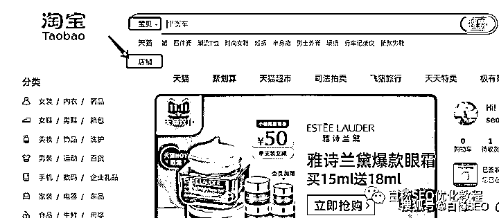
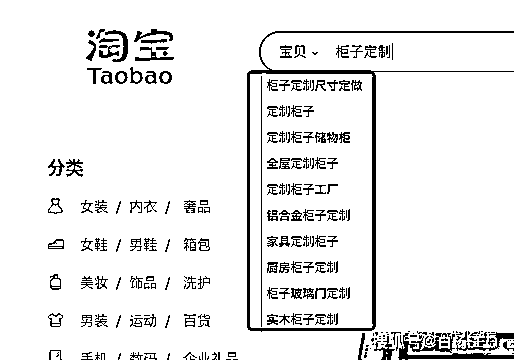
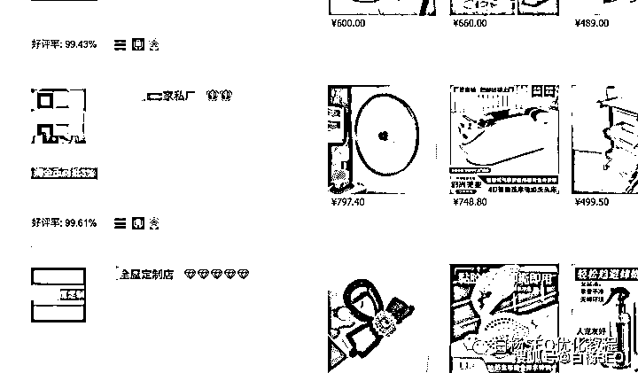
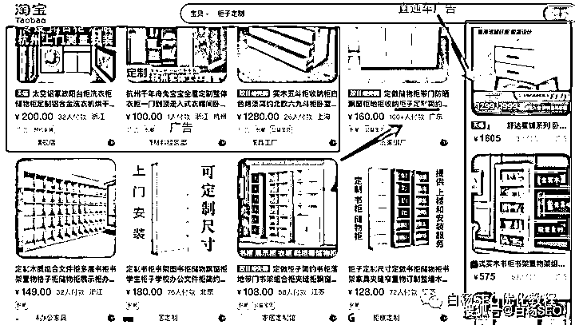
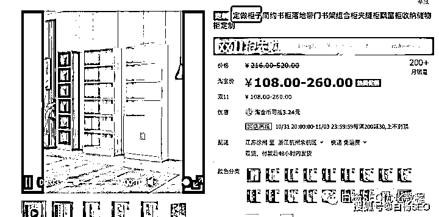
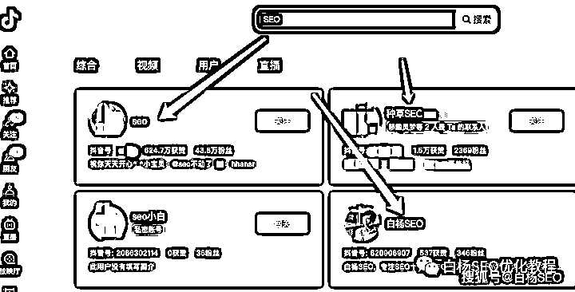
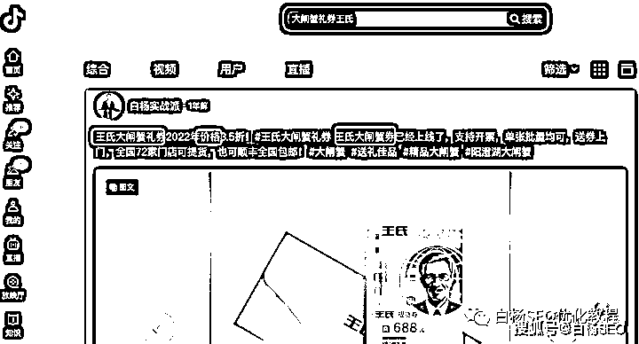
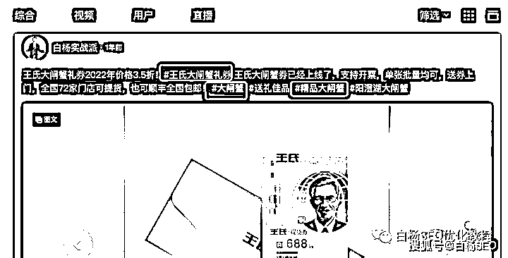

# 关键词布局怎么做？以淘宝与抖音搜索举例

> 原文：[`www.yuque.com/for_lazy/thfiu8/pwxlm1631am02azk`](https://www.yuque.com/for_lazy/thfiu8/pwxlm1631am02azk)

## (25 赞)关键词布局怎么做？以淘宝与抖音搜索举例

作者： 白杨 SEO

日期：2023-10-31

**关键词布局，这个动作具体该怎么做？**

最开始我们提到关键词布局，主要是指去布局到优化网站做搜索引擎的排名的，比如这篇：《[合理增加关键词在网站页面出现次数占比的十大板块](http://mp.weixin.qq.com/s?__biz=MzU2NTQzMzA4Nw==&mid=2247494176&idx=1&sn=d0d5a95cce3d48a6d329388d1aa5c557&chksm=fcb96db0cbcee4a63249979a78442550536a638394ebedb0edd3d9d12bb6069fe1ca3f04dc0e&scene=21#wechat_redirect)》

现在的关键词可以布局的地方，比如不管是 APP 的名字，还是抖音账号，短视频描述，店铺商品名字，自媒体文章标题都可以布局。但这也有一个前提，你有没有做这些东西。

比如提问的那个群友，我看他做的是柜子定制业务，这种属于传统业务。线下典型的就是家具店，或开在路边或开在家居商场或市场。线上的话，最主要获客渠道应该是电商网店。有一些有实力的，可能会搞网站。结合当下最火的短视频的话，会去发抖音短视频什么的。

虽然他没有说具体在哪个平台，我就以淘宝与抖音举例用白话简单写写吧。

**淘宝**

虽然现在电商是拼多多很火，还有其它电商平台什么的。我以淘宝举例，如果他要去做别的电商平台，布局关键词一样可以用。

一个用户在电商平台搜索，最主要是搜索商品，当然也有少部分用户会搜索店铺。所以关键词除了商品标题，店铺名字其实也可以考虑包含。不然平台搜索里也会有店铺这个选项，如图。

这里再稍微补充下，也许有人要问，关键词都要布局了，那关键词哪里来的呢？可以看看这篇：《[白杨 SEO 第 1 课：SEO 是什么与关键词分析](http://mp.weixin.qq.com/s?__biz=MzU2NTQzMzA4Nw==&mid=2247483668&idx=1&sn=6b208870ea9e7cf8c9916c53c8f595cc&chksm=fcba8684cbcd0f9244b40cfd910abbd79d7c2ecc8e73eafd33571f2bf8afb35b18e8e600bc81&scene=21#wechat_redirect)》。做淘宝嘛，如果你有买官方的就用生意参谋，没有淘宝自带下拉提示。

继续关键词布局，在淘宝里可以布局地方，一就是店铺名字里包含这个业务关键词，二是这个店铺里的产品包含这个核心关键词及其相关长尾词。

如果他的业务只做柜子定制，其它任何业务不做，那么店铺可以取名 XXX 柜子定制。如果其它业务也有，就不能只叫柜子定制了。

再来说说如何布局在商品标题里，以“柜子定制”这个为关键词搜索举例截图

看上图，除了淘宝广告、销量因素外，是不是关键词全匹配更靠前。当然你还会说，那柜子定做，定制 XX 柜子，那些不是关键词吗？是，它是关键词，但不是这个搜索关键词的布局。可以布局另外产品上，如图：

所以当你开了淘宝店铺，一定要把你行业相关的主词长尾关键词全部挖掘收集起来。在发布你的产品的时候，就可以把你挖掘好的关键词分产品布局写在标题上即可。

当然做淘宝商品排名不是光关键词布局就可以了，关键词布局只是基础中的基础而已。核心要么是开直通车，要么把销量，好评率，店铺权重等等做上来。除非你做的那个类目没人或者很少人做，人无你有，排名自然有你！

**抖音**

抖音是短视频和直播里的“一哥”，现在不管你是做 2C（销售给个人）还是 2B（销售给企业）的业务推广，都可以在抖音开展。

昨晚我跟一个认识多年的朋友聊，他在东阳帮别人卖红木家具，现在就是做抖音短视频跟直播。

为什么他这个定制柜子也可以做抖音呢，因为抖音比淘宝可能更直观，除了短视频，更重要是直播，可以现场看生产、安装过程！

先说下关于抖音关键词怎么挖掘，可以用第三方工具外，手动直接用抖音自带下拉提示收集即可。

**抖音上关键词布局具体怎么做？**

抖音上关键词可以布局的位置有：账号名字上（用户昵称）、抖音短视频发布视频的描述里、#话题标签、抖音视频作品内容里、抖音短视频作品评论里以及直播预告、直播主题、团购商品标题里都可以布局你的业务关键词。

具体怎么做，布局在哪里，我来举例截图说说，就不以柜子举例了哈。

1、布局在账号名字上（用户昵称）

这个再简单不过了，就是账号昵称上带这个关键词即可。比如白杨 SEO 所在的 SEO 这个关键词。偷偷说下，账号带关键词跟你作品搜索排名没有任何关系。

2、布局在抖音短视频发布视频的描述里

这个也是再简单不过了，也就是你发布作品的时候，你在写描述包含你的业务关键词及相关长尾关键词即可。

比如，我每年 8、9 月卖王氏大闸蟹券。核心关键词是大闸蟹券，相关有，王氏大闸蟹券，大闸蟹礼券，大闸蟹礼券价格等，我布局如下图：

3、布局在#话题标签上

还是以上面王氏大闸蟹举例吧，这你能看懂吧。是不是很简单？

4、布局在抖音视频作品内容里

简单理解就是抖音上，你发布的短视频里的内容，抖音也是能提取的。所以你可以在你发布视频包含你要做的关键词，如图。这也是为什么有人问我，没看到人家描述和话题有那个关键词怎么也能搜到，人家内容里有了哈。

5、布局在抖音短视频作品评论里

这个评论，可以是你自己引导写一个评论包含关键词的，也可以回答别人的时候写上去，如图：

6、直播预告、直播主题

经常有朋友过来问我，白杨老师，抖音直播可以做 SEO 吗？我弄得苦笑不得。因为抖音直播来的流量，要么是你的某个短视频爆了来的推荐流量，要么就是你花钱投的豆荚，或者你直播的时候付费投流来的。

而所谓抖音 SEO 是指用户主动搜索的流量，除非用户搜索的时候，你正在直播，而且你直播的主题恰好布局了用户搜索的核心关键词，那么就有可能了。

不过，你可能会说，这点来的流量简直可以忽略不计，如果你是做 2C 带货这种确实是。但如果你做的 2B 之类的业务，那就不一定了。用户主动搜索看到你，停留时间肯定比推荐他看到留得更久，只要留下来，你就有机会营销他是不是？

直播预告、直播主题怎么布局关键词呢？这个也是很简单的。比如你下场想讲企业该怎么选靠谱的 XXX 机械，那么 XXX 机械的核心关键词就可以写在预约直播上面。

如果你有团购商品包含这个关键词，你在直播的时候，当用户搜索的时候也会排名靠前。举例白杨 SEO 附近的“径山花海”景点举例，如图：

这下你看明白了吧？至于其它平台的关键词布局，其实也差不多。

当然，这个也是和淘宝 SEO 一样，不是说关键词布局排名就能上去了，关于抖音上关键词布局了怎么上排名和排名因素我之前有写过，可以搜索找找看。

作者简介：

白杨 SEO，专注 SEO 研究十年，全网 SEO 流量实战派，对互联网精准流量有深入研究。全网同名个人品牌：白杨 SEO。

* * *

评论区：

暂无评论

* * *