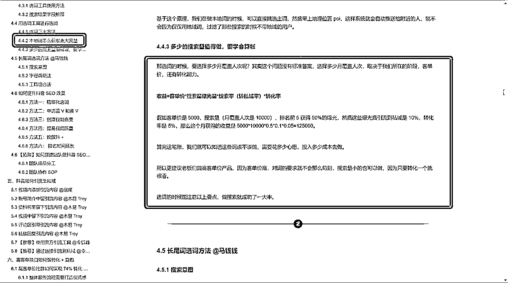
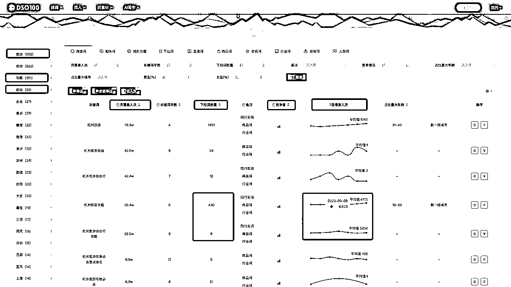
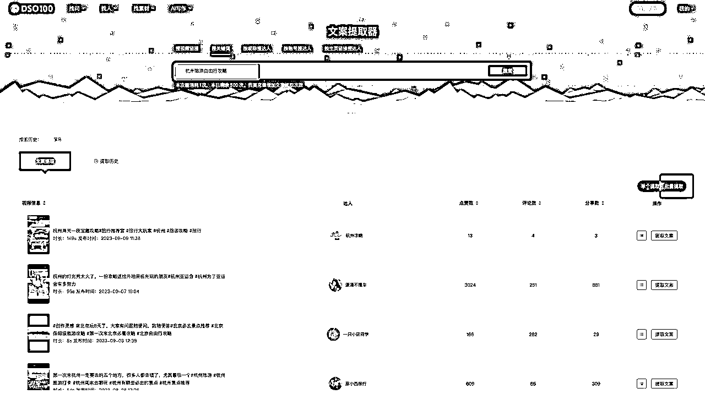

# 抖音 SEO 新手小白如何快速拿到正反馈

> 原文：[`www.yuque.com/for_lazy/thfiu8/cb86dwkxn45xav77`](https://www.yuque.com/for_lazy/thfiu8/cb86dwkxn45xav77)

## (24 赞)抖音 SEO 新手小白如何快速拿到正反馈

作者： Hawli

日期：2023-11-03

大家好，我是本次航海的教练李小随，咱们航海已经过去了一周，我看完了大家群里的提问和打卡日志，觉得有一些内容需要系统地分享一下，今天主要从两个部分来分享：
1、抖音搜索新手容易遇到的问题
2、快速拿到正反馈的基础步骤

我们先来进行第一部分，有很多同学在报名抖音精准引流 SEO 航海之前，其实不知道这是个什么航海，也不知道自己能学到什么，于是参与的时候也会比较迷茫，而手册又非常系统，对于小白来说信息量太大，在操作的时候进度就会比较慢。

我们做抖音搜索培训以来，已经教学过 1500+位学员，其中最快的学员能做到当天的出成果，而 30%以上的学员 1 个月就能出成果，剩下的学员，三个月内也能出成果。

那么为什么能有这样的效果呢？
最重要的就是他们把新手期会遇到的问题解决掉了。

新手期最容易遇到什么问题呢？
我觉得更多是认知上的，我总结出以下 3 个比较经典的问题：

搜索流量最重要的就是精准，主动搜索的人远比被推荐的人需求大，所以我们在做搜索时候，也要把选词放在第一位，选好词，是做好搜索的第一步，我看很多船员，上来就选一堆词，不管三七二十一堆上去，做完也不会看数据。
还有的学员还是用老一套的思维，想着怎么买粉，涨粉，那个跟搜索半毛钱关系都没有，你这样干，等于完全没有入门，白干。

一个精准流量，远胜于一堆泛粉。

我们之前有一个学员，在航海快结束的时候说，他的领域搜索量比较小，他也就不纠结了，直接把词都做了，虽然搜索量小但精准，陆陆续续引来了不少客户，他非常开心。

所以，在做搜索的第一步，我们不是贪多，而是先拿到正反馈，如果领域搜索量小，那就直接把词都做了，列出来，挨个做，100%会拿到成果，特别是客单价高的领域，来一个客户回报都会很大。

而如果你的领域词非常多，那也不用纠结，先挑自己目前水平能做的，先做起来，等权重高了，再去挑战高难度的，一次航海只有 21 天，能做出几个词已经胜过大部分船员，没有必要那么纠结。

我在前几期航海都提到过，要有【算账思维】，我们做搜索不是用爱发电，就是我们付出的努力跟我们的收益成正比，我们才做，那么就需要了解到获取搜索流量的原理，然后算一下 roi，再确定自己做不做，怎么做，每一步策略，都是在数据的指导下去做的，而不是凭感觉，如果你还是在凭感觉做，那说明你压根没做对。

算账这一部分，可以参考这个：

做完之后都要看对应的关键词有没有收录，看看排名情况，可以采用工具的【搜索排名查询】模块，根据排名的情况来决定下一步的策略。
这一步不做，等于压根没在做搜索，你排名都不清楚，怎么调整策略，是否投 dou+也是要根据排名来做决定。

这个模块哪里找？链接直达：

最后再根据大家的提问，总结以下几点：

1.假如你不是专门蹭热点，搜索就要挑稳定的词，那些月覆盖人次很高，日数据很低的词，大概率是热点词，不要碰。
2.新手期，尽量从月覆盖几千到几万的词入手，一般竞争不会太大，快速找找感觉，获得反馈。
3.不要改关键词文字，你选了什么关键词，就用什么词，一定要根据选的关键词的语言来做内容，而不是你自己想怎么改就怎么改。关键词就是用户需求，用户思维，差一字即差万里。
4.一直有人问关键词可以出现几次，其实这个部分，只要你有这个思维，不是堆砌关键词，就可以了，一般不会出什么问题，最容易猜这个坑的是原本玩百度的那批人。

以上我提到的点，能做到的，很难不出成果。

讲完第一部分，第二部分打算给大家一个简单一点的操作教学，原理部分手册已经都讲了，就通过一个案例，讲讲一些操作步骤，希望大家能够快速拿到反馈。

找出 10[20 个关键词备用。建议每个视频搭配 2]4 个关键词。
建议筛选指标：月覆盖人次，下拉词数量，竞争度，7 日搜索人次，如下图：

先看月覆盖人次，然后点击 7 日搜索人次，如果 7 日搜索人次数据不是个位数的或者很低那种，说明这个词本身就有流量，可以选起来备用。

比如“杭州旅游自由行”这个词本身就没有流量，但是它的下拉词“杭州旅游自由行攻略”本身就有流量，可以重点做“杭州旅游自由行攻略”这个词。

通过 7 日搜索人次，我们也可以看到“杭州旅游攻略”这个词也有流量，那么可以加入选择备用。

先根据这两个指标，筛选出第一批有流量的词，大概 10~20 个左右。

针对每个关键词，逐一分析竞争度，再决定是不是要做，什么时候做。

点击关键词详情，跳转竞争度分析，看到以下数据：

可以得出结论：
1、如果我要做这个词，至少要做到 600 以上的赞才有可能排名前十，作品最好是几千赞的水平
2、合集占比 34%，说明并不是非常激烈
3、32%的发布时间在 1[3 个月内，34%的发布时间在 3]6 个月内，说明新视频有机会
4、1 万粉丝以内占 52%，说明新手也是有机会的

综合以上数据，可以根据自身的制作水平决定是否要参与竞争。假如决定要参与竞争，就可以把词和数据列入制作计划里面。

确定要用“杭州旅游自由行攻略”这个关键词，就需要开始找对标脚本，最简单最快速的方法就是，直接拆解排名前 10~20 的作品，取长补短。

筛选完对标内容，利用工具的文案提取功能，提取文案备用，如果要方便快捷，就直接采用按关键词搜索，批量提取功能，提取后再修改脚本，组合成适合自己的新脚本，也可以把文案进行 AI 改写去重。

完成文案后，要根据以下标准进行内容制作，逐一检查，这个部分可以参考手册的原理部分进行核对，重点注意几个部分：
1、标题是否带上关键词
2、话题关键词是否跟内容相关，有没有核心关键词的结合，比如介绍的是去雷峰塔，话题就是：#杭州旅游自由行攻略#杭州旅游#杭州旅游攻略#杭州雷峰塔，顺便带上雷峰塔的地址
3、开头文案有没有带上核心关键词
4、是否创建了合集

发布完作品后，利用工具的搜索排名查询，定时跟踪作品数据，主要关注几点：
1、是否收录，收录了可以从搜索排名查询里面查得到，收录了代表符合相关度
2、排名情况如何，排名靠后代表需要做数据让排名靠前
3、后台数据，作品数据分析里面看数据，主要关注搜索量和搜索关联词

作品有数据后，根据作品排名情况，算一下账，如果一个词 1 天有 5000 搜索量，你能获得 2500，那说明数据已经很不错了，如果获得的搜索量很少，那就需要看看哪个部分有提升的空间，制定下一步的计划。

做到这里，就已经完成了抖音搜索 SEO 的整套流量，后续就是根据情况决定是否要霸屏，是否要拓展更多的词。

今天的分享就到这，希望各位都能在这个航海中走完流程，尝到搜索的甜头。

* * *

评论区：

易水 : 请问 11 月还有抖音 SEO 吗？这个极客工具怎么收费？圈友有无优惠呢？新手用什么版本的就够用了？谢谢
Hawli : 航海等通知哈，工具有特惠，可以直接官网联系客服，专业版就可以了
易水 : 谢谢🙏

* * *