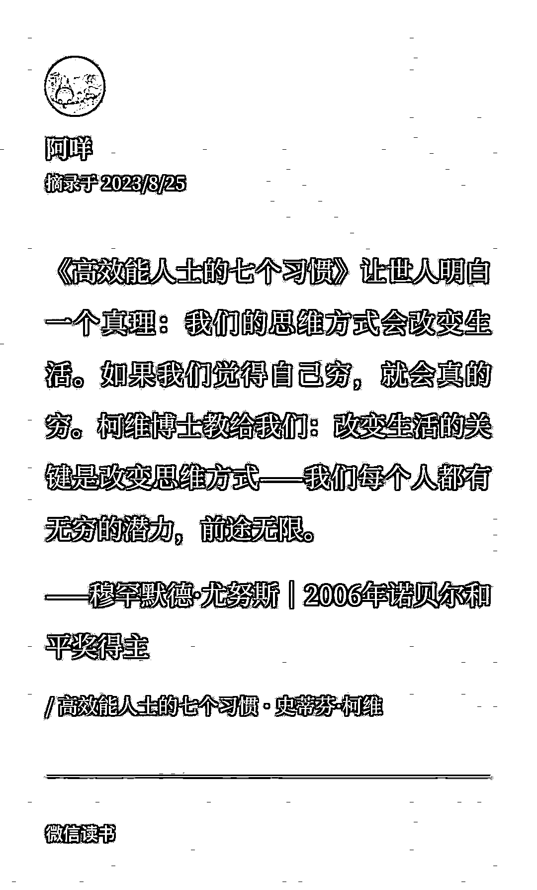
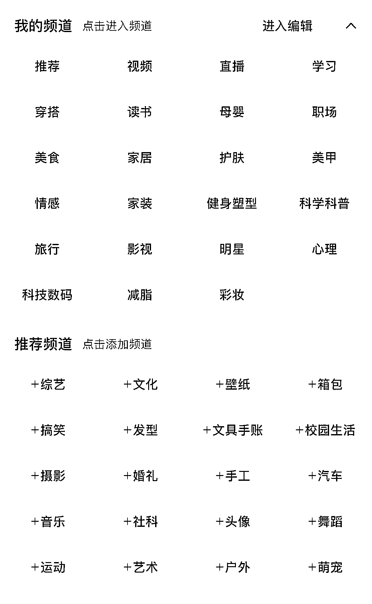
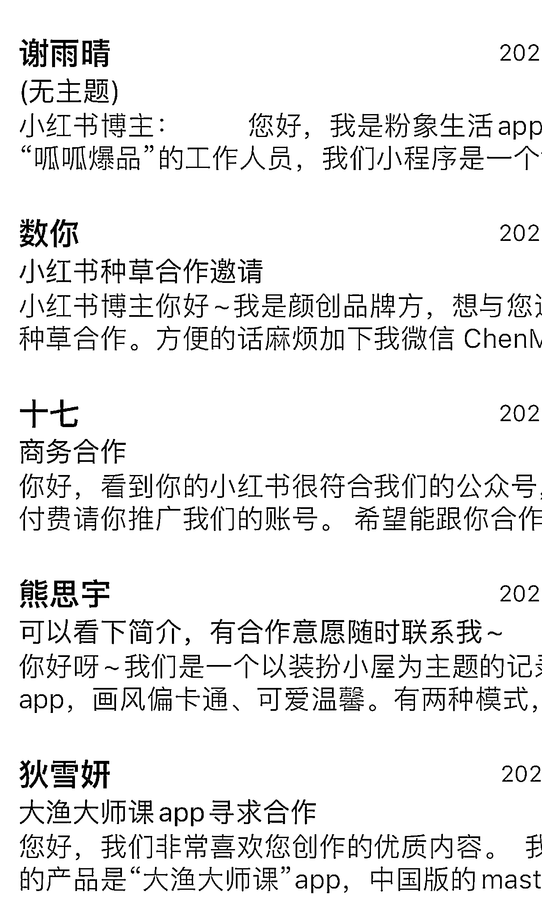
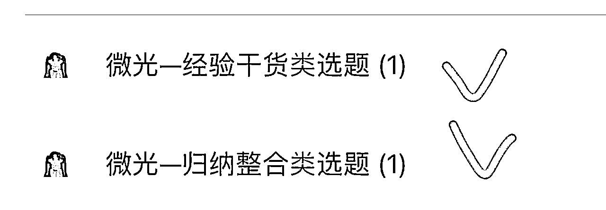
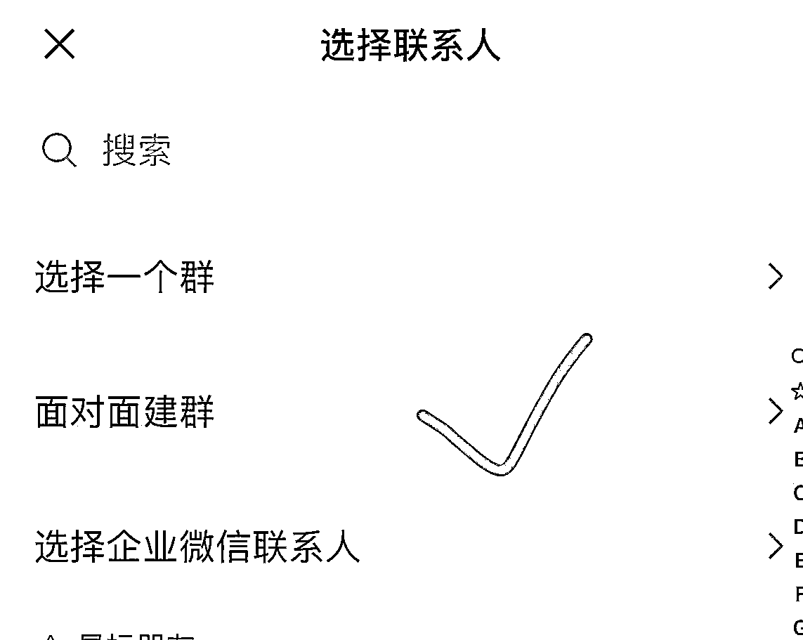

# 三级漏斗筛选出你的高价值 IP 定位

> 原文：[`www.yuque.com/for_lazy/thfiu8/nxwb9f0yy0vl5iyw`](https://www.yuque.com/for_lazy/thfiu8/nxwb9f0yy0vl5iyw)

## (80 赞)三级漏斗筛选出你的高价值 IP 定位

作者： 是微光吖

日期：2023-11-06

生财的小伙伴们大家晚上好呀，我是微光💗

主业负责心理咨询机构的运营，副业是一名优势解读咨询师&小红书 IP 变现导师。

很感谢生财给我这次机会成为小红书运营教练，也谢谢阿蓝邀请我在生财有术分享经验陪我耐心改稿。

之前会有一些不自信，自己是否可以担任小红书运营教练，但是感谢七七姑娘、老马合伙人们、vv 姐、苏姐、芷蓝姐、靠谱姐、文静姐、理白，他们有鼓励我，阿咩也发了一段话给我↓

回归正题，我是 19 年开始做学习资料引流的，22 年开始转型做 IP，学习了很多老师的方法，最终也总结了自己的一些方法论。

今天就从个人 IP 的角度上为大家提供一些定位与选题的思路✨

常说要做个人 IP，各位小伙伴们觉得什么是个人 IP 呢？

如果你是卖麻花的，你有自己的 IP 吗？

实际上并没有，因为那么多卖麻花的，有多少是因为你这个人，而不是突然想吃任意一根麻花来买的呢？

但是你是天津麻花的，这就属于特产了，这就是这根麻花的 IP

所以这个 IP 本身就是能吸粉的，并且具备差异化的
（插播一个冷知识：据说，在不是天津以外的地方出现卖天津麻花的都是拐卖人口的，因为天津人一般不离开天津。）

人们因为信任你的 IP，所以不仅会买麻花，很有可能还会买一些店里的其他零食小吃。

比如，粥左罗老师他卖 ChatGPT 课、卖书、卖任何产品都会有人去买，这个时候就形成了个人品牌。

就像追星的人，喜欢/信任这个明星，所以会去买一些周边。

有了 IP 就能变现吗？

不能，因为你没有运营起来

🔹个人 IP：凭什么是你？
🔹公/私域流量池：凭什么为你停留？
🔹产品矩阵：卖给用户什么？

当围绕以上三个环节运营起来，赚到第一桶金的时候，再对其中一个角进行突破放大，未来收益是很可观的。

当然如果你前期缺少产品的时候，可以依托平台进行分销变现。比如生财有术就是一个很好的选择，不管是口碑还是交付环节都是很成熟的了。

首先微光结合小马鱼老师的课程对个人 IP 理解就是：
个人 IP🟰在某个细分领域具有专业能力及独特价值观的影响力个体。
🔹细分领域：你不需要万能，死磕一个角，让别人想起这个领域就能想起你
🔹专业能力：用户愿意加的是能够给他提供价值的人，不是销售和客服
🔹有温度的独特价值观：用户喜欢的是一个有血有肉的人，有自己的性格、特点、爱好
🔹影响力个体：持续输出，不断积累里程碑事件，权威背书

其中个人 IP 从人的角度主要分为三个板块🔻
✔️个人定位：一句话抢占用户心智
✔️身份标签：在某个领域有很牛的背书
✔️故事标签：具有独特的价值观和人格魅力的证明

三者之间的关系是：
👉🏻「身份标签」为「个人 IP 定位」做背书
👉🏻「故事标签」是为了丰富「身份标签」的
👉🏻「身份标签」、「故事标签」都要紧贴「个人定位」

从个人定位的角度拓展内容🔻

📌what-我是谁？
✔️作用：明确你的人设定位
①行业：大类+细分
②你擅长什么？
③你是提供什么样的服务/产品

📌who-和谁说？
✔️作用：明确你的用户画像
①人群标签：
②地域：
③职业：
④年龄：

📌why-为什么说？
✔️作用：解决用户的需求，做他们想听的事
①你的目标用户遇到什么问题？
②一般采取什么手段
③为何没被解决？
④你提供的方案是？比别人好在哪里？

📌how-怎么说？
✔️作用：你的表达形式：口播、图文、视频、vlog、剧情.......

✅实际的定位还是要结合个人的实际，让别人通过一个“记忆点”就知道是谁，通过特定的场景、通过独特的后期特效、通过特有的身份属性 、通过话语。

比如“omg”、“集美们”，猜猜是谁

面面俱到是不可能的，对于普通来说就是从一个点入手，由点成线，最后连成面。

那这一点，肯定要找寻最高价值的 IP 定位

高价值定位=同等时间离钱最近+我擅长的（有相关资源/知识储备）+我热爱的

即“热爱”、“擅长”、“市场”的三圈交集之处就是你的高价值定位。

针对上面的内容，主要是想强调“定位”的重要性，毕竟定位是 1，其他都是后面的 0。

接下来，分享一个我自己常用的【三步筛选】定位思路，进一步明确自己要讲哪方面主题。

这种思路是先思考定位，再考虑变现方式的。

所以如果你本身就有很明确的方向了，或者有产品了，比如说知识 IP、买手、直播、探店、好物分享……等。可以仅供参考💗

首先，我们先以小红书平台为基本盘，把小红书的相关领域大类进行罗列：

🌱第一层漏斗
筛选出你擅长的内容，你有相关知识储备的、相关资源，能够做到持续输出

🌱第二层漏斗
筛选出离钱近的内容，好变现或者变现方式多样的。

🌱第三层漏斗
这个内容是你热爱的，你愿意为了这个领域持续深耕，并且你能有所成长、提升，是有价值的（可持续性）

‼️第三层是重点，这个内容要是你能持续输出的内容，避免无话可说

这里以我个人来举个例子🌰

👉🏻第一层筛选，我个人擅长的内容。
微光是有一项专业技能的，比较擅长优势解读，可以做知识、情感、职场领域

我有一只猫，可以入局宠物博主赛道

租房改造有经验，可以入局家居领域

对于数码产品有一些经验，可以入局科技数码领域

👉🏻第二层筛选，逐个分析上面 4 个领域的变现情况。
1.宠物博主赛道。
之前有考虑过，然后有接过一个猫砂的置换广告，但是我觉得给自己家猫咪接一些食用类的广告，如果接到是“毒猫粮”，不想以身犯险。
（从道德角度，即使能变现，我也不想接）

2.科技数码领域。
我之前做过一个 APP 分享类账号，需要推广的广告商非常多，所以是比较好变现的。

但是变现不多。200 粉报价在 20-50 之间。之前另外一个女性成长类账号 200 粉因为数据可观可以在 120-150 之间。

3.家居博主。
需要的前期投入太多，即使只考虑房子的整体形状+一些基础配置，也需要大几千甚至万元级的投入。对于之前没有多少收入的我来说，成本太高。

但变现可观，有小伙伴 1000 粉的时候接到了价值 5000 的沙发置换。

4.我的专业技能。
我通过优势解读咨询变现，目前一小时定价几百元。后期可以沉淀到私域的人，可以通过我的社群、小红书训练营、分销等形式变现。

通过上述分析，我选择做知识领域，通过分享干货知识吸引用户，转化到私域，提供优势咨询服务。

👉🏻第三层，筛选出自己感兴趣的细分品类。

分享干货知识，也有很多品类，情感、心理、职场、教育等等。我根据自己的爱好，选择了情感、教育领域，这个也是我比较喜欢的而且具有长期价值的方向。

提醒大家，建立 IP，一开始就一次到位几乎是不可能的。有些人甚至因为期待过高，一直停留在定位，迟迟无法开始。

我的经验是，得出初步答案就可以开始行动。行动中再不断复盘总结，会越来越了解自己擅长什么、喜欢什么，也更了解用户的需求，再不断优化、完善自我定位。

你将会慢慢呈现一个真实的、立体的、有温度的你。而非刻画出来的、扮演出来的虚假的人。
这样，做 IP 不是对你的消耗，而是促进你成长，你会越做越快乐，也才能长期持续做下去。

有些小伙伴可能会发现，在找到自己的垂直定位、自己赛道的垂直内容后，会发现笔记点赞、收藏很多，涨粉很少。

那说明，你需要去思考自己的技能交叉点了。

也就是，把垂直内容叠加其他技能，多维度竞争，才能超越别人。

就拿做读书博主举例。大多数读书博主的形式是：拍一张图书封面，分享书本内容，评价和摘抄。

你就可以尝试：

➼1.以读书博主的“外壳”，分享女性成长的内容

大家做人设的就可以分享自己的经历，自己的特殊技能，这样可以增加真实感，和吸引同频的人。

如果说读书的内容你觉得变现只有书籍置换，你可以延伸读书的一些好物➼阅读支架，阅读台灯，你想接什么广告，就增加什么内容的出镜率。

另外呢？

还可以分享一些读书方法，分享一些为人处事的道理。➼把鸡蛋不放在同一个篮子里。

比如，姗姗小镇➼女性成长+读书博主+Notion 做读书笔记。

2.做一个成长型思维的 app 分享博主

比如，这位博主：

他前期是在分享 app 合集，一次偶然的机会，他的摄影作品被大 V 转发到意大利网收录，从那以后，他就会在笔记中穿插一些相机的使用方法。

这也让他接到了索尼品牌的合作机会，结果现在慢慢转型成数码博主了。

哪怕你现在没有光鲜的 title，从现在开始真诚利他、热爱生活、善于思考、输出你学到的、记录你的成长、都在提升势能。

做一个养成型 ip，不是想清楚了再做，实践到一定程度才做。——从现在开始，无论是小红书、你的私域，都可以开始行动起来。

洞察自己与自己、自己与他人、自己与世界，这些都是个人 ip 最好的素材❤

20 年那会研究过淘宝电商，当时有一步是在标题中插入关键词。
做法有几个就是：
1⃣️“生意参谋”中查看搜索人气、以及在线商品数找相对蓝海的一个关键词
2⃣️手机端、pc 端查看下拉词
3⃣️“直通车”里面输入关键词，找寻高点击、低竞争的词
4⃣️百度网站查询搜索比较高的一些词
........
等

其实和现在做小红书是有一些相似的方式的。

🙌🏻注意：不要找冷门选题，数据要超过 1000 点赞的才会爆

我们常说“爆款都是重复的”，所以直接扒爆款选题的框架即可。

这里可以看到，有两个笔记的数据很不错，标题分别是：
1、自媒体必备‼️2023 混不下去和我一起做小红书
2、运营工具🔥 | 自动写文案神器，也太好用了吧
那我们就可以来学习一下这种标题格式。

🙌🏻注意：
✔︎选题需要是你亲身经历过的，有相关经验的，或者你同样有感触有共鸣的。
✔︎写出自己的内容，可以拆解文案框架，但是不要抄袭。
（如果不是自己经历的内容，很容易写着写着就被原作者框住了）

在找选题的过程中，我们也可以选择创建群聊的方式，来收集选题

具体步骤是：

这样你就得到一个初步的选题库👆🏻

然后可以再对选题内容进行整理，创建表格、进一步搭建自己的选题库。
注意：要选择 2000 赞以上、有爆款因子的选题

我们注册完小红书账号、设置好“门面”以后就要开始养号了。
可以每天阅读、点赞、收藏别人的笔记，模仿活跃用户的行为习惯。

‼️浏览的笔记需要超过 10s，不要一下子刷到底，慢慢的阅读+点赞+评论。

可以通过搜索关键词进行有选择性的刷，在刷的过程中每天关注 1-2 个你垂直领域的头部博主，这也是养号的一个小技巧。

这样子平台可以给你打上推荐标签，发现页也会是同类型的博主了➼所以这一步可以开始同时收集对标账号了。
（ps：养号过程中可以开个会员，增加权重哦💕）

关闭个性化推荐的目的：帮助大家丰富选题内容，看到不同的博主类型

💗从近期热点选题
热门影视剧、热门综艺：剧情、原著、演员经历、节目争议等
节日：特殊节日做应节选题
热点事件：根据事件找角度切入（新浪热搜、知乎热搜、百度热搜等）

💗从受众的角度写选题
你的群体标签——这个群体痛点在哪，情绪波动背后的痛点有哪些。

🌰举个例子：
宝妈—育儿难、自身价值不被认可
中年人—上有老、下有小
女生一一定要经济独立

虽然要戳痛点，但是痛点戳多了就麻木了！
所以我们转换思路⬇️

🌰以减肥的定位为例
我们定位以后要开始输出选题，那这些选题，我们初步可以想到的就是减肥食谱、减肥跟练计划、减肥方法等。这是根据我们自身认知想到的，还是有一些局限的，那我们可以怎么做呢？

💛用户的常用搜索词
除了我们常用搜索软件：灰豚、蝉小红....等，具体可以转到生财小红书航海的工具库，还可以从各个热榜榜单及百度指数里面进行查询，毕竟很多时候，这个内容在这个平台起来了，不久其他平台都会逐渐🔥起来。

💛用户的常买物品搜索词
小红书其实最开始就是想做一个分享生活方式、记录美好生活的平台，现阶段对买手的扶持力度也逐渐增加，而且人们日常生活也离不开消费，我们可以提前知晓这个产品用户的需求度是多少。
方式：电商平台榜单、百度指数、知识课程网站、微信

💛用户的相关关注点
评论区是很多人会忽视的一个地方，我们通过评论区也能知晓用户的一些潜在需求。
这个就可以用后羿采集器实现，采集评论区（虽然有些限制，但是够用）

我们之前都是思考用户想看什么，想了解什么
但是其实大家都有围观、看热闹的心
围观的人多了，评论的人多了，数据就起来了

比如天津 5A 级景点，跳水的 baibai～

所以流量的背后＝很多人关注

小红书现在其实也成了百度百科，我们遇到问题都会来这里搜索。
可以思考你一般会搜什么问题，把这个问题记录下来，进行多次提问就是你的选题

比如：“我要不要点外卖”
念头背后是犹豫——外卖太贵了，外卖不卫生，我又懒惰了……

但是优点？省时省力
那从优点延伸，什么样的人会点外卖？他是点一次，还是一直点？

结合优缺点，外卖周卡减脂餐的市场就来啦～

所以你偶尔闪现的那些戳中你，打动你，让你有表达欲的点。
都可以成为你得自媒体选题，成长你自媒体变现的一个突破口。

《山月记》中有这样一段话：
⥤我深怕自己本非美玉，顾而不敢加以刻苦琢磨，却又半信自己是块美玉，故不肯庸庸碌碌，与瓦砾为伍。于是我渐渐地脱离凡尘，疏远世人，结果便是一任愤懑与羞恨日益助长内心那怯弱的自尊心。

希望在努力奋斗的各位小伙伴都能找到自己喜欢的、热爱的和擅长的方向，并为之努力，渐渐发光✨

我的全部分享内容就结束了，感谢各位小伙伴们的倾听，如果对你们有帮助的话可以拍拍我，也希望收获大家的一些建议和反馈。

* * *

评论区：

挽心 : 学习到了
赵卿久 : 谢谢微光贴心细致的干货
理白 : 微光教练牛哇！
七七姑娘 : 微光宝好棒呀，感谢微光的分享
刘小 6 : 学到啦！
花猫（持续早起 100* : 写的真好！
阿浩 : 谢谢微光的分享～
小鹿 : 微光宝写的太详细了，收获满满！

* * *