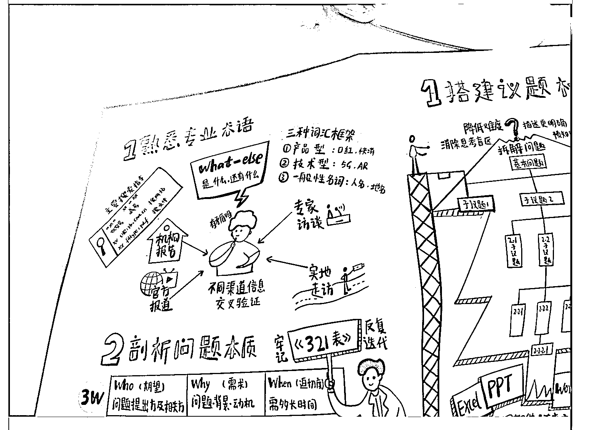
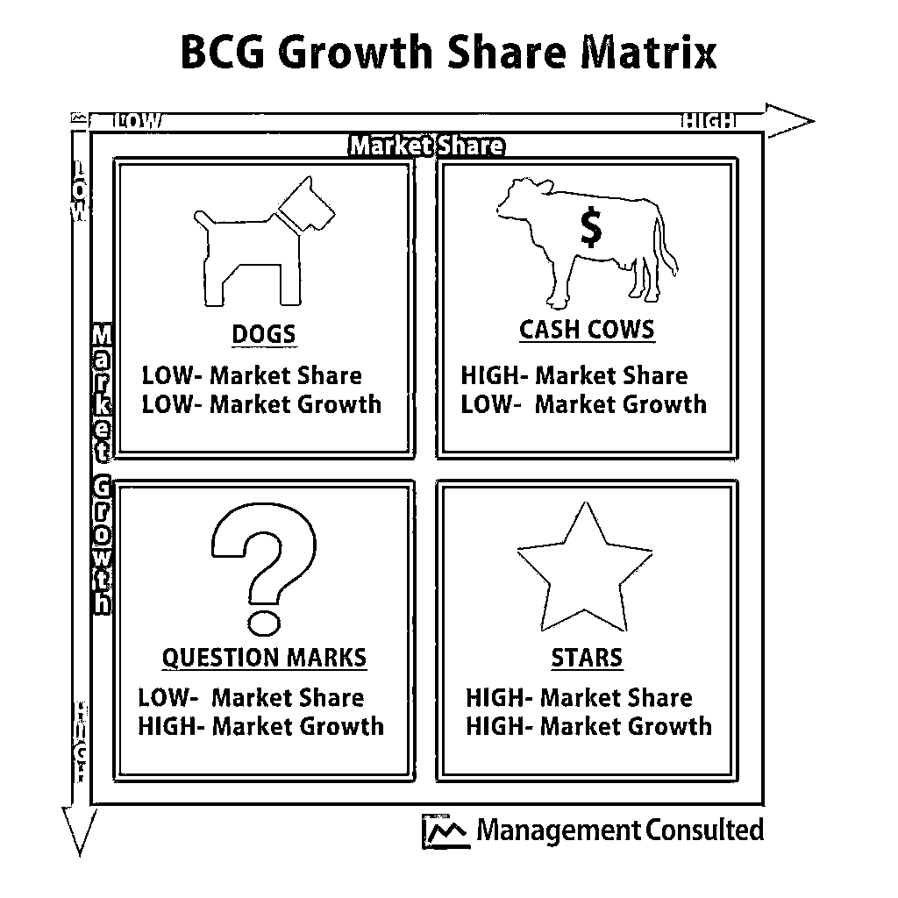
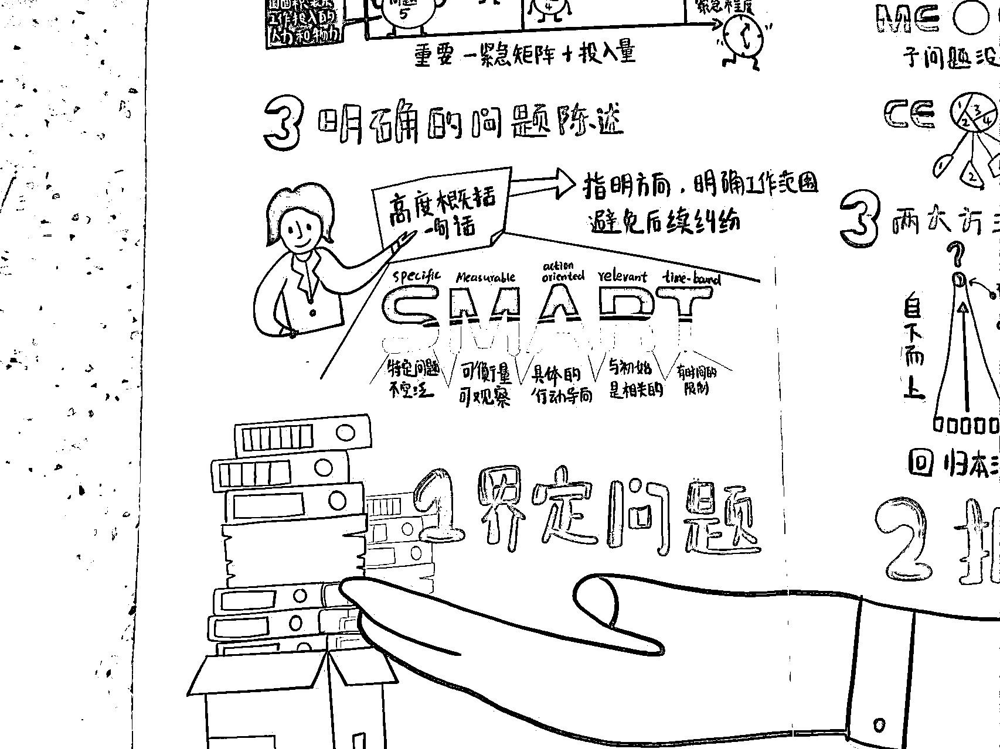
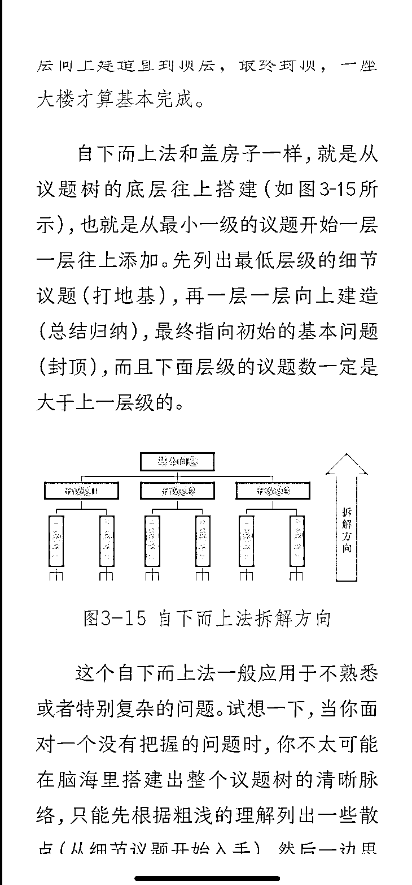
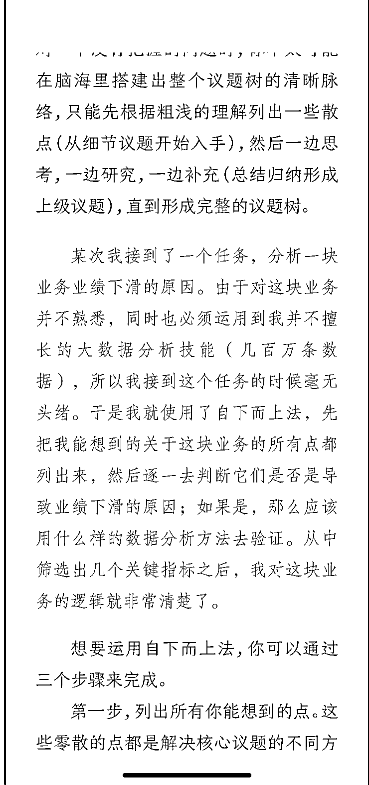
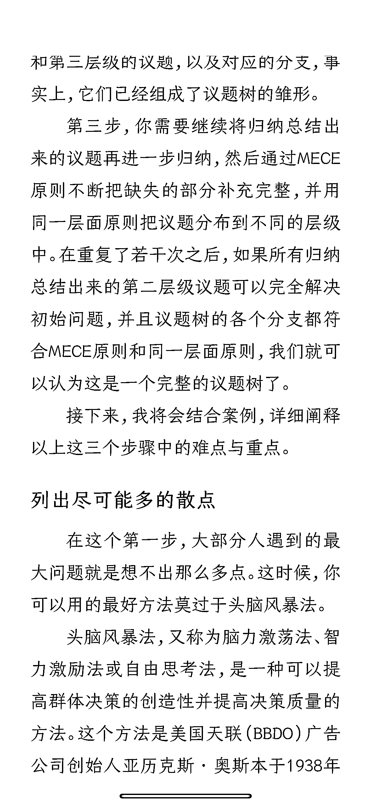
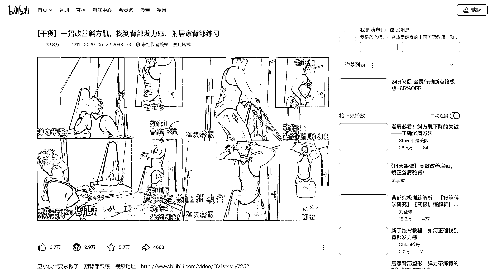
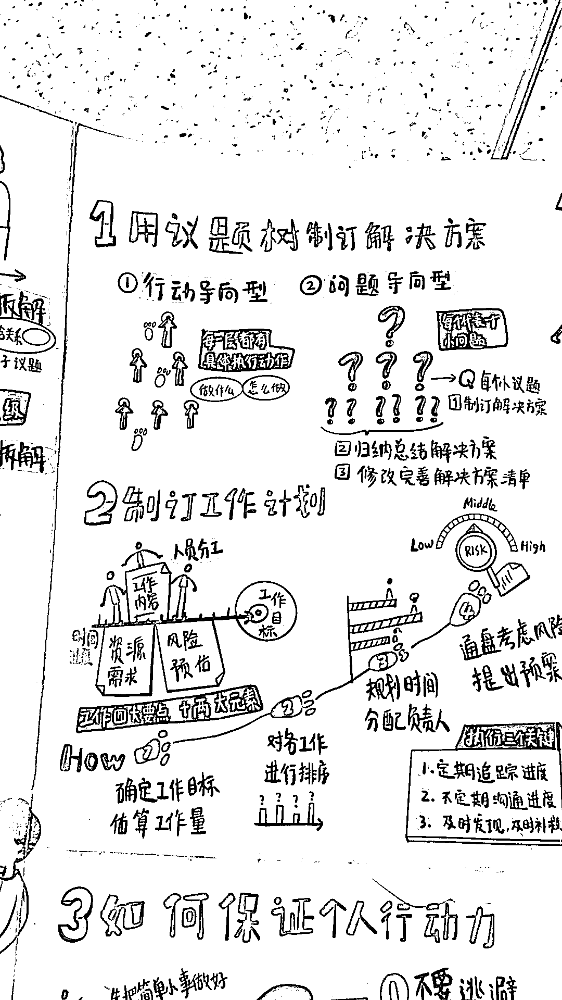
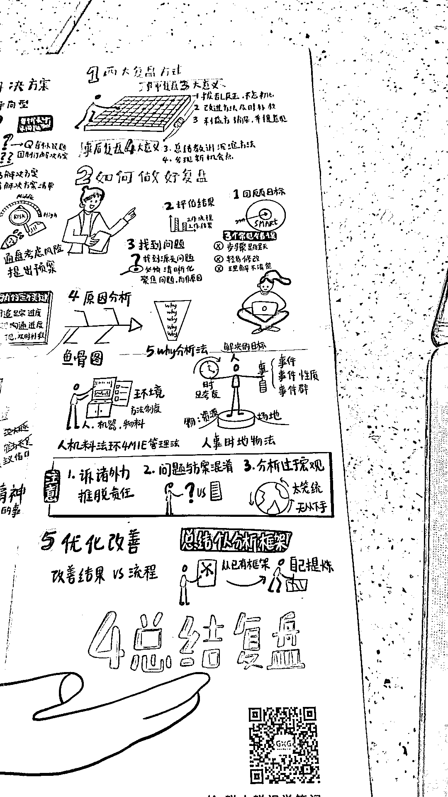

# 如何深度思考？咨询公司解决问题的四步通用解法

> 原文：[`www.yuque.com/for_lazy/thfiu8/cobf8bat9ygg9lg2`](https://www.yuque.com/for_lazy/thfiu8/cobf8bat9ygg9lg2)

## (20 赞)如何深度思考？咨询公司解决问题的四步通用解法

作者： 海程

日期：2023-11-10

Bello，这里是 Hyson 海程，之前写过 2 篇精华帖

[`t.zsxq.com/14EBbxHpE`](https://t.zsxq.com/14EBbxHpE)

https://t.zsxq.com/146Dyctux

今天用一个半路出家的咨询顾问的身份来写这个故事

如果你对咨询或者商业模型感兴趣，你有很大概率听过这些名词，**SMART，假说驱动，SWOT，BCG 矩阵，MECE**

在你听过这些名词以后，是不是有一种感觉，听了很多新名词，并不知道怎么用，甚至像邯郸学步一样，把自己之前做事的方法都搞得有点不会了

我就遇到了这个问题，作为一个半路出家，后面做了很多年创业公司的前咨询顾问，东西会一半最可怕，我时常被各种不同的模型，名词困扰，东西太多无法很好兼容

而我是习惯于把事情公式化的人，我的战斗力之源是充分的简化"A= B+C+D，D 其实是 E 的一种特解，1<B<3，C ≠ 0"

模糊不清的名词，搞不清楚究竟是什么意思，哪些其实是一样的，哪些有应用场景的限制，哪些有先后顺序的话，这些名词、知识对我反而是负累

我在十一前尝试解决这个问题时，偶尔想到了朋友写的一本书《掌控工作》，先试看了电子版，一般睡觉的我，一般十点睡的我凌晨爬起来看

我买了纸质书，十一看了四遍，我看这本书第二遍的反应是”愤怒”，因为这本书是 2019 年 11 月出版的，我在将近出版了四年以后才看到这本书

[`book.douban.com/subject/35040710//`](https://book.douban.com/subject/35040710)

我十月二日和文翰（写这本书的朋友，我们曾在 2015 年在一个咨询项目上共事）聊了两个小时，十月六日干脆飞了一趟上海喝酒聊到凌晨，我和他聊的话题是：他在《掌控工作》这本书里讲的是，咨询方法论更加抽象以后解决问题的通解

这个话题不可能这么空对空的聊，我和他是代入了一个「肩颈不舒服」这种相对生活化、切身相关的案例，去聊怎么产出解决问题的通解，在下文我会用 问题树 Issue Tree 指代

以下所有的内容，你可以当做我和他的聊天纪要，你如果手头有一本纸质书，同时有一个你切身困扰的问题，阅读效果会更好

因为外资咨询公司习惯于用英语表述，所以下文有很多名词是用英语，还请大家谅解，我尽可能会在新的名词出现时先标注他中文大概的意思

文翰的这本书是有四个大章节：**界定问题 / 拆解问题 / 执行解决 / 总结复盘**

这四个大章节里又有很多小章节，书是非常贴心的配了一张地图的，所以就聊到一个小章节，我就可以放一张照片，让你们知道我在讲的是哪里：比如第一个大章节叫界定问题，我会用「界定问题-熟悉专业术语」、「界定问题-剖析问题本质」来帮助知道我们聊到了哪里

**ROUND 1.1 ：界定问题 - 熟悉专业术语**

、

我在这里问的问题就是，假设"肩颈不舒服"这个 case 本身我已经很熟悉了，我是不是能跳过"熟悉专业术语"这一步

答案是的，他在后面还衍生，如果在日常生活里，如果我遇到一些 case，就拿排队买奶茶把，如果今天排的队很长，我可以跳过所有的 issue tree 直接到复盘

**ROUND 1.2 ：界定问题 - 剖析问题本质**

然后我在聊"剖析本质"，我提出了一个我卡住的问题：在应用👆的表格，我就会出现填格子，硬凑字数的感觉（其实我在应用很多模版时 都会有一种填框框的感觉）

原书是上面的截图👆

我当时拆解出来是上面的表格👆

就比如我拆解时  我就会被卡在「WHEN」，我真的一定要 9 月 30 日解决完么，十一甚至都解决不完也不会死吧

他给到我一个重要反馈是，他认为这本书的读者是在上班的朋友，不是给老板的，这个表格是员工跟老板理解工作意图的工具

如果我自己本身就理解自己的意图，就不一定需要自己给自己整这么一出

我们理清了 Standard 和 Scope 的差别，Scope ≈ 手段，Standard 更像是一系列手段达成结果，设置哪些指标考核

同时我也理了一下，我们对 Risk 的定义：无论是执行目标超出预期时间，还是达成了目标，产生了新的意， 都算做 Risk

我给到了他这个场景：项目调研已经做到尾声，甚至项目已经开始实操，发现天坑，比如最近在一个理论上 ROI 很好的项目做到一半，在放量前夜，我突然意识到这个生意存在一定的政策性风险，之前怎么想也想不到

他的回答是管不了

我觉得在学习咨询方法论乃至任何的理论模型，需要一个预期，**反反复复，乃至上线大雷都是很常见的，而不是设想有任何一个工具你掌握了以后，就可以在真空中非常丝滑的运行**

然后我们就转向「 重要紧急+投入量」的分析矩阵，这个问题聊出来的结果是真的远超我预期的深度

我一开始提出的问题是 「分析重要紧急+投入量」的应用场景是其中哪一个

1）对同时有多个问题 + 先做哪个项目、后做哪个的问题的分析

2）对一个问题里子问题先分析哪个后分析哪个？

答案是 1

这里文翰还是给我一个提示，这本书的读者是在上班的朋友，不是给老板的

我认为「分析重要紧急+投入量」这个概念，解决了我 ROI 和 优先级划分的大问题，因为我之前用 ROI 是不和四象限兼容的，相当于是没有"时间是否紧急"这个概念

而且文翰把 重要 和 产出 的概念关联在一起，这样其实就把 ROI 投产比 和 重要关联起来了，而在书里，他给的理解往往是 业务需求方/ 老板是否觉得重要，所以这样能把 ROI 和实际工作串在了一起

接下来说的东西就有意思了 ，因为我为了更深度理解「分析重要紧急+投入量」，给到他一组我实际面对的案例，因为我很不擅长去拆解其中的重要/紧急

业务 1：我们和政府银行关系不错，所以我们可以进行无风险规模化套利，我每一个季度会投入一些时间去维护政府银行以及合作伙伴的关系；因为这个业务已经进入了很明显的下行通道，投入的时间是固定的

当然也不能不维护，不维护可能会有天坑，所以我就会疑惑，像这种每个季度要维护，有点按部就班意思的算不算紧急

业务 2：我们能够从银行获得规模化低成本资金，这件事因为央行放水，体量预期会更大，我们现在在建设更大规模的基建，不过前端没有能承载这个资金体量的项目，这样导致我无法判断在新的套利项目出现之前，是否重要

业务 3：可转债是一个我在试探的业务，替代业务 1，我们实操下来预估保守利润在 15%，如果择时做的好，在 30%，是很适合承受规模化低成本资金的项目

最大的优点是傻瓜式操作，一周就能把 80%的内容学完；因为重要紧急+投入量 的模型是没有不确定变量，我怕我入场时这个行业转眼不行，有点像 2021 年的港股打新，所以我不能很好判断

业务 4：我最近在学习技术分析缠论，这个业务的利润因为涉及到行情是无法估算的，差的话亏所有本金，好的话一年 20 倍，我技术还不够熟练，所以导致我现在没法大体量的投入，就完全不赚钱；

不过从我另外一块看，缠论给我交付了两个很难被钱直接计算的点，下图是我在今年 5 月梳理的目标，导致我实际上 7-9 月大部分时间都燃烧在缠论上

业务 5：我生意上有一个兄长教我怎么识别需求，创造一个新的现金流生意，因为我很明显的能感知到，创造一个月净利润>50 万稳定的现金流，能大幅度优化的我生活体验

因为我的财务体制是资产和现金流严格隔离，所以我资产再多和我日常生活没有半毛钱关系

而这个生意在非常非常早期，我无法评估实际到手的收入和投入的时间，只能估算是一个大收益，大投入的项目

文翰是逐个给我非常精细的反馈

1）做一个思想实验，我应该设想，假如我有一个 3000 人的公司，这个业务应不应该做

然后我就秒意识到，如果这样我应该用 BCG 矩阵分析才对啊（BCG 矩阵用当前体量 和  增长速度 两个维度，把业务切成了

-明星：大体量+高增长

-奶牛：大体量+低增长

-问题业务：小体量+高增长

-瘦狗业务：小体量+低增长

所以这个业务 1 是一个典型的奶牛业务

2）在业务 1 里能看到更加关键的问题是，文翰认为我没有很好把作为公司 CEO 和作为员工的我切开

如果对于公司层面来说，这个业务属于典型的重要不紧急，所以要做的其实只有「安排一个员工约客户」+「到时间，员工去维护客户关系」

对于员工的我来说，这个业务就属于出差那天，我的重要紧急任务

所以某种程度上，我需要把我的角色分成两个人，一个人是承担 CEO 角色，一个人是承担迅速突击的 COO 角色

3）文翰对业务 2 的反馈，他用的表述"成长性业务"比"问题业务"更加正面，他认为这种任务设计考评指标不是纯的财务驱动，而是考核两个点

-模式有没有跑通

-预估体量能够做多大

4）他追加了一个考评点，要考评作为 CEO 的我的绩效应该考评：

-奶牛或者明星业务是否增长

-增长型有没有跑出来模式

5）他认为业务 3 和业务 2 一样，也是一个成长性业务

6）他认为业务 4 也是一个典型的成长性业务，他认为我还需要把一个充满好奇心的个人的我，和作为公司员工，公司 CEO 的我分开

比如他认为我以上的需求👆是很典型的个人需求，这纯粹是我的好奇心在驱动，而并非一个公司实际商业需求

7）他认为业务 5 也是一个典型的成长性业务，这里需要注意的是，这是一个公司业务

**ROUND 1.3 ：界定问题 - 清晰的问题陈述**

在聊完「重要紧急+投入量」的模型以后，我们就进入到用 SMART 实现清晰的问题陈述的环节

我觉得这本书很有价值的是，很多人会听过各种各样的类似 SMART /PDCA，90%朋友们对这些概念的理解，应用场景是错的

我当时举了技术分析，我设置目标没法 SMART 的案例，他给的反馈是，这个生意本身就没法 SMART

因为这个阶段只能分阶段定目标

1）能不能做 + 能不能学会

2）能赚到目标中的钱

现在是第一阶段

然后我还讨论了另一个问题，我在 SMART 里设置指标时，很容易卡在为什么今年利润设置多少，1000 万，3000 万还是多少？

我身边因为喜欢身心灵的朋友多，经常就有朋友问我，"你为什么要定这个指标，追求内心幸福不好么?"

我知道他们的想法对我不合适，我又不知道怎么反驳，我就很容易宕机

他给我的反馈是，可以把人生的使命愿景看的更加清楚

我自己其实能感受到我的人格，有一波人格是特别落地有冲劲的，有一波是非常抽象 有灵气的

现在的问题是，特别落地有冲劲过于落地，有灵气的过于抽象，而在落地和抽象之间作为链接的战略，两边都没有粘，所以就会出现链接不良

他对量化的观点很有意思，能量化量化，不能量化就不量化，而我大部分时间是能量化就尽可能量化

然后有一个小补充，企业战略目标到量化级别一般 5-10 年，只有使命愿景周期会更长（这里他是针对我一个细节，因为我的业务指标是根据财务指标拆解出来的，我的财务指标是假设我活到 120 岁往回拆，未来 10 年时是锁的相对精确的）

最后在界定问题这个环节，我又补刀了一个我常常遇到的问题：假如已经到了后面"拆解问题环节"，突然意识到整个目标就不对，那是不是就要开始魔改

比如我在熟练 Issue Tree 时，还用了"如何减肥"做案例，我一开始界定的问题也是"怎么通过控制体重+锻炼吧体重从 83 公斤降低到 75 公斤

后来我越拆越不对，**不应该以减重为目标，而应该是降低体脂为目标**

他给我反馈在我意料之中：这种情况在工作中有，魔改也并不是没有过，当然也不能总有 ，毕竟大家是靠这个吃饭的，再不能天天翻车了以后魔改

**ROUND 2.1：拆解问题-搭建议题树 Issue Tree**

然后我和文翰就开始讨论"拆解问题"，拆解问题大章节是分成「搭建议题树 Issue Tree」、「议题两大原则」、「两大方法搭建议题树」三个小章节，这块属于咨询公司最宝贝的方法论了，无论是 issue tree 还是假说驱动 hypo-driven 、金字塔原理都是在这个环节

我第一个问题是关于 Issue Tree 的，我在对「肩颈不舒服」这个 case 不熟悉的时候，其实我是拆不出太多假说 Hypo，也 MECE 不动的

他给我的反馈就是 确实如此 Hypo-Driven 其实是更适合我熟悉的业务提出假设，当然也不是说不行，假如把我关在一房子里两个月，我也能对着镜子把所有的肌肉一块一块试出来 只不过效率比较低下而已

第二个问题也涉及到我无止境的好奇心，因为我日常思考东西发散性还是很强的，所以我在看「肩颈不舒服」这个话题时，也会很自然的延伸到「减肥」、「腹部减肥」、「双下巴」这些

这是为什么第一步界定问题要限制「Scope」，否则解决问题就会无限的延伸

第三个问题 我觉得还蛮代表性的，我在拆 Issue Tree 时，其实会想到想到了很多小小的 Todo，比如减肥想到立马买一个体脂秤，或者整理一个文档

我是应该立马清理，还是等整个 issue tree 拆解到计划时 ，再做清理？文翰给的回复是 立马清理；

有一个在和文翰聊天之前，我自行解决的问题，我认为可能对你们很有帮助，如果你对一件事不那么熟悉的东西，更推荐你使用 Bottom Up 的方法来写

之所以提及这点事因为主流的咨询方法论，都是倾向于让你 Top Down 的拆解，还有叠上 Hypo Driven ，这样对新手非常不友好

**ROUND 2.3：拆解问题-两大方法搭建议题树**

接下来到了「两大方法搭建议题树」这个章节，我和文翰的对话跳过了「议题两大原则」

我当时的问题是在做 Issue tree 的过程中，比如到了圆肩这个子议题，我发现我如果不去 B 站上搜索资料，我是根本拆解不下去，更别提列出假设 Hypothesis 假设了，所以文翰再次强调 Hypo-Driven 适合我对熟悉的业务提出假设

我提出的下一个问题是「肩颈不舒服」在拆解问题这个环节在 B 站上逛一圈，就会看到显而易见的解决方案

而这是我在咨询公司上班时最没搞懂的 ，如果 Issue tree 能帮我看到一个显而易见的解决方案，那就不用再拆解问题自己折磨自己咯？

答案就是这样的，所以就延伸到「执行解决」这个章节的开头，在「肩颈不舒服」是一个典型的「行动导向」的 Issue tree

而在拆解问题这个环节，我有一个限制我写 Issue Tree 的点：是否一定要像咨询公司。写成一个一个封闭的句子/短句/词语的问题在哪里

文翰告诉我"你开心就好"

我也能观察到，我容易被限制的点：我如果不能很好的知道一件事的 WHY，是很容易书上说啥，我就真的硬做，虽然做的时候会有不舒服

所以我尽可能要大量实操＋问好老师，高强度的训练，不断解决膈应的点，不断抽取出真正实用的部分，变成公式

这也是文翰一直在跟我沟通的点，他认为每一个模型的应用，抽取中间对他有帮助的地方，而不是硬套

在「拆解问题」的最后一个环节，我还提出了一个困扰我多年的问题：我经常听"战略咨询因为拆的过于精细，过于框架化，所以会失去一些 think of box 的创意"

因为文翰刚好是在战略咨询和互联网甲方战略都干过的，所以我会很感兴趣他的看法，他给的看法还挺伤人+新颖，他认为

1）大部分的创意是廉价的，业务逻辑是大多数场景下成立的关键

2）要么靠逻辑，要么靠试错，创意试错试错了就死掉了，当然活下来的人想怎么 bb 那是他的事，我要做的是算概率

然后我们进入到第三个大章节「执行解决」

**ROUND 3.1 执行解决 - 用议题树制定解决方案**

我问出的第一个问题是：以「肩颈不舒适」为例，我很明显的发现和我预期不一样

我大部分时候脑补按照咨询方法论拆完，假设时间是 100，那应该是「界定问题」分走 20，「拆解问题」分走 30 ，「执行解决」分走 40，「总结复盘」分走 10

实际我做「肩颈不舒适」，「界定问题」分走 20，「拆解问题」分走 70 ，「执行解决」分走 5，「总结复盘」分走 5

在「执行解决」这个环节，我一开始的预期是抽着刀准备打开门和终极大 boss 大干一场，结果出来是一只毛茸茸的小狗

"就这？？？"是我最明显的感受

文翰给我的反馈是，因为「肩颈不舒适」是一个简单的 Case，所以其实我在拆解问题时把分析工作做了一大半，所以到最后其实就是一个「行动导向型」的 Issue Tree

第二个问题其实我也就能自问自答了，是不是一个简单的 Case，解决方案很简单的，就可以直接跳过「制订工作计划」这个步骤

所以我们就直接跳过了「制定工作计划」和「如何保证个人行动力」这两个小章节，进入到第四个章节，总结复盘

**ROUND 4：总结复盘**

我老婆认为我横向项目管理做的不好：每周每天都是非常努力的突击，不过长期的项目时间线远远超出预期

我和文翰复盘了好几个翻大车的项目，分析着分析着，一开始我以为要激动人心的战胜一个很大很大的 Boss，拆着拆着就是一个毛茸茸的小狗狗

比如项目 A 看下来就是 选择了一个风险相对大的方案 能改的地方就是 提前做一个预案+设置一个止损线

比如项目 B 看下来就是 人选错了 导致整个进度是低于预期的

比如项目 C 就是 Timing 没有把握好，出现了无法防范的系统性风险

然后又补充了一个困扰我很久的问题，我自问自答了，我之前以为 Issue Tree 和 PDCA 的差别很大，其实我拆解下来，他们是一件事

我又补枪了一个我老是遇到的问题，假设一个目标设置以后，打下来发现没有意义，如果要归因是哪里做错了要归因谁

我想起来一部德剧《我们的父辈》，中间男主角在库尔斯克会战里接到一个夺取电报站的任务，结果整个排付出基本团灭的代价，夺下来的电报站是空的

文翰给我的反馈，他认为这个锅要到复盘上找，如果是系统性风险就应该躺平，如果不是，我们聊的问题就回到了「战略是什么」这个经典话题

**ROUND 5：什么是战略**

战略你上网去搜，不同人说的东西完全不同，而且极其抽象

文翰给战略的定义： 短中长期目标+ 实现目标的手段 ，对我还挺受用的

我想知道他对以下四个对战略的常见解释的反馈：

1）战略的意义是用来建立竞争优势

2）战略的是用更少的资源 更多的收益

3）战略不仅仅是达成目标，而是建立一个新的机制

4）战略是决策

我们聚焦在了 1 这个解释，聊开了，我们就意识到，因为我过往经常在狭小的利基市场而且往往有技术/政治资源优势，所以我并不算很擅长竞争场景，我最近一次高强度的思考竞争还是打德扑

关于 234 解释，文翰跳脱出来，他认为我亟需解决的是：

1）对于人性 商业 规律等等等的底层思考和框架嵌套起来，我对底层思考相对散不成体系，对框架的思考不拘泥表面扣定义，而是要更大规模带入数据去训练，在实操中不断思考 WHY

2）他建议是我把自己从小事儿解放出来，适当放权，需要思考一些形而上的事儿，比如怎么让公司运行的更好  比如新的战略怎么做

总结一下，《掌控工作》我非常建议大家去看，尤其是对 MECE，Issue Tree 的论述，是我觉得我看过的书里细节度最高的，然后我认为我聊下来三个重要的补充点是：

1）**所有步骤都是可以跳的**，无论是熟悉专业术语，还是制定工作计划，不要被理论框柱

2）Hypo-driven 在熟悉某件事的前提下应用更顺，**不需要强行套用**

3）Issue Tree 拆出一些小的 Todo，是可以直接执行的，不用等到最后

* * *

评论区：

暂无评论

* * *