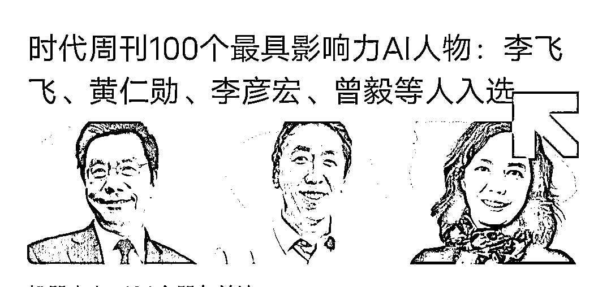
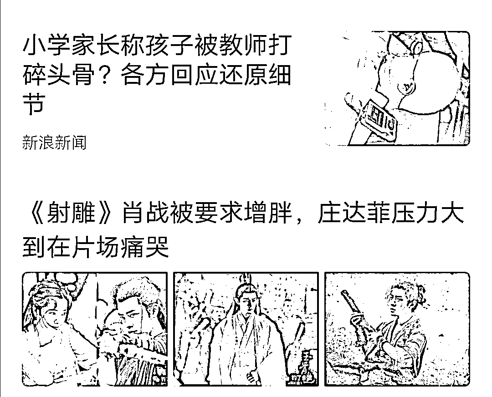
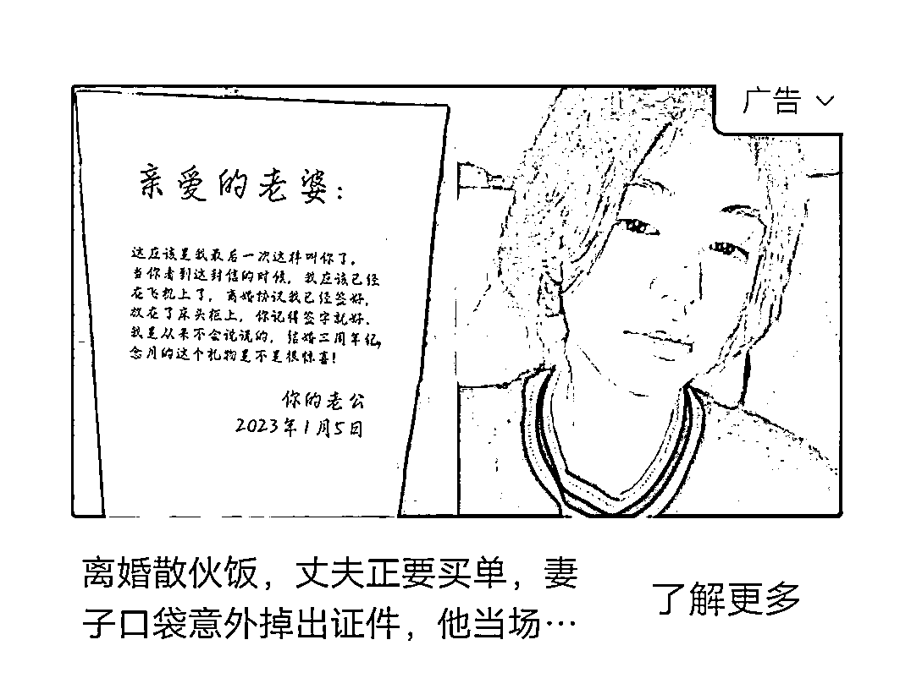
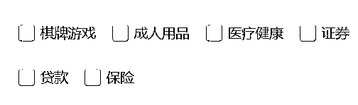
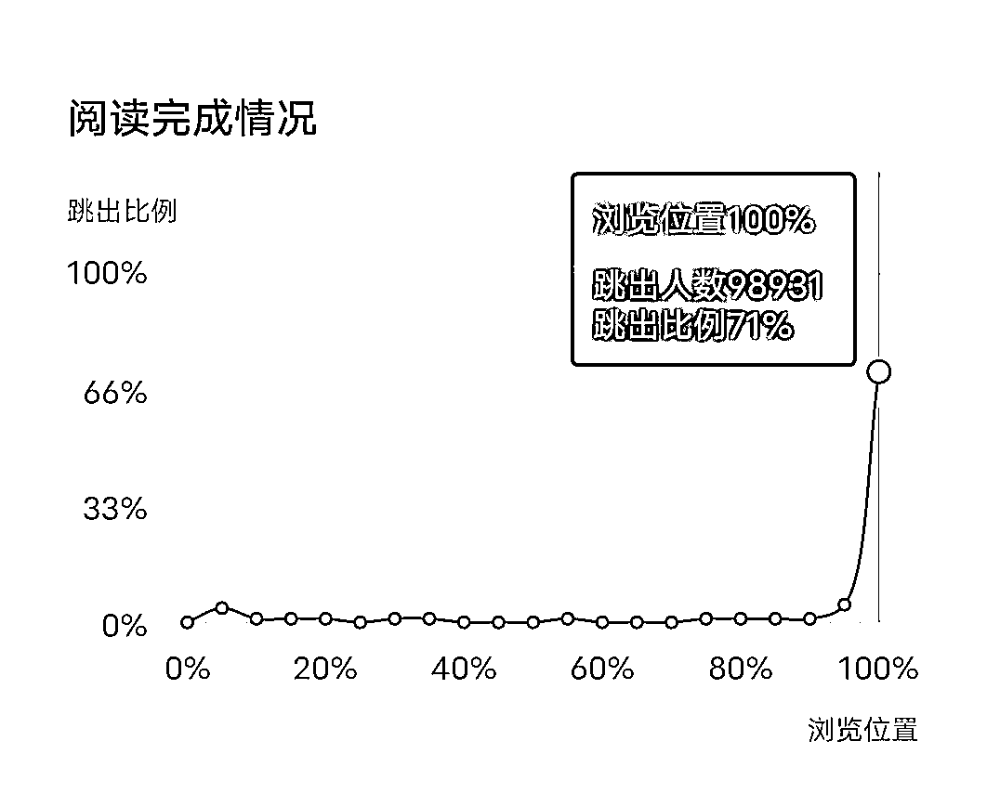

# 如何提高 eCPM？这里每一个动作，都是钱

> 原文：[`www.yuque.com/for_lazy/thfiu8/opm74yk2zc3ulhas`](https://www.yuque.com/for_lazy/thfiu8/opm74yk2zc3ulhas)

## (63 赞)如何提高 eCPM？这里每一个动作，都是钱

作者： 亦小亮

日期：2023-11-08

讲这个 eCPM 之前，我们从宏观角度来说说：一个人每天只有 24 小时，没有 25 个小时，你做了这个事情，想必其他事情就没有多少时间了，比如你一天只有 5 个小时看手机，你刷了 3 个小时的抖音，你就只有 2 个小时刷视频号或者快手，所以这是商家之间的竞争。

商家想长期留住读者用户的唯一办法就是留住创造优质内容的创作者，优质创作者想长期留下来的最大原因，就是收益和荣誉，看看逃离 B 站的创作者就知道了。

现在我们在讲讲微观角度，你刷了他（创作者）的文章/视频 5 分钟，刷其他文章的时间就减少了。

没错，说了这么多废话，就是为了铺垫：从商家到创作者都是在争夺用户的注意力。
争夺过来注意力，还想着把你的驻留时间拉长，最后希望你买单。
没错，花了我的时间还要花我的钱。
下面要讲的内容都是围绕这个点展开讲的。

1、标题，标题起好，收入少不了
首先标题的作用，大家要牢记在心里，我想很多人，其实心里都明白，我这里再次强调一下。
（1）吸引注意，提供有用信息
（2）筛选听众，标题可以为你的内容筛选出合适的观众、剔除不属于潜在顾客的读者。
标题在不同展示情况下的情况：
订阅号列表里，多篇的情况下 28 个字
看一看，单篇是 36 字。

这里强调的是，一定要在有限的字数里，把读者的好奇心拉满。

2、封面
（1）设定的封面
重要性不言而喻
（2）文章配图
文章配图很关键，入池的情况下，微信会挑出来三张图展示，每一个读者会看到你的标题和三张图。

有时候虽然进池了，但是点击量不一样，你可以观察一下，你的这篇文章，一秒或者十秒会增加多少点击量，所以，这个对于点击量很关键，最终你会到达多少级别，几万、10 万、20 万。

文章配图跟封面的作用不一样，配图要求一般能吸引人就好，相对封面弱一些。

3、标签
你的长尾效应是否能突破 10 万+、50 万+、100 万+，就看这些标签能不能助你一臂之力了！
关于标签：
（1）虽然平台设定最多是 5 个，但是不要超过 5 个，原则上 3 个最好了，因为一些标签本身阅读量就少。
（2）文章内容必须与标签吻合！
（3）用哪个标签的时候，先去看看，这个标签热度还在没，这个标签下文章有多少，文章的阅读量有多大，看看这些阅读量大的文章发布时间。
比如，你搜一个最近热播电视剧：莲花楼，它标签下面就有不少爆款文章，你搜成毅，下面文章比莲花楼的多，但是爆款的少。所以，你给标签先给谁一目了然了，当然也可以两个都标上。

既要读者读完，也要有一定阅读时间。
1、排版
关于字数多少，字大小，行距多少等等，这个是根据你的目标人群来设定的，比如老年人群，可以 17 号字，行距 2 或者 1.75，还有一些文章字数不多，可以全部局中。
这个就不多讲了。

2、内容
这里讲一下心流，看文章时候，内心波动。
（1）文章内容适当穿插几个金句，读者会有一些动作，右手指会慢慢在这句话滑动，然后屏幕会出现几个字，复制粘贴等字样，然后用户会保存到，然后回来接着看。
比如这句话：
只有你眼眸曾见过你昨夜的梦，而时长我们都忘记了昨夜的梦，是因为我们一起床，看不到自己的眼眸。
名句加一些装饰，比如黑体，大一号，字体颜色，背景色，下划线等等。
（2）信息增点，就是读者不知道的点
求知欲会使人有复制和保存习惯。

这样下来，读到文章末尾，发现需要复制的内容有点多，干脆收藏吧。当然收藏以后大概率不会看，这个不要紧，这个就看你和他的缘分，下次他记起来的时候，回来也会看你其他内容。
这个方法比单纯说，这篇文章对你有用就收藏一下吧，或者关注一下俺吧，都有用的多。

3、互动方式
（1）投票：设置投票，增加留存时间
我有一篇文章，投票设置了，你最不喜欢的明星星是哪一位？
当时没有想到🈶2000 人参与投票。

这个可以用在名言警句或者鸡汤文里，效果是仁者见仁智者见智。

这里的点击量是指读者点击广告的次数，很多人也会发完文章自己点，其实一次两次还好，时间长了，微信发现作弊，就会断流的。
关于点击量是根据目标人群而选择广告产品：
标题是第一次锁定目标人群，内容是第二次确定人群。
比如这类广告挺适合一些言情小说目标人群的。

那么文章里的广告是第三次的潜在客户，我一般会根据文章目标人群，筛选广告，我目前涉及的领域有娱乐、旅游、热点，所以会把金融类淘汰掉，会多尝试家电家居，毕竟是日常产品嘛，发现大家还是会点开这些多一点，当然单价高的产品也会影响 ecpm，比如前段时间的扫地机器人。

当然，有时候一些品类的广告预算不多，有时候你排不上的话，你可以少排除几类。

以上三点做到了，别急，我们要有理有据，看看后台这篇文章的数据。

这里指的是向内分析，分析自己的文章，至于别人的文章这里先不讲。
很多人问我，什么时候发最好，其实什么时候发，是要看阅读你文章的人大多数什么时候活跃，这时候就要分析粉丝特征了。

（1）粉丝特征
性别比例：你的内容主要吸引男性，还是女性。
年龄分布：是年轻粉丝多，还是年长粉丝多，调整你的输出内容。
活跃时间：去了解关注你的粉丝的活跃时间，调整发文时间！
地域分布：了解粉丝地域分布，调整追热点的姿势！
终端分布：粉丝使用的安卓系统还是苹果系统（这个目前来看作用不大）。
数据列表：粉丝每日新增、取关的数据情况（可以看到粉丝都是通过那一篇文章关注你的）。
总之，分析好了，确定什么人喜欢你的内容，分析你的爆款文章的数据，因为它最值钱，可以借助这些数据，一爆再爆。
（2）推荐量
每篇文章推荐来源

推荐：入池了，自己可以观察一下，你进的是大池还是小池，怎么观察了，盯着后台，看十秒或者二十秒是多少阅读量，一般十秒有几百以上说明是大池。
搜一搜：说明你的关键词还行，或者踩到热点。
其他是指，小女子教练告诉我的。
除了标明之外的，都是其他了，分享、自定义菜单、自动回复、文章中内链点击、会话(包括推送、预览、手动回复)
好友转发(包括转发到好友、转发到群)
朋友圈(包括转发到朋友圈、发链接到朋友圈)
历史图文(包括关注后查看、未关注查看)
在微信里搜索到的“相关文章”等

（3）文章阅读数据
这里有一个跳出比例，就是读者阅读文章阅读到什么地方，突然不读了，查找一下具体是哪一个段落，下次精进一下。

（4）其它数据
以上三个最关键，其它就没什么了。
最后我们回到 eCPM:
eCPM：广告千次曝光收益。他不是指单纯的曝光 1000 次的收益。具体是指 1000 次曝光里，有多少人点击产生的收益，才叫千次曝光收益。
具体怎么算，这个也是未解之谜，但是 eCPM 值是综合广告价值，并非曝光量和点击量就可以提升，这个是肯定的。
有很多地方是这样讲的，目前来看不一定对：

总之，不要让微信抛弃你，你一定要成为优质的创作者，才会一直在池里。

* * *

评论区：

暂无评论

* * *