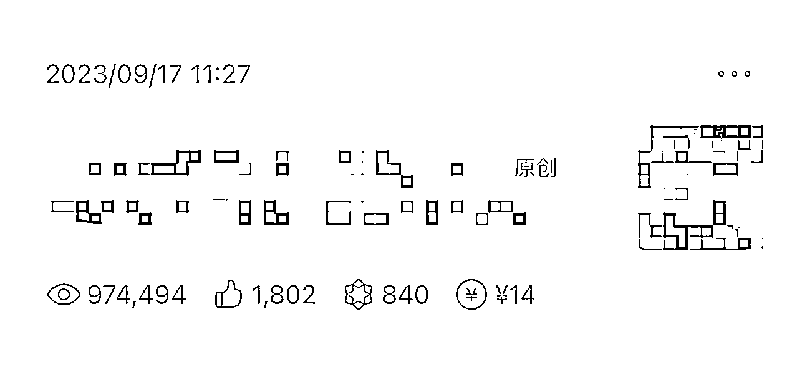

# 我公众号写了 10 个领域，摸索出来推荐算法每天躺着赚 500+

> 原文：[`www.yuque.com/for_lazy/thfiu8/fr07ka2nwb2xwic1`](https://www.yuque.com/for_lazy/thfiu8/fr07ka2nwb2xwic1)

## (26 赞)我公众号写了 10 个领域，摸索出来推荐算法每天躺着赚 500+

作者： 月林

日期：2023-11-10

2016 年～2019 年左右,微信公众号的文章传播仅靠已关注用户的订阅推送。这让头部大 V 们文章容易产生病毒式传播,而小号很难获得新用户。为什么许多创作者转而使用抖音快手等视频平台？

这就是一个典型的“弱肉强食”的例子。因为这个原因，许多创作者就开始转移到其他更容易吸引到观众的平台上。

我运营过 10 多个不同领域的公众号,对推荐算法有一些心得体会。推荐机制是平台的心脏，但它的算法细节通常是保密的。所以只能通过不断尝试，使用多个账号进行测试，才能摸索出一些规律。文章里面的部分收益图是我这 2 个月成绩。

点击链接，即可打开新世界的大门 👉

[`wwg5hrbzkj4.feishu.cn/docx/Zywld2HB0oJdAmxaN9Scz14HnJc`](https://wwg5hrbzkj4.feishu.cn/docx/Zywld2HB0oJdAmxaN9Scz14HnJc)

* * *

评论区：

一半 : 看完想问一下，所以公众号的推荐算法是啥[发呆]
不够勇敢. : 就是，我也没看懂
一两素粉 : 作者说了，原创好文章
灯火煌煌 : 内容不够干[呲牙]

* * *