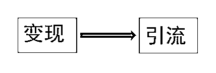
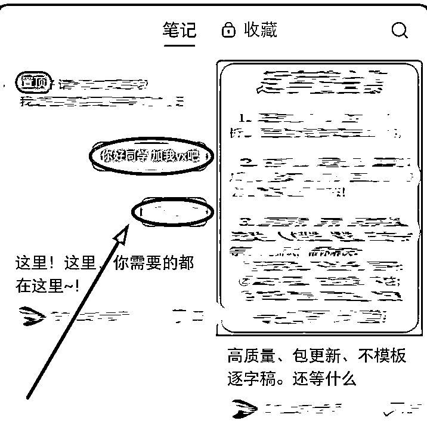

# 小红书的变现逻辑和 8 个引流细节

> 原文：[`www.yuque.com/for_lazy/thfiu8/xw8g2wazhk1yz1uy`](https://www.yuque.com/for_lazy/thfiu8/xw8g2wazhk1yz1uy)

## (42 赞)小红书的变现逻辑和 8 个引流细节

作者： 哆啦

日期：2023-11-10

大家好，我是哆啦，一个体制内打工人，副业主要做公考面试培训，知识付费赛道，平均每天花费 3-4 小时，在小红书变现 50W 左右。

项目的逻辑很简单，在小红书以面试真题解析为钩子，引流到微信实现面试私教和小班课的成交。总结一下就是：知道自己卖什么产品、让别人知道自己的产品好。

今天我会和大家从这两个角度分享

从引流到变现基本是我一个人完成的，逻辑是：发面试真题解析→引流到微信成交面试私教、小班课。

今天从我做的知识付费领域，分享两个主题，一个是变现方向，一个是引流方向。

很多圈友可能觉得生财航海手册内容太多，看起来很费劲，感觉什么都得了解，什么都得知道，要学的东西太多了，崩溃啊！

其实有时候呢，招数也不需要太多，只要解决「主要问题」就够了，有很多东西是不需要我们过多关注的。

从 0 到 1 的底层逻辑是什么呢？
我认为就是这两个：一个是确定卖什么产品，一个是让别人知道你卖的这个产品好。

卖什么产品≈变现
让别人知道你卖≈引流

先说说「变现」：

怎么变现？简单来说，就是一个人（粉丝）买，一个人（你）卖。

很多圈友在对标账号的时候很容易有一个误区，就是只顾着模仿对标笔记的内容，而忽略了变现的环节。

举个例子来说，如果在线下开实体店，我们是先考虑选址、客流，还是考虑卖什么产品？

肯定是先思考卖什么吧，有了产品后，我们才会考虑店开在哪里、哪里人群多、怎么装修、怎么布局，这样才顺理成章。

这个逻辑就是，要先确定自己变现的产品，然后「反推」出怎么引流这个产品，这个逻辑才是顺畅的。

拿我做的考公举例，在不同阶段都有很多可以变现的产品（服务）：

①卖资料
如果正在考公，手头会有很多资料，这个时候就可以把整理好的「资料」作为产品去卖。
（这个就类似于做资料号，资料可以去某多、某宝、某盘等搜集）

②卖自己的笔记
如果学到一定阶段，肯定有自己的心得，有自己整理的知识点等等，这个时候就可以把「自己的笔记」作为产品。

③知识付费
如果考编上岸了，就有上岸的经验，可以做一对一、私教课、小班课等等。

其实其他领域也是一样，在每个阶段我们都可以找到变现的产品（服务），不需要变成大牛后才能变现。

所以，变现方向就是，找到比自己「认知低」的人群！，只要有优质内容输出，总会有需求的人来买单，我们需要做的是：「向下兼容」。

如果从 0 到 1，不用考虑太多，先找一个自己看的上眼的赛道，「行动」起来，慢慢摸索变现的逻辑，别的赛道经验也是相通的。

如果不知道能做什么项目，我个人更推荐从自己的经历出发，因为自己的经历才是我们熟悉、擅长的领域。
比如，我从事的是机关工作，不做面试培训，我还可以做公文写作、笔试、职场经验、调动、人际处理等等，因为这些是我身边时时刻刻在做的，从这些内容做起，更容易拿到结果。

有的圈友可能认为先得有很多粉丝后，才能变现，其实是个误区。

我在知乎、小红书的变现基本都是从低粉开始的，说说我在小红书的第一次变现。

一开始我发一些面试真题，发完后有粉丝在评论区咨询面试题目答案，我就在评论区回答这道题的思路以及答案，之后呢，粉丝又私信问我关于面试的一些问题，我也帮忙解答了，之后问了我面试课的价格，感觉合适，就自然而然成交了。

这个时候，我发笔记发了才四五天，粉丝数是几十个，成交价格好像是一两千左右。所以，我们只要输出一些干货（在笔记里、在评论里、或者私信都可以），让别人觉得你/产品/服务是有东西的，就会找到你，就有机会成交。

【变现知识点】

①不要过多迷恋工具
很多圈友会看什么蓝海、红海，用这个那个工具，去分析哪个行业可以做，会浪费很多时间在想和思考上。所谓的蓝海红海，只是上限的高低，不会影响从 0 到 1 的跑通。

②正反馈要快
这个非常重要！
有的小伙伴设想的很多，比如，到了几千粉丝再去接广告，或者有了粉丝后再去录个什么课，我都不怎么推荐。因为我们要做正反馈快的事情，正反馈慢、变现慢会导致自己坚持不下去，先不说能不能变现，很多在涨粉这个环节就卡住了。

③ 不要过多关注数据
可以看数据，但不要过度追求数据！
我在小红书遇到一个 20 万粉的博主，她说一个月变现只有 1000 左右，为什么？因为她只关于怎么发笔记，没有挖掘自己的变现方式。所以，不是粉丝数高，就一定能变现，花了很多精力做起来的账号却变不了现，是没用的！

变现其实就是一买一卖，好比要卖西瓜（变现产品），且质量不错（引流吸引），只要别人有买西瓜的需求，看到你发的内容，不管对方关注不关注你，都有成交的趋势。

④粉丝和变现方向要一致
以我做的公考方向来说，有很多细分的赛道：公考：报考、选岗、督学、真题打卡、笔试、面试等等，我是做面试的，我就不能发的太杂，要保持内容垂直，只发面试相关笔记，这样引流的人群和变现人群才是一致的。

小红书平台对导流打击很严，引流方法也是不断变化的，有可能这周能用，下周就不能用了。除了小红书运营航海手册的方法，以下是几个引流需要注意的点：

很多小伙伴用到的方法，就是直接在图片上打字：这样太直白了，把平台当傻子呢？
我们要加一些线（直线、曲线）、各种背景、也可以手写等各种方法，去干扰系统识别文字。
我是这么判断这张图是否「合格」的：传到微信上，点击图片文字识别，看看是否能识别出敏感词来。（注意不是直接拍电脑屏幕，是识别图片本身）
总之呢，就是让系统识别不出文字，但是肉眼能看出来。
下图只是举例怎么防系统识别，方式还有很多，大家可自行挖掘。

频繁发送同一张图片，是很容易被系统识别的，所以，图片引流起码要准备 10 到 20 张图片，要「循环」着发，这个很重要，切记！

这是一个很小的细节，实际上就是减轻粉丝加我们的难度，把微信改成短的拼音微信号，最好是一眼就能记住的，别搞成乱七八糟的字母和数字。以下两个微信号更好，相信大家一眼就能看出来：

评论区@小号多了，是容易被屏蔽的，也有圈友反应评论区、弹幕、笔记里@小号 会判定导流。大家在发评论的时候，要换个号看自己评论区的留言是否能正常显示，这个方法很简单，但是很多人却没有去做。

方法：小号改成和大号相同头像，名字起***小助手（小助理），不要用大号在评论区@小号，而是直接用小号在评论区留言，对系统来说，这就是一个正常粉丝在评论。

在群里发同一张图片次数太多，也可能会判导流的，而且有圈友也被判站外导流。
注意：尽量不要频繁在群里发同一张引流图片，也要从准备的 10 到 20 张图片循环着发，可以设置「群主确认后入群」，一天批量通过入群申请后，发一次引流图片就 OK 了。

这是我的某个同行用小号发笔记用的图，很直白吧？我不论大号、小号，碰到这条笔记就点举报，然而小红书呢？根本不管啊！说明小号发微信号的存活率是非常高的。

可以大号收藏这条笔记，可以把这条笔记发给咨询的粉丝，可以评论区引导，都可以触达这条引流笔记的。

有的时候引流不要太硬，不用非得@小号，可以用软的方式。
比如，下面就是有人发笔记求推荐面试老师，在评论区进行引流的话术。如果有人问咨询，就直接用图片的方式甩给他微信号。

有的赛道天生就是废号玩法，特别是平台限制的行业（比如情感），号是消耗品，用多个号去引流，号费了？没关系，注销、刷机，继续引流。不过，有的赛道号就得学会保号了，像我做的知识付费，引流就不能太猛，先活下去才有机会。

我的一个同行，他每天在群里用图片引流，还有小号发留微信笔记，我看到就举报。如果举报了，平台判定违规，那我们就不用这种方式去引流。如果不判定违规，那就可以直接照搬他的引流方法，模仿他的发图频率，发图形式和内容等等。

大多数问题的答案，都在同行那里。
我很少用数据分析工具，我都是直接刷同行的笔记，一直刷刷刷！

举例来说，假如要做小学英语，那就在小红书搜“小学英语”，关注粉丝数高的博主，直到满屏都是这个赛道的笔记，一天刷几个小时，用不了几天，怎么发文，发什么，怎么变现，就能慢慢搞明白。

如果不知道自己的赛道怎么变现，用「小号」去同行那里去打探，私信他们，看他们的话术、看他们的微信朋友圈发什么、卖什么产品（服务），短时间就能明白他们的变现方法。
如果小红书没有合适的对标，也可以去抖音等其他平台，看他们挂什么课（带什么货），也能找到可变现的方向。
如果做一个很小众的考证的赛道，如果找不到同行，可以看看其他考证的引流及变现方法，区别都不大的。

不会做封面？找同行
不会引流？找同行
不会变现？找同行

有的圈友会觉得，我也对标了爆款账号啊，我也对标了同行啊，为什么我的号就起不来了呢？这里要反问自己，对标的细节都做到位了吗，模仿都做到位了吗？就好比模仿周杰伦唱歌，都是模仿，效果却是千差万别，所以呢，要多「悟」，多「想」。

很多问题换个场景、换个环境，其实答案都是不同的。

比如，小红书有些违规笔记我是不删的。因为即使有违规，也关系不大，我的笔记是发面试题目解析的，粉丝看了其他笔记后，也会顺着看我这篇笔记。

比如，做小红书我是几乎不主动私信别人的。因为我做的是知识付费，主动私信就成了推销，成交率会很低。

所以，每个赛道的细节玩法都不太一样的，他人的建议、航海手册里的方法的解答，只能作为参考，不要照搬，要思考一些这些方法适合不适合自己的行业、赛道、笔记。

总之，不管是做小红书还是其他赛道，多发内容，多去测试，就能慢慢找到适合自己的变现逻辑，围绕这个逻辑去跑，有了问题去生财搜搜解决方法，去看看同行怎么做的，大部分问题都可以解决的。

好了，我的分享到此结束了，希望能给大家带来帮助~

* * *

评论区：

Adela : 我想请教一下，我自己使用的手机因为引流被小红书判定违反规则封号 3 次，后来在用这个手机登录其他的账号的时候也被封了，意思是该设备有风险，用这个设备登录的账号会被封。我想请教一下这种情况怎样处理？需要刷机吗？
潇晨 : 同体制，能留个联系方式吗
zhAzha : 机器码被记录了，可以换主板[呲牙]。但是我有个疑惑，多买个二手手机很贵吗老哥？
雨烟 : 现在小红书倒流到微信很严格。容易违规。怎么破？
哆啦 : 开聚光

* * *