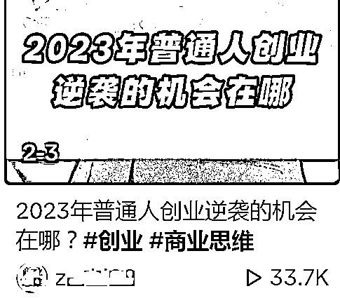
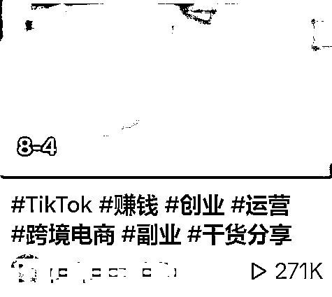
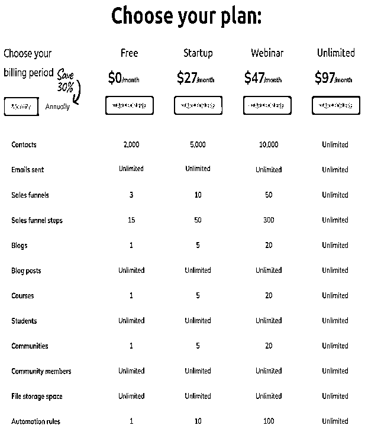
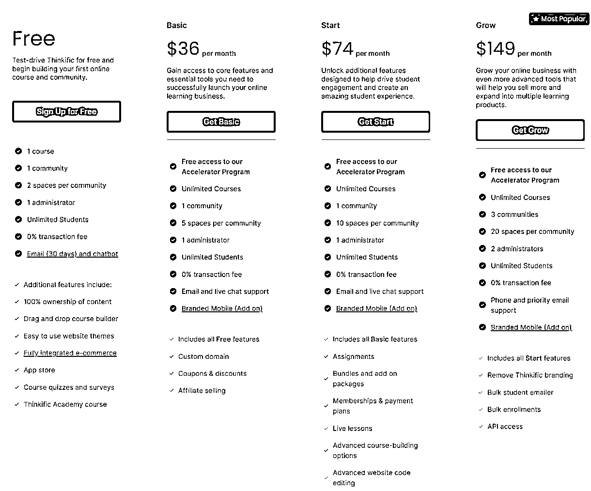
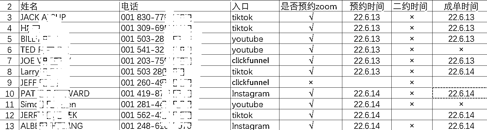
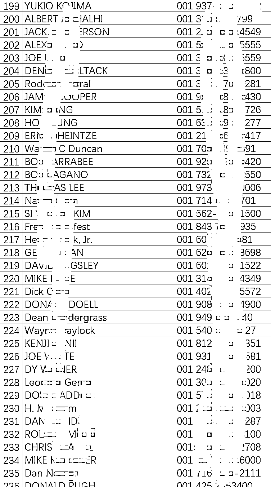
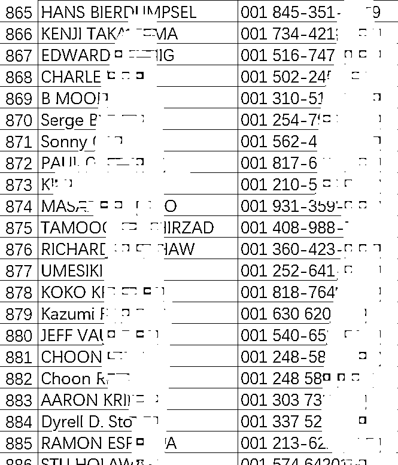

# 教老外打造 IP，5 人团队年入千万实操分享

> 原文：[`www.yuque.com/for_lazy/thfiu8/hymfe5axq28rgy8x`](https://www.yuque.com/for_lazy/thfiu8/hymfe5axq28rgy8x)

## (精华帖)(279 赞)教老外打造 IP，5 人团队年入千万实操分享

作者： 欧佑铭 931

日期：2023-11-09

国内知识付费已经卷到不行了，但国外就不一样了，只要你会抓住**信息差、认知差、执行力、风口，比在国内做更容易出圈。**

像我现在教老外运营 **TikTok、**打造个人 IP，在国内根本赚不到大钱。而在国外我每个人收 4999 美金，交付形式就是课程 +1v1 咨询沟通+训练营，从去年到上个月已经累计有 268 个客户了，5 人团队做到了年入千万。

下面，我也来和大家分享我和团队全程出海遇到的各种坑和实操，在没违反集团保密协议以及透露数据情况下，尽可能告诉大家每个步骤，以及各种 APP 的选择，给想出海的朋友一些避坑经验，再如何实现年入千万。

大家好，我是欧佑铭，我是生财的新人，文笔不好，各位大佬圈友高抬贵手，说的不对的地方请大喷，哈哈哈哈我脸皮厚！

废话不多说，今天我会整体的思考，产品，团队配置，整体的运维，后端转换，各种载体平台的优劣进行阐述，坐稳开船～

# 一、项目创始人发心和定位

我个人，前 3 家 MCN 机构主理人，13 年的创业经验和 8 年企业咨询经验，看过太多起起落落。

我经常和别人说一句话，要选赛道，不要选项目。举个栗子～我们纵观抖音项目来说：

从中视频计划，CPS 短剧，好物分享等等，这些都属于是项目，项目不分好坏，但商业有周期，还有有很大的不稳定性，还要看操盘的公司，比如 CPS 短剧盘王小猪优版不是爆雷了，创始人拿了 1000 万亿跑了。

之前就有人来咨询过我能不能搞，我就回了一句，商业的逻辑不对，波比不对，就看击鼓传花谁倒霉了。

所以太多人选择项目了，没考虑到自己的基本盘以及未来的规划。

**（1）发心**

**那么我为什么选择出海？**

1、我创业期间是针对进出口贸易的，出过很多国家，所以对国外人文其实不说很了解，但是从每个国家的老板反馈，也会比大多数人了解的多，所以核心在于汇率！

举个栗子：我同样在抖音以课程+训练营陪拍方式方式进行售卖 4999-6999，我需要做哪些动作？

开播，短视频不断更，引流，转换，逼单等等

但同样的动作，我在汇率比中国高的，比如欧美南美北欧等等，按 USD 算，我卖一单等于国内外要成交 7 个，但是我是相同的时间精力成本！

2、国内过于卷，拼服务、拼价格、拼包装、拼黑同行……

3、有个点很糟心，并不是每个人都有那么强大的心理承受能力，大家看各种网红情绪崩塌就知道了，强如女王 COCO 都抑郁，李佳琦直播直接翻车，关于李佳琦我短视频有个专门从 2 个维度阐述了为什么翻车，个人拙见。

所以我做出海，因为各国人，不同语言，有句话叫～眼不见为净，哈哈哈哈

4、出海更容易出圈，因为国外是资本主义社会，富人可以为所欲为，穷人可以毫无人权，所以相比我们伟大的国家，我们国家真的太伟大了！

在出海短视频我们可以赤裸裸的谈钱，谈穷人和富人的差距，别人认为这是事实，而不是国内很多玻璃心说你在制造焦虑，虽然我们就是利用了焦虑这个情绪点～哈哈哈哈

5、我坚信一个法则，要做难而正确的事情，“难”出海有壁垒，魔法上网可以 PASS 大部分人。如果没有这个壁垒，那么 tiktok 现在又会被国内搞抖音项目的弄的一塌糊涂。

第二就是“正确”这世界的 4 个赚钱法则：

1.  赚信息差的钱

2.  赚认知差的钱

3.  赚执行力的钱

4.  赚核心竞争力+风口的钱

6、老外天生表达欲爆棚，这是一个 IP 基础。他们没有严重的容貌焦虑，镜头恐惧等等，所以这个是他们天然优势！

那么我教别人 tiktok 运营，**属于信息差+认知差+执行力+风口。**

怎么理解，国内知识卷到不行，我借（chao）鉴（xi）下，洗稿下直接发，这就是信息差。

那么认知差呢，是国内很多商业模式早都 6.0 版本了，国外像完美如新美乐家那种 2.0 版本还依然风生水起，这就是认知差。

执行力说白了就是矩阵更新，风口，还用解释吗，再元宇宙或者脑外界还没彻底成熟时候，短视频是绝对的风口期，这么说大家理解吧？

所以出海的知识付费，就是这个我对项目的理解。

**（2）定位**

**此项目**就是出海知识付费，内容核心是成功学+各种降维打击

**项目用户核心：**教老外或者海外的华人在 tK 上打造 IP

**地域目标：**聚集英美德法新加坡加拿大和澳洲，汇率比我们低得一率不干

**用户画像：**有钱人，企业家，高管，有基本盘的，没自己兴趣或者没一技之长，我们直接 PASS。项目要走的稳，那么不是谁都要，因为互联网咋了口碑是一件非常麻烦的事儿

**运营形式：**一句话来概括就是借鉴了国内这个全媒体运营的打法，教他们海外全媒体进行运营。

比如 x，fc，yb，ig，还有 threads 等，做公域做全域引流，承接用 whats 还有 line，虽然 line 日韩居多，但看有些人习惯，社交软件要下，你可以不用，但不能没有。

以上定位和底层逻辑说了比较多构建大家的认知，接下来是实操开始

# 二、项目实操

**1、硬件：**

（个人）准备 1 台苹果 7-8 手机即可。

如果是团队，看运营情况，最好每个人 5-10，不需要太好，毕竟工作机，500 左右解决，大家可以选择京东自营～有很多选择，或者别去当地的二手机，最好是附近的维修点购买会相对而言好很多

**2、魔法上网：**

这个我不准备教学，因为 100%有踩缝纫机的危险，大家自行度娘～

**3、软件必备：**

通过了魔法上网，准备好 Outlook 邮箱或者 G 邮箱，最理想是 Gmail，因为全平台都可以用，outlook 也非常好，因为不会限制注册

**4、tiktok 的养号问题：**

我这边几十个机子做了实操，发现其实不养号真的可以直接发，也别被那些节点人所忽悠要什么纯净 IP 等等，有个稳定的机场就够了。

机房，私宅，机场我全试过，说白了，号这个东西很玄学。

但是大家要记住，tiktok 不像抖音注册麻烦，号发现不行 0 播放或者<100 的播放，直接换号即可，别浪费太多的时间，如果初始有 200-1000，说明是个正常号，就可以用了。

**5、内容层面：**

就是你的内容，我是做知识付费的，很多人说做带货的，看大家的定位和方向，一定把对标给找到，我直接用国内抖音那些大佬的切（ban）片（Yun）。

举个栗子，现在很多大佬都有切片，别发主号上的，把他们那些操盘手的视频进行就好了咳……等没流量吸了粉，把视频下了～

或者在那种视频别放任何钩子，有流量了跟上自己录制的

**6、多平台运营：**

以上的 tiktok，如果你有精力就注册 WeChat，youtube，telegram，linkedln，threads，X，Facebook，这道理和我们发视频 B 站抖音快手视频号小红书一起发一个道理，哪个平台流量爆了往死里搞和引流，这是媒体平台。

**7、私域平台：**

注册 line，WeChat，whats，私域的承接我们也遇到过很多问题。

whats 大家相信都知道，在今年 23 年 5-7 月，疯狂的封控，因为电诈问题，我们不出意外也封了很多，因为都用 talktone 还有 X 虚拟网，后面我们就采取一个方式就避免了，都买实体卡，手机卡我们测了好几个。

比如 Tmobile，LYCA，还有 att，simple 等等最终我们用 ultra ，月租 3 元～具体大家可以根据自己的喜爱去测就好～

用这个手机卡后，一机一卡稳定的要死，注册各种海外 APP，畅通无阻，当然手机要刷机格机，设定成当地鸡～走地鸡～

具体设置大家可以自行百度，因为在海外那批人，是不存在格机刷机问题～

**8、支付问题：**

跨境不完成回款一切都是假的，当然对海外他们当地问题并不是非常严重，中国管理超级严，大家都知道我们国内每个人的购汇限额一人 5W，所以用常规 PayPal 回来，很大程度上会被封，钱不会没。

但会一直冻结在那边，要知道 PayPal 是老美人在把控，他们特别不想钱流到中国，我们中国试过非常多方案。比如，万里汇，ocean，pingpong，花旗 Xtranfer 但很多都阵亡了。

而且我们这是虚拟类产品，就算我是正规的，但是谁知道呢～

所以，一说虚拟，就直接拒了，况且电诈不是猖獗吗～

我们后面想来想去就采取中转迂回的形势，我爱人是一家跨境电商的，有很多跨境单号，因为做虚拟类管控严，但贸易类几乎是大力支持的。

所以找我爱人公司合作单号，通过 Xtranfer+物流单号形式回款正常，但我这边事实发货，我这边会统计学员真实地址，送他们一本书给他们～

你看，问题就解决了不是，永远都有问题，但我相信方法总比问题多～

**9、课程平台：**

项目规模和交付形式

**产品的角度：**从一开始在思考要不要做引流品，比如免费体验课，再进行销转，但考虑到转换路径太长，而且语言差问题，再进行销转逼单时候会有太多环节话术的问题出现。

所以就决定一开始用高客单价做筛选，再我做商业这么多年总结一句话：钱多事少服务到位，钱少事多说你祖宗。

我有利润才会有更多的心情和空间思考更优质的服务，想白嫖的人本身自己要先考虑生存问题，并不是发展问题。

所以会非常急功近利，给我们带来的负担也会很大，还是那句话，我需要走的稳，而不是一波～我是佑铭，我惜名～

**交付形式：**统一的价格 4999 美金，课程 +1v1 咨询沟通+训练营

在承载课程方面，我们在遇到很多卡点，比如平台的选择，到底是选择 teachable 还是用 kajiabi，或者用 systeme io，关于这几个平台的劣势，我会用图片列举，各有优劣，费用不同，操作难度不同。

这是 [`teachable.com/`](https://teachable.com) ,升级成 PRO 后就可以免手续费，但前期如果就一个课程，免费就够用了～但有 10%的抽佣。

[`systeme.io/`](https://systeme.io/) 这个是 systeme io，一体化对新手比较有好，是近 2 年刚出的平台

这是 [`www.thinkific.com/`](https://www.thinkific.com) ，和 teachable 区别就是价格，还有一些细微小功能，但差别不大，看个人操作习惯。

以上只能解决我的课程载体问题。

那么我要完成整个闭环还需要解决另外几个问题。

**流量：**

单有自己的号其实是不够的，当下的新媒体情况，众所周知，要么短视频品质和出镜形式让人耳目一新，这个还要运气，因为抖音上也有太多的出彩的作品，也都不是现象级的。

这时候我就考虑成本问题，这里的成文是短视频整体的制作周期和各种人本，采取口播还是剧情，还是演绎等等最终还是口播，团队人员问题，个人时间分配问题，在新媒体或者说在做事有句话大家可以共勉，完成比完美重要。

如果不能保证条条视频或者一开始出圈，用不确定性去赌，那么我选择更保险的用量去怼，用各种运营手段不过是提升成为爆款的概率。

不做，少做，做精都不一定会爆，但是我只要持续做，爆款无非看命～

哈哈哈这就是确定性，其实很多 AI 人像都可以搞，空间也很大，但是我还是坚持本人，真人，因为解决真人真人信任背书问题。

从团队做湍流到操盘手进行矩阵，我这个方法借鉴了博商和参哥操盘手打法，我们操盘手也不是谁都要：

第一：就是操盘手几乎都是海外的；

第二：永远只干一件事情，就是引流成交，有一整套的 FAQ，他们不做交付；他们就是通过内容+钩子或者其他知识博主的评论区进行截留～

不培养、只筛选，都是学员变成操盘手或者成为面试老师

**重点：**

国外和国内有一个区别就是国外几乎都是 Email！Email! Email!

不像我们国内 Email 都被国内微信群，钉钉，飞书取代～

所以在邮件营销方面，我们用 clickfunnel，作为主要核心，当然上面讲述到个大平台，有的平台上包含了邮寄营销这个部分，就无需使用 cfl

操盘手都是我的学员，能做这个的都是信任我的，相信我的，体验过我的服务，咨询的，所以才会选择做.

他们交我 4999USD，我和他们说 30%的分润，只要 4 个人连本带利就回来了，能力强的，我们最快的老师，1 周就赚了 1.5WUSD。

在美国还用美分的日子，1.5WUSD 知道有多幸福，外面一部顶级 iPhone 才一两千 USD～。

销售的模式只有 1 级，没有其他乱七八糟的制度，还有引流社群成交（50%抽成）和续费（50%）都和他们分钱。

因为我本身就很讨厌一次性买卖，没人愿意跟着你干，如果不能有长尾收益，那这事大概率干起来难度大，而且谁愿意辛苦引流过来为你做嫁衣？

真正高手也不愿意和不愿意分钱的人合作，有句话给所有团队创始人：人聚钱散，钱散人聚，钱赚不完，但人品和格局建立好了就是你未来的资产和势能！

所以阿米巴的模式前提就是你 IP 本身的魅力加上分钱干脆还有舍得！

别把别人当傻瓜，那么自己才是那个最大的傻子！

# 三、项目规模

去年到今年，crm 库截止上个月，有 268 个客户了，一开始就是 4999usd，tk 知识部门的团队 5 个人～

团队从 3 个到 5 个到现在阿米巴的老师十来个，太多人劝我说放大放大，反正老外割了就割了，但我一直和那批“投机倒把”的人说，破镜无法还原，人品坏了永远无法真正心安理得。

我始终相信因果，所以我们或许走的慢，但我会走的更远。

# 后记：

今天无论你是做项目，还是选择赛道的细分市场，要拥有几个心态

**第一：长期主义。**

现在所有的市场都是存量市场，不存在什么野蛮生长期，那种风口，也不是没基本盘，没团队的人可以抓住的。

所以别想今天做，明天爆发，后天暴富，我这个项目也是跑了 3 个月左右才慢慢摸着石头过河，每个平台都在迭代，国际市场，汇率市场都有不可控因素，做好风险管控。

**第二：如果兼职，请坚持，如果 ALL IN，那么一定盘好自己的基本盘。**

资源，经济，学习力，止损点，算好周期，不然长期的 0 反馈或者负反馈，除了内耗没有丝毫帮助。

**第三：最快的成功就是找到对标。**

自己能搞，别多想，搞就对了。

如果不懂，学习、咨询、度娘、生财，最快方式就是找有结果的人付费链接，瞬间可以解决你的卡点问题。

因为你自己慢慢摸索时间，对于那些跑通项目的人，都是几秒内可以答案的，你用金钱换取时间，还是时间换取空间，怎么选择看你自己～

**“教人赚钱的都是想赚你钱的人”**

我经常在各打知识博主评论区看到这句话，点开他们头像一看，要么就是把抖音做成朋友圈，要么私密账号，没有一个是内容成形的，无一例外。

所以这批人要么就是职业评控，要么黑子，要么就是没脑子，我觉得没脑子的居多。

我用我的经验换取你的项目执行周期，就不行了？

又不是你爹妈凭啥免费给你白嫖？

白嫖只有 2 个可能，第一你是美女，我对你有所图。第二你背后的资源，我对你有利可图。

成年人世界，大家现实点，做白日梦那是小朋友还相信奥特曼，你看日本排污奥特曼都死哪去了～所以学会自己独立思考，热爱知识付费，尊重经验，爱出者爱返，福往者福来！

最后别想那么复杂就跟中国现在 IP 一样，做起来真不难，难得是主理人在敢不敢熬出来，作品敢不敢持续周更，日更。

如果就只给自己 30 天，60 天，那么就别干，因为可能需要 90 天，当下除非现象级内容+实事+运气，不然都是基本盘+慢慢磨出来～

每个人的一天都是 24 小时，时间不会偏袒任何人，你把时间花在哪里，你的成长就在哪里。

世界上没有白费的努力，出众的背后也没有捷径，搞它盘它从现在开始！

* * *

评论区：

思奇 : 很受启发，怎么联系圈友
芷蓝 : 有点意思
玲珑 : 深受启发，请问怎么联系你圈友
暖冬 : 打开了一个新世界大门
东邪 : 说的太真实，太实在了。
欧佑铭 931 : 有问题直接问就好啦～我看到都会回复～
欧佑铭 931 : 谢谢认可
欧佑铭 931 : 这里就可以发问[呲牙]

* * *