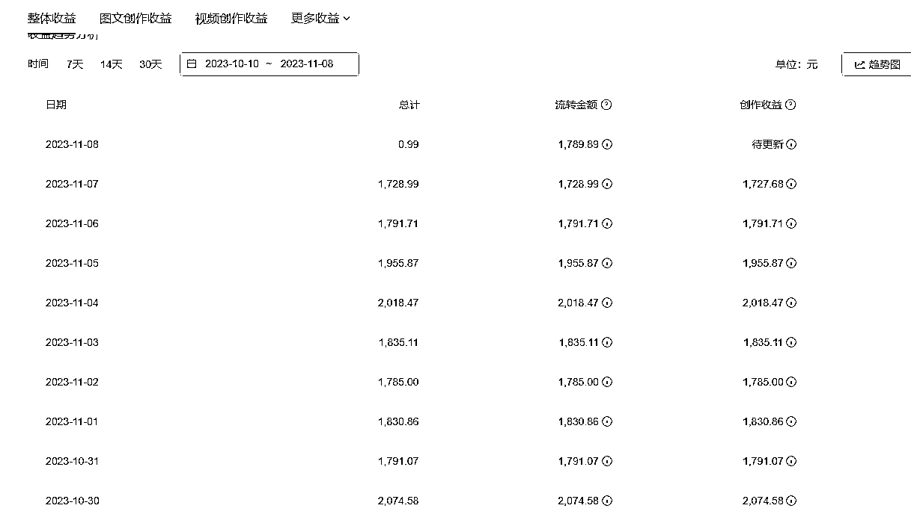
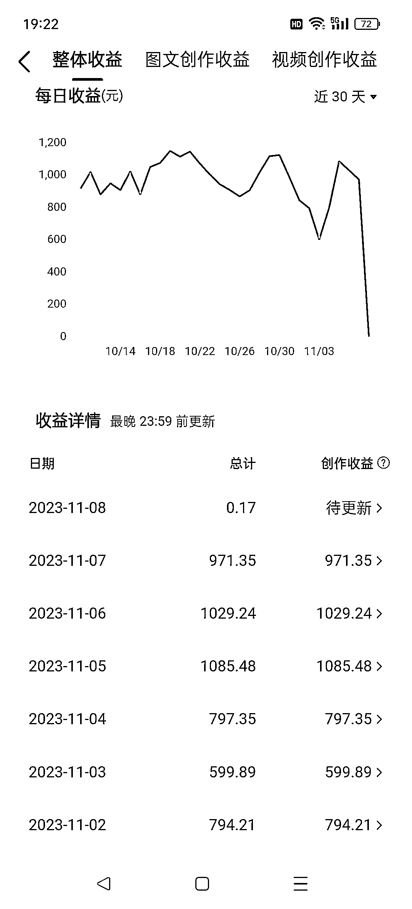
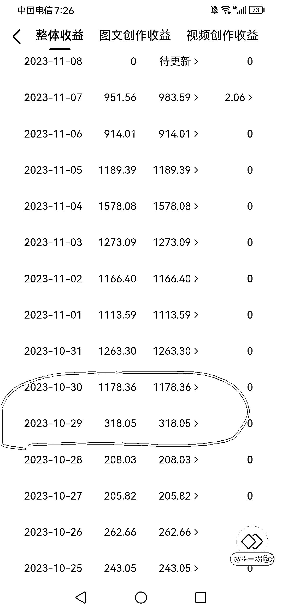
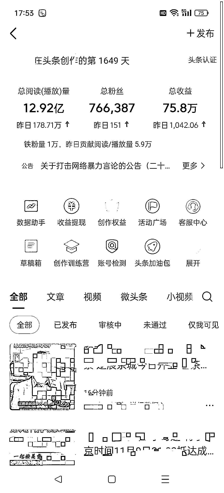

# 月收入增加 9k 到 3w 的一套玩法——记者节

> 原文：[`www.yuque.com/for_lazy/thfiu8/lv9ngomsl5pwv0kg`](https://www.yuque.com/for_lazy/thfiu8/lv9ngomsl5pwv0kg)

## (61 赞)月收入增加 9k 到 3w 的一套玩法——记者节

作者： 阿良

日期：2023-11-09

# 【一个小礼物】

11 月 8 号，记者节，立冬。

一份专属小礼物，送给星球里，依然奋斗在媒体一线的朋友。

这个礼物，不能让你暴富，但每月可以增加 9 千到 3 万收入。

这是一个，我干了 3 年，现在依然在干的项目。

收益稳定，至少还能再干 3 年（养家糊口的法子，都贡献出来了哈哈哈）。

这篇内容，本该记者节当天就弄出来，因为昨天去北京对接项目，飞机当天往返，早上 5 点出发，今天凌晨 1 点才到家，耽搁了。

这个玩法，此前一直是付费的，我一般收取收益额的 5%—10%。

但刚才说了，因为是记者节礼物，免费，且倾囊相授，送给星球里从事媒体行业的朋友。

一杯敬朝阳，一杯敬明天！

# 【收益】

老规矩，先看收益。

按照每天收益高低，我把账号分成三级：

A 级账号：日收益 2 千左右

B 级账号：日收益 1k 左右

C 级账号：日收益 500 左右

目前，项目里 200 多个账号，A 级很少，不到 10 个，大部分都是 B 级。

但是，90%以上的 C 级账号，通过养号，都可以养到 B 级，但想养到 A 级，很难。

这个号，就是从 10 月 30 号开始，突然爆发，从 C 级养到 B 级。

**收益怎么计算？**

以头条号平台，B 级账号，举例：

一千播放，平台给 1 块钱左右，一万播放 10 块，十万播放 100 块，百万播放 1000 块，以此类堆。

主

所以，ABC 三级账号的主要区别在两点，千播的单价和每日播放量。

项目里，B 级账号居多是因为，千播单价稳定在 1 块，单日播放稳定在 100 万的账号，占大多数。

**实测数据：**

每个账号每天发布 100—150 条视频，单日总播放量 100 万左右。

单账号，日收益，1 千。

# 【门槛】

刚才说了，这是一个门槛很高的项目，因为门槛高，收益才稳定。

我目前正在操作的平台：逛逛、小世界、今日头条。

各个平台计算收益的方法不同，咱们还是以头条号举例，先说门槛。

**账号门槛：**

账号必须同时满足，以下两个条件：

1.账号类型，必须是——新闻媒体；

2.头条创作天数，必须在——1000 天以上。

**以上两条，必须同时满足。**

好了，看到这，如果你手上刚好有符合以上条件的头条号，就可以来找我，要具体操作方法了。

如果你不知道上哪去找账号，我帮你圈定一个范围：

1.电视台、电台、报社、杂志社等有新闻媒体资质的单位

2.各个地方的区县融媒体中心

**符合条件的账号有多少？**

说实话，不少。

四五年前，几乎所有媒体单位都注册了一大批头条号，更新了几条内容后，绝大多数账号都废弃了，没有再更新。

这些废弃账号就是参与这个项目的主力军。他们中的大部分，经过养号后，都可能成为 B 级账号。

当然，如果有一直坚持更新的账号，那更好，它们当中，有可能出现 A 级账号。

我们单位，符合条件的头条号，一共 19 个，目前纳入项目 12 个。

**参与项目的账号，有什么好处？**

1.变现。每天收益 1 千；

2.涨粉。每天 200—300，每月 5 千—6 千。

头条号的粉丝，本身没多大用，但头条号可以跟抖音号绑定，共享粉丝。

头条号每天涨了多少粉丝，跟它绑定的抖音号就同步显示，也涨了多少粉丝。

现在大部分抖音媒体号都在掉粉，但是很多单位又对抖音号涨粉有要求，一般每月要保证涨粉 5k 以上。

这个头条号项目，刚好解决了这 5 千粉丝的问题。

简单说，头条号变现这个项目，既赚了钱，又涨了粉。

主打一个，名利双收。

**接下来说，最关键的两个问题：**

收益给谁？

活儿谁干？

1.收益，给参与项目的个人 30%。如果你找到一个 B 级账号，每月就到手 9 千，找到两个，到手 1 万 8，以此类推。

2.每个账号，每天需要剪辑发布 100—150 条原创视频，这个活儿，如果你想干，我可以告诉你，具体怎么干；如果不想干，我可以告诉你，谁能干。

目前，我们单位的做法是，找素材、剪辑和发布，这几步都交给专业的第三方公司干，我负责审选题。

**执行难度大不大？**

这个项目，放在 3 年前，几乎没啥信息差，很多媒体都在干。

结果，收益都进了单位，干活的人一分没有，项目自然就干黄了。

当时给的千播收益，最高能达到 6 到 10 块，很可惜。

最近一两年，各大平台在不断调低千播收益，头条号维持在 1 块左右，其他平台更低。

具体打法，跟三年前，完全不同，如果按照 3 年前那么干，收益反而起不来。

**虽然收益降低，但好在，干活的人能得到实惠，这很重要。**

整个项目最核心因素是，每个账号每天发布 100 多条视频，且必须保证每一条都是原创。

**上哪去弄那么多原创的视频？**

具体的办法，小伙伴如果有知道的，可以直接上手；不知道的，就直接问我，不用不好意思。

因为这个步骤是整个项目操作的核心，目前只告诉本星球的小伙伴，避免外流，就不放在这里展开说。

**再次声明**

目前，只针对咱们星球的小伙伴，免费传授，且保证每一个细节都传授到位。

# 【个人简介】

我是谁？

2007 年，一脚踏入传统媒体，调查记者、主编、制片人，现在身份依然在体制内，负责单位媒体矩阵；

2018 年，开始做产品经理，带团队开发 APP，有单位自己的，也有其他的。

**我目前的精力分配：**

正在弄一个媒体大矩阵，方便参与的媒体，互帮互助互惠互利；

正在搭建一个健康整合平台。

1.**媒体大矩阵，是个啥？**

分两步走：

第一步，先让一起干的参与者和所属媒体，赚到钱，同时帮助参与的媒体，打造自己的媒体矩阵（每个媒体，在各个平台，至少保证有 50 个日更的活跃账号）；

第二步，整合部分媒体，组成媒体大矩阵。统一行动，增加声量；跨城市合作，增加收益。

2.**健康整合平台，又是个啥？**

分三步走：

第一步，线上商城+10 个城市康养基地（康养基地特征结合城市资源，会设定不同主题，目前已落户 3 城）

第二步，体医融合平台。简单说就是，有病咱就治病，挂号走绿通；没病给健身卡，推荐每日运动组合和量级；亚健康的，给食疗方案，提供基础食材。（目前绿通单独在弄，最高等级绿通会员，30 万/年，交付效果非常满意。）

第三步，健康整合平台。管理，培训，销售，服务四个模块。

这个项目，我接手之前，烧了 4000 万，钱烧完了，项目停滞。现在，重新对接了资方，刚好资方自己也想弄健康整合平台，一拍即合，就一起弄。

手上有相关健康项目的小伙伴，欢迎一起探讨。

# 【最后】

媒体号变现项目，虽然门槛很高，但所有媒体人，刚好就在门槛里。

所以，这是一个对传统媒体人，非常友好的项目。

这是我入行的第 16 个记者节，把自己正在谋生的法子，贡献出来。

作为一份，送给媒体同行的专属小礼物。

传统媒体人正在经历一场严冬，我能力有限，只能给小伙伴们，提供这一点温暖。

如果有小伙伴刚好就是媒体人，不要不好意思，直接来问我。

有任何疑问，也欢迎评论区留言。

* * *

评论区：

金又又 : 个人可以改吗 1000 天是满足了
阿良 : 个人号不行，必须是新闻媒体
阿良 : 我手上也有认证记者的号，天数没问题，收益千播三分钱；改认证也试过，目前我这边的测试结果是，改完创作天数归零。
东邪 : 以前干融媒有资源的大概能行，这是要找县级每媒体出账号代运营吗？
阿良 : 有人手，可以自己干
折扇书生 : 对接一下
阿良 : 没问题，随时找我，如果评论区回复晚，可以发私信
阿良 : 有小伙伴问我，是不是代运营公司，我是电视台的，不是代运营公司。因为手上还有别的项目，精力有限，所以找了一家剪辑公司负责处理视频。如果有媒体同行想试试自己剪辑，完全可以，我告诉你怎么弄。

* * *