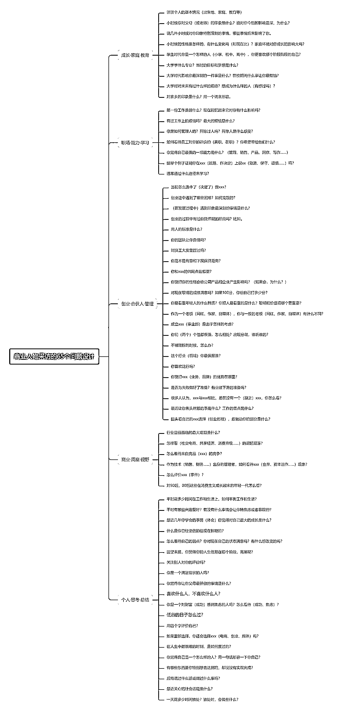

# 普通人如何策划一期商业访谈

> 原文：[`www.yuque.com/for_lazy/thfiu8/wpyv4hxezyeu2h3c`](https://www.yuque.com/for_lazy/thfiu8/wpyv4hxezyeu2h3c)

## (精华帖)(42 赞)普通人如何策划一期商业访谈

作者： 小吉玛丽亚

日期：2023-11-07

各位生财有术的家人们晚上好，我叫吉利，来自海南，现在在广州讨生活～

今天受生财的邀请在这里和家人们分享一下普通人如何策划一期商业访谈。感谢生财给予的平台～如能给各位看官带来一丝收获，将不胜荣幸。

在短视频发展浪潮下，每位入局者都想来分一杯羹。短视频赛道有很多的行业，电商志、程前朋友圈等等账号的商业访谈做得很火，那么

商业访谈是什么？又应该怎么做呢？接下来，我给家人们介绍一下～

从外行人的角度看：采访是外出采访别人、访谈是把人请回来做访谈节目。

访谈是指一种采访方式，通过与受访者进行面对面的交流，获取有关特定主题或话题的信息。访谈可以是正式的、非正式的、结构化的或非结构化的。

访谈过程是一个耗费时间的过程，需要巧妙周全的构建，访谈之前要做好充分的准备，包括材料准备、思想准备等。明确访谈目的，是做好一份访谈最重要的前提，没有中心目标，会导致提问问题太分散，主题不清、内容很散，缺乏聚焦。

其实不光访谈，任何一件事在启动之前，明确目的、建立目标感都是最高效地做事的方式。很多时候我们在决定做某件事的起因是停留在比较肤浅的层面，并未认真思考这件事的目标，或是思考了但不长时间便忘记了，走着走着就偏离了原来的航线。

所以说，凡事预则立不预则废，第一步肯定是要有计划书的。关于商业访谈的策划模板我也给家人们准备了

流程第一步，就是要确定采访的人物，确定人物后，才能根据目标采访人物的背景与特点来确定选题，也就是这期节目主题了～

根据主题，列出与嘉宾交谈的问题提纲～

到这儿，肯定有很多家人不知道问什么问题，没关系，我也给家人们准备了问题模板：

接下来，就是访谈的场景布置了，一般会有以下人员和物料的设置——

编导 1 人：那编导在这里具有什么作用呢？

1、做好前期选题工作
2、构思、确定拍摄方案
3、做好拍摄前的准备
4、管理好手下编剧的工作或自己担任编剧、写好剧本
5、负责拍摄采访的相关事宜
6、负责后期的编制工作，包括审查、剪辑、阐明创作构思。

编导的位置相当于项目经理，有效衔接各个岗位的工作人员。

摄影 2 人：一个负责固定机位，一个负责游动机位
主持人 1 人：主持人是必备的，没有主持人就是嘉宾 solo 了
嘉宾 1 人或多人：初期建议是一位嘉宾

摄像机 2 台：一台固定机位，一台游机
麦克风（麦克风的数量根据人数确定）：现在基本都是领夹式麦克风
补光灯 1-2 个：室内灯光如果不明亮，观众视觉效果会不好

茶几 1 个：视觉摆设
沙发或椅子若干（根据现场的人数协调）：供主持人与嘉宾使用

在访谈过程中还要注意受访人的神态表情、衣着服饰、肢体动作、全程坐姿，甚至是受访人中途所接电话的内容语气、挑选什么样的访谈房间、给采访者沏了几壶茶。

这些细节可能都会反映出受访人的工作状态、性格特征和心理特质，从而在不经意间为后期素材剪辑提供“附赠”的素材。

对访谈对象的背景情况、性格特点、思维方式和价值观念至少要有个基本的了解和判断。对访谈内容可以做些适当设计，比如怎样开始挑起话题？访谈内容中有哪些可能出现的兴奋点？话题从浅到深大致可以分为几个层次？有哪些相关话题可以或必须被触及等等，这些内容应该做到心中有数。这样才能在访谈过程中把握主线把握节奏。

当被访者说得很好时，要不断通过赞同的语言或表情、肢体动作鼓励被访者继续。甚至可以适时抖出预先准备好的事例素材来支持被访者的观点，从而充分调动被访者的情绪。但当被访者口若悬河却越来越离题万里的时候，一定要有勇气打断对方，通过新的提问或与被访者的互动将其拉回来，不要因为对方是名人、领导或说的特投入而不好意思、不敢去打断。因为访谈的主动权、控制权必须掌握在访谈者而非被访者手中。

非常感谢 XXX（嘉宾）的分享，回到我们刚才说的，我认为…
又或者：非常感谢 XXX（嘉宾）的分享，继续我们刚才说的……

你可以通过使用幽默言语、表达兴趣等方式来营造一个轻松愉快的氛围。这样可以让对方感到更加舒适，更愿意分享他们的想法和经验。

当嘉宾回答问题时，你需要确保你完全理解了他们的意思。如果有任何不清楚的地方，你应该适时提出问题以确保你正确理解了他们的观点。此外，你还可以使用一些过渡性的语言，如“那么”、“接着”等，来帮助你更好地承接他们的回答。

如果你发现嘉宾在某个问题上的回答比较表面，你可以试着引导他们深入探讨。例如，你可以问：“你能详细解释一下你是如何处理这个问题的吗？”或者“你能给我举一个实际的例子吗？”这样的问题可以帮助你获得更深入的信息。

在整个访谈过程中，你需要始终保持尊重和专业的态度。即使你对某个问题有不同的看法，也应该以礼貌的方式表达出来。同时，你也需要尊重嘉宾的隐私和观点，不要强迫他们回答任何不舒服的问题。

还有个额外的偏方：我们业余时间可以多玩狼人杀游戏，手机上就能下载，玩家之间谁也不认识谁，有警察有反派的那种。这个游戏的发言环节，其实就是双方争夺游戏主导权，常玩可以在娱乐中很好的锻炼自己的语言表达能力和现场控制能力。

通过媒体的报道，可以让更多的人了解到你和你的事业，从而提高知名度。
你可以利用媒体来传递你的信息、观点和想法，让更多的人了解你的观点。
通过媒体的报道，你可以塑造自己的形象，让人们对你有更好的印象。
如果你是一个商人或者是一个公司老板，你可以利用媒体来推广你的产品或服务。

一般来说，适用于需要宣传、推广、树立形象的人群，例如，企业家、明星、艺术家等。

查找相关的新闻媒体、行业媒体或专业杂志，亦或是自媒体确保它们与你的专访主题或行业相关。

找到适当的联系人，寻找媒体机构的联系人，如编辑、记者、特约作者等。

可以通过媒体的官方网站、社交媒体、行业活动或相关的行业名单等渠道找到合适的联系人。

自媒体平台的话，直接在你想投放的平台搜索栏输入：访谈，就会出来很多访谈类的短视频，直接点击账号头像就可以取去到主页，主页的简介处就会有联系方式。

我们找媒体进行专访需要准备好专访提纲。

在联系媒体之前，准备一份专访提纲或简短介绍，概述你希望讨论的话题、专访的目的和你的背景。这将帮助媒体了解你的专访价值和内容。

与媒体联系人建立联系后，要有一个简短扼要的自我介绍，并说明你的专访请求。

一旦媒体同意进行专访，就安排合适的时间和地点。确保你的日程安排和准备充足，以便专注和有效地进行专访。

在专访前，准备好相关的资料、数据和素材，以支持你的讨论和回答媒体的问题。

这将增加专访的丰富性和专业性。在专访结束后，向媒体表示感谢他们的时间和合作。如果有必要，跟进专访的结果和任何后续行动。

记住，与媒体进行专访需要一定的耐心和灵活性。有时可能需要多次尝试才能与合适的媒体联系上。在沟通和交流过程中保持专业和礼貌，展示你的价值和专业知识，才能增加成功获得专访的机会。

以上就是我今天的分享内容，大家如果有不理解的点可以随时在群内戳我~希望我的分享能给各位带来一丝帮助。

* * *

评论区：

亦仁 : 感谢分享，已加精华。
小吉玛丽亚 : 感谢亦仁大佬的认可～准时受宠若惊～
景清 : 吉利姐[可怜]
小吉玛丽亚 : 啊哈哈哈哈！原来是你！

* * *