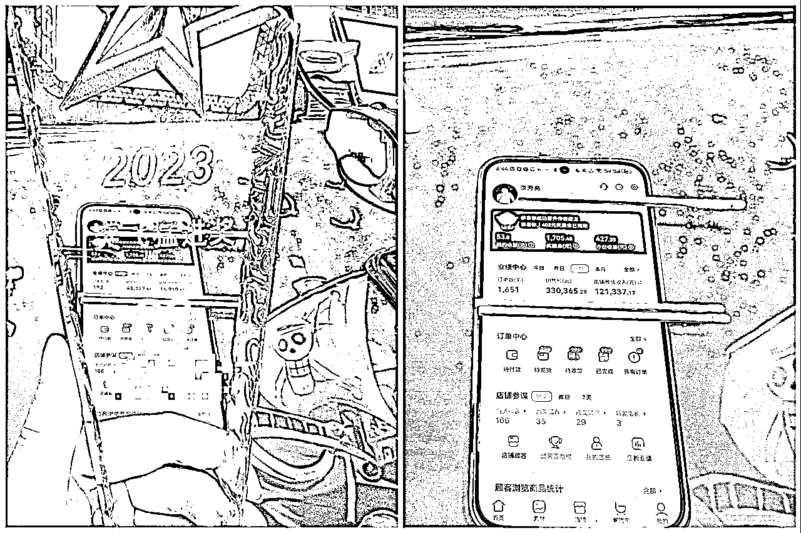
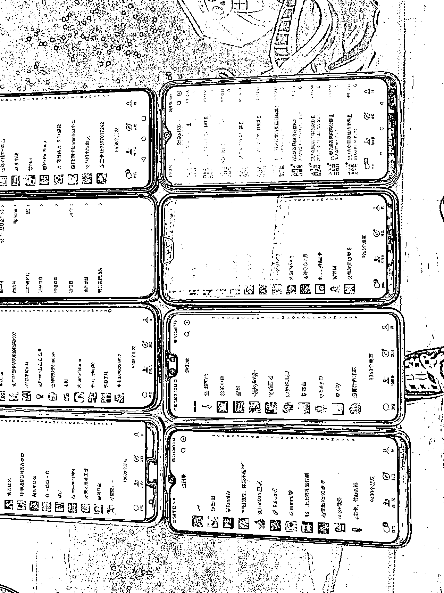

# 从 0 到月销 50 万，私域特卖群的拉群、开群流程

> 原文：[`www.yuque.com/for_lazy/thfiu8/brgcm4sgtf7ve9n0`](https://www.yuque.com/for_lazy/thfiu8/brgcm4sgtf7ve9n0)

## (23 赞)从 0 到月销 50 万，私域特卖群的拉群、开群流程

作者： 梦想家李同学

日期：2023-11-10

# 自我介绍

生财的圈友们好，我是李同学，互联网创业 11 年，上学之初创业时没什么本金，所以一直以来都习惯与寻找一些少投入、竞争相对较小的蓝海赛道。

继上一次在生财分享快两年时间了，相比两年前，现在依然在做私域的特卖，方向上略有调整，从之前纯做 b 端到今年尝试做自营的 c 端用户。

我从今年 3 月份开始尝试自营做 c 端顾客，用以前闲置的粉丝做品牌特卖群的变现，从月销 6 万多到十几万，这个月月销应该能突破 50 万，佣金在 13 万左右。

我从 2019 年至今一直在做特卖这个业务，不过一开始我做的是团队模式，2020 年 y 情反而迎来了一波增长，团队的规模突破 3000＋，每个月的总销售额从 2020 年的 3、4 月份开始能稳定在 1000 万以上，团队注册店主的店均销售额能够做到 5000 块钱左右。

这个成绩相较于很多大佬比起来还是有一定的差距的，但是每个人拥有的资源跟投入的成本可能并不完全一样，我自己基本上是 0 资源去起盘，中间没有做太多的付费推广。

当时做团队模式主要是做知乎、微信公众号跟百度竞价的引流，团队模式招募代理的做法逐渐趋于稳定，21/22 年整个互联网大环境也变的不好，行业也有所下滑，再去做增长变的吃力，就只能去做一些团队的日常运营和维护。

对社交电商团队模式感兴趣的圈友可以去看一下我之前分享的帖子：[`t.zsxq.com/14527iCkN`](https://t.zsxq.com/14527iCkN)

* * *

# 自营特卖群

事情的转机是在今年年初，线下跟一些做私域的朋友聊了一下，大家提的比较多的就是做自营、自己做 C、投流 C，回来之后我就想，我之前手头闲置了十几万的微信好友，都是 21 年做淘宝业务加到私域里面来的人，既然别人都在投流做了，自营这么香的话，我也可以试试。

当时搭建了一个 3 人的小团队，我负责整个的操盘、运营。合伙人 A 负责每天去触达、激活粉丝，拉群，日常的群内简单的消息回复。

合伙人 B 本身是一个卖货能力比较强的做特卖群的宝妈，合伙人 B 负责输出群内的宝妈人设、ip、日常的选品，文案。

# 一、拉群

## 1、进群话术

### **①、第 1 版：面面俱到，进群率低**

**①、第 1 版：面面俱到，进群率低**

在进群的话术上，我跟合伙人 a 迭代了很多版本，起初的第一版偏向于面面俱到和高大上，优点是把我们的业务给讲清楚了，但是给用户造成了很大的阅读困扰。

用户的时间是很宝贵的，没空到你这里来做阅读理解，可想而知，第一版的进群效果并不好。

**②、第 2 版：有诱导性，进群好，转化差**

之后我们迭代了第 2 版，当时商城里面有一款手帕纸，10 包，包邮的成本是 4 块钱，我们在话术里面告诉所有人，进群的人，领套路每人包邮送一份纸巾，进群的效果好了很多。

但后来在转化的过程中我发现转化并不如之前，而且，有一些领纸巾这个噱头反而喧宾夺主，拉低了我们整个群的格调。

**③、第 3 版：简短、口语化**

最终我们确定了进群话术的核心，首先是简短，能省掉的不多说一个字；其次是真实介绍业务，不虚假宣传，保障进群的是意向用户，质量大于数量；最后一点是口语化，拒绝高大上。

## 2、拉群时间

测试了不同的拉群时间之后，我们发现，在下午四点钟以后，拉群的效果要比四点钟之前的进群率更高。

现在每个人的微信里面加了太多的群，可能我们第一次发消息给这个用户，如果她不是实时接收到，那么后面基本上不会再考虑进群了。

所以在下午的时间段，通常大家都会比较有时间，在空闲的时间看到我们的拉群消息会更主动的去点击进群。

## 3、其它的小技巧

**①、拉群的 f 控**

一次性我们能拉群的人数是 40 人，有的账号一天之中拉群太多会遇到 f 控，提示“操作太频繁，请稍后再试”，遇到这种情况是正常的，只能等到第 2 天再继续操作。

这里的解决方法是：尽量多养号，拉群的这些天，用流量去操作、养号，在拉群的同时，也多去做一些其它正常用户会做的操作。另外就是多个号拉一个群，不要限定非要一个号拉一个群。

**②、拉群开业的时间长度：**

1 个群，从拉群开始的当天，最好是第 2 天就开业，最迟不要超过第 3 天开业。

这是我们当时遇到的 1 个问题，有几个群拖了一个星期才拉好，结果就是，开群的时候很多人一脸懵，在群里问：这个群是干啥的？我怎么加到这个群里来了？

时间一长，这些人已经忘记自己为什么加群了，用户大概只会 1 到 2 天记得这个群。所以，拉群以后，开业越早越好。

# 二、开业

开业活动要更重要更复杂很多，当时我们也迭代了很多版本，可惜的是群消息太多，加上我是从来没有分享和记录的习惯的，之前的群聊天记录全部都清空掉了。

回想起来我们有几十个不同的案例，只能给大家呈现文字部分的内容，可能没有图片＋文字那么生动。

## 1、开业活动的重要性

因为我的粉丝全部是以前闲置的淘宝来的粉丝，我们之前也没有打造人设、做任何运营，粉丝对于我们的账号是很陌生的。

开业活动是第一次、大概率是唯一一次这些人会听我们输出内容，脸熟这个群的机会，直接影响我们后续群里的产出

## 2、开业的话术、内容及时长

我们站在用户的角度，作为一个消费者，她进到我们群里来，最想要得到哪些价值、有哪些顾虑，根据这些，就可以倒推出我们开业需要的内容：

①、用户需要知道你是谁，你为什么做这个，才敢放心找你买东西；

②、用户要知道你这个群是干吗的？有什么优势？卖的是什么？要怎么才能买？

③、用户要知道在你这里买东西可靠吗？是不是正品?售后跟服务是怎么样的？

以上，是我们开业活动要呈现给用户的内容，但站在用户角度，你要讲的这些东西我们可以称之为广告内容，如果你干巴巴的给用户讲这些，别人没有这么多的耐心和注意力听你讲一大堆。

就跟我们看电视一样，你只能在电视剧里面穿插广告，用精彩的电视剧吸引用户的注意力，再在中间穿插一点广告，才能达到宣传广告的效果。

而我们在群里面的“电视剧”就是各种福利活动，比如红包、礼品，所以，输出的“广告”要跟红包和礼品，穿插着来。

开业的流程按照上门这个思路，就可以倒推出来。

关于开业活动的时长，时间也是越短越好，现在的用户要她们集中注意力可太难了，所以开业活动尽量控制在 10 分钟到 15 分钟。

## 3、营销活动；

### ①发红包；

红包这里，不需要一直发红包，红包用在刀刃上。首先，给自己设置一个预算，我们开群，一个群的红包＋礼品，设置的预算是 200 元以内。

这里有一个小技巧，就是我们在发大红包的时候，可以在红包的名字上面写上 xx 元 xx 个，比如我写的就是 58 元 30 个，这样不管是抢到还是没抢到的，就会知道我这个红包的总金额。

这个技巧也是我们在实操中发现的，有一次发了几十块的红包，有一个人只抢到了几分钱，就在群里闹事，说你们宣传的开业大红包，怎么才几分钱。

之后我写上红包金额和个数，这样抢到很低金额的人也会知道是自己运气不好。

我们还会发一种增强大家参与感的红包，开业我会让人在群里发一句语音，语音里面有一个口令，最先打出这个口令的前 8 个人，每人发 3.88 的红包。

这里的口令我用的是“正品一折起”，通过这个口令，大家都能知道我群里卖的都是正品，并且价格低至一折。

### ②无套路，每人一单纸巾免费送；

我所做的特卖平台上有一款纸巾，我前文提到过的 4 元包邮，我会在开业活动前，在群里做一个宣传，告诉大家，你只要准时参加我的开业活动，那么你就能领到 1 单免费的纸巾。

并且在预热的时候，我会发出这个纸巾的实拍图片和视频，让大家提前看到这个纸巾的品质。

之后在开业活动打过广告以后，我会留出三分钟的时间，让大家识别我发到群里的二维码，去下单并截图到群里，所以下单的人，我直接群里发专属红包，把下单的钱给到你。

这个活动不仅能吸引更多的人来参加到开业中，并且在开业的时候还会教会大家怎么在这个商城买东西，4 块钱就能换一个下单用户，简直是超值。

### ③猜价格；

这里我会挑选 2 到 3 个单品，知名度高的，性价比高的，只发实拍和文案，不发链接，让大家去猜这个商品的真实价格，最先猜到的奖励 6.66 元红包，时间到了还是每人猜到就以最接近的为准。

这个活动也是让新用户在互动中认识到你这个群里商品的高性价比和品牌知名度。

这个猜价格还有后续几个延伸的动作：

第一步：在开业当时，猜完价格以后，把下单二维码也发到群里，可能会有用户下单；

第二步：开业结束以后，当天晚上肯定要推几款产品的，可以把猜价格的单品的品牌的其它商品推出来，转化效果会不错；

第三步：猜价格活动现场，可以让自己的其它气氛组的账号，在群里问：“这个我可以直接下单吗？”是真的吗？价格这么低？“，之后，气氛组账号自己下单一单，截图晒到群里：”群主，我买了，这个什么时候会发货呢？“

一起我们今年开群的几十个群里面，差不多用了接近十个活动，上面是我自己使用下来效果个人感觉最好的几个。

### ④、互动必用：拍一拍；

刚开始我们群里做活动做互动就是要大家扣“1”，可能大多数人在用的或者看到的，都是这种扣“1”的活动，这种扣字的互动方式最大的问题就是刷屏太严重，造成一些想看消息的人觉得太打扰了，很多直接就退群了。

或者开业真正想要讲的内容被刷过去无法突出重点，好比你在台上讲话，下面一堆人叽叽喳喳一样。

我虽然知道这个问题，但是一直不知道该怎么解决，直到我今年参加生财的小航海，当时拉了航海群以后群里的领队用的是“拍一拍”的互动方式。

拍一拍既可以达到互动的效果，让在参加群开业活动的人知道有很多人在同时参与，又不会打扰到其它人。

而且，拍一拍还能拍出烟花这种有趣的互动动画。

我的拍一拍话术就是：“小 7 带我省钱[烟花]”

### ⑤、开业气氛组；

开业气氛组是重中之重，必不可少的。

刚开始，我们理解的气氛组的作用就是活跃气氛，增加群里的互动，没有大不了群里的互动会差点，所以没太重视。

我们今年大概是在开群第 5 个群的时候，就吃了个大亏，当时有个男的，在群里起哄，说群里的链接大家不要点，乱点链接银行卡被盗的可不少；

之后马上就有人说，群里的东西也不便宜，买了不发货怎么办之类的，紧接着也有其它质疑的声音，说：退了退了。

这样搞下来，开业现场一片混乱，一下子退群的人很多，后面这个群的转化也非常差。

我们开群的过程中，其实，质疑、退群的或者想要说风凉话的人，肯定会存在，毕竟我们这个是个广告群，对很多人会造成打扰的。

但是这种人，在群里发言，也是要看场合的，如果你在群里有气氛组，提前就把节奏带好了，这种人即使想说话，也不敢说！但是，只要你没带好，有一个人开头，其它有这种想法的人就会冒头出来。

气氛组除了日常活动的话术，还需要积极参与活动，比如说群里发的免费领纸巾的，这种必须要有几个人开头付款了截图到群里，后面才会有人跟上来。以及后面的下单、晒单，都需要。包括拍一拍。

在之后的开业中，我们一个群基本上是配 5 个气氛组的账号，参与到互动。

### ⑥、其它开业的小技巧：

第一、关于开业的时间，通常是订到晚上的 7/8/9 这几个整点的时间，通常 9 点是人最多的时候，但这个要根据自己的人群去测；

第二、开业要减少@全体成员，一次开业把@全体成员的次数控制在 2 次；

第三、开业前夕、开业结束，都要提醒大家把群消息设置免打扰和群置顶，免打扰是减少退群、群置顶可以提醒大家经常进你的群来看消息。

# 三：人设及日常运营

任何跟运营上，相对很多了解到的朋友，我属于是轻运营型，运营跟售后都教给合伙人 b 去操作，合伙人 b 还有本质工作，卖货这里，属于兼职型。

合伙人 b 在能力上却是非常出众，卖货这件事情，天赋也极其重要，懂产品、懂文案、懂用户、懂聊天，这都是偏感性的内容，你要我去学、或者要我花钱请一个全职的运营，可能也做不到这一点，因为虚有其形，缺少灵魂。

合伙人 b 属于我们整个私域卖货中的核心竞争力之一，合伙人 b 盖洛普排名前 5 的分别是完美、取悦、积极、沟通、交往，天生的营销者，就像她自己说的一样，她觉得卖货这件事情很快乐，她不觉得这是一种工作。

人设上我们没有过多的打造，直接套用合伙人 b 的宝妈人设，这里一点就是，合伙人 b 自己很喜欢买买买，一个月要取一百多个快递那种，而且都是女装。

很多正在热卖的女装我们都是自己实拍素材，拍了以后同步到群里，所以我们群里卖的最好的品牌也是女装。

**运营里面，我们只关注两个核心指标：**

一个是有成交买货的人，因为我们的账号比较分散，每天翻一下下单的记录，所有有产生下单的顾客，全部一对一加到我们主登录运营的账号上面去，这个工作在前期的工作量会比较大，但差不多半个月以后，添加新用户的工作量会变小很多。

另外是售后的订单，顾客河边的订单一旦主动在后台申请售后，每一笔订单都是要点开一下用户退款跟售后的理由，做一个简单的回访，私域卖货利润点主要就来自于高复购，售后问题是用户流失最多的原因，所以售后这块值得重点去关注下。

# 四、最后总结

以上是我们自己过去大半年实操私域卖货的一些经验和教训，7 月和 8 月遇上淡季，整体的产出不理想，9 月、10 月产出又上升了一倍多，这个也远超出预期。

所以这个月我们又开始在做很多新的探索，后续有新的进展再继续跟各位圈友们交流，希望我的分享能对看到的朋友们有所帮助。

* * *

评论区：

夜未澜 : 学习了，可否留个联系方式
梦想家李同学 : 1899270

* * *