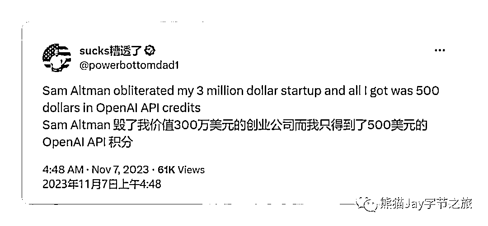

# 实战干货，0 基础打造你的第一个 GPTs

> 原文：[`www.yuque.com/for_lazy/thfiu8/cve93anf34dyf1ro`](https://www.yuque.com/for_lazy/thfiu8/cve93anf34dyf1ro)

## (46 赞)实战干货，0 基础打造你的第一个 GPTs

作者： 熊猫 Jay

日期：2023-11-13

实战干货，0 基础打造你的第一个 GPTs！

记得前几天在 OpenAI 的发布者大会后，一张梗图广为流传：「Sam Altman 毁掉了我价值 300 万美元的创业公司，而我只得到了 500 美元的 OpenAI API 代金券」。

的确，GPTs 的上线和这个月晚些即将上线的 GPT 应用商店，对于正在 大量 AI 应用领域的初创公司而言，无疑是一场浩劫。

而毁掉那些初创 AI 公司的最大“凶手” 就是本次新版本的重头戏 --- 个性化 GPT ，你 无需编程经验，通过简单的对话聊天方式或者配置一些参数，就可以快速构建一个 具备专属技能的 GPT，甚至可以在未来上架到 GPT Store 里来赚取利润，每一个点都足够惊艳。

那到底 GPTs 有什么用？怎么构建自己的第一个 GPTs 呢？我们一起来看看！

全文请移步：

如果有用，请帮忙点个赞，谢谢啦！[`zzi7a49xoa.feishu.cn/wiki/A9eOwy6FzixYZQkka0dccFQ7nIf?from=from_copylink`](https://zzi7a49xoa.feishu.cn/wiki/A9eOwy6FzixYZQkka0dccFQ7nIf?from=from_copylink)

* * *

评论区：

生哥 : 立马实操了下，很有收获
熊猫 Jay : 👍

* * *