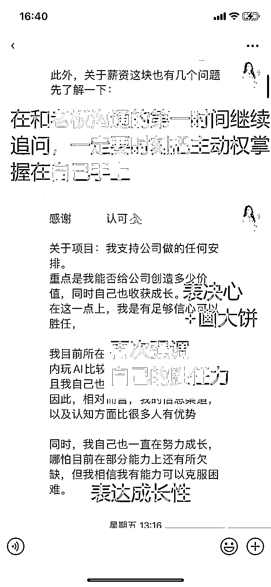

# 助力圈友成功转型 AI 提示词实现薪酬翻倍

> 原文：[`www.yuque.com/for_lazy/thfiu8/rxar4u39gw7sb5z2`](https://www.yuque.com/for_lazy/thfiu8/rxar4u39gw7sb5z2)

## (15 赞)助力圈友成功转型 AI 提示词实现薪酬翻倍

作者： 阿柯～lisa

日期：2023-11-16

大家好，我是 lisa ，同时也是《[答应我，一定要看完这篇 AI  提示词面试指南再去面试](https://f5zm66ijlf.feishu.cn/docx/L8j3dKVzao88MHx7up4cazvXnGc) 》的作者。今天我想复盘一下前段时间帮助圈友在当前经济环境不佳和普遍裁员的情况下，成功逆袭从 Java 工程师转型为 AI 提示词工程师的历程。虽然圈友从一线城市回到三线城市，但薪资却反而比一线时涨幅 50% ，还包食宿福利，相当于**薪资至少翻倍**的成就。

且老板对童鞋抱有很高的期望，非常看中我们圈友的主动学习能力和冲劲、灵活度，并认为“AI 提示词工程师”这一职位的范围相对狭窄。因此，他提出将这一职位升级为“AI 赋能工程师”，以赋予圈友更广泛的职责和更大的发展空间。

以下为 offer 部分截图：

以下我分别从目标结果回顾、过程分析、总结三个维度进行分析：

全文总计 3560 字，可能需要您的几分钟阅读时间。

# 一、目标结果回顾

在这次为期两个月的辅导中，我帮助圈友实现了以下几个关键转变和成就：

1.  职业定位从模糊到清晰的转换；

2.  不仅提升了他的面试技巧，还让他深入理解了职场的核心逻辑；

3.  面试两家公司，就成功获得一份优质 offer ，达到了 50% 的高通过率。其中一次面试虽因公司内部员工转岗而关闭职位，但整体过程依然高效且成效显著。

# 二、过程分析

## 一）求职目标确认

为了确保面试成功，首先必须明确职业目标。经过深入沟通，结合圈友的过往经验、兴趣、爱好、个性特点和优势，以及我对行业的历史了解和对未来趋势的预测，我们从最初模糊不清的 Java 、新媒体运营、以及其他 AI 相关岗位中，逐步细化和聚焦。最终，我们确定了明确的目标：AI 提示词工程师。

## 二）简历优化

最初，简历过于简单且缺乏焦点，项目经验也相对单一。因此，在明确了职业目标后，我们首先着手进行简历优化。为了做到这一点，我们需要提前了解目标公司的岗位要求和职责，以便有针对性地定制简历。

**📌简历优化几大注意点：**

1.  **简历文件名：**使用“姓名 + 岗位名称”格式，转为 PDF 格式避免格式错乱。这样方便 HR 处理，并避免你的简历在众多“简历”文件中丢失。

2.  **简历结构与内容：**确保结构清晰，内容与岗位高度相关。简历应包括基本信息、教育背景、工作/校园经历、荣誉奖励、自我评价和技能证书。

3.  **编写要有针对性：**对每个岗位定制简历，展示与岗位相关的经历和技能。

4.  **具体内容注意事项：**

5.  **基本信息：**姓名、年龄、联系方式、邮箱和求职意向。照片可根据需求选择是否添加。

6.  **教育背景：**清晰展示你的学术背景。

7.  **荣誉奖励：**优先展示等级高、与岗位相关的奖项。

8.  **工作经历：**采用 STAR 法则（情景、任务、行动、结果）来描述，展示你的结构化思维和逻辑性。

9.  **自我评价：**多维度分析个人优势，根据岗位需求突出你的适配度。

10.  **技能证书：**只列出与岗位匹配和社会认可度高的证书。

## 三）放弃海投

在投递简历的过程中，很多人容易犯一个常见的错误：在公开网站上盲目海投，而这些网站上的职位往往存在虚假信息。尽管他们不断更新和优化简历，但缺乏明确的方向，就像无头苍蝇一样到处碰壁。为了避免这种情况，关键在于如何有效地投递简历。以下是我在指导圈友同学投递简历过程中的一些复盘和总结，希望能为你提供一些参考：

**第一步：打招呼**

**沟通思路：**介绍自己

**第二步：表示认可( 为什么要加入公司?)**

**沟通思路**：结合公司的业务，或者与其他同行比，在你看来有非常明显的优势之处，详细说明

**第三步：展现实力( 公司为什么要见你? )**

**沟通思路：**针对公司的价值和发展方向，结合自己以往工作经历，非常明确表述自己哪一项能力或者优势，可以完全承担本岗位的职责

**第四步：表达决心**

**沟通思路：**期待进一步沟通 2 期待回复

**话术参考：**

XX 总，您好!我叫 XX 有了解过咱们公司，也浏览了咱们岗位职责要求，

个人非常认可公司的业务价值，并且和同行相比，咱们在 XXX 方面，有很明显的优势。我之前在 XXX 公司做了 XXX 年，对于 XXX 非常了解，在 XXX 非常擅长。我觉得这点非常符合咱们目前的岗位职责要求

今天给您发信息/发简历，不是试一试，真的非常希望能够和贵公司进行一次深入的沟通!

**注意点：**

1.  千万不要海投简历，有针对性地选择和申请。

2.  提前研究公司，准备针对性的面试问题。

3.  面试时保持平静，记住面试是双向选择的过程。

**眼下投简历的正确打开方式：**

**招聘平台很重要**

**传统常见招聘平台：**boss 、智联、前程无忧、猎聘、领英、脉脉等；

如果是应届生：增加学校官网、牛客网、实习僧等；

其他的不用去看了，大多数都是不招人的，而且几乎没啥面试

**非传统求职渠道：**一些有社交属性的自媒体平台，如小红书、技术网站、博客、公众号、**内推**等，

**传统平台投递注意事项：**

**打招呼时间：**

为了提高简历的曝光率，建议在周一到周五早上 8 点后开始投递，因为新投递的简历通常会排在邮箱前面。下午 3-4 点也是一个适合投递备选岗位的时间段。

目前比较推荐使用 boss（今年也依然是坑，因为得买会员，但是还是比其他平台高效）求职平台，它高效便捷，允许在线沟通，节省了大量时间。最重要的是，你可以看到你的简历是否已被阅读，这比完全不知道对方是否查看过你的简历要好得多。

避免在周末或假日投递简历，因为这时简历很容易被新的投递所覆盖。

如果被拒绝，可以在两周后再次投递，或者重新注册账号尝试。但请确保在此之前对简历进行了充分的优化，以避免浪费机会。

**在简历命名上，要吸引人的注意。比如：**

1.  学校优势：张三-北京大学-求职产品经理

2.  大厂背景：李四-网易 8 年产品经理经验-求职产品经理

3.  学校和到岗优势：刚子-帝国理工大学-求职产品实习-可立即到岗

请确保使用 PDF 格式，避免使用其他格式或未命名的简历。不要在简历中附加作品集，以免文件过大。可以通过链接或扫码的方式提供额外信息，并确保投递时的邮件正文不为空白。

## 四）如何提升面试官的第一印象

### 1、**提前准备充分，并拆解公司业务：**

如何充分准备呢，这个就等于是我们平时做账号，寻找对标账号，并进行拆解一个道理：

1）通过老板提供的信息当中寻找蛛丝马迹

2）通过多个网站的招聘信息，详细了解公司的主营业务。

3）通过公司网站寻找（如果太小，那就通过过去做的项目去对应的网站寻找）

4）通过渠道寻找内部员工了解，如果公司足够大，还可以通过竞对公司了解对手

5）使用企查查等工具审查公司的经营状况和健康度。

6）在面试中通过提问，根据面试官的回答做进一步的评估。

### 2、**精心设计面试场景可能发生的情况的提前模拟：**

1）每一次与老板的对话我们都是精心打磨出来的

2）赠送精心挑选的小礼物：

1.  **为何选择书籍：** 我们选择赠送与 AI 相关的书籍，因为它与我们面试的岗位直接相关。与其他礼物相比，如茶叶或钢笔，AI 相关的书籍更显用心且专业。

2.  **为何只送一本：** 由于面试现场人数不确定，赠送一本书既避免了数量上的尴尬，又体现了对公司的尊重。一本书代表个人对公司的礼貌和尊重，既不显得过分，也不失礼节。

### 3、面试中的展现方式：

1.  **真诚与自信：** 在面试中真诚、自信地展示自己，并适当设定老板对 AI 的预期，强调 AI 是提效工具而非全能解决方案。

2.  **展示学习能力：** 圈友在公司考察期间迅速掌握数字人的研究方法，充分展现了他的学习和适应能力。

面试是一个关键的沟通机会，让你向未来的老板展示你的能力和个性。在面试中应**注意以下几点：**

1.  **充分准备：**了解公司的背景、业务和文化，准备回答常见面试问题，并展现你的能力和经验。

2.  **得体着装：**选择合适、干净整洁的服装，展示你的专业形象。

3.  **清晰沟通：**在面试中要清楚、自信地表达自己的观点，并认真听取面试官的提问和回应。

4.  **展现自信：**表现出你的自信和热情，同时避免过度自信或过于紧张。

5.  **主动提问：**在面试结束前提出一些关于公司和岗位的问题，显示你的兴趣和好奇心。

6.  **后续跟进：**面试后要及时跟进，向面试官表达感谢，并展现你的积极态度。

另外，求职时要养成背调公司的习惯，这可以帮助你有效避免不良工作环境。可以使用如天眼查等工具来进行背景调查。

## 五）面试技巧

我在《[答应我，一定要看完这篇 AI  提示词面试指南再去面试](https://f5zm66ijlf.feishu.cn/docx/L8j3dKVzao88MHx7up4cazvXnGc) 》中详细讲述了面试技巧。 然而，所有高效的面试技巧都基于一点：提前做足准备并灵活应变。虽然每家公司的面试问题各不相同，但它们通常都聚焦于几个关键维度。只有当我们准备得足够充分时，才能在实际面试中脱颖而出，即使遇到意料之外的问题，也能从容应对。

## 六）如何进行高情商谈薪技巧

### 谈薪的 2 个阶段

### 1、**面试阶段**

只是了解匹配度，并非谈薪做决定！不论对 h 还是求职者都是如此！

这时候表现出期望工资即可

### 2、**通过面试！确认薪资阶段**

**正式推拉谈薪阶段！**

而我们恰好处于第二阶段，因为第一阶段公司没有问到薪资，等到老板给我们打电话，帮定机票，于是，这时候我们就可以主动问薪资了。话术参考如下：

当和老板谈薪过程疑问如何追问再同时提高老板对你的印象程度呢：

如果已经和老板谈好薪资，并确认可以通过，但 HR 超过 3 天未发薪资，我们怎么处理：

# 三、总结

1.  **目标清晰**：如果我们想要求职成功，首先必须要清晰的知道我们的职业发展目标，以及求职目标

2.  **个性化简历**：每家公司招聘岗位的痛点都是有差异的，因此要学会个性化简历制定

3.  **面试准备：**不仅要提前模拟演练，同时也要对 AI 行业进行理解、回答问题的策略，以及如何给面试官留下深刻印象。

4.  **有效求职策略：**我们做出了高效的求职方法，包括如何有效地投递简历和进行面试后的跟进。

5.  **薪酬谈判：**我们提前在面试过程不同场景下去展现自己的能力和成长潜力，以获取老板的深刻印象，便在谈判中获得更高的薪资。

在这篇文章中，复盘了圈友的转型旅程，并总结了成功的关键因素。我希望我的经验能够启发和帮助那些正在求职路上，尤其是那些希望从传统技术岗位想要转型到 AI 领域的朋友们。

记住，每个人的职业道路都是独一无二的，但有一点是共通的：清晰的目标、个性化的策略、充分的准备、以及对于机会的积极追求。

愿大家在职业道路上充满信心，勇往直前，实现自己的梦想。

谢谢大家阅读这篇文章，希望它能对你的职业发展有所帮助。再次感谢，并祝你求职顺利！

最后，如果你有职场的任何困惑欢迎和我交流，互相交流学习。

* * *

评论区：

暂无评论

* * *