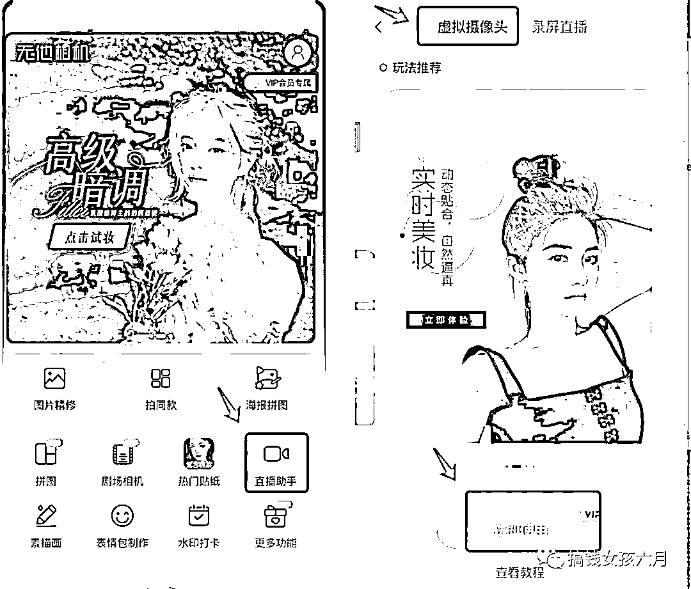
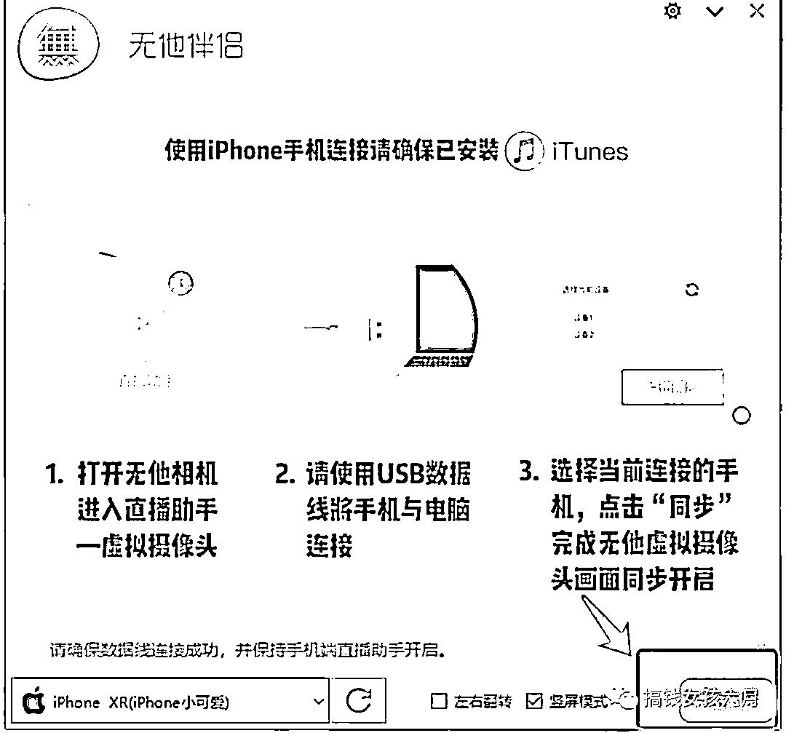
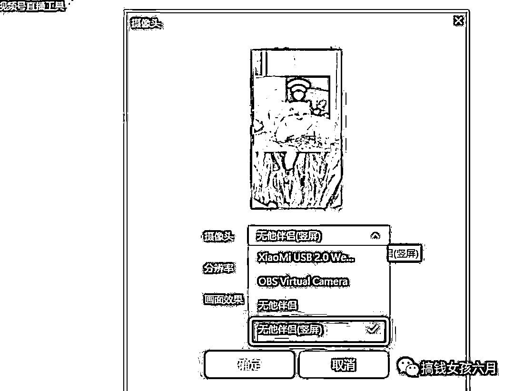

# 视频号直播，怎么利用手机做摄像头进行直播？

> 原文：[`www.yuque.com/for_lazy/thfiu8/qdm7uhsug2ztoumz`](https://www.yuque.com/for_lazy/thfiu8/qdm7uhsug2ztoumz)

## (95 赞)视频号直播，怎么利用手机做摄像头进行直播？

作者： biubiu 六月

日期：2023-11-15

哈喽大家好，我是 biubiu 六月。

有没有小伙伴每次电脑开播都很苦恼摄像头画质垃圾都要死？

弄出来的直播贼拉胯！

今天分享的内容就是：如何用利用手机做电脑摄像头？让你的直播画面嘎嘎美丽！

保姆级教学，学不会你揍我！

**首先你需要准备一台 window 电脑和一台手机。**

1.手机下载一个无他相机，认准图标，千万不要下错了。

2.下载好后，点立即使用。

3.看到这行字后，就打开 window 电脑，下载无他伴侣。

无他伴侣官网：[`www.wuta-cam.com`](https://www.wuta-cam.com)

4.下载好后，打开无他伴侣，把手机和电脑连在一起。

连上就是这个样子，很简单。

但是很多人在这一步会翻车。

会发现手机连上电脑后一点反应都没有。

**连不上都是这几种原因**

1、苹果手机没有下**itunes**（插上手机后他会提示让你下载的，跟着步骤走就行）

2、安卓手机没有打开开发者模式的**usb 调试**（这个看下方🫡有教程）

3、数据线接触不良（大部分都是这种情况，换条线就好了）

如果你还是不会操作，可以进入这个网站查看解决方法。有视频教学。

[`articles.wuta-cam.com/activity/community-activity/index.html#/helper`](https://articles.wuta-cam.com/activity/community-activity/index.html#/helper)

5.电脑和手机连上后，点击同步就 ok 啦。这时候你的手机就已经成为了你的摄像头了，手机画面一动，电脑上面无他伴侣的画面也会跟同步着变动。

恭喜你，看到了这里你已经学会了怎么用手机做摄像头啦！

**那么怎么把这个摄像头接入到视频号呢？**

1.首先打开微信，点击视频号直播。

2.直播这里摄像头选择，无他伴侣（竖屏）

3.弄好后就是这样的效果啦，是不是嘎嘎简单！

ok 以上就是本篇教程啦！

感谢你的观看！

* * *

评论区：

小花 : 能绿幕吗[呲牙]
气泡 : 可以绿幕，绿幕需要搭配 obs,不过这个都要开无他相机的会员才能用
生财小苗哥 : 实用
侯哥 : 可以用直播加加 直接手机播

* * *