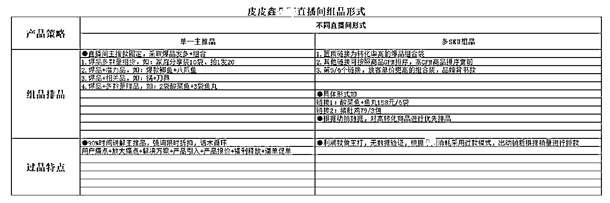

# 付费投放模式下的货品组建与投放策略

> 原文：[`www.yuque.com/for_lazy/thfiu8/yxidk5gks6gogxz6`](https://www.yuque.com/for_lazy/thfiu8/yxidk5gks6gogxz6)

## (23 赞)付费投放模式下的货品组建与投放策略

作者： 皮皮鑫

日期：2023-11-15

生财的小伙伴大家晚上好，感谢生财，很高兴能跟这么多做视频号的小伙伴交流微信视频号的玩法。

先做个自我介绍：

大家从去年开始许多朋友，都在陆续入局视频号，视频号就像大家眼中所谓“风口”一般，但事实真是如此吗？所谓的风口不一定是你的风口，我从去年 11 月开始入局视频号，也是抱着这样的心态进去，然后亏损的一塌糊涂，后面经过调整方向及方式才出现了业绩的上涨。

因为我也是从抖音过来的，已具备抖音的实战经验转型到视频号上，本借着已有经验去做视频号，发现行不通，以至于踩了很多坑，那么我将开始今天的分享，希望能帮助大家有所收获。

视频号让你的生意减少焦虑，它确实如此
大家都觉得视频号是风口，每个人都在说这个话题，但真相是这样吗？不止于此，视频号的整个阶段的状态跟它的实际我们实操过后感受到的优势，视频号现阶段三大优势：
①成本低：用户可重复触达
②隐私强：数据相对隐藏
③利润高：综合利润可观，相对在这个平台不需要怎么付费都可以获取很多精准流量。
现在去入局视频号在平台流量这么大的情况下去做，可以将各个平台导私到私域;链路短，价值高（价值高意味着用户忠诚度高、消费力高、可持续触达用户）。
目前视频号适合的三类人群：
①有品牌：传统线下品牌，强产品力白牌
②有私域：有私域运营力，有私域用户量
③有时间：宝妈、退休银发、大学生、农村轻创业都比较适合。

视频号对于抖音玩家而言简直就像开卷考试一样，不管做没做过抖音，现在来做视频号，就像提前拿到了财富剧本。

我们大可把抖音赚钱的路子再到视频号再重复做一遍就行，一样能赚到大钱。

下面我就直接开始分享了~

那应该选择怎么样的品才适合在视频号投付费呢？首先我分这几点跟大家聊一下。

①听觉通过视频感知---例如无线麦；
②味觉通过视频感知---例如蛋黄酥；
③触觉通过视频感知---例如踩屎鞋；
④功能通过视频感知---例如假发；
⑤量大通过视频感知---例如饮品；
⑥颜值通过视频感知---例如礼物

①福利款：作用在于冷启动打标签，带动成交流量；
②利润款：作用在于创造直播利润，测试直播爆品；
③战略款：作用在于奠定价格锚点；
④赠品款：作用在于要与主推款不冲突，甚至形成相关效应，促进正价地款成交。

①发挥资源：利用已有人脉找品、圈子找品、六度人脉花钱找品；
②借鸡生蛋：有现货播现货，无现货找代工，不到万不得已不自主生产；
③矩阵打品：不要依赖单个品做微信豆纯付费，选品能力不足，本身就是博概率，也可以依赖蝉妈妈这些第三方工具去看看别人的产品利润佣金如何，再到阿里巴巴对比一下拿货成本，有没利润。

许多人在投放过程中会遇到各种投放问题，其实许多原因在于没投过太多金额，自己投出去没底，就像投个一两百觉得没效果，就放弃了投放，还怪系统的流量不行，最核心的是没有整体性投放规划目标。我们在做视频号投放的过程中，自己最好做个表格，怎么投放，每一阶段的投放方式又如何调整等等，先记下来，如果实在不懂的时候找个投放过的人多问问，好过自己慢慢踩坑摸索。

初期建议大家多投放微信豆，ADQ 就不要先写着投放了，我们自己投放 ADQ 的效果也不太好，我们高峰微信豆投放会去到一千万的消耗体量，从大量投放数据的实操经验告诉大家。

总结：投放前期追时机，中期追叠投，后期追数据。

①准备往期爆款，或者同行爆款拿出来做成交密度；
②短视频拍摄爆款带货作品：用爆款视频来打标；
③直接微信豆付费建模：开场即投放；直投直播间；小额多笔叠投；自定义人群投放；直播间成交。

介绍下视频号目前常见的几种起号方式：

我们自己大几百万的账号直播间，目前是采用三频共振的操作方式：纯付费拉+自然流+短视频，我的起号方式只能做大家参考，每个人的起号方式有所不同，它涉及到团队的能力占比，你有什么能力就用什么起号方式。

今天的分享到这了，朋友们，关于这部分有疑问欢迎群内提出交流~

* * *

评论区：

挖哈的阿抓 : 猛呀，怎么加您

* * *