# 小红书不变现？用 3000 个人设号精细拆解变现模式，带你看到更多赚钱机会

> 原文：[`www.yuque.com/for_lazy/thfiu8/hylp9co0lrki8ybm`](https://www.yuque.com/for_lazy/thfiu8/hylp9co0lrki8ybm)

## (118 赞)小红书不变现？用 3000 个人设号精细拆解变现模式，带你看到更多赚钱机会

作者： 梨云

日期：2023-11-17

圈友们好，我是梨云，一个内容创业者。

随着小红书的玩法不断被开发，出现了越来越多看不懂的商业模式。

你会看到有大量的号，明明一直在长期更新，却找不到变现的痕迹。

笔记里的广告找不到，群聊也不挂，店铺也不开，直播也不上。

之所以会出现这种情况，是因为自己目前接触的信息，不够高效，分析框架的更新，不够迅速。

分析不出，或者完全不分析账号的变现闭环，就上手对标，很容易导致账号做起来了，无法变现的情况，想起曾经我做了 1w 粉的心理学号 0 变现的黑历史……这是新手最容易走的弯路。

同时，也很容易错过那些，因为看不懂但是很赚钱的商业模式，也就是常说的，赚不到认知以外的钱。

为了让大家抓住小红书变现的更多机会，今天，梨云和大家分享，如何一步步拆解小红书常见和罕见的变现模式，在起号找对标避坑的同时，提升你的商业分析能力。

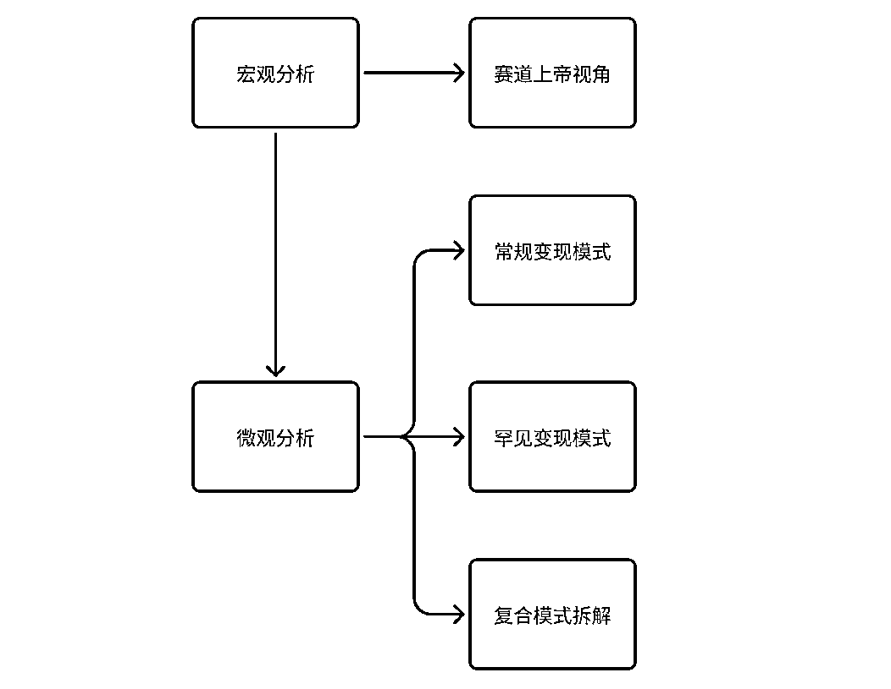

## 数据获取以补足必要信息

这次，筛选了 5 千至 5 万粉有持续更新的强人设博主，导出 3000 条数据。

之所以勾选人设，是因为它是做定位最快的切入口，对小白友好，你可以直接基于自己的专业能力、经历，去对应的赛道输出内容。

你会看到分类里面，除了有专业，还有兴趣圈子，以及家庭身份，我之前说过，不是非要专家，有多牛逼，才能做 IP，只要你做成某件事，有过成功经验，就可以做。

拿到数据后，单刀直入地去分析变现模式，却发现这些账号，全是品牌合作人，也就是说，全员接广告变现，难道这么巧，3000 个博主全是恰品牌的饭？

我随便挑几个账号，点开主页后，就发现，有的开店，有的引流，有的还直播带货。

怎么才能分析到这些变现模式？这就需要我补齐它的数据，才能进行更深入的分析，为什么很多人分析数据看不出所以然，就是数据类型获取的太少了。

我也总不能挨个点开，这样效率太低了，就思考怎么批量拿到这样的数据。

**常规的变现模式，都是明显的有迹可循：**

接广变现：数据平台可见是否为品牌合作人。

店铺变现：主页是否开了店铺。

引流变现：主页是否有群聊。

直播变现：主页是否有直播入口。

我们已经知道，这些博主都是接广变现打底，同时，后面三种变现方式的线索，又集中在账号主页，那么，只要我能够批量获取主页中的这些关键词，就可以快速判断它的变现模式了。

下载 MuMu 模拟器，可以让小红书主页在电脑端呈现出来。

当做完上述动作，我意识到，它是重复的，既然是可以重复的，那么也是可以自动化的。

因为没有直接爬取数据的牛逼编程能力，所以只能曲线救国，用 rpa 来代劳。

但 rpa 没有眼睛，怎么获取群聊、直播和店铺的关键词，来填入表格做统计呢？

就在一筹莫展时，在微信回了个消息，懒得手打图片里面的字，使用微信截图转文字，提取句子复制的时候，突然灵光一闪！

这套操作，可以为 rpa 赋予识别关键词的能力！

于是，我给八爪鱼 rpa 设计出了这样的流程：

暂时无法在飞书文档外展示此内容

在实现的过程中，有 4 个细节点要说一下：

1、为啥用八爪鱼的 rpa，只是因为自己用它的采集器，产品比较熟悉些，看完一篇教程就 ok 了，非常好上手。

2、在我的设计流程中，主要是让 rpa 反复控制鼠标，移动到指定位置，执行操作。

这里非常依赖固定坐标参数，而你一旦改变模拟题界面大小和位置，鼠标不会跟踪，依然点击原来的地方，所有参数就需要重新设置一遍，我因此崩溃了 3 回后，设计了这样的壁纸。

3、小红书无法直接打开主页链接，要把链接输入到模拟器浏览器打开，然后自动跳转。

4、当需要对图文进行大量判断时，可以采用微信自带的提取文字工具，用了几千次并没有提醒，而且识别度也比较高。

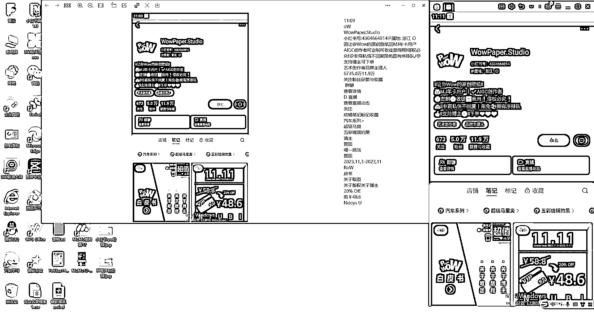

最后，为了方便大家使用它，省去自己构建流程的过程，我把 rpa 源流程分享出来，希望在高效处理数据这一块，能给你带来好的思路。

[`rpa.bazhuayu.com/shareableLink/654e3f410aea77cd5bd12b19`](https://rpa.bazhuayu.com/shareableLink/654e3f410aea77cd5bd12b19)

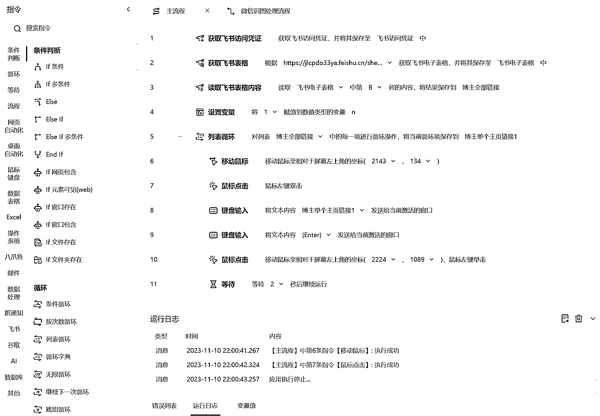

经过 3000÷150=20 小时的操作，终于把所需要的数据补齐了。

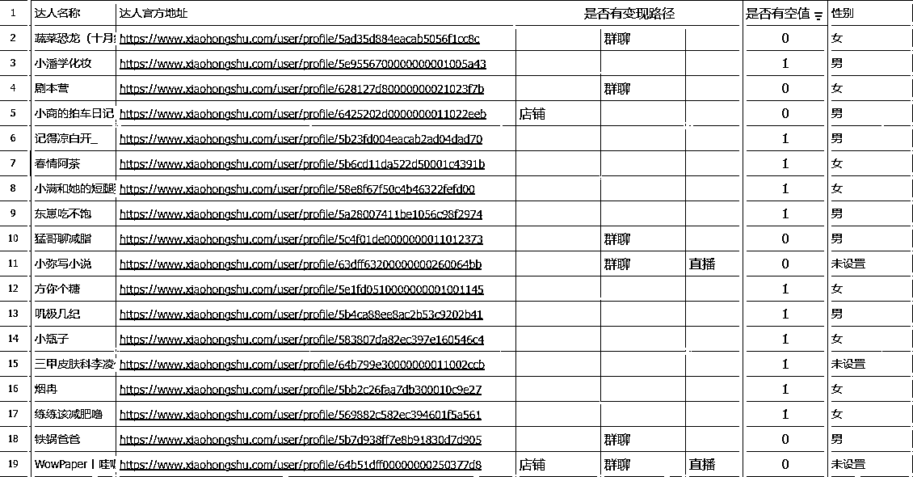

## 宏观分析先开启上帝视角

这次分析的逻辑，虽然核心是变现模式，但还是要从赛道开始，打开上帝视角，因为不能光分析变现模式，也要和自身优势、定位结合起来，才好落地。

我们把达人标签放入微词云，排出这个粉丝区间里，前 20 的热门赛道。

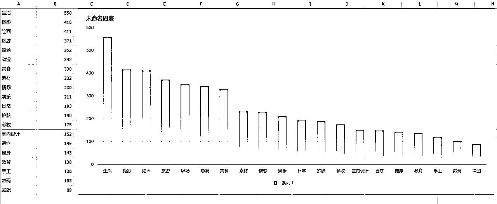

因为生活这个赛道太包罗万象，我们选摄影赛道来分析。

它不仅容易上手，而且可上干货可秀能力，亦是接广无限制的神奇赛道。

把摄影赛道的博主筛出来，对达人标签进行切分汇总后，得到更加细分的赛道分布图。

对前 20 进行清洗梳理，我们可以看到一个大致的赛道方向。

到这个程度，其实你已经可以大致判断，自己能否切入这个赛道了。

论摄影技能，人、景、物，有没有自己擅长的？

论摄影干货，你喜不喜欢，并且乐于分享它们？

如果回答是否定的，那么换下一个赛道，继续重复上述操作，找到可以切入的赛道。

如果回答是肯定的，那么，进入到变现模式分析，也就是你有能力做号做内容，也要看你是否能做到变现闭环。

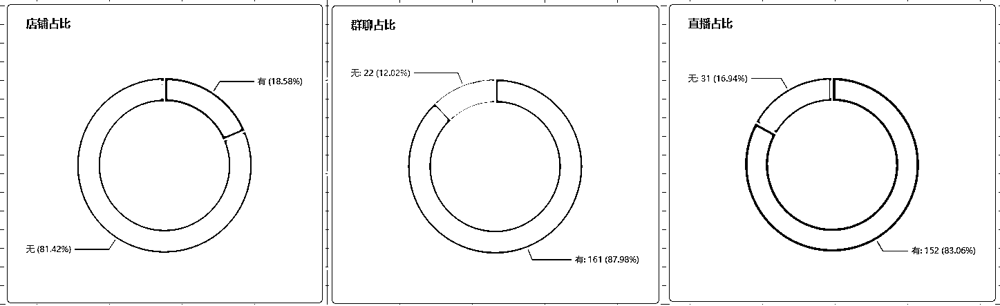

前面说过，这里的摄影博主，全都是品牌合作人，现在，另外三种变现模式的占比，也出来了。

接着，就可以进一步去分析它完整的变现模式了。

## 微观分析之常规变现模式

## 1.广告变现

有人说，知道他接广告变现，但就是找不到他接了哪些广告，这怎么办？

**识别广告，是自媒体人的基本素养。**

四个维度，锁定一篇笔记，有没有接广告。

图片中反复出现的产品，都是一个广告位，但需要注意的是，反复出现未必是广告，但广告就一定要出现。

文案区有产品卖点的详细介绍，一般品牌方都会有的要求。

标签打上了【乔丹儿童】，通过标签来认有没有品牌广告，是最快捷的。

评论区品牌有直接的反复推荐，言论维护也可以看出来。

在摄影赛道，接广类型，是不受赛道影响的，只要把图片拍的好看，产品植入其中，即可。

广告报价的基础一般是粉丝量的 10%，影响报价上下波动的要素，是更新频率、近 7 天数据、所处赛道、用户画像。

**更新频率**：如果断更了，那么很难接到广告，因为品牌方缺少判断投放效益的数据，就不敢找你合作，一周最少都要保持 2 更。

**近 7 天数据**：最近出了爆款，广告容易纷至沓来，这时候，你有议价底气，可以把价格报高。

**所处赛道**：越是品牌方预算充足的赛道，广告费也多，比如美妆护肤、保健食品。

**用户画像**：如果你的粉丝群体，和品牌方的消费者群体高度重合，它们会爱死你。

而粉丝不太符也合作，会成为对方砍价的切入口，这就是为什么账号内容要垂直发，只吸引一类精准人群。

如何写出爆款内容，我之前写过：[`t.zsxq.com/14ev8Jjgj`](https://t.zsxq.com/14ev8Jjgj)

## 2.引流变现

引流变现，不仅仅去学习引流技巧，还要去分析完成闭环的后端产品，自己是否也能做，或者找到后端代理。

**简介内容**：@小号做联动，更有风险的内容让小号来承接；小红书号就是微信号，简介引导加好友。

**小号置顶**：小号置顶内容为产品介绍。

**评论区**：不说私信，引导他们去看小号置顶笔记，安全系数更高。

**产品交付**：看自己能不能做，或者类似产品，因为他已经跑通了这个变现闭环。

比起评论区引导私信或者进群后发微信，这样的大小号联动布局，形成被动引流系统，非常值得学习。

这也是挖掘的意义所在，找到那些没有被公开用到泛滥的方法。

关于主流引流和违规处理，可以看：[`t.zsxq.com/14IwIj4Hu`](https://t.zsxq.com/14IwIj4Hu)

## 3.开店变现

非常容易就能在主页顺到店铺里去。

你可能没想到，连滤镜参数，都能拿来卖，可以看到，哪怕是在常规的变现模式下，你都会发现一些小众但是赚钱的需求。

再看摄影赛道人设 IP 类账号的选品，不管是产品还是服务，都是围绕拍摄这一关键词进行拓展，这个思维非常关键。

用户不会调色，要么上课程，要么直接卖调摄滤镜，用户看上照片里的穿搭，就买衣服，用户自己拍不出美美的自己，就约拍。

如果你想不到自己的赛道可以带什么货，就可以结合看看蓝海爆品怎么挖掘：[`t.zsxq.com/14Hiubmm7`](https://t.zsxq.com/14Hiubmm7)

## 4.直播变现

随着小红书对直播的扶持，红利也在渐渐开始。

虽然小红书店铺目前不是很完善，但是平台有系统免费的直播课开放给商家们。

小红书 App 直接搜索“商家课堂”，点击搜索上方入口，进入首页选择店铺直播板块，就可以自主学习了。

以上是账号案例变现环节的拆解，这里简单总结一下，它们都在用什么变现：

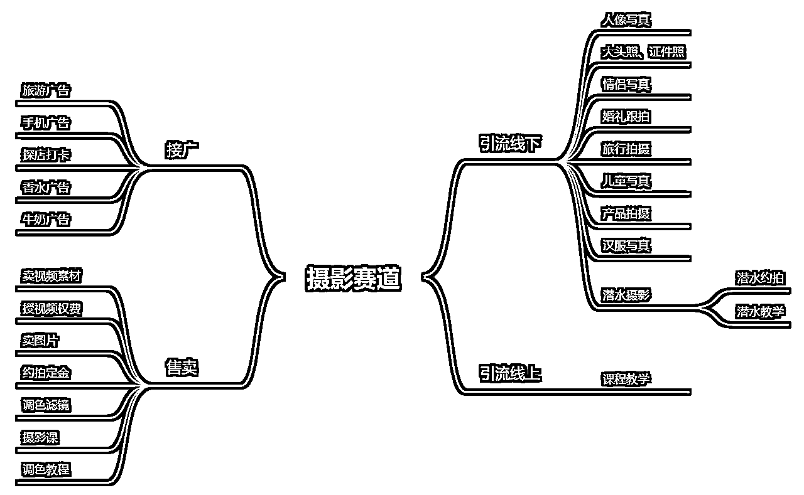

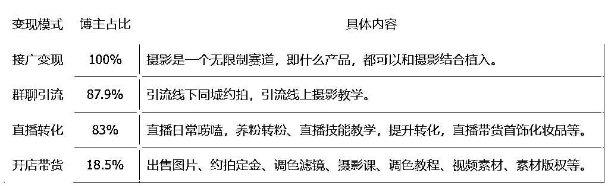

这波分析下来，你会发现，一个账号，其实是可以同时跑几条变现模式的，它们不是孤立的，而是相互赋能实现收益的多渠道增长。

这里，我在给大家总结梳理一下，三种变现模式的区别和联系。

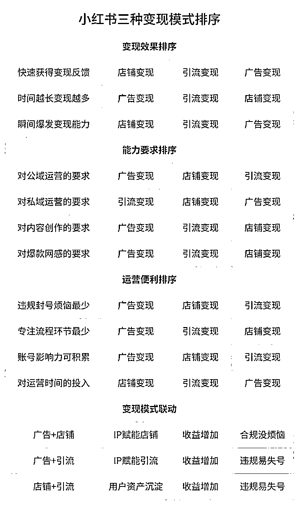

## 微观分析之罕见变现模式

那你肯定会问了，那不常规的变现模式，怎么找？

很简单，逆向思维，一个持续更新的账号，没有常规变现模式关键词：群聊、店铺、带货，就值得筛出来，深挖。

这里挖到的罕见变现，非常有意思，区别于常规的都往微信引流，它们的站外引流，是以另一个平台为主战场，把小红书作为拓客的流量渠道。

重要的不是他们怎么做的，而是我们怎么找的。

## 1.引流到咸鱼

简介、置顶笔记和评论区，是找到线索的核心关键，因为埋引流钩子的位置，也就剩这两个显眼的了。

这个账号，在简介留下全网同名的线索，但光是这个还不够，因为你不知道他主要的平台是哪个，一个个搜，效率太低了。

所以需要更多信息，置顶笔记没有明说，就只能从评论区入手，只要用户表达了“怎么拥有”的意向，也就能顺藤摸瓜了。

评论区挖掘，就是点开每一篇笔记，下拉去找。

## 2.引流到米画师

简介的全网同名，依然遇到不知道是哪个平台的情况，好在，他置顶笔记直接写出来了。

约稿 mhs，刚开始我也一脸懵逼，这是什么平台，但只要祭出万能的六字诀：“复制粘贴搜索”答案就出来了。

这是一个专门画画约稿的 app 平台，一幅画 1500，收益可还行。

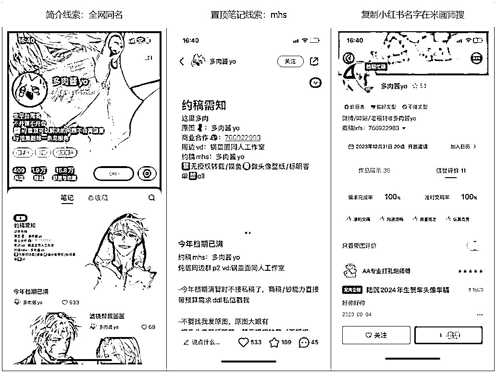

## 3.引流到淘宝

这个就比较简单了，简介已经明说。

这个玩法，适合业务在淘宝、京东有店铺，在小红书拓客的商家。

我们团队的电商业务，就是把小红书作为流量渠道。

## 4.引流到抖音

这个更简单了。

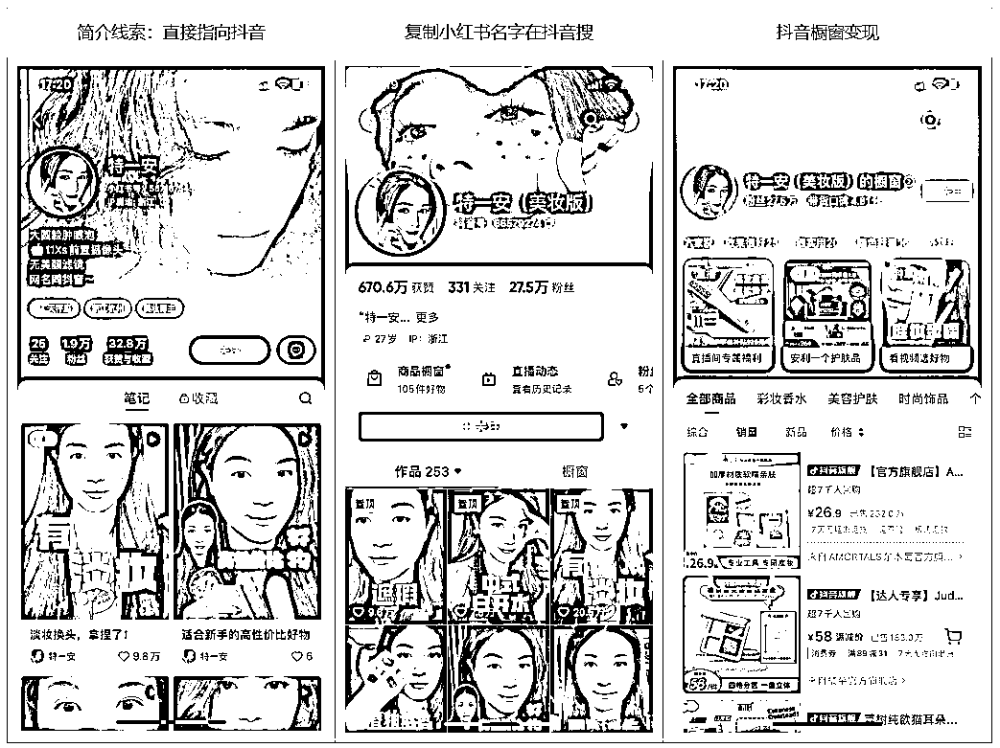

挖到这，我们还可以再逆向思维一下，把小红书当做主战场，从其他平台去分发引流，是不是也可以？

当你能够去梳理出一个账号的变现模式时，你就离做一个赚钱的账号，更进一步了。

这三千数据，只取一瓢饮，当然是不够的，肯定还有很多有意思的东西，值得被拆解，我把这些数据公开出来，大家可以自行复制分析。

[人设数据 3000 条](https://lvcj32c4z9.feishu.cn/sheets/KN4fsws7Ehktd2tZc4vcsSMonce?from=from_copylink)

## 复合变现模式全流程分析

如果你想直接切入自己想做的赛道来分析，该怎么做呢？

## **1.图文形式：AI 赛道**

直接在数据中，用你的赛道关键词进行筛选，比如 AI。

然后重点看变现模式这三列，如果你已经有产品，或者确定了变现模式，可以直接顺到对应的主页，如果没有，就顺道去分析那一种变现闭环的号，自己更容易上手

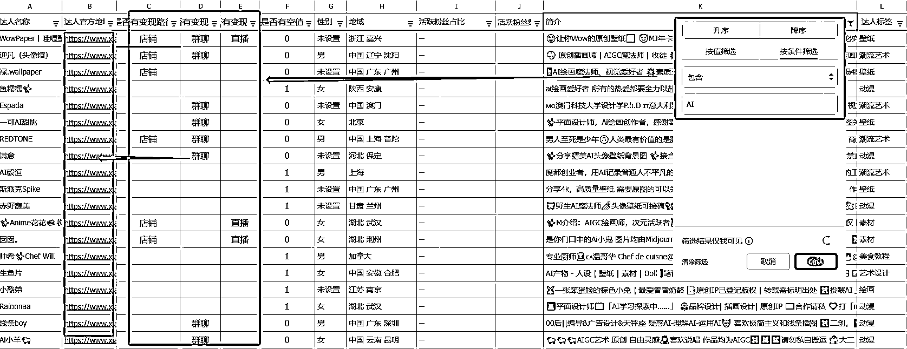

我们随便挑一个账号来分析，看到主页的瞬间，我就知道，这个博主不简单，变现渠道这么多。

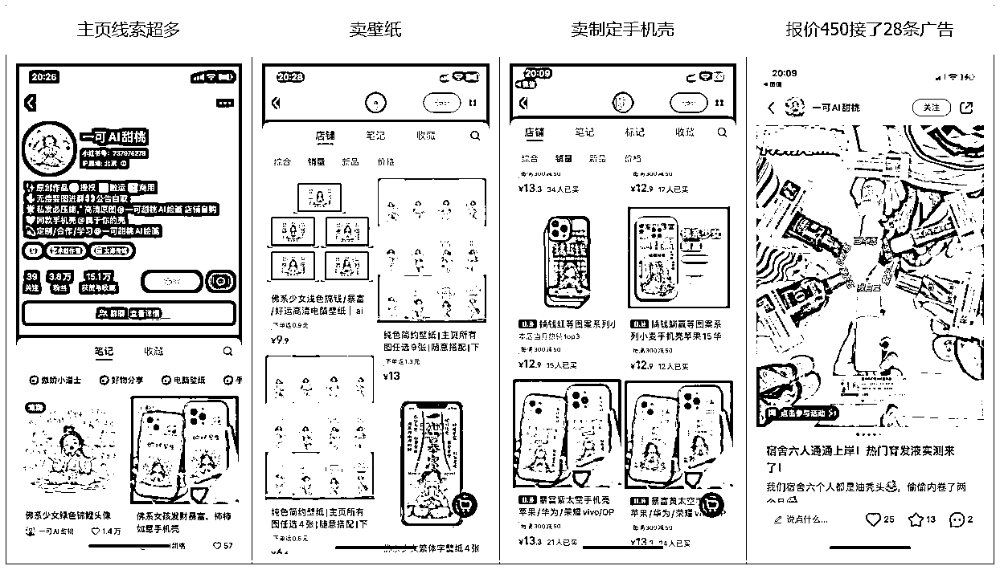

上面是站内变现，再来看看站外变现。

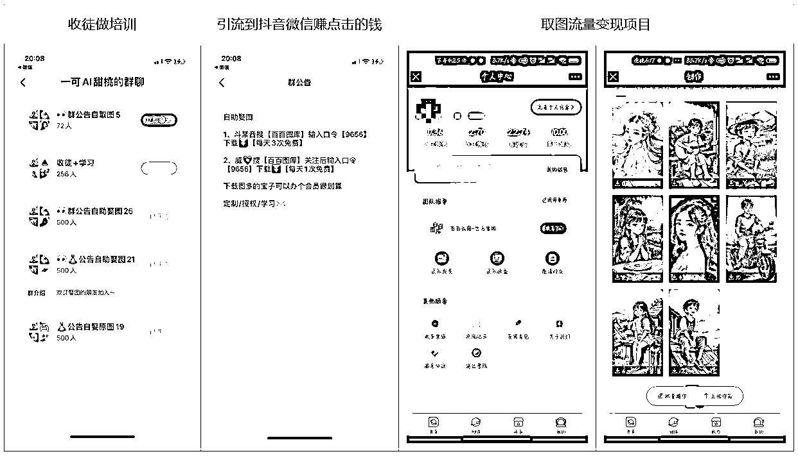

总结一下，这家伙，是把流量价值发挥的淋漓尽致。

一张壁纸，可以直接卖给你，也可以做成手机壳卖给你，什么？你想要免费的？可以，通过百百图库自取，抖音取一次我赚 0.35 元，微信取一次我赚 0.18 元。

作图能力，可以接你的定制，也可以收徒弟复制自己。

做这个账号沉淀的粉丝量和数据，又可以持续接广告。

把前面常规变现和罕见变现都结合了，收益 1w+，完全 0 成本，只要你会 ai 作图。

如果你正在做这类账号，上述没做到的变现渠道，可以安排上，增加收益。

变现模式得捋成这样，才叫分析完整了，你觉得自己都能做，那么接下来，就分析他发的内容，进行模仿起号。

**核心选题**：快速游览一遍他笔记的标题，你会发现，他有一个核心的选题：佛系少女。

我们把关键词放入小红书直接检索，发现，确实是爆款选题，并且也看到很多同行，说明这还算是一个比较赚钱的小红书 AI 项目。

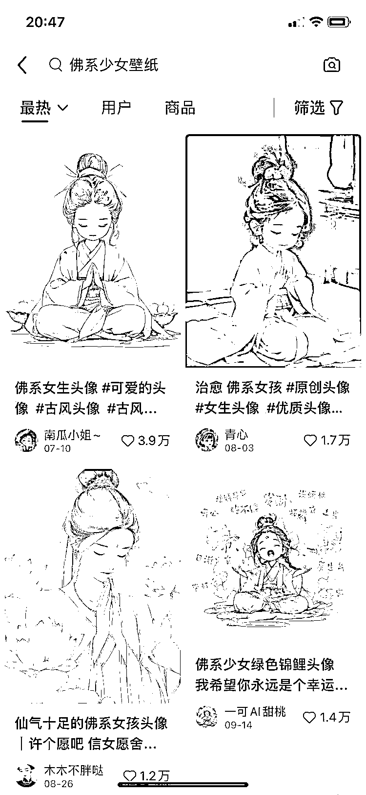

**图片内容**：人物形象是打坐的可爱女孩，不断地换衣服、外貌、色调、场景，遍布各种流行关键词：发财、吃不胖、锦鲤、上岸……

**图片尺寸**：不采用完全符合小红书格式的 3:4，而是有两种，正方形，是给用户做头像的，长方形，是给用户做手机壁纸的。

**文字区文案**：图是重点，所以文案简单，就一句流行句，或者干脆文案都不写了。

**评论区运营**：求图，就引导私信，或者关注，往群里拉。

AI 绘图+头像壁纸，关键就是找到更多爆款风格，进行批量化生产。

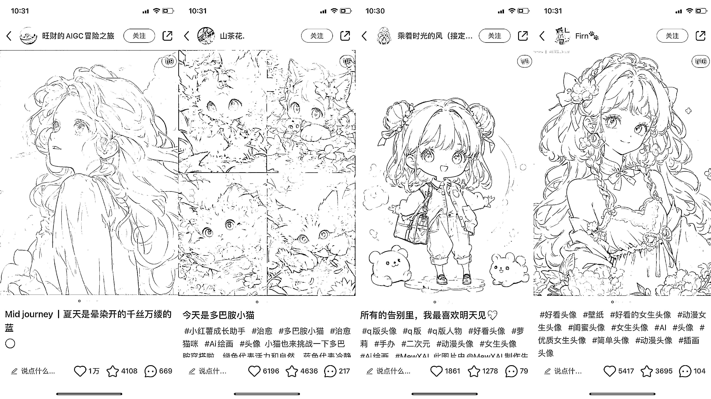

## 2.视频形式：宠物赛道

再来看看这个养猫的博主。

我查到的短脚猫客单价，在几千一只，有买猫需求才会去联系，来的流量也是比较精准的。

宠物赛道的变现模式就比较简单了，接广带货做引流，不过也有所启发，如果你是卖宠物的，把账号内容经营好，可以同时获取广告收益，而且这也是一箭双雕的事情，你把宠物拍出“太可爱了好想拥有”的感觉，不也是你所售宠物的优秀产品广告。

那你只是有个宠物呢，就得看你的野心了，追求小，就接广告带货，追求大，就去谈后端合作，自己负责流量端。

内容这一块，一般都是视频形式，才更生动，选题上，就是宠物吃喝拉撒睡互动的过程。

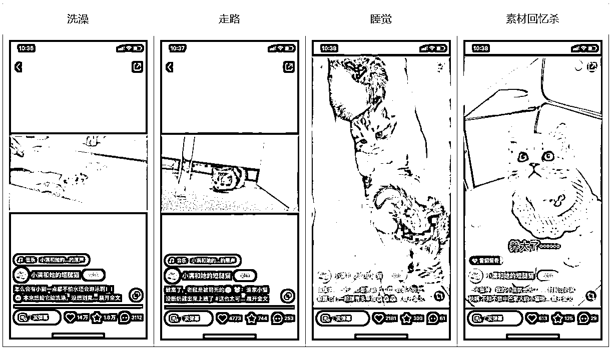

不仅仅是猫，只要是活体宠物，都可以套用这个选题框架。

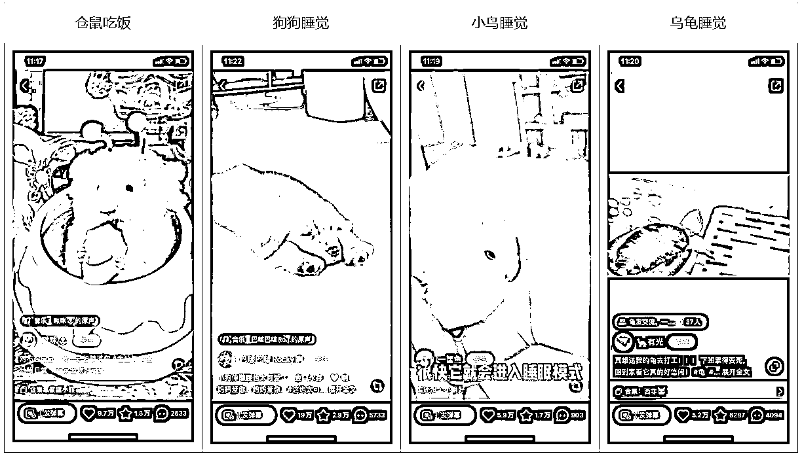

这个赛道，不是有宠物，就能成为赚钱的博主。

你要拍到有意思的镜头，是没有那么多随手拍可以满足的，需要策划，需要训练，甚至为了一个“宠物成精”的瞬间，去长久的等待。

你的宠物颜值必须过关，要么萌到死，要么帅爆炸，即便是丑，也得丑得有趣。

智商不做硬性要求，但精破天，或蠢穿地，都是十足的加分项。

分享当时我做出视频爆款的脚本框架，不用特别专业，只要你能往里面填清楚，视频就不会没头绪。

宠物赛道的收益比较可观，所以对应的，就是有一些门槛。

**不要总想着轻轻松松，就能有简单无脑持续好赚钱的项目。**

从经济学对市场分析的角度来说，一个项目上手门槛低，又赚钱，就会导致一群人的蜂拥而至，在恶性竞争中，把市场的利润无限压低。

比如曾经的小红书群禁言方法论，随着入场人数的增加，消费者的货比三家，仅仅 2 天时间，价格就从 99 块卖到 9 块 9，最后变成配合夸克网盘拉新免费送。

## 小结

以上，就是分享的全部内容。

按照这样的一套框架分析下来，你要对标起号，整个流程就非常清晰了，也绝对不会踩“号做起来了不变现”的坑。

世界上并不缺少美，同样，你身边也并不缺少好项目，而是缺少发现好项目的洞察。

我直播拆解过近百个风向标，也用风向标挖掘过 1000 个项目，通过风向标多赚过几千块，越来越深刻的体会到，想要在蓝海里赚钱，就得学会搜索，学会挖掘。

去筛选 100 个小红书风向标，拆解出完整链路的项目手册。

去收集 100 个批量化效率工具，汇总拿到市场上来卖一卖。

去找到 1000 张优秀营销海报，分析它对用户需求的挖掘。

去采集 1000 条公众号推文底部广告，什么项目在持续赚钱。

**每一个赚钱的新机会，都没有现成的“航海手册”，你得学会自己去动手。**

今天的小红书分享就到这里，里面案例很有意思，希望能给到大家一些启发和帮助，坚持下去，你一定会有所收获。有帮助的话，记得点个赞哦~也欢迎交流+v：lyy520061

更多小红书干货，可以关注公众号：梨云读书

**往期精华文章推荐：**

《小红书三个月涨粉 17w，变现 10w+，我做对什么？》

[`t.zsxq.com/07Fqr3jQ7`](https://t.zsxq.com/07Fqr3jQ7)

《小红书 60 天用原创拿下 20 多篇 10w+，如何流程化创作爆款内容？》

[`t.zsxq.com/09ev8Jjgj`](https://t.zsxq.com/09ev8Jjgj)

《在小红书上，如何挖掘出 1000 个适合普通人的赚钱项目》

[`t.zsxq.com/0eRD32jY6`](https://t.zsxq.com/0eRD32jY6)

* * *

评论区：

洺 : 云云出品，必属精品！[嘿哈]
徐宿 : 非常深度，这篇文章，不只是小红书可用，其他平台也可以迁移通用，里面的数据分析、整合利用等思维价值百万
梨云 : 底层逻辑被捉到了[社会社会][社会社会][社会社会]
梨云 : [咖啡][咖啡][咖啡]
倪大胖 : 又来了又来了，等我拿下眼药水，哈哈。
梨云 : 还有保温杯满上～[啤酒][啤酒]
蚂蚱有计 : 小红书被你玩出追不上的档次了[微笑][微笑]
袁圆 : 超级干货，要学习三遍以上

* * *